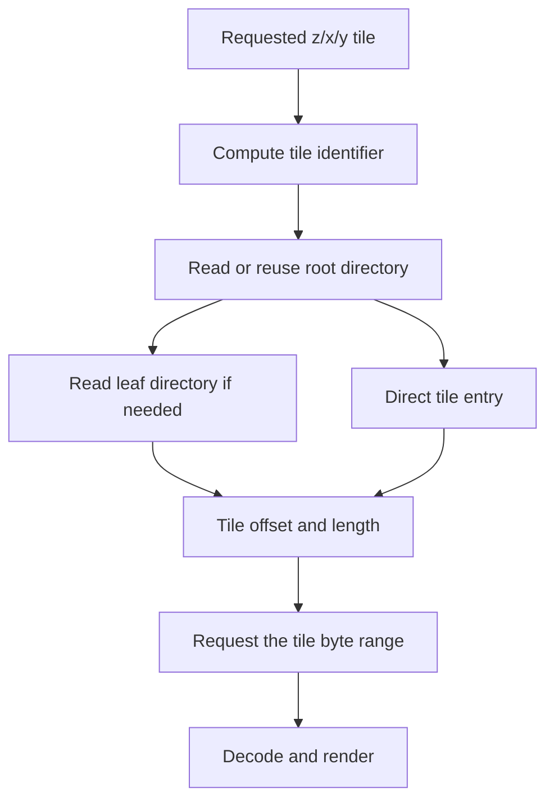
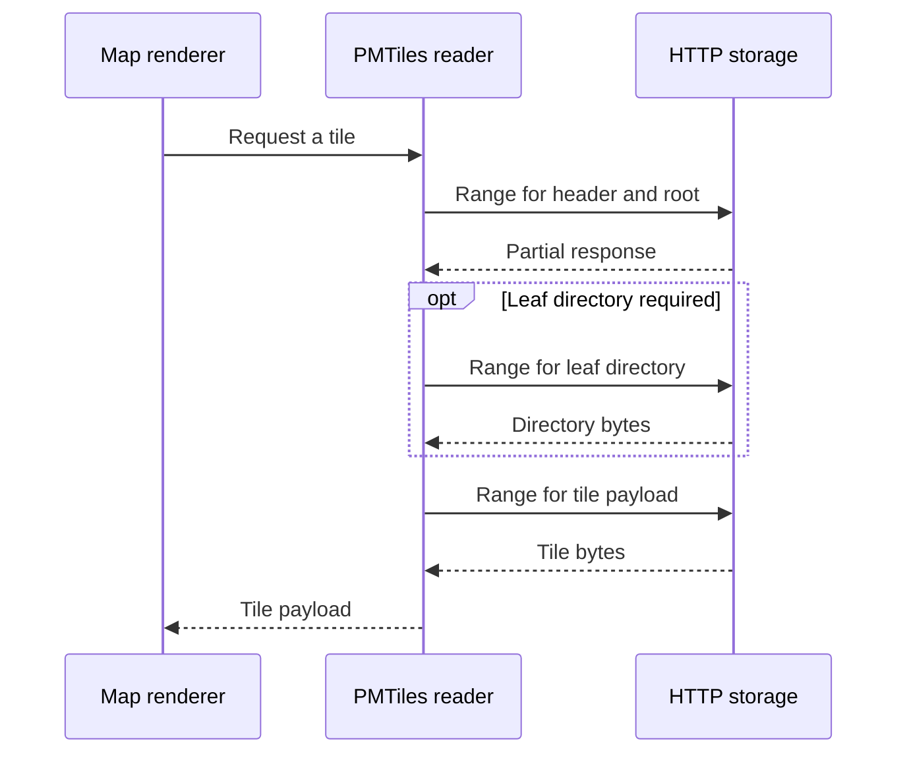

There is a surprisingly expensive way to put a mostly static map on a website.

Import the data into a spatial database. Put a tile server in front of it. Package both. Configure connection pools, health checks, caching, backups, and deployment. Then discover that the dataset changes once a month and almost every request asks for something you could have prepared yesterday.

Every component in that architecture can be justified. Together, they may be answering a harder question than the product asked.

This is what interests me about PMTiles. The useful idea is moving repeatable work into a preparation step, then giving the browser enough information to find the prepared result. The file becomes part of the serving architecture. Its internal organization decides how much infrastructure you need around it.

Imagine a public map of building footprints in a Brazilian city. People pan, zoom, and click on buildings. The dataset has periodic releases. They need an interactive view, and the application needs a manageable way to distribute it. That is the problem I want to start with.

## Short answer

PMTiles stores a pyramid of map tiles in one indexed archive. A reader uses HTTP range requests to retrieve selected portions of that archive, including the directories needed to locate individual tiles. For prepared, periodically updated layers, this allows a browser to read from object storage without a dedicated dynamic tile-generation service. The work moves into artifact creation, publication, and caching. Updates, analytical queries, and authorization still need their own decisions.

## Key takeaways

- A map's serving architecture should follow its query shape and update frequency.
- The archive index lets the client translate a tile address into a byte range.
- Tile generation remains real work, even when it happens before users arrive.
- An immutable archive URL makes cache behavior and releases easier to reason about.
- A displayed tile is a visualization product. Keep the original geometry when the application also needs analytical answers.

## Start with what the browser asks for

A slippy map does not normally ask for every feature in a city at once. It divides the visible world into a grid at each zoom level. A tile address has three coordinates: zoom, horizontal position, and vertical position, usually written as z/x/y.

At a higher zoom, the browser requests a more detailed part of that pyramid. During a pan, it needs newly visible tiles. This creates a fairly predictable access pattern: small pieces of a much larger prepared dataset, often near pieces that were requested just before.

That shape matters more than the fashionable name of the storage system.

If your endpoint renders the same tile from the same data for thousands of users, you have an obvious opportunity to reuse the result. You can generate on demand and cache it. You can generate the whole relevant pyramid ahead of time. You can combine the two. The right choice depends on how often the input changes and how much of the pyramid people actually visit.

For our building map, assume the useful zoom levels and display attributes are known. We can prepare those results once per data release. The remaining problem is locating and delivering them efficiently.

The [PMTiles concepts documentation](https://docs.protomaps.com/pmtiles/) describes an archive designed for exactly this tiled access pattern. It supports different tile payloads, including vector and raster data. Here, I will keep the example to vector tiles.

## The index is the architecture

Putting every tile into one enormous file would be fairly useless if the browser had to download the whole thing before displaying the first street.

The archive needs an index that answers a small question: where are the bytes for this tile?

The [version 3 specification](https://github.com/protomaps/PMTiles/blob/main/spec/v3/spec.md) defines a fixed header, a root directory, metadata, optional leaf directories, and tile data. Directory entries associate tile identifiers with offsets and lengths. Tile identifiers follow cumulative positions on Hilbert curves, providing a one-dimensional ordering for two-dimensional tile coordinates.

<div className="overflow-x-auto" tabIndex="0" aria-label="Technical diagram, scroll horizontally on small screens">
<div className="min-w-[640px]">



</div>
</div>

*The reader performs an indexed lookup. Cached directories can eliminate intermediate reads.*

The Hilbert curve deserves a little intuition. Imagine drawing a path through a grid so that nearby positions along the path tend to remain spatially close. That gives the writer a useful ordering for arranging tiles. It does not make every geographic neighborhood one uninterrupted byte range, and it does not remove the need for directory lookup. It helps organize a spatial problem for storage that is addressed linearly.

I like this example because it makes a data structure visible at the architecture level. Indexes are often discussed as something a database does internally. Here, the index travels with the artifact, and the client knows how to use it.

The server can have a much smaller responsibility: return the requested bytes correctly.

## Follow one cold request

Suppose the browser has never seen this archive before. It needs the header and directory information, then the tile data. Some lookups may require a leaf directory. Once this information is cached, neighboring or repeated requests can reuse it.

The following is a conceptual sequence. It shows dependencies, rather than promising a fixed request count for every library version or archive.

<div className="overflow-x-auto" tabIndex="0" aria-label="Technical diagram, scroll horizontally on small screens">
<div className="min-w-[640px]">



</div>
</div>

HTTP already has the mechanism. A request can include a `Range` header, and a successful partial response uses status `206` with `Content-Range` describing the returned interval. The normative details live in [HTTP Semantics, range requests](https://www.rfc-editor.org/rfc/rfc9110.html#name-range-requests).

For a local inspection, the request might look like this:

```bash
curl -sS -D - -o /dev/null \
  -H 'Range: bytes=0-16383' \
  http://localhost:8080/buildings.pmtiles
```

The local server must actually support ranges. A successful full-file response with status `200` does not demonstrate that the range was honored. Check the status, returned interval, and response length.

This is also where a useful distinction appears. Bytes requested by the application, bytes transferred over the network, and bytes retained by the client are different measurements. Compression, caches, directory reuse, and decoded objects affect different parts of the path. Calling all of them “map size” makes debugging unnecessarily confusing.

## Connecting the archive to a map

The browser integration is small because the reader owns the archive-specific logic. With MapLibre, the PMTiles library registers a protocol handler. The map source then points to an archive URL using that protocol.

```typescript
import maplibregl from "maplibre-gl";
import { Protocol } from "pmtiles";

const protocol = new Protocol();
maplibregl.addProtocol("pmtiles", protocol.tile);

const buildingsSource = {
  type: "vector" as const,
  url: "pmtiles://https://maps.example.com/buildings-v1.pmtiles",
};
```

This is the source integration, not a complete map application. The archive must exist, the map needs a container and style, and the style layers must reference the actual source-layer names written into its vector tiles. Register the protocol once at the appropriate application lifecycle boundary. The [official MapLibre integration guide](https://docs.protomaps.com/pmtiles/maplibre) covers that wiring.

Notice where the responsibilities end. MapLibre decides what to display and requests tiles. The PMTiles reader resolves those requests into archive reads. HTTP storage delivers byte ranges. The process that produced the archive has already decided which features and attributes are available.

That last decision is easy to overlook. A property that never entered the tile cannot suddenly become available because someone adds a filter control to the frontend.

## The build pipeline becomes part of the product

Moving work earlier gives you a build artifact to manage. It also gives you a useful place to validate the data before anyone sees it.

For the building layer, I would keep the source release identifiable, choose the displayed attributes deliberately, generate a bounded zoom range, and validate the resulting archive. I would inspect a few known locations, including the data boundary, dense neighborhoods, and areas with unusually large geometries.

Those checks answer different questions. A structurally valid archive can still use the wrong coordinates. A correctly located layer can still omit a property required by the style. A beautiful screenshot at one zoom can hide aggressive simplification at another.

The release should record enough information to reproduce those decisions: input identity, tool versions, generation options, and the output checksum. This is the same operational instinct behind [Backups Are Not Snapshots](/blog/backups-are-not-snapshots). An artifact becomes useful when you can explain what it contains and how to use it, not merely when a file exists somewhere.

A reasonable publication sequence is to upload a new versioned object, validate reads through the serving path, and only then update the application's reference. Keep the previous version while it can still be requested by old clients.

This gives rollback a concrete meaning. Restore the previous reference. You do not need to reconstruct yesterday's map while users are waiting.

## Updating a file is a release operation

PMTiles archives require rewriting for updates. That makes an archive a good fit for stable releases and a less natural fit for a stream of individual edits. The update constraint is part of the format's documented design, and it should appear in the architecture decision before the first upload.

I would avoid repeatedly overwriting `buildings.pmtiles` while clients and intermediaries may still hold directory information from its previous contents. Readers have mechanisms to deal with archive changes, but an immutable URL removes a whole class of questions about which version an offset belongs to.

Use a release identifier or content hash in the object path. Give that object an appropriate immutable caching policy. Give the small configuration that points to it a different policy, because that reference is expected to change.

There is still an overlap period. Someone with an old application tab may keep requesting the older archive. Someone opening the page after publication may receive the new one. Decide whether that is acceptable for the layer. For a periodic public building release, it probably is. For a live operational boundary, it might be unacceptable.

Update frequency is therefore a product requirement with storage consequences. “We can rebuild it” is only meaningful once you know how quickly the new version must become visible.

## Caching needs an actual experiment

Object storage and a CDN are useful ingredients. Their names are not evidence that the exact range access pattern is cached the way you expect.

Cross-origin requests also need the appropriate CORS configuration. The [PMTiles cloud-storage guide](https://docs.protomaps.com/pmtiles/cloud-storage) documents range support and the request and response headers its clients need. CORS controls what a browser may access across origins; it does not make a public archive private.

I would inspect one cold visit and one repeat visit using the same pan-and-zoom sequence. Record the archive identity, browser, connection conditions, requests, transferred bytes, and the point at which the chosen viewport is fully drawn. Avoid comparing two runs that visit different zoom levels and then crediting the difference to caching.

For a service comparison, keep the tile payloads equivalent. Otherwise you may be comparing a smaller, more aggressively simplified map against a detailed one. Include archive-generation time separately, because precomputation belongs in the cost model even when it improves the user-facing path.

These are measurements to collect, not a promise of a particular speedup. A longer chain of dependent range requests can lose to a nearby tile endpoint on latency. A well-cached archive may be perfectly adequate for a modest application. The useful question is whether the actual path meets the product's needs.

## The map and the analytical dataset have different jobs

A vector tile is prepared for display at a particular scale. A tiling pipeline may clip geometries, simplify boundaries, drop attributes, or omit features to control density. Features can appear in multiple tiles.

That is convenient for rendering and dangerous if someone quietly treats rendered features as a complete analytical table.

If the user asks how many buildings intersect a service area, answer from a source designed for that query. Keep stable identifiers where useful, and make the connection between the displayed feature and its source explicit. A click can open a details API even when the base layer comes from an archive.

This is where the next question begins: [how should we organize the source dataset so the query reads less data?](/blog/geoparquet-spatial-locality-and-query-pruning) Tile delivery and analytical filtering can share inputs without sharing the same representation.

## Where I would keep a service

Frequent transactional edits, tenant-specific access, arbitrary filters, and server-side analysis can justify a serving layer. So can a latency requirement that benefits from a different caching arrangement. A mixed architecture may have a prepared public base layer and a small authenticated service for live features.

The mistake would be choosing either architecture as an identity. Being the person who runs everything in a database is expensive when the workload is static. Being the person who insists everything is a file is expensive when the workload needs transactions.

I would decide from four facts: what users request, how often the data changes, how fresh the answer must be, and which information each user may read. Then I would measure the path that follows from those facts.

For a stable map layer, an indexed archive can remove a surprising amount of runtime machinery. The engineering work remains visible in the data build, the release process, and the serving contract. That is a trade I am happy to make when the product's requirements support it.
