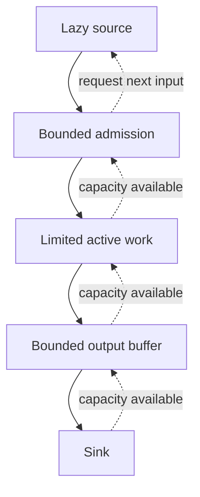

There is a kind of data pipeline that passes every happy-path test and then dies the first time a database has a slow afternoon.

The reader is fast. The transformation is parallel. The writes are asynchronous. Everything looks like modern, efficient software. Then the sink slows down, promises accumulate, memory grows, and the process gets killed while still reporting that it is making progress.

Someone increases the memory limit. Someone else adds more workers. The next failure takes a little longer, or arrives even faster.

The missing question is how much unfinished work the process is allowed to own.

I touched on streams and workers in my earlier [Node.js optimization article](/blog/7-nodejs-optimization-tips-to-instantly-improve-performance) and [concurrency introduction](/blog/understanding-concurrency-and-multithreading-in-modern-software). Here, I want to go deeper into the accounting. A pipeline should have a defensible explanation for its memory behavior when the slowest part stays slow.

## Short answer

Bound memory by controlling admission, retained payload sizes, active work, and every buffer that can outlive one processing step. Backpressure must propagate from the sink to the producer before the producer creates more work. A worker limit controls active concurrency; it does not automatically bound pending tasks, retries, or completed results. Under sustained overload, the system must wait, reject, drop, or move backlog into another explicitly bounded store.

## Key takeaways

- Async execution does not make retained work disappear.
- Limit admitted work as well as active workers.
- Count bytes and payload expansion, especially when records vary in size.
- Treat retries, batching, and ordered output as real queues.
- Test slowdown and recovery, with throughput, backlog, memory, and latency on the same timeline.

## Start with the arithmetic of a slow sink

Suppose a producer offers 1,000 records per second and the sink completes 600. Assume records are accepted without a limit, none are dropped, and those rates stay constant for thirty seconds.

The backlog grows by 400 records per second. After thirty seconds, 12,000 records remain unfinished. This is an idealized rate calculation, not a runtime benchmark.

```text
arrivals    = 1,000 records/s
completions =   600 records/s
growth      =   400 records/s
```

If each retained payload is one KiB, those 12,000 payloads alone occupy about 11.7 MiB. That excludes objects, promises, buffers, batch structures, runtime overhead, and everything the application copied while processing them. Bigger records change the result proportionally.

Now restore the sink to 1,400 completions per second while arrivals remain at 1,000. The backlog drains at 400 per second, taking another thirty seconds. The system can be recovering while some users are still waiting behind old work.

<figure className="overflow-x-auto rounded-lg" tabIndex="0" aria-label="Calculated backlog chart, scroll horizontally on small screens">
<Image src="/images/articles/pipeline-backlog.svg" alt="Calculated backlog under a slow sink. Unbounded admission grows from zero to twelve thousand queued records over thirty seconds, then drains by sixty seconds. A two-thousand-record admission cap limits the internal queue and drains by thirty-five seconds after recovery." width="760" height="400" className="min-w-[640px]" />
</figure>

*Calculated queue model, not benchmark data. The bounded case pauses admission at 2,000 queued records. Deferred input remains at the source; the chart counts only the internal queue and omits active workers. Scroll the figure horizontally on smaller screens.*

A larger queue changes how long the process can absorb the mismatch. It does not change the sink's service rate. If arrivals remain higher forever, an unlimited queue eventually asks for unlimited storage. The code cannot negotiate its way around that arithmetic.

## The worker limit that still buffers everything

Consider an eager implementation:

```typescript
await Promise.all(records.map(record => processRecord(record)));
```

All records already exist in the array, and the mapping creates the work eagerly. If processing involves I/O, many operations can remain pending together. Their inputs and surrounding state may remain reachable until the work completes.

The next version often adds a concurrency limiter:

```typescript
await Promise.all(
  records.map(record => limit(() => processRecord(record)))
);
```

Assume `limit` runs only eight operations at a time but keeps every submitted task in an internal waiting queue. Active concurrency is now eight. Admitted work is still the entire array, plus the queued closures and promises.

This version may protect the database from too many simultaneous requests while still exhausting the application's memory. Both observations can be true.

The important API question is what happens when the caller submits more work than can run. Does submission wait before retaining the next payload? Does the library queue it? Does it reject it? Where is that queue, and what limits it?

“Eight workers” is an execution policy. We still need an admission policy.

## Account for everything the process owns

I would start with a memory ledger rather than a concurrency diagram.

```text
retained application memory approximately includes:
  source buffers
  + queued payloads
  + active worker inputs and temporary state
  + pending output batches
  + results waiting for ordering
  + retry payloads and bookkeeping
```

This is an accounting model, not a hard prediction of RSS. Memory allocators retain capacity, runtimes have their own state, and native libraries can allocate outside the ordinary object heap. Shared buffers also complicate attribution: a small view can keep a much larger backing allocation reachable.

The [Node Buffer documentation](https://nodejs.org/api/buffer.html) describes shared backing memory for buffer views. That is worth remembering when a pipeline keeps tiny slices of large input chunks. The visible slice length is not always the retained allocation size.

For each stage, write down the maximum number of retained items and how large one item can become. A parser may turn a compact input into a much larger object graph. A batcher can hold several records plus an encoded batch. A compressor has input, output, and internal state.

An item-count limit becomes a useful memory bound only with a payload-size assumption. Two thousand short metrics and two thousand large geometries are different budgets.

If the input is variable, establish a maximum record size or use byte-aware admission. Oversized records need an explicit path, such as rejection, isolated processing, or bounded spill storage. Without that path, one item can violate a carefully chosen count limit.

## Pressure has to travel backward

Data flows toward the sink. Capacity information needs to flow toward the source.

<div className="overflow-x-auto" tabIndex="0" aria-label="Technical diagram, scroll horizontally on small screens">
<div className="min-w-[640px]">



</div>
</div>

*Every stage needs a way to stop accepting work. A hidden unbounded queue breaks the capacity path.*

Node streams provide this feedback through their read and write contracts. The [stream API](https://nodejs.org/api/stream.html) documents `highWaterMark` as a threshold, rather than a strict memory limit. In object mode, that threshold counts objects. A large object can therefore occupy far more memory than the number suggests.

When writing manually, a `false` return value means the producer should stop submitting writes and wait for capacity. It does not mean the chunk was rejected and should be resent. The [Node backpressure guide](https://nodejs.org/learn/modules/backpressuring-in-streams) explains the `write()` and `drain` relationship.

Getting that wrong in either direction causes trouble. Ignoring the signal keeps buffering. Resending the same accepted chunk duplicates data. A control signal only helps when the caller honors its actual semantics.

## A small pipeline with visible boundaries

For a simple example, use a lazy source, a serial transformation, and a deliberately slow writable. This runs as an ES module on a modern Node.js runtime. The records are fixed-size, so the example can make its payload assumption explicit.

```javascript
import { Readable, Writable } from "node:stream";
import { pipeline } from "node:stream/promises";

function* records(count) {
  for (let id = 0; id < count; id++) {
    yield { id, payload: Buffer.alloc(128, 97) };
  }
}

let completed = 0;

const slowSink = new Writable({
  highWaterMark: 1024,
  write(chunk, encoding, callback) {
    setTimeout(() => {
      completed++;
      callback();
    }, 2);
  },
});

await pipeline(
  Readable.from(records(1000), {
    objectMode: true,
    highWaterMark: 8,
  }),
  async function* encode(source, { signal }) {
    for await (const record of source) {
      signal.throwIfAborted();
      yield Buffer.from(`${record.id},${record.payload.length}\n`);
    }
  },
  slowSink,
  { signal: AbortSignal.timeout(30_000) },
);

console.log({ completed });
```

The sink simulates latency and discards the bytes after its callback. It does not persist records, and the completion counter counts the chunks passed through this example. Its purpose is to make pressure propagation inspectable without involving a real database.

The source allocates records on demand. The transform yields output through the pipeline instead of creating a promise for every input. The writable acknowledges each simulated operation asynchronously. `pipeline()` coordinates the stream lifecycle and propagates errors; cancellation still requires any real external operation to respect the relevant signal or cleanup contract.

Notice what the example avoids promising. Eight source objects and a one-KiB writable threshold do not imply a process using exactly those bytes. There are active values, temporary buffers, and runtime allocations. They do establish named places where input can stop accumulating.

I would get this shape working before adding parallel transformation. Parallelism introduces more ownership and ordering decisions. It should solve an observed throughput problem, with those decisions stated explicitly.

## Parallel work needs bounded handoffs

Suppose normalization is CPU-heavy and needs workers. There are now at least three capacities to consider: input waiting for a worker, active worker state, and output waiting for the sink.

A worker that finishes must eventually hand its output somewhere. If that handoff uses an unlimited results queue, the input-side limit cannot protect the whole process. The completed results become the backlog instead.

The pattern also exists outside Node. Tokio's [bounded `mpsc` channel](https://docs.rs/tokio/latest/tokio/sync/mpsc/fn.channel.html) makes a sender wait when the channel lacks capacity. But spawning an unlimited number of tasks that each wait to send can retain unlimited payloads outside the channel. A bounded channel is one boundary in a larger ownership model.

Acquire admission before creating the task that owns the payload, or have a fixed population of workers pull from a bounded source. The exact implementation varies. The invariant is that waiting for capacity must not itself become an unlimited collection of retained work.

## Ordering and retries create queues too

Imagine eight workers finishing out of order. Record zero is slow, while later records complete quickly. If the output must preserve input order, those completed results have to wait somewhere.

A reorder buffer can grow even when the sink is fast. Bound the distance between the oldest unfinished record and the newest admitted record, or otherwise budget the retained output. Include timeouts and a policy for an item that never completes. “We preserve order” is a storage promise.

Batching adds another tradeoff. Larger batches may improve sink efficiency, but they consume more memory and increase the time an early record waits before submission. Flush by size and, where appropriate, by age. Account for any second buffer created during serialization.

Retries add their own waiting room. A timer with exponential backoff still retains the work it plans to retry. If every failed write produces another task, a struggling sink receives additional traffic exactly when it has the least spare capacity.

Retry through bounded admission, cap attempts or elapsed time, and decide what happens to exhausted work. If failures require durable handling, use a suitable persistent mechanism. My article on [durable execution](/blog/durable-execution-youre-already-building-it-badly) addresses that recovery problem. Persistence and a memory budget solve different parts of the pipeline.

## Choose the overload contract

Backpressure is easiest when the source can wait. A file reader can stop requesting the next chunk. A batch import can take longer. Some upstream protocols let a consumer control demand.

Other sources cannot pause indefinitely. An incoming event feed may have a fixed retention window. A request may have a deadline. A device may keep producing observations regardless of whether the server is ready.

The system then needs an explicit overload decision:

| Policy | What happens to excess work | Cost to explain |
| --- | --- | --- |
| Wait | Input remains upstream until capacity exists | Latency and upstream retention |
| Reject | Caller receives a failure or retry signal | Caller behavior and retry load |
| Drop | Selected work is discarded | Data loss and its visibility |
| Spill | Work moves to another store | Capacity, durability, and replay |

Moving the queue to disk changes the resource under pressure. It still needs a quota, an expiry or retention policy, and a recovery path. Otherwise the out-of-memory incident becomes a full-volume incident with a different dashboard.

The appropriate choice depends on the data. Dropping a diagnostic sample and dropping a billing event have very different consequences. The pipeline's contract should make that distinction before overload arrives.

## Test the period after things become slow

A throughput test against an unlimited sink does not establish overload behavior.

Generate input lazily with a deterministic payload distribution. Include occasional large records. Establish a steady period, slow the sink for long enough to expose accumulating work, then restore it. Test cancellation and a failed write separately.

Record offered input, admitted input, completions, queue items and bytes, active tasks, process memory, and latency from admission to completion. Distinguish attempted operations from successful ones. If input is deferred upstream, make that backlog visible too.

A healthy bounded design should reach an explainable range of retained work under those assumptions, while admission adapts to available capacity. RSS may fluctuate or retain allocator capacity after the queue drains. Look at application counters alongside process memory instead of assuming the two curves must coincide.

Recovery deserves its own inspection. Does the backlog drain? Does the source resume? Do retries overwhelm the recovering sink? Do canceled operations release their payloads? A process that survives the slowdown but never resumes useful progress still has a bug.

What I want to see is a system that can account for the work it owns. Where is each record waiting? What allows another one in? What happens when capacity runs out? Once those answers are explicit, concurrency becomes a tuning decision inside a bounded design.

Without them, more workers and more memory mostly change the timing of the same failure.
