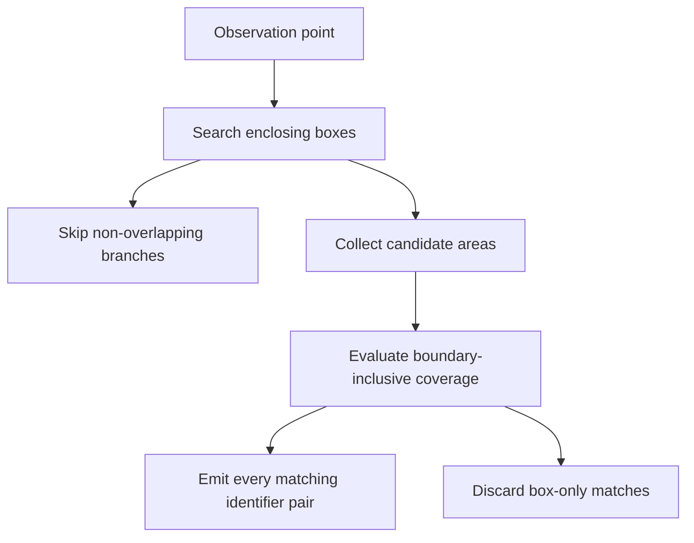

A spatial query can become much faster after an optimization. It can also stop answering the original question.

Both changes fit comfortably inside the same benchmark chart.

Imagine assigning field observations to service areas. Every observation has a location. Every service area has a polygon. The first implementation checks every point against every polygon. It works on a small fixture, gets painfully slow on real input, and someone replaces the geometry checks with a lookup table of spatial cells.

The chart looks excellent. Then a point near an area boundary disappears from the result.

The interesting question is what the optimization promised to preserve. Faster candidate selection, approximate classification, and exact matching under a chosen geometry model are different contracts. We should name the contract before comparing their runtimes.

This is where geospatial engineering becomes a very practical lesson in computer science. Good pruning lets us avoid work while preserving the answer. The proof that something can be skipped is part of the algorithm.

## Short answer

Efficient spatial queries often use a broad phase to find possible matches and a narrow phase to evaluate the actual geometric relationship. Bounding boxes and R-trees accelerate candidate selection. The candidate set must contain every true match. An exact predicate can remove false positives, but it cannot recover a match that the broad phase already discarded. Boundary rules, coordinate systems, and result multiplicity are part of correctness, not details to settle after benchmarking.

## Key takeaways

- Define the spatial relationship before choosing an index or grid.
- A bounding-box overlap is evidence that a match is possible.
- Candidate generation may admit extra work, but must not discard real matches.
- H3 cell membership and membership in the original polygon answer different questions.
- Validate complete result identities and boundary cases alongside timing.

## First, define what inside means

Suppose an observation lies exactly on the boundary between two service areas. Does it belong to both, neither, or exactly one?

The answer comes from the application. A spatial library can implement a predicate, but it cannot invent the ownership policy for your organization.

PostGIS provides several relationships that sound similar in ordinary language. [`ST_Contains`](https://postgis.net/docs/ST_Contains.html) requires an interior intersection and excludes a point lying only on a polygon's boundary. [`ST_Covers`](https://postgis.net/docs/ST_Covers.html) includes the boundary. For point assignment, that difference can decide whether an observation appears in the result at all.

For this article, use valid two-dimensional polygons and boundary-inclusive coverage. An area covers a point if the point lies in its interior or on its boundary. If two areas cover the same point, preserve both matches initially. Choosing one owner is a separate business rule.

That last decision is deliberate. Silently selecting whichever row happens to arrive first makes execution order part of the domain model. A query planner change should not move an observation from one team to another.

If the application requires exactly one owner, define a deterministic rule, such as a documented area priority followed by a stable identifier. Explain how overlaps and boundary points are resolved. A tie-breaker makes the policy explicit; it does not make an ambiguous boundary disappear.

## The straightforward algorithm tells the truth slowly

Let there be n observations and m service areas. The obvious implementation considers n multiplied by m pairs.

```text
for each observation:
    for each service area:
        if area covers observation:
            emit observation_id, area_id
```

For one million observations and a thousand areas, that is one billion potential predicate evaluations. This is an arithmetic count, not a measured runtime. The actual cost depends on polygon complexity, the geometry engine, representation, and hardware.

The useful property of the simple algorithm is that its control flow is easy to understand. If the predicate and input are correct, every possible pair receives consideration. That makes it a reasonable reference implementation for a small fixture, even when it is an unreasonable production plan.

We should preserve that semantic behavior while avoiding most of the comparisons.

In [the GeoParquet article](/blog/geoparquet-spatial-locality-and-query-pruning), the emphasis was rejecting storage regions before reading them. Here, assume the relevant data is available and focus on rejecting candidate pairs before expensive geometry evaluation. The same discipline appears at a different layer.

## A rectangle makes a useful first question

Every bounded planar geometry has an axis-aligned envelope: minimum and maximum x and y coordinates. If two geometries intersect, their envelopes must overlap. For a point, its envelope collapses to its coordinate.

Testing the envelope is cheap. It needs a few scalar comparisons. Testing a complicated polygon may require substantially more geometric work.

The implication only runs in one direction. Overlapping envelopes do not prove that the underlying shapes intersect. A concave shape can leave a large empty region inside its box. A polygon with a hole creates another obvious counterexample.

<figure className="overflow-x-auto rounded-lg" tabIndex="0" aria-label="Polygon coverage diagram, scroll horizontally on small screens">
<Image src="/images/articles/spatial-candidates.svg" alt="An L-shaped polygon inside its bounding box. Point A is inside the polygon, B is inside only the box, C lies on the polygon boundary, and D is outside the box." width="760" height="380" className="min-w-[640px]" />
</figure>

*A and C satisfy our boundary-inclusive coverage rule. B survives the box test but must be rejected by the polygon predicate. D can be rejected immediately. Coordinates are schematic. Scroll the figure horizontally on smaller screens.*

This division is useful precisely because the first stage is allowed to be imprecise in a controlled direction. It can produce extra candidates. The final predicate then removes them.

If the first stage discards C because it uses strict comparisons at an edge, the second stage cannot repair the mistake. C never arrives there. Correct boundary handling has to survive every stage of the path.

## R-trees organize the rejections

Comparing a point with every area's box is cheaper than comparing it with every full polygon, but it still examines every area. An index can organize those boxes so the query skips whole collections at once.

An R-tree stores enclosing boxes in a hierarchy. A parent box encloses the entries below it. When the query does not overlap a parent, it can skip that branch. When it does, the search descends until it reaches possible feature matches.

The [PostGIS introduction to spatial indexing](https://postgis.net/workshops/postgis-intro/indexing.html) explains the two-pass approach and the role of bounding boxes. DuckDB's [spatial-join engineering article](https://duckdb.org/2025/08/08/spatial-joins) describes constructing an R-tree during a join, illustrating that an acceleration structure can be built for the operation rather than only maintained as a permanent database index.

<div className="overflow-x-auto" tabIndex="0" aria-label="Technical diagram, scroll horizontally on small screens">
<div className="min-w-[640px]">



</div>
</div>

*The index reduces the candidate set. The predicate still defines the answer.*

This does not justify promising logarithmic query time for every dataset. Boxes can overlap heavily. Large or awkwardly shaped geometries can generate weak envelopes. A query matching most areas has little opportunity for rejection. The work required to emit a large answer remains real as well.

I would evaluate candidate count and build cost alongside query time. An index that pays for itself over thousands of queries may be a poor choice for one tiny operation. The appropriate comparison follows the workload's lifetime.

## Make the boundary visible in SQL

Here is a self-contained PostGIS fixture. Its coordinates are synthetic planar units, so it deliberately uses no geographic CRS. The query checks the coverage predicate on four points around a polygon with a hole.

```sql
WITH area AS (
  SELECT ST_GeomFromText(
    'POLYGON((0 0,10 0,10 10,0 10,0 0),
             (4 4,4 6,6 6,6 4,4 4))'
  ) AS geom
), points(id, geom) AS (
  VALUES
    ('inside', ST_Point(2, 2)),
    ('edge', ST_Point(0, 5)),
    ('hole', ST_Point(5, 5)),
    ('outside', ST_Point(12, 5))
)
SELECT
  id,
  area.geom && points.geom AS box_candidate,
  ST_Covers(area.geom, points.geom) AS matches
FROM area CROSS JOIN points
ORDER BY id;
```

The expected relationships follow directly from the constructed geometry:

| Point | Box candidate | Covered by polygon |
| --- | --- | --- |
| edge | true | true |
| hole | true | false |
| inside | true | true |
| outside | false | false |

PostGIS's [`&&` operator](https://postgis.net/docs/geometry_overlaps.html) tests two-dimensional box overlap. In normal indexed queries, index-aware predicates such as `ST_Covers` already include the relevant box comparison. The explicit column here is for explaining the candidate phase, not a recommendation to add redundant conditions to every query.

This fixture is small enough to inspect by hand. That is its value. Add holes, concavities, shared edges, and overlaps before adding millions of random observations. Random data rarely spends enough time on the exact places where the semantics are uncomfortable.

## The H3 shortcut changes the question

H3 divides the globe into indexed cells. That is useful when a cell is the intended analytical unit: aggregation, grouping, or a spatial join with a defined cell-based contract.

A tempting optimization is to convert each service area into a set of H3 cells, convert each observation into its cell, and join on cell identifiers. An expensive geometric relationship becomes a key lookup.

The [H3 region API](https://h3geo.org/docs/api/regions/) documents that ordinary `polygonToCells` selects cells by their centers. A selected cell can extend outside the polygon. An unselected cell can overlap the polygon while its center remains outside.

From that rule, two consequences follow. A point outside the polygon can fall in a selected cell and become a false positive. A point inside the polygon can fall in an unselected boundary-crossing cell and become a false negative. This follows from the geometry of the covering, even if every H3 function behaves exactly as documented.

Refining selected cells with an exact predicate can remove the false positives. It cannot recover the false negatives. That is the trap.

A higher resolution reduces the scale of the approximation, but it does not establish that the approximation disappeared. A narrow area can still interact badly with cell-center selection. Increasing a resolution parameter is not a substitute for stating the required error behavior.

## Conservative covering is a contract

If cells are used as an exact query's candidate mechanism, the covering must include every cell that could contain a matching observation under the chosen geometry model. That may require overlap-based covering and careful treatment of boundaries. H3 exposes experimental containment modes, but their names alone do not prove that a particular binding and edge model satisfy your application.

The contract can be written without committing to any particular index:

```text
reference matches are a subset of candidate pairs
refined candidate pairs equal reference matches
```

The first condition checks the broad phase. The second checks the complete optimized query. Together, they make it much easier to localize a failure.

If the first condition fails, inspect the covering, bounds, or coordinate transformation. If the first passes and the second fails, inspect predicate choice, duplicates, invalid input, or result handling. Separating those checks is more informative than asserting only that two counts are equal.

This is the same principle behind [Status Is a Distributed System](/blog/status-is-a-distributed-system), applied to an algorithm. Each stage should make a claim that its evidence actually supports. A candidate stage can claim possibility. The final stage claims the requested relationship.

## Coordinates belong in the correctness model

So far, the examples use a flat plane. Real coordinates arrive with units, axis order, and a reference system. Treating those as incidental metadata is an efficient way to create a convincing wrong answer.

PostGIS distinguishes [`geometry` and `geography`](https://postgis.net/workshops/postgis-intro/geography.html), with different computational models. The correct choice depends on the question and the scale. For distance, degrees cannot simply be treated as meters. For regional planar operations, use an appropriate projected system and understand its distortion.

Assigning an SRID labels coordinates. Transforming them changes their values between reference systems. PostGIS documents this distinction in [`ST_Transform`](https://postgis.net/docs/ST_Transform.html). Relabeling longitude and latitude as a projected system does not move the points to the correct projected positions.

Invalid polygons create another boundary. Choose whether to reject them, report them, or repair them through a documented ingestion policy. Repair can change the shape and therefore the answer. Preserve the source and record the transformation if those differences matter to the application.

Exactness in this discussion means satisfying the selected predicate on the represented geometry. It does not mean perfect knowledge of a surveyed boundary or freedom from every numerical limitation. That distinction makes the claim useful rather than mystical.

## Benchmark the invariant as well as the implementation

For a serious comparison, start with the small fixtures, then use deterministic larger datasets with both uniform and clustered points. Include areas with very different shapes and overlap. Keep the geometry model, predicate, and required multiplicity fixed.

Measure preparation time, candidate pairs, exact predicate evaluations where observable, peak memory, and query time. Report one-shot and repeated-query costs separately. Run enough repetitions to describe variation, and make the input seed and versions available.

Compare full observation-area pairs. If the result is supposed to be a set, compare sets. If duplicates have meaning, compare multiplicities. Equal counts are too weak: losing one correct pair and adding one incorrect pair leaves the count unchanged.

An approximate approach can still be valuable. Put its error behavior beside its timing and label the different contract. For a heatmap, grouping into cells may be exactly what you wanted. For assigning an inspection to a service area, a missing boundary observation may be unacceptable.

What I want from a spatial optimization is a readable account of why the work disappeared. Which candidates were rejected? What made those rejections safe? Which predicate produced the final answer? If the implementation can answer those questions, its performance numbers become much more useful.

Fast spatial queries start with a clear relationship and preserve it through every stage. The index earns its place by removing unnecessary work. The answer still has to mean what the application said it meant.
