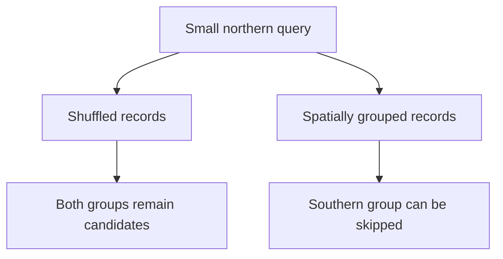
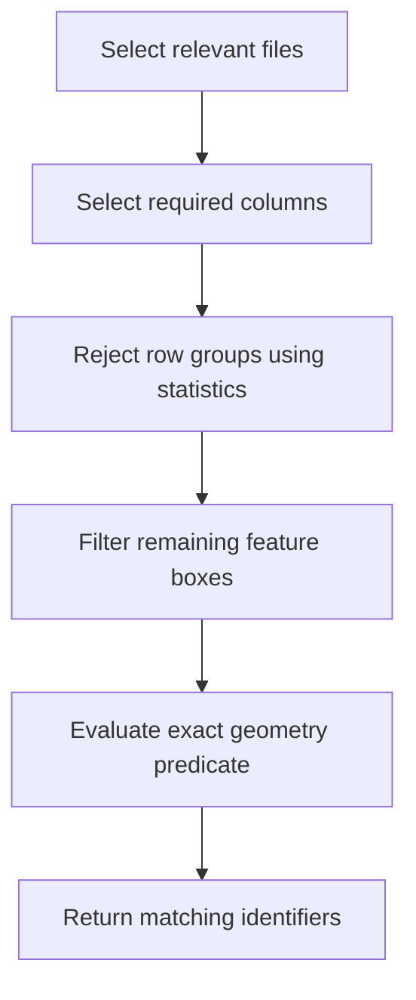

Sometimes the expensive part of a query is all the data that should never have reached it.

You ask for buildings inside a small area. The answer is a few thousand rows. Somewhere underneath that modest result, a process downloads files, decompresses columns, constructs geometries, evaluates predicates, and throws almost everything away.

Then someone suggests more workers.

I would first ask how much of that work was necessary. A tiny answer does not imply a cheap query. The distance between those two things is often decided by how the dataset was written, long before the query arrived.

This is a particularly useful way to think about GeoParquet. The format gives geospatial data access to columnar storage and metadata that can help readers skip irrelevant input. To get the benefit, the physical arrangement and the query engine have to cooperate. Changing the filename extension does not complete that agreement.

## Short answer

A selective geospatial query can avoid work at several levels: files, columns, row groups, and sometimes pages. Spatially related records need to be stored together for their summary bounds to reject unrelated regions effectively. GeoParquet can describe geometry columns and per-row bounding-box coverings, but reader support determines which information becomes actual pruning. Measure the input touched and verify the exact result, while counting the cost of preparing the layout.

## Key takeaways

- The same rows in a different physical order can have different query costs.
- Column projection and spatial pruning remove different kinds of unnecessary reads.
- A file's overall extent and a per-feature bounding-box covering are different metadata.
- Bounding-box overlap generates candidates. Irregular geometry still needs the intended spatial predicate.
- An execution plan, a result-set comparison, and an I/O measurement answer different questions. Keep all three.

## The question determines the layout

Imagine a dataset of building footprints. Each record has an identifier, a geometry, a source, and a collection of descriptive attributes. The application wants identifiers and footprints for buildings intersecting one service area.

There are already two opportunities to avoid work. We do not need most descriptive columns, and we do not need buildings far away from the service area.

A columnar format makes the first opportunity natural. Values from each column are stored together within row groups, so a reader can select the columns needed by the query. The [Parquet file-format overview](https://parquet.apache.org/docs/file-format/) describes this division into row groups, column chunks, and pages.

The spatial opportunity needs more thought. Coordinates stored somewhere inside a geometry encoding are not automatically useful to the storage reader. It needs accessible metadata or statistics that can rule out a region before loading and evaluating every geometry.

This gives us a concrete design question: what cheap evidence can prove that a chunk contains no possible matches?

If we cannot answer that, the reader may have to open the chunk and find out the expensive way.

## A row group can carry useful evidence

Consider a numeric column with minimum 100 and maximum 200 in a particular group of rows. A query asking for values below 50 can reject that group. No value inside its recorded range can satisfy the condition.

Now imagine a latitude-like coordinate. If every group contains points from almost the entire study area, its minimum and maximum will also cover almost the entire area. The statistics exist. They simply have very little to say.

This is why physical order matters. Group nearby values together and the intervals become narrower. A selective query can reject more groups. Shuffle the same values and those intervals become broad again.

DuckDB calls its min/max indexes zone maps, and its [engineering article on sorting](https://duckdb.org/2025/05/14/sorting-for-fast-selective-queries) explains how ordering affects their selectivity. The mechanism is useful beyond that particular engine: summaries can only reject what their contents let them reject.

<div className="overflow-x-auto" tabIndex="0" aria-label="Technical diagram, scroll horizontally on small screens">
<div className="min-w-[640px]">



</div>
</div>

*A conceptual layout comparison. The records are unchanged; the information available for rejection changes.*

There is an important limit here. An interval is a conservative summary. It says where values may exist, not that every value between its endpoints is present. False positives mean extra reads. A false negative would mean a wrong answer.

## Geography adds a second dimension

For a geometry, a bounding box records minimum and maximum coordinates along each axis. In a simple two-dimensional planar example, that is xmin, ymin, xmax, and ymax.

Two boxes overlap when their intervals overlap on both axes. The candidate condition can be written as four comparisons:

```text
feature.xmin <= query.xmax
feature.xmax >= query.xmin
feature.ymin <= query.ymax
feature.ymax >= query.ymin
```

The inclusive comparisons preserve candidates that touch the query boundary. Whether touching should count in the final answer belongs to the final predicate.

A reader can use statistics over these box coordinates to rule out groups that are entirely to one side of the query. Groups containing spatially related features tend to offer tighter summaries. A group mixing buildings from distant cities gives the reader a much less useful envelope.

The box condition is still only the broad phase. A building can lie inside the bounding box of a curved service area and outside the actual area. The application must evaluate the precise relationship it promised after candidate filtering.

I explore that correctness boundary in [Fast Spatial Queries Without Losing Correctness](/blog/fast-spatial-queries-without-losing-correctness). Here, the focus is the work we can eliminate before that stage.

## What GeoParquet adds

GeoParquet defines the metadata needed to interpret geometry columns inside Parquet. Its [version 1.1 specification](https://geoparquet.org/releases/v1.1.0/) includes geometry encodings, coordinate-reference information, a whole-file extent, and optional metadata identifying a per-row bounding-box covering.

Those last two deserve separate names in your head. The file extent summarizes the dataset in that file. The covering points to fields containing each feature's box. Statistics on those fields can support finer filtering within the file.

For a WKB-encoded geometry, the covering exposes a useful numerical summary without requiring the reader to understand every encoded vertex first. WKB is a binary geometry representation, not a general promise that its internal coordinates are available for Parquet predicate pushdown.

This article uses the 1.1 covering model deliberately. Format versions and engine support evolve. Record what your writer produced and what your reader understands, rather than assuming a current tool name proves compatibility with every available encoding.

A query's coordinate assumptions must also match the stored data. A box in meters cannot be compared meaningfully with coordinates in degrees. The 1.1 covering technique also has an explicit limitation for geometries crossing the antimeridian. A regional example that avoids that case is a useful scope choice, not a solution for the entire globe.

## Isolate the mechanism before benchmarking a city

Before reaching for a large public dataset, I like a fixture whose expected answer can be derived without trusting the query engine.

Here is a small DuckDB experiment. It creates a grid of integer coordinates, writes the same records in two arrangements, and asks for a square. These are ordinary Parquet files, intentionally. The fixture isolates numeric statistics and ordering before adding geometry metadata and decoding.

```sql
CREATE TABLE points AS
SELECT
  i AS id,
  i % 1024 AS x,
  i // 1024 AS y
FROM range(1048576) AS r(i);

COPY (
  SELECT * FROM points ORDER BY y, x
) TO 'ordered.parquet'
(FORMAT PARQUET, ROW_GROUP_SIZE 65536, COMPRESSION ZSTD);

COPY (
  SELECT * FROM points ORDER BY hash(id), id
) TO 'shuffled.parquet'
(FORMAT PARQUET, ROW_GROUP_SIZE 65536, COMPRESSION ZSTD);

SELECT count(*)
FROM read_parquet('ordered.parquet')
WHERE x BETWEEN 64 AND 95
  AND y BETWEEN 64 AND 95;
```

The expected answer is 1,024 points: 32 distinct x values multiplied by 32 distinct y values. Run the same query against `shuffled.parquet`. Both must return that answer.

Ordering by y makes bands of the grid contiguous. The shuffled variant spreads those bands around. Inspect the written row-group metadata to see the resulting coordinate ranges. Then use `EXPLAIN ANALYZE` and the profiling facilities of the installed DuckDB version to investigate the scans.

Do not infer exact physical reads solely from the requested row-group size. Writers can have additional layout constraints, and readers can buffer or prefetch. The fixture proves the result mathematically; the physical behavior still needs inspection.

Also record file sizes. Ordering may change compression efficiency as well as pruning. If you attribute the entire timing difference to skipped groups, you have already made the experiment say more than it measured.

## Bring the experiment back to real geometries

For a realistic second step, a fixed building extract from Overture is a practical input. Its [DuckDB guide](https://docs.overturemaps.org/getting-data/duckdb/) demonstrates selecting cloud-hosted GeoParquet data with SQL and bounding-box conditions.

Pin the release and the extraction boundary. Download or materialize the same subset once, then derive every experimental variant from that input. A changing upstream release should not become an invisible variable in a layout comparison.

The [GDAL Parquet driver](https://gdal.org/en/stable/drivers/vector/parquet.html) exposes spatial sorting, row-group sizing, and covering-box creation options. It also documents preparation costs, including temporary storage when sorting. Those options give us knobs to vary deliberately.

I would begin with a two-by-two comparison:

| Arrangement | Covering boxes | Question |
| --- | --- | --- |
| Shuffled | Disabled | What does the baseline read? |
| Shuffled | Enabled | Are broad summaries useful here? |
| Spatially grouped | Disabled | What does ordering alone change? |
| Spatially grouped | Enabled | Can the reader exploit both? |

Keep the encoding, compression settings, requested columns, and engine version fixed. Inspect the output schema and metadata instead of assuming the writer honored every option exactly as intended.

For each variant, run a small rectangular selection, an irregular polygon intersection, and a query covering much of the dataset. The broad query is useful because it gives pruning fewer opportunities. An optimization story becomes more informative when it includes a case where the advantage shrinks.

## The predicate must reach the reader

SQL is declarative, but its surface appearance cannot tell you exactly where each operation executes.

An engine might recognize a spatial predicate and derive a bounding-box filter. It might require explicit numeric conditions. It might decode the geometry first. It might understand the covering metadata but still lack an optimization for that particular expression.

The plan should therefore be inspected as a sequence of responsibilities:

<div className="overflow-x-auto" tabIndex="0" aria-label="Technical diagram, scroll horizontally on small screens">
<div className="min-w-[640px]">



</div>
</div>

*The desired execution shape. Available metadata and engine support determine which stages can actually skip reads.*

Parquet also defines an optional [page index](https://parquet.apache.org/docs/file-format/pageindex/) for finer-grained skipping. Treat it as another capability to verify. Having page statistics in a file and having a reader that uses them are separate facts.

If your query returns the correct rows but reads the entire geometry column, correctness passed and the pruning hypothesis did not. Those results are compatible. A query can be semantically right and physically disappointing.

## Measure the work, not only the stopwatch

Elapsed time matters because users wait for it. On its own, it is a weak explanation.

For local files, record file size, elapsed time, peak memory, and available scan metrics. Distinguish rows scanned from rows emitted by a filter. For remote files, also record request count and transferred bytes. Many small requests can introduce latency even when they transfer fewer bytes.

Separate cold and warm runs. Describe what “cold” means in your setup, because closing a database connection does not necessarily clear the operating system's page cache. Repeat runs and report a distribution or a median with spread. The smallest number you saw is an anecdote.

Keep preparation outside the query timing, then report it alongside the query timing. If sorting costs thirty units of work and saves one per query, repeated use matters. In a simplified cost model, the preparation pays back only after enough queries recover its extra cost. Real storage costs and changing releases can complicate that accounting, but hiding the preparation makes it impossible.

Most importantly, compare result identities. Two results with the same count can contain different buildings. For spatial joins, compare identifier pairs and multiplicity as well. A faster query that changed the requested relationship belongs in a different comparison.

## The limits are part of the design

Spatial sorting does not make every query selective. A continental query may need almost everything. Long roads, rivers, and large polygons can produce broad boxes even when their actual shapes are thin. A layout optimized for location may be less effective for time-based access. Small row groups can improve selectivity while increasing metadata and request overhead.

There is no universal row-group size hiding at the end of this article. I would choose from the actual query distribution and the observed serving environment.

This connects to the decision in [the PMTiles article](/blog/a-file-can-replace-your-tile-server). Both approaches move useful knowledge into the artifact. A tile archive organizes prepared views. GeoParquet organizes analytical records. Their value comes from matching that organization to the work the reader needs to do.

Before adding more machinery to a slow data query, I would inspect what it reads and why. Sometimes the next improvement is a better predicate. Sometimes it is a different layout. Sometimes the workload really does need more capacity.

The important part is knowing which of those statements the evidence supports. A small result should have a chance to come from a small amount of work. Good data organization is how we give the reader that chance.
