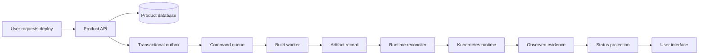
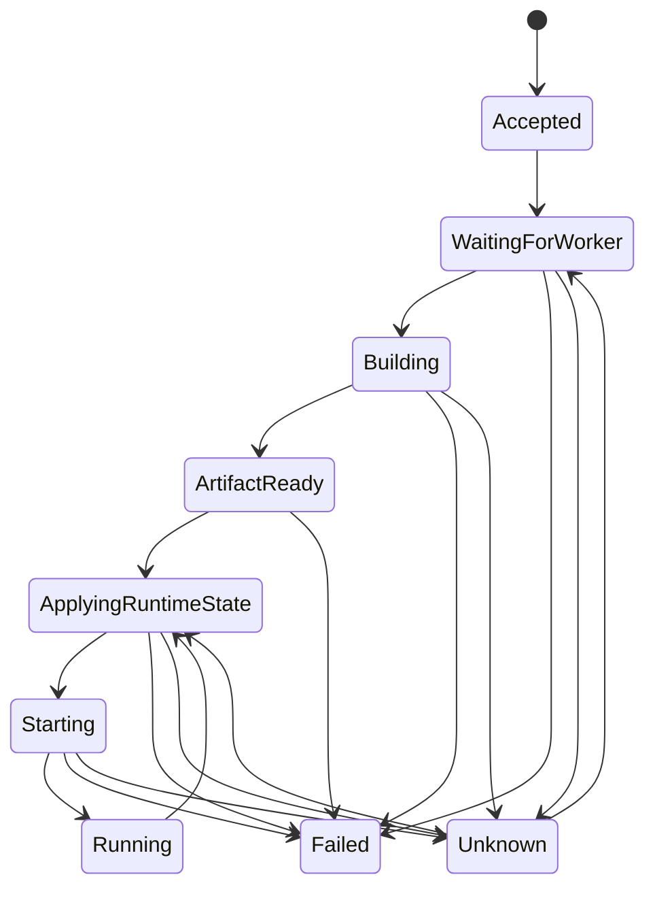
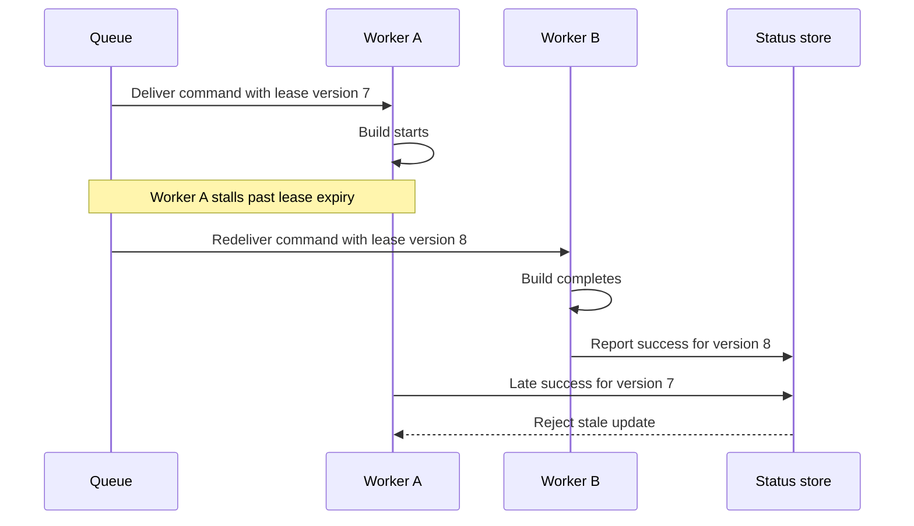
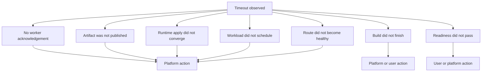
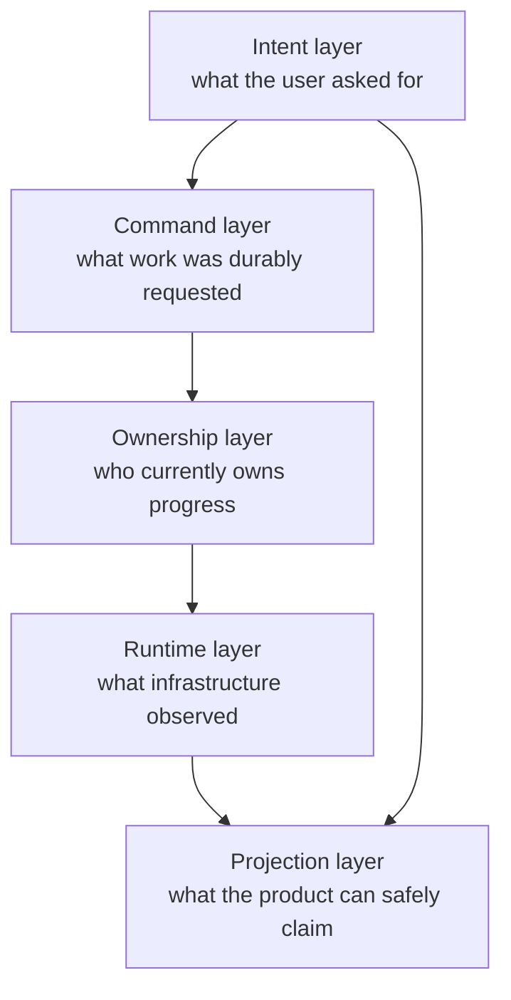

The most dangerous word in a deployment UI is "pending."

It looks harmless. It sounds temporary. It suggests the system knows what is happening and the user only needs to wait. But in a platform, "pending" can mean several completely different things. The API may have accepted the request but not published the command. The command may be waiting in a queue. A worker may be building an artifact. The artifact may exist but the runtime has not applied it. Kubernetes may have accepted the desired state but cannot schedule the pod. The pod may be scheduled but not ready. The route may be healthy but the status projection may be stale.

Those are not small differences. They are different failure domains.

While building [Guara Cloud](https://guaracloud.com), this became one of the clearest lessons in the product. A PaaS is not only a machine that deploys software. It is a machine that turns distributed evidence into user-facing claims. A status badge is one of those claims. If the claim is vague, stale, or based on the wrong source of truth, the product lies.

That is why status deserves the same engineering discipline as the deployment path itself.

## Short answer

Deployment status is a distributed systems problem. It is not a single column, enum, event, or Kubernetes condition. It is a projection built from product intent, durable commands, queue ownership, worker progress, runtime desired state, observed infrastructure state, timeouts, and freshness rules. A good platform names states by evidence, treats locks as leases, rejects stale updates, separates user-safe messages from operator diagnostics, and reports where proof stopped instead of hiding several failure domains behind one vague label.

## Key takeaways

- A status value is a claim. Claims need provenance.
- "Pending" is usually too vague. Queue waiting, runtime scheduling, and readiness delay are different states.
- Desired state and observed state answer different questions. A product database can prove intent, but the runtime proves execution.
- Locks coordinate workers, but locks are not truth. Leases expire, stale workers report late, and updates need fencing.
- Timeouts should identify the stage that timed out. A build timeout and a readiness timeout require different remediations.
- User-facing errors should be sanitized, but internal diagnostics should keep correlation, stage, owner, and evidence.
- The UI should say what the platform knows, what it does not know, and what action is safe next.

## The trap hidden inside a status column

Every platform eventually has a table with a status column.

That is not the problem. A status column is often the right read model for the UI. The problem begins when the team starts treating that column as the source of truth instead of the last known projection of a larger system.

Imagine a user clicks Deploy.

The API validates the request, writes a deployment record, writes an outbox command, and returns. The user sees "pending." That label might be true for a few seconds. It might also hide a failure that already happened after the API returned. The queue publisher could be down. The builder could be offline. The worker lease could have expired. The artifact registry could be unavailable. The runtime apply could have failed. Kubernetes could be waiting on an image pull. The readiness probe could be failing because the user's app crashed.

If all of those states collapse into the same word, the product has no way to guide the user. Worse, the support team has no way to distinguish product delay from infrastructure delay from application failure.

This is the deeper issue:

> A status string is cheap. A status model is expensive.

The model has to define what each state means, who is allowed to move it, what evidence justifies the transition, how stale evidence is handled, and how late events are rejected. Without that discipline, the UI becomes a story written by whichever component updated the row last.

## A deployment is not one operation

The first mistake is thinking about deployment as a single action.

From the user's point of view, there is one button. From the platform's point of view, there are many cooperating systems. A product API records intent. A database transaction makes that intent durable. An outbox makes the command publishable without losing the transaction boundary. A queue delivers work with retry semantics. A worker builds or selects an artifact. A reconciler asks the runtime to converge. Kubernetes schedules and starts workloads. Probes, routes, certificates, and health checks produce evidence. A status projection turns the evidence back into a product state.

That path is not synchronous. It is not perfectly ordered. It does not fail in one place.



The important part of the diagram is not the number of boxes. The important part is that the UI is at the far end of an evidence path. It should not pretend to know more than the evidence path has proven.

That is the connection to the idea I wrote about in [A PaaS Is a Reconciliation Loop With a Bill Attached](/blog/a-paas-is-a-reconciliation-loop-with-a-bill-attached). A PaaS has at least two sources of truth. The product database knows what the user asked for. The runtime knows what actually exists. Status is the product-facing language that explains the gap.

## Intent is not execution

An accepted request is not a running service.

This sounds obvious, but a surprising number of systems blur it. The API call succeeds, so the UI shows progress. The database row exists, so the dashboard acts as if the deployment is underway. The queue message was written, so the product says "building." None of those claims are necessarily true.

The API can prove acceptance. It can prove validation passed. It can prove the desired state was recorded. It can prove the command was born in the same transaction if the platform uses an outbox. It cannot prove that a worker has started. It cannot prove an artifact exists. It cannot prove Kubernetes has accepted the new runtime state.

So the status model needs a sharper vocabulary.

Instead of:

```text
pending -> running -> failed
```

Use states that describe where evidence has reached:

```text
accepted
waiting_for_worker
building
artifact_ready
applying_runtime_state
starting
running
failed
unknown
```

Those names are not magic. The point is that each state can be defended. "accepted" means the product record and command exist. "waiting_for_worker" means the command exists but no worker progress has been observed. "building" means a worker has acknowledged responsibility. "artifact_ready" means there is a durable build output. "applying_runtime_state" means the platform is converging desired runtime objects. "starting" means runtime objects exist but readiness evidence is incomplete. "running" means readiness and route evidence satisfy the product contract.

The state should tell the user where the proof stopped.

## The status state machine

A useful state machine is not a decorative diagram. It is an agreement between components.



The important transition is not only the happy path. The important transition is `Unknown`.

Distributed systems need an honest state for contradictory or stale evidence. If the last worker heartbeat is old, the platform does not know whether the worker died, the network delayed the heartbeat, or the event publisher is lagging. If Kubernetes shows a deployment object but the status projection has not received fresh readiness evidence, the product should not invent confidence.

"Unknown" is not a failure of design. It is a sign that the design refuses to lie.

Some teams avoid unknown states because they make the UI feel less clean. That is backwards. A platform that can say "we do not currently have fresh evidence" is more trustworthy than a platform that keeps showing the previous green state until a customer complains.

## Locks coordinate work, but locks are not truth

Once the deployment path becomes asynchronous, ownership becomes a problem.

At some point a worker needs to say, "I am responsible for this command right now." That usually involves a lock, lease, reservation, consumer group, visibility timeout, or some equivalent mechanism. The exact tool is less important than the semantics. Work ownership is temporary. The owner can crash. The lease can expire. Another worker can take over. Messages can be delivered more than once. A late event can arrive after a newer worker has already moved the deployment forward.

This is where many status systems become subtly unsafe.

A lock prevents two well-behaved workers from doing the same work at the same time. It does not prevent a stale worker from reporting late after it lost the lease. It does not prove its result is still current. It does not prove the product still wants the same deployment. It is coordination, not truth.



The rejection at the end is the whole point. Without it, the older worker can overwrite newer truth.

This is the same class of thinking behind idempotency keys, optimistic concurrency, compare-and-swap updates, and fencing tokens. A worker should not merely say "deployment succeeded." It should say "deployment attempt X, for desired version Y, under lease version Z, reached evidence E." The status store can then decide whether that evidence is still allowed to affect the user-facing projection.

The public article does not need to reveal internal table names or queue semantics. The engineering principle is enough:

> Every asynchronous progress update should prove that it belongs to the current intent.

## Version the intent, not only the work

Deployment systems often talk about job IDs. Job IDs are useful, but they are not enough.

The user can deploy version one, then deploy version two before version one finishes. The platform may still receive late evidence from version one. If the status model only tracks "the deployment job," the older evidence can corrupt the newer view.

The status update must be tied to the desired version of the service. That desired version might be a deployment record, a revision number, a generation, a spec hash, or another monotonic token. The name does not matter. The invariant matters:

> Evidence for an older desired state must not make claims about a newer desired state.

Kubernetes has a version of this idea in resource generations and observed generations. Controllers should not say they observed the latest spec unless their status corresponds to the current generation. A PaaS needs the same discipline above Kubernetes. If the product database says desired revision 42, a worker reporting on revision 41 is historical evidence, not current status.

That rule gives the UI a way to stay honest during fast repeated actions. The user can see that a previous attempt failed without the platform pretending the current attempt failed too. Operators can still inspect the old attempt. The current status remains tied to the current intent.

## Timeouts are not one thing

"Deployment timed out" is almost as vague as "pending."

A timeout tells you that expected evidence did not arrive within a window. It does not tell you which component is broken unless the timeout is attached to a stage. A queue wait timeout and a readiness timeout produce very different remediations.



If no worker acknowledged the command, retrying may be safe and the issue is likely in the command delivery or worker fleet. If the build finished but the runtime apply did not converge, the issue is further down the path. If the workload scheduled but readiness never passed, the user's application may be crashing, listening on the wrong port, missing configuration, or waiting on a dependency.

Those distinctions matter for support, product copy, retry behavior, and automation.

A good timeout message should answer four questions:

1. What stage was waiting for evidence?
2. What evidence was expected?
3. Is retry safe?
4. Is the next action likely user-owned or platform-owned?

The user does not need internal logs. They need an honest next step. The operator needs enough internal context to investigate without reconstructing the whole path by hand.

## The UI is a read model

The deployment UI should be treated as a read model, not as the system of record.

That means it can be optimized for clarity. It can group low-level states. It can show friendly language. It can hide noisy implementation details. But it should not invent states that are not backed by evidence.

There is a useful split:

| Layer | Purpose | Example |
| --- | --- | --- |
| Internal evidence | Preserve what happened | worker acknowledged command, runtime object observed, readiness failed |
| Status projection | Normalize evidence | building, starting, running, failed, unknown |
| User message | Explain safely | "The app started but did not become ready." |
| Operator detail | Debug precisely | attempt, stage, correlation, owner, freshness, last evidence |

This separation prevents a common mistake: leaking operator detail into the product UI because the platform has no better language. Raw error messages are often too specific, too scary, or too revealing. But hiding everything behind "failed" is not acceptable either.

The UI should expose the product truth:

```text
Build completed. The runtime accepted the deployment, but the app did not become ready.
```

The operator view can carry more detail:

```text
stage=readiness
desired_revision=42
attempt=3
last_runtime_observation=ready_false
evidence_age=recent
retry_safe=true
```

That is not security theater. It is boundary design. Users get the explanation they can act on. Operators keep the evidence needed to repair the system.

## Why generic success is dangerous

Green states deserve suspicion.

A platform can show green because the API request succeeded, because the command was queued, because Kubernetes accepted a Deployment object, because at least one pod exists, because readiness passed once, or because the route returned a successful response. Those are not equivalent.

For Guara Cloud, the product question is not "did Kubernetes accept some YAML?" The product question is closer to "can the user trust this service as running?" That answer may depend on readiness, route health, recent evidence, and whether the current desired revision is the one being observed.

The exact contract varies by platform. The principle does not:

> "Running" should mean the product contract is satisfied, not that one internal step happened to succeed.

This is why status models should avoid premature success. A deployment can move from accepted to building quickly, but it should not move to running until the platform has runtime evidence. Even then, the evidence should have a freshness rule. A service that was healthy yesterday but cannot be observed today should not keep borrowing yesterday's confidence forever.

Freshness is part of truth.

## Unknown is better than stale confidence

Engineers dislike unknown because it feels like a weak answer. Product teams dislike it because it creates anxiety. Users dislike it because it blocks certainty.

But unknown is sometimes the only honest answer.

Consider a status projection that has not received runtime evidence for several minutes. The service was previously running. The product database still says it should be running. The runtime watcher is delayed, disconnected, or failing. What should the UI say?

"Running" may be stale. "Failed" may be false. "Pending" is meaningless. "Unknown" is honest if it is paired with useful explanation:

```text
The last known state was running, but the platform has not received fresh runtime evidence recently.
```

That sentence preserves both facts. It does not erase the last known state, and it does not pretend the last known state is current.

This matches the incident discipline I described in [Debugging Kubernetes Storage Incidents Without Lying to Yourself](/blog/debugging-kubernetes-storage-incidents-without-lying-to-yourself). A green dashboard can hide unresolved risk if the system stops asking whether the evidence is fresh. Operational honesty is not only for postmortems. It belongs in the product model.

## Status transitions need owners

Every status transition should have an owner.

That owner might be the API, the outbox publisher, the build worker, the reconciler, the runtime watcher, or the status projector. If any component can update any status at any time, the enum becomes a shared mutable variable distributed across the whole platform.

That is how systems become impossible to reason about.

A better design asks:

- Which component is allowed to create this evidence?
- Which component is allowed to project this evidence into user-visible state?
- What version or lease must the update prove?
- Is the transition monotonic, reversible, or only valid for one attempt?
- What happens if the update arrives after a newer desired revision exists?

This is not bureaucracy. It is the price of avoiding accidental distributed state machines.

The same principle shows up in [Durable Execution: You're Already Building It, Badly](/blog/durable-execution-youre-already-building-it-badly). When a workflow spreads across queues, status columns, retry helpers, and sweepers, the state machine exists whether or not anyone named it. Deployment status has the same shape. Either the platform names the state machine, or production invents one through bugs.

## Sweepers are a smell, but not always a mistake

Sooner or later, someone writes a sweeper.

It finds deployments stuck in a state for too long and moves them forward, retries them, or marks them failed. This can be good engineering. Distributed systems need repair loops. The problem is when the sweeper becomes the only place where state semantics are defined.

A healthy sweeper enforces the model:

- it looks for stale evidence
- it classifies the stage that stopped moving
- it uses the same fencing rules as normal workers
- it writes an auditable decision
- it prefers retrying idempotent work over inventing success
- it marks unknown or failed only when the evidence supports that claim

An unhealthy sweeper papers over ambiguity:

- it resets rows because "that usually fixes it"
- it moves status backward without checking desired revision
- it marks failures without stage information
- it retries non-idempotent work
- it hides repeated platform issues behind automatic recovery

The difference is whether the sweeper is a named part of the control loop or an emergency script with a schedule.

## Status is also a security boundary

Status messages can leak too much.

A raw runtime error might include internal hostnames, namespace patterns, environment variable names, image registry paths, stack traces, provider details, or implementation-specific object names. Those details may be useful to operators, but they should not automatically become customer-facing text.

At the same time, a useless error is not safer in any meaningful product sense. "Something went wrong" protects internals but harms trust.

The better pattern is translation:

```text
Internal evidence:
readiness probe failed for current revision after runtime apply

User message:
The app started, but it did not become ready. Check that it listens on the configured port and starts without missing environment variables.

Operator detail:
stage, revision, attempt, last observation, evidence age, correlation
```

The user gets an actionable explanation. The operator keeps the data needed to investigate. The platform does not expose its internal topology.

That is especially important for a product like Guara Cloud, where the goal is to make serious infrastructure usable without turning the customer into a Kubernetes operator. I wrote about that product boundary in [Building Guara Cloud Like a Product, Not a Kubernetes Dashboard](/blog/building-guara-cloud-like-a-product-not-a-kubernetes-dashboard). Status is one of the places where the boundary either holds or collapses.

## A practical model for evidence-backed status

The model I trust has five layers.



The intent layer contains desired state. The command layer ensures work is durable. The ownership layer coordinates workers with leases and fencing. The runtime layer observes infrastructure. The projection layer turns evidence into product language.

The projection depends on both intent and runtime. Runtime evidence without current intent is history. Intent without runtime evidence is only a request. The user-facing state comes from comparing them.

This is the heart of the article:

> Status is not where one component writes what it just did. Status is where the platform reconciles what should be true with what has been proven true.

Once you accept that, the design questions become much clearer.

## The checklist I use now

When adding or reviewing platform status, I want answers to these questions.

First, what evidence backs each state?

If a state cannot name its evidence, it is probably a mood. "Deploying" is acceptable only if the team agrees what proof moves something into that state.

Second, who owns each transition?

One component should not be able to casually overwrite the claim made by another component unless the transition rules allow it.

Third, how do we reject stale progress?

Every async update should tie itself to the current desired revision, attempt, lease, or equivalent fencing token.

Fourth, what is the freshness rule?

If observed state is old, the UI should distinguish last known state from current confidence.

Fifth, what does the timeout mean?

A timeout should identify the stage, expected evidence, safe retry behavior, and likely owner of the next action.

Sixth, what is safe to tell the user?

Translate internal evidence into useful product language. Do not leak implementation details, but do not insult the user with empty errors.

Seventh, what can repair the state?

If the answer is "someone updates the database manually," the model is incomplete. There may be times when manual repair is necessary, but it should be the exception, not the architecture.

## The rule underneath all of this

The hard part of status is not choosing better words. It is building a system where the words mean something.

"Pending" should not hide queue starvation, build delay, runtime apply failure, scheduling failure, readiness failure, and stale watchers. "Running" should not mean "the API accepted the request." "Failed" should not erase the stage that failed. "Unknown" should not be treated as embarrassing when it is the only honest answer.

The rule I keep coming back to is simple:

> A platform earns trust when it tells the user what it knows, what it does not know, and what is safe to do next.

That is why status is a distributed system. It crosses databases, queues, leases, workers, reconcilers, Kubernetes, probes, routes, and human expectations. Every boundary adds delay. Every retry adds ambiguity. Every stale event threatens to rewrite the story. The job of the platform is to turn that messy evidence into claims that are precise enough to debug and honest enough to trust.

The UI badge is the smallest part of the work.
