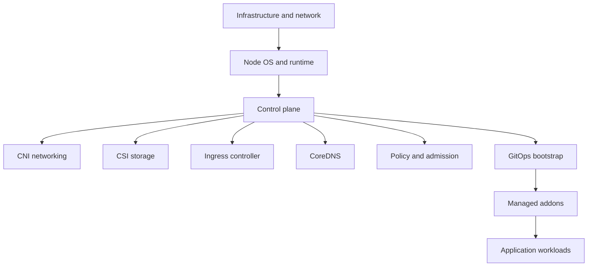
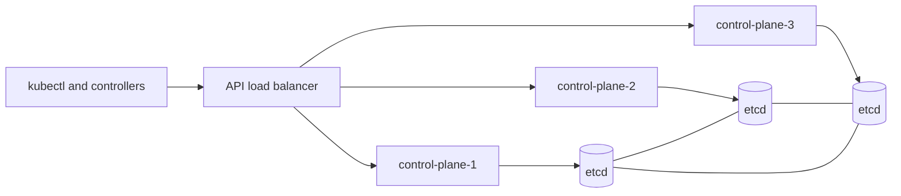

Purpose: explain the operational practices required to run, upgrade, back up, restore, and recover Kubernetes clusters safely.

# Cluster Operations, Upgrades, Backup, Restore, and Disaster Recovery

Cluster operations are about preserving control-plane integrity, workload availability, security posture, and recovery capability over time. A Kubernetes cluster is not finished when the first workload runs. It needs lifecycle management for nodes, certificates, APIs, addons, storage, networking, access, and disaster recovery evidence.

Core links: [Kubernetes](/compendium/kubernetes/kubernetes), [01 Kubernetes Mental Model and Architecture](/compendium/kubernetes/kubernetes-mental-model-and-architecture), [07 Storage Volumes PVCs StorageClasses CSI and Stateful Data](/compendium/kubernetes/storage-volumes-pvcs-storageclasses-csi-and-stateful-data), [10 Observability Logging Metrics Tracing Events and Probes](/compendium/kubernetes/observability-logging-metrics-tracing-events-and-probes), [12 Helm Kustomize Manifests and Release Engineering](/compendium/kubernetes/helm-kustomize-manifests-and-release-engineering), [13 GitOps Controllers Operators CRDs and Platform APIs](/compendium/kubernetes/gitops-controllers-operators-crds-and-platform-apis).

## Cluster Bootstrap Choices

| Option | Best fit | Strength | Tradeoff |
|---|---|---|---|
| kubeadm | Learning, custom clusters, controlled self-managed setups | Upstream Kubernetes path | You own HA, upgrades, certs, etcd, addons |
| EKS | AWS production clusters | Managed control plane and AWS integrations | AWS-specific IAM and networking complexity |
| GKE | Google Cloud production clusters | Strong managed operations and upgrade automation | Google Cloud-specific operational model |
| AKS | Azure production clusters | Azure identity and networking integration | Azure-specific control plane behavior |
| Bare metal | Datacenter, edge, sovereignty needs | Full control over hardware and networking | You own load balancing, storage, lifecycle |
| Talos | Immutable Kubernetes-focused OS | API-driven node lifecycle and small host surface | Requires Talos operational fluency |
| k3s | Edge, homelab, small clusters | Lightweight packaging | Different defaults from full cloud clusters |

## Bootstrap Sequence



Bootstrap principle: install the minimum manually, then let GitOps own the steady state. The earliest manual steps should create the cluster, networking required for the API, and the GitOps controller or bootstrap controller.

## kubeadm Operations

Typical kubeadm creation path:

```bash
kubeadm init --control-plane-endpoint k8s-api.example.com:6443 --upload-certs
mkdir -p $HOME/.kube
cp /etc/kubernetes/admin.conf $HOME/.kube/config
kubectl get nodes
kubectl apply -f cni.yaml
kubeadm token create --print-join-command
```

Control plane join:

```bash
kubeadm join k8s-api.example.com:6443 \
  --token TOKEN \
  --discovery-token-ca-cert-hash sha256:HASH \
  --control-plane \
  --certificate-key CERTKEY
```

Worker join:

```bash
kubeadm join k8s-api.example.com:6443 \
  --token TOKEN \
  --discovery-token-ca-cert-hash sha256:HASH
```

kubeadm is explicit. You must manage the OS, container runtime, etcd backups, certificates, load balancer, CNI, CSI, and upgrades.

## Managed Cluster Operations

Managed Kubernetes removes some operational burden, not all of it.

EKS, GKE, and AKS usually manage:

- Control plane process availability.
- API server endpoint.
- Provider integration for load balancers and disks.
- Version upgrade workflows.

You still own:

- Workload manifests and policies.
- Node pools and disruption budgets.
- CNI configuration choices.
- Addon compatibility.
- Backup and restore of application data.
- Access control and audit evidence.
- API deprecation readiness.

## Control Plane HA

High availability requires multiple control-plane nodes or a managed control plane, resilient etcd, redundant API access, and a failure-tested load balancer.



HA checklist:

- Odd-numbered etcd members when self-managing etcd.
- API load balancer has health checks and redundant placement.
- Control-plane certificates are monitored before expiry.
- Backups are encrypted and stored outside the cluster failure domain.
- Restore procedure has been practiced in an isolated environment.

## Node Lifecycle

Nodes should be treated as replaceable capacity. Repairing nodes in place should be the exception.

```bash
kubectl cordon worker-7
kubectl drain worker-7 --ignore-daemonsets --delete-emptydir-data
kubectl get pods -A -o wide --field-selector spec.nodeName=worker-7
kubectl uncordon worker-7
kubectl delete node worker-7
```

Node lifecycle guidance:

- Keep node images patched and reproducible.
- Use multiple node pools for different hardware, taints, or risk profiles.
- Respect PodDisruptionBudgets during drains.
- Verify DaemonSet behavior before node image upgrades.
- Do not run irreplaceable state on local disks without an explicit recovery plan.

## Cluster Autoscaling

Cluster autoscaling adds or removes nodes based on pending pods and node utilization. It does not fix bad requests, missing limits, strict affinity, impossible topology spread, or unavailable instance types.

```bash
kubectl get pods -A --field-selector=status.phase=Pending
kubectl describe pod pending-pod -n app
kubectl get events -A --sort-by=.lastTimestamp
kubectl logs deploy/cluster-autoscaler -n kube-system
```

Autoscaling review:

- Workloads have realistic CPU and memory requests.
- Critical pods have priority classes.
- Node pools cover required architecture, GPU, storage, and zone constraints.
- PodDisruptionBudgets do not block all scale-down.
- System workloads are protected from eviction.

## Certificates

Certificate failures can break API access, kubelet registration, webhooks, ingress, metrics, and service mesh traffic.

```bash
kubeadm certs check-expiration
kubectl get csr
kubectl get validatingwebhookconfigurations
kubectl get mutatingwebhookconfigurations
```

Production guidance:

- Monitor certificate expiry.
- Use cert-manager or provider tooling for workload and ingress certificates.
- Keep CA rotation procedures written and tested.
- Avoid long-lived human client certificates when OIDC or short-lived credentials are available.

## Upgrade Strategy

Kubernetes upgrades are dependency upgrades across the API server, controllers, kubelets, CRI, CNI, CSI, ingress, admission webhooks, CRDs, and client tools.

Safe order:

1. Read release notes for the target version.
2. Scan manifests for removed or deprecated APIs.
3. Upgrade controllers and CRDs that must support the new version.
4. Upgrade control plane.
5. Upgrade node pools gradually.
6. Upgrade addons.
7. Verify workloads, events, metrics, and policy admission.

Commands:

```bash
kubectl version
kubectl get --raw /readyz?verbose
kubectl api-resources
kubectl get nodes -o wide
kubectl get events -A --sort-by=.lastTimestamp
kubectl rollout status deployment/coredns -n kube-system
```

API deprecation workflow:

```bash
kubectl get ingress -A -o yaml | grep 'apiVersion: extensions/v1beta1'
kubectl get crd -A
kubectl explain deployment.spec
kubeconform -kubernetes-version 1.30.0 -strict rendered.yaml
```

Use the target cluster version in validation. Removed APIs fail at apply time after upgrade, so they must be eliminated before upgrading.

## Addon Management

Addons include CoreDNS, kube-proxy, metrics-server, CNI, CSI, ingress controllers, cert-manager, external-dns, policy engines, observability agents, and GitOps controllers.

Addon upgrade checklist:

- Confirm compatibility matrix for the target Kubernetes version.
- Upgrade CRDs before controllers when required by the project.
- Watch webhook availability during upgrade.
- Use PodDisruptionBudgets for critical addon replicas.
- Test DNS, Service routing, ingress, storage provisioning, and metrics after upgrade.
- Keep addon configuration in Git.

## CNI, CSI, and Ingress Upgrades

CNI failures affect pod networking, NetworkPolicy, DNS reachability, and service routing. CSI failures affect volume provisioning, attach, mount, snapshot, expansion, and detach. Ingress failures affect external traffic.

Troubleshooting commands:

```bash
kubectl get pods -n kube-system -o wide
kubectl describe node worker-1
kubectl get networkpolicies -A
kubectl get csidrivers
kubectl get storageclasses
kubectl get volumeattachments
kubectl get ingressclasses
kubectl describe ingress app -n app
```

Upgrade rule: treat networking and storage upgrades as cluster-risk changes, not ordinary app rollouts.

## etcd Backup and Restore

etcd is the source of truth for Kubernetes object state. For self-managed clusters, etcd backup is mandatory.

Snapshot:

```bash
ETCDCTL_API=3 etcdctl snapshot save /backup/etcd-snapshot.db \
  --endpoints=https://127.0.0.1:2379 \
  --cacert=/etc/kubernetes/pki/etcd/ca.crt \
  --cert=/etc/kubernetes/pki/etcd/server.crt \
  --key=/etc/kubernetes/pki/etcd/server.key

ETCDCTL_API=3 etcdctl snapshot status /backup/etcd-snapshot.db --write-out=table
```

Restore concept:

```bash
ETCDCTL_API=3 etcdctl snapshot restore /backup/etcd-snapshot.db \
  --data-dir=/var/lib/etcd-restore
```

Restore is not complete until the API server is started against restored data, controllers converge, and workloads are validated. Practice restores away from production.

## Application Backup and Restore

etcd backup protects Kubernetes object state. It does not necessarily protect application data inside external databases, object stores, persistent volumes, queues, or SaaS systems.

Backup layers:

| Layer | Examples | Restore question |
|---|---|---|
| Cluster objects | Deployments, Services, CRDs, RBAC | Can GitOps recreate them? |
| Control plane state | etcd | Can the API server come back? |
| Persistent volumes | CSI snapshots, Velero, storage snapshots | Can app data be mounted and consistent? |
| External data | RDS, Cloud SQL, S3, queues | Can dependencies recover to the same point? |
| Secrets | External secret manager, sealed secrets | Can credentials be restored safely? |

Velero-style backup:

```bash
velero backup create payments-prod --include-namespaces payments
velero backup describe payments-prod --details
velero restore create payments-prod-restore --from-backup payments-prod
velero restore logs payments-prod-restore
```

## Disaster Recovery

Disaster recovery design starts with RPO and RTO.

- RPO: how much data loss is acceptable.
- RTO: how long recovery may take.

DR patterns:

| Pattern | Description | Cost | Recovery |
|---|---|---|---|
| Backup and rebuild | Restore cluster and data from backups | Low | Slowest |
| Warm standby | Secondary cluster exists with scaled-down services | Medium | Faster |
| Active active | Multiple serving clusters | High | Fastest but complex |

DR runbook outline:

1. Declare incident scope and freeze unsafe deployments.
2. Decide failover or repair.
3. Restore infrastructure and cluster bootstrap.
4. Restore secrets and external dependencies.
5. Restore persistent data.
6. Reconcile workloads through GitOps.
7. Verify ingress, DNS, data integrity, and business probes.
8. Record evidence, data loss window, and follow-up actions.

## Restore Drills

Backups are only useful if restore works. A restore drill should produce evidence.

Drill checklist:

- Restore target is isolated from production.
- Backup artifact integrity is verified.
- Secrets are available through the approved process.
- CRDs and controllers are installed before custom resources.
- Persistent data can be mounted or imported.
- Application smoke tests pass.
- DNS and external traffic are simulated or verified safely.
- Time to restore is measured against RTO.
- Data point-in-time is measured against RPO.

## Compliance Evidence

Useful evidence:

- Cluster version and node versions.
- Backup schedule and last successful backup.
- Last successful restore drill.
- Upgrade plan and completion logs.
- Access reviews for cluster-admin and production namespaces.
- Policy reports from admission and scanning tools.
- Audit logs for sensitive operations.
- Incident and change records.

## Common Mistakes

| Mistake | Consequence | Better practice |
|---|---|---|
| Assuming managed control plane means no backups | App data and GitOps state may still be unrecoverable | Define backup per layer |
| Upgrading addons after they break | Control plane upgrade exposes incompatibility | Check compatibility first |
| Draining nodes without PDB review | Outage during maintenance | Test disruption behavior |
| Backing up etcd only | Application data is missing | Back up volumes and external data |
| Never testing restore | False confidence | Schedule restore drills |
| Ignoring certificate expiry | Sudden API or webhook failure | Monitor and rotate |

## Operations Review Checklist

- Cluster bootstrap is documented and repeatable.
- GitOps can recreate addons and workloads.
- etcd or managed control-plane recovery responsibilities are clear.
- Workload data backup is separated from cluster object backup.
- Upgrade plan includes API deprecation checks.
- CNI, CSI, ingress, and policy engines have compatibility reviews.
- Node lifecycle is automated or scripted.
- Restore drills produce measured RPO and RTO evidence.

