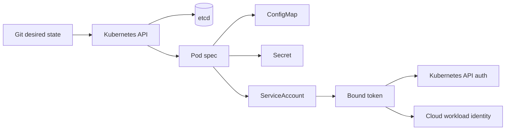
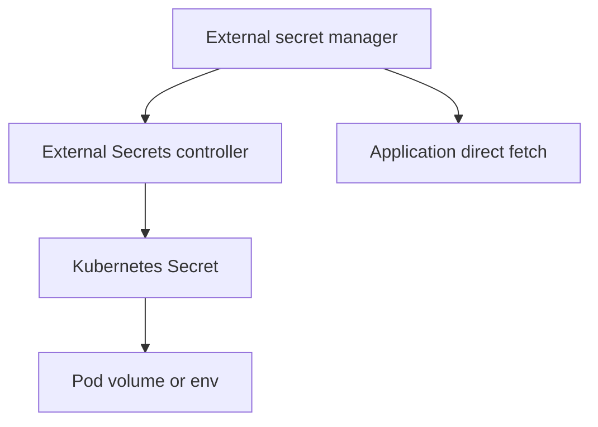
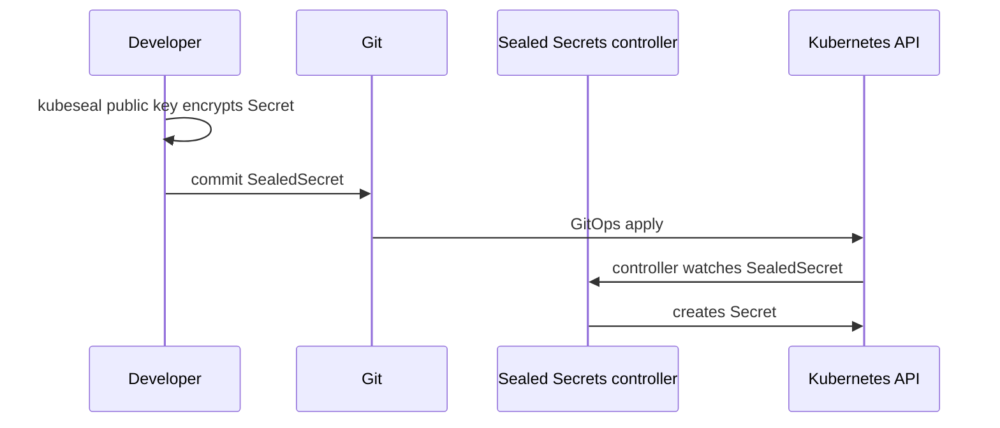
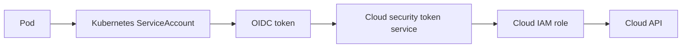

Purpose: explain how Kubernetes carries application configuration, protects secret material, and assigns runtime identity to workloads with production-grade controls.

# Configuration, Secrets, ServiceAccounts, and Runtime Identity

This note connects [Kubernetes](/compendium/kubernetes/kubernetes), <span className="compendium-external-reference" title="Vault-only reference">Software Supply Chain Security</span>, [09 Security RBAC Pod Security Admission and Supply Chain](/compendium/kubernetes/security-rbac-pod-security-admission-and-supply-chain), and [09 Security RBAC Pod Security Admission and Supply Chain](/compendium/kubernetes/security-rbac-pod-security-admission-and-supply-chain). Configuration decides what a workload does after the image starts. Runtime identity decides what the workload is allowed to do after it starts. Treat both as part of the release artifact, not as ad hoc cluster state.

## Mental Model



Configuration and identity have different failure modes:

| Surface | Kubernetes object | Typical payload | Main risk | Production control |
| --- | --- | --- | --- | --- |
| Non-secret config | ConfigMap | flags, URLs, feature gates | stale rollout, invalid shape | schema validation, rollout checksum |
| Secret config | Secret | passwords, API keys, certificates | disclosure, overbroad access | RBAC, encryption at rest, external secret source |
| Runtime identity | ServiceAccount | API identity for Pods | privilege escalation | least privilege RoleBinding |
| Token material | projected service account token | bounded JWT | token theft or audience confusion | short TTL, audience pinning |
| Cloud identity | provider binding | AWS IAM role, GCP service account, Azure federated identity | cloud privilege sprawl | namespace scoped mapping |

## ConfigMaps

A ConfigMap stores non-confidential key-value data. It is useful for application settings that change more often than container images but should still be reviewed, versioned, and rolled out deliberately.

```yaml
apiVersion: v1
kind: ConfigMap
metadata:
  name: api-config
  namespace: payments
data:
  LOG_LEVEL: info
  FEATURE_RECONCILER: "true"
  application.yaml: |
    server:
      port: 8080
    reconciliation:
      batchSize: 100
```

Consume a ConfigMap as environment variables when the application reads configuration once at process start:

```yaml
apiVersion: apps/v1
kind: Deployment
metadata:
  name: payments-api
  namespace: payments
spec:
  template:
    spec:
      containers:
        - name: api
          image: example.com/payments-api:1.8.0
          envFrom:
            - configMapRef:
                name: api-config
```

Consume a ConfigMap as files when the application can reload or inspect structured files:

```yaml
apiVersion: apps/v1
kind: Deployment
metadata:
  name: payments-api
  namespace: payments
spec:
  template:
    spec:
      volumes:
        - name: config
          configMap:
            name: api-config
            items:
              - key: application.yaml
                path: application.yaml
      containers:
        - name: api
          image: example.com/payments-api:1.8.0
          volumeMounts:
            - name: config
              mountPath: /etc/payments
              readOnly: true
```

### Env Vars vs Mounted Files

| Choice | Strengths | Weaknesses | Best use |
| --- | --- | --- | --- |
| `env` or `envFrom` | simple, visible in Pod spec, compatible with twelve-factor apps | values do not update until Pod restart, can leak through process env and diagnostics | small startup config |
| mounted ConfigMap files | supports structured files, kubelet can update projected content | application must reload, update delay is not instant, `subPath` disables live updates | config files and certificates |
| command args | explicit process contract | easy to leak in process listings | non-secret flags only |
| init generated config | supports templating and validation | adds startup complexity | derived config from multiple sources |

Avoid mounting a ConfigMap over a directory that already contains image files unless the replacement is intentional. Kubernetes mounts hide the image directory contents at that mount path.

## Secrets

A Kubernetes Secret stores sensitive data as a Kubernetes API object. It is not automatically safe just because its kind is `Secret`.

```yaml
apiVersion: v1
kind: Secret
metadata:
  name: db-credentials
  namespace: payments
type: Opaque
stringData:
  username: app_user
  password: example-prod-password-rotated-20260615
```

Use `stringData` for authoring clear text manifests that a controller or CI step will transform. Use `data` only when the value is already base64 encoded.

```yaml
apiVersion: v1
kind: Secret
metadata:
  name: db-credentials
  namespace: payments
type: Opaque
data:
  username: YXBwX3VzZXI=
  password: c2VjcmV0LXZhbHVl
```

### Base64 Encoding vs Encryption

Base64 is an encoding, not encryption. Anyone with the encoded value can decode it.

```bash
printf '%s' 'secret-value' | base64
printf '%s' 'c2VjcmV0LXZhbHVl' | base64 --decode
```

Secret safety depends on the whole path:

| Layer | What it protects | What it does not protect |
| --- | --- | --- |
| base64 in Secret `data` | YAML binary safety | confidentiality |
| Kubernetes RBAC | API reads and writes | node-local access by privileged workloads |
| etcd encryption at rest | raw etcd disk snapshots | API clients authorized to read Secrets |
| node filesystem permissions | projected files in a Pod | compromised container with file access |
| external secret manager | source of truth and rotation | misuse after sync into cluster |

## etcd Encryption at Rest

Without encryption at rest, Secret values are stored in etcd in a recoverable form. Enable Kubernetes API server encryption providers so etcd backups and disk snapshots do not expose plaintext Secrets.

Example encryption configuration:

```yaml
apiVersion: apiserver.config.k8s.io/v1
kind: EncryptionConfiguration
resources:
  - resources:
      - secrets
    providers:
      - aescbc:
          keys:
            - name: key1
              secret: MDEyMzQ1Njc4OWFiY2RlZjAxMjM0NTY3ODlhYmNkZWY=
      - identity: {}
```

Operational guidance:

| Practice | Why it matters |
| --- | --- |
| Put `identity` last | new writes encrypt while old cleartext reads remain possible during migration |
| Rotate keys with staged providers | avoids making old encrypted objects unreadable |
| Rewrite Secrets after enabling encryption | existing etcd records remain in their old representation until rewritten |
| Protect encryption config files | the file contains keys or references that can decrypt data |
| Test restore from encrypted backup | backup value is low without a proven key recovery process |

Useful commands:

```bash
kubectl get secrets -A
kubectl get secret db-credentials -n payments -o yaml
kubectl get secret db-credentials -n payments -o jsonpath='{.data.password}' | base64 --decode
kubectl replace -f secret.yaml
```

## External Secrets Patterns

External secret systems keep secret material outside Kubernetes as the source of truth, then deliver it to workloads.



| Pattern | Flow | Strengths | Tradeoffs |
| --- | --- | --- | --- |
| Sync controller | secret manager to Kubernetes Secret | works with standard Pods, easy adoption | secret still lands in cluster |
| CSI secret store | secret manager to mounted volume | avoids long-lived Kubernetes Secret in some modes | app must read files, provider dependency |
| Direct application fetch | app calls secret manager | strongest source control and dynamic rotation | app complexity, bootstrap identity needed |
| Sidecar agent | agent writes files or templates | language agnostic, supports renewal | extra process and failure mode |

External Secrets Operator style example:

```yaml
apiVersion: external-secrets.io/v1beta1
kind: ExternalSecret
metadata:
  name: db-credentials
  namespace: payments
spec:
  refreshInterval: 1h
  secretStoreRef:
    name: platform-vault
    kind: ClusterSecretStore
  target:
    name: db-credentials
    creationPolicy: Owner
  data:
    - secretKey: username
      remoteRef:
        key: prod/payments/db
        property: username
    - secretKey: password
      remoteRef:
        key: prod/payments/db
        property: password
```

## Sealed Secrets Overview

Sealed Secrets encrypts a Secret for a cluster-side controller. The encrypted manifest can be stored in Git. Only the controller private key can decrypt it into a regular Secret.



Important constraints:

| Topic | Guidance |
| --- | --- |
| Scope | namespace and name binding prevents copying encrypted data to another target unless configured |
| Key backup | losing the controller private key can make sealed data undecryptable |
| Rotation | rotate controller keys deliberately and reseal values |
| Threat model | protects Git and CI logs, not workloads that can read the resulting Secret |

## Config Rollout Patterns

Kubernetes does not automatically restart Pods when a referenced ConfigMap or Secret changes through environment variables. Use explicit rollout mechanisms.

| Pattern | How it works | Use when |
| --- | --- | --- |
| immutable name | `api-config-20260615` referenced by Deployment | GitOps wants deterministic rollout per change |
| checksum annotation | Pod template annotation contains config hash | Helm or Kustomize renders manifests |
| manual restart | `kubectl rollout restart deployment/payments-api` | emergency or small manual cluster |
| reloader controller | controller watches config and restarts workloads | many teams need automatic reaction |
| file reload | app watches mounted files | config is safe to reload without process restart |

Checksum pattern:

```yaml
apiVersion: apps/v1
kind: Deployment
metadata:
  name: payments-api
  namespace: payments
spec:
  template:
    metadata:
      annotations:
        checksum/config: "sha256:9f86d081884c7d659a2feaa0c55ad015"
    spec:
      containers:
        - name: api
          image: example.com/payments-api:1.8.0
```

Manual rollout commands:

```bash
kubectl apply -f configmap.yaml
kubectl rollout restart deployment/payments-api -n payments
kubectl rollout status deployment/payments-api -n payments
kubectl describe pod -n payments -l app=payments-api
```

## Immutable ConfigMaps and Secrets

Set `immutable: true` when a ConfigMap or Secret should never change in place.

```yaml
apiVersion: v1
kind: ConfigMap
metadata:
  name: api-config-20260615
  namespace: payments
immutable: true
data:
  LOG_LEVEL: info
```

Benefits:

| Benefit | Explanation |
| --- | --- |
| safer rollouts | changing config requires a new object name and a Pod template change |
| kubelet efficiency | Kubernetes does not need to watch for changes to immutable objects |
| audit clarity | history is visible through object names and Git diffs |

Tradeoffs:

| Tradeoff | Mitigation |
| --- | --- |
| cannot patch in place | create a new versioned object |
| object buildup | prune old unused versions after rollout |
| more naming discipline | use date, semantic version, or content hash |

## ServiceAccounts

A ServiceAccount is the Kubernetes identity assigned to a Pod. It is not the same as a human user account. Every namespace has a `default` ServiceAccount, but production workloads should usually use a named ServiceAccount with precise permissions.

```yaml
apiVersion: v1
kind: ServiceAccount
metadata:
  name: payments-api
  namespace: payments
automountServiceAccountToken: false
```

Attach it to a Deployment:

```yaml
apiVersion: apps/v1
kind: Deployment
metadata:
  name: payments-api
  namespace: payments
spec:
  template:
    spec:
      serviceAccountName: payments-api
      automountServiceAccountToken: false
      containers:
        - name: api
          image: example.com/payments-api:1.8.0
```

If the workload does not need Kubernetes API access, disable token mounting. This is one of the highest-value least privilege defaults.

## RBAC for Runtime Identity

Grant only the verbs and resources the workload needs.

```yaml
apiVersion: rbac.authorization.k8s.io/v1
kind: Role
metadata:
  name: payments-api-reader
  namespace: payments
rules:
  - apiGroups: [""]
    resources: ["configmaps"]
    resourceNames: ["api-runtime-flags"]
    verbs: ["get"]
---
apiVersion: rbac.authorization.k8s.io/v1
kind: RoleBinding
metadata:
  name: payments-api-reader
  namespace: payments
subjects:
  - kind: ServiceAccount
    name: payments-api
    namespace: payments
roleRef:
  apiGroup: rbac.authorization.k8s.io
  kind: Role
  name: payments-api-reader
```

Review permissions:

```bash
kubectl auth can-i get configmap/api-runtime-flags --as system:serviceaccount:payments:payments-api -n payments
kubectl auth can-i list secrets --as system:serviceaccount:payments:payments-api -n payments
kubectl describe role payments-api-reader -n payments
kubectl describe rolebinding payments-api-reader -n payments
```

## Bound ServiceAccount Tokens

Modern clusters use bound service account tokens instead of old long-lived token Secrets. Bound tokens are short-lived, audience-scoped, and tied to the Pod lifecycle.

Projected token volume:

```yaml
apiVersion: v1
kind: Pod
metadata:
  name: token-demo
  namespace: payments
spec:
  serviceAccountName: payments-api
  automountServiceAccountToken: false
  volumes:
    - name: api-token
      projected:
        sources:
          - serviceAccountToken:
              path: token
              audience: https://kubernetes.default.svc
              expirationSeconds: 3600
  containers:
    - name: app
      image: busybox:1.36
      command: ["sh", "-c", "sleep 3600"]
      volumeMounts:
        - name: api-token
          mountPath: /var/run/secrets/tokens
          readOnly: true
```

Key fields:

| Field | Meaning |
| --- | --- |
| `audience` | intended recipient that should accept the token |
| `expirationSeconds` | requested lifetime |
| `path` | file name under the projected volume |
| Pod binding | token becomes invalid when the Pod is deleted |

## TokenRequest

The TokenRequest API creates bounded tokens for a ServiceAccount. Use it for clients that need a token outside the default projected path, such as test jobs or a bootstrap process.

```bash
kubectl create token payments-api -n payments --duration=15m --audience=https://kubernetes.default.svc
```

API shape:

```yaml
apiVersion: authentication.k8s.io/v1
kind: TokenRequest
spec:
  audiences:
    - https://kubernetes.default.svc
  expirationSeconds: 900
```

Production cautions:

| Caution | Reason |
| --- | --- |
| do not store generated tokens in Git | they are bearer credentials |
| request the narrowest audience | prevents reuse against a different relying party |
| prefer Pod projected tokens | kubelet handles refresh |
| monitor legacy token Secrets | old clusters or add-ons may create long-lived credentials |

## Projected Volumes

A projected volume combines several sources into one mounted directory.

```yaml
apiVersion: v1
kind: Pod
metadata:
  name: projected-demo
  namespace: payments
spec:
  serviceAccountName: payments-api
  volumes:
    - name: runtime
      projected:
        defaultMode: 0400
        sources:
          - configMap:
              name: api-config
              items:
                - key: application.yaml
                  path: application.yaml
          - secret:
              name: db-credentials
              items:
                - key: password
                  path: db-password
          - serviceAccountToken:
              path: token
              audience: https://kubernetes.default.svc
              expirationSeconds: 3600
  containers:
    - name: api
      image: example.com/payments-api:1.8.0
      volumeMounts:
        - name: runtime
          mountPath: /var/run/payments
          readOnly: true
```

Projected volumes are a good fit for runtime bundles that combine config files, certs, and a bounded identity token. Keep file paths stable and rotate content through object changes or token refresh.

## Cloud Workload Identity

Cloud workload identity maps a Kubernetes ServiceAccount to a cloud IAM principal without static cloud keys in Secrets.



Provider examples:

| Cloud | Common mechanism | Kubernetes side | Cloud side |
| --- | --- | --- | --- |
| AWS | IAM Roles for Service Accounts | ServiceAccount annotation with role ARN | IAM OIDC provider and trust policy |
| GCP | Workload Identity Federation | KSA to GSA binding | IAM allow policy |
| Azure | Workload identity federation | ServiceAccount annotation and projected token | federated identity credential |

Design rules:

| Rule | Rationale |
| --- | --- |
| one ServiceAccount per workload capability | avoids shared blast radius |
| bind cloud role to namespace and ServiceAccount | prevents another namespace from borrowing identity |
| no static cloud access keys in Kubernetes Secrets | static keys are hard to rotate and easy to copy |
| split read, write, and admin roles | supports incident containment |
| log cloud principal and Kubernetes identity together | makes audit trails usable |

## Least Privilege Identity Design

Build identity from the action graph:

1. List every API the workload calls.
2. Separate Kubernetes API calls from cloud API calls.
3. Define one ServiceAccount per deployable workload, not per namespace.
4. Disable automatic token mounting unless Kubernetes API access is required.
5. Grant namespaced Roles before ClusterRoles.
6. Pin cloud workload identity to namespace and ServiceAccount.
7. Add negative `kubectl auth can-i` checks to reviews.

Permission review table:

| Question | Good answer |
| --- | --- |
| Does this Pod need Kubernetes API access? | no token mounted, or exact resources and verbs only |
| Does it need Secrets access? | usually no, because Secrets should be mounted by kubelet |
| Does it need cluster scope? | only controllers and infrastructure agents usually do |
| Can another namespace assume the identity? | no, trust policy includes namespace and ServiceAccount |
| How is rotation handled? | bounded tokens or external secret rotation |

## Common Mistakes

| Mistake | Impact | Fix |
| --- | --- | --- |
| committing raw Secret YAML | secret leakage through Git history | use External Secrets, Sealed Secrets, or secret manager fetch |
| assuming base64 is encryption | easy credential disclosure | enable etcd encryption and external secret controls |
| using `default` ServiceAccount | hidden shared privileges | create workload-specific ServiceAccounts |
| broad `list secrets` permission | namespace-wide credential exposure | avoid Secret reads, mount needed values |
| updating ConfigMap without restart | Pods keep old env values | rollout restart or checksum annotation |
| mounting with `subPath` for reloadable config | mounted file will not update | mount directory directly |
| using one cloud role for many apps | large blast radius | bind one role per workload capability |
| missing token audience | token accepted by unintended service | set explicit audience |
| storing generated ServiceAccount tokens | long-lived bearer credential sprawl | use TokenRequest with short duration |

## Troubleshooting

Configuration not visible:

```bash
kubectl get configmap api-config -n payments -o yaml
kubectl get pod -n payments -l app=payments-api -o jsonpath='{.items[0].spec.containers[0].envFrom}'
kubectl exec -n payments deploy/payments-api -- printenv | sort
kubectl exec -n payments deploy/payments-api -- ls -la /etc/payments
```

Secret value mismatch:

```bash
kubectl get secret db-credentials -n payments -o jsonpath='{.data.password}' | base64 --decode
kubectl describe pod -n payments -l app=payments-api
kubectl rollout history deployment/payments-api -n payments
```

ServiceAccount cannot access API:

```bash
kubectl get pod -n payments -o jsonpath='{range .items[*]}{.metadata.name}{" "}{.spec.serviceAccountName}{"\n"}{end}'
kubectl auth can-i get pods --as system:serviceaccount:payments:payments-api -n payments
kubectl describe rolebinding -n payments
kubectl exec -n payments deploy/payments-api -- ls -la /var/run/secrets/kubernetes.io/serviceaccount
```

Projected token issues:

```bash
kubectl describe pod token-demo -n payments
kubectl exec -n payments token-demo -- cat /var/run/secrets/tokens/token
kubectl create token payments-api -n payments --duration=10m --audience=https://kubernetes.default.svc
```

External Secrets not syncing:

```bash
kubectl get externalsecret -n payments
kubectl describe externalsecret db-credentials -n payments
kubectl get secretstore,clustersecretstore -A
kubectl logs -n external-secrets deploy/external-secrets
```

## Production Guidance

| Area | Guidance |
| --- | --- |
| authoring | keep non-secret config in Git, keep secret values in a secret manager |
| validation | validate config shape in CI and again on process startup |
| rollout | tie config changes to Pod template changes through hash annotations or versioned names |
| immutability | use immutable ConfigMaps and Secrets for release-bound config |
| secret storage | enable etcd encryption at rest and protect backups |
| secret delivery | prefer external secret managers and short rotation intervals |
| identity | default to `automountServiceAccountToken: false` |
| RBAC | grant verbs by resource name when possible |
| cloud access | use workload identity instead of static cloud credentials |
| audit | log ServiceAccount, namespace, Pod name, and cloud principal |

## Review Checklist

- [ ] Every workload has a named ServiceAccount.
- [ ] Workloads that do not call the Kubernetes API set `automountServiceAccountToken: false`.
- [ ] No raw Secret values are committed to Git.
- [ ] Secret manifests use `stringData` only in sealed or transformed workflows.
- [ ] etcd encryption at rest is enabled for Secrets.
- [ ] ConfigMap and Secret changes trigger a rollout when consumed as env vars.
- [ ] Mounted config that must refresh is not mounted with `subPath`.
- [ ] External secret sync status is monitored.
- [ ] RBAC uses namespaced Roles unless cluster scope is required.
- [ ] Cloud workload identity trust is pinned to namespace and ServiceAccount.
- [ ] TokenRequest usage has explicit audience and short duration.
- [ ] Legacy ServiceAccount token Secrets are inventoried and removed where possible.

## Related Notes

- [Kubernetes](/compendium/kubernetes/kubernetes)
- [07 Storage Volumes PVCs StorageClasses CSI and Stateful Data](/compendium/kubernetes/storage-volumes-pvcs-storageclasses-csi-and-stateful-data)
- <span className="compendium-external-reference" title="Vault-only reference">Software Supply Chain Security</span>
- [09 Security RBAC Pod Security Admission and Supply Chain](/compendium/kubernetes/security-rbac-pod-security-admission-and-supply-chain)
- [09 Security RBAC Pod Security Admission and Supply Chain](/compendium/kubernetes/security-rbac-pod-security-admission-and-supply-chain)
