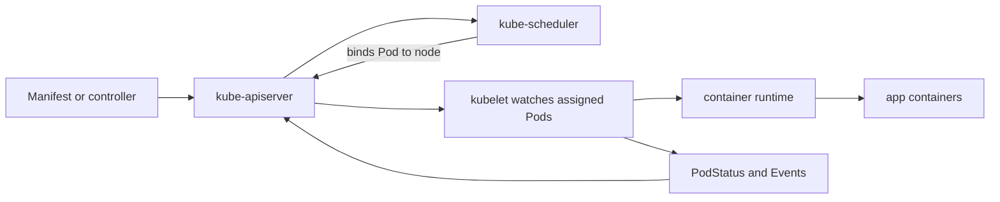
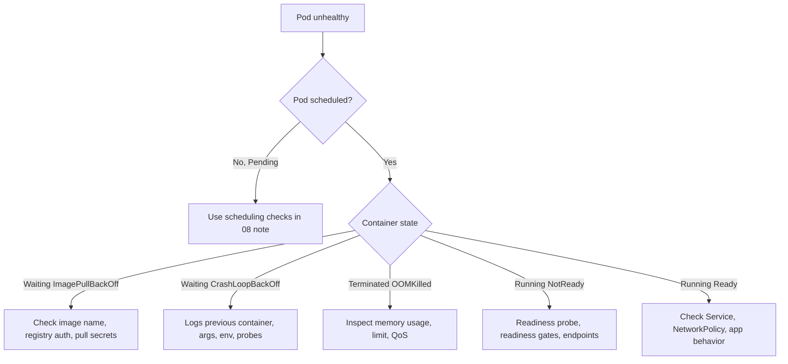

Purpose: Explain the Pod-level primitives that every Kubernetes workload controller builds on, including container lifecycle, sidecar patterns, readiness, disruption behavior, identity, and node-local special cases.

# Containers, Pods, and workload primitives

This note is the base layer for [03 Deployments ReplicaSets StatefulSets DaemonSets Jobs and CronJobs](/compendium/kubernetes/deployments-replicasets-statefulsets-daemonsets-jobs-and-cronjobs) and [08 Scheduling Resources Requests Limits QoS and Autoscaling](/compendium/kubernetes/scheduling-resources-requests-limits-qos-and-autoscaling). A Kubernetes workload controller does not run a container directly. It creates or adopts Pods, and the kubelet on the selected node turns each PodSpec into runtime containers, volumes, probes, cgroups, network namespace, and status.



## Pod model

A Pod is the smallest schedulable Kubernetes unit. Containers in one Pod share:

- One network namespace: same Pod IP, same localhost, shared port space.
- Optional volumes: containers can mount the same volume at different paths.
- Fate and placement: all containers in a Pod are scheduled to the same node and are normally recreated together.
- Security context inheritance: Pod-level defaults can be refined at container level.

Pods are deliberately disposable. A bare Pod is useful for debugging, static control-plane components, or one-off experiments, but production services should be owned by a controller such as [Deployment](/compendium/kubernetes/deployments-replicasets-statefulsets-daemonsets-jobs-and-cronjobs), [StatefulSet](/compendium/kubernetes/deployments-replicasets-statefulsets-daemonsets-jobs-and-cronjobs), [DaemonSet](/compendium/kubernetes/deployments-replicasets-statefulsets-daemonsets-jobs-and-cronjobs), or [Job](/compendium/kubernetes/deployments-replicasets-statefulsets-daemonsets-jobs-and-cronjobs).

## Pod anatomy

```yaml
apiVersion: v1
kind: Pod
metadata:
  name: payments-api-debug
  labels:
    app.kubernetes.io/name: payments-api
    app.kubernetes.io/component: api
spec:
  serviceAccountName: payments-api
  restartPolicy: Always
  terminationGracePeriodSeconds: 45
  securityContext:
    runAsNonRoot: true
    seccompProfile:
      type: RuntimeDefault
  initContainers:
    - name: wait-for-schema
      image: ghcr.io/example/db-tools:1.4.2
      command: ["sh", "-c", "until db-migrate status --ready; do sleep 2; done"]
      resources:
        requests:
          cpu: 50m
          memory: 64Mi
        limits:
          memory: 128Mi
  containers:
    - name: api
      image: ghcr.io/example/payments-api:2.8.1
      ports:
        - name: http
          containerPort: 8080
      env:
        - name: POD_NAME
          valueFrom:
            fieldRef:
              fieldPath: metadata.name
      readinessProbe:
        httpGet:
          path: /ready
          port: http
        periodSeconds: 5
        failureThreshold: 2
      livenessProbe:
        httpGet:
          path: /healthz
          port: http
        initialDelaySeconds: 30
        periodSeconds: 10
      startupProbe:
        httpGet:
          path: /startup
          port: http
        failureThreshold: 30
        periodSeconds: 2
      lifecycle:
        preStop:
          exec:
            command: ["sh", "-c", "sleep 10"]
      resources:
        requests:
          cpu: 250m
          memory: 256Mi
        limits:
          memory: 512Mi
```

## Containers inside a Pod

| Container type | Runs when | Primary use | Production guidance |
| --- | --- | --- | --- |
| App container | After init containers complete | Main process, API, worker, web server | Keep one primary responsibility per container. Expose clear health checks. |
| Init container | Before app containers start, sequentially | Blocking setup such as migrations, permissions, dependency checks | Make idempotent. Avoid long unbounded waits that hide dependency failures. |
| Native sidecar as restartable init container | Starts in init phase and keeps running with `restartPolicy: Always` | Log shippers, mesh proxies, local agents that must start before app containers | Prefer when sidecar startup ordering matters and the cluster version supports restartable init containers. |
| Ephemeral container | Added to a running Pod for debugging | Inspect namespaces, process state, network tools | Never rely on it for steady-state behavior. It cannot define ports or probes. |

### Init containers

Init containers run sequentially and must succeed before ordinary app containers start. They are good for deterministic setup, but they are not a substitute for application-level resilience. An app should still handle dependency restarts after it is already running.

```yaml
apiVersion: v1
kind: Pod
metadata:
  name: init-example
spec:
  initContainers:
    - name: prepare-config
      image: busybox:1.36
      command: ["sh", "-c", "cp /defaults/* /workdir/"]
      volumeMounts:
        - name: workdir
          mountPath: /workdir
  containers:
    - name: app
      image: ghcr.io/example/app:1.0.0
      volumeMounts:
        - name: workdir
          mountPath: /app/config
  volumes:
    - name: workdir
      emptyDir: {}
```

### Native sidecars

Native sidecars are expressed as init containers with `restartPolicy: Always`. They start before app containers, remain running, and are restarted independently by the kubelet. This is different from a classic sidecar in `spec.containers`, where all regular containers start without explicit ordering.

```yaml
apiVersion: v1
kind: Pod
metadata:
  name: native-sidecar-example
spec:
  initContainers:
    - name: log-agent
      image: ghcr.io/example/log-agent:3.2.0
      restartPolicy: Always
      volumeMounts:
        - name: logs
          mountPath: /var/log/app
  containers:
    - name: app
      image: ghcr.io/example/app:1.0.0
      volumeMounts:
        - name: logs
          mountPath: /var/log/app
  volumes:
    - name: logs
      emptyDir: {}
```

Use native sidecars when the helper must be running before the main app starts, such as a local proxy, log collector, or node integration. Keep resource requests explicit because sidecars change total Pod request and therefore scheduling behavior in [08 Scheduling Resources Requests Limits QoS and Autoscaling](/compendium/kubernetes/scheduling-resources-requests-limits-qos-and-autoscaling).

### Ephemeral containers

Ephemeral containers are injected through the `ephemeralcontainers` subresource for live debugging. They share namespaces according to the Pod configuration and runtime support, which makes them useful when the app image is minimal.

```bash
kubectl debug -n prod pod/payments-api-6fbc9d8d8f-q2n8s -it \
  --image=busybox:1.36 --target=api -- sh

kubectl get pod -n prod payments-api-6fbc9d8d8f-q2n8s -o yaml
kubectl describe pod -n prod payments-api-6fbc9d8d8f-q2n8s
```

Operational constraints:

- Ephemeral containers are for investigation, not repair by mutation.
- They do not restart automatically.
- They should be controlled by RBAC because they can expose process, filesystem, and network context.
- Admission policy should restrict privileged debugging images in production namespaces.

## Restart policies and container restarts

`spec.restartPolicy` applies to all app containers in a Pod, with values `Always`, `OnFailure`, and `Never`.

| Policy | Typical owners | Behavior | Common mistake |
| --- | --- | --- | --- |
| `Always` | Deployment, StatefulSet, DaemonSet | Restart containers whenever they exit | Using it for finite batch work and creating endless retries. |
| `OnFailure` | Job | Restart failed containers until Job rules are satisfied | Assuming a completed container will rerun after success. |
| `Never` | Job, debug Pod | Leave failed or completed containers stopped | Forgetting that the controller may create a replacement Pod instead. |

Container restart backoff is local kubelet behavior. A Pod in `CrashLoopBackOff` is usually scheduled and running at the infrastructure layer, but at least one container repeatedly exits. Debug the process, configuration, secrets, probes, and dependencies before blaming scheduling.

```bash
kubectl get pod -n prod payments-api-6fbc9d8d8f-q2n8s
kubectl describe pod -n prod payments-api-6fbc9d8d8f-q2n8s
kubectl logs -n prod payments-api-6fbc9d8d8f-q2n8s -c api --previous
kubectl get events -n prod --field-selector involvedObject.name=payments-api-6fbc9d8d8f-q2n8s --sort-by=.lastTimestamp
```

## Probes, readiness, and readiness gates

| Mechanism | Decides | Effect |
| --- | --- | --- |
| Startup probe | Whether the app has finished slow startup | Disables liveness and readiness failure handling until it succeeds. |
| Readiness probe | Whether the Pod should receive Service traffic | Removes or adds Pod IPs from Service endpoints. |
| Liveness probe | Whether the container should be restarted | Kubelet restarts the container after repeated failures. |
| Readiness gate | Whether extra Pod conditions are satisfied | Pod is not Ready until custom conditions are true. |

Readiness gates let external controllers participate in readiness. They are useful for load balancer registration, service mesh warmup, data-plane programming, or custom admission flows where the application process is healthy but traffic should not arrive yet.

```yaml
apiVersion: v1
kind: Pod
metadata:
  name: api-with-readiness-gate
spec:
  readinessGates:
    - conditionType: "network.example.com/LoadBalancerReady"
  containers:
    - name: api
      image: ghcr.io/example/api:1.0.0
      readinessProbe:
        httpGet:
          path: /ready
          port: 8080
```

Production rules:

- Readiness should answer "can I serve this request class now", not "is the process alive".
- Liveness should detect unrecoverable local wedged states, not downstream outages.
- Startup probes prevent slow boot from being killed by liveness.
- Readiness gates require a controller that patches Pod status conditions. Without it, Pods remain not ready.

## PodDisruptionBudget

A PodDisruptionBudget constrains voluntary disruptions such as node drains and some cluster maintenance. It does not prevent involuntary loss from crashes, node power loss, kernel panic, eviction, or bad app releases.

```yaml
apiVersion: policy/v1
kind: PodDisruptionBudget
metadata:
  name: payments-api
spec:
  minAvailable: 2
  selector:
    matchLabels:
      app.kubernetes.io/name: payments-api
```

| PDB shape | Good fit | Risk |
| --- | --- | --- |
| `minAvailable: N` | Services where absolute available replica count matters | Can block drains if replicas are already degraded. |
| `maxUnavailable: N` | Homogeneous horizontally scaled services | Bad if `N` is too large for real traffic headroom. |
| No PDB | Disposable dev workloads and single-instance noncritical tasks | Voluntary disruption can remove all replicas at once. |

PDBs should be paired with sane rolling update settings in [03 Deployments ReplicaSets StatefulSets DaemonSets Jobs and CronJobs](/compendium/kubernetes/deployments-replicasets-statefulsets-daemonsets-jobs-and-cronjobs) and real capacity planning in [08 Scheduling Resources Requests Limits QoS and Autoscaling](/compendium/kubernetes/scheduling-resources-requests-limits-qos-and-autoscaling).

## Static Pods

Static Pods are manifests read directly from a node filesystem by kubelet, usually from `/etc/kubernetes/manifests`. The API server sees mirror Pods, but no workload controller owns them. They are commonly used by kubeadm for control-plane components.

```bash
sudo ls /etc/kubernetes/manifests
kubectl get pods -n kube-system -o wide
kubectl describe pod -n kube-system kube-apiserver-control-plane-1
```

Tradeoffs:

| Benefit | Cost |
| --- | --- |
| Kubelet can run critical components before higher-level controllers exist | Updates are node-file operations, not Deployment rollouts. |
| Works even when the scheduler is unavailable | Static Pods cannot use ServiceAccounts, ConfigMaps, Secrets, or dynamic admission like normal Pods. |
| Simple bootstrap mechanism | Operational drift can happen if node files are managed inconsistently. |

Avoid static Pods for application workloads. Use them only when node-local bootstrap or control-plane self-hosting requires kubelet-level ownership.

## Workload identity considerations

A Pod's identity is primarily its ServiceAccount plus projected tokens, labels, namespace, and network identity. Treat identity as an explicit production design, not a default.

```yaml
apiVersion: v1
kind: ServiceAccount
metadata:
  name: payments-api
  annotations:
    eks.amazonaws.com/role-arn: arn:aws:iam::123456789012:role/payments-api
---
apiVersion: apps/v1
kind: Deployment
metadata:
  name: payments-api
spec:
  selector:
    matchLabels:
      app.kubernetes.io/name: payments-api
  template:
    metadata:
      labels:
        app.kubernetes.io/name: payments-api
    spec:
      serviceAccountName: payments-api
      automountServiceAccountToken: true
      containers:
        - name: api
          image: ghcr.io/example/payments-api:2.8.1
```

Guidance:

- Create one ServiceAccount per workload or trust boundary.
- Disable token automount for workloads that never call the Kubernetes API.
- Prefer projected, short-lived tokens over long-lived static credentials.
- Scope RBAC to verbs and resources actually needed.
- For cloud access, prefer provider workload identity integration over storing cloud keys in Secrets.
- Treat sidecars and ephemeral containers as part of the same Pod trust boundary unless isolation is explicitly enforced.

## Common mistakes

| Mistake | Symptom | Correction |
| --- | --- | --- |
| Running production apps as bare Pods | App disappears after delete or node failure | Use a controller from [03 Deployments ReplicaSets StatefulSets DaemonSets Jobs and CronJobs](/compendium/kubernetes/deployments-replicasets-statefulsets-daemonsets-jobs-and-cronjobs). |
| Liveness checks depend on databases | Transient database outage restarts every app replica | Move dependency checks to readiness or app logic. |
| No resource requests | Pods overpack nodes and autoscalers lack signal | Set CPU and memory requests as in [08 Scheduling Resources Requests Limits QoS and Autoscaling](/compendium/kubernetes/scheduling-resources-requests-limits-qos-and-autoscaling). |
| Sidecar has no request | Scheduler underestimates Pod footprint | Budget for every container, including native sidecars and agents. |
| PDB on a single replica with `minAvailable: 1` | Node drains block | Accept downtime, add replicas, or use maintenance-specific handling. |
| Readiness gate without controller | Pod never becomes Ready | Deploy and monitor the status-patching controller. |
| Overprivileged debug access | Debug shell becomes production escape path | Restrict ephemeral container RBAC and image policy. |

## Troubleshooting flow



Commands:

```bash
kubectl get pod -n prod -o wide
kubectl describe pod -n prod <pod>
kubectl logs -n prod <pod> -c <container> --previous
kubectl get pod -n prod <pod> -o jsonpath='{.status.containerStatuses[*].state}'
kubectl get pod -n prod <pod> -o jsonpath='{.status.conditions}'
kubectl auth can-i get pods --as=system:serviceaccount:prod:payments-api -n prod
```

## Review checklist

- The Pod is owned by the right controller unless it is intentionally static or debug-only.
- Every app, init, and sidecar container has resource requests and memory limits.
- Liveness, readiness, and startup probes answer different questions.
- Native sidecars use `initContainers[*].restartPolicy: Always` only when startup ordering matters.
- The workload ServiceAccount is scoped, named, and reviewed.
- PDB settings match replica count, availability target, and drain behavior.
- Termination grace and `preStop` give the app time to stop receiving traffic and finish in-flight work.
- Debug access through ephemeral containers is RBAC-controlled and audited.
