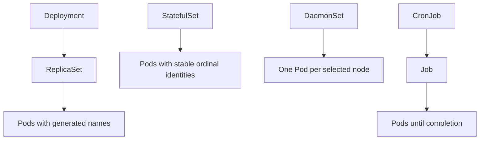
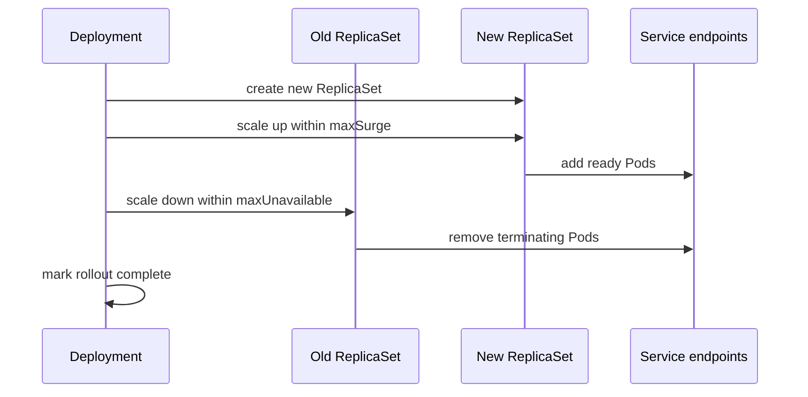

Purpose: Compare Kubernetes workload controllers and show how to operate stateless services, stateful services, node agents, batch jobs, scheduled jobs, rolling updates, and rollbacks safely.

# Deployments, ReplicaSets, StatefulSets, DaemonSets, Jobs, and CronJobs

Workload controllers reconcile desired state into Pods described in [02 Containers Pods and Workload Primitives](/compendium/kubernetes/containers-pods-and-workload-primitives). The controller choice defines identity, replacement behavior, update semantics, ordering, and failure handling. Scheduling and capacity behavior for the Pods they create is covered in [08 Scheduling Resources Requests Limits QoS and Autoscaling](/compendium/kubernetes/scheduling-resources-requests-limits-qos-and-autoscaling).



## Controller selection

| Controller | Best for | Identity | Replacement behavior | Avoid when |
| --- | --- | --- | --- | --- |
| Deployment | Stateless APIs, web apps, workers that can be duplicated | Interchangeable Pods behind labels | Creates new ReplicaSets for template changes | Each replica needs stable storage or ordered identity. |
| ReplicaSet | Low-level replica maintenance | Interchangeable Pods | Maintains count only | You need rollouts, rollback history, or normal app operations. |
| StatefulSet | Quorum systems, ordered replicas, stable network IDs, persistent volumes | Stable ordinal names and PVCs | Ordered by default, identity persists | The app can be stateless or managed service is available. |
| DaemonSet | Node agents, log collectors, CNI, CSI, monitoring exporters | One Pod per matching node | Adds/removes Pods as nodes match selector | The workload is request-driven and should scale by traffic. |
| Job | Finite batch, migrations, backfills, data repair | Completion-oriented Pods | Retries until completion policy is met | The process is a long-running service. |
| CronJob | Scheduled Job creation | Time-based Job objects | Creates Jobs by schedule and policy | Exact-once timing is required without idempotency. |

## Deployments

A Deployment manages ReplicaSets and provides declarative rollouts for stateless Pod templates.

```yaml
apiVersion: apps/v1
kind: Deployment
metadata:
  name: payments-api
  labels:
    app.kubernetes.io/name: payments-api
spec:
  replicas: 4
  revisionHistoryLimit: 5
  progressDeadlineSeconds: 600
  strategy:
    type: RollingUpdate
    rollingUpdate:
      maxSurge: 1
      maxUnavailable: 0
  selector:
    matchLabels:
      app.kubernetes.io/name: payments-api
  template:
    metadata:
      labels:
        app.kubernetes.io/name: payments-api
        app.kubernetes.io/component: api
    spec:
      serviceAccountName: payments-api
      containers:
        - name: api
          image: ghcr.io/example/payments-api:2.8.1
          ports:
            - name: http
              containerPort: 8080
          readinessProbe:
            httpGet:
              path: /ready
              port: http
          resources:
            requests:
              cpu: 250m
              memory: 256Mi
            limits:
              memory: 512Mi
```

Commands:

```bash
kubectl apply -f payments-api-deployment.yaml
kubectl get deploy,rs,pod -n prod -l app.kubernetes.io/name=payments-api
kubectl rollout status -n prod deployment/payments-api
kubectl describe deployment -n prod payments-api
kubectl scale -n prod deployment/payments-api --replicas=6
```

### ReplicaSets

ReplicaSets maintain a replica count for a Pod template. Deployments create and manage ReplicaSets, so direct ReplicaSet authoring is rare. Direct use is mainly for learning, specialized controllers, or repair of orphaned resources.

Risk: changing a Deployment selector or Pod labels incorrectly can orphan ReplicaSets or make multiple controllers fight over Pods. Treat selectors as immutable in practice.

## Rolling updates

During a Deployment rolling update, Kubernetes creates a new ReplicaSet, scales it up, and scales the old ReplicaSet down while respecting `maxSurge`, `maxUnavailable`, readiness, and PDBs.



`maxSurge` and `maxUnavailable` are capacity and availability levers.

| Setting | Meaning | Best fit | Tradeoff |
| --- | --- | --- | --- |
| `maxSurge: 1`, `maxUnavailable: 0` | Add one extra Pod before removing old Pods | User-facing APIs with strict availability | Needs spare cluster capacity. |
| `maxSurge: 25%`, `maxUnavailable: 25%` | Default proportional rollout | Medium-sized stateless services | Can reduce serving capacity during rollout. |
| `maxSurge: 0`, `maxUnavailable: 1` | Replace in place | Tight clusters where extra capacity is unavailable | Lower availability and slower recovery from bad releases. |
| `Recreate` strategy | Stop all old Pods, then start new Pods | Single-writer apps that cannot run mixed versions | Full downtime. |

Rollout commands:

```bash
kubectl set image -n prod deployment/payments-api api=ghcr.io/example/payments-api:2.8.2
kubectl rollout status -n prod deployment/payments-api --timeout=10m
kubectl rollout history -n prod deployment/payments-api
kubectl rollout history -n prod deployment/payments-api --revision=12
kubectl rollout undo -n prod deployment/payments-api
kubectl rollout undo -n prod deployment/payments-api --to-revision=11
kubectl rollout pause -n prod deployment/payments-api
kubectl rollout resume -n prod deployment/payments-api
```

Production guidance:

- Use immutable image tags or digests for reproducible rollbacks.
- Keep `revisionHistoryLimit` large enough for operational rollback but small enough to avoid clutter.
- Make readiness strict enough that new Pods enter Service endpoints only when usable.
- Use PDBs from [02 Containers Pods and Workload Primitives](/compendium/kubernetes/containers-pods-and-workload-primitives) to protect voluntary disruption during rollouts and drains.
- Watch `progressDeadlineSeconds`; a failed rollout should fail visibly rather than hang unnoticed.

## StatefulSets

StatefulSets manage Pods with stable names, stable ordinals, stable network identity, and per-replica PVCs. A Pod named `postgres-0` is replaced as `postgres-0`, not as a random new identity.

```yaml
apiVersion: apps/v1
kind: StatefulSet
metadata:
  name: ledger-db
spec:
  serviceName: ledger-db
  replicas: 3
  podManagementPolicy: OrderedReady
  updateStrategy:
    type: RollingUpdate
  selector:
    matchLabels:
      app.kubernetes.io/name: ledger-db
  template:
    metadata:
      labels:
        app.kubernetes.io/name: ledger-db
    spec:
      terminationGracePeriodSeconds: 60
      containers:
        - name: postgres
          image: postgres:16
          ports:
            - name: postgres
              containerPort: 5432
          volumeMounts:
            - name: data
              mountPath: /var/lib/postgresql/data
          resources:
            requests:
              cpu: "1"
              memory: 2Gi
            limits:
              memory: 4Gi
  volumeClaimTemplates:
    - metadata:
        name: data
      spec:
        accessModes: ["ReadWriteOnce"]
        storageClassName: fast-ssd
        resources:
          requests:
            storage: 100Gi
```

Stateful workload tradeoffs:

| Need | Kubernetes support | Operational cost |
| --- | --- | --- |
| Stable network names | `pod-ordinal.service.namespace.svc` | Clients or peers must understand membership. |
| Stable disk per replica | `volumeClaimTemplates` | Storage lifecycle, backup, restore, expansion, and zone affinity matter. |
| Ordered startup and update | `OrderedReady` | Slow or stuck replica blocks later replicas. |
| Parallel management | `podManagementPolicy: Parallel` | Faster operations but app must handle concurrency. |
| Scale down | Highest ordinal removed first | Data movement and quorum rules must be planned. |

### When not to run databases on Kubernetes

Do not run a database on Kubernetes just because the app is already there. Prefer a managed database or dedicated database platform when:

- The team cannot operate backup, restore, PITR, failover, replication, and upgrade procedures.
- Storage classes do not provide predictable latency, zone behavior, expansion, and snapshot integration.
- The database is business-critical and there is no regular restore drill.
- The cluster is frequently rebuilt, aggressively autoscaled, or managed by teams without database operational ownership.
- Licensing, support, or compliance requires a vendor-managed control plane.
- The workload requires specialized hardware, kernel tuning, or IO isolation the cluster cannot guarantee.

Running databases on Kubernetes can be reasonable when the team owns the database SLO, uses an operator with clear failure semantics, validates restore procedures, reserves capacity, and understands storage topology.

## DaemonSets

DaemonSets run one Pod per matching node. They are the normal shape for CNI agents, CSI node plugins, log collectors, metrics agents, security sensors, and node-local proxies.

```yaml
apiVersion: apps/v1
kind: DaemonSet
metadata:
  name: node-log-agent
  namespace: observability
spec:
  selector:
    matchLabels:
      app.kubernetes.io/name: node-log-agent
  updateStrategy:
    type: RollingUpdate
    rollingUpdate:
      maxUnavailable: 10%
  template:
    metadata:
      labels:
        app.kubernetes.io/name: node-log-agent
    spec:
      serviceAccountName: node-log-agent
      tolerations:
        - operator: Exists
      containers:
        - name: agent
          image: ghcr.io/example/log-agent:3.2.0
          resources:
            requests:
              cpu: 100m
              memory: 128Mi
            limits:
              memory: 256Mi
```

Production guidance:

- Add tolerations intentionally. `operator: Exists` puts the agent on every tainted node, including control-plane and specialized nodes.
- Budget DaemonSet requests in every node pool. One small per-node agent becomes large at cluster scale.
- Use rolling updates with conservative `maxUnavailable` for critical agents.
- Avoid mounting host paths or privileged mode unless the node integration requires it.

## Jobs

Jobs run Pods until a completion condition is met. They are for finite work such as migrations, reports, imports, backfills, and repair tasks.

```yaml
apiVersion: batch/v1
kind: Job
metadata:
  name: ledger-backfill-2026-06-15
spec:
  completions: 20
  parallelism: 4
  backoffLimit: 3
  activeDeadlineSeconds: 7200
  ttlSecondsAfterFinished: 86400
  template:
    spec:
      restartPolicy: OnFailure
      containers:
        - name: backfill
          image: ghcr.io/example/ledger-tools:1.9.0
          args: ["backfill", "--shards=20"]
          resources:
            requests:
              cpu: 500m
              memory: 512Mi
            limits:
              memory: 1Gi
```

Job rules:

- Make work idempotent. Retries and duplicate starts can happen.
- Use `activeDeadlineSeconds` to cap runaway work.
- Use `ttlSecondsAfterFinished` to clean completed Jobs while preserving enough history for diagnosis.
- Separate schema migrations from application rollout if rollback semantics differ.
- Prefer indexed Jobs for shard-specific work when each completion needs a stable index.

Commands:

```bash
kubectl apply -f ledger-backfill-job.yaml
kubectl get job,pod -n prod -l job-name=ledger-backfill-2026-06-15
kubectl logs -n prod job/ledger-backfill-2026-06-15
kubectl describe job -n prod ledger-backfill-2026-06-15
kubectl delete job -n prod ledger-backfill-2026-06-15
```

## CronJobs

CronJobs create Jobs on a schedule.

```yaml
apiVersion: batch/v1
kind: CronJob
metadata:
  name: nightly-ledger-close
spec:
  schedule: "15 2 * * *"
  timeZone: "Etc/UTC"
  concurrencyPolicy: Forbid
  startingDeadlineSeconds: 900
  successfulJobsHistoryLimit: 3
  failedJobsHistoryLimit: 5
  jobTemplate:
    spec:
      backoffLimit: 2
      template:
        spec:
          restartPolicy: OnFailure
          containers:
            - name: close-ledger
              image: ghcr.io/example/ledger-tools:1.9.0
              args: ["close-ledger", "--date=$(RUN_DATE)"]
```

CronJob tradeoffs:

| Setting | Effect | Guidance |
| --- | --- | --- |
| `concurrencyPolicy: Allow` | New Job can overlap old Job | Use only for independent runs. |
| `concurrencyPolicy: Forbid` | Skip new run if old run is active | Best default for backups, billing, reports, and maintenance. |
| `concurrencyPolicy: Replace` | Stop old run and start new one | Use only when latest run fully supersedes old work. |
| `startingDeadlineSeconds` | Limits late starts after controller downtime | Set according to business usefulness of late execution. |
| `timeZone` | Interprets schedule in a named zone | Prefer UTC unless business rules require local time. |

Manual run from CronJob:

```bash
kubectl create job -n prod manual-ledger-close-20260615 --from=cronjob/nightly-ledger-close
kubectl get cronjob,job -n prod
kubectl describe cronjob -n prod nightly-ledger-close
```

## Common mistakes

| Mistake | Symptom | Correction |
| --- | --- | --- |
| Using Deployment for a database that needs stable identity | Data attaches to the wrong replacement Pod or peer identity changes | Use StatefulSet or managed database. |
| Directly editing ReplicaSets | Deployment later reverts or replaces the change | Change the Deployment template. |
| Rolling update with weak readiness | Bad Pods receive traffic and rollout looks healthy | Make readiness represent real serving capability. |
| `maxUnavailable` too high | Rollout causes user-visible capacity drop | Use `maxSurge` and capacity planning. |
| No PDB | Node drain removes too many replicas | Add PDB and verify it does not block normal maintenance. |
| CronJob work is not idempotent | Duplicate billing, duplicate emails, corrupt imports | Use run keys, locks, or transactional guards. |
| DaemonSet requests ignored in capacity math | New nodes are immediately overcommitted | Include DaemonSet overhead in node pool sizing. |

## Troubleshooting

Deployment rollout:

```bash
kubectl rollout status -n prod deployment/payments-api
kubectl describe deployment -n prod payments-api
kubectl get rs -n prod -l app.kubernetes.io/name=payments-api
kubectl get pod -n prod -l app.kubernetes.io/name=payments-api -o wide
kubectl get events -n prod --sort-by=.lastTimestamp
```

StatefulSet:

```bash
kubectl get statefulset,pod,pvc -n prod -l app.kubernetes.io/name=ledger-db
kubectl describe pod -n prod ledger-db-0
kubectl get endpointslice -n prod -l kubernetes.io/service-name=ledger-db
kubectl describe pvc -n prod data-ledger-db-0
```

DaemonSet:

```bash
kubectl get daemonset -n observability node-log-agent
kubectl get pod -n observability -l app.kubernetes.io/name=node-log-agent -o wide
kubectl describe daemonset -n observability node-log-agent
```

Job and CronJob:

```bash
kubectl get job,pod -n prod
kubectl describe job -n prod ledger-backfill-2026-06-15
kubectl logs -n prod job/ledger-backfill-2026-06-15
kubectl get cronjob -n prod nightly-ledger-close -o yaml
```

## Review checklist

- Controller type matches identity, lifecycle, and update semantics.
- Selectors are stable and match only intended Pods.
- Rollout strategy reflects availability, spare capacity, and dependency compatibility.
- Rollback uses immutable image references or known-good versions.
- StatefulSet storage, backup, restore, and zone placement are documented and tested.
- DaemonSet tolerations, host access, and per-node resource cost are intentional.
- Jobs and CronJobs are idempotent, deadline-bound, and cleaned after completion.
- PDB, readiness probes, and autoscaling settings are reviewed together.
