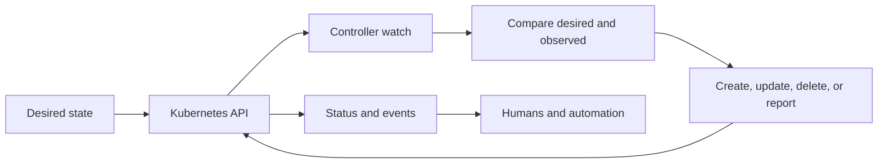
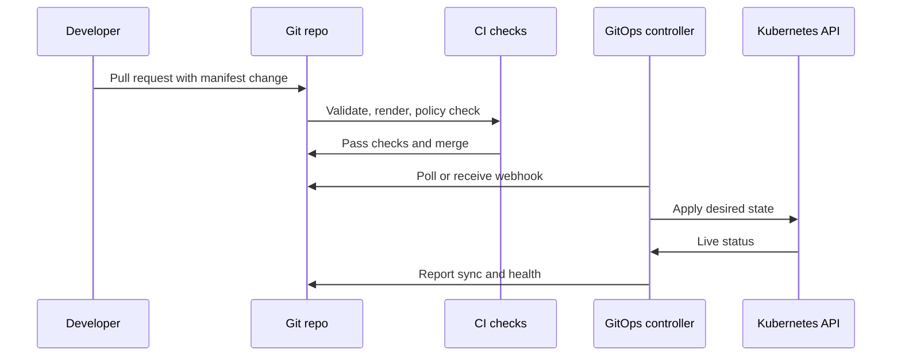
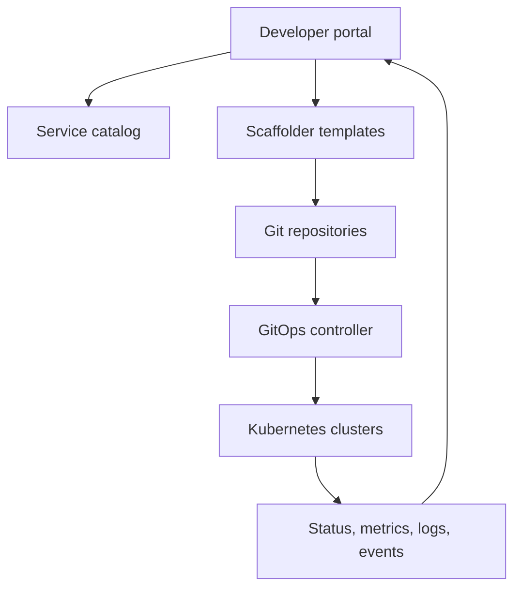

Purpose: explain how GitOps, controllers, operators, CRDs, and platform APIs turn Kubernetes into a reconciled platform rather than a collection of manual commands.

# GitOps, Controllers, Operators, CRDs, and Platform APIs

Kubernetes is an API-driven control system. GitOps extends that model by making Git the declared source of truth, while controllers and operators continuously reconcile live state toward desired state. Platform APIs build higher-level abstractions on top of this machinery so application teams can request capabilities without learning every low-level object.

Core links: [Kubernetes](/compendium/kubernetes/kubernetes), [01 Kubernetes Mental Model and Architecture](/compendium/kubernetes/kubernetes-mental-model-and-architecture), [12 Helm Kustomize Manifests and Release Engineering](/compendium/kubernetes/helm-kustomize-manifests-and-release-engineering), [15 Multi Tenancy Policy Governance and Cost Management](/compendium/kubernetes/multi-tenancy-policy-governance-and-cost-management), <span className="compendium-external-reference" title="Vault-only reference">Event-Driven Architectures and Event Sourcing</span>, <span className="compendium-external-reference" title="Vault-only reference">Software Supply Chain Security</span>.

## Control Loop Model



A controller should be boring and convergent. It watches resources, calculates what should exist, acts only when needed, and records status. GitOps controllers are specialized controllers that synchronize manifests from Git or an artifact source into the cluster.

## GitOps

GitOps means desired cluster state is stored in a versioned source, usually Git, and an in-cluster controller reconciles the cluster to that source. Humans change Git, not the cluster, except for break-glass repair.



GitOps benefits:

- Reviewable changes.
- Clear rollback by reverting Git.
- Drift detection.
- Reduced direct cluster credentials for humans.
- Repeatable bootstrap for new clusters.
- Audit trail tied to commits and approvals.

GitOps limitations:

- Git revert is not always a data rollback.
- Secret handling requires a separate encrypted or external-secret workflow.
- Operators may mutate objects, causing noisy diffs if ownership is unclear.
- Emergency live changes must be reconciled back into Git or intentionally reverted.

## Argo CD

Argo CD reconciles Applications. An Application points to a repository path, chart, Kustomize overlay, or plugin output, then applies it to a destination cluster and namespace.

```yaml
apiVersion: argoproj.io/v1alpha1
kind: Application
metadata:
  name: payments-prod
  namespace: argocd
spec:
  project: production
  source:
    repoURL: https://github.com/example/platform-manifests.git
    targetRevision: main
    path: apps/payments/overlays/prod
  destination:
    server: https://kubernetes.default.svc
    namespace: payments
  syncPolicy:
    automated:
      prune: true
      selfHeal: true
    syncOptions:
      - CreateNamespace=true
```

Useful commands:

```bash
argocd app list
argocd app get payments-prod
argocd app diff payments-prod
argocd app sync payments-prod
argocd app rollback payments-prod 17
kubectl get applications -n argocd
kubectl describe application payments-prod -n argocd
```

Argo CD strengths are UI visibility, app health, sync waves, resource hooks, multi-cluster management, and strong application inventory.

## Flux

Flux composes GitRepository, Kustomization, HelmRepository, HelmChart, and HelmRelease resources. It is Kubernetes-native and highly composable.

```yaml
apiVersion: source.toolkit.fluxcd.io/v1
kind: GitRepository
metadata:
  name: platform
  namespace: flux-system
spec:
  interval: 1m
  url: https://github.com/example/platform-manifests.git
  ref:
    branch: main
---
apiVersion: kustomize.toolkit.fluxcd.io/v1
kind: Kustomization
metadata:
  name: payments-prod
  namespace: flux-system
spec:
  interval: 5m
  path: ./apps/payments/overlays/prod
  prune: true
  sourceRef:
    kind: GitRepository
    name: platform
  targetNamespace: payments
```

Useful commands:

```bash
flux get sources git
flux get kustomizations
flux reconcile source git platform
flux reconcile kustomization payments-prod
flux logs --kind=Kustomization --name=payments-prod
kubectl get helmreleases -A
```

Flux strengths are Kubernetes-native composition, image automation, HelmRelease reconciliation, and a CLI suited for automation.

## Argo CD Versus Flux

| Topic | Argo CD | Flux |
|---|---|---|
| User interface | Strong built-in UI | CLI and Kubernetes resources first |
| App model | Application and AppProject | Toolkit resources composed together |
| Multi-cluster | Strong central dashboard pattern | Strong Git-driven cluster-local pattern |
| Helm | Supports charts as app sources | HelmRelease is first-class |
| Best fit | Platform teams that want visibility and app inventory | Teams that prefer pure Kubernetes APIs and composable controllers |

## Drift Detection

Drift is the difference between declared desired state and live cluster state. GitOps controllers detect drift by comparing rendered desired objects with API server objects.

Common drift causes:

- Manual `kubectl edit` or `kubectl patch`.
- Controllers mutating fields without clear ownership.
- Admission webhooks defaulting or injecting fields.
- Autoscalers changing replica counts.
- Operators managing child resources under a parent CR.

Drift guidance:

- Treat manual changes as incidents unless they are documented break-glass actions.
- Ignore or customize diff behavior for fields intentionally owned by other controllers.
- Keep autoscaled replica fields out of Git or configure controller-specific ignores.
- Prefer status fields for observed state, not spec mutation.

## Progressive Delivery

Progressive delivery reduces release risk by shifting traffic gradually and using metrics to decide whether to continue.

Patterns:

- Rolling update: Kubernetes Deployment replaces pods gradually.
- Blue green: new version is deployed separately, then traffic switches.
- Canary: a small percentage of traffic reaches the new version, then expands.
- Feature flag: application chooses behavior at runtime.

Argo Rollouts extends Deployments with rollout strategies, analysis, and traffic routing integrations.

Canary example:

```yaml
apiVersion: argoproj.io/v1alpha1
kind: Rollout
metadata:
  name: payments-api
  namespace: payments
spec:
  replicas: 6
  strategy:
    canary:
      steps:
        - setWeight: 10
        - pause:
            duration: 5m
        - setWeight: 50
        - pause:
            duration: 10m
  selector:
    matchLabels:
      app: payments-api
  template:
    metadata:
      labels:
        app: payments-api
    spec:
      containers:
        - name: api
          image: registry.example.com/payments-api:1.42.0
```

Commands:

```bash
kubectl argo rollouts get rollout payments-api -n payments
kubectl argo rollouts promote payments-api -n payments
kubectl argo rollouts abort payments-api -n payments
kubectl argo rollouts undo payments-api -n payments
```

Blue green tradeoff:

| Property | Blue green | Canary |
|---|---|---|
| Speed | Fast switch | Gradual |
| Capacity need | Often double capacity | Smaller extra capacity |
| Risk | Large blast radius at switch time | Smaller early blast radius |
| Verification | Good for smoke tests before cutover | Good for metric-based confidence |

## CRDs

A CustomResourceDefinition extends the Kubernetes API with a new resource type. A Custom Resource is an instance of that type. A controller usually watches the custom resource and creates lower-level resources.

```yaml
apiVersion: apiextensions.k8s.io/v1
kind: CustomResourceDefinition
metadata:
  name: databases.platform.example.com
spec:
  group: platform.example.com
  scope: Namespaced
  names:
    plural: databases
    singular: database
    kind: Database
  versions:
    - name: v1alpha1
      served: true
      storage: true
      schema:
        openAPIV3Schema:
          type: object
          properties:
            spec:
              type: object
              properties:
                engine:
                  type: string
                  enum: ["postgres"]
                size:
                  type: string
                  enum: ["small", "medium", "large"]
            status:
              type: object
              properties:
                ready:
                  type: boolean
```

CRD production rules:

- Define schemas. Avoid unstructured free-form specs unless the domain truly needs them.
- Use status conditions for observed state.
- Use finalizers only when external cleanup is required.
- Version APIs deliberately. Plan conversion before breaking spec shape.
- Keep spec as user intent and status as controller observation.

## Operators

An operator is a controller that encodes operational knowledge for a domain. Examples include database provisioning, certificate management, service mesh control planes, backup systems, and cloud resource management.

Operator design checklist:

- Watches a narrow set of resources.
- Reconciles idempotently.
- Uses status conditions such as Ready, Degraded, Progressing.
- Emits Kubernetes events for user-visible transitions.
- Applies least privilege RBAC.
- Handles retries without duplicate external resources.
- Uses finalizers for external resource deletion.
- Supports safe upgrades of the CRD and controller.

Controller pseudocode:

```text
on reconcile(resource):
  desired = read spec
  observed = read cluster and external state
  if marked for deletion:
    cleanup external dependencies
    remove finalizer
    return
  ensure finalizer exists
  create or update children toward desired
  write status conditions
```

## Platform APIs

Platform APIs hide low-level Kubernetes details behind team-friendly resources. Instead of asking every service owner to write Deployments, Services, Ingresses, policies, monitors, and cloud resources, a platform can expose resources such as `App`, `Database`, `Queue`, or `PublicEndpoint`.

Example application-facing resource:

```yaml
apiVersion: platform.example.com/v1
kind: App
metadata:
  name: payments-api
  namespace: payments
spec:
  image: registry.example.com/payments-api:1.42.0
  replicas:
    min: 3
    max: 12
  http:
    port: 8080
    publicHost: payments.example.com
  database:
    name: payments
    class: postgres-small
```

Good platform APIs are intentionally smaller than Kubernetes. They enforce safe defaults, support golden paths, and expose escape hatches only when ownership and support boundaries are clear.

## Crossplane

Crossplane extends Kubernetes with cloud and infrastructure resources. It can compose managed resources into higher-level claims.

```yaml
apiVersion: database.example.org/v1alpha1
kind: PostgreSQLInstance
metadata:
  name: payments-db
  namespace: payments
spec:
  parameters:
    size: small
    region: us-east-1
  writeConnectionSecretToRef:
    name: payments-db-connection
```

Crossplane tradeoffs:

| Strength | Risk |
|---|---|
| Kubernetes-native infrastructure API | Cloud failures appear as Kubernetes reconciliation failures |
| Composition supports platform abstractions | Bad compositions can hide important provider limits |
| GitOps-friendly desired state | Secret and credential handling must be designed carefully |

## Backstage and Internal Developer Portals

Backstage and similar portals provide catalog, templates, docs, ownership, and operational links. They should not replace the source of truth. A healthy portal points to Git, GitOps status, runbooks, dashboards, service ownership, SLOs, and platform API claims.

Portal integration model:



## Troubleshooting GitOps and Controllers

```bash
kubectl get applications -A
kubectl describe application payments-prod -n argocd
kubectl logs deploy/argocd-application-controller -n argocd
flux get all -A
kubectl get events -A --sort-by=.lastTimestamp
kubectl api-resources | grep example.com
kubectl get crd
kubectl explain rollout.spec.strategy
kubectl get app payments-api -n payments -o yaml
```

Questions:

- Is the desired source reachable and at the expected revision?
- Did rendering fail before apply?
- Did admission policy reject the object?
- Is the object out of sync because another controller owns a field?
- Does the CRD exist before the custom resource is applied?
- Is the operator writing status or only failing silently in logs?

## Review Checklist

- Git is the normal write path for production.
- Controller permissions match only the resources it needs.
- CRDs have schemas, status, versions, and conversion plans.
- Drift rules distinguish bad manual drift from intentional controller-owned fields.
- Progressive delivery uses real health metrics, not only pod readiness.
- Platform APIs define ownership, support, status, and escape hatches.
- Portals link to source truth and operational evidence.

