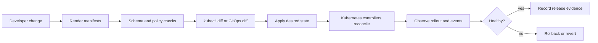

Purpose: explain how Kubernetes manifests become reliable releases through apply semantics, Helm, Kustomize, validation, policy gates, and repeatable delivery workflows.

# Helm, Kustomize, Manifests, and Release Engineering

Kubernetes delivery starts with plain API objects, but production delivery depends on how those objects are rendered, reviewed, validated, applied, rolled back, and audited. A manifest is not just YAML. It is an API request, a desired-state contract, and part of the operational history of the cluster.

Core links: [Kubernetes](/compendium/kubernetes/kubernetes), [01 Kubernetes Mental Model and Architecture](/compendium/kubernetes/kubernetes-mental-model-and-architecture), [01 Kubernetes Mental Model and Architecture](/compendium/kubernetes/kubernetes-mental-model-and-architecture), [03 Deployments ReplicaSets StatefulSets DaemonSets Jobs and CronJobs](/compendium/kubernetes/deployments-replicasets-statefulsets-daemonsets-jobs-and-cronjobs), <span className="compendium-external-reference" title="Vault-only reference">Software Supply Chain Security</span>, <span className="compendium-external-reference" title="Vault-only reference">Software testing</span>.

## Delivery Mental Model



The important boundary is between rendering and applying. Helm, Kustomize, Jsonnet, and templating systems produce manifests. Kubernetes only sees API objects submitted to the API server. Validation before submission catches syntax, schema, security, and ownership problems early.

## kubectl Apply

`kubectl apply` creates or updates objects from manifests. It is declarative: the file describes desired state and the API server persists that state. The normal workflow is edit, diff, apply, watch, and record evidence.

```bash
kubectl apply -f manifests/
kubectl apply -f app.yaml -n payments
kubectl apply -k overlays/prod
kubectl get deploy,pod,svc -n payments
kubectl rollout status deployment/payments-api -n payments
```

Example Deployment manifest:

```yaml
apiVersion: apps/v1
kind: Deployment
metadata:
  name: payments-api
  namespace: payments
  labels:
    app.kubernetes.io/name: payments-api
    app.kubernetes.io/part-of: commerce
spec:
  replicas: 3
  selector:
    matchLabels:
      app.kubernetes.io/name: payments-api
  template:
    metadata:
      labels:
        app.kubernetes.io/name: payments-api
    spec:
      containers:
        - name: api
          image: registry.example.com/payments-api:1.42.0
          ports:
            - containerPort: 8080
          readinessProbe:
            httpGet:
              path: /ready
              port: 8080
          resources:
            requests:
              cpu: 250m
              memory: 256Mi
            limits:
              memory: 512Mi
```

## kubectl Diff

`kubectl diff` asks the API server how the applied object would differ from the live object. It is a review tool, not a guarantee that the rollout will be healthy.

```bash
kubectl diff -f app.yaml -n payments
kubectl diff -k overlays/prod
kubectl diff --server-side -f manifests/
```

Use `diff` before applying when a human operator is changing production, when a release pipeline needs an audit artifact, or when several controllers could own the same object.

## Server-side Apply

Server-side apply stores field ownership in `metadata.managedFields`. This lets the API server merge changes from multiple field managers and detect conflicts.

```bash
kubectl apply --server-side --field-manager=release-pipeline -f manifests/
kubectl apply --server-side --force-conflicts --field-manager=platform-admin -f platform/
```

Server-side apply is useful for platform teams because it makes ownership explicit. It can also expose hidden contention, such as a GitOps controller, an operator, and a human all trying to own the same field.

| Apply mode | Strength | Risk | Use when |
|---|---|---|---|
| Client-side apply | Familiar, simple, works with old habits | Last-applied annotation can become stale | Small teams and simple objects |
| Server-side apply | API server owns merge logic and conflict detection | Managed fields can surprise tools that assume simple patching | Shared objects, controllers, platform APIs |
| Replace | Exact object replacement | Can drop defaulted or controller-written fields | Rare controlled migrations |
| Patch | Small targeted change | Easy to create imperative drift | Emergency repair or controller code |

## Helm

Helm packages Kubernetes resources into charts. A chart is a renderable release unit containing templates, defaults, metadata, and optional lifecycle hooks.

```bash
helm repo add ingress-nginx https://kubernetes.github.io/ingress-nginx
helm repo update
helm search repo ingress-nginx
helm install ingress-nginx ingress-nginx/ingress-nginx -n ingress-nginx --create-namespace
helm upgrade --install payments ./charts/payments -n payments -f values-prod.yaml
helm history payments -n payments
helm rollback payments 12 -n payments
```

Minimal chart shape:

```text
charts/payments/
  Chart.yaml
  values.yaml
  templates/
    deployment.yaml
    service.yaml
    ingress.yaml
```

`Chart.yaml`:

```yaml
apiVersion: v2
name: payments
description: Payments API Kubernetes release
type: application
version: 0.8.0
appVersion: "1.42.0"
```

`values.yaml` should contain environment-tunable inputs, not arbitrary programming logic:

```yaml
image:
  repository: registry.example.com/payments-api
  tag: "1.42.0"
replicaCount: 3
resources:
  requests:
    cpu: 250m
    memory: 256Mi
  limits:
    memory: 512Mi
service:
  port: 80
  targetPort: 8080
```

Template excerpt:

```yaml
apiVersion: apps/v1
kind: Deployment
metadata:
  name: {{ include "payments.fullname" . }}
  labels:
    app.kubernetes.io/name: {{ include "payments.name" . }}
    app.kubernetes.io/version: {{ .Chart.AppVersion | quote }}
spec:
  replicas: {{ .Values.replicaCount }}
  selector:
    matchLabels:
      app.kubernetes.io/name: {{ include "payments.name" . }}
  template:
    metadata:
      labels:
        app.kubernetes.io/name: {{ include "payments.name" . }}
    spec:
      containers:
        - name: api
          image: "{{ .Values.image.repository }}:{{ .Values.image.tag }}"
          resources:
            {{- toYaml .Values.resources | nindent 12 }}
```

## Helm Hooks

Hooks run at lifecycle points such as pre-install, post-install, pre-upgrade, and pre-delete. They are powerful and dangerous because failed hooks can block releases or leave side effects.

```yaml
apiVersion: batch/v1
kind: Job
metadata:
  name: payments-db-migrate
  annotations:
    helm.sh/hook: pre-upgrade,pre-install
    helm.sh/hook-weight: "0"
    helm.sh/hook-delete-policy: before-hook-creation,hook-succeeded
spec:
  template:
    spec:
      restartPolicy: Never
      containers:
        - name: migrate
          image: registry.example.com/payments-migrator:1.42.0
          args: ["migrate", "up"]
```

Production hook rules:

- Hooks must be idempotent.
- Hooks must have timeouts, logs, and clear failure semantics.
- Schema migrations should be backward compatible with the previous application version.
- Never hide normal application resources in hooks.
- Prefer explicit migration Jobs in GitOps when audit and rollback need to be visible.

## Helm Release Safety

```bash
helm lint ./charts/payments
helm template payments ./charts/payments -f values-prod.yaml > rendered.yaml
kubeconform -strict -summary rendered.yaml
kubectl diff -f rendered.yaml -n payments
helm upgrade --install payments ./charts/payments \
  -n payments \
  -f values-prod.yaml \
  --atomic \
  --timeout 10m
```

`--atomic` rolls back if the upgrade fails, but it does not prove business health. Pair it with readiness probes, alerts, smoke tests, and application metrics.

## Kustomize

Kustomize composes Kubernetes manifests without template expressions. A base defines shared resources. Overlays patch those resources per environment.

```text
apps/payments/
  base/
    deployment.yaml
    service.yaml
    kustomization.yaml
  overlays/
    staging/
      kustomization.yaml
      replica-patch.yaml
    prod/
      kustomization.yaml
      replica-patch.yaml
      resources-patch.yaml
```

Base:

```yaml
apiVersion: kustomize.config.k8s.io/v1beta1
kind: Kustomization
resources:
  - deployment.yaml
  - service.yaml
commonLabels:
  app.kubernetes.io/part-of: commerce
```

Prod overlay:

```yaml
apiVersion: kustomize.config.k8s.io/v1beta1
kind: Kustomization
namespace: payments
resources:
  - ../../base
images:
  - name: registry.example.com/payments-api
    newTag: "1.42.0"
patches:
  - path: replica-patch.yaml
  - path: resources-patch.yaml
```

Patch:

```yaml
apiVersion: apps/v1
kind: Deployment
metadata:
  name: payments-api
spec:
  replicas: 6
```

Commands:

```bash
kustomize build apps/payments/overlays/prod
kubectl kustomize apps/payments/overlays/prod
kubectl diff -k apps/payments/overlays/prod
kubectl apply -k apps/payments/overlays/prod
```

## Helm Versus Kustomize Versus Jsonnet

| Tool | Model | Best fit | Main failure mode |
|---|---|---|---|
| Raw YAML | Direct API objects | Small systems and generated output | Duplication, drift, copy errors |
| Helm | Package plus templates plus release metadata | Reusable application charts and third-party addons | Over-templating and opaque values |
| Kustomize | Base plus overlays plus patches | Environment customization of Kubernetes-native YAML | Patch sprawl and hidden object changes |
| Jsonnet | Data templating language | Large generated object graphs and reusable libraries | Higher language complexity and weaker team familiarity |

Jsonnet overview:

```jsonnet
local app = import 'lib/app.libsonnet';

app.deployment(
  name='payments-api',
  image='registry.example.com/payments-api:1.42.0',
  replicas=3
)
```

Jsonnet is strongest when teams need programmable composition with reusable libraries. It should still render to plain manifests that pass the same validation and policy gates.

## Manifest Validation

Validation should happen before cluster write access. A practical pipeline validates syntax, schema, Kubernetes best practices, security policy, and environment-specific constraints.

```bash
yamllint manifests/
helm lint ./charts/payments
helm template payments ./charts/payments -f values-prod.yaml > rendered.yaml
kubeconform -strict -summary -ignore-missing-schemas rendered.yaml
kube-score score rendered.yaml
kubectl diff --server-side -f rendered.yaml
```

`kubeconform` validates resources against Kubernetes schemas. `kube-score` checks operational quality signals such as probes, resource requests, NetworkPolicies, and container security settings. Policy engines such as Kyverno, Gatekeeper, and ValidatingAdmissionPolicy enforce organization rules.

## Policy Checks

Common release policies:

- Images must be pinned to immutable tags or digests.
- Containers must not run privileged unless explicitly exempted.
- Namespaces must have ResourceQuota and LimitRange.
- Deployments must define readiness probes.
- Ingress must use approved hosts, TLS, and ingress classes.
- Workloads must include owner labels and cost labels.
- Secrets must not be committed as literal Secret manifests unless encrypted by a controlled tool.

Kyverno-style policy intent:

```yaml
apiVersion: kyverno.io/v1
kind: ClusterPolicy
metadata:
  name: require-resource-requests
spec:
  validationFailureAction: Enforce
  rules:
    - name: require-cpu-memory-requests
      match:
        any:
          - resources:
              kinds:
                - Pod
      validate:
        message: "CPU and memory requests are required."
        pattern:
          spec:
            containers:
              - resources:
                  requests:
                    cpu: "?*"
                    memory: "?*"
```

## Release Engineering Checklist

- Rendered manifests are committed, reproducible, or generated from a pinned toolchain.
- `kubectl diff`, Helm diff, or GitOps diff was reviewed.
- Schema validation passed for the target Kubernetes version.
- Policy checks passed with explicit documented exemptions.
- CRDs are installed before custom resources that depend on them.
- Hooks and migration Jobs are idempotent.
- Rollback path is known and tested for this release shape.
- Rollout status, events, and application metrics are watched.
- Release evidence includes chart version, app version, git revision, approver, and rollout result.

## Common Mistakes

| Mistake | Consequence | Better practice |
|---|---|---|
| Using `latest` image tags | Rollbacks and audits become ambiguous | Pin immutable versions or digests |
| Letting humans hotfix live YAML | Git and cluster drift apart | Revert or patch through the release source |
| Overusing Helm template logic | Charts become hard to review | Keep values boring and manifests readable |
| Skipping `kubectl diff` | Risky field changes hide in large YAML | Diff every production write |
| Installing CRs before CRDs | API server rejects resources | Order CRDs before dependent objects |
| Treating Helm rollback as data rollback | Database and external state remain changed | Design backward-compatible changes |

## Troubleshooting

```bash
kubectl get events -n payments --sort-by=.lastTimestamp
kubectl describe deployment payments-api -n payments
kubectl rollout history deployment/payments-api -n payments
kubectl rollout status deployment/payments-api -n payments
helm status payments -n payments
helm get manifest payments -n payments
helm get values payments -n payments
kubectl get managedfields deployment payments-api -n payments -o yaml
```

Debug questions:

- Did the rendered manifest match what reviewers approved?
- Did admission mutate or reject the object?
- Does a controller own the field that changed?
- Are probes failing after the rollout?
- Are pods stuck on image pull, scheduling, crash loops, or readiness?
- Did a hook fail before the main workload changed?

## Production Guidance

Prefer a small number of supported release paths. A mature platform usually offers a golden path such as Helm chart plus GitOps, or Kustomize overlays plus GitOps, with exceptions reviewed by platform owners. The key is not which tool wins. The key is that every production change is reproducible, reviewed, diffed, validated, observable, and reversible at the right layer.

