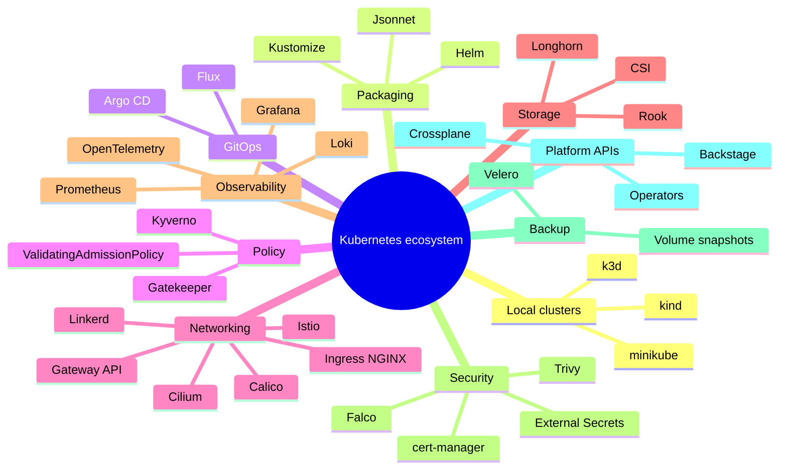

Purpose: map the Kubernetes ecosystem into practical tool categories and give hands-on projects that build production judgment.

# Kubernetes Ecosystem Tools and Learning Projects

The Kubernetes ecosystem is large because Kubernetes is a platform substrate. The useful way to learn it is by capability: local development, packaging, GitOps, policy, networking, storage, observability, security, autoscaling, backup, and platform APIs. Tools matter most when they clarify an operational responsibility.

Core links: [Kubernetes](/compendium/kubernetes/kubernetes), [00 Kubernetes Mastery Roadmap](/compendium/kubernetes/kubernetes-mastery-roadmap), [12 Helm Kustomize Manifests and Release Engineering](/compendium/kubernetes/helm-kustomize-manifests-and-release-engineering), [13 GitOps Controllers Operators CRDs and Platform APIs](/compendium/kubernetes/gitops-controllers-operators-crds-and-platform-apis), [14 Cluster Operations Upgrades Backup Restore and Disaster Recovery](/compendium/kubernetes/cluster-operations-upgrades-backup-restore-and-disaster-recovery), [15 Multi Tenancy Policy Governance and Cost Management](/compendium/kubernetes/multi-tenancy-policy-governance-and-cost-management), [16 Production Patterns Anti Patterns and Reference Architectures](/compendium/kubernetes/production-patterns-anti-patterns-and-reference-architectures).

## Ecosystem Map



## Local Development

| Tool | Use | Notes |
|---|---|---|
| kind | Fast local clusters in Docker | Great for CI and controller tests |
| minikube | Learning and local feature exploration | Broad driver support |
| k3d | k3s clusters in Docker | Lightweight multi-node experiments |
| Tilt | Inner-loop development | Watches code and updates workloads |
| Skaffold | Build, tag, deploy loop | Good for repeatable dev workflows |
| Telepresence | Local process connected to cluster | Useful for service debugging |

Commands:

```bash
kind create cluster --name lab
kubectl cluster-info --context kind-lab
kubectl create deployment web --image=nginx:1.27
kubectl expose deployment web --port=80
kubectl port-forward svc/web 8080:80
kind delete cluster --name lab
```

## Packaging and Validation

| Capability | Tools |
|---|---|
| Template packaging | Helm |
| Overlay composition | Kustomize |
| Programmable generation | Jsonnet |
| Schema validation | kubeconform, kubeval |
| Operational scoring | kube-score, Polaris |
| Security scanning | Trivy, Kubescape |
| Policy testing | Kyverno CLI, conftest, Gatekeeper tests |

Validation lab:

```bash
helm create demo
helm lint demo
helm template demo ./demo > rendered.yaml
kubeconform -strict -summary rendered.yaml
kube-score score rendered.yaml
trivy config rendered.yaml
```

## GitOps and Delivery

Tools:

- Argo CD for application inventory, sync, health, UI, and multi-cluster views.
- Flux for Kubernetes-native reconciliation resources and automation.
- Argo Rollouts for canary and blue green rollout behavior.
- Flagger for progressive delivery automation with metrics.

GitOps lab:

```bash
kubectl create namespace argocd
kubectl apply -n argocd -f https://raw.githubusercontent.com/argoproj/argo-cd/stable/manifests/install.yaml
kubectl get pods -n argocd
kubectl port-forward svc/argocd-server -n argocd 8080:443
```

Learning goal: change Git, watch sync, intentionally create live drift, then observe how the controller reports and repairs it.

## Networking

| Area | Tools and APIs | Learn by testing |
|---|---|---|
| Pod networking and policy | Cilium, Calico | Default deny and explicit egress |
| Ingress | ingress-nginx, Traefik, HAProxy | Host routing, TLS, path rules |
| Gateway | Gateway API | Shared gateway with delegated routes |
| Service mesh | Istio, Linkerd | mTLS, traffic splitting, telemetry |
| DNS | CoreDNS, ExternalDNS | Service discovery and public records |

Network troubleshooting commands:

```bash
kubectl get svc,endpointslices,ingress -A
kubectl run netshoot --rm -it --image=nicolaka/netshoot -- bash
kubectl exec -n app deploy/api -- nslookup kubernetes.default
kubectl describe networkpolicy -n app
```

## Storage

| Tool or API | Use |
|---|---|
| CSI drivers | Provider storage integration |
| StorageClass | Dynamic volume provisioning |
| VolumeSnapshot | Snapshot API for supported CSI drivers |
| Rook | Ceph on Kubernetes |
| Longhorn | Distributed block storage often used in smaller clusters |
| Velero | Backup and restore of Kubernetes resources and volumes |

Storage lab:

```yaml
apiVersion: v1
kind: PersistentVolumeClaim
metadata:
  name: data
spec:
  accessModes:
    - ReadWriteOnce
  resources:
    requests:
      storage: 1Gi
```

```bash
kubectl apply -f pvc.yaml
kubectl get pvc,pv
kubectl describe pvc data
```

Learning goal: understand binding, reclaim policy, expansion, snapshots, and what happens when a node with an attached volume drains.

## Observability

Observability stack categories:

- Metrics: Prometheus, Thanos, Mimir.
- Dashboards: Grafana.
- Logs: Loki, Elasticsearch, OpenSearch.
- Traces: Jaeger, Tempo, OpenTelemetry.
- Events: Kubernetes event exporters or log collection.
- Alerting: Alertmanager or managed alerting.

Useful queries to learn:

```bash
kubectl top nodes
kubectl top pods -A
kubectl get events -A --sort-by=.lastTimestamp
kubectl logs deployment/api -n app --previous
kubectl describe pod api-123 -n app
```

Learning goal: diagnose a failed rollout using only status, events, logs, metrics, and a runbook.

## Security

Security tools and responsibilities:

| Area | Tools | Purpose |
|---|---|---|
| Image scanning | Trivy, Grype | Vulnerability detection |
| Runtime detection | Falco, Tetragon | Suspicious behavior signals |
| Certificates | cert-manager | Automated certificate lifecycle |
| Secrets | External Secrets Operator, Sealed Secrets, SOPS | Avoid plain secrets in Git |
| Policy | Kyverno, Gatekeeper, ValidatingAdmissionPolicy | Enforce cluster rules |
| Supply chain | cosign, Sigstore | Image signing and verification |

Security lab:

```bash
trivy image nginx:1.27
trivy config rendered.yaml
kubectl auth can-i get secrets -n app --as dev@example.com
kubectl get pods -A -o jsonpath='{range .items[*]}{.metadata.namespace}{" "}{.metadata.name}{" "}{.spec.containers[*].securityContext.privileged}{"\n"}{end}'
```

## Platform Engineering Tools

| Tool | Role |
|---|---|
| Crossplane | Compose cloud infrastructure through Kubernetes APIs |
| Backstage | Catalog, templates, docs, ownership, developer portal |
| Operator SDK and Kubebuilder | Build custom controllers and operators |
| Cluster API | Declarative Kubernetes cluster lifecycle |
| vcluster | Virtual Kubernetes clusters for tenants |
| DevSpace | Developer workflows against Kubernetes |

Platform learning goal: design a small internal `App` API that creates a Deployment, Service, HPA, NetworkPolicy, and dashboard link from one higher-level spec.

## Learning Projects

### Project 1: Production-shaped stateless service

Build one service with Deployment, Service, Ingress, ConfigMap, Secret reference, probes, requests, PDB, HPA, and NetworkPolicy.

Verification:

```bash
kubectl apply -f manifests/
kubectl rollout status deployment/demo-api -n demo
kubectl get endpointslices -n demo
kubectl describe hpa demo-api -n demo
```

What to learn: how rollout, readiness, service endpoints, and autoscaling interact.

### Project 2: Helm and Kustomize release pipeline

Package the same app as a Helm chart, then create Kustomize overlays for dev and prod.

Verification:

```bash
helm lint ./charts/demo-api
helm template demo-api ./charts/demo-api -f values-prod.yaml > rendered.yaml
kubeconform -strict -summary rendered.yaml
kubectl diff -f rendered.yaml -n demo
```

What to learn: render boundaries, values design, validation, and diff review.

### Project 3: GitOps drift lab

Deploy an app through Argo CD or Flux, manually change the live Deployment, then observe drift.

Verification:

```bash
kubectl patch deployment demo-api -n demo -p '{"spec":{"replicas":5}}'
argocd app diff demo-api
argocd app sync demo-api
```

What to learn: source of truth, self-heal, pruning, and field ownership.

### Project 4: Multi-tenant namespace baseline

Create two namespaces with RBAC, quotas, LimitRanges, NetworkPolicies, and pod security labels.

Verification:

```bash
kubectl auth can-i create deployments -n team-a --as alice@example.com
kubectl auth can-i get secrets -n team-b --as alice@example.com
kubectl describe quota -n team-a
kubectl describe networkpolicy -n team-a
```

What to learn: tenancy is layered, not just namespaces.

### Project 5: Backup and restore drill

Install a simple app with a PVC, create data, back it up, delete the namespace, then restore it in an isolated namespace.

Verification:

```bash
velero backup create demo-backup --include-namespaces demo
velero restore create demo-restore --from-backup demo-backup
kubectl get all,pvc -n demo
```

What to learn: object restore, volume restore, and evidence collection.

### Project 6: Controller or operator mini-lab

Create a small custom resource and a controller that writes a ConfigMap and status condition.

Learning goals:

- Watch a CRD.
- Reconcile idempotently.
- Write status.
- Use RBAC narrowly.
- Handle deletion with a finalizer if needed.

## Tool Selection Guide

| Need | Start with |
|---|---|
| Local cluster for experiments | kind |
| Beginner cluster with dashboard support | minikube |
| Lightweight edge cluster | k3s or k3d |
| Package reusable app | Helm |
| Customize environment-specific YAML | Kustomize |
| Reconcile from Git | Argo CD or Flux |
| Enforce cluster rules | Kyverno or Gatekeeper |
| Manage certificates | cert-manager |
| Manage external secrets | External Secrets Operator |
| Backup Kubernetes resources | Velero |
| Build platform APIs | Crossplane or a custom operator |

## Common Mistakes

| Mistake | Why it slows learning | Better practice |
|---|---|---|
| Installing every popular tool | Tool sprawl hides fundamentals | Learn one capability at a time |
| Skipping raw Kubernetes objects | Templates become magic | Read rendered YAML |
| Only testing happy paths | Production failures stay unfamiliar | Break rollouts, policies, DNS, and quotas in labs |
| Treating dashboards as truth | UI can hide field ownership | Verify with kubectl and events |
| Ignoring cleanup | Clusters become noisy and expensive | Delete labs and track namespaces |

## Study Checklist

- Can explain how a Deployment creates ReplicaSets and pods.
- Can debug why a Service has no endpoints.
- Can render Helm and Kustomize output before applying.
- Can explain GitOps drift and reconciliation.
- Can write a default deny NetworkPolicy and an allow rule.
- Can interpret ResourceQuota and scheduling failures.
- Can perform a backup and restore drill.
- Can describe when to use CRDs, operators, and platform APIs.
- Can connect costs to requests, storage, load balancers, and labels.
- Can design a minimal production service manifest set.

