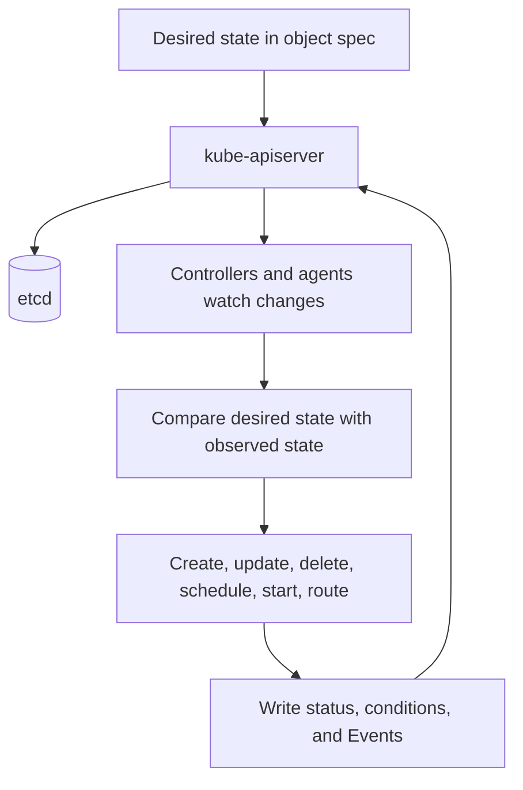
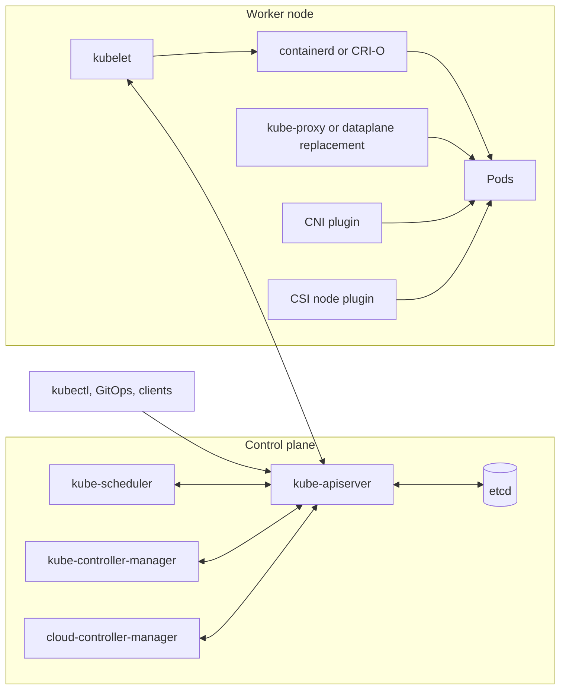
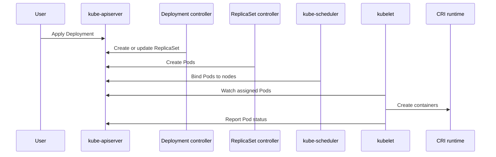

Purpose: This note explains Kubernetes as a distributed reconciliation system, with enough architectural detail to debug real clusters and evaluate production designs.

# Kubernetes Mental Model and Architecture

Kubernetes is easiest to understand as an API server plus a set of reconciliation loops. Users, controllers, and integrations write desired state to the API. Controllers and node agents observe that state, compare it with reality, and act until the cluster converges or reports why it cannot.

Use this note with [Kubernetes](/compendium/kubernetes/kubernetes) and [00 Kubernetes Mastery Roadmap](/compendium/kubernetes/kubernetes-mastery-roadmap).

## The Short Mental Model



Important split:

- `spec` is what should be true.
- `status` is what a controller or node agent believes is true.
- `metadata` describes identity, ownership, labels, annotations, lifecycle, and field ownership.
- `Events` explain notable transitions and failures.

## Control Plane vs Worker Nodes

| Layer | Components | Responsibility |
|---|---|---|
| Control plane | kube-apiserver, etcd, kube-scheduler, kube-controller-manager, cloud-controller-manager | Stores API state, validates requests, schedules Pods, reconciles built-in objects, integrates cloud infrastructure. |
| Worker node | kubelet, container runtime, kube-proxy or replacement dataplane, CNI, CSI plugins | Runs Pods, reports status, configures networking, mounts storage, enforces node-local runtime behavior. |
| Add-ons | CoreDNS, ingress controller, Gateway controller, metrics, logging, policy engines, operators | Provide cluster services and higher-level platform capabilities. |

Kubernetes is intentionally decomposed. The API server is the common interface. Controllers should communicate through API state instead of hidden direct calls whenever possible.

## Component Map



## kube-apiserver

kube-apiserver is the front door to Kubernetes. It serves the REST API, authenticates callers, authorizes requests, runs admission, validates objects, persists state to etcd, exposes watches, and records audit data when audit logging is configured.

Request path:

1. Authentication identifies the caller.
2. Authorization checks whether the caller can perform the verb on the resource.
3. Admission mutates or validates the request.
4. Built-in validation checks schema and invariants.
5. The object is persisted to etcd.
6. Watchers receive the change.

Production guidance:

- Treat kube-apiserver as a critical dependency for all cluster automation.
- Use server-side dry run and admission-aware validation for deployment pipelines.
- Do not design tools that write directly to etcd for ordinary cluster changes.
- Monitor API latency, request errors, inflight requests, audit volume, and watch pressure.

## etcd

etcd is the strongly consistent key-value store that backs Kubernetes API state. It stores objects, resource versions, leases, and cluster coordination data. It is not an application database for workloads.

Production guidance:

- Back up etcd according to the cluster distribution guidance.
- Test restore, not only backup creation.
- Protect etcd access tightly.
- Watch disk latency and compaction behavior.
- Avoid controllers that churn objects unnecessarily, because API churn becomes etcd churn.

## kube-scheduler

kube-scheduler assigns unscheduled Pods to nodes. It evaluates resource requests, node conditions, taints and tolerations, affinity rules, topology spread constraints, volume topology, policies, and plugin decisions.

Scheduling is not container startup. A Pod can be scheduled successfully and still fail during image pull, volume mount, container creation, probe execution, or application startup.

Troubleshooting unscheduled Pods:

1. Check `kubectl describe pod`.
2. Read scheduling Events.
3. Compare requests with node allocatable capacity.
4. Inspect taints, tolerations, affinity, anti-affinity, and topology constraints.
5. Check quotas and admission webhooks.
6. Check whether PVC binding or volume topology blocks placement.

## kube-controller-manager

kube-controller-manager runs many built-in controllers. Examples include Deployment, ReplicaSet, Job, CronJob, Node, EndpointSlice, ServiceAccount token, namespace, garbage collection, and resource quota controllers.

A controller does not usually "do everything" for a resource. A Deployment controller manages ReplicaSets. A ReplicaSet controller manages Pods. The scheduler assigns Pods. Kubelet starts containers. This decomposition is why debugging follows the object chain.

Example chain for a Deployment:



## cloud-controller-manager

cloud-controller-manager separates cloud provider integration from the core control plane. Depending on the provider and configuration, it can reconcile nodes, routes, load balancers, and volume-related cloud metadata.

Tradeoff:

| Benefit | Cost |
|---|---|
| Keeps cloud-specific code out of core components. | Cluster behavior depends on provider integration quality and version compatibility. |
| Lets cloud APIs back Kubernetes abstractions. | Cloud API rate limits, IAM, quotas, and eventual consistency become cluster concerns. |

## kubelet

kubelet is the node agent. It watches Pods assigned to its node, asks the container runtime to run containers, mounts volumes, runs probes, reports status, and participates in node lifecycle.

Kubelet does not schedule Pods. It executes assigned Pods. If kubelet cannot create the sandbox, pull the image, mount volumes, start containers, or run probes, it reports status and Events through the API.

Common kubelet failure areas:

- Image pull errors.
- Volume mount errors.
- CNI sandbox setup errors.
- Probe failures.
- Node pressure and evictions.
- Runtime socket or CRI errors.
- Certificate or API connectivity problems.

## kube-proxy and Service Dataplanes

kube-proxy watches Services and EndpointSlices, then programs node networking rules so Service virtual IPs route to backend Pods. Some clusters replace kube-proxy with an eBPF or CNI-integrated dataplane, but the API contract remains Services and endpoints.

Common mistakes:

- Debugging only the Service object and ignoring EndpointSlices.
- Assuming a Service creates external reachability without a LoadBalancer implementation, NodePort path, Ingress controller, Gateway controller, or external routing.
- Forgetting that Services select Pods by labels.

## CRI, containerd, CRI-O, and dockershim

The Container Runtime Interface, or CRI, is the kubelet interface for container runtimes. Modern Kubernetes nodes commonly use containerd or CRI-O.

Dockershim was the historical adapter that let kubelet talk to Docker Engine as a runtime. It was removed in Kubernetes v1.24. This did not remove Docker-built images from Kubernetes. It removed the in-tree Docker Engine shim from kubelet. OCI images still run through CRI runtimes.

| Runtime path | Current status | Notes |
|---|---|---|
| containerd | Common production choice | Docker itself uses containerd internally, but Kubernetes talks to containerd through CRI. |
| CRI-O | Common Kubernetes-focused runtime | Designed around Kubernetes CRI use cases. |
| Docker Engine via dockershim | Removed from Kubernetes v1.24 | Requires migration or external compatibility layers outside core Kubernetes. |

## CoreDNS

CoreDNS is the standard cluster DNS add-on. It resolves Service names such as `web.apps.svc.cluster.local` and supports Kubernetes service discovery through the Kubernetes plugin.

DNS troubleshooting:

1. Confirm the Service exists.
2. Confirm EndpointSlices contain ready endpoints.
3. Test DNS from a Pod in the same namespace.
4. Test the fully qualified Service name.
5. Inspect CoreDNS Pods, logs, ConfigMap, and metrics.
6. Check NetworkPolicy or CNI behavior if DNS traffic is blocked.

## Namespaces

Namespaces scope names for many resources and are a foundation for multi-team organization. They are not a complete tenancy boundary.

Use namespaces for:

- Application environments.
- Team ownership.
- RBAC scoping.
- Quotas and LimitRanges.
- Pod Security Admission labels.
- NetworkPolicy scoping.

Do not rely on namespaces alone for:

- Node isolation.
- Data isolation.
- CRD isolation.
- Kernel isolation.
- Cluster-admin separation.

## Labels, Selectors, and Annotations

Labels are indexed metadata used by selectors. Services, Deployments, ReplicaSets, NetworkPolicies, affinity rules, monitoring, cost allocation, and policy tools often depend on labels.

Annotations are metadata for tools and humans. They are not selector targets. Use them for checksums, rollout reasons, external IDs, controller hints, and non-identifying metadata.

Label taxonomy example:

```yaml
metadata:
  labels:
    app.kubernetes.io/name: checkout
    app.kubernetes.io/instance: checkout-prod
    app.kubernetes.io/component: api
    app.kubernetes.io/part-of: commerce
    app.kubernetes.io/managed-by: argocd
  annotations:
    example.com/change-ticket: INC-1234
    checksum/config: 7b3f4c2
```

Tradeoff:

| Metadata type | Strength | Weakness |
|---|---|---|
| Labels | Selectable, indexable, automation-friendly. | Must remain stable when selectors depend on them. |
| Annotations | Flexible, large enough for tool metadata. | Not intended for selection or identity. |

## Owners and Garbage Collection

Owner references tell Kubernetes that one object owns another. Garbage collection can delete dependents when the owner is deleted.

Example: a Deployment owns ReplicaSets, and ReplicaSets own Pods. If the Deployment is deleted with cascading deletion, its ReplicaSets and Pods can be cleaned up.

Production guidance:

- Understand whether a controller sets owner references.
- Be careful with cross-namespace ownership rules.
- Do not remove owner references casually. You may orphan resources.
- Use `kubectl get &lt;kind&gt; -o yaml` to inspect `metadata.ownerReferences`.

## Finalizers

Finalizers are strings in object metadata that block physical deletion until a controller performs cleanup and removes the finalizer. They are used for external resources, storage cleanup, cloud load balancers, and custom controllers.

Deletion flow:

1. User deletes object.
2. API server sets `deletionTimestamp`.
3. Object remains visible while finalizers exist.
4. Responsible controller performs cleanup.
5. Controller removes its finalizer.
6. API server removes the object.

Troubleshooting stuck deletion:

- Inspect `metadata.finalizers`.
- Find the controller responsible for each finalizer.
- Check controller logs and permissions.
- Verify external dependencies still exist.
- Remove finalizers manually only when you understand the cleanup consequence.

## Events

Events are short-lived records of important object activity. They are essential for first-pass troubleshooting because they explain decisions and failures in plain operational terms.

Examples:

- `FailedScheduling`
- `Pulling`
- `Failed`
- `BackOff`
- `Unhealthy`
- `FailedMount`
- `Killing`

Use:

```bash
kubectl get events -n apps --sort-by=.lastTimestamp
kubectl describe pod -n apps web-abc123
```

Events are not a durable audit log. Export them if they are operationally important.

## API Groups and Versions

Kubernetes APIs are grouped and versioned. Core resources such as Pods and Services use `apiVersion: v1`. Other APIs use named groups such as `apps/v1`, `batch/v1`, `networking.k8s.io/v1`, and `rbac.authorization.k8s.io/v1`.

Key implications:

- The same kind name can theoretically exist in different API groups.
- Version migration matters during cluster upgrades.
- Deprecated APIs can stop being served.
- CRDs add new API groups to the cluster.
- The official Kubernetes API reference currently lists Kubernetes v1.36.

Useful commands:

```bash
kubectl api-resources
kubectl api-versions
kubectl explain deployment.spec.template.spec.containers
```

## Server-Side Apply

Server-side apply lets the API server track field ownership in `metadata.managedFields`. It helps multiple actors manage different fields on the same object without blind overwrites.

Concepts:

- A field manager owns fields it applies.
- Conflicts occur when another manager owns a field and you try to change it.
- Apply works best when configuration is declarative and stable.
- Controllers should own status or specific spec fields deliberately.

Tradeoff:

| Client-side apply | Server-side apply |
|---|---|
| Stores last-applied config in an annotation. | Tracks managed fields on the server. |
| Easier legacy behavior. | Better multi-actor field ownership. |
| Can hide ownership conflicts. | Surfaces conflicts explicitly. |

## Resource Lifecycle

Typical object lifecycle:

1. Create request reaches kube-apiserver.
2. Authentication, authorization, admission, defaulting, and validation run.
3. Object is persisted.
4. Watches notify controllers.
5. Controllers create or update related objects.
6. Status and Events are written.
7. Updates increment resource versions and may change generation.
8. Deletion sets a deletion timestamp when finalizers exist.
9. Garbage collection removes dependents according to owner references.

Important metadata:

| Field | Meaning |
|---|---|
| `metadata.name` | Name unique within the resource scope. |
| `metadata.namespace` | Namespace for namespaced resources. |
| `metadata.uid` | Unique identity assigned by the API server. |
| `metadata.resourceVersion` | Version used for watches and optimistic concurrency. |
| `metadata.generation` | Desired-state generation, usually incremented on spec changes. |
| `status.observedGeneration` | Controller marker that status reflects a generation. |
| `metadata.managedFields` | Server-side apply field ownership data. |
| `metadata.deletionTimestamp` | Deletion has been requested. |

## Production Guidance

### Design manifests as contracts

Stable labels, selectors, names, and ownership patterns should be reviewed like API design. A careless label change can break Services, NetworkPolicies, dashboards, alerts, and cost reports.

### Prefer status-first troubleshooting

Before changing YAML, read status, conditions, and Events. Kubernetes usually tells you which phase failed.

### Separate control plane health from workload health

A healthy Pod does not prove the API server, scheduler, controllers, DNS, storage, or cloud integrations are healthy. A healthy control plane does not prove applications are healthy.

### Use local clusters honestly

Local clusters are useful for learning and fast iteration. They cannot prove production behavior for multi-node scheduling, cloud load balancers, storage topology, real DNS, security policy, capacity, or upgrades.

### Treat add-ons as part of the platform

CoreDNS, CNI, CSI, ingress controllers, Gateway controllers, metrics stacks, policy engines, and operators are operational dependencies. Version, configure, monitor, and upgrade them deliberately.

## Common Mistakes

| Mistake | Why it hurts | Correction |
|---|---|---|
| Reading logs before Events | Logs show application output, not scheduler or kubelet decisions. | Read Events and status first. |
| Assuming a Pod is the application | Pods are replaceable instances. | Reason through controllers such as Deployment or StatefulSet. |
| Treating annotations as selectors | Kubernetes selectors do not use annotations. | Use labels for selection. |
| Ignoring `observedGeneration` | Status may describe an older spec. | Compare generation and observed generation. |
| Manually deleting managed Pods | Controllers recreate them. | Fix the owning object or controller input. |
| Forcing finalizer removal | External resources can leak. | Identify the finalizer owner and cleanup path first. |
| Confusing Ingress and Gateway API | They are different API families with different controllers and capabilities. | Know which CRDs and controllers are installed. |

## Troubleshooting Playbooks

### Deployment not progressing

1. `kubectl describe deploy -n &lt;ns&gt; &lt;name&gt;`
2. Check Deployment conditions.
3. Find ReplicaSets with matching labels.
4. Inspect new ReplicaSet Events.
5. Inspect Pods for scheduling, image, mount, probe, or admission failures.
6. Confirm Service selector if traffic is the symptom.
7. Check rollout strategy and max unavailable settings.

### Pod stuck Pending

1. Read Pod Events.
2. Check scheduler messages.
3. Check requests vs node capacity.
4. Check taints and tolerations.
5. Check affinity and topology spread.
6. Check PVC binding.
7. Check quota and admission.

### Service has no endpoints

1. Check Service selector.
2. Compare selector with Pod labels.
3. Inspect EndpointSlices.
4. Check Pod readiness.
5. Check namespace.
6. Check whether traffic should target a different port name or number.

### DNS failure

1. Test DNS from inside a Pod.
2. Use the fully qualified Service name.
3. Check CoreDNS Pods and logs.
4. Check Service and EndpointSlices.
5. Check NetworkPolicy for UDP and TCP 53.
6. Check node-local DNS cache if installed.

### Object stuck terminating

1. Inspect finalizers.
2. Inspect owner references.
3. Find the controller responsible.
4. Check controller logs and RBAC.
5. Confirm external cleanup state.
6. Remove finalizers manually only after documenting the cleanup decision.

## Review Checklist

- Can I explain every arrow in the component map?
- Can I trace a Deployment into ReplicaSets, Pods, scheduling, kubelet execution, runtime execution, and status?
- Can I explain why kube-apiserver is the integration boundary?
- Can I explain what etcd stores and why direct writes are unsafe?
- Can I distinguish labels from annotations with examples?
- Can I debug a selector mismatch?
- Can I explain owner references, garbage collection, and finalizers?
- Can I explain dockershim removal in v1.24 without implying Docker-built images stopped working?
- Can I explain why PodSecurityPolicy is gone and Pod Security Admission is the built-in replacement?
- Can I explain why Gateway API is official but still installed as an add-on?

## Next Notes

- Root index: [Kubernetes](/compendium/kubernetes/kubernetes)
- Study sequence: [00 Kubernetes Mastery Roadmap](/compendium/kubernetes/kubernetes-mastery-roadmap)
- Practice path: [00 Kubernetes Mastery Roadmap](/compendium/kubernetes/kubernetes-mastery-roadmap)
