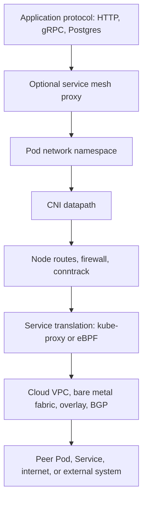
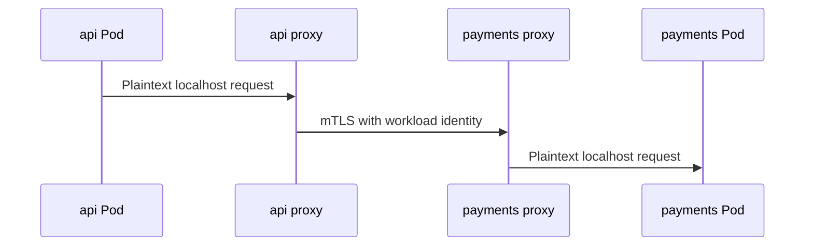
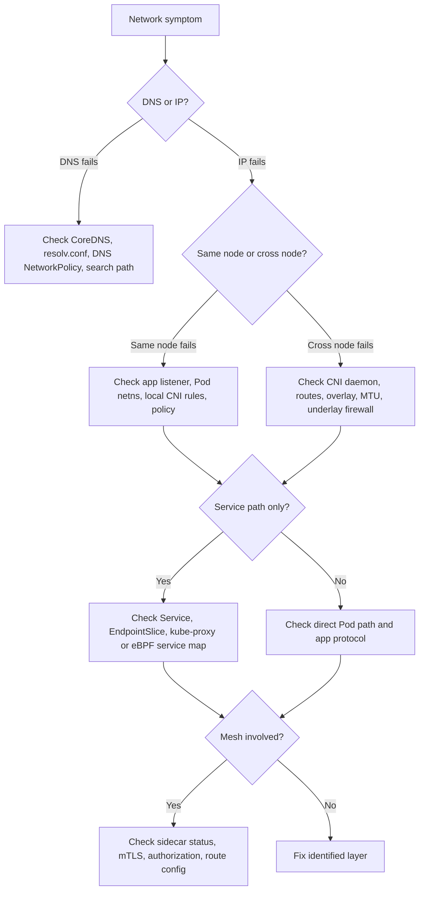

Purpose: explain the Kubernetes data network below Services, including CNI plugins, NetworkPolicy, egress control, service mesh, mTLS, and practical troubleshooting.

Related notes: [Kubernetes](/compendium/kubernetes/kubernetes), [00 Kubernetes Mastery Roadmap](/compendium/kubernetes/kubernetes-mastery-roadmap), [04 Services DNS Ingress Gateway API and Traffic Routing](/compendium/kubernetes/services-dns-ingress-gateway-api-and-traffic-routing), <span className="compendium-external-reference" title="Vault-only reference">Networking</span>, [04 Services DNS Ingress Gateway API and Traffic Routing](/compendium/kubernetes/services-dns-ingress-gateway-api-and-traffic-routing), [09 Security RBAC Pod Security Admission and Supply Chain](/compendium/kubernetes/security-rbac-pod-security-admission-and-supply-chain), [04 Services DNS Ingress Gateway API and Traffic Routing](/compendium/kubernetes/services-dns-ingress-gateway-api-and-traffic-routing), [10 Observability Logging Metrics Tracing Events and Probes](/compendium/kubernetes/observability-logging-metrics-tracing-events-and-probes).

## Network layers

Kubernetes networking is a stack. When traffic fails, identify the layer before changing manifests.



Core contracts:

| Contract | Meaning |
| --- | --- |
| Pod to Pod | Pods should be able to communicate across nodes without application aware NAT, unless policy or infrastructure blocks it. |
| Pod to Service | Pod traffic to a ClusterIP should reach a ready endpoint selected by that Service. |
| Pod to DNS | Pods need access to CoreDNS for normal Service discovery. |
| Node to Pod | kubelet, probes, and some infrastructure paths need node to Pod reachability. |
| External to Service | Ingress, Gateway, LoadBalancer, or NodePort translate external traffic into Service or Pod paths. |

## CNI overview

CNI, the Container Network Interface, is the plugin contract used by kubelet and the container runtime to attach Pods to networks. The CNI plugin assigns Pod IPs, creates interfaces, installs routes, and may enforce policy.

Kubernetes itself does not implement the Pod network. It delegates that work to the installed CNI. This is why two conformant clusters can have very different packet paths.

Typical CNI responsibilities:

1. Allocate Pod IP addresses.
2. Create the Pod network interface.
3. Connect the Pod to the node network namespace.
4. Configure routes or overlays so Pods can reach each other across nodes.
5. Enforce NetworkPolicy if supported.
6. Optionally implement Service load balancing, encryption, observability, and egress gateways.

## Pod network designs

| Design | How it works | Strengths | Costs |
| --- | --- | --- | --- |
| Overlay | Encapsulates Pod traffic across nodes, often VXLAN or Geneve | Works on simple underlays, easy cluster portability | Encapsulation overhead and MTU tuning required. |
| Routed Pod CIDRs | Node or fabric routes Pod CIDRs directly | Efficient and transparent | Requires route propagation, BGP, or cloud route integration. |
| Cloud native VPC IPs | Pods receive VPC routable addresses | Strong cloud integration and security group fit | IP exhaustion and provider limits can dominate design. |
| eBPF datapath | Kernel eBPF programs handle routing, policy, and sometimes Services | High performance and observability | Plugin expertise and kernel compatibility matter. |

MTU matters. Overlay encapsulation reduces effective packet size. If clients see intermittent TLS stalls, gRPC resets, or large response hangs, check MTU and path fragmentation early.

```bash
kubectl get nodes -o wide
kubectl -n kube-system get pods -o wide
kubectl -n apps run netshoot --rm -it --image=nicolaka/netshoot:latest --restart=Never -- bash
ip addr
ip route
ping -M do -s 1372 POD_IP
tracepath POD_IP
```

## CNI plugin tradeoffs

### Calico

Calico is a widely used CNI focused on routed networking and policy. It can run with BGP, overlays, or cloud integrations. It supports Kubernetes NetworkPolicy and Calico specific policy resources.

| Strength | Tradeoff |
| --- | --- |
| Mature policy model | Advanced Calico resources are not portable Kubernetes APIs. |
| Strong bare metal and hybrid support | BGP and route design require operational skill. |
| Good fit for explicit security segmentation | Misordered or overlapping policies can be hard to reason about. |

Common Calico checks:

```bash
kubectl -n kube-system get pods -l k8s-app=calico-node -o wide
kubectl get ippools.crd.projectcalico.org
kubectl get networkpolicy -A
kubectl get globalnetworkpolicy.crd.projectcalico.org
```

### Cilium

Cilium uses eBPF for networking, policy, observability, and optional kube-proxy replacement. It can provide rich flow visibility through Hubble and supports L3, L4, and L7 aware policy features through Cilium specific APIs.

| Strength | Tradeoff |
| --- | --- |
| Powerful observability and eBPF datapath | Kernel, feature flag, and upgrade compatibility matter. |
| Can replace kube-proxy | Changes the Service datapath and debugging tools. |
| Rich policy and identity model | Cilium specific policies reduce portability. |

Common Cilium checks:

```bash
kubectl -n kube-system get pods -l k8s-app=cilium -o wide
kubectl -n kube-system exec ds/cilium -- cilium status
kubectl -n kube-system exec ds/cilium -- cilium service list
kubectl -n kube-system exec ds/cilium -- cilium policy get
```

### Flannel

Flannel is a simple Pod networking plugin. It is often used for learning, small clusters, and environments that want a minimal overlay. Flannel traditionally does not implement Kubernetes NetworkPolicy by itself.

| Strength | Tradeoff |
| --- | --- |
| Simple mental model | Limited built in policy story. |
| Easy for labs and small clusters | Fewer advanced observability and security features. |
| Lower operational surface | May need another component for policy enforcement. |

Common Flannel checks:

```bash
kubectl -n kube-flannel get pods -o wide
kubectl -n kube-system get pods | grep flannel
kubectl get nodes -o jsonpath='{range .items[*]}{.metadata.name}{" "}{.spec.podCIDR}{"\n"}{end}'
```

### Plugin selection matrix

| Requirement | Better fit |
| --- | --- |
| Simple learning cluster | Flannel or managed provider default |
| Strong Kubernetes NetworkPolicy baseline | Calico, Cilium, or cloud CNI with policy support |
| Deep flow visibility | Cilium with Hubble, or mesh telemetry where appropriate |
| Bare metal BGP routing | Calico or Cilium depending on team skill |
| kube-proxy replacement | Cilium or another eBPF capable datapath |
| Cloud security group integration | Provider CNI, sometimes with Calico or Cilium policy layered on top |

## NetworkPolicy

NetworkPolicy is the Kubernetes API for Pod level network allow rules. It is namespaced and selects Pods by labels. It controls ingress to selected Pods and egress from selected Pods.

Critical caveat: NetworkPolicy enforcement requires CNI support. If the installed CNI does not implement NetworkPolicy, creating NetworkPolicy objects may have no traffic effect. Behavior beyond TCP, UDP, and SCTP can be plugin specific, including ICMP handling, ARP, DNS details, node local paths, and advanced L7 matching.

Default behavior:

| Situation | Behavior |
| --- | --- |
| No NetworkPolicy selects a Pod for ingress | All ingress is allowed to that Pod. |
| At least one ingress policy selects a Pod | Only ingress allowed by all matching policy rules is allowed. |
| No NetworkPolicy selects a Pod for egress | All egress is allowed from that Pod. |
| At least one egress policy selects a Pod | Only egress allowed by matching policy rules is allowed. |
| Multiple policies select the same Pod | Allowed traffic is additive. Policies do not deny traffic directly. |

### Default deny

```yaml
apiVersion: networking.k8s.io/v1
kind: NetworkPolicy
metadata:
  name: default-deny
  namespace: apps
spec:
  podSelector: {}
  policyTypes:
    - Ingress
    - Egress
```

Apply default deny only with a planned allow list. Otherwise you will often break DNS, metrics scraping, readiness probes, webhooks, and dependency access.

### Allow frontend to backend

```yaml
apiVersion: networking.k8s.io/v1
kind: NetworkPolicy
metadata:
  name: allow-frontend-to-api
  namespace: apps
spec:
  podSelector:
    matchLabels:
      app.kubernetes.io/name: api
  policyTypes:
    - Ingress
  ingress:
    - from:
        - podSelector:
            matchLabels:
              app.kubernetes.io/name: frontend
      ports:
        - protocol: TCP
          port: 8080
```

### Allow DNS egress

```yaml
apiVersion: networking.k8s.io/v1
kind: NetworkPolicy
metadata:
  name: allow-dns-egress
  namespace: apps
spec:
  podSelector: {}
  policyTypes:
    - Egress
  egress:
    - to:
        - namespaceSelector:
            matchLabels:
              kubernetes.io/metadata.name: kube-system
          podSelector:
            matchLabels:
              k8s-app: kube-dns
      ports:
        - protocol: UDP
          port: 53
        - protocol: TCP
          port: 53
```

### Allow egress to an internal CIDR

```yaml
apiVersion: networking.k8s.io/v1
kind: NetworkPolicy
metadata:
  name: allow-egress-to-database-subnet
  namespace: apps
spec:
  podSelector:
    matchLabels:
      app.kubernetes.io/name: api
  policyTypes:
    - Egress
  egress:
    - to:
        - ipBlock:
            cidr: 10.40.0.0/16
            except:
              - 10.40.99.0/24
      ports:
        - protocol: TCP
          port: 5432
```

`ipBlock` is usually intended for external or infrastructure CIDRs. Do not assume Pod IP allow lists remain stable. Prefer selectors for in-cluster Pods.

## NetworkPolicy common mistakes

| Mistake | Result | Fix |
| --- | --- | --- |
| CNI does not enforce policy | Policies exist but traffic remains open | Verify CNI support before relying on policy. |
| Forgetting DNS egress | Apps fail with resolution errors | Allow UDP and TCP 53 to CoreDNS or node local DNS. |
| Label selector too broad | Unintended Pods gain access | Use standard labels and verify selected Pods. |
| Label selector too narrow | Legitimate clients lose access | Test from real client Pods and inspect labels. |
| Assuming policies deny | A later policy can allow traffic because allows are additive | Model allow lists, not ordered firewall denies. |
| Blocking kubelet probes | Pods become unready or restart | Understand probe source path for your CNI and cluster. |
| Using IPs for Pods | Rules break on reschedule | Use Pod and namespace selectors. |
| Ignoring SCTP or non TCP behavior | Results vary by plugin | Confirm plugin behavior for protocols beyond TCP, UDP, and SCTP. |

Policy review commands:

```bash
kubectl -n apps get networkpolicy
kubectl -n apps describe networkpolicy allow-frontend-to-api
kubectl -n apps get pod --show-labels
kubectl -n apps run client --rm -it --image=curlimages/curl:8.8.0 --restart=Never -- sh
curl -sv http://api:8080/healthz
nslookup api.apps.svc.cluster.local
```

## Egress control

Egress is harder than ingress because destinations can be IPs, DNS names, external SaaS, cloud metadata services, or private networks. Kubernetes NetworkPolicy only models IP blocks and selectors in the standard API. DNS name aware egress control is plugin or proxy specific.

Egress control patterns:

| Pattern | Use when | Tradeoffs |
| --- | --- | --- |
| NetworkPolicy egress allow lists | Internal dependencies and stable CIDRs | Poor fit for dynamic SaaS IPs. |
| Egress gateway | Need fixed source IP, audit, or central firewalling | Adds a choke point and routing complexity. |
| Service mesh egress | Need identity aware outbound control | Mesh complexity and sidecar or ambient constraints. |
| Cloud NAT or firewall | Need provider level enforcement | May not know Kubernetes workload identity. |
| Explicit HTTP proxy | Need URL or domain control | Apps must support proxy config or transparent proxying. |

Metadata service protection example:

```yaml
apiVersion: networking.k8s.io/v1
kind: NetworkPolicy
metadata:
  name: api-egress
  namespace: apps
spec:
  podSelector:
    matchLabels:
      app.kubernetes.io/name: api
  policyTypes:
    - Egress
  egress:
    - to:
        - namespaceSelector:
            matchLabels:
              kubernetes.io/metadata.name: kube-system
          podSelector:
            matchLabels:
              k8s-app: kube-dns
      ports:
        - protocol: UDP
          port: 53
        - protocol: TCP
          port: 53
    - to:
        - ipBlock:
            cidr: 10.50.0.0/16
      ports:
        - protocol: TCP
          port: 443
```

Production guidance:

1. Decide whether egress policy is for blast radius, compliance, cost control, or routing.
2. Keep DNS and time sync dependencies explicit.
3. Block cloud metadata access by default unless workload identity requires it.
4. Prefer workload identity over static cloud credentials.
5. Log denied flows where the CNI supports it.
6. Test upgrades because policy engines and datapaths can change behavior.

## Service mesh overview

A service mesh adds workload identity, traffic policy, telemetry, and often mTLS between services. The classic model injects a proxy sidecar into each Pod. Newer models may use node proxies or ambient datapaths, depending on the mesh.

Mesh capabilities:

| Capability | What it gives |
| --- | --- |
| mTLS | Encrypted and authenticated service to service traffic. |
| Traffic splitting | Canary, mirroring, retries, timeouts, and circuit breaking. |
| Identity | Workloads identified by service accounts or mesh identities instead of IPs. |
| Telemetry | Request metrics, traces, logs, and topology. |
| Policy | Authorization rules at L4 or L7, depending on the mesh. |

Mesh costs:

| Cost | Impact |
| --- | --- |
| Operational complexity | Control plane upgrades, proxy versions, injection policy, and debugging paths. |
| Latency and resources | Proxies consume CPU, memory, and add hops. |
| Failure modes | Misconfigured mTLS or authorization can break healthy apps. |
| Cognitive load | Developers must understand app, Kubernetes, and mesh routing layers. |

## mTLS overview

mTLS means both client and server present certificates. In a mesh, the control plane usually issues workload certificates to proxies. The proxies authenticate each other, encrypt traffic, and authorize requests based on workload identity.



Important distinctions:

| Topic | Meaning |
| --- | --- |
| TLS termination | Where encrypted traffic becomes plaintext. |
| mTLS identity | Both sides authenticate with certificates. |
| AuthorizationPolicy | Mesh specific rule deciding which identities can call which workloads. |
| End to end encryption | May require app level TLS if plaintext between proxy and app is unacceptable. |

## Istio and Linkerd tradeoffs

| Dimension | Istio | Linkerd |
| --- | --- | --- |
| Scope | Broad traffic management, security, policy, gateways, extensibility | Focused service mesh with simpler operations |
| Data plane | Envoy sidecars or ambient mode depending on deployment | Lightweight Rust proxy sidecars |
| Traffic features | Very rich routing, retries, fault injection, gateways | Core traffic policy with less surface area |
| Complexity | Higher, more powerful, more knobs | Lower, easier for many teams to operate |
| Ecosystem | Large ecosystem and many integrations | Strong simplicity and reliability emphasis |
| Best fit | Large platforms needing advanced routing and policy | Teams that want mTLS and telemetry with less operational weight |

Mesh adoption checklist:

1. Prove the need with concrete requirements, not trend pressure.
2. Start with one namespace and one non-critical service path.
3. Define ownership for mesh control plane, certificates, policy, and upgrades.
4. Establish golden signals before enforcing mTLS or authorization.
5. Document escape hatches for broken injection, proxy startup, and policy rollback.
6. Measure latency and resource overhead before broad rollout.

## Mesh versus NetworkPolicy

| Need | NetworkPolicy | Service mesh |
| --- | --- | --- |
| Block Pod traffic by label and port | Strong fit if CNI enforces it | Possible but heavier |
| Authenticate workload identity | Not provided by standard NetworkPolicy | Strong fit |
| Encrypt service to service traffic | Not provided by standard NetworkPolicy | Strong fit |
| HTTP path authorization | Not standard | Mesh or ingress policy feature |
| Restrict DNS name egress | Not standard | Possible with mesh or plugin specific policy |
| Portable Kubernetes API | Stronger | Mesh APIs vary |

Use both when needed. NetworkPolicy gives baseline segmentation at the network layer. Mesh policy gives identity aware application traffic control. Do not treat mesh mTLS as a replacement for all network segmentation.

## Troubleshooting network failures

Use a controlled debug Pod in the same namespace and, when needed, on a specific node.

```yaml
apiVersion: v1
kind: Pod
metadata:
  name: netshoot
  namespace: apps
spec:
  restartPolicy: Never
  containers:
    - name: netshoot
      image: nicolaka/netshoot:latest
      command:
        - sleep
        - "3600"
```

```bash
kubectl -n apps apply -f netshoot.yaml
kubectl -n apps exec -it netshoot -- bash
dig kubernetes.default.svc.cluster.local
dig api.apps.svc.cluster.local
curl -sv http://api:8080/healthz
nc -vz api 8080
ip route
ss -tnp
```

Flow:



### Direct Pod path

```bash
kubectl -n apps get pods -o wide
kubectl -n apps exec -it netshoot -- curl -sv http://POD_IP:8080/healthz
```

If direct Pod IP fails:

| Check | Command |
| --- | --- |
| App listening | `kubectl -n apps exec POD -- ss -lntp` |
| Pod labels and policy | `kubectl -n apps get pod POD --show-labels` |
| CNI Pods | `kubectl -n kube-system get pods -o wide` |
| Node route | `kubectl get node NODE -o yaml` plus node route inspection |
| MTU | `tracepath POD_IP` |

### Service path

```bash
kubectl -n apps get svc api -o yaml
kubectl -n apps get endpointslice -l kubernetes.io/service-name=api -o yaml
kubectl -n apps exec -it netshoot -- curl -sv http://api:8080/healthz
```

If Pod IP works but Service fails, focus on Service selectors, ports, kube-proxy, eBPF service maps, conntrack, and EndpointSlice readiness.

### DNS path

```bash
kubectl -n apps exec -it netshoot -- cat /etc/resolv.conf
kubectl -n apps exec -it netshoot -- dig api.apps.svc.cluster.local
kubectl -n kube-system logs deploy/coredns --tail=100
kubectl -n kube-system get endpointslice -l k8s-app=kube-dns
```

If DNS fails but Service IP works, do not chase kube-proxy first. Check CoreDNS health, DNS policy, node local DNS, and egress policy.

### Mesh path

```bash
kubectl -n apps get pod POD -o jsonpath='{.spec.containers[*].name}{"\n"}'
kubectl -n apps logs POD -c istio-proxy --tail=100
kubectl -n apps describe pod POD
```

Mesh specific tools differ:

| Mesh | Useful checks |
| --- | --- |
| Istio | `istioctl proxy-status`, `istioctl proxy-config clusters`, `istioctl analyze` |
| Linkerd | `linkerd check`, `linkerd viz stat`, `linkerd viz tap` |

## Common failure patterns

| Symptom | Likely layer | Typical cause |
| --- | --- | --- |
| DNS timeout | DNS, policy, CNI | DNS egress blocked or CoreDNS unreachable. |
| DNS NXDOMAIN | DNS name | Wrong namespace, typo, missing Service. |
| Pod IP works, Service IP fails | Service datapath | Wrong Service port, no EndpointSlice, kube-proxy or eBPF issue. |
| Service works inside namespace only | DNS or policy | Short name depends on search path, cross namespace policy missing. |
| Cross node Pod traffic fails | CNI or underlay | Overlay blocked, BGP issue, cloud route missing, MTU. |
| Only large responses fail | MTU | Encapsulation overhead and blocked fragmentation. |
| Works before NetworkPolicy apply | Policy | Missing allow for DNS, backend, probes, or mesh proxy ports. |
| Works without sidecar only | Mesh | mTLS mode, authorization policy, or proxy config. |
| External egress source IP wrong | NAT path | Node SNAT, cloud NAT, or missing egress gateway. |

## Production guidance

| Area | Guidance |
| --- | --- |
| CNI choice | Pick based on policy, observability, cloud integration, and operator skill, not benchmarks alone. |
| IP planning | Size Pod CIDRs and Service CIDRs before cluster creation. Readdressing later is painful. |
| Policy rollout | Start with observe, then namespace default deny, then workload allow lists. |
| DNS | Treat CoreDNS as production infrastructure with metrics, autoscaling, and alerting. |
| Egress | Decide the allowed outbound model before compliance asks for it. |
| Mesh | Adopt for identity, encryption, telemetry, or advanced traffic policy, not for every cluster by default. |
| Upgrades | Test CNI, kube-proxy, kernel, and mesh upgrades in a realistic staging cluster. |
| Observability | Keep packet, flow, DNS, proxy, and application telemetry correlated by namespace, Pod, node, and Service. |

## Review checklist

1. CNI plugin is identified, supported, and healthy on every node.
2. The team knows whether kube-proxy, IPVS, iptables, or eBPF handles Services.
3. Pod CIDR, Service CIDR, node CIDR, and VPC CIDR do not overlap.
4. NetworkPolicy enforcement is verified with real traffic tests.
5. NetworkPolicy caveats are documented: CNI support is required, and behavior beyond TCP, UDP, and SCTP can be plugin specific.
6. Default deny policies include explicit DNS, dependency, probe, and telemetry allowances.
7. Egress to cloud metadata endpoints is intentionally allowed or blocked.
8. CoreDNS has enough replicas, resource requests, cache settings, and alerts.
9. MTU is validated for overlay or VPN paths.
10. Mesh injection policy is explicit and reversible.
11. mTLS mode is known for every meshed namespace.
12. Authorization policies are tested from allowed and denied callers.
13. Troubleshooting runbooks separate DNS, Service, CNI, policy, mesh, and application failures.
