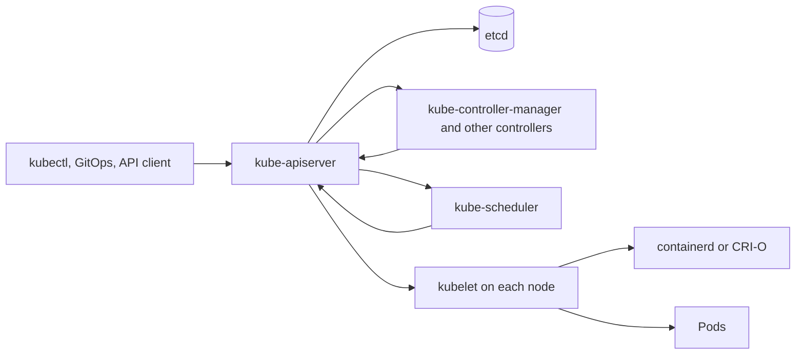

Purpose: This note is the entry point for a dense Kubernetes compendium, connecting the learning path, the architecture model, and the operational vocabulary needed to reason about clusters.

# Kubernetes

Kubernetes is a declarative control plane for running containerized workloads across a cluster of machines. It is not a container runtime, not a platform-as-a-service by itself, not a CI system, and not a replacement for application architecture. Its core job is to store desired state in an API, continuously compare that desired state with observed cluster state, and drive the system toward convergence.

Start here:

- [00 Kubernetes Mastery Roadmap](/compendium/kubernetes/kubernetes-mastery-roadmap)
- [01 Kubernetes Mental Model and Architecture](/compendium/kubernetes/kubernetes-mental-model-and-architecture)
- [00 Kubernetes Mastery Roadmap](/compendium/kubernetes/kubernetes-mastery-roadmap)

Existing crash course sections:

- [01 Kubernetes Mental Model and Architecture](/compendium/kubernetes/kubernetes-mental-model-and-architecture)
- [01 Kubernetes Mental Model and Architecture](/compendium/kubernetes/kubernetes-mental-model-and-architecture)
- [17 Kubernetes Ecosystem Tools and Learning Projects](/compendium/kubernetes/kubernetes-ecosystem-tools-and-learning-projects)
- [03 Deployments ReplicaSets StatefulSets DaemonSets Jobs and CronJobs](/compendium/kubernetes/deployments-replicasets-statefulsets-daemonsets-jobs-and-cronjobs)
- [04 Services DNS Ingress Gateway API and Traffic Routing](/compendium/kubernetes/services-dns-ingress-gateway-api-and-traffic-routing)
- [06 Configuration Secrets ServiceAccounts and Runtime Identity](/compendium/kubernetes/configuration-secrets-serviceaccounts-and-runtime-identity)
- [07 Storage Volumes PVCs StorageClasses CSI and Stateful Data](/compendium/kubernetes/storage-volumes-pvcs-storageclasses-csi-and-stateful-data)
- [10 Observability Logging Metrics Tracing Events and Probes](/compendium/kubernetes/observability-logging-metrics-tracing-events-and-probes)
- [09 Security RBAC Pod Security Admission and Supply Chain](/compendium/kubernetes/security-rbac-pod-security-admission-and-supply-chain)

## Compact Definition

Kubernetes is a distributed API-driven automation system. Users and controllers submit API objects such as Pods, Deployments, Services, ConfigMaps, Secrets, Ingresses, Jobs, and custom resources. The control plane stores those objects, validates them, watches for changes, and coordinates controllers and node agents that act on them.

The main mental model is:

1. You declare desired state.
2. The API server validates and persists that state.
3. Controllers watch state changes.
4. Controllers create or update dependent objects.
5. Node agents and infrastructure integrations make runtime changes.
6. Status fields, Events, metrics, and logs report what actually happened.

## What Kubernetes Is

| Kubernetes is | Practical meaning |
|---|---|
| A declarative API | You submit objects and let reconciliation loops work toward the requested state. |
| A cluster scheduler | It places Pods on nodes based on resource requests, constraints, taints, tolerations, affinity, topology, and policies. |
| A workload orchestrator | It keeps replicas running, restarts failed containers, rolls out changes, and manages batch work. |
| A service discovery system | Services and CoreDNS give stable names and virtual IPs for changing Pod backends. |
| An extensible platform kernel | CustomResourceDefinitions and controllers let teams add new API types and automation. |

## What Kubernetes Is Not

| Kubernetes is not | Why it matters |
|---|---|
| Not Docker | Docker is a developer toolchain and engine. Kubernetes talks to CRI runtimes such as containerd and CRI-O. Dockershim was removed in Kubernetes v1.24. |
| Not a complete application platform | You still choose CI, registry, image policy, secrets management, observability, ingress or Gateway implementation, backups, and developer workflows. |
| Not magic autoscaling | Scheduling and autoscaling depend on accurate requests, limits, metrics, policies, and capacity. |
| Not a security boundary by default | Multi-tenant clusters need RBAC, Pod Security Admission, network policy, admission policy, image controls, node isolation, and runtime hardening. |
| Not a database backup system | Stateful workloads need storage class design, volume snapshots, application-consistent backups, restore drills, and disaster recovery runbooks. |

## Core Vocabulary

| Term | Meaning | Where to study |
|---|---|---|
| Object | A persistent API resource with metadata, spec, and often status. | [01 Kubernetes Mental Model and Architecture](/compendium/kubernetes/kubernetes-mental-model-and-architecture) |
| Spec | Desired state written by a user, controller, or automation. | [01 Kubernetes Mental Model and Architecture](/compendium/kubernetes/kubernetes-mental-model-and-architecture) |
| Status | Observed state written by controllers or agents. | [01 Kubernetes Mental Model and Architecture](/compendium/kubernetes/kubernetes-mental-model-and-architecture) |
| Reconciliation | A loop that watches desired and observed state, then takes action to reduce drift. | [01 Kubernetes Mental Model and Architecture](/compendium/kubernetes/kubernetes-mental-model-and-architecture) |
| Namespace | A scope for names, RBAC, quotas, and many policies. | [01 Kubernetes Mental Model and Architecture](/compendium/kubernetes/kubernetes-mental-model-and-architecture) |
| Label | Indexed key-value metadata used for selection and grouping. | [01 Kubernetes Mental Model and Architecture](/compendium/kubernetes/kubernetes-mental-model-and-architecture) |
| Annotation | Non-identifying metadata for tools, rollout notes, checksums, ownership hints, and integrations. | [01 Kubernetes Mental Model and Architecture](/compendium/kubernetes/kubernetes-mental-model-and-architecture) |
| OwnerReference | Metadata that expresses ownership so garbage collection can remove dependents. | [01 Kubernetes Mental Model and Architecture](/compendium/kubernetes/kubernetes-mental-model-and-architecture) |
| Finalizer | A deletion gate that lets a controller clean external resources before an object disappears. | [01 Kubernetes Mental Model and Architecture](/compendium/kubernetes/kubernetes-mental-model-and-architecture) |
| Event | A short-lived diagnostic record about scheduling, pulling images, admission, readiness, or controller decisions. | [01 Kubernetes Mental Model and Architecture](/compendium/kubernetes/kubernetes-mental-model-and-architecture) |

## Production vs Local Clusters

Local clusters such as kind, minikube, k3d, Docker Desktop Kubernetes, and single-node k3s are excellent for learning API behavior, YAML shape, kubectl workflows, and controller development. They do not prove production readiness by themselves.

| Concern | Local cluster | Production cluster |
|---|---|---|
| Failure model | Often one machine, limited failure domains. | Multiple nodes, zones, capacity pools, upgrades, and real outages. |
| Networking | Simplified load balancers, ports, and DNS. | CNI choice, policy enforcement, cloud LBs, Gateway or Ingress controllers, DNS scale. |
| Storage | HostPath or simple local volumes are common. | CSI drivers, snapshots, backup, restore, reclaim policy, encryption, topology. |
| Security | Often permissive for speed. | RBAC least privilege, Pod Security Admission, audit logs, network policy, image policy. |
| Operations | Manual kubectl experiments are acceptable. | GitOps, policy checks, SLOs, incident response, upgrade plans, capacity management. |

## Current Official Facts To Remember

- The Kubernetes API reference currently lists Kubernetes v1.36.
- Dockershim was removed in Kubernetes v1.24. Modern clusters should use CRI runtimes such as containerd or CRI-O.
- PodSecurityPolicy was removed in Kubernetes v1.25.
- Pod Security Admission is stable as of Kubernetes v1.25.
- Gateway API is an official Kubernetes project and an add-on API family for role-oriented, extensible traffic management. Installing its CRDs and a compatible controller is separate from installing core Kubernetes.

## First Principles

### Desired state is data

Kubernetes turns operational intent into API data. A Deployment says "keep this many Pods matching this template available." A Service says "give a stable virtual endpoint for Pods matching this selector." A Job says "run this task to completion." A Namespace says "scope names and many controls here."

That data is valuable because many actors can read it consistently: kubectl, controllers, admission webhooks, policy engines, GitOps tools, dashboards, audit systems, and custom operators.

### Controllers are the engine

A controller is a reconciliation loop:

1. Watch relevant objects.
2. Compare desired state with observed state.
3. Create, update, delete, or report state.
4. Requeue when the world changes or when an action fails.

Good Kubernetes operations means reading controller intent and controller feedback. If a Deployment is not progressing, inspect the Deployment, ReplicaSet, Pods, Events, scheduler decisions, image pulls, probes, quotas, policies, and node state. The YAML alone is not the whole system.

### The API server is the front door

All durable cluster state changes go through kube-apiserver. Components do not usually edit etcd directly. This gives Kubernetes a uniform security and validation path: authentication, authorization, admission, defaulting, validation, persistence, watch delivery, and audit.

### Nodes execute, the control plane decides

Worker nodes run kubelet, kube-proxy or an equivalent dataplane, a container runtime, CNI networking, CSI storage plugins, and workloads. The control plane stores state and makes decisions. Kubelet then turns assigned Pods into running containers and reports status back.

## Common Mistakes

| Mistake | Consequence | Better practice |
|---|---|---|
| Treating YAML as deployment truth without reading status | Teams miss admission, scheduling, image pull, probe, and runtime failures. | Always inspect `status`, `conditions`, and `Events`. |
| Using labels casually | Services, Deployments, policies, monitoring, and cost allocation select the wrong objects. | Design stable label taxonomy early. |
| Putting operational identity in annotations only | Selectors and policies cannot use annotations. | Use labels for identity and selection, annotations for tool metadata. |
| Assuming namespace equals hard tenancy | Nodes, CRDs, cluster-scoped resources, shared controllers, and network paths can cross namespaces. | Combine namespaces with RBAC, quotas, Pod Security Admission, network policy, and node isolation where needed. |
| Forgetting owner references and finalizers | Resources leak or deletions hang. | Understand garbage collection and finalizer cleanup paths. |
| Running production like minikube | Hidden gaps in HA, storage, upgrades, security, DNS, and load balancing. | Treat local clusters as learning and integration tools, not as proof of production behavior. |

## Review Checklist

- Can you explain the difference between desired state, observed state, spec, status, and Events?
- Can you name the control plane components and the worker node components?
- Can you trace what happens when a Deployment is applied?
- Can you explain why labels power selectors and annotations do not?
- Can you explain how owner references, garbage collection, and finalizers interact?
- Can you distinguish Kubernetes core APIs from add-on APIs such as Gateway API?
- Can you describe why dockershim removal did not mean container images stopped working?
- Can you state why PodSecurityPolicy should not be used on modern clusters?

## Exact Coverage Routing

Use this section when you need to search by the exact operational phrase rather than by the broader concept.

| Phrase | Primary note | What to study there |
|---|---|---|
| Declarative desired state | [01 Kubernetes Mental Model and Architecture](/compendium/kubernetes/kubernetes-mental-model-and-architecture) | How spec, status, server-side apply, and controller loops turn API objects into runtime behavior. |
| Controller manager | [01 Kubernetes Mental Model and Architecture](/compendium/kubernetes/kubernetes-mental-model-and-architecture) | Built-in controllers, ownership, garbage collection, and reconciliation boundaries. |
| Cloud controller manager | [01 Kubernetes Mental Model and Architecture](/compendium/kubernetes/kubernetes-mental-model-and-architecture) | Provider-owned load balancers, node metadata, routes, and cloud integration boundaries. |
| When not to run a database on Kubernetes | [03 Deployments ReplicaSets StatefulSets DaemonSets Jobs and CronJobs](/compendium/kubernetes/deployments-replicasets-statefulsets-daemonsets-jobs-and-cronjobs) | The operational conditions that make managed databases safer than cluster-hosted databases. |
| Stateful workload design tradeoffs | [03 Deployments ReplicaSets StatefulSets DaemonSets Jobs and CronJobs](/compendium/kubernetes/deployments-replicasets-statefulsets-daemonsets-jobs-and-cronjobs) | Identity, storage, failover, repair, and backup implications for StatefulSets. |
| Flannel overview | [05 Kubernetes Networking CNI NetworkPolicy and Service Mesh](/compendium/kubernetes/kubernetes-networking-cni-networkpolicy-and-service-mesh) | Simple overlay networking, limits, and when richer policy-aware CNIs are required. |
| Environment variables vs mounted files | [06 Configuration Secrets ServiceAccounts and Runtime Identity](/compendium/kubernetes/configuration-secrets-serviceaccounts-and-runtime-identity) | Reload semantics, leakage risk, config size, and rollout behavior. |
| Workload identity on cloud providers | [06 Configuration Secrets ServiceAccounts and Runtime Identity](/compendium/kubernetes/configuration-secrets-serviceaccounts-and-runtime-identity) | Mapping Kubernetes ServiceAccounts to cloud IAM without static long-lived credentials. |
| StatefulSets with PVC templates | [07 Storage Volumes PVCs StorageClasses CSI and Stateful Data](/compendium/kubernetes/storage-volumes-pvcs-storageclasses-csi-and-stateful-data) | Per-replica storage identity, retention, expansion, restore, and migration risks. |
| SELinux overview | [09 Security RBAC Pod Security Admission and Supply Chain](/compendium/kubernetes/security-rbac-pod-security-admission-and-supply-chain) | Host-level mandatory access controls and how they relate to SecurityContext and runtimes. |
| kubectl events | [10 Observability Logging Metrics Tracing Events and Probes](/compendium/kubernetes/observability-logging-metrics-tracing-events-and-probes) | Event querying, event retention limits, and how to combine Events with status and logs. |
| Structured logging | [10 Observability Logging Metrics Tracing Events and Probes](/compendium/kubernetes/observability-logging-metrics-tracing-events-and-probes) | Log fields, correlation IDs, severity, sampling, and incident searchability. |
| SLO-oriented observability | [10 Observability Logging Metrics Tracing Events and Probes](/compendium/kubernetes/observability-logging-metrics-tracing-events-and-probes) | Telemetry based on user symptoms, error budgets, burn rates, and runbook triggers. |
| Debugging with ephemeral containers | [11 Troubleshooting Debugging and Incident Response](/compendium/kubernetes/troubleshooting-debugging-and-incident-response) | How to inspect minimal images and live Pods without modifying the workload spec. |
| Port forwarding | [10 Observability Logging Metrics Tracing Events and Probes](/compendium/kubernetes/observability-logging-metrics-tracing-events-and-probes) | Temporary local access for inspection, with security and audit limits. |
| Capturing diagnostics | [11 Troubleshooting Debugging and Incident Response](/compendium/kubernetes/troubleshooting-debugging-and-incident-response) | Evidence bundles for Pods, Services, Nodes, PVCs, policies, and rollouts. |
| Ingress returns 404 or 502 | [11 Troubleshooting Debugging and Incident Response](/compendium/kubernetes/troubleshooting-debugging-and-incident-response) | Controller class, route match, backend Service, endpoint readiness, and upstream protocol checks. |
| TLS certificate failures | [11 Troubleshooting Debugging and Incident Response](/compendium/kubernetes/troubleshooting-debugging-and-incident-response) | Secret shape, certificate chain, SNI, issuer, renewal, and controller reload checks. |
| Rollout stuck | [11 Troubleshooting Debugging and Incident Response](/compendium/kubernetes/troubleshooting-debugging-and-incident-response) | Deployment progress, ReplicaSet ownership, PDBs, readiness, quota, image, and admission causes. |
| NetworkPolicy blocks traffic | [11 Troubleshooting Debugging and Incident Response](/compendium/kubernetes/troubleshooting-debugging-and-incident-response) | Namespace selectors, pod selectors, ingress, egress, DNS, and CNI enforcement checks. |
| Debugging order of operations | [11 Troubleshooting Debugging and Incident Response](/compendium/kubernetes/troubleshooting-debugging-and-incident-response) | A deterministic symptom to owner to controller to event to dataplane investigation sequence. |
| Incident response checklists | [11 Troubleshooting Debugging and Incident Response](/compendium/kubernetes/troubleshooting-debugging-and-incident-response) | Stabilization, evidence capture, mitigation, communication, recovery, and follow-up. |
| Helm charts | [12 Helm Kustomize Manifests and Release Engineering](/compendium/kubernetes/helm-kustomize-manifests-and-release-engineering) | Chart structure, values, templates, hooks, rollback, and release ownership. |
| Argo Rollouts overview | [12 Helm Kustomize Manifests and Release Engineering](/compendium/kubernetes/helm-kustomize-manifests-and-release-engineering) | Progressive delivery using canary, blue green, analysis, and automated promotion controls. |
| Blue green deployments | [12 Helm Kustomize Manifests and Release Engineering](/compendium/kubernetes/helm-kustomize-manifests-and-release-engineering) | Safe traffic switching, rollback, schema compatibility, and capacity cost. |
| Canary deployments | [12 Helm Kustomize Manifests and Release Engineering](/compendium/kubernetes/helm-kustomize-manifests-and-release-engineering) | Gradual exposure, metrics gates, blast radius, and abort behavior. |
| Reconciliation design | [13 GitOps Controllers Operators CRDs and Platform APIs](/compendium/kubernetes/gitops-controllers-operators-crds-and-platform-apis) | Controller inputs, idempotency, status conditions, finalizers, rate limits, and ownership. |
| Crossplane overview | [13 GitOps Controllers Operators CRDs and Platform APIs](/compendium/kubernetes/gitops-controllers-operators-crds-and-platform-apis) | Using Kubernetes APIs to provision external infrastructure through provider controllers. |
| Cluster bootstrap overview | [14 Cluster Operations Upgrades Backup Restore and Disaster Recovery](/compendium/kubernetes/cluster-operations-upgrades-backup-restore-and-disaster-recovery) | How control plane, CNI, CSI, DNS, ingress, policy, and GitOps foundations come online. |
| kubeadm overview | [14 Cluster Operations Upgrades Backup Restore and Disaster Recovery](/compendium/kubernetes/cluster-operations-upgrades-backup-restore-and-disaster-recovery) | Self-managed cluster bootstrapping, certificates, upgrades, and operational ownership. |
| Bare metal clusters | [14 Cluster Operations Upgrades Backup Restore and Disaster Recovery](/compendium/kubernetes/cluster-operations-upgrades-backup-restore-and-disaster-recovery) | Load balancing, storage, power, networking, hardware failure, and upgrade responsibilities. |
| Talos overview | [14 Cluster Operations Upgrades Backup Restore and Disaster Recovery](/compendium/kubernetes/cluster-operations-upgrades-backup-restore-and-disaster-recovery) | Immutable Kubernetes-focused OS operations and API-driven node management. |
| k3s and lightweight clusters | [14 Cluster Operations Upgrades Backup Restore and Disaster Recovery](/compendium/kubernetes/cluster-operations-upgrades-backup-restore-and-disaster-recovery) | Edge, lab, and small-footprint clusters without confusing them with full HA production designs. |
| API deprecations | [14 Cluster Operations Upgrades Backup Restore and Disaster Recovery](/compendium/kubernetes/cluster-operations-upgrades-backup-restore-and-disaster-recovery) | Release planning, manifest scanning, conversion, and upgrade gates. |
| CNI upgrades | [14 Cluster Operations Upgrades Backup Restore and Disaster Recovery](/compendium/kubernetes/cluster-operations-upgrades-backup-restore-and-disaster-recovery) | Dataplane compatibility, policy behavior, rollback, and node disruption risks. |
| CSI upgrades | [14 Cluster Operations Upgrades Backup Restore and Disaster Recovery](/compendium/kubernetes/cluster-operations-upgrades-backup-restore-and-disaster-recovery) | Driver compatibility, snapshots, expansion, attach behavior, and restore testing. |
| Ingress controller upgrades | [14 Cluster Operations Upgrades Backup Restore and Disaster Recovery](/compendium/kubernetes/cluster-operations-upgrades-backup-restore-and-disaster-recovery) | Routing compatibility, annotations, Gateway API migration, TLS reload, and rollback plans. |
| Backup testing | [14 Cluster Operations Upgrades Backup Restore and Disaster Recovery](/compendium/kubernetes/cluster-operations-upgrades-backup-restore-and-disaster-recovery) | Proving backups by restoring real objects, etcd state, PVC data, and control plane dependencies. |

## Study Order

1. Read [00 Kubernetes Mastery Roadmap](/compendium/kubernetes/kubernetes-mastery-roadmap) for the sequence.
2. Read [01 Kubernetes Mental Model and Architecture](/compendium/kubernetes/kubernetes-mental-model-and-architecture) until the reconciliation and component model is fluent.
3. Use [00 Kubernetes Mastery Roadmap](/compendium/kubernetes/kubernetes-mastery-roadmap) to practice basic commands.
4. Revisit each concept with a local cluster, then compare the local behavior with production constraints.
