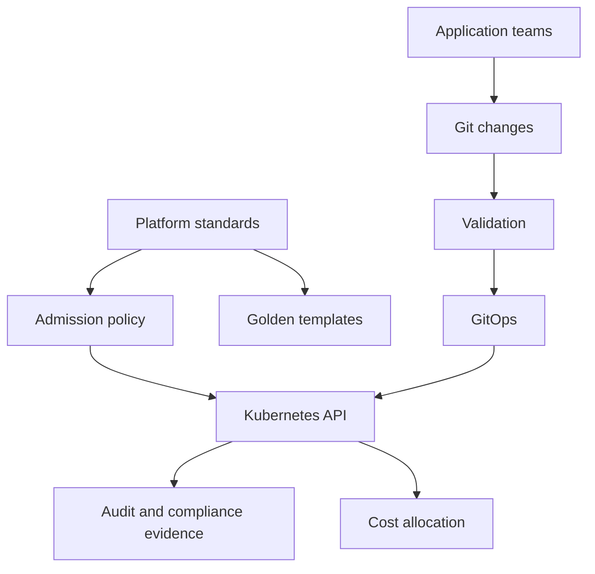

Purpose: explain how Kubernetes clusters can safely host multiple teams, environments, or tenants through isolation, policy, governance, and cost controls.

# Multi Tenancy, Policy, Governance, and Cost Management

Kubernetes multi tenancy is not a single feature. It is a design across identity, namespaces, RBAC, admission policy, network isolation, resource controls, observability, cost attribution, and operational ownership. The goal is to let teams move independently without giving one tenant an easy path to break or inspect another tenant.

Core links: [Kubernetes](/compendium/kubernetes/kubernetes), [06 Configuration Secrets ServiceAccounts and Runtime Identity](/compendium/kubernetes/configuration-secrets-serviceaccounts-and-runtime-identity), [07 Storage Volumes PVCs StorageClasses CSI and Stateful Data](/compendium/kubernetes/storage-volumes-pvcs-storageclasses-csi-and-stateful-data), [10 Observability Logging Metrics Tracing Events and Probes](/compendium/kubernetes/observability-logging-metrics-tracing-events-and-probes), [12 Helm Kustomize Manifests and Release Engineering](/compendium/kubernetes/helm-kustomize-manifests-and-release-engineering), [13 GitOps Controllers Operators CRDs and Platform APIs](/compendium/kubernetes/gitops-controllers-operators-crds-and-platform-apis), <span className="compendium-external-reference" title="Vault-only reference">Software Supply Chain Security</span>.

## Tenancy Models

| Model | Isolation | Cost | Best fit |
|---|---|---|---|
| Namespace tenancy | Soft to medium | Low | Internal teams with shared trust boundary |
| Virtual clusters | Medium | Medium | Teams needing API isolation without full clusters |
| Cluster per tenant | Stronger | Higher | Regulated, noisy, or external tenants |
| Account or project per tenant | Strongest cloud boundary | Highest | Strict compliance and billing separation |

Namespace tenancy is common, but it is not equivalent to a security boundary unless admission, RBAC, network, resource, and host controls are strong.

## Namespace Baseline

```yaml
apiVersion: v1
kind: Namespace
metadata:
  name: payments
  labels:
    owner: team-payments
    cost-center: commerce
    environment: prod
    pod-security.kubernetes.io/enforce: restricted
    pod-security.kubernetes.io/audit: restricted
    pod-security.kubernetes.io/warn: restricted
```

Baseline namespace objects:

- ResourceQuota.
- LimitRange.
- NetworkPolicy default deny plus approved egress.
- RoleBindings for team and automation identities.
- Secret access pattern through external secret tooling.
- ServiceAccount defaults with automount disabled where possible.
- Ownership, environment, and cost labels.

## RBAC

RBAC grants verbs on resources to subjects. Keep it boring, explicit, and reviewed.

```yaml
apiVersion: rbac.authorization.k8s.io/v1
kind: Role
metadata:
  name: app-operator
  namespace: payments
rules:
  - apiGroups: ["apps"]
    resources: ["deployments"]
    verbs: ["get", "list", "watch", "patch"]
  - apiGroups: [""]
    resources: ["pods", "pods/log", "services", "events"]
    verbs: ["get", "list", "watch"]
---
apiVersion: rbac.authorization.k8s.io/v1
kind: RoleBinding
metadata:
  name: team-payments-app-operator
  namespace: payments
subjects:
  - kind: Group
    name: team-payments
    apiGroup: rbac.authorization.k8s.io
roleRef:
  kind: Role
  name: app-operator
  apiGroup: rbac.authorization.k8s.io
```

Useful checks:

```bash
kubectl auth can-i patch deployments -n payments --as alice@example.com
kubectl auth can-i create pods/exec -n payments --as alice@example.com
kubectl get rolebindings,clusterrolebindings -A
kubectl describe clusterrole cluster-admin
```

Avoid broad grants such as `*` verbs, `*` resources, and casual ClusterRoleBindings. `pods/exec`, `secrets`, `impersonate`, and admission webhook permissions deserve special review.

## ResourceQuota and LimitRange

Resource controls protect the cluster from accidental exhaustion and create cost accountability.

```yaml
apiVersion: v1
kind: ResourceQuota
metadata:
  name: namespace-budget
  namespace: payments
spec:
  hard:
    requests.cpu: "20"
    requests.memory: 80Gi
    limits.memory: 120Gi
    pods: "80"
    services.loadbalancers: "2"
---
apiVersion: v1
kind: LimitRange
metadata:
  name: default-container-limits
  namespace: payments
spec:
  limits:
    - type: Container
      defaultRequest:
        cpu: 100m
        memory: 128Mi
      default:
        memory: 512Mi
      max:
        memory: 4Gi
```

Quota guidance:

- Set requests quota to control schedulable capacity.
- Set object count quotas to prevent API clutter.
- Avoid default CPU limits unless the team understands throttling behavior.
- Use memory limits carefully because memory exhaustion kills containers.
- Review quota alongside actual usage and business criticality.

## NetworkPolicy

Default allow networking is risky in multi-tenant clusters. NetworkPolicy requires a compatible CNI.

Default deny ingress and egress:

```yaml
apiVersion: networking.k8s.io/v1
kind: NetworkPolicy
metadata:
  name: default-deny
  namespace: payments
spec:
  podSelector: {}
  policyTypes:
    - Ingress
    - Egress
```

Allow DNS and same-namespace app traffic:

```yaml
apiVersion: networking.k8s.io/v1
kind: NetworkPolicy
metadata:
  name: allow-dns-and-api
  namespace: payments
spec:
  podSelector:
    matchLabels:
      app: payments-api
  policyTypes:
    - Egress
  egress:
    - to:
        - namespaceSelector:
            matchLabels:
              kubernetes.io/metadata.name: kube-system
      ports:
        - protocol: UDP
          port: 53
    - to:
        - podSelector:
            matchLabels:
              app: payments-db-proxy
      ports:
        - protocol: TCP
          port: 5432
```

NetworkPolicy is label-driven. Broken or missing labels often mean broken connectivity.

## Pod Security

Pod Security Admission can enforce restricted workload settings at namespace level.

Restricted intent:

- No privileged containers.
- No host namespace access.
- No hostPath volumes unless tightly exempted.
- Drop Linux capabilities by default.
- Run as non-root.
- Use read-only root filesystem when practical.
- Use seccomp RuntimeDefault.

Example container security context:

```yaml
securityContext:
  runAsNonRoot: true
  allowPrivilegeEscalation: false
  readOnlyRootFilesystem: true
  capabilities:
    drop: ["ALL"]
  seccompProfile:
    type: RuntimeDefault
```

## Admission Policy

Policy engines enforce governance at write time. Common choices include Kubernetes ValidatingAdmissionPolicy, Kyverno, and Gatekeeper.

Governance policy categories:

- Required labels and owner metadata.
- Approved registries.
- Resource requests.
- Pod security restrictions.
- Ingress host and TLS rules.
- Disallowed Service type LoadBalancer outside approved namespaces.
- Required NetworkPolicies.
- No plain Secret literals in GitOps repos.

Admission policy should be tested in audit mode before enforcement when a cluster has existing workloads.

## Compliance Evidence

Evidence should be generated from systems, not manually reconstructed.

Evidence sources:

- Git history and pull request approvals.
- GitOps sync history.
- Kubernetes audit logs.
- Admission policy reports.
- RBAC review exports.
- Image scan and signature results.
- Backup and restore drill records.
- Access review decisions.
- Cost allocation reports.

Evidence command examples:

```bash
kubectl get ns --show-labels
kubectl get resourcequota,limitrange -A
kubectl get networkpolicy -A
kubectl auth can-i --list -n payments
kubectl get events -A --sort-by=.lastTimestamp
```

## Cost Management

Kubernetes cost management depends on requests, usage, labels, and ownership. Costs should be attributed to teams and services, not only clusters.

Cost dimensions:

- CPU and memory requests.
- Actual usage.
- Persistent volumes.
- Load balancers.
- Egress.
- GPU and special node pools.
- Idle capacity.
- Shared platform overhead.

Label contract:

```yaml
metadata:
  labels:
    app.kubernetes.io/name: payments-api
    app.kubernetes.io/part-of: commerce
    owner: team-payments
    cost-center: commerce
    environment: prod
```

Commands:

```bash
kubectl top pods -n payments
kubectl top nodes
kubectl get pods -A -o custom-columns=NS:.metadata.namespace,NAME:.metadata.name,CPU:.spec.containers[*].resources.requests.cpu,MEM:.spec.containers[*].resources.requests.memory
kubectl get pvc -A
kubectl get svc -A --field-selector spec.type=LoadBalancer
```

Cost guidance:

- Right-size requests from observed usage, SLOs, and burst needs.
- Separate guaranteed critical workloads from opportunistic workloads.
- Use quotas to stop silent growth.
- Use namespace and app labels for chargeback or showback.
- Track idle node pool capacity.
- Review storage and load balancers because they are easy to forget.

## Governance Operating Model



Governance should make the secure path easy. If policies block common work without clear alternatives, teams will push for exemptions or bypasses.

## Common Mistakes

| Mistake | Consequence | Better practice |
|---|---|---|
| Namespace per team with no policy | Weak isolation | Add RBAC, NetworkPolicy, quotas, and pod security |
| Giving developers cluster-admin | Accidental cluster-wide impact | Namespace roles and break-glass path |
| No cost labels | Shared bill cannot be explained | Enforce owner and cost-center labels |
| Default allow egress | Data paths are invisible | Use explicit egress for sensitive namespaces |
| CPU limits everywhere | Latency from throttling | Use CPU requests and selective limits |
| Policy with no audit phase | Surprise production blocks | Audit, report, remediate, then enforce |

## Troubleshooting

```bash
kubectl describe quota namespace-budget -n payments
kubectl describe limitrange default-container-limits -n payments
kubectl auth can-i get secrets -n payments --as alice@example.com
kubectl describe networkpolicy default-deny -n payments
kubectl get events -n payments --sort-by=.lastTimestamp
kubectl describe pod api-123 -n payments
```

Questions:

- Is admission rejecting the object?
- Is quota blocking pod creation?
- Did LimitRange inject defaults that changed scheduling?
- Is RBAC denying the human, CI identity, or controller ServiceAccount?
- Does NetworkPolicy select the intended pods?
- Are cost labels present on all billable objects?

## Review Checklist

- Every namespace has owner, environment, and cost labels.
- RBAC follows least privilege and avoids broad ClusterRoleBindings.
- ResourceQuota and LimitRange match tenant size and criticality.
- Default deny NetworkPolicy exists for sensitive namespaces.
- Pod security level is enforced with documented exemptions.
- Admission policies are tested and reported.
- Cost reports map spend to service and team.
- Break-glass access is logged, time-bound, and reviewed.

