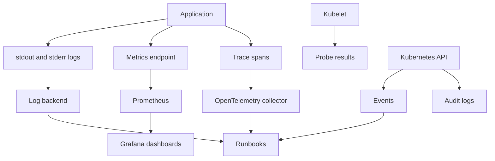

Purpose: explain how to observe Kubernetes workloads through logs, metrics, traces, events, probes, audit records, SLOs, alerts, and runbooks.

# Observability, Logging, Metrics, Tracing, Events, and Probes

This note expands [Kubernetes](/compendium/kubernetes/kubernetes), [10 Observability Logging Metrics Tracing Events and Probes](/compendium/kubernetes/observability-logging-metrics-tracing-events-and-probes), [03 Deployments ReplicaSets StatefulSets DaemonSets Jobs and CronJobs](/compendium/kubernetes/deployments-replicasets-statefulsets-daemonsets-jobs-and-cronjobs), and [04 Services DNS Ingress Gateway API and Traffic Routing](/compendium/kubernetes/services-dns-ingress-gateway-api-and-traffic-routing). Kubernetes observability is the ability to answer what is running, whether users are affected, why the system changed, and which component owns the fix. Logs, metrics, traces, events, probes, and audit logs answer different questions and should be used together.



## Observability signals

| Signal | Best for | Weakness | First commands or tools |
| --- | --- | --- | --- |
| Logs | Specific errors, request context, application decisions | High volume, hard to aggregate without structure | `kubectl logs`, log backend |
| Metrics | Rates, saturation, trends, SLOs, alerting | Poor at explaining one request | Metrics Server, Prometheus, Grafana |
| Traces | Cross service request path and latency | Requires instrumentation and sampling design | OpenTelemetry, tracing backend |
| Events | Kubernetes control plane decisions | Short retention, not a log system | `kubectl get events`, `kubectl describe` |
| Probes | Container health and traffic eligibility | Can cause outages if designed badly | Pod spec, kubelet events |
| Audit logs | API access and security investigation | High volume, sensitive, platform owned | API server audit backend |

## Fast kubectl inspection

```bash
kubectl get pods -n payments -o wide
kubectl describe pod api-7d75b9c8b6-h9x4q -n payments
kubectl logs deploy/api -n payments --tail=200
kubectl logs deploy/api -n payments -c api --since=15m
kubectl logs pod/api-7d75b9c8b6-h9x4q -n payments --previous
kubectl get events -n payments --sort-by=.lastTimestamp
kubectl top pods -n payments
kubectl top nodes
```

Use `describe` when Kubernetes is making the decision: scheduling, image pull, probes, volume attach, endpoints, and rollout failures. Use logs when the application accepted control and then failed.

## Container logs

Kubernetes expects containers to write application logs to stdout and stderr. The node runtime stores them and a log agent usually ships them to a central backend.

Recommended log fields:

| Field | Reason |
| --- | --- |
| `timestamp` | Reconstruct timeline |
| `level` | Filter noise |
| `service` | Group workload output |
| `namespace` | Preserve tenant or environment context |
| `pod` | Link log to runtime instance |
| `container` | Distinguish sidecars and app container |
| `request_id` or `trace_id` | Join logs to traces |
| `user_id` or tenant id | Debug scoped impact with privacy controls |
| `error.kind` | Aggregate failure classes |
| `duration_ms` | Support latency analysis |

Structured JSON log example:

```json
{
  "timestamp": "2026-06-15T12:00:00Z",
  "level": "error",
  "service": "payments-api",
  "namespace": "payments",
  "trace_id": "9d2c3a2f2b5d4f7a",
  "request_id": "req_123",
  "route": "POST /payments",
  "status": 502,
  "duration_ms": 1840,
  "error.kind": "upstream_timeout"
}
```

Logging tradeoffs:

| Choice | Benefit | Cost |
| --- | --- | --- |
| Plain text logs | Easy for humans locally | Hard to query reliably |
| JSON logs | Strong search and aggregation | Requires disciplined schema |
| High cardinality fields | Precise debugging | Storage and index cost |
| Debug logs always on | More context during incidents | Cost and secret leakage risk |
| Dynamic log level | Incident flexibility | Needs authentication and audit |

Common log mistakes:

| Mistake | Consequence | Fix |
| --- | --- | --- |
| Logging secrets or tokens | Credential exposure | Redact at source and test redaction |
| Logging only success paths | Incidents lack evidence | Log error class, outcome, and correlation id |
| Logging without request ids | Cannot connect services | Propagate request id or trace context |
| Logging stack traces for every user error | Noise hides real failures | Separate validation errors from server errors |
| Storing logs only on nodes | Lost after node deletion | Ship to centralized backend |

## Events

Events are Kubernetes status breadcrumbs. They explain scheduler decisions, image pulls, probe failures, mount failures, and controller activity.

```bash
kubectl get events -n payments --sort-by=.lastTimestamp
kubectl get events -A --field-selector involvedObject.kind=Pod --sort-by=.lastTimestamp
kubectl describe deployment api -n payments
kubectl describe replicaset -n payments -l app=api
```

Event interpretation:

| Event reason | Likely issue |
| --- | --- |
| `FailedScheduling` | Resource shortage, taints, affinity, PVC, node selector |
| `FailedMount` | Secret, ConfigMap, PVC, CSI, or permission issue |
| `BackOff` | CrashLoopBackOff or image pull backoff |
| `Unhealthy` | Probe failure |
| `FailedCreate` | Quota, admission, RBAC, or invalid Pod spec |
| `Killing` | Probe restart, eviction, rollout, or deletion |

Events are not durable enough for long incident investigations. Ship them or scrape them if the organization relies on historical event timelines.

## Metrics Server

Metrics Server provides recent CPU and memory usage for Kubernetes resource APIs. It powers commands such as `kubectl top` and the HorizontalPodAutoscaler resource metrics path. It is not a long term metrics database.

```bash
kubectl top nodes
kubectl top pods -A
kubectl top pod api-7d75b9c8b6-h9x4q -n payments --containers
kubectl get apiservice v1beta1.metrics.k8s.io
```

Metrics Server scope:

| Good use | Poor use |
| --- | --- |
| Quick resource snapshot | Long term capacity planning |
| HPA CPU and memory metrics | Application SLO alerting |
| Node pressure triage | Historical incident analysis |

## Prometheus and Grafana

Prometheus is the common Kubernetes metrics backend. Grafana is the common dashboard layer. A production setup usually scrapes cluster components, kube state metrics, node exporters, application metrics, and custom SLO metrics.

Prometheus scrape annotations are simple but less controlled than ServiceMonitor or PodMonitor CRDs from the Prometheus Operator:

```yaml
apiVersion: v1
kind: Service
metadata:
  name: payments-api
  namespace: payments
  labels:
    app: payments-api
  annotations:
    prometheus.io/scrape: "true"
    prometheus.io/port: "8080"
    prometheus.io/path: "/metrics"
spec:
  selector:
    app: payments-api
  ports:
    - name: http
      port: 80
      targetPort: 8080
```

Application metrics to expose:

| Metric | Type | Purpose |
| --- | --- | --- |
| `http_requests_total` | Counter | Request rate and error ratio |
| `http_request_duration_seconds` | Histogram | Latency percentiles |
| `queue_depth` | Gauge | Backlog and saturation |
| `worker_jobs_total` | Counter | Job throughput and failures |
| `db_pool_in_use` | Gauge | Database pool pressure |
| `external_request_duration_seconds` | Histogram | Dependency latency |

PromQL examples:

```promql
sum(rate(http_requests_total{namespace="payments",status=~"5.."}[5m]))
/
sum(rate(http_requests_total{namespace="payments"}[5m]))
```

```promql
histogram_quantile(
  0.95,
  sum by (le, route) (
    rate(http_request_duration_seconds_bucket{namespace="payments"}[5m])
  )
)
```

```promql
sum by (pod) (
  rate(container_cpu_usage_seconds_total{namespace="payments",container!="POD"}[5m])
)
```

Dashboard design:

| Dashboard | Must show |
| --- | --- |
| Service overview | Request rate, error ratio, p50, p95, p99, saturation, deploy version |
| Kubernetes workload | Replicas, restarts, CPU, memory, throttling, network, probe failures |
| Dependency | Upstream latency, error rate, timeout count, circuit breaker state |
| Node pool | Allocatable, requested, used, pressure, evictions |
| SLO | Burn rate, budget remaining, user impact |

## OpenTelemetry and tracing

Tracing connects one user request across services. OpenTelemetry provides APIs, SDKs, semantic conventions, and collectors.

Basic collector pipeline:

```yaml
apiVersion: v1
kind: ConfigMap
metadata:
  name: otel-collector-config
  namespace: observability
data:
  config.yaml: |
    receivers:
      otlp:
        protocols:
          grpc:
          http:
    processors:
      batch:
      memory_limiter:
        limit_mib: 512
    exporters:
      otlp:
        endpoint: tracing-backend.observability.svc.cluster.local:4317
        tls:
          insecure: true
    service:
      pipelines:
        traces:
          receivers: [otlp]
          processors: [memory_limiter, batch]
          exporters: [otlp]
```

Trace guidance:

| Practice | Reason |
| --- | --- |
| Propagate W3C trace context | Joins spans across services |
| Put `trace_id` in logs | Enables log to trace pivot |
| Sample intelligently | Controls cost while preserving rare errors |
| Capture dependency spans | Identifies slow upstreams |
| Avoid sensitive span attributes | Traces are broadly queried during incidents |
| Name routes with templates | Avoids high cardinality paths |

## Audit logs

Kubernetes audit logs record API server requests. They are security and change evidence, not application logs.

Audit policy example:

```yaml
apiVersion: audit.k8s.io/v1
kind: Policy
rules:
  - level: Metadata
    resources:
      - group: ""
        resources: ["pods", "services", "configmaps"]
  - level: RequestResponse
    resources:
      - group: ""
        resources: ["secrets"]
    verbs: ["create", "update", "patch", "delete"]
  - level: Metadata
    resources:
      - group: "rbac.authorization.k8s.io"
        resources: ["roles", "rolebindings", "clusterroles", "clusterrolebindings"]
```

Audit review questions:

| Question | Evidence |
| --- | --- |
| Who changed this Deployment | Audit log `user`, `verb`, `objectRef`, request body if captured |
| Who read a Secret | Audit log for `get secrets`, if configured |
| Was `exec` used | Audit log for `create pods/exec` |
| Did a controller make the change | User agent and username show controller identity |
| Was admission bypassed | Compare request, admission logs, and final object |

## Probes

Probes are kubelet checks. They do not prove the whole service is healthy. They decide restart behavior and traffic readiness for individual containers.

| Probe | Action on failure | Best for |
| --- | --- | --- |
| Startup | Disables liveness and readiness until it succeeds | Slow boot apps |
| Readiness | Removes Pod from Service endpoints | Dependency readiness and graceful deploys |
| Liveness | Restarts container | Deadlocks and unrecoverable local failure |

Production HTTP probes:

```yaml
startupProbe:
  httpGet:
    path: /health/startup
    port: 8080
  periodSeconds: 5
  failureThreshold: 24
readinessProbe:
  httpGet:
    path: /health/ready
    port: 8080
  periodSeconds: 5
  timeoutSeconds: 2
  failureThreshold: 3
livenessProbe:
  httpGet:
    path: /health/live
    port: 8080
  periodSeconds: 10
  timeoutSeconds: 2
  failureThreshold: 3
```

Probe timing:

| Field | Meaning | Guidance |
| --- | --- | --- |
| `initialDelaySeconds` | Delay before first probe | Prefer startup probes for long boot |
| `periodSeconds` | Probe frequency | Balance detection speed and load |
| `timeoutSeconds` | Single probe timeout | Must be longer than normal local response time |
| `successThreshold` | Successes required after failure | Readiness can use values above 1 |
| `failureThreshold` | Failures before action | Avoid aggressive liveness restarts |

Health endpoint design:

| Endpoint | Should check | Should not check |
| --- | --- | --- |
| `/health/live` | Process is not deadlocked and can answer locally | Database, cache, third party APIs |
| `/health/ready` | App can serve traffic for required dependencies | Optional integrations that can degrade gracefully |
| `/health/startup` | Migrations, cache warmup, one time initialization | Long external calls without timeout |

Readiness can depend on database reachability if the service cannot handle requests without it. Liveness usually should not. A database outage should remove Pods from endpoints or return user errors, not restart every container in the fleet.

Probe failure triage:

```bash
kubectl describe pod api-7d75b9c8b6-h9x4q -n payments
kubectl logs pod/api-7d75b9c8b6-h9x4q -n payments --previous
kubectl get endpoints payments-api -n payments -o wide
kubectl port-forward pod/api-7d75b9c8b6-h9x4q -n payments 18080:8080
curl -i http://127.0.0.1:18080/health/ready
```

## SLO observability

SLOs connect telemetry to user promises. They should be defined from user visible behavior, not from pod health.

Example SLO:

| Item | Definition |
| --- | --- |
| Service | Payments API |
| Objective | 99.9 percent of valid payment requests succeed over 30 days |
| Good event | HTTP 2xx or accepted async response |
| Bad event | HTTP 5xx, timeout, or dependency failure visible to user |
| Excluded | Client validation errors and explicit rate limits |
| Alert | Multi window burn rate on error budget |

Burn rate alert shape:

```promql
(
  sum(rate(http_requests_total{service="payments-api",status=~"5.."}[5m]))
  /
  sum(rate(http_requests_total{service="payments-api"}[5m]))
) > 0.02
```

Alert design:

| Alert type | Page? | Example |
| --- | --- | --- |
| User impact SLO burn | Yes | High 5xx rate for production API |
| Imminent saturation | Yes when impact is likely | Node disk pressure with evictions |
| Single pod restart | No by default | Ticket or dashboard annotation |
| Missing metrics | Yes for critical telemetry | Prometheus cannot scrape production service |
| Deployment failed | Usually ticket, page if production stuck | Rollout timeout |

## Runbooks

Every actionable alert should have a runbook. A useful runbook is concrete enough for a tired responder.

Runbook template:

| Section | Content |
| --- | --- |
| Signal | Alert name, query, dashboard link |
| Impact | What users experience |
| First checks | Exact commands and dashboards |
| Triage branches | Common causes and how to distinguish them |
| Mitigation | Rollback, scale, disable feature, fail over |
| Escalation | Owning team and dependency contacts |
| Evidence | Logs, traces, events, deployment id |
| Aftercare | Follow up metrics and post incident notes |

Example first checks:

```bash
kubectl rollout status deploy/payments-api -n payments
kubectl get pods -n payments -l app=payments-api -o wide
kubectl describe deploy payments-api -n payments
kubectl get events -n payments --sort-by=.lastTimestamp | tail -40
kubectl logs deploy/payments-api -n payments --since=10m --tail=500
```

## Review checklist

- [ ] Application logs are structured and include correlation ids.
- [ ] Logs do not contain secrets, tokens, or full payment data.
- [ ] Metrics include request rate, errors, latency, and saturation.
- [ ] Histograms use stable route labels, not raw URLs.
- [ ] Traces propagate across ingress, service calls, queues, and workers.
- [ ] Probe endpoints are separate for startup, readiness, and liveness.
- [ ] Liveness does not depend on database or third party availability.
- [ ] Readiness removes Pods from endpoints when required dependencies are unavailable.
- [ ] Events are collected or retained long enough for incident timelines.
- [ ] Audit logs capture RBAC, Secret, exec, and workload change activity.
- [ ] Alerts page on user impact or imminent impact, not normal churn.
- [ ] Every page has a concrete runbook.

