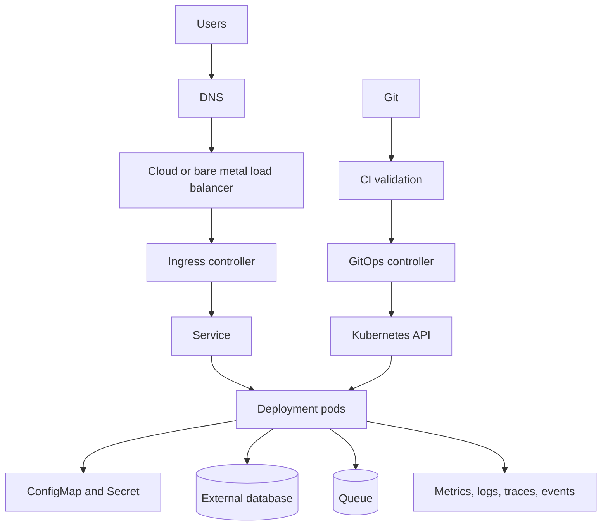
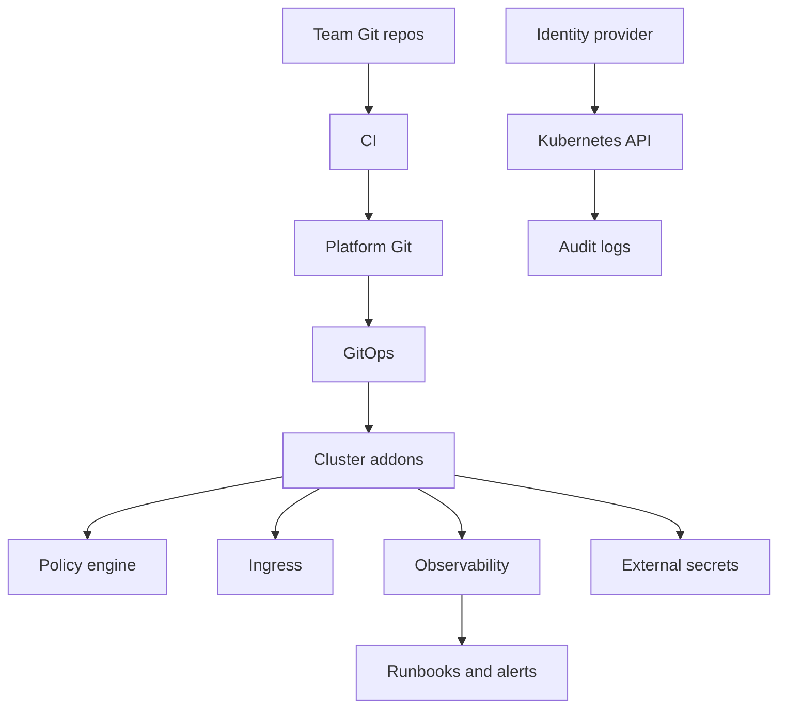
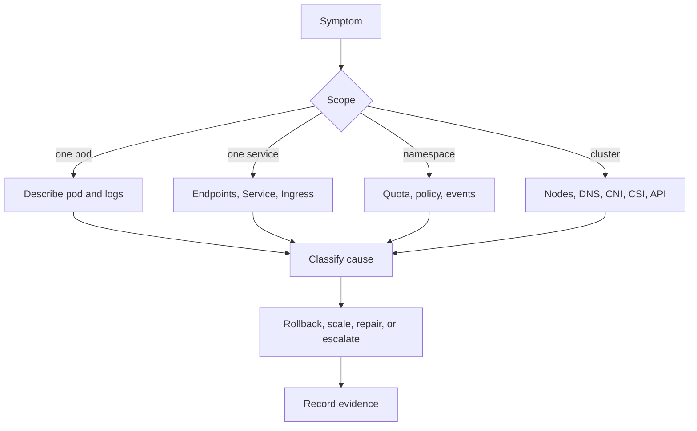

Purpose: explain practical Kubernetes production architectures, repeatable patterns, and dangerous anti-patterns for application and platform teams.

# Production Patterns, Anti Patterns, and Reference Architectures

Production Kubernetes is a set of disciplined defaults. The platform should make ordinary services easy to deploy safely, make dangerous operations visible, and keep failure domains understandable. Architecture quality shows up during deploys, node drains, bad releases, capacity pressure, network incidents, and restores.

Core links: [Kubernetes](/compendium/kubernetes/kubernetes), [03 Deployments ReplicaSets StatefulSets DaemonSets Jobs and CronJobs](/compendium/kubernetes/deployments-replicasets-statefulsets-daemonsets-jobs-and-cronjobs), [04 Services DNS Ingress Gateway API and Traffic Routing](/compendium/kubernetes/services-dns-ingress-gateway-api-and-traffic-routing), [07 Storage Volumes PVCs StorageClasses CSI and Stateful Data](/compendium/kubernetes/storage-volumes-pvcs-storageclasses-csi-and-stateful-data), [10 Observability Logging Metrics Tracing Events and Probes](/compendium/kubernetes/observability-logging-metrics-tracing-events-and-probes), [12 Helm Kustomize Manifests and Release Engineering](/compendium/kubernetes/helm-kustomize-manifests-and-release-engineering), [14 Cluster Operations Upgrades Backup Restore and Disaster Recovery](/compendium/kubernetes/cluster-operations-upgrades-backup-restore-and-disaster-recovery), <span className="compendium-external-reference" title="Vault-only reference">Littles law and efficient queue strategy</span>.

## Reference Architecture



This shape keeps stateful dependencies explicit, routes external traffic through controlled ingress, and drives changes through GitOps.

## Golden Path Application Pattern

Recommended minimum for a stateless service:

- Deployment with multiple replicas.
- Readiness and liveness probes with different purposes.
- CPU and memory requests.
- Memory limit if the runtime handles it safely.
- Service with stable DNS.
- Ingress or Gateway when external traffic is needed.
- ConfigMap for non-secret config.
- Secret or external secret reference for sensitive config.
- PodDisruptionBudget.
- HorizontalPodAutoscaler when scaling signal is known.
- NetworkPolicy.
- ServiceMonitor or equivalent metrics discovery.
- Owner, app, version, environment, and cost labels.

Deployment excerpt:

```yaml
apiVersion: apps/v1
kind: Deployment
metadata:
  name: checkout-api
  namespace: checkout
spec:
  replicas: 4
  strategy:
    type: RollingUpdate
    rollingUpdate:
      maxUnavailable: 1
      maxSurge: 1
  selector:
    matchLabels:
      app: checkout-api
  template:
    metadata:
      labels:
        app: checkout-api
        owner: team-checkout
    spec:
      containers:
        - name: api
          image: registry.example.com/checkout-api:2.7.0
          ports:
            - containerPort: 8080
          readinessProbe:
            httpGet:
              path: /ready
              port: 8080
            periodSeconds: 5
          livenessProbe:
            httpGet:
              path: /live
              port: 8080
            initialDelaySeconds: 30
          resources:
            requests:
              cpu: 300m
              memory: 384Mi
            limits:
              memory: 768Mi
```

PDB:

```yaml
apiVersion: policy/v1
kind: PodDisruptionBudget
metadata:
  name: checkout-api
  namespace: checkout
spec:
  minAvailable: 3
  selector:
    matchLabels:
      app: checkout-api
```

HPA:

```yaml
apiVersion: autoscaling/v2
kind: HorizontalPodAutoscaler
metadata:
  name: checkout-api
  namespace: checkout
spec:
  scaleTargetRef:
    apiVersion: apps/v1
    kind: Deployment
    name: checkout-api
  minReplicas: 4
  maxReplicas: 20
  metrics:
    - type: Resource
      resource:
        name: cpu
        target:
          type: Utilization
          averageUtilization: 65
```

## Probe Patterns

| Probe | Purpose | Should fail when |
|---|---|---|
| Readiness | Remove pod from Service endpoints | The pod cannot serve traffic correctly |
| Liveness | Restart a stuck container | The process is unrecoverably wedged |
| Startup | Give slow apps time to boot | Startup exceeded expected bounds |

Anti-pattern: using the same deep dependency check for readiness and liveness. If the database is down, readiness should fail. Liveness should usually not restart every pod and amplify the incident.

## Traffic Patterns

| Pattern | Use when | Watch out for |
|---|---|---|
| Rolling update | Ordinary stateless changes | Readiness must be accurate |
| Blue green | Need full pre-cutover validation | Double capacity and data compatibility |
| Canary | Need gradual exposure | Requires metrics and traffic control |
| Shadow traffic | Need observe-only validation | Privacy and duplicate side effects |
| Feature flag | Need runtime control | Flag debt and hidden combinations |

Commands:

```bash
kubectl rollout status deployment/checkout-api -n checkout
kubectl rollout history deployment/checkout-api -n checkout
kubectl rollout undo deployment/checkout-api -n checkout
kubectl get endpointslices -n checkout
kubectl describe ingress checkout -n checkout
```

## Resilience Patterns

Use these together:

- Multiple replicas across zones.
- Topology spread constraints.
- Pod anti-affinity for critical replicas.
- PodDisruptionBudgets.
- Graceful shutdown and `terminationGracePeriodSeconds`.
- Connection draining at ingress and application layer.
- Idempotent consumers for queue workers.
- Backpressure instead of unbounded concurrency.

Topology spread:

```yaml
topologySpreadConstraints:
  - maxSkew: 1
    topologyKey: topology.kubernetes.io/zone
    whenUnsatisfiable: ScheduleAnyway
    labelSelector:
      matchLabels:
        app: checkout-api
```

## Stateful Workloads

Kubernetes can run stateful workloads, but production state requires stronger discipline than stateless services.

StatefulSet is useful for:

- Stable pod identities.
- Stable persistent volume claims.
- Ordered rollout or startup when needed.
- Systems designed for cluster membership.

Use external managed databases when the team cannot operate storage, backups, failover, upgrades, and data integrity inside Kubernetes.

Stateful checklist:

- Backup and restore tested.
- StorageClass supports required durability and expansion.
- Pod anti-affinity prevents all replicas on one node.
- Quorum behavior during node drains is understood.
- Upgrade and downgrade path is documented.
- Data corruption and split-brain risks are addressed.

## Platform Reference Architecture



Platform responsibilities:

- Cluster lifecycle.
- Identity and RBAC model.
- Admission policies.
- Ingress and DNS conventions.
- Secret delivery model.
- Observability stack.
- Backup and DR standards.
- Golden templates.
- Documentation and support boundaries.

Application team responsibilities:

- Service code and image.
- Resource requests based on behavior.
- Probes and graceful shutdown.
- Dependency contracts.
- SLOs and alerts.
- Rollout verification.

## Anti-patterns

| Anti-pattern | Why it hurts | Replacement |
|---|---|---|
| One giant cluster for every trust boundary | Blast radius and governance conflict | Separate clusters for strong boundaries |
| Direct kubectl changes in production | Drift and weak audit | GitOps with break-glass logging |
| No resource requests | Scheduler cannot plan capacity | Define requests from measurements |
| Every service gets LoadBalancer | Cost and network sprawl | Ingress or Gateway routing |
| Privileged pods by default | Host compromise risk | Restricted pod security and exemptions |
| Local persistent data with no backup | Node loss becomes data loss | Durable storage and restore drills |
| CRDs installed casually | API surface and upgrade burden grow | Ownership and lifecycle review |
| Liveness probes checking dependencies | Cascading restarts | Separate readiness from liveness |
| Huge Helm values files | Releases become hard to reason about | Smaller charts and platform APIs |
| Ignoring events | Root cause evidence disappears | Event collection and review |

## Production Troubleshooting Flow



Commands:

```bash
kubectl get pods -n checkout -o wide
kubectl describe pod checkout-api-abc -n checkout
kubectl logs deployment/checkout-api -n checkout --previous
kubectl get events -n checkout --sort-by=.lastTimestamp
kubectl get endpoints,svc,ingress -n checkout
kubectl top pods -n checkout
kubectl describe node worker-3
```

## Review Checklist

- Each service has probes, requests, ownership labels, and rollout strategy.
- Critical services have multiple replicas, PDBs, and topology spread.
- External traffic uses a standard ingress or gateway path.
- Secrets are not embedded in plain manifests.
- Stateful systems have backup, restore, and upgrade plans.
- GitOps or release pipeline is the production write path.
- Observability covers metrics, logs, traces, events, and alerts.
- Runbooks explain rollback, drain behavior, dependency failure, and scaling.

