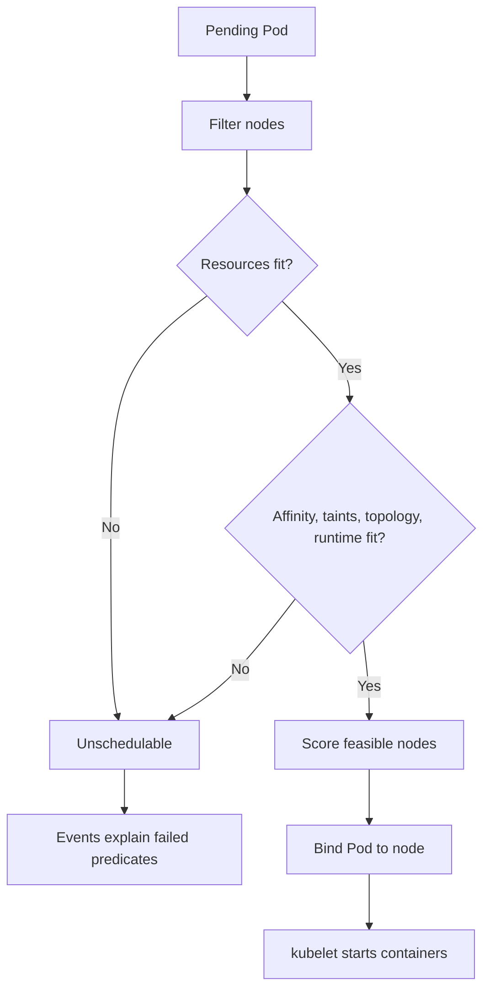
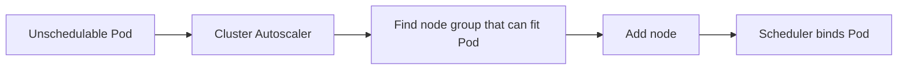
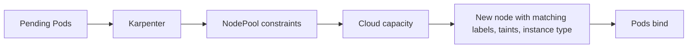

Purpose: Explain how Kubernetes places Pods, reserves resources, enforces limits, prioritizes workloads, spreads risk, and scales Pods or nodes under real production constraints.

# Scheduling, resources, requests, limits, QoS, and autoscaling

Scheduling starts after a controller from [03 Deployments ReplicaSets StatefulSets DaemonSets Jobs and CronJobs](/compendium/kubernetes/deployments-replicasets-statefulsets-daemonsets-jobs-and-cronjobs) creates a Pod using primitives from [02 Containers Pods and Workload Primitives](/compendium/kubernetes/containers-pods-and-workload-primitives). The scheduler filters nodes that cannot run the Pod, scores feasible nodes, binds the Pod, and then kubelet enforces cgroups, pulls images, mounts volumes, and reports status.



## Requests and limits

Requests are scheduling reservations. Limits are runtime ceilings. A Pod is scheduled based on the sum of its container requests, plus init container rules and Pod overhead when applicable.

```yaml
apiVersion: apps/v1
kind: Deployment
metadata:
  name: payments-api
spec:
  replicas: 4
  selector:
    matchLabels:
      app.kubernetes.io/name: payments-api
  template:
    metadata:
      labels:
        app.kubernetes.io/name: payments-api
    spec:
      containers:
        - name: api
          image: ghcr.io/example/payments-api:2.8.1
          resources:
            requests:
              cpu: 250m
              memory: 256Mi
            limits:
              memory: 512Mi
```

| Resource | Request behavior | Limit behavior | Production guidance |
| --- | --- | --- | --- |
| CPU | Used by scheduler and autoscalers as reserved CPU | Throttles CPU time when exceeded | Set requests from observed steady usage plus headroom. Avoid CPU limits for latency-sensitive services unless required. |
| Memory | Used by scheduler as reserved memory | Container can be killed with `OOMKilled` when exceeded | Always set memory requests and limits for most app workloads. |
| Ephemeral storage | Used by scheduler if requested | Pod can be evicted when exceeded | Set for log-heavy, cache-heavy, and batch workloads. |
| Extended resources | Advertised by device plugins | Usually request equals limit | Use for GPU, FPGA, DPU, and vendor-specific devices. |

CPU units:

- `1000m` equals one CPU core.
- `250m` equals one quarter of a core.
- CPU is compressible, so exceeding available CPU usually slows work rather than killing it.

Memory units:

- `Mi` and `Gi` are binary units.
- Memory is not compressible from Kubernetes' point of view. Exceeding a cgroup limit can kill the container.

## CPU throttling and OOMKilled

CPU throttling happens when a container wants more CPU than its limit allows. It can cause high latency while dashboards show low average CPU because throttling is time-based.

```bash
kubectl top pod -n prod
kubectl describe pod -n prod <pod>
kubectl get pod -n prod <pod> -o jsonpath='{.status.containerStatuses[*].lastState.terminated.reason}'
```

Signals to inspect:

- Container metrics: CPU usage, throttled periods, throttled seconds.
- App metrics: latency, queue depth, request timeout, worker backlog.
- Node metrics: CPU saturation and noisy neighbors.
- Deployment settings: CPU limit relative to request and peak demand.

`OOMKilled` means the kernel killed the container because it exceeded memory cgroup limits or node memory pressure selected it for eviction.

Debug sequence:

```bash
kubectl describe pod -n prod <pod>
kubectl logs -n prod <pod> -c <container> --previous
kubectl get events -n prod --field-selector involvedObject.name=<pod> --sort-by=.lastTimestamp
kubectl top pod -n prod <pod> --containers
```

Fixes:

- Reduce memory spikes in application code.
- Increase memory request and limit based on observed peak plus headroom.
- Split batch work into smaller chunks.
- Move caches to bounded sizes.
- Check sidecars and init containers, not just the main container.

## QoS classes

Kubernetes assigns Pod QoS from resource specifications. QoS affects eviction order under node pressure.

| QoS | Requirements | Eviction priority | Notes |
| --- | --- | --- | --- |
| Guaranteed | Every container has CPU and memory request equal to limit | Last among normal Pods | Strongest node-pressure protection but can reduce bin packing flexibility. |
| Burstable | At least one CPU or memory request is set, but not all requests equal limits | Middle | Common production default. |
| BestEffort | No CPU or memory requests or limits | First | Avoid for production workloads. |

Example Guaranteed Pod:

```yaml
resources:
  requests:
    cpu: "1"
    memory: 1Gi
  limits:
    cpu: "1"
    memory: 1Gi
```

Example Burstable Pod:

```yaml
resources:
  requests:
    cpu: 250m
    memory: 256Mi
  limits:
    memory: 512Mi
```

## LimitRange and ResourceQuota

LimitRange sets namespace defaults, minimums, maximums, and ratios. ResourceQuota caps aggregate usage in a namespace.

```yaml
apiVersion: v1
kind: LimitRange
metadata:
  name: default-container-limits
  namespace: prod
spec:
  limits:
    - type: Container
      defaultRequest:
        cpu: 100m
        memory: 128Mi
      default:
        memory: 256Mi
      min:
        cpu: 25m
        memory: 64Mi
      max:
        cpu: "2"
        memory: 4Gi
---
apiVersion: v1
kind: ResourceQuota
metadata:
  name: prod-compute
  namespace: prod
spec:
  hard:
    requests.cpu: "40"
    requests.memory: 80Gi
    limits.memory: 160Gi
    pods: "200"
```

Commands:

```bash
kubectl describe limitrange -n prod
kubectl describe resourcequota -n prod
kubectl get resourcequota -n prod -o yaml
```

Tradeoffs:

| Control | Benefit | Risk |
| --- | --- | --- |
| LimitRange defaults | Prevents BestEffort Pods by accident | Bad defaults hide missing app-specific sizing. |
| LimitRange max | Stops runaway specs | Blocks legitimate large jobs unless exceptions exist. |
| ResourceQuota | Protects shared clusters and budgets | Can block deploys if teams do not monitor quota headroom. |

## PriorityClass and preemption

PriorityClass tells the scheduler which Pods matter more. If no feasible node exists, a high-priority Pod may preempt lower-priority Pods.

```yaml
apiVersion: scheduling.k8s.io/v1
kind: PriorityClass
metadata:
  name: critical-api
value: 100000
globalDefault: false
preemptionPolicy: PreemptLowerPriority
description: "Critical user-facing APIs."
---
apiVersion: apps/v1
kind: Deployment
metadata:
  name: payments-api
spec:
  template:
    spec:
      priorityClassName: critical-api
```

Guidance:

- Use few priority tiers. Too many values become meaningless.
- Reserve very high priorities for cluster-critical and business-critical services.
- Preemption is not instant capacity creation. Victim Pods need termination time, PDBs may constrain disruption, and replacement Pods may cause more pressure.
- For nonpreempting priority, set `preemptionPolicy: Never` when queue order matters but eviction of lower-priority Pods is not acceptable.

## Node selectors and node affinity

`nodeSelector` is exact-match placement. Node affinity adds expressive rules and soft preferences.

```yaml
spec:
  nodeSelector:
    workload.example.com/pool: general
```

```yaml
spec:
  affinity:
    nodeAffinity:
      requiredDuringSchedulingIgnoredDuringExecution:
        nodeSelectorTerms:
          - matchExpressions:
              - key: topology.kubernetes.io/zone
                operator: In
                values: ["us-east-1a", "us-east-1b"]
      preferredDuringSchedulingIgnoredDuringExecution:
        - weight: 50
          preference:
            matchExpressions:
              - key: node.kubernetes.io/instance-type
                operator: In
                values: ["m7i.large"]
```

Rules:

- Required rules are hard filters at scheduling time.
- Preferred rules affect scoring only.
- `IgnoredDuringExecution` means Pods are not evicted if labels later change.
- Keep node labels governed. Placement based on ad hoc labels becomes fragile.

## Pod affinity and anti-affinity

Pod affinity places Pods near Pods with selected labels. Pod anti-affinity keeps Pods apart.

```yaml
spec:
  affinity:
    podAntiAffinity:
      requiredDuringSchedulingIgnoredDuringExecution:
        - labelSelector:
            matchLabels:
              app.kubernetes.io/name: payments-api
          topologyKey: kubernetes.io/hostname
```

Use cases:

| Rule | Use | Risk |
| --- | --- | --- |
| Required anti-affinity by hostname | Keep replicas off the same node | Can make rollouts unschedulable in small clusters. |
| Preferred anti-affinity by zone | Spread replicas across failure domains | Scheduler may co-locate if capacity is tight. |
| Pod affinity | Co-locate chatty services or cache clients | Can create hotspots and noisy neighbor coupling. |

Prefer topology spread constraints for many replica-spreading requirements because they are more direct and often easier to reason about.

## Taints and tolerations

Taints repel Pods. Tolerations allow Pods to schedule onto tainted nodes, but they do not force placement.

```bash
kubectl taint nodes node-1 dedicated=payments:NoSchedule
kubectl label node node-1 workload.example.com/pool=payments
```

```yaml
spec:
  tolerations:
    - key: dedicated
      operator: Equal
      value: payments
      effect: NoSchedule
  nodeSelector:
    workload.example.com/pool: payments
```

Effects:

| Effect | Meaning |
| --- | --- |
| `NoSchedule` | New Pods without toleration will not schedule there. |
| `PreferNoSchedule` | Scheduler tries to avoid the node. |
| `NoExecute` | Existing Pods without toleration can be evicted. |

Pattern: use taint plus toleration plus node affinity or selector for dedicated nodes. A toleration alone only permits placement; it does not request it.

## Topology spread constraints

Topology spread constraints distribute Pods across zones, nodes, racks, or custom domains.

```yaml
spec:
  topologySpreadConstraints:
    - maxSkew: 1
      topologyKey: topology.kubernetes.io/zone
      whenUnsatisfiable: DoNotSchedule
      labelSelector:
        matchLabels:
          app.kubernetes.io/name: payments-api
    - maxSkew: 1
      topologyKey: kubernetes.io/hostname
      whenUnsatisfiable: ScheduleAnyway
      labelSelector:
        matchLabels:
          app.kubernetes.io/name: payments-api
```

Guidance:

- Use zone spread for availability.
- Use hostname spread to reduce node failure blast radius.
- Use `DoNotSchedule` when imbalance is worse than delay.
- Use `ScheduleAnyway` when availability of a new replica matters more than perfect spread.
- Review constraints with autoscaler behavior. Strict spread can require node creation in specific zones.

## RuntimeClass and device plugins

RuntimeClass selects a container runtime handler. It is used for sandboxed runtimes, Windows nodes, Wasm runtimes, gVisor, Kata Containers, or other runtime-specific behavior.

```yaml
apiVersion: node.k8s.io/v1
kind: RuntimeClass
metadata:
  name: gvisor
handler: runsc
---
apiVersion: v1
kind: Pod
metadata:
  name: sandboxed-worker
spec:
  runtimeClassName: gvisor
  containers:
    - name: worker
      image: ghcr.io/example/worker:1.0.0
```

Device plugins advertise extended resources such as GPUs.

```yaml
resources:
  limits:
    nvidia.com/gpu: 1
```

Rules:

- Extended resources usually require limit and request to match.
- Nodes must run the vendor device plugin.
- Capacity planning must include driver rollout, runtime compatibility, scheduling labels, and quota.

## Horizontal Pod Autoscaler

HPA changes replica count based on metrics. It works well for stateless horizontally scalable workloads.

```yaml
apiVersion: autoscaling/v2
kind: HorizontalPodAutoscaler
metadata:
  name: payments-api
spec:
  scaleTargetRef:
    apiVersion: apps/v1
    kind: Deployment
    name: payments-api
  minReplicas: 4
  maxReplicas: 30
  metrics:
    - type: Resource
      resource:
        name: cpu
        target:
          type: Utilization
          averageUtilization: 65
  behavior:
    scaleUp:
      stabilizationWindowSeconds: 60
      policies:
        - type: Percent
          value: 100
          periodSeconds: 60
    scaleDown:
      stabilizationWindowSeconds: 300
      policies:
        - type: Percent
          value: 25
          periodSeconds: 60
```

Commands:

```bash
kubectl get hpa -n prod
kubectl describe hpa -n prod payments-api
kubectl top pod -n prod -l app.kubernetes.io/name=payments-api
```

HPA depends on requests for utilization metrics. If CPU request is too low, HPA can scale too aggressively. If it is too high, HPA may under-scale.

## Vertical Pod Autoscaler

VPA recommends or applies resource request changes based on observed usage. It is useful for right-sizing and for services with stable resource profiles.

```yaml
apiVersion: autoscaling.k8s.io/v1
kind: VerticalPodAutoscaler
metadata:
  name: payments-api
spec:
  targetRef:
    apiVersion: apps/v1
    kind: Deployment
    name: payments-api
  updatePolicy:
    updateMode: "Off"
```

Modes:

| Mode | Behavior | Use |
| --- | --- | --- |
| `Off` | Recommends only | Safest starting point and GitOps review input. |
| `Initial` | Sets requests only at Pod creation | Good for jobs or services where restarts are controlled elsewhere. |
| `Auto` or `Recreate` | Evicts Pods to apply recommendations | Requires PDBs, disruption tolerance, and review. |

HPA and VPA can conflict when both act on CPU. A common pattern is HPA for replicas and VPA in recommendation-only mode for requests.

## Cluster Autoscaler and Karpenter

Pod autoscalers change Pod count. Node autoscalers change cluster capacity.

| Autoscaler | Model | Strength | Watchouts |
| --- | --- | --- | --- |
| Cluster Autoscaler | Adjusts existing node groups based on unschedulable Pods and underutilized nodes | Mature and widely supported | Node group shapes must already exist. Scale-down can be blocked by PDBs, local storage, or system Pods. |
| Karpenter | Provisions right-sized nodes from flexible constraints | Fast, flexible bin packing and instance selection | Requires careful NodePool, disruption, consolidation, and cloud quota design. |

Cluster Autoscaler flow:



Karpenter overview:



Node autoscaling guidance:

- Requests must represent real need. Autoscalers cannot infer hidden memory or CPU requirements.
- Strict node affinity, topology spread, taints, PVC zone binding, RuntimeClass, and device requests constrain scale-up options.
- Reserve capacity for DaemonSets and system Pods.
- Configure scale-down disruption windows for stateful and latency-sensitive workloads.
- Monitor cloud quota, subnet IP exhaustion, image pull time, and node bootstrap time.

## Scheduling failure troubleshooting

Start from events. Kubernetes usually tells you which predicate failed.

```bash
kubectl get pod -n prod <pod> -o wide
kubectl describe pod -n prod <pod>
kubectl get events -n prod --sort-by=.lastTimestamp
kubectl get nodes --show-labels
kubectl describe node <node>
kubectl get priorityclass
kubectl get pdb -n prod
```

Common messages:

| Event text fragment | Likely cause | Next check |
| --- | --- | --- |
| `Insufficient cpu` | Requests do not fit free allocatable CPU | Node allocatable, DaemonSet overhead, pending Pods, autoscaler scale-up. |
| `Insufficient memory` | Requests do not fit free allocatable memory | Memory requests, node pools, quota, VPA recommendations. |
| `had untolerated taint` | Pod lacks toleration for tainted node | Taints, tolerations, dedicated node policy. |
| `didn't match Pod's node affinity/selector` | Hard node placement rule excludes nodes | Labels, nodeSelector, required node affinity. |
| `didn't match pod affinity/anti-affinity` | Required Pod placement rule cannot be satisfied | Existing Pod labels, topologyKey, replica count, zones. |
| `max node group size reached` | Node autoscaler cannot add nodes | Node group limits, cloud quota, Karpenter NodePool limits. |
| `preemption is not helpful` | Evicting lower-priority Pods would still not fit | Hard constraints, resource shape, volume zone, device availability. |
| `pod has unbound immediate PersistentVolumeClaims` | Storage binding blocks scheduling | PVC, StorageClass binding mode, zone constraints. |

## Capacity planning

Capacity planning links application SLOs, workload requests, replica counts, rollout surge, disruption budgets, and node pool shapes.

Useful formulas:

```text
steady_cpu_request = replicas * per_pod_cpu_request
steady_memory_request = replicas * per_pod_memory_request
rollout_peak_pods = replicas + maxSurge
node_reserved_capacity = kube_reserved + system_reserved + daemonset_requests
usable_node_capacity = allocatable - daemonset_requests - safety_headroom
```

Checklist:

- Measure p50, p95, and peak CPU and memory per workload.
- Separate request sizing from limit sizing.
- Include sidecars, init containers, and DaemonSets.
- Include rollout surge, HPA max replicas, CronJob overlap, and batch windows.
- Keep node pools shaped for workload resource ratios. CPU-heavy and memory-heavy workloads should not always share the same pool.
- Account for zones. A three-zone service should survive losing one zone without saturating the remaining zones.
- Account for image pull, cold start, and warmup time in scale-up targets.
- Track quota headroom for namespace ResourceQuota and cloud provider limits.

## Common mistakes

| Mistake | Symptom | Correction |
| --- | --- | --- |
| No requests | BestEffort Pods, bad bin packing, autoscaler blind spots | Set requests for every production container. |
| CPU limit too low | Latency spikes and throttling under load | Remove CPU limit or raise it after measuring throttling. |
| Memory limit too close to steady usage | Periodic OOMKilled during bursts | Increase limit or reduce peak memory behavior. |
| Hard anti-affinity in small clusters | Rollouts stuck Pending | Use preferred anti-affinity or topology spread with realistic capacity. |
| Toleration without selector | Workload can land on dedicated nodes accidentally | Pair toleration with node affinity or selector. |
| HPA target without correct requests | Over-scaling or under-scaling | Calibrate requests before trusting utilization. |
| VPA auto mode on fragile services | Evictions cause incidents | Start with recommendation-only mode. |
| Ignoring DaemonSet overhead | New nodes cannot fit expected Pods | Subtract per-node agents from allocatable capacity. |

## Review checklist

- Every production container has CPU and memory requests.
- Memory limits match observed peaks and failure tolerance.
- CPU limits are justified for the workload class.
- QoS class is intentional.
- LimitRange and ResourceQuota enforce guardrails without hiding bad sizing.
- PriorityClass and preemption policy are limited to clear service tiers.
- Node selectors, affinity, taints, tolerations, topology spread, RuntimeClass, and device requests are reviewed together.
- HPA max replicas and rollout `maxSurge` fit cluster and quota capacity.
- VPA mode is compatible with disruption tolerance.
- Cluster Autoscaler or Karpenter has node shapes that can satisfy real pending Pods.
- Capacity models include DaemonSets, system reservations, zones, batch windows, and cold-start time.
