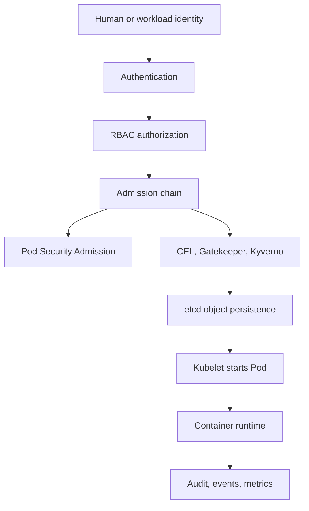
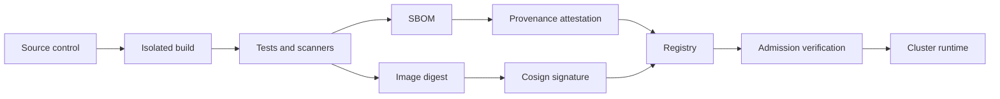

Purpose: explain how Kubernetes security controls compose across identity, admission, pod hardening, secrets, and software supply chain enforcement.

# Security, RBAC, Pod Security Admission, and Supply Chain

This note expands [Kubernetes](/compendium/kubernetes/kubernetes), [01 Kubernetes Mental Model and Architecture](/compendium/kubernetes/kubernetes-mental-model-and-architecture), [06 Configuration Secrets ServiceAccounts and Runtime Identity](/compendium/kubernetes/configuration-secrets-serviceaccounts-and-runtime-identity), and [09 Security RBAC Pod Security Admission and Supply Chain](/compendium/kubernetes/security-rbac-pod-security-admission-and-supply-chain) with production security guidance. Kubernetes security is layered. RBAC answers who can call the API. Admission answers what objects are allowed. Pod security settings reduce container escape and privilege escalation risk. Supply chain controls reduce the chance that unsafe images reach the cluster. None of these layers is enough alone.



## Security model

| Layer | Main question | Kubernetes mechanism | Failure mode |
| --- | --- | --- | --- |
| Authentication | Who is calling the API | Client certs, OIDC, ServiceAccount tokens, webhook auth | Shared credentials, long lived tokens, weak issuer validation |
| Authorization | Is the caller allowed | RBAC Roles, ClusterRoles, bindings | Overbroad verbs, wildcard resources, cluster admin bindings |
| Admission | Is the requested object acceptable | Built in admission, ValidatingAdmissionPolicy, mutating webhooks, validating webhooks | Policy bypass by namespace gaps, fail open webhooks |
| Pod sandboxing | What can a container do on a node | SecurityContext, seccomp, AppArmor, SELinux, capabilities | Privileged containers, host namespaces, writable root filesystems |
| Supply chain | Can the image be trusted | Registry policy, image scanning, SBOMs, signatures, provenance | Mutable tags, unsigned images, vulnerable bases |
| Secrets | Can sensitive data be read | Secret RBAC, encryption at rest, external secrets, short lived tokens | Namespace readers can exfiltrate secrets |
| Tenancy | Can one tenant affect another | Namespace isolation, quotas, network policy, node isolation | Soft isolation mistaken for hard isolation |

## RBAC primitives

RBAC is additive. There is no deny rule in native RBAC. A subject receives the union of all permissions granted by all matching bindings.

| Object | Scope | Grants permissions for | Binds to |
| --- | --- | --- | --- |
| `Role` | Namespace | Namespaced resources inside one namespace | `RoleBinding` |
| `ClusterRole` | Cluster | Cluster resources, or reusable namespaced permissions | `RoleBinding` or `ClusterRoleBinding` |
| `RoleBinding` | Namespace | Subjects in a namespace context | `Role` or `ClusterRole` |
| `ClusterRoleBinding` | Cluster | Subjects across the whole cluster | `ClusterRole` |

Minimal namespace reader:

```yaml
apiVersion: rbac.authorization.k8s.io/v1
kind: Role
metadata:
  name: pod-reader
  namespace: app-prod
rules:
  - apiGroups: [""]
    resources: ["pods", "pods/log"]
    verbs: ["get", "list", "watch"]
---
apiVersion: rbac.authorization.k8s.io/v1
kind: RoleBinding
metadata:
  name: pod-reader-for-oncall
  namespace: app-prod
subjects:
  - kind: Group
    name: platform-oncall
    apiGroup: rbac.authorization.k8s.io
roleRef:
  kind: Role
  name: pod-reader
  apiGroup: rbac.authorization.k8s.io
```

Reusable ClusterRole bound only inside one namespace:

```yaml
apiVersion: rbac.authorization.k8s.io/v1
kind: ClusterRole
metadata:
  name: workload-debug-reader
rules:
  - apiGroups: [""]
    resources: ["pods", "pods/log", "events", "services", "endpoints"]
    verbs: ["get", "list", "watch"]
  - apiGroups: ["apps"]
    resources: ["deployments", "replicasets", "statefulsets", "daemonsets"]
    verbs: ["get", "list", "watch"]
---
apiVersion: rbac.authorization.k8s.io/v1
kind: RoleBinding
metadata:
  name: workload-debug-reader
  namespace: app-prod
subjects:
  - kind: ServiceAccount
    name: diagnostics-bot
    namespace: platform-tools
roleRef:
  kind: ClusterRole
  name: workload-debug-reader
  apiGroup: rbac.authorization.k8s.io
```

High risk permissions:

| Permission | Why it is dangerous | Safer pattern |
| --- | --- | --- |
| `*` on `*` | Equivalent to unbounded future access as APIs are added | Name exact resources and verbs |
| `create pods/exec` | Remote command execution into containers | Restrict to break glass groups, audit every use |
| `create pods/ephemeralcontainers` | Can inject debug containers into Pods | Restrict to incident responders |
| `get secrets` | Secret values are exposed through the API | Use narrow names or external secret access |
| `create pods` | Can run arbitrary workloads under allowed ServiceAccounts | Combine with PSA and admission policy |
| `impersonate users/groups/serviceaccounts` | Can become another identity | Restrict to control plane automation |
| `bind` and `escalate` on RBAC resources | Can grant privileges the caller does not already have | Avoid outside trusted platform controllers |
| `update validatingwebhookconfigurations` | Can disable admission controls | Platform admin only |
| `update nodes` | Can disrupt scheduling or trust boundaries | Cluster operator only |

## ClusterRoles and aggregation

Aggregated ClusterRoles let Kubernetes combine labeled ClusterRoles into a parent ClusterRole. This is how built in roles such as `admin`, `edit`, and `view` can gain permissions for custom resources.

```yaml
apiVersion: rbac.authorization.k8s.io/v1
kind: ClusterRole
metadata:
  name: widgets-view
  labels:
    rbac.authorization.k8s.io/aggregate-to-view: "true"
rules:
  - apiGroups: ["apps.example.com"]
    resources: ["widgets"]
    verbs: ["get", "list", "watch"]
```

Aggregation tradeoffs:

| Choice | Benefit | Risk |
| --- | --- | --- |
| Aggregate CRD read permissions to `view` | Normal readers can inspect new resources | Sensitive CRD fields may become broadly visible |
| Aggregate write permissions to `edit` | App teams can operate CRDs with familiar roles | `edit` may become more powerful than intended |
| Avoid aggregation and create explicit roles | Clear least privilege | More bindings to maintain |

Review every aggregated role as part of CRD review. A CRD that stores credentials, connection strings, policy decisions, or tenant state should not be blindly aggregated into `view`.

## ServiceAccount permissions

Pods authenticate to the API as a ServiceAccount. If `serviceAccountName` is omitted, Pods use the namespace `default` ServiceAccount.

```yaml
apiVersion: v1
kind: ServiceAccount
metadata:
  name: invoice-worker
  namespace: payments
automountServiceAccountToken: false
---
apiVersion: apps/v1
kind: Deployment
metadata:
  name: invoice-worker
  namespace: payments
spec:
  replicas: 2
  selector:
    matchLabels:
      app: invoice-worker
  template:
    metadata:
      labels:
        app: invoice-worker
    spec:
      serviceAccountName: invoice-worker
      automountServiceAccountToken: false
      containers:
        - name: worker
          image: registry.example.com/payments/invoice-worker@sha256:1111111111111111111111111111111111111111111111111111111111111111
```

Production guidance:

| Practice | Reason |
| --- | --- |
| Create one ServiceAccount per workload | Avoid shared blast radius |
| Set `automountServiceAccountToken: false` unless the app calls the API | Reduces token theft impact |
| Bind ServiceAccounts by namespace and name | Prevents broad group grants |
| Prefer short lived projected tokens | Reduces long lived credential exposure |
| Avoid mounting cloud provider credentials directly | Prefer workload identity integrations |
| Audit default ServiceAccount bindings | Many accidental privileges start there |

Useful checks:

```bash
kubectl auth can-i get pods --as=system:serviceaccount:payments:invoice-worker -n payments
kubectl auth can-i create pods/exec --as=system:serviceaccount:payments:invoice-worker -n payments
kubectl get rolebinding,clusterrolebinding -A -o wide | rg invoice-worker
kubectl describe serviceaccount invoice-worker -n payments
```

## Pod Security Standards

Pod Security Standards define three policy profiles: `privileged`, `baseline`, and `restricted`.

| Profile | Intent | Common use |
| --- | --- | --- |
| `privileged` | Allows almost everything | System namespaces, CNI, CSI, node agents |
| `baseline` | Blocks known privilege escalation paths while preserving common workloads | Transitional default for app namespaces |
| `restricted` | Strongest built in pod hardening profile | Production application namespaces |

Pod Security Admission is the built in admission controller that enforces Pod Security Standards. It became stable in Kubernetes v1.25. PodSecurityPolicy was removed in Kubernetes v1.25, so new clusters should use Pod Security Admission plus policy engines when built in standards are not expressive enough.

Namespace labels:

```yaml
apiVersion: v1
kind: Namespace
metadata:
  name: payments
  labels:
    pod-security.kubernetes.io/enforce: restricted
    pod-security.kubernetes.io/enforce-version: v1.30
    pod-security.kubernetes.io/audit: restricted
    pod-security.kubernetes.io/audit-version: v1.30
    pod-security.kubernetes.io/warn: restricted
    pod-security.kubernetes.io/warn-version: v1.30
```

Rollout pattern:

| Phase | Labels | Goal |
| --- | --- | --- |
| Discover | `warn=restricted`, `audit=restricted` | Show users and audit logs what would fail |
| Enforce baseline | `enforce=baseline`, `warn=restricted` | Block obvious host and privileged escapes |
| Enforce restricted | `enforce=restricted` | Require hardened defaults for app namespaces |
| Exception handling | Isolated namespace with explicit owner and expiry | Keep system or legacy exceptions visible |

## SecurityContext hardening

Restricted application Pod:

```yaml
apiVersion: apps/v1
kind: Deployment
metadata:
  name: hardened-api
  namespace: payments
spec:
  replicas: 3
  selector:
    matchLabels:
      app: hardened-api
  template:
    metadata:
      labels:
        app: hardened-api
    spec:
      serviceAccountName: hardened-api
      automountServiceAccountToken: false
      securityContext:
        runAsNonRoot: true
        runAsUser: 10001
        runAsGroup: 10001
        fsGroup: 10001
        seccompProfile:
          type: RuntimeDefault
      containers:
        - name: api
          image: registry.example.com/payments/api@sha256:2222222222222222222222222222222222222222222222222222222222222222
          ports:
            - containerPort: 8080
          securityContext:
            allowPrivilegeEscalation: false
            readOnlyRootFilesystem: true
            capabilities:
              drop: ["ALL"]
          volumeMounts:
            - name: tmp
              mountPath: /tmp
      volumes:
        - name: tmp
          emptyDir: {}
```

Key settings:

| Setting | Production default | Why |
| --- | --- | --- |
| `runAsNonRoot` | `true` | Prevents root user execution when image metadata is safe |
| `runAsUser` | Explicit high UID | Avoids image default surprises |
| `allowPrivilegeEscalation` | `false` | Blocks setuid and privilege escalation paths |
| `capabilities.drop` | `["ALL"]` | Removes Linux capabilities not needed by normal apps |
| `seccompProfile.type` | `RuntimeDefault` | Blocks many dangerous syscalls |
| `readOnlyRootFilesystem` | `true` | Limits filesystem tampering |
| `privileged` | `false` | Avoids host level access |
| `hostNetwork`, `hostPID`, `hostIPC` | `false` | Keeps workload out of host namespaces |

Capability examples:

| Need | Avoid | Safer option |
| --- | --- | --- |
| Bind to port 80 | Add `NET_BIND_SERVICE` by habit | Listen on 8080 and map Service port 80 |
| Packet capture | Privileged container | Dedicated debug namespace and short lived tooling |
| Filesystem ownership fix | Run as root forever | InitContainer with narrow permission, then nonroot app |

## Seccomp, AppArmor, and SELinux

| Control | What it governs | Kubernetes usage | Notes |
| --- | --- | --- | --- |
| seccomp | Linux syscalls | `securityContext.seccompProfile` | `RuntimeDefault` is the common baseline |
| AppArmor | Linux program access profile | Localhost profiles through annotations or security fields depending on version | Node profile availability matters |
| SELinux | Mandatory access control labels | `seLinuxOptions` | Strong when platform manages labels correctly |

Overview:

```yaml
securityContext:
  seccompProfile:
    type: RuntimeDefault
```

SELinux is most common on distributions where the node OS and container runtime are configured together. AppArmor is common on Ubuntu based nodes. Do not enable custom profiles by copy and paste. Roll them out on a node pool where profile installation, drift detection, and workload scheduling are controlled.

## Admission controllers and policy engines

Native admission controls run after authorization and before persistence. They can reject, mutate, or validate API objects depending on the controller.

Important categories:

| Control | Purpose | Examples |
| --- | --- | --- |
| Built in admission | Core Kubernetes behavior | Pod Security Admission, ResourceQuota, LimitRanger, NamespaceLifecycle |
| Mutating webhook | Defaults objects before validation | Sidecar injection, label injection |
| Validating webhook | Rejects objects that violate policy | OPA Gatekeeper, Kyverno validate rules |
| ValidatingAdmissionPolicy | Native CEL based validation | Simple policy without external webhook runtime |

ValidatingAdmissionPolicy with CEL:

```yaml
apiVersion: admissionregistration.k8s.io/v1
kind: ValidatingAdmissionPolicy
metadata:
  name: require-image-digest
spec:
  failurePolicy: Fail
  matchConstraints:
    resourceRules:
      - apiGroups: [""]
        apiVersions: ["v1"]
        operations: ["CREATE", "UPDATE"]
        resources: ["pods"]
  validations:
    - expression: "object.spec.containers.all(c, c.image.contains('@sha256:'))"
      message: "containers must use immutable image digests"
---
apiVersion: admissionregistration.k8s.io/v1
kind: ValidatingAdmissionPolicyBinding
metadata:
  name: require-image-digest
spec:
  policyName: require-image-digest
  validationActions: ["Deny"]
```

Gatekeeper constraint example:

```yaml
apiVersion: constraints.gatekeeper.sh/v1beta1
kind: K8sRequiredLabels
metadata:
  name: require-owner-label
spec:
  match:
    kinds:
      - apiGroups: [""]
        kinds: ["Namespace"]
  parameters:
    labels:
      - key: owner
```

Kyverno image policy example:

```yaml
apiVersion: kyverno.io/v1
kind: ClusterPolicy
metadata:
  name: require-signed-images
spec:
  validationFailureAction: Enforce
  background: true
  rules:
    - name: verify-cosign-signature
      match:
        any:
          - resources:
              kinds: ["Pod"]
      verifyImages:
        - imageReferences:
            - "registry.example.com/*"
          attestors:
            - entries:
                - keyless:
                    issuer: "https://token.actions.githubusercontent.com"
                    subject: "https://github.com/example/*"
```

Policy engine tradeoffs:

| Approach | Strength | Cost |
| --- | --- | --- |
| Pod Security Admission | Built in, stable, simple namespace labels | Limited to Pod Security Standards |
| ValidatingAdmissionPolicy with CEL | No external webhook service for simple checks | CEL is not ideal for complex inventory or mutation |
| OPA Gatekeeper | Strong constraint model and audit | Rego learning curve and webhook operations |
| Kyverno | Kubernetes native YAML policy, mutation, image verification | Policy complexity can grow quickly |
| Custom webhook | Full flexibility | Highest operational and safety burden |

## Image provenance and supply chain

Supply chain security should produce evidence at build time and enforce evidence at deploy time.



Core practices:

| Practice | Why it matters | Enforcement point |
| --- | --- | --- |
| Pin images by digest | Tags are mutable | CI manifests and admission |
| Scan images | Finds known vulnerabilities and malware indicators | CI, registry, admission |
| Generate SBOMs | Gives dependency inventory for response | CI artifact store and registry |
| Sign images with Cosign | Links image digest to trusted identity | Admission policy |
| Attach provenance | Shows builder, source, and workflow | Admission and release review |
| Restrict registries | Prevents unknown image sources | Admission policy and runtime config |
| Rebuild base images | Reduces stale CVE exposure | CI cadence |

Cosign commands:

```bash
cosign sign --key cosign.key registry.example.com/payments/api@sha256:2222222222222222222222222222222222222222222222222222222222222222
cosign verify --key cosign.pub registry.example.com/payments/api@sha256:2222222222222222222222222222222222222222222222222222222222222222
cosign attest --predicate sbom.spdx.json --type spdxjson registry.example.com/payments/api@sha256:2222222222222222222222222222222222222222222222222222222222222222
```

Registry policy:

| Rule | Recommended default |
| --- | --- |
| Allowed registries | Private registry plus approved public mirrors |
| Tags | Disallow mutable tags in production |
| Latest | Disallow |
| Signatures | Require for first party images |
| Vulnerability threshold | Block exploitable critical findings, warn on lower risk with SLA |
| SBOM | Require for promoted production images |
| Build identity | Require trusted CI issuer and repository subject |

## Secrets security

Kubernetes Secrets are base64 encoded API objects, not a complete secret management system. Anyone with `get secrets` in a namespace can retrieve values.

Production controls:

| Control | Reason |
| --- | --- |
| Enable encryption at rest for Secrets in etcd | Reduces impact of raw datastore exposure |
| Restrict Secret RBAC separately from ConfigMaps | ConfigMap read is often broader |
| Avoid putting secrets in environment variables when possible | Environment values can leak through process inspection and dumps |
| Mount secrets as files with narrow paths | Easier rotation and narrower exposure |
| Use external secret operators carefully | They create Kubernetes Secrets unless configured otherwise |
| Rotate after incident and after broad access grants | Secrets are often copied by workloads and humans |
| Avoid secret values in annotations, labels, and events | Metadata is broadly visible |

Secret volume example:

```yaml
apiVersion: v1
kind: Pod
metadata:
  name: secret-consumer
  namespace: payments
spec:
  containers:
    - name: app
      image: registry.example.com/payments/app@sha256:3333333333333333333333333333333333333333333333333333333333333333
      volumeMounts:
        - name: db-password
          mountPath: /var/run/secrets/db
          readOnly: true
  volumes:
    - name: db-password
      secret:
        secretName: db-password
        defaultMode: 0400
```

## Multi-tenant isolation limits

Namespaces are administrative boundaries, not hard security boundaries. Multi-tenant Kubernetes can be practical, but only when the threat model matches the controls.

| Concern | Namespace only | Stronger control |
| --- | --- | --- |
| API access | RBAC per namespace | Separate clusters for hostile tenants |
| Network access | NetworkPolicy if CNI enforces it | Default deny, egress controls, service mesh policy |
| Node kernel sharing | Shared nodes | Dedicated node pools or clusters |
| Resource contention | Quotas and limits | Priority classes, separate node pools |
| Secret exposure | Namespace RBAC | External secret boundaries and separate control planes |
| Admission exceptions | Labels per namespace | Central policy with exception review |

Use separate clusters for untrusted tenants, regulated workloads that require hard boundaries, or workloads that need privileged host access. Use namespaces for teams with shared trust, internal environments, and soft isolation.

## Troubleshooting security denials

RBAC Forbidden:

```bash
kubectl auth can-i list pods -n payments
kubectl auth can-i list pods -n payments --as=system:serviceaccount:payments:invoice-worker
kubectl describe rolebinding -n payments
kubectl describe clusterrolebinding
kubectl get events -n payments --sort-by=.lastTimestamp
```

Admission denied:

```bash
kubectl apply -f deployment.yaml --dry-run=server
kubectl describe namespace payments
kubectl get validatingadmissionpolicy,validatingadmissionpolicybinding
kubectl get validatingwebhookconfiguration,mutatingwebhookconfiguration
kubectl get events -A --field-selector reason=FailedCreate
```

Pod security denied:

1. Read the rejection message and identify the violated field.
2. Check namespace labels for `pod-security.kubernetes.io/enforce`.
3. Compare Pod spec against the target profile.
4. Remove privileged, host namespace, host path, added capabilities, root user, or missing seccomp settings.
5. If the workload is a node agent, move it to an explicit privileged namespace with owner review.

## Common mistakes

| Mistake | Consequence | Fix |
| --- | --- | --- |
| Binding `cluster-admin` to CI | CI compromise becomes cluster compromise | Create narrow deploy roles per namespace |
| Using the `default` ServiceAccount | Accidental shared identity | Create named ServiceAccounts per workload |
| Leaving token automount enabled | Tokens appear in every Pod | Disable by default and opt in |
| Treating `view` as always safe | Some CRDs expose sensitive data | Review aggregation labels and CRD schemas |
| Relying only on image scanning | Signed vulnerable images can still pass | Combine scanning, signing, provenance, and runtime monitoring |
| Enforcing `restricted` without dry run | Workloads fail during rollout | Start with warn and audit labels |
| Allowing mutable tags | Rollbacks and audits become ambiguous | Require image digests |
| Running debug tools as privileged | Debug path becomes escape path | Use ephemeral containers with controlled RBAC |

## Security review checklist

- [ ] Namespace has Pod Security Admission labels with explicit version.
- [ ] Workloads run as nonroot with `allowPrivilegeEscalation: false`.
- [ ] Containers drop all Linux capabilities unless a reviewed exception exists.
- [ ] `seccompProfile.type: RuntimeDefault` is set at Pod or container level.
- [ ] Root filesystem is read only or the write paths are explicitly mounted.
- [ ] ServiceAccount is workload specific.
- [ ] ServiceAccount token automount is disabled unless required.
- [ ] RBAC grants exact verbs and resources.
- [ ] No wildcard RBAC exists outside platform controlled roles.
- [ ] No app workload uses `hostNetwork`, `hostPID`, `hostIPC`, or privileged mode.
- [ ] Production images are pinned by digest.
- [ ] Image registry is approved.
- [ ] Image signature, SBOM, and vulnerability scan evidence exist.
- [ ] Secrets are not present in labels, annotations, command args, or logs.
- [ ] Admission policy failures are monitored and routed to owning teams.

