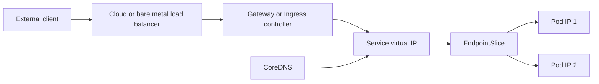
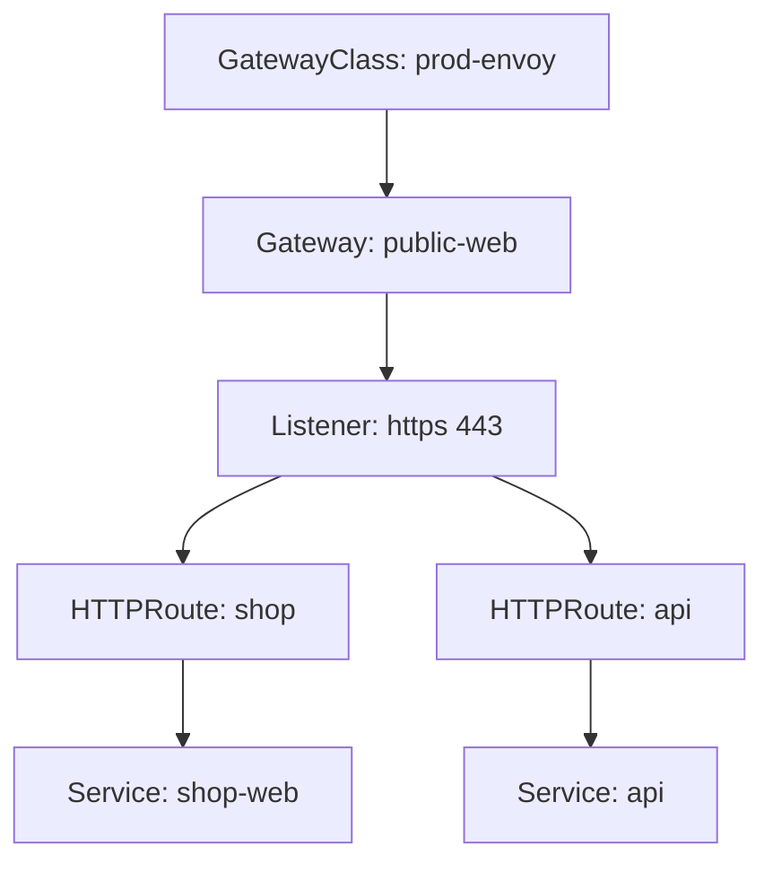
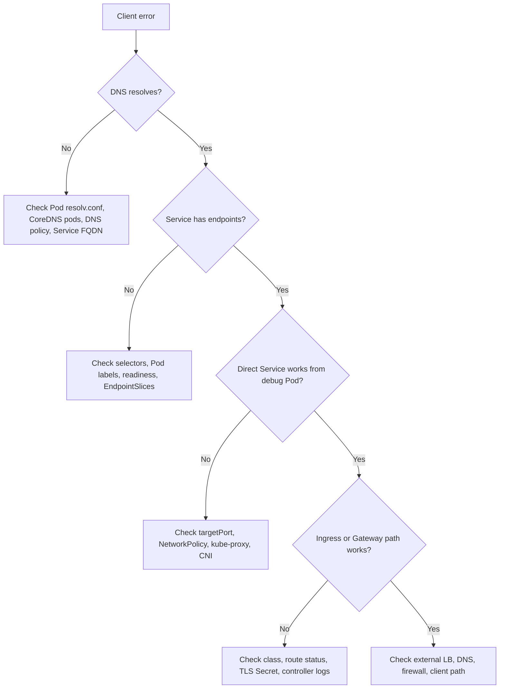

Purpose: explain how Kubernetes exposes Pods through Services, DNS, Ingress, and Gateway API, and how traffic actually moves from clients to endpoints in production clusters.

Related notes: [Kubernetes](/compendium/kubernetes/kubernetes), [00 Kubernetes Mastery Roadmap](/compendium/kubernetes/kubernetes-mastery-roadmap), [05 Kubernetes Networking CNI NetworkPolicy and Service Mesh](/compendium/kubernetes/kubernetes-networking-cni-networkpolicy-and-service-mesh), <span className="compendium-external-reference" title="Vault-only reference">Networking</span>, [04 Services DNS Ingress Gateway API and Traffic Routing](/compendium/kubernetes/services-dns-ingress-gateway-api-and-traffic-routing), [04 Services DNS Ingress Gateway API and Traffic Routing](/compendium/kubernetes/services-dns-ingress-gateway-api-and-traffic-routing), [04 Services DNS Ingress Gateway API and Traffic Routing](/compendium/kubernetes/services-dns-ingress-gateway-api-and-traffic-routing).

## Mental model

Kubernetes networking separates unstable workload identity from stable traffic identity. Pods are disposable and receive Pod IPs from the cluster network. Services provide stable virtual addresses and DNS names. Ingress and Gateway API attach HTTP routing, TLS termination, and external entry points on top of Services.



Key objects:

| Object | Scope | Primary job | Stable identity | Routes to |
| --- | --- | --- | --- | --- |
| Pod | Namespaced | Run containers | No | Container ports |
| Service | Namespaced | Stable virtual IP and DNS name | Yes | EndpointSlices |
| EndpointSlice | Namespaced | Scalable endpoint inventory | No | Pod IPs or external endpoints |
| Ingress | Namespaced | HTTP host and path routing | Partly | Services |
| IngressClass | Cluster | Select an Ingress controller | Yes | Controller implementation |
| GatewayClass | Cluster | Select a Gateway controller | Yes | Gateway controller |
| Gateway | Namespaced | Listener and infrastructure attachment | Yes | Routes |
| HTTPRoute | Namespaced | HTTP routing policy | Yes | Services or backend refs |

## Pod networking model

Kubernetes assumes a flat Pod network:

1. Every Pod gets its own IP address.
2. Pods can communicate with other Pods without NAT, subject to [NetworkPolicy](/compendium/kubernetes/kubernetes-networking-cni-networkpolicy-and-service-mesh), routing, firewalls, and CNI behavior.
3. Nodes can communicate with Pods.
4. Containers inside the same Pod share one network namespace, one IP, and one port space.

This model is implemented by the cluster CNI plugin. Kubernetes does not define the underlay details. Calico, Cilium, Flannel, cloud CNIs, and other plugins can implement Pod routing differently while preserving the Kubernetes contract.

Common implications:

| Design point | Practical meaning |
| --- | --- |
| Pod IPs are ephemeral | Do not put Pod IPs in clients, firewalls, or config files. Use Services or higher level routing. |
| One Pod IP per Pod | Containers in the same Pod call each other on `localhost`, not through a Service. |
| Same port space inside a Pod | Two containers in the same Pod cannot both listen on `0.0.0.0:8080`. |
| Pod reachability depends on CNI | Routing bugs often live below Kubernetes objects. Check CNI health when Services look correct. |

## Service networking

A Service maps a stable virtual identity to a changing backend set. The selector identifies Pods. The endpoints controller creates EndpointSlices from matching Pods that are Ready, unless readiness is explicitly bypassed.

```yaml
apiVersion: v1
kind: Service
metadata:
  name: web
  namespace: apps
spec:
  type: ClusterIP
  selector:
    app.kubernetes.io/name: web
  ports:
    - name: http
      port: 80
      targetPort: http
---
apiVersion: apps/v1
kind: Deployment
metadata:
  name: web
  namespace: apps
spec:
  replicas: 3
  selector:
    matchLabels:
      app.kubernetes.io/name: web
  template:
    metadata:
      labels:
        app.kubernetes.io/name: web
    spec:
      containers:
        - name: web
          image: nginx:1.27
          ports:
            - name: http
              containerPort: 80
          readinessProbe:
            httpGet:
              path: /
              port: http
```

### Service types

| Type | Use when | How it works | Tradeoffs |
| --- | --- | --- | --- |
| ClusterIP | Internal stable access inside the cluster | Allocates a virtual IP from the Service CIDR | Default and usually best for east west traffic. Not reachable directly from outside. |
| NodePort | Simple node level exposure or bare metal bootstrap | Opens a port on every node and forwards to the Service | Easy to debug, but exposes every node and consumes scarce port range. |
| LoadBalancer | Cloud or load balancer integrated external access | Provisions an external load balancer that forwards to NodePort or direct Pod backends | Operationally clean, but provider behavior, cost, source IP, and health checks vary. |
| ExternalName | DNS alias to an external name | Returns a CNAME record, no proxying | Useful for migration aliases. No ports, selectors, health checks, or Kubernetes load balancing. |
| Headless | Stateful discovery or direct endpoint discovery | Uses `clusterIP: None` and returns endpoint records | Clients must handle endpoint churn and load balancing. |

### ClusterIP

ClusterIP is the default Service type. kube-proxy or an eBPF replacement programs each node so traffic sent to the virtual Service IP is translated or routed to a backend endpoint.

```bash
kubectl -n apps get svc web -o wide
kubectl -n apps get endpointslice -l kubernetes.io/service-name=web
kubectl -n apps run curl --rm -it --image=curlimages/curl:8.8.0 --restart=Never -- \
  curl -sv http://web.apps.svc.cluster.local/
```

Production guidance:

| Practice | Reason |
| --- | --- |
| Use named `targetPort` values | Keeps Service manifests stable when container port numbers change. |
| Add readiness probes | Prevents traffic to Pods that have started but are not serving correctly. |
| Keep selectors precise | Broad selectors send traffic to the wrong Pods. |
| Avoid clients depending on ClusterIP literals | DNS names survive Service recreation patterns better than copied IP values. |

### NodePort

NodePort exposes a Service on each node at a static port, usually in the `30000` to `32767` range.

```yaml
apiVersion: v1
kind: Service
metadata:
  name: web-nodeport
  namespace: apps
spec:
  type: NodePort
  selector:
    app.kubernetes.io/name: web
  ports:
    - name: http
      port: 80
      targetPort: http
      nodePort: 30080
```

```bash
kubectl -n apps get svc web-nodeport
kubectl get nodes -o wide
curl -sv http://NODE_IP:30080/
```

Use NodePort sparingly in production. It is valuable as a building block for some load balancer implementations and for simple lab exposure, but it increases the exposed surface of every node.

### LoadBalancer

LoadBalancer asks the infrastructure provider or a bare metal controller such as MetalLB to create an external entry point.

```yaml
apiVersion: v1
kind: Service
metadata:
  name: web-public
  namespace: apps
  annotations:
    service.beta.kubernetes.io/aws-load-balancer-type: external
spec:
  type: LoadBalancer
  externalTrafficPolicy: Local
  selector:
    app.kubernetes.io/name: web
  ports:
    - name: http
      port: 80
      targetPort: http
```

Tradeoffs:

| Setting | Benefit | Cost |
| --- | --- | --- |
| `externalTrafficPolicy: Cluster` | More even backend spread and fewer node health constraints | Client source IP may be hidden behind node SNAT. |
| `externalTrafficPolicy: Local` | Preserves client source IP on many platforms | Traffic only lands on nodes with local ready endpoints. Load balancer health checks matter more. |
| Provider annotations | Access to cloud specific behavior | Portability drops and annotations can drift across cloud versions. |

### ExternalName

ExternalName is a DNS alias. It does not create EndpointSlices or a proxy path.

```yaml
apiVersion: v1
kind: Service
metadata:
  name: legacy-payments
  namespace: apps
spec:
  type: ExternalName
  externalName: payments.internal.example.com
```

```bash
kubectl -n apps run dns --rm -it --image=busybox:1.36 --restart=Never -- \
  nslookup legacy-payments.apps.svc.cluster.local
```

Avoid ExternalName when you need Kubernetes health checks, traffic splitting, TLS identity mapping, or transparent failover.

### Headless Services

Headless Services set `clusterIP: None`. DNS returns endpoint records instead of a single virtual IP. They are common with StatefulSets, service discovery protocols, and direct client side load balancing.

```yaml
apiVersion: v1
kind: Service
metadata:
  name: postgres
  namespace: data
spec:
  clusterIP: None
  selector:
    app.kubernetes.io/name: postgres
  ports:
    - name: postgres
      port: 5432
      targetPort: postgres
```

For a StatefulSet, stable Pod DNS names look like:

```text
postgres-0.postgres.data.svc.cluster.local
postgres-1.postgres.data.svc.cluster.local
```

## EndpointSlices

EndpointSlices are the scalable replacement for the older Endpoints object. They split endpoint data into chunks and include metadata such as readiness, serving, terminating state, topology hints, port names, and address type.

```bash
kubectl -n apps get endpointslice -l kubernetes.io/service-name=web -o wide
kubectl -n apps describe endpointslice -l kubernetes.io/service-name=web
kubectl -n apps get endpointslice -l kubernetes.io/service-name=web -o jsonpath='{range .items[*].endpoints[*]}{.addresses}{" ready="}{.conditions.ready}{"\n"}{end}'
```

EndpointSlice routing checks:

| Symptom | EndpointSlice clue |
| --- | --- |
| Service has no backends | No EndpointSlices, wrong selector, or labels do not match. |
| Some Pods receive no traffic | Endpoint conditions show `ready: false` or ports do not match. |
| Rollout causes stale traffic | Terminating endpoints still visible, but should not be used as ready backends. |
| Topology aware routing surprises | EndpointSlice hints constrain preferred zones. |

## kube-proxy modes

kube-proxy watches Services and EndpointSlices and programs node level forwarding. Some modern CNIs replace kube-proxy with eBPF, but the Service abstraction remains the same.

| Mode | How it routes | Strengths | Weaknesses |
| --- | --- | --- | --- |
| userspace | Old proxy process path | Historical only | Slow and obsolete for normal clusters. |
| iptables | NAT rules and probabilistic backend selection | Simple, widely deployed, reliable | Large rule sets can be harder to inspect and slower to update at very large scale. |
| IPVS | Kernel IP Virtual Server load balancing | Better scaling and clearer load balancing algorithms | More moving parts and kernel module dependencies. |
| eBPF replacement | CNI datapath handles Service translation | High performance, rich observability, kube-proxy removal possible | Plugin specific behavior and upgrade planning matter. |

Useful checks:

```bash
kubectl -n kube-system get ds kube-proxy
kubectl -n kube-system get configmap kube-proxy -o yaml
kubectl get nodes -o jsonpath='{range .items[*]}{.metadata.name}{" "}{.spec.podCIDR}{"\n"}{end}'
```

On nodes, operators commonly inspect `iptables-save`, `ipvsadm -Ln`, or CNI specific tools. In managed clusters, prefer provider documented diagnostics before changing node rules manually.

## DNS discovery

Kubernetes DNS gives Services and Pods discoverable names. CoreDNS usually runs in `kube-system` and is exposed through the `kube-dns` Service.

Common Service names:

| Query | Meaning |
| --- | --- |
| `web` | Service named `web` in the caller namespace search path. |
| `web.apps` | Service named `web` in namespace `apps`. |
| `web.apps.svc` | Service under the cluster Service domain. |
| `web.apps.svc.cluster.local` | Fully qualified Service DNS name on most clusters. |

For named Service ports, SRV records exist:

```text
_http._tcp.web.apps.svc.cluster.local
```

CoreDNS checks:

```bash
kubectl -n kube-system get deploy,svc,endpointslice -l k8s-app=kube-dns
kubectl -n kube-system logs deploy/coredns --tail=100
kubectl -n apps run dns-debug --rm -it --image=busybox:1.36 --restart=Never -- sh
nslookup kubernetes.default.svc.cluster.local
nslookup web.apps.svc.cluster.local
cat /etc/resolv.conf
```

Typical Pod resolver config:

```text
search apps.svc.cluster.local svc.cluster.local cluster.local
nameserver 10.96.0.10
options ndots:5
```

`ndots:5` means many short external names are first tried against cluster search domains. This can increase DNS query volume and latency for external dependencies. Use fully qualified external names with a trailing dot in latency sensitive code paths when appropriate.

## Common DNS failures

| Failure | Likely causes | Checks | Fix |
| --- | --- | --- | --- |
| Service name does not resolve | Wrong namespace, typo, CoreDNS down, NetworkPolicy blocks DNS | `nslookup`, `kubectl -n kube-system get pods -l k8s-app=kube-dns` | Use FQDN, restore CoreDNS, allow UDP and TCP 53 to DNS. |
| DNS resolves but HTTP fails | Service routes broken, port mismatch, Pod not ready | `kubectl get svc,endpointslice`, `curl -v` | Fix Service selector, `targetPort`, readiness, or app listener. |
| External DNS slow | `ndots` search expansion, upstream DNS latency | CoreDNS logs and metrics | Use absolute names, tune CoreDNS cache, fix upstream resolvers. |
| Intermittent NXDOMAIN | Endpoint or Service churn, negative caching, typo in generated names | CoreDNS logs, app retry logs | Stabilize names and use retry with bounded backoff. |
| Large query volume | Chatty clients, search path amplification | CoreDNS metrics | Add app caching, FQDNs, and CoreDNS cache sizing. |

DNS NetworkPolicy allowance example:

```yaml
apiVersion: networking.k8s.io/v1
kind: NetworkPolicy
metadata:
  name: allow-dns-egress
  namespace: apps
spec:
  podSelector: {}
  policyTypes:
    - Egress
  egress:
    - to:
        - namespaceSelector:
            matchLabels:
              kubernetes.io/metadata.name: kube-system
          podSelector:
            matchLabels:
              k8s-app: kube-dns
      ports:
        - protocol: UDP
          port: 53
        - protocol: TCP
          port: 53
```

## Ingress

Ingress defines HTTP and HTTPS routing rules. An Ingress object does nothing without an Ingress controller such as NGINX Ingress Controller, HAProxy Ingress, Traefik, cloud provider ALB controllers, or Envoy based controllers.

```yaml
apiVersion: networking.k8s.io/v1
kind: Ingress
metadata:
  name: web
  namespace: apps
spec:
  ingressClassName: nginx
  tls:
    - hosts:
        - web.example.com
      secretName: web-tls
  rules:
    - host: web.example.com
      http:
        paths:
          - path: /
            pathType: Prefix
            backend:
              service:
                name: web
                port:
                  name: http
```

```bash
kubectl -n apps get ingress web
kubectl -n apps describe ingress web
kubectl get ingressclass
kubectl -n ingress-nginx logs deploy/ingress-nginx-controller --tail=200
```

### Ingress controller responsibilities

The controller watches Ingress resources and programs an actual data plane. That data plane may be NGINX, Envoy, HAProxy, a cloud load balancer, or another proxy.

Controller concerns:

| Concern | Production guidance |
| --- | --- |
| Class selection | Always set `ingressClassName` unless the cluster has a deliberate default. |
| TLS secret lifecycle | Use cert-manager or a controlled certificate delivery path. |
| Path matching | Prefer explicit `pathType` and test edge paths such as `/api`, `/api/`, and `/api/v1`. |
| Body size and timeouts | Treat controller annotations as part of the app contract. |
| Client IP | Verify `X-Forwarded-For`, PROXY protocol, and trusted proxy settings. |
| Multi-tenancy | Restrict risky annotations and cross namespace references. |

### TLS termination

TLS can terminate at several layers:

| Termination point | Pattern | Tradeoffs |
| --- | --- | --- |
| External load balancer | Cloud LB presents cert and sends HTTP to controller | Simple, but cluster internal hop may be plaintext. |
| Ingress or Gateway controller | Controller presents cert from a Secret | Common and flexible. Secret governance matters. |
| Application Pod | Controller passes TLS through | App owns TLS, but HTTP routing visibility is reduced. |
| Service mesh sidecar | mTLS between workloads | Strong workload identity, with mesh complexity. |

Basic TLS Secret:

```bash
kubectl -n apps create secret tls web-tls \
  --cert=web.example.com.crt \
  --key=web.example.com.key
```

TLS review checks:

1. Confirm the certificate SAN includes every host.
2. Confirm the Secret exists in the same namespace as the Ingress or Gateway unless the controller supports a controlled cross namespace reference.
3. Confirm redirect behavior from HTTP to HTTPS.
4. Confirm backend protocol expectations, especially HTTPS upstreams.
5. Confirm certificate renewal and reload behavior.

## Gateway API

Gateway API is an official Kubernetes add-on project that provides richer, role-oriented traffic routing APIs than Ingress. It is designed around infrastructure owners, cluster operators, and application teams sharing responsibility without forcing every detail into one object.

Core resources:

| Resource | Owner | Purpose |
| --- | --- | --- |
| GatewayClass | Platform team | Selects the controller implementation and default behavior. |
| Gateway | Platform or app platform team | Defines listeners, addresses, TLS options, and allowed route attachment. |
| HTTPRoute | Application team | Defines host, path, header, method, redirect, rewrite, and backend routing rules. |
| ReferenceGrant | Namespace owner | Allows selected cross namespace references. |



### GatewayClass

```yaml
apiVersion: gateway.networking.k8s.io/v1
kind: GatewayClass
metadata:
  name: prod-envoy
spec:
  controllerName: gateway.envoyproxy.io/gatewayclass-controller
```

### Gateway

```yaml
apiVersion: gateway.networking.k8s.io/v1
kind: Gateway
metadata:
  name: public-web
  namespace: infra
spec:
  gatewayClassName: prod-envoy
  listeners:
    - name: https
      protocol: HTTPS
      port: 443
      hostname: "*.example.com"
      tls:
        mode: Terminate
        certificateRefs:
          - kind: Secret
            name: wildcard-example-com
      allowedRoutes:
        namespaces:
          from: Selector
          selector:
            matchLabels:
              shared-gateway-access: "true"
```

### HTTPRoute

```yaml
apiVersion: gateway.networking.k8s.io/v1
kind: HTTPRoute
metadata:
  name: web
  namespace: apps
spec:
  parentRefs:
    - name: public-web
      namespace: infra
      sectionName: https
  hostnames:
    - web.example.com
  rules:
    - matches:
        - path:
            type: PathPrefix
            value: /
      backendRefs:
        - name: web
          port: 80
          weight: 100
```

```bash
kubectl get gatewayclass
kubectl -n infra get gateway public-web -o yaml
kubectl -n apps get httproute web -o yaml
kubectl -n apps describe httproute web
kubectl -n infra describe gateway public-web
```

Gateway API status conditions are part of the workflow. Read `Accepted`, `Programmed`, `ResolvedRefs`, and listener conditions before debugging the data plane.

### Ingress versus Gateway API

| Topic | Ingress | Gateway API |
| --- | --- | --- |
| API shape | One object for host, path, TLS, backend | Separate infrastructure and route objects |
| Extensibility | Heavy reliance on annotations | Structured fields and policy attachment model |
| Multi-team ownership | Harder to express safely | Designed for shared gateways and route attachment |
| Protocol coverage | Primarily HTTP and HTTPS | HTTPRoute plus TCPRoute, TLSRoute, GRPCRoute, and others depending on support |
| Portability | Basic shape portable, annotations not | More portable intent, but controller feature support still varies |
| Maturity | Very common and stable | Official add-on project with growing adoption |

Production recommendation: use Gateway API for new multi-team ingress platforms when the chosen controller supports the features you need. Keep Ingress for simple workloads or where the platform already has mature controller policy and tooling.

## Traffic routing patterns

### Weighted canary with HTTPRoute

```yaml
apiVersion: gateway.networking.k8s.io/v1
kind: HTTPRoute
metadata:
  name: web-canary
  namespace: apps
spec:
  parentRefs:
    - name: public-web
      namespace: infra
  hostnames:
    - web.example.com
  rules:
    - backendRefs:
        - name: web-stable
          port: 80
          weight: 90
        - name: web-canary
          port: 80
          weight: 10
```

### Header based route

```yaml
apiVersion: gateway.networking.k8s.io/v1
kind: HTTPRoute
metadata:
  name: web-preview
  namespace: apps
spec:
  parentRefs:
    - name: public-web
      namespace: infra
  hostnames:
    - web.example.com
  rules:
    - matches:
        - headers:
            - type: Exact
              name: x-preview
              value: "true"
      backendRefs:
        - name: web-preview
          port: 80
    - backendRefs:
        - name: web
          port: 80
```

### Service without selector

Use this for controlled integration with external endpoints while keeping a Kubernetes Service name. You must manage EndpointSlices yourself.

```yaml
apiVersion: v1
kind: Service
metadata:
  name: external-api
  namespace: apps
spec:
  ports:
    - name: https
      port: 443
      targetPort: 443
---
apiVersion: discovery.k8s.io/v1
kind: EndpointSlice
metadata:
  name: external-api-1
  namespace: apps
  labels:
    kubernetes.io/service-name: external-api
addressType: IPv4
ports:
  - name: https
    protocol: TCP
    port: 443
endpoints:
  - addresses:
      - 10.20.30.40
```

## Common service routing failures

| Symptom | Likely cause | Fast check | Corrective action |
| --- | --- | --- | --- |
| `curl: Could not resolve host` | DNS issue or wrong namespace | `nslookup service.namespace.svc.cluster.local` | Fix name, namespace, CoreDNS, or DNS egress policy. |
| Connection refused | Backend Pod reachable but app not listening on target port | `kubectl exec` and `ss -lntp` inside image if available | Fix container port, app bind address, or `targetPort`. |
| Connection timeout | NetworkPolicy, CNI routing, firewall, node path, or app hang | `kubectl get netpol`, CNI logs, packet path checks | Allow traffic or fix CNI and node routing. |
| HTTP 503 from Ingress | No ready endpoints, wrong backend Service, controller cannot resolve refs | Controller logs, `describe ingress`, EndpointSlices | Fix readiness, Service selector, or route backend. |
| Some requests hit old version | Multiple Services select overlapping Pods, rollout not complete, stale endpoints | EndpointSlice labels and Pod labels | Tighten labels and verify rollout strategy. |
| Source IP missing | SNAT at Service or load balancer | App logs and Service policy | Use `externalTrafficPolicy: Local` where suitable and configure proxy headers. |
| Gateway route not attached | Namespace not allowed, listener hostname mismatch, bad parent ref | `kubectl describe httproute` | Fix `allowedRoutes`, hostname, parent ref, or ReferenceGrant. |

## Troubleshooting flow

Start at the client and move inward. Do not start by restarting CoreDNS or the controller unless evidence points there.



Commands:

```bash
kubectl -n apps get pod -l app.kubernetes.io/name=web -o wide
kubectl -n apps get svc web -o yaml
kubectl -n apps get endpointslice -l kubernetes.io/service-name=web -o yaml
kubectl -n apps describe svc web
kubectl -n apps run netshoot --rm -it --image=nicolaka/netshoot:latest --restart=Never -- bash
dig web.apps.svc.cluster.local
curl -sv http://web.apps.svc.cluster.local/
curl -sv --resolve web.example.com:443:EXTERNAL_IP https://web.example.com/
kubectl -n apps describe ingress web
kubectl -n apps describe httproute web
```

Node level checks, when you own the nodes:

```bash
iptables-save | grep KUBE-SVC
ipvsadm -Ln
ip route
conntrack -L | grep SERVICE_IP
```

## Production guidance

| Area | Guidance |
| --- | --- |
| Naming | Use stable, boring Service names. Avoid embedding version numbers unless the Service is intentionally versioned. |
| Labels | Use standard labels such as `app.kubernetes.io/name`, `instance`, `component`, and `part-of`. |
| Readiness | Treat readiness probes as traffic gates, not just health decoration. |
| Timeouts | Set proxy, load balancer, and application timeouts deliberately. Defaults often disagree. |
| TLS | Automate renewal and alert on expiry before clients see errors. |
| DNS | Monitor CoreDNS latency, error rate, cache hit ratio, and saturation. |
| Controllers | Pin controller versions and test annotation or Gateway API behavior during upgrades. |
| Multi-tenancy | Prefer Gateway API attachment boundaries over letting every namespace define arbitrary public exposure. |
| Observability | Capture request logs, route labels, backend Service names, status codes, and latency histograms. |

## Review checklist

1. Service selector matches only the intended Pods.
2. Service `targetPort` matches a named container port or verified numeric listener.
3. EndpointSlices show ready endpoints for every expected replica.
4. DNS names are tested from a Pod in the caller namespace.
5. NetworkPolicies allow required client to Service and DNS traffic.
6. Ingress or Gateway class is explicit and controlled.
7. TLS Secret exists, renews, and matches the requested hostnames.
8. External load balancer health checks match the real serving path.
9. Source IP and proxy header behavior is verified.
10. Controller specific annotations are documented as operational contract.
11. Gateway API route status conditions are clean when Gateway API is used.
12. Dashboards distinguish DNS failures, Service routing failures, controller failures, and app failures.
