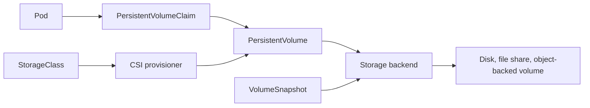
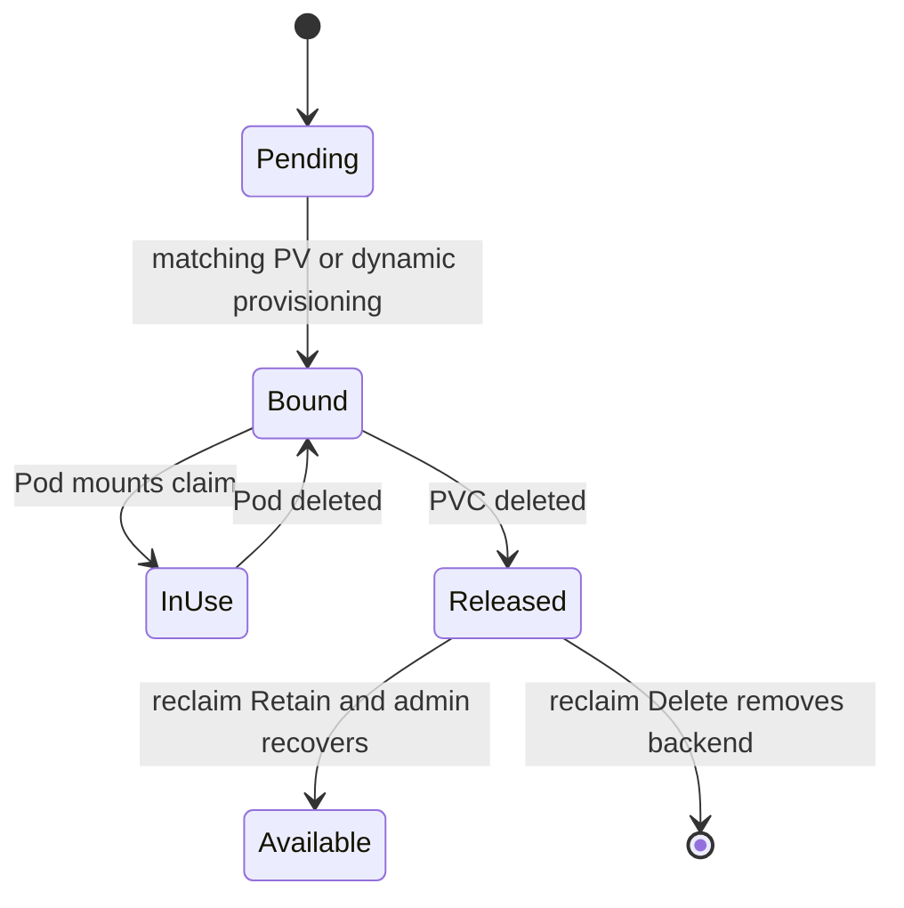
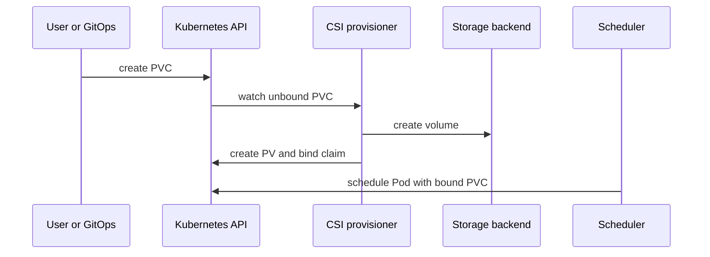
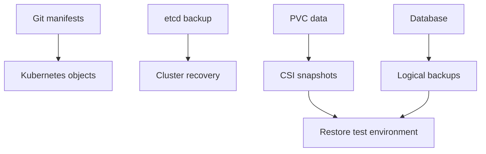

Purpose: explain Kubernetes storage primitives, dynamic provisioning, CSI behavior, StatefulSet data patterns, and operational recovery for stateful workloads.

# Storage, Volumes, PVCs, StorageClasses, CSI, and Stateful Data

This note connects [Kubernetes](/compendium/kubernetes/kubernetes), [Software Engineering#Required topic coverage matrix](/compendium/software-engineering/software-engineering#required-topic-coverage-matrix), [07 Storage Volumes PVCs StorageClasses CSI and Stateful Data](/compendium/kubernetes/storage-volumes-pvcs-storageclasses-csi-and-stateful-data), [14 Cluster Operations Upgrades Backup Restore and Disaster Recovery](/compendium/kubernetes/cluster-operations-upgrades-backup-restore-and-disaster-recovery), and [14 Cluster Operations Upgrades Backup Restore and Disaster Recovery](/compendium/kubernetes/cluster-operations-upgrades-backup-restore-and-disaster-recovery). Kubernetes storage is a contract between Pods, the scheduler, storage controllers, nodes, and the underlying platform. The important question is not "can the Pod mount a disk"; it is "what durability, locality, sharing, restore, and failure semantics does this workload need".

## Mental Model



Core objects:

| Object | Scope | Purpose |
| --- | --- | --- |
| Volume | Pod spec | makes storage available to containers |
| PersistentVolume | cluster | represents real storage capacity |
| PersistentVolumeClaim | namespace | requests storage for a workload |
| StorageClass | cluster | defines dynamic provisioning behavior |
| CSI driver | cluster components | implements storage operations for a backend |
| VolumeSnapshot | namespace | requests point-in-time copy through CSI |

## Pod Volumes

A Pod volume lives in the Pod spec. Some volume types are ephemeral and follow the Pod. Others attach persistent storage.

```yaml
apiVersion: v1
kind: Pod
metadata:
  name: volume-demo
  namespace: apps
spec:
  volumes:
    - name: cache
      emptyDir:
        sizeLimit: 2Gi
    - name: config
      configMap:
        name: app-config
  containers:
    - name: app
      image: busybox:1.36
      command: ["sh", "-c", "sleep 3600"]
      volumeMounts:
        - name: cache
          mountPath: /cache
        - name: config
          mountPath: /etc/app
          readOnly: true
```

## emptyDir

`emptyDir` is created when a Pod is assigned to a node and deleted when the Pod is removed from that node. It survives container restarts inside the same Pod, but not Pod rescheduling.

| Use case | Good fit | Risk |
| --- | --- | --- |
| scratch space | yes | data disappears with Pod |
| build workspace | yes | node disk pressure can evict Pod |
| cache | yes if rebuildable | cold start after reschedule |
| database data | no | data loss |
| inter-container handoff | yes | keep size bounded |

Memory-backed `emptyDir`:

```yaml
volumes:
  - name: fast-temp
    emptyDir:
      medium: Memory
      sizeLimit: 512Mi
```

Memory-backed volumes count against memory pressure. Use limits and test eviction behavior.

## hostPath

`hostPath` mounts a path from the node filesystem into a Pod.

```yaml
volumes:
  - name: node-logs
    hostPath:
      path: /var/log
      type: Directory
```

Production guidance:

| Position | Reason |
| --- | --- |
| avoid for application data | binds Pod to node layout and can bypass storage controls |
| restrict with admission policy | host filesystem access is high privilege |
| use for node agents only | log collectors, CSI plugins, and monitoring agents may need it |
| prefer `Directory`, `File`, or explicit type | avoids surprising path creation |
| mount read-only when possible | reduces node compromise impact |

## PersistentVolumes and PersistentVolumeClaims

A PersistentVolume is cluster storage. A PersistentVolumeClaim is a namespace request for that storage.

```yaml
apiVersion: v1
kind: PersistentVolumeClaim
metadata:
  name: postgres-data
  namespace: data
spec:
  accessModes:
    - ReadWriteOnce
  storageClassName: fast-ssd
  resources:
    requests:
      storage: 100Gi
```

Pod usage:

```yaml
apiVersion: v1
kind: Pod
metadata:
  name: postgres
  namespace: data
spec:
  volumes:
    - name: data
      persistentVolumeClaim:
        claimName: postgres-data
  containers:
    - name: postgres
      image: postgres:16
      volumeMounts:
        - name: data
          mountPath: /var/lib/postgresql/data
```

PVC lifecycle:



Commands:

```bash
kubectl get pvc -A
kubectl describe pvc postgres-data -n data
kubectl get pv
kubectl describe pv pvc-6b07-data-postgres
kubectl get events -n data --sort-by=.lastTimestamp
```

## StorageClasses and Dynamic Provisioning

A StorageClass defines which provisioner creates volumes and which parameters it uses.

```yaml
apiVersion: storage.k8s.io/v1
kind: StorageClass
metadata:
  name: fast-ssd
provisioner: csi.example.com
parameters:
  type: ssd
  encrypted: "true"
reclaimPolicy: Delete
allowVolumeExpansion: true
volumeBindingMode: WaitForFirstConsumer
```

Key fields:

| Field | Choices | Guidance |
| --- | --- | --- |
| `provisioner` | CSI driver name | must match installed CSI driver |
| `reclaimPolicy` | `Delete` or `Retain` | `Retain` for critical data, `Delete` for disposable or managed lifecycle |
| `allowVolumeExpansion` | true or false | enable for production databases if backend supports it |
| `volumeBindingMode` | `Immediate` or `WaitForFirstConsumer` | use `WaitForFirstConsumer` for zonal or local storage |
| `parameters` | driver-specific | review encryption, IOPS, filesystem, replication, and topology |

Dynamic provisioning flow:



With `WaitForFirstConsumer`, provisioning waits until a Pod exists so the scheduler can choose a zone that satisfies both compute and storage topology.

## CSI Drivers

CSI, the Container Storage Interface, lets vendors implement storage operations outside Kubernetes core.

Typical CSI components:

| Component | Runs as | Responsibility |
| --- | --- | --- |
| controller plugin | Deployment or StatefulSet | create, delete, attach, detach, snapshot, expand |
| node plugin | DaemonSet | mount, unmount, stage, publish volumes on nodes |
| external provisioner | sidecar | watches PVCs and creates PVs |
| external attacher | sidecar | manages VolumeAttachment objects |
| external resizer | sidecar | handles expansion |
| external snapshotter | sidecar | handles snapshots |

Inspect CSI:

```bash
kubectl get csidrivers
kubectl get storageclass
kubectl get pods -A | grep -i csi
kubectl get volumeattachments
kubectl describe csidriver csi.example.com
```

## Access Modes

Access mode describes how a volume may be mounted by nodes and Pods. It is a scheduling and attach contract, not a full application-level concurrency guarantee.

| Mode | Meaning | Typical backend | Best use |
| --- | --- | --- | --- |
| RWO, ReadWriteOnce | read-write by a single node | block disk | databases, queues, single-writer apps |
| ROX, ReadOnlyMany | read-only by many nodes | file or replicated volume | shared static data |
| RWX, ReadWriteMany | read-write by many nodes | NFS, CephFS, cloud file share | shared uploads, legacy shared filesystem apps |
| RWOP, ReadWriteOncePod | read-write by one Pod | supported CSI block volumes | strict single Pod writer |

### RWO vs RWX Tradeoffs

| Decision | RWO | RWX |
| --- | --- | --- |
| performance | often higher for databases | depends on network filesystem |
| data safety | simpler single writer model | application must handle concurrent writers |
| failover | attach and detach may take time | many Pods can mount at once |
| topology | often zonal | may be regional or network reachable |
| operational complexity | lower | higher, especially permissions and locking |
| best fit | stateful databases | shared content and multi-replica file access |

Use RWX only when the application actually requires shared writable filesystem semantics. For many systems, object storage, a database, or a queue is a better shared data primitive.

## Reclaim Policies

| Policy | Behavior after PVC deletion | Use when |
| --- | --- | --- |
| `Delete` | backend volume is deleted | ephemeral environments or operator-managed restore path |
| `Retain` | PV and backend data remain | critical data needs manual recovery gate |

Retain recovery sketch:

```bash
kubectl get pv
kubectl patch pv pvc-6b07-data-postgres -p '{"spec":{"claimRef": null}}'
kubectl apply -f replacement-pvc.yaml
```

Use care. Manually rebinding retained volumes can attach old data to the wrong workload if labels, namespaces, and claim names are not reviewed.

## Volume Expansion

PVC expansion works only when the StorageClass and CSI driver support it.

```bash
kubectl patch pvc postgres-data -n data -p '{"spec":{"resources":{"requests":{"storage":"200Gi"}}}}'
kubectl describe pvc postgres-data -n data
kubectl get events -n data --sort-by=.lastTimestamp
```

Expansion checklist:

| Check | Why |
| --- | --- |
| `allowVolumeExpansion: true` | Kubernetes rejects expansion otherwise |
| driver supports controller expansion | backend disk must grow |
| driver supports node expansion | filesystem must grow on node |
| filesystem supports online growth | some workloads need restart |
| monitoring adjusted | disk alert thresholds should reflect new capacity |

Never shrink a PVC by editing the requested size. Kubernetes volume shrinking is not a normal safe operation.

## Snapshots

CSI snapshots provide point-in-time copies when the driver supports the snapshot API.

```yaml
apiVersion: snapshot.storage.k8s.io/v1
kind: VolumeSnapshot
metadata:
  name: postgres-data-snap-20260615
  namespace: data
spec:
  volumeSnapshotClassName: fast-ssd-snapshots
  source:
    persistentVolumeClaimName: postgres-data
```

Restore into a new PVC:

```yaml
apiVersion: v1
kind: PersistentVolumeClaim
metadata:
  name: postgres-data-restore
  namespace: data
spec:
  storageClassName: fast-ssd
  dataSource:
    name: postgres-data-snap-20260615
    kind: VolumeSnapshot
    apiGroup: snapshot.storage.k8s.io
  accessModes:
    - ReadWriteOnce
  resources:
    requests:
      storage: 100Gi
```

Snapshot guidance:

| Topic | Guidance |
| --- | --- |
| consistency | application quiescing or database-native checkpointing may be required |
| scope | snapshot protects a volume, not every dependency |
| retention | keep policy outside the workload namespace when possible |
| restore test | a backup that has not been restored is unproven |
| portability | CSI snapshots may not move across clusters or providers |

## StatefulSets and PVC Templates

StatefulSets create stable Pod identities and stable PVCs per replica.

```yaml
apiVersion: apps/v1
kind: StatefulSet
metadata:
  name: postgres
  namespace: data
spec:
  serviceName: postgres
  replicas: 3
  selector:
    matchLabels:
      app: postgres
  template:
    metadata:
      labels:
        app: postgres
    spec:
      containers:
        - name: postgres
          image: postgres:16
          volumeMounts:
            - name: data
              mountPath: /var/lib/postgresql/data
  volumeClaimTemplates:
    - metadata:
        name: data
      spec:
        accessModes:
          - ReadWriteOnce
        storageClassName: fast-ssd
        resources:
          requests:
            storage: 100Gi
```

Resulting claims:

```text
data-postgres-0
data-postgres-1
data-postgres-2
```

StatefulSet storage properties:

| Property | Operational meaning |
| --- | --- |
| stable ordinal | Pod `postgres-0` returns with the same identity |
| stable PVC | deleting a Pod does not delete its PVC |
| ordered rollout | updates happen in ordinal order by default |
| scale down retention | PVCs usually remain after scale down |
| per-replica data | each replica has independent storage |

## Local PersistentVolumes

Local PVs expose node-local disks through the PV and PVC model. They can provide high performance, but data locality becomes a scheduling constraint.

```yaml
apiVersion: v1
kind: PersistentVolume
metadata:
  name: local-pv-node-a
spec:
  capacity:
    storage: 500Gi
  volumeMode: Filesystem
  accessModes:
    - ReadWriteOnce
  persistentVolumeReclaimPolicy: Retain
  storageClassName: local-ssd
  local:
    path: /mnt/disks/ssd1
  nodeAffinity:
    required:
      nodeSelectorTerms:
        - matchExpressions:
            - key: kubernetes.io/hostname
              operator: In
              values:
                - node-a
```

StorageClass for local PVs:

```yaml
apiVersion: storage.k8s.io/v1
kind: StorageClass
metadata:
  name: local-ssd
provisioner: kubernetes.io/no-provisioner
volumeBindingMode: WaitForFirstConsumer
```

Tradeoffs:

| Strength | Cost |
| --- | --- |
| low latency and high throughput | Pod can run only where data exists |
| simple hardware model | node loss can mean data unavailability |
| good for replicated databases | requires database-level replication |
| predictable failure domain | operations must track disk health |

## Backup and Restore

Kubernetes objects and persistent data need separate backup plans.



Backup layers:

| Layer | Captures | Does not capture |
| --- | --- | --- |
| GitOps repo | desired manifests | live generated state and data |
| etcd backup | API objects | external cloud disks in a directly useful app-consistent form |
| CSI snapshot | volume blocks | application consistency by itself |
| database dump | logical records | full filesystem state |
| application export | domain objects | platform metadata |

Restore runbook outline:

1. Identify workload, namespace, PVC names, StorageClass, and application version.
2. Stop writers or isolate the restore target.
3. Restore into a new PVC or new namespace first.
4. Start a validation Pod or application replica against restored data.
5. Run application-level integrity checks.
6. Promote through a controlled cutover.
7. Record recovery time, recovery point, and gaps.

Commands:

```bash
kubectl get pvc -n data
kubectl get volumesnapshot -n data
kubectl describe volumesnapshot postgres-data-snap-20260615 -n data
kubectl apply -f restore-pvc.yaml
kubectl run restore-check -n data --image=busybox:1.36 -- sleep 3600
```

## Data Locality and Scheduling

Storage can constrain where Pods run. This matters for zonal disks, local PVs, and topology-aware CSI drivers.

| Feature | Why it matters |
| --- | --- |
| `WaitForFirstConsumer` | avoids provisioning storage in a zone where the Pod cannot run |
| PV node affinity | pins local PV use to specific nodes |
| Pod affinity and anti-affinity | spreads replicas across failure domains |
| topology spread constraints | reduces correlated failure |
| storage topology labels | bind volume to zone, region, rack, or node |

Review with:

```bash
kubectl describe pod postgres-0 -n data
kubectl describe pvc data-postgres-0 -n data
kubectl describe pv pvc-6b07-data-postgres
kubectl get nodes --show-labels
```

## Common Mistakes

| Mistake | Impact | Fix |
| --- | --- | --- |
| using `emptyDir` for durable state | data loss on Pod reschedule | use PVC or external durable service |
| using `hostPath` for app data | node lock-in and security risk | use PV, local PV, or CSI driver |
| default StorageClass not reviewed | unexpected cost or durability | set `storageClassName` explicitly |
| `Immediate` binding for zonal disks | Pod and volume can land in incompatible zones | use `WaitForFirstConsumer` |
| assuming snapshots equal backups | crash consistency may be insufficient | combine with app quiescing and restore tests |
| deleting PVC during cleanup | backend data may be deleted by reclaim policy | check PV reclaim policy first |
| using RWX for database writes | corruption or locking failures | use RWO or database-native clustering |
| scaling StatefulSet without capacity plan | many PVCs provision at once | precheck quotas and storage backend limits |
| no restore drill | recovery process fails under pressure | schedule restore tests |
| ignoring volume attach limits | Pods stuck Pending or ContainerCreating | monitor cloud and node attach limits |

## Storage Failure Troubleshooting

PVC Pending:

```bash
kubectl describe pvc postgres-data -n data
kubectl get storageclass fast-ssd -o yaml
kubectl get events -n data --sort-by=.lastTimestamp
kubectl logs -n kube-system -l app=csi-provisioner
```

Pod stuck Pending:

```bash
kubectl describe pod postgres-0 -n data
kubectl get pvc -n data
kubectl get pv
kubectl get nodes --show-labels
```

Pod stuck ContainerCreating with mount errors:

```bash
kubectl describe pod postgres-0 -n data
kubectl get volumeattachment
kubectl describe volumeattachment csi-1234567890abcdef
kubectl logs -n kube-system -l app=csi-node
```

Filesystem full:

```bash
kubectl exec -n data postgres-0 -- df -h
kubectl describe pvc data-postgres-0 -n data
kubectl patch pvc data-postgres-0 -n data -p '{"spec":{"resources":{"requests":{"storage":"200Gi"}}}}'
```

Volume attached to wrong or dead node:

```bash
kubectl get volumeattachment
kubectl describe node node-a
kubectl describe pod postgres-0 -n data
kubectl delete pod postgres-0 -n data
```

Data missing after restart:

```bash
kubectl get pod postgres-0 -n data -o yaml | grep -A20 volumes:
kubectl get pvc -n data
kubectl describe pv pvc-6b07-data-postgres
kubectl rollout history statefulset/postgres -n data
```

## Production Guidance

| Area | Guidance |
| --- | --- |
| class selection | define storage classes by workload tier, not by ambiguous names |
| durability | document replication, zone, encryption, snapshot, and backup semantics |
| binding | prefer `WaitForFirstConsumer` for topology-sensitive storage |
| expansion | enable and test volume expansion before production incidents |
| access mode | choose RWO for single-writer state, RWX only for true shared filesystem needs |
| reclaim | use `Retain` for critical manually managed data |
| snapshots | pair snapshots with app consistency and restore validation |
| StatefulSets | understand PVC retention before scaling down or deleting |
| local PVs | use only with replicated applications or accepted node-loss risk |
| monitoring | alert on PVC usage, inode pressure, attach failures, snapshot failures, and backend quotas |

## Review Checklist

- [ ] Every PVC has an explicit `storageClassName`.
- [ ] The StorageClass reclaim policy matches the data criticality.
- [ ] `volumeBindingMode` is `WaitForFirstConsumer` for zonal or local storage.
- [ ] Access mode is justified, especially any RWX claim.
- [ ] StatefulSet PVC retention is understood before deletion or scale down.
- [ ] Volume expansion is tested for the chosen CSI driver.
- [ ] SnapshotClass and restore flow are documented.
- [ ] Backups include application consistency, not only volume blocks.
- [ ] Restore has been tested into a separate namespace or cluster.
- [ ] Local PV workloads have database-level replication or accepted data loss boundaries.
- [ ] Monitoring covers capacity, inodes, attach, mount, provision, snapshot, and backend quota failures.
- [ ] Runbooks include PVC Pending, mount failure, expansion, and restore procedures.

## Related Notes

- [Kubernetes](/compendium/kubernetes/kubernetes)
- [06 Configuration Secrets ServiceAccounts and Runtime Identity](/compendium/kubernetes/configuration-secrets-serviceaccounts-and-runtime-identity)
- [Software Engineering#Required topic coverage matrix](/compendium/software-engineering/software-engineering#required-topic-coverage-matrix)
- [07 Storage Volumes PVCs StorageClasses CSI and Stateful Data](/compendium/kubernetes/storage-volumes-pvcs-storageclasses-csi-and-stateful-data)
- [14 Cluster Operations Upgrades Backup Restore and Disaster Recovery](/compendium/kubernetes/cluster-operations-upgrades-backup-restore-and-disaster-recovery)
- [14 Cluster Operations Upgrades Backup Restore and Disaster Recovery](/compendium/kubernetes/cluster-operations-upgrades-backup-restore-and-disaster-recovery)
