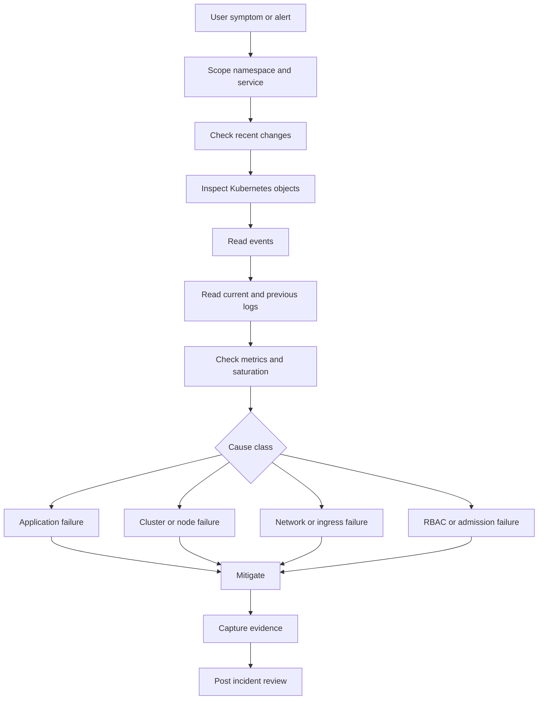

Purpose: provide a practical Kubernetes troubleshooting and incident response playbook for workload, networking, storage, node, policy, and rollout failures.

# Troubleshooting, Debugging, and Incident Response

This note expands [Kubernetes](/compendium/kubernetes/kubernetes), [03 Deployments ReplicaSets StatefulSets DaemonSets Jobs and CronJobs](/compendium/kubernetes/deployments-replicasets-statefulsets-daemonsets-jobs-and-cronjobs), [04 Services DNS Ingress Gateway API and Traffic Routing](/compendium/kubernetes/services-dns-ingress-gateway-api-and-traffic-routing), [07 Storage Volumes PVCs StorageClasses CSI and Stateful Data](/compendium/kubernetes/storage-volumes-pvcs-storageclasses-csi-and-stateful-data), [10 Observability Logging Metrics Tracing Events and Probes](/compendium/kubernetes/observability-logging-metrics-tracing-events-and-probes), [09 Security RBAC Pod Security Admission and Supply Chain](/compendium/kubernetes/security-rbac-pod-security-admission-and-supply-chain), and [10 Observability Logging Metrics Tracing Events and Probes](/compendium/kubernetes/observability-logging-metrics-tracing-events-and-probes). Kubernetes troubleshooting works best when you follow object ownership from the symptom to the controller that makes the decision: Deployment to ReplicaSet to Pod, Service to Endpoints to Pod labels, PVC to PV to CSI events, Ingress to Service to endpoint.



## First five minutes

```bash
kubectl config current-context
kubectl get ns
kubectl get deploy,rs,pod,svc,endpoints,ingress -n payments -o wide
kubectl get events -n payments --sort-by=.lastTimestamp
kubectl rollout history deploy/payments-api -n payments
kubectl rollout status deploy/payments-api -n payments
kubectl logs deploy/payments-api -n payments --since=15m --tail=300
```

Immediate rules:

| Rule | Why |
| --- | --- |
| Confirm context and namespace before action | Prevents wrong cluster changes |
| Capture evidence before deleting Pods | Deletion can erase useful state |
| Prefer rollout undo over manual Pod edits | Controllers recreate Pods from templates |
| Check events before deep debugging | Events often name the exact blocker |
| Distinguish no capacity from app crash | Mitigations are different |
| Communicate impact and next update time | Keeps incident coordination clear |

## Debugging order

1. Identify the user visible symptom: error rate, latency, failed deploy, missing endpoint, or unavailable node.
2. Scope blast radius: cluster, namespace, service, version, node pool, or tenant.
3. Check recent changes: rollout, config, secret, ingress, policy, node maintenance, dependency.
4. Inspect desired state: Deployment, StatefulSet, DaemonSet, Job, Service, Ingress, PVC.
5. Inspect actual state: Pods, ReplicaSets, endpoints, nodes, events.
6. Read logs: current container, previous container, sidecars, init containers.
7. Check resource saturation: CPU, memory, ephemeral storage, disk pressure, API rate limits.
8. Test network path: Pod DNS, Service endpoints, Ingress routing, TLS, NetworkPolicy.
9. Test policy path: RBAC, Pod Security Admission, validating policies, quotas.
10. Mitigate with the lowest risk reversible action, then preserve evidence.

## Diagnostic capture

Create an incident folder in your normal incident system, then capture command output. Do not store secrets in notes.

```bash
kubectl get deploy payments-api -n payments -o yaml
kubectl get rs -n payments -l app=payments-api -o wide
kubectl get pods -n payments -l app=payments-api -o wide
kubectl describe pod -n payments -l app=payments-api
kubectl get events -n payments --sort-by=.lastTimestamp
kubectl logs deploy/payments-api -n payments --all-containers --since=30m
kubectl top pods -n payments
kubectl top nodes
```

For a single Pod:

```bash
POD=payments-api-7d75b9c8b6-h9x4q
kubectl get pod "$POD" -n payments -o yaml
kubectl describe pod "$POD" -n payments
kubectl logs "$POD" -n payments --all-containers --tail=500
kubectl logs "$POD" -n payments --all-containers --previous --tail=500
```

## Workload states

| State or reason | Meaning | First checks |
| --- | --- | --- |
| `CrashLoopBackOff` | Container starts then exits repeatedly | Previous logs, exit code, env, config, probes |
| `ImagePullBackOff` | Image pull failed and kubelet is backing off | Image name, tag or digest, registry auth, node egress |
| `ErrImagePull` | Immediate image pull failure | Event message, registry, secret |
| `Pending` | Pod not running yet | Scheduling, PVC, image pull, quota |
| `Unschedulable` | Scheduler cannot place Pod | Requests, taints, affinity, topology spread, node selector |
| `OOMKilled` | Kernel killed process for memory | Limits, memory profile, recent traffic |
| `Evicted` | Kubelet removed Pod under pressure | Node memory, disk, inode, ephemeral storage |
| `RunContainerError` | Runtime could not start container | command, args, mounts, permissions |
| `CreateContainerConfigError` | Config reference invalid | Secret, ConfigMap, env, volume name |

## CrashLoopBackOff

Triage:

```bash
kubectl describe pod "$POD" -n payments
kubectl logs "$POD" -n payments --previous --tail=300
kubectl get pod "$POD" -n payments -o jsonpath='{.status.containerStatuses[*].lastState}'
kubectl get deploy payments-api -n payments -o yaml
```

Decision table:

| Evidence | Likely cause | Action |
| --- | --- | --- |
| Exit code 1 with app error | Bad config or app bug | Compare ConfigMap, Secret, rollout diff |
| Exit code 137 | OOMKilled | Raise memory limit or rollback memory regression |
| Probe failure before exit | Probe too strict or app not ready | Inspect probe path and startup timing |
| Missing file or permission denied | Image or volume path issue | Check read only filesystem, UID, mounts |
| Cannot connect to dependency | Dependency outage or NetworkPolicy | Test DNS, Service endpoints, egress |

Mitigations:

```bash
kubectl rollout undo deploy/payments-api -n payments
kubectl scale deploy/payments-api -n payments --replicas=0
kubectl set env deploy/payments-api FEATURE_X_ENABLED=false -n payments
```

Use scale to zero only when stopping bad traffic is better than partial availability.

## ImagePullBackOff and ErrImagePull

```bash
kubectl describe pod "$POD" -n payments
kubectl get secret regcred -n payments -o yaml
kubectl get pod "$POD" -n payments -o jsonpath='{.spec.imagePullSecrets}'
kubectl get events -n payments --sort-by=.lastTimestamp | tail -40
```

Common causes:

| Event text | Cause | Fix |
| --- | --- | --- |
| `not found` | Wrong image name, tag, or digest | Correct manifest or publish image |
| `unauthorized` | Bad registry credentials | Fix imagePullSecret or workload identity |
| `manifest unknown` | Tag missing for architecture | Publish multi arch image or use correct node pool |
| `i/o timeout` | Node cannot reach registry | Check DNS, proxy, firewall, registry status |
| `ImagePullBackOff` after transient error | Kubelet backoff | Fix cause, then wait or recreate Pod |

Production guidance: use image digests, keep registry credentials scoped per namespace, and alert on pull errors after deploys.

## Pending and Unschedulable

```bash
kubectl describe pod "$POD" -n payments
kubectl get nodes -o wide
kubectl describe node node-1
kubectl get quota,limitrange -n payments
kubectl get pvc -n payments
```

Scheduling blockers:

| Blocker | Evidence | Fix |
| --- | --- | --- |
| Insufficient CPU or memory | `0/5 nodes are available: Insufficient cpu` | Reduce requests, scale node pool, move workload |
| Taint not tolerated | Event names taint | Add toleration only if workload belongs there |
| Node selector mismatch | No nodes match labels | Fix selector or label nodes |
| Affinity too strict | Scheduler event mentions affinity | Relax rules |
| PVC unbound | Pod waits for PVC | Debug storage class and PV provisioning |
| Quota exceeded | `exceeded quota` event | Reduce replicas or increase quota |

Requests matter for scheduling. Limits matter for runtime enforcement. A Pod can be Pending even when actual node CPU usage looks low if requested CPU cannot fit.

## OOMKilled, CPU throttling, and resource pressure

```bash
kubectl describe pod "$POD" -n payments | rg -i 'oom|killed|reason|limits|requests'
kubectl top pod "$POD" -n payments --containers
kubectl top nodes
```

PromQL examples:

```promql
sum by (pod) (increase(kube_pod_container_status_restarts_total{namespace="payments"}[15m]))
```

```promql
sum by (pod, container) (
  rate(container_cpu_cfs_throttled_periods_total{namespace="payments"}[5m])
)
/
sum by (pod, container) (
  rate(container_cpu_cfs_periods_total{namespace="payments"}[5m])
)
```

Resource tradeoffs:

| Action | Benefit | Risk |
| --- | --- | --- |
| Increase memory limit | Stops OOM if app legitimately needs memory | Can increase node pressure |
| Remove memory limit | Avoids container OOM from tight limit | Pod can pressure node and be evicted |
| Increase CPU limit | Reduces throttling | May increase noisy neighbor impact |
| Increase CPU request | Better scheduling guarantee | May require more nodes |
| Add HPA | Handles traffic variation | Needs correct metrics and scaling limits |

## Evictions

Eviction means the kubelet removed Pods because the node was under pressure.

```bash
kubectl describe pod "$POD" -n payments
kubectl describe node node-1 | rg -i 'pressure|evict|allocatable|capacity'
kubectl get events -A --field-selector reason=Evicted --sort-by=.lastTimestamp
```

Eviction causes:

| Cause | Evidence | Fix |
| --- | --- | --- |
| Memory pressure | Node condition `MemoryPressure` | Reduce memory use, move workloads, add capacity |
| Disk pressure | `DiskPressure`, imagefs or nodefs messages | Clean images, reduce logs, add disk |
| Ephemeral storage | Pod exceeds ephemeral storage | Set requests and limits, move temp data to volume |
| Inode pressure | Many small files | Fix workload file churn |

## Probe failures

```bash
kubectl describe pod "$POD" -n payments | rg -i 'liveness|readiness|startup|unhealthy'
kubectl logs "$POD" -n payments --previous
kubectl port-forward pod/"$POD" -n payments 18080:8080
curl -i http://127.0.0.1:18080/health/ready
```

Diagnosis:

| Symptom | Likely cause | Fix |
| --- | --- | --- |
| Liveness restarts during dependency outage | Liveness checks dependency | Move dependency checks to readiness |
| Readiness never succeeds | App not bound, wrong path, missing dependency | Test endpoint inside Pod and inspect config |
| Startup fails for slow app | Threshold too low | Add or relax startup probe |
| Probe timeout under load | Handler shares saturated worker pool | Use cheap local health path |

## DNS failures

```bash
kubectl run dns-debug -n payments --rm -it --image=registry.k8s.io/e2e-test-images/agnhost:2.45 --restart=Never -- nslookup kubernetes.default.svc.cluster.local
kubectl run dns-debug -n payments --rm -it --image=registry.k8s.io/e2e-test-images/agnhost:2.45 --restart=Never -- nslookup payments-api.payments.svc.cluster.local
kubectl get pods -n kube-system -l k8s-app=kube-dns -o wide
kubectl logs -n kube-system -l k8s-app=kube-dns --tail=200
```

DNS decision table:

| Failure | Check |
| --- | --- |
| All cluster DNS fails | CoreDNS Pods, Service IP, kube-proxy or CNI |
| One Service name fails | Service exists, namespace, headless service, endpoints |
| External DNS fails | Node DNS, egress, NetworkPolicy, upstream resolver |
| Sporadic timeouts | CoreDNS saturation, node conntrack, UDP drops |

## Service has no endpoints

```bash
kubectl get svc payments-api -n payments -o yaml
kubectl get endpoints payments-api -n payments -o yaml
kubectl get endpointslice -n payments -l kubernetes.io/service-name=payments-api -o yaml
kubectl get pods -n payments --show-labels
kubectl describe pod -n payments -l app=payments-api
```

Common causes:

| Cause | Evidence | Fix |
| --- | --- | --- |
| Selector mismatch | Service selector does not match Pod labels | Fix labels or selector |
| Pods not ready | Endpoints absent or `ready: false` | Debug readiness |
| Wrong port name | Service targetPort references missing name | Align container port name |
| Pods in another namespace | Service selects only same namespace | Create Service in correct namespace |

## Ingress 404, 502, and TLS failures

```bash
kubectl get ingress -n payments -o wide
kubectl describe ingress payments-api -n payments
kubectl get svc,endpoints -n payments
kubectl logs -n ingress-nginx deploy/ingress-nginx-controller --tail=300
curl -vk https://payments.example.com/health/ready
```

Ingress triage:

| Symptom | Likely cause | Check |
| --- | --- | --- |
| 404 from ingress controller | Host or path rule does not match | Ingress host, pathType, class |
| 502 or 503 | Backend has no ready endpoints or wrong port | Service endpoints, targetPort, Pod readiness |
| TLS certificate mismatch | Wrong Secret or host | Ingress TLS section and cert SAN |
| Redirect loop | App and ingress both force scheme | Headers and app trust proxy config |
| Works by port forward but not ingress | Ingress, Service, NetworkPolicy, or backend protocol | Controller logs and Service port |

## PVC Pending and storage failures

```bash
kubectl get pvc -n payments
kubectl describe pvc data-payments-db-0 -n payments
kubectl get storageclass
kubectl get pv
kubectl get events -n payments --sort-by=.lastTimestamp | rg -i 'volume|mount|attach|provision'
```

Storage causes:

| Symptom | Likely cause | Fix |
| --- | --- | --- |
| PVC Pending | No matching StorageClass or provisioner failure | Check StorageClass, CSI controller, quota |
| Pod stuck mounting | Volume attach or node mount issue | Check CSI node logs and node status |
| Read only mount unexpectedly | Filesystem error or access mode | Inspect events and storage backend |
| StatefulSet replacement stuck | Volume bound to old zone or node | Check topology and PV node affinity |

## Node NotReady

```bash
kubectl get nodes -o wide
kubectl describe node node-1
kubectl get pods -A --field-selector spec.nodeName=node-1 -o wide
kubectl get events -A --field-selector involvedObject.kind=Node --sort-by=.lastTimestamp
```

Node NotReady causes:

| Evidence | Likely issue |
| --- | --- |
| Kubelet stopped reporting | Kubelet crash, node down, network partition |
| DiskPressure | Disk full, log growth, image garbage collection failing |
| MemoryPressure | Workloads exceed capacity |
| PIDPressure | Process leak |
| NetworkUnavailable | CNI issue |

Cordon and drain:

```bash
kubectl cordon node-1
kubectl drain node-1 --ignore-daemonsets --delete-emptydir-data
kubectl uncordon node-1
```

Drain tradeoffs:

| Option | Benefit | Risk |
| --- | --- | --- |
| `cordon` only | Stops new Pods | Existing impact may continue |
| `drain` | Moves eligible Pods away | Can disrupt if PDBs or replicas are weak |
| `--delete-emptydir-data` | Allows drain of Pods using emptyDir | Deletes local ephemeral data |
| Force delete | Unblocks stuck drain | Can violate availability assumptions |

Check PodDisruptionBudgets before draining production nodes:

```bash
kubectl get pdb -A
kubectl describe pdb payments-api -n payments
```

## Stuck rollouts

```bash
kubectl rollout status deploy/payments-api -n payments
kubectl rollout history deploy/payments-api -n payments
kubectl describe deploy payments-api -n payments
kubectl get rs -n payments -l app=payments-api -o wide
kubectl get pods -n payments -l app=payments-api -o wide
```

Causes:

| Evidence | Cause | Fix |
| --- | --- | --- |
| New Pods CrashLoop | App or config regression | Rollback |
| New Pods Pending | Capacity or scheduling | Add capacity or reduce requests |
| New Pods unready | Readiness or dependency | Fix readiness blocker |
| Old ReplicaSet not scaling down | PDB or maxUnavailable | Review rollout strategy |
| `ProgressDeadlineExceeded` | Deployment failed to make progress | Inspect ReplicaSet and events |

Rollback:

```bash
kubectl rollout undo deploy/payments-api -n payments
kubectl rollout status deploy/payments-api -n payments
```

## RBAC Forbidden and admission denied

RBAC Forbidden:

```bash
kubectl auth can-i create pods/exec -n payments
kubectl auth can-i create pods/exec -n payments --as=system:serviceaccount:payments:diagnostics
kubectl get role,rolebinding -n payments
kubectl get clusterrolebinding -o wide | rg diagnostics
```

Admission denied:

```bash
kubectl apply -f deployment.yaml --dry-run=server
kubectl get events -n payments --field-selector reason=FailedCreate
kubectl describe namespace payments
kubectl get validatingadmissionpolicy,validatingadmissionpolicybinding
kubectl get validatingwebhookconfiguration
```

Interpretation:

| Message | Likely layer |
| --- | --- |
| `forbidden: User cannot get resource` | RBAC |
| `violates PodSecurity` | Pod Security Admission |
| `denied by policy` | ValidatingAdmissionPolicy, Gatekeeper, Kyverno, or webhook |
| `exceeded quota` | ResourceQuota |
| `is forbidden: unable to validate against any pod security policy` | Old cluster with PodSecurityPolicy |

## NetworkPolicy blocks

```bash
kubectl get networkpolicy -n payments
kubectl describe networkpolicy -n payments
kubectl get pods -n payments --show-labels
kubectl run net-debug -n payments --rm -it --image=curlimages/curl:8.8.0 --restart=Never -- sh
```

Inside debug shell:

```bash
nslookup payments-api.payments.svc.cluster.local
curl -sv http://payments-api.payments.svc.cluster.local/health/ready
curl -sv http://10.96.0.1:443
```

NetworkPolicy checklist:

- [ ] Does any policy select the source Pod.
- [ ] Does any policy select the destination Pod.
- [ ] Are ingress and egress both required by the CNI.
- [ ] Do labels match exactly.
- [ ] Is DNS egress allowed.
- [ ] Is the namespace selector correct.
- [ ] Does the CNI enforce NetworkPolicy.

## Exec, port-forward, and ephemeral containers

Use direct debugging tools carefully. They can expose secrets, mutate state, or bypass normal deployment paths.

```bash
kubectl exec -it "$POD" -n payments -- /bin/sh
kubectl port-forward pod/"$POD" -n payments 18080:8080
kubectl debug -it "$POD" -n payments --image=busybox:1.36 --target=api
kubectl debug node/node-1 -it --image=busybox:1.36
```

Tradeoffs:

| Tool | Best for | Risk |
| --- | --- | --- |
| `exec` | Inspect process environment and files | Can mutate running container |
| `port-forward` | Test local path to Pod or Service | Bypasses ingress and client network path |
| Ephemeral container | Debug distroless images | Requires powerful RBAC |
| Node debug | Node level inspection | Very high privilege |

Prefer read only commands first:

```bash
id
pwd
ls -la /app
printenv | sort
cat /etc/resolv.conf
ss -lntp
```

Avoid printing full environment variables in shared incident channels because they may contain secrets.

## Incident response checklist

- [ ] Declare severity and incident commander.
- [ ] Confirm cluster, namespace, service, and user impact.
- [ ] Start an incident timeline.
- [ ] Freeze nonessential deploys for affected systems.
- [ ] Capture current Deployment, ReplicaSet, Pod, Service, Ingress, PVC, and event state.
- [ ] Identify recent changes.
- [ ] Decide mitigation: rollback, scale, config revert, traffic shift, node cordon, dependency failover.
- [ ] Execute one mitigation at a time with a named owner.
- [ ] Verify user visible recovery using SLO metrics and synthetic checks.
- [ ] Preserve logs, traces, audit evidence, and command history.
- [ ] Rotate secrets if credentials may have been exposed.
- [ ] Remove temporary debug permissions and tooling.
- [ ] Write follow up actions with owners and dates in the incident system.

## Common mistakes

| Mistake | Consequence | Better action |
| --- | --- | --- |
| Deleting crash looping Pods before reading previous logs | Loses root cause evidence | Capture logs and describe output first |
| Debugging only the Pod | Misses Service, endpoints, ingress, and policy | Follow the request path |
| Scaling up during dependency failure | Amplifies load on dependency | Shed load or disable feature |
| Fixing live Pod filesystem | Change disappears and hides real fix | Patch controller or rollback |
| Ignoring ResourceQuota | New Pods cannot be created | Check quota and LimitRange early |
| Assuming DNS failure is CoreDNS | Service name or NetworkPolicy may be wrong | Test both Service DNS and external DNS |
| Draining nodes without PDB review | Causes avoidable outage | Check PDBs and replicas first |
| Leaving debug RBAC in place | Creates durable privilege risk | Remove after incident |

## Production review checklist

- [ ] Deployments have reasonable requests, limits, and rollout strategy.
- [ ] Critical workloads have PodDisruptionBudgets.
- [ ] Services have matching selectors and named target ports.
- [ ] Readiness probes protect traffic during startup and dependency failures.
- [ ] Liveness probes are conservative and local.
- [ ] Logs include correlation ids and are centrally retained.
- [ ] Metrics cover request rate, errors, latency, saturation, restarts, and throttling.
- [ ] Alerts have runbooks with exact commands.
- [ ] Oncall has RBAC for read only diagnostics and controlled debug escalation.
- [ ] Admission denials and RBAC failures are observable.
- [ ] Node maintenance uses cordon, drain, and PDB review.
- [ ] Incident response includes evidence capture before destructive actions.

