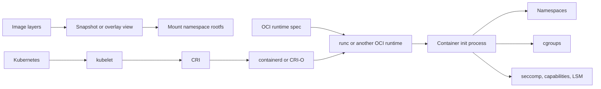
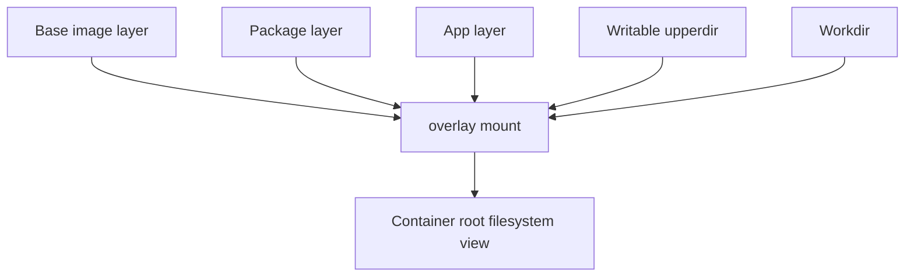
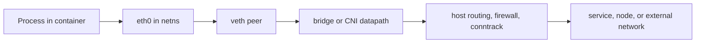

Purpose: Build an operator-grade mental model for Linux resource control, namespaces, container runtimes, and the real isolation boundary between a process on a local learning machine, a production Linux host, and a production cluster.

Related notes: [17 Production Operations Troubleshooting and Runbooks](/compendium/linux-systems-engineering/production-operations-troubleshooting-and-runbooks), [18 Linux Ecosystem Tools and Learning Projects](/compendium/linux-systems-engineering/linux-ecosystem-tools-and-learning-projects)

# Operating Position

Containers are Linux process isolation and packaging, not miniature machines. A local learning machine can tolerate privileged experiments, `--pid=host`, broad bind mounts, and manual cgroup poking because the blast radius is your workstation or lab VM. A production Linux host treats those same actions as change-managed operations. A production cluster adds a scheduler, admission policy, kubelet, a CRI runtime, CNI networking, storage plugins, and many tenants, so a "container issue" may be a kernel, node, runtime, image, network policy, or workload contract issue.

The useful field model is:



Namespaces decide what a process can see. cgroups decide what a process can consume. Capabilities, seccomp, LSMs, mount flags, user mappings, and device policy decide what it can do. Image layers decide what filesystem content it starts with. The runtime joins those pieces into a normal Linux process tree.

# cgroups In Practice

cgroup is a hierarchical resource and accounting mechanism. Every process belongs to cgroups. Controllers expose knobs for resource domains such as CPU, memory, IO, pids, and cpuset. systemd uses cgroups for units and slices. Container managers use cgroups for container and pod limits. Kubernetes resource requests and limits eventually become node-local cgroup policy, but the scheduler decision and the kernel enforcement are different phases.

## cgroup v1 vs cgroup v2

| Area | cgroup v1 | cgroup v2 |
| --- | --- | --- |
| Hierarchy | Multiple independent hierarchies; controllers can be mounted separately. | Single unified hierarchy for controllers that support v2. |
| Operational feel | Flexible but easy to create inconsistent controller trees. | More coherent hierarchy with top-down resource distribution. |
| Container history | Older Docker and Kubernetes deployments commonly used it. | Modern default on many distributions and preferred for new systems. |
| Delegation | Harder to delegate safely because controller behavior is split. | Designed with clearer delegation rules, especially for unprivileged managers. |
| Common failure | Looking in the wrong mounted hierarchy or mixing controller assumptions. | Forgetting controllers are enabled on parent cgroups before children receive knobs. |
| Production guidance | Know it for legacy hosts and old incident reports. | Prefer it for new fleets when runtime, systemd, and orchestrator support are aligned. |

On a learning machine, it is reasonable to inspect both `/sys/fs/cgroup` and `/proc/$PID/cgroup`, create throwaway cgroups, and run stress tools. On a production host, treat direct cgroup mutation as emergency-only unless it is owned by systemd, the container manager, or the orchestrator. On a production cluster, do not manually edit pod cgroups as a fix; collect evidence and change the workload, node configuration, or runtime policy.

## Controllers You Must Recognize

| Controller | What it controls | Useful files or signals | Production notes |
| --- | --- | --- | --- |
| `cpu` | CPU share, quota, pressure, and scheduling weight. | `cpu.max`, `cpu.weight`, `cpu.stat`, PSI CPU pressure. | CPU limits can create throttling that looks like app latency; requests and shares affect competition. |
| `memory` | Anonymous memory, page cache accounting, reclaim, OOM behavior. | `memory.current`, `memory.max`, `memory.events`, `memory.stat`, PSI memory pressure. | A container can be OOM-killed even when the node has free memory if its cgroup limit is reached. |
| `io` | Block IO weight, throttling, and accounting. | `io.stat`, `io.max`, `io.weight`. | Slow disks often surface as high load average and D-state tasks, not high CPU. |
| `pids` | Number of tasks a cgroup may create. | `pids.current`, `pids.max`, `pids.events`. | Fork storms, thread leaks, and process-per-request designs fail here before CPU or memory looks critical. |
| `cpuset` | CPU and NUMA node placement. | `cpuset.cpus`, `cpuset.mems`, effective variants. | Bad cpuset policy can strand capacity or create noisy-neighbor artifacts. |

Important cgroup v2 mechanics:

- A controller must be available in `cgroup.controllers` before it can be enabled in `cgroup.subtree_control`.
- Controller enablement flows downward. Children receive controller files when parents distribute that controller.
- Domain controllers normally require resource-distributing cgroups to keep processes in leaves.
- `memory.events` is a high-signal incident file because it separates limit pressure, high events, OOM, and OOM kill counters.
- `cpu.stat` distinguishes real work from throttling by showing periods, throttled periods, and throttled time.

# Namespaces

Namespaces create separate views of global kernel resources. They are isolation primitives, not policy engines. If a process has a namespace but still has dangerous capabilities, broad host mounts, or device access, isolation is weak.

| Namespace | Isolates | Container use | Common mistake |
| --- | --- | --- | --- |
| `pid` | Process IDs and process tree view. | Container PID 1 sees its own descendants. | Assuming host PID 1234 and container PID 1 are different processes; they can be the same task seen through different namespaces. |
| `mount` | Mount table and propagation view. | Container rootfs, bind mounts, read-only paths. | Forgetting mount propagation, then wondering why host or container mount events leak or do not appear. |
| `net` | Network devices, addresses, routes, ports, firewall tables. | veth pair, bridge, CNI, pod network namespace. | Debugging from host namespace only and missing pod namespace routes or DNS config. |
| `user` | UID and GID mappings plus capability scope inside the namespace. | Rootless containers and reduced host-root exposure. | Treating container root as host root, or assuming user namespaces remove every kernel attack surface. |
| `uts` | Hostname and NIS domain name. | Per-container hostname. | Using hostname as identity in clustered systems. |
| `ipc` | System V IPC and POSIX message queues. | Prevents accidental shared IPC between workloads. | Sharing IPC namespace for convenience and creating cross-process coupling. |
| `cgroup` | View of cgroup paths. | Hides host cgroup layout from containerized processes. | Reading `/proc/self/cgroup` inside a container and assuming it shows host paths. |
| `time` | Boot and monotonic clock offsets for processes. | Specialized testing and migration-like cases. | Assuming wall clock changes are isolated; time namespaces are not general NTP policy. |

Debug mapping command pattern:

```bash
pid=<host-pid>
readlink /proc/$pid/ns/pid
readlink /proc/$pid/ns/net
readlink /proc/$pid/ns/mnt
cat /proc/$pid/cgroup
cat /proc/$pid/status | sed -n '1,80p'
```

# Why Containers Are Not VMs

A VM has a guest kernel and a virtual hardware boundary. A container shares the host kernel. The security and failure model follows from that.

| Claim | Container reality | Production implication |
| --- | --- | --- |
| "It has its own OS." | It has a filesystem tree and process view, but kernel syscalls go to the host kernel. | Kernel CVEs, sysctls, LSM policy, and host modules matter to every container. |
| "Root in the container is safe." | Root may be namespaced, capability-limited, or rootless, but it is still a powerful identity inside that boundary. | Drop capabilities, use user namespaces where practical, avoid privileged mode. |
| "The image is immutable." | Image layers are read-only, but the writable layer, volumes, tmpfs, and bind mounts are mutable. | State belongs in declared volumes or external systems, not in an accidental container diff. |
| "The container owns its network." | Network namespace is connected by host interfaces, bridges, routes, NAT, CNI, or policy. | Host firewall, CNI, conntrack, and DNS affect the workload. |

# Runtime Model

The runtime stack separates image management, lifecycle, and low-level process creation.

| Layer | Role | Examples |
| --- | --- | --- |
| Image format and distribution | Defines content-addressed layers, config, manifests, and registry interaction. | OCI image format, Docker registry-compatible registries. |
| Snapshotter or storage driver | Presents layers as a root filesystem plus writable upper layer. | overlayfs snapshotter, native snapshotter, devmapper in older systems. |
| Runtime service | Pulls images, manages metadata, snapshots, networking handoff, lifecycle, and shims. | containerd, CRI-O. |
| OCI runtime | Creates the actual container process from an OCI bundle and config. | runc, crun. |
| Orchestrator integration | Talks to runtime service through an interface. | Kubernetes kubelet through CRI. |

`runc` is the common OCI runtime: it receives a bundle, configures namespaces, cgroups, mounts, capabilities, seccomp, and starts the process. `containerd` is a daemon with content store, snapshotters, runtime shims, and APIs. CRI-O is a Kubernetes-focused CRI implementation that uses OCI runtimes underneath. Kubernetes does not normally call `runc` directly; kubelet talks CRI to a node runtime, which delegates lower-level work.

# Image Layers And overlayfs

Container images are content-addressed layers plus metadata. A running container usually sees a merged filesystem:



overlayfs presents lower read-only layers and an upper writable layer as one tree. A file modification often creates a copy-up into the upper layer. This is operationally important:

- Writing heavily into the container writable layer can be slower and harder to preserve than writing to a declared volume.
- Deleting a file from a lower layer creates a whiteout, not a smaller lower layer.
- Image layer design affects pull time, cache reuse, CVE scanning, and rebuild churn.
- On production clusters, image garbage collection and ephemeral storage pressure can evict pods even when application memory looks fine.

# Container Networking

A single-host default container network often uses a network namespace, veth pair, bridge, routes, iptables or nftables NAT, and conntrack. A Kubernetes pod usually has one network namespace shared by all containers in that pod. CNI plugins attach that namespace to the cluster network and apply routes, addresses, and sometimes policy.



Troubleshooting sequence:

1. From the workload namespace, check `ip addr`, `ip route`, `/etc/resolv.conf`, and DNS resolution.
2. From the host, map the container PID, enter the net namespace with `nsenter -t $pid -n`, and compare route and firewall behavior.
3. Check packet counters: `ip -s link`, `nstat`, `ss -s`, `conntrack -S` if available.
4. In Kubernetes, separate pod IP reachability, service VIP translation, DNS, network policy, and external egress.

# Rootless Containers

Rootless containers use user namespaces and subordinate UID and GID ranges so container root maps to an unprivileged host identity. They reduce damage from many runtime escapes and accidental host writes, but they do not make kernel attack surface disappear. Rootless networking, privileged ports, cgroup delegation, overlay support, and device access can differ from rootful operation.

| Benefit | Cost |
| --- | --- |
| Host root is not required for normal container lifecycle. | Some features need newuidmap/newgidmap, cgroup v2 delegation, or helper daemons. |
| Better default posture for developer workstations and multi-user hosts. | Lower-level debugging can be confusing because UID maps alter file ownership interpretation. |
| Accidental bind-mounted host writes are less likely to be root-owned. | Device, network, and storage behavior may differ from production rootful clusters. |

Production guidance: use rootless where the platform supports it cleanly, but test the exact runtime, cgroup mode, storage driver, and workload behavior. Do not assume a rootless learning-machine success means a production cluster will accept the same pod security context or volume layout.

# Security Boundaries

Containers combine several partial controls:

- Namespaces limit views of resources.
- cgroups limit resource consumption.
- Capabilities split some root powers into named privileges.
- seccomp filters syscalls.
- AppArmor, SELinux, or another LSM constrains file, process, and network actions.
- Read-only rootfs, no-new-privileges, masked paths, and readonly paths reduce accidental mutation.
- User namespaces reduce host-root equivalence.
- Device cgroup and runtime device policy prevent broad host device access.

Common mistakes:

| Mistake | Why it hurts | Safer direction |
| --- | --- | --- |
| Running `--privileged` to fix a mount, network, or debug issue. | It disables many isolation layers at once. | Add the narrow capability, mount, or debug profile required, then remove it. |
| Bind mounting `/`, `/var/run`, or the container runtime socket. | The container can control or mutate the host. | Use read-only targeted mounts or purpose-built agents. |
| Assuming image scanning equals runtime security. | Runtime flags, kernel version, secrets, and network paths are separate risk areas. | Combine image hygiene with admission, runtime policy, and host patching. |
| Using host namespaces in a multi-tenant cluster. | Host PID, network, or IPC namespace sharing collapses boundaries. | Reserve host namespace use for node agents with reviewed RBAC and policy. |

# Debugging Containers From The Host

Start read-only. Mutating the runtime state while investigating can destroy evidence.

Host mapping checklist:

```bash
# Find container or pod process on a Linux host.
ps -eo pid,ppid,stat,comm,args --forest

# Inspect namespace and cgroup placement.
pid=<host-pid>
ls -l /proc/$pid/ns
cat /proc/$pid/cgroup
cat /proc/$pid/status

# Enter selected namespaces for observation.
nsenter -t $pid -m -u -i -n -p -- ps -ef
nsenter -t $pid -n -- ss -lntup
nsenter -t $pid -m -- findmnt

# Inspect cgroup pressure and limits.
cg=$(awk -F: '$1=="0"{print $3}' /proc/$pid/cgroup)
base=/sys/fs/cgroup$cg
cat "$base/memory.current" "$base/memory.max" 2>/dev/null
cat "$base/memory.events" 2>/dev/null
cat "$base/cpu.stat" 2>/dev/null
```

Production cluster rule: prefer orchestrator-native inspection first. Use `kubectl describe pod`, pod events, node events, runtime logs, kubelet logs, and ephemeral debug containers where policy permits. Host `nsenter` belongs in node-level incident response, not routine app debugging.

# Kubernetes Relationship To Linux Primitives

Kubernetes is not the isolation mechanism. It schedules desired state and configures node agents. Linux enforces most node-local isolation.

| Kubernetes concept | Linux primitive underneath |
| --- | --- |
| Pod | Shared network namespace, optional shared process namespace, one or more containers. |
| Container limits | cgroup controller settings on the node. |
| Security context | UID, GID, capabilities, seccomp, LSM profile, namespace choices, privilege flags. |
| RuntimeClass | Runtime handler selection through CRI. |
| Image pull | Registry content, image manifests, layers, snapshotter unpacking. |
| EmptyDir and ephemeral storage | Node filesystem, tmpfs, or local storage accounting and eviction. |
| NetworkPolicy | CNI implementation, kernel datapath, firewall or eBPF policy depending on plugin. |

When a pod is OOMKilled, ask whether the kernel killed it due to cgroup memory max, the kubelet evicted it under node pressure, or the process exited by itself after an allocation failure. The YAML symptom is not the root cause.

# Runbook: Container Will Not Start

1. Confirm whether the failure is image pull, image unpack, runtime create, process exec, health check, or application crash.
2. Inspect events and runtime logs before deleting the workload.
3. Validate image name, tag, digest, registry credentials, architecture, and pull policy.
4. Check node pressure: disk, inode, memory, pids, and image filesystem pressure.
5. Check security admission and runtime denials: seccomp, AppArmor, SELinux, capabilities, read-only paths, denied devices.
6. If the process starts and exits, capture exit code, stderr, config, environment source, and mounted files.
7. In a cluster, compare with another node before blaming the image. Node-local runtime or CNI damage is common.

# Runbook: Container Is Slow

1. Check `cpu.stat` for throttling and `memory.events` for reclaim or OOM pressure.
2. Check `io.stat`, host disk latency, and D-state tasks.
3. Compare app latency with CPU pressure, memory pressure, and IO pressure.
4. Inspect DNS path from inside the namespace.
5. Check conntrack saturation, packet drops, retransmits, and MTU mismatch.
6. Confirm whether service mesh, sidecar, or eBPF datapath is in the request path.
7. For Kubernetes, compare requested resources, actual usage, QoS class, node pressure, and neighbor workloads.

# Production Guidance

- Treat local learning machines as disposable evidence labs. Practice `unshare`, `nsenter`, `systemd-run`, `stress-ng`, `podman`, `nerdctl`, and `crictl` there.
- Treat production Linux hosts as shared state. Collect first, change second, and make changes reversible.
- Treat production clusters as control planes plus nodes. A pod symptom may require kubelet, runtime, CNI, storage, DNS, or kernel evidence.
- Prefer declarative workload changes over host surgery.
- Keep node debug access audited and rare.
- Know when not to debug inside the container. Some facts only exist on the host: cgroup pressure, kernel logs, veth counters, runtime shim state, and LSM denials.

# Official Reference Anchors

- https://docs.kernel.org/admin-guide/cgroup-v2.html
- https://docs.kernel.org/admin-guide/cgroup-v1/index.html
- https://man7.org/linux/man-pages/man7/cgroups.7.html
- https://man7.org/linux/man-pages/man7/namespaces.7.html
- https://github.com/opencontainers/runtime-spec
- https://github.com/opencontainers/runc
- https://containerd.io/docs/
- https://cri-o.io/
- https://docs.kernel.org/filesystems/overlayfs.html
- https://kubernetes.io/docs/concepts/containers/cri/
- https://kubernetes.io/docs/concepts/security/linux-kernel-security-constraints/
