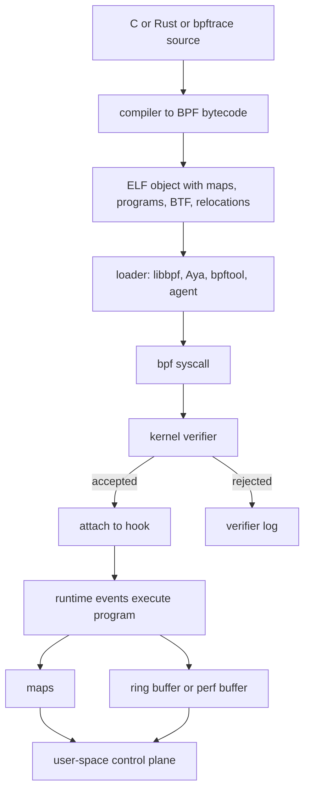
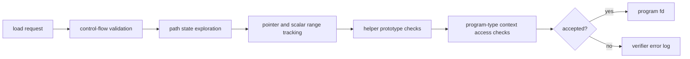
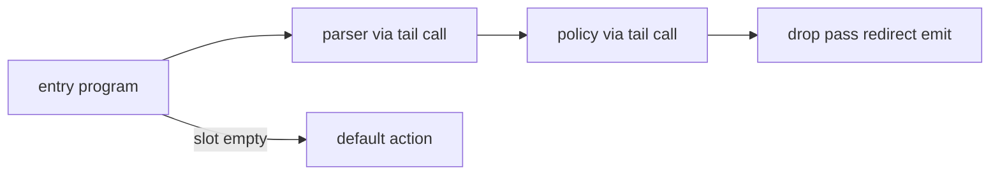

Purpose: Build a production-grade mental model of eBPF as constrained Linux kernel extension machinery, including verifier behavior, maps, helpers, program types, attach points, portability, tooling, and when not to use it.

# 14 eBPF Fundamentals Verifier Maps Programs and Helpers

Related notes: [Linux Systems Engineering](/compendium/linux-systems-engineering/linux-systems-engineering), [05 Linux Networking TCP IP Routing Firewalling and DNS](/compendium/linux-systems-engineering/linux-networking-tcp-ip-routing-firewalling-and-dns), [06 System Calls ABI libc and User Kernel Boundaries](/compendium/linux-systems-engineering/system-calls-abi-libc-and-user-kernel-boundaries), [08 Permissions Users Groups Capabilities and LSMs](/compendium/linux-systems-engineering/permissions-users-groups-capabilities-and-lsms), [09 cgroups Namespaces Containers and Runtime Isolation](/compendium/linux-systems-engineering/cgroups-namespaces-containers-and-runtime-isolation), [15 eBPF Networking XDP TC Cilium and Service Dataplanes](/compendium/linux-systems-engineering/ebpf-networking-xdp-tc-cilium-and-service-dataplanes), [16 eBPF Observability Uprobes Kprobes Tracepoints and CO-RE](/compendium/linux-systems-engineering/ebpf-observability-uprobes-kprobes-tracepoints-and-co-re), [17 Production Operations Troubleshooting and Runbooks](/compendium/linux-systems-engineering/production-operations-troubleshooting-and-runbooks), [18 Linux Ecosystem Tools and Learning Projects](/compendium/linux-systems-engineering/linux-ecosystem-tools-and-learning-projects)

eBPF is a Linux kernel mechanism for loading small, verified programs into kernel hook points. The programs run when an event reaches an attach point: a packet enters XDP, a socket operation crosses a cgroup boundary, a kernel function is entered, a tracepoint fires, an LSM decision is made, or another supported hook is reached. The important field model is not "run arbitrary code in the kernel." It is "submit bytecode plus metadata, prove enough safety for the selected program type, attach to a constrained hook, communicate through maps or event buffers, and observe or influence the path with bounded work."

eBPF is not a replacement for kernel modules, iptables, perf, auditd, OpenTelemetry, service meshes, or application logging. It overlaps with each. Its value is precise, low-latency access to kernel context without shipping a custom kernel module. Its danger is that a bad program can still add CPU overhead, memory pressure, verifier complexity, packet drops, misleading evidence, or policy mistakes at a privileged boundary.

On a local learning machine, use throwaway VMs, recent kernels, `bpftool`, `bpftrace`, libbpf examples, and disposable network namespaces. Load and detach programs repeatedly. Break verifier rules on purpose. On production hosts and clusters, treat eBPF like kernel-adjacent change: require ownership, version checks, rollback, rate limits, event-size budgets, and observability for the observability system itself.



## Classic BPF and eBPF

Classic BPF began as a packet filtering virtual machine, best known through tcpdump-style socket filters. It was narrow: packet input, accumulator-style execution, and a smaller instruction model. eBPF generalized the idea into a register-based virtual instruction set with many program types, helper calls, maps, tail calls, JIT compilation on common architectures, and attach points across networking, tracing, cgroups, and LSMs.

| Area | Classic BPF | eBPF |
|---|---|---|
| Main original use | packet filtering | networking, tracing, security, scheduling-adjacent hooks, cgroups |
| Execution model | accumulator-oriented VM | 64-bit register VM |
| State | limited scratch memory | maps shared with user space and other programs |
| Extension surface | socket filters and seccomp-style uses | many program types and attach points |
| Safety model | verifier for a narrow model | verifier with pointer tracking, bounds tracking, helper prototypes, program-type rules |
| Operational risk | bad filters and wrong captures | bad filters, bad policy, overhead, fleet compatibility, attach conflicts |

The name causes confusion. In current Linux operations, "BPF" often means the extended infrastructure. When a tool says "BPF program", inspect the actual program type and attach point before assuming behavior.

## Instruction Set Model

eBPF bytecode is a small instruction set intended for verifier analysis and efficient execution. The common mental model:

| Register | Role |
|---|---|
| `R0` | return value from helpers and final program return |
| `R1` to `R5` | helper call arguments, caller-saved |
| `R6` to `R9` | callee-saved registers |
| `R10` | read-only frame pointer to the BPF stack |

The instruction classes cover arithmetic, jumps, loads, stores, endian conversions, atomic operations, helper calls, function calls, and program exit. The stack is small and verifier-tracked. Pointers are not raw C pointers in the way kernel code uses them. They carry verifier types: context pointer, stack pointer, map value pointer, packet pointer, socket pointer, scalar, nullable pointer, and other specialized forms.

Operational implications:

- Initialize stack slots before reading them.
- Check nullable map lookups before dereferencing.
- Prove packet bounds against `data_end` before reading headers.
- Keep pointer arithmetic simple enough for the verifier.
- Do not assume C optimizer output will be verifier-friendly.

## Verifier

The verifier is the gate between user-submitted bytecode and kernel execution. It walks program paths, tracks register and stack state, checks helper argument constraints, checks memory bounds, enforces program-type access rules, and rejects execution paths it cannot prove safe.

It is a proof system with practical limits, not a style checker. Code can be logically safe and still rejected because the verifier cannot prove the property after optimization, pointer mixing, complex branches, or wide variable ranges.



Common verifier constraints:

| Constraint | Why it exists | Field symptom |
|---|---|---|
| bounded execution | prevent infinite kernel execution | "program is too large" or loop cannot be proven bounded |
| initialized stack reads only | prevent leaking kernel memory | invalid read from stack |
| typed pointer access | prevent arbitrary memory access | invalid mem access, expected pointer type |
| packet bounds checks | prevent packet overread | invalid access to packet |
| helper-specific argument rules | preserve helper safety contract | R1 type mismatch, invalid argument |
| reference release | prevent leaked kernel references | unreleased reference id |
| program-type restrictions | keep hook semantics valid | helper not allowed for program type |

Bounded loops are supported on modern kernels, but "bounded" means the verifier can prove the maximum iteration count. A loop over packet bytes, map entries, or a user-supplied length must clamp the count first.

Example pattern:

```c
int limit = len;
if (limit > 64)
    limit = 64;

for (int i = 0; i < limit; i++) {
    /* verifier can reason about the upper bound */
}
```

## Helpers and Kfuncs

Helper functions are kernel-provided calls available to BPF programs. They are how programs read time, get current PID, look up map values, redirect packets, emit events, read user memory, reserve ring-buffer records, query cgroups, and more. Helpers are not universally available. Availability depends on kernel version, program type, attach point, license restrictions for some helpers, and kernel configuration.

Kfuncs are kernel functions exposed to BPF programs with BTF typing. They expand capability but can be less stable than classic helper interfaces. Treat kfunc use as a compatibility decision, not a free replacement for helpers.

| Use | Typical helper family | Caution |
|---|---|---|
| map access | `bpf_map_lookup_elem`, update, delete | NULL-check lookups, control key cardinality |
| events | perf event output, ring buffer reserve and submit | budget payload size and rate |
| packet changes | checksum update, redirect, clone redirect | packet mutation changes verifier state |
| tracing | current task, PID, comm, stack ids | stack capture can be expensive |
| user memory reads | probe read helpers | user pointers may fault or be unavailable |
| time | ktime helpers | use monotonic time for latency |

## Maps

Maps are kernel-resident data structures used by BPF programs and user space. They provide state, configuration, counters, correlation, per-CPU aggregation, program arrays for tail calls, ring buffers, socket maps, LRU caches, cgroup storage, task storage, and other specialized storage.

Maps are where many production failures hide. A program may be verified but operationally unsafe because map keys grow without a bound, per-CPU memory is multiplied by CPU count, event buffers overflow, or userspace stops draining.

| Map type family | Use | Production guidance |
|---|---|---|
| hash | keyed state, flow tables, PID correlation | set hard `max_entries`, use LRU where churn is expected |
| array | fixed index config, counters | simple and fast, but size must be known |
| per-CPU hash or array | low-contention counters | multiply memory by CPU count |
| LRU hash | bounded caches under churn | eviction changes semantics, do not use for required state |
| program array | tail calls | track chains and avoid hidden complexity |
| perf event array | event delivery to user space | older common event path, per-CPU behavior matters |
| ring buffer | ordered event delivery through shared buffer | reserve/submit discipline, drops under backpressure |
| stack trace | stack id storage | memory-heavy at scale |
| sockmap or sockhash | socket redirection and policy | advanced networking semantics, harder debugging |

Map pinning in bpffs lets maps and programs outlive a loader process. Pinning is useful for agents and control planes, but stale pinned objects are a common source of confusion. Always name pinned paths deliberately and include cleanup procedures.

## Program Types and Attach Points

A program type defines context, allowed helpers, return semantics, and verifier rules. An attach point is where that type is bound. Do not discuss an eBPF program without naming both.

| Program family | Common attach point | Typical purpose |
|---|---|---|
| kprobe, kretprobe | dynamic kernel function entry or return | debugging and observability when stable tracepoints do not exist |
| uprobe, uretprobe | dynamic user-space function entry or return | application/library instrumentation without recompilation |
| tracepoint | stable-ish kernel tracepoint event | syscall, scheduler, block, network tracing |
| raw tracepoint | lower-overhead tracepoint access | higher performance, less friendly context |
| fentry, fexit | BTF-typed kernel function entry or exit | efficient tracing on supported kernels |
| LSM BPF | LSM security hooks | policy enforcement and audit at access-control points |
| cgroup BPF | cgroup hooks | socket, device, sysctl, and other containment policy |
| socket filter | socket receive path | packet filtering and capture |
| TC BPF | qdisc ingress or egress | packet classification, shaping integration, policy, service dataplanes |
| XDP | driver or generic early packet path | fast drop, redirect, load balancing, DDoS mitigation |

Kprobes and uprobes are dynamic. They attach to function symbols or offsets and can break when kernel or binary layout changes. Tracepoints are declared instrumentation points and are usually better for production observability if they expose the needed data. Fentry and fexit can be more efficient and typed, but depend on BTF and kernel support.

LSM BPF and cgroup BPF are policy machinery, not just observability. A bug can deny file access, socket operations, or other security-sensitive actions. Use them with staged policy, audit mode where possible, and clear ownership.

## Event Delivery: Perf Buffers and Ring Buffers

Perf buffers and BPF ring buffers move event records from BPF programs to user space. They are not infinite queues. If user space cannot keep up, events drop or reservation fails.

| Mechanism | Strength | Tradeoff |
|---|---|---|
| perf buffer | widely used, per-CPU model, compatible with older tooling | global ordering is harder, per-CPU sizing matters |
| ring buffer | shared buffer with efficient reserve and submit API | requires newer kernel support, one overloaded consumer can still fall behind |

For production, prefer counters for high-rate facts and events for sampled details. A BPF program that emits one event per packet, syscall, or scheduler event can become the incident.

## Tail Calls

Tail calls jump from one BPF program to another through a program-array map. They are useful for dispatch tables, protocol parsers, policy stages, and splitting large logic into verifier-manageable units. They also hide control flow from casual readers.

Production rules:

- Document the tail-call graph.
- Pin program-array maps only with explicit ownership.
- Keep failure behavior defined when a tail-call slot is missing.
- Avoid turning tail calls into a plugin system without compatibility tests.



## CO-RE, BTF, libbpf, and Portability

CO-RE means compile once, run everywhere in the practical BPF sense: compile an object with BTF type information and relocations, then let the loader adapt field offsets and type details to the target kernel's BTF. It does not mean every program runs on every kernel. Helper availability, program types, attach types, kernel config, vendor backports, and semantic changes still matter.

BTF is type metadata for kernel and BPF objects. A common production check is:

```bash
test -r /sys/kernel/btf/vmlinux && echo btf-present
bpftool btf dump file /sys/kernel/btf/vmlinux format c | head
```

libbpf is the reference C loader library used to open BPF ELF objects, create maps, load programs, apply CO-RE relocations, attach programs, and manage links. It gives you close alignment with kernel BPF conventions.

bpftool is the operator tool for inspecting programs, maps, links, BTF, features, and pinned objects:

```bash
sudo bpftool feature probe
sudo bpftool prog show
sudo bpftool map show
sudo bpftool link show
sudo bpftool prog dump xlated id 42
sudo bpftool map dump id 17
```

bpftrace is a high-level tracing language. It is excellent for learning and incident exploration when bounded, but production use needs guardrails because one-liners can attach broad probes, emit high-rate events, or read sensitive arguments.

Aya is a Rust eBPF ecosystem. It provides user-space loading APIs and `aya-ebpf` for writing BPF-side Rust programs. Its appeal is Rust-native development without depending on libbpf or BCC in the same way C/libbpf projects do. Its production considerations are the same kernel realities: verifier output, BTF availability, helper support, target architecture, and attach semantics still decide whether the program loads and behaves.

## Tool Selection

| Tooling | Best fit | Avoid when |
|---|---|---|
| bpftool | inspect existing kernel BPF state, features, maps, links, BTF | you need a long-running product agent by itself |
| bpftrace | fast exploratory tracing | high-rate production collection without review |
| libbpf | portable production C loaders and CO-RE workflows | team cannot maintain C or kernel-facing ABI details |
| Aya | Rust-native eBPF applications | target kernels or program types are not well covered by your test matrix |
| BCC | dynamic development and older examples | production hosts should not carry runtime compilers unless accepted |
| perf/ftrace | CPU profiling and kernel tracing without custom BPF logic | you need programmable policy or map-backed state |

## Wrong Tool Cases

eBPF is the wrong tool when the signal exists cleanly in application logs, metrics, OpenTelemetry spans, audit logs, conntrack, perf, tcpdump, or kernel tracepoints with existing tools. It is also wrong when the action needs long blocking work, arbitrary allocation, filesystem writes from the program, complex parsing, unbounded user input, heavy string processing, or business logic.

Use eBPF when the required evidence or enforcement point is at a kernel boundary and the work can be bounded, tested, rolled back, and owned.

| Need | Better first tool |
|---|---|
| understand HTTP route latency | app metrics or OpenTelemetry |
| debug one failed DNS name | resolver logs, `dig`, packet capture |
| profile CPU hotspots | `perf`, flamegraphs |
| enforce service authorization | application auth or sidecar policy |
| count all syscalls on a laptop | bpftrace learning lab |
| count all syscalls on a fleet | sampled, reviewed BPF agent or existing observability product |

## Common Mistakes

| Mistake | Consequence | Better practice |
|---|---|---|
| treating verifier acceptance as production safety | accepted programs can still overload systems | add rate, memory, and event budgets |
| attaching to unstable function names | kernel updates break probes | prefer tracepoints or fentry with compatibility tests |
| unbounded map cardinality | memory pressure or failed inserts | cap keys, use LRU, aggregate early |
| emitting every event | dropped events and CPU overhead | sample, aggregate, and expose drop counters |
| ignoring pinned objects | stale state survives restarts | inventory and cleanup bpffs paths |
| using local root as proof of fleet support | production kernels differ | probe features per kernel family |
| reading sensitive data casually | secrets leak to logs or telemetry | classify fields and redact in user space |

## Troubleshooting Load Failures

Start with the exact load error and verifier log. Then prove kernel support before changing code.

```bash
uname -a
sudo bpftool feature probe kernel
sudo bpftool prog show
sudo bpftool map show
ls -l /sys/kernel/btf/vmlinux
mount | grep bpf
```

| Symptom | Likely area | Action |
|---|---|---|
| `Operation not permitted` | privileges, lockdown, unprivileged BPF disabled, capabilities | check root, `CAP_BPF`, `CAP_PERFMON`, `CAP_NET_ADMIN`, lockdown mode, sysctls |
| verifier says invalid packet access | missing or insufficient bounds check | compare every packet read with `data_end` proof |
| helper not allowed | wrong program type or kernel support | check helper availability for that type |
| map create fails | memory, rlimit or memcg, unsupported type | check map sizing and kernel features |
| CO-RE relocation fails | missing or incompatible BTF | inspect `/sys/kernel/btf/vmlinux`, target type names |
| attach fails | unsupported attach type or wrong target | confirm hook exists and loader selected the right attach path |

## Production Guidance

For local learning machines:

- run recent kernels in disposable VMs
- keep a folder of small programs that intentionally fail verification
- use network namespaces for XDP and TC labs before touching real interfaces
- inspect bytecode and maps with `bpftool`
- use bpftrace for fast understanding, then translate durable ideas into reviewed code

For production hosts and clusters:

- document program type, attach point, map sizes, expected event rate, and detach command
- feature-probe every supported kernel family
- expose health metrics for load failures, attach failures, map pressure, event drops, and user-space drain lag
- stage rollouts by kernel version and node role
- avoid broad tracing on control-plane nodes during incidents unless the signal justifies it
- maintain a cleanup runbook for pinned programs, maps, and links

eBPF is best treated as part of the kernel operational surface. The fastest way to misuse it is to treat it as a magic observability layer that has no cost because the verifier accepted the program.
