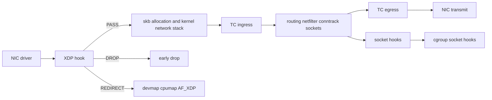
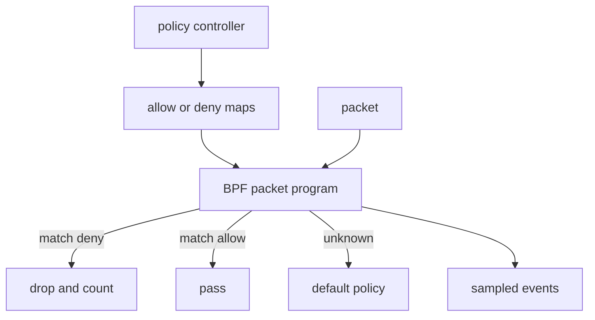
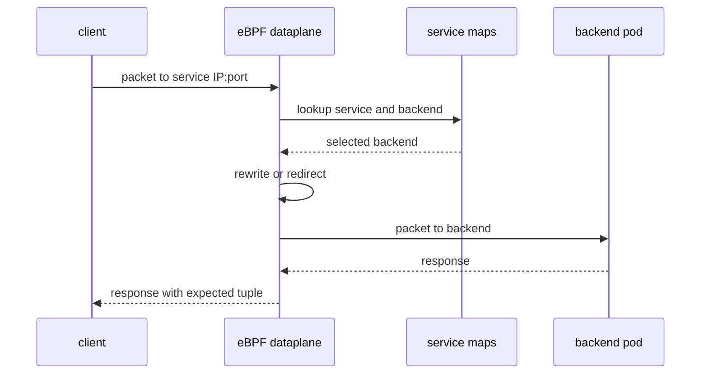

Purpose: Explain eBPF networking as programmable packet and socket handling across XDP, TC, socket hooks, cgroup hooks, service dataplanes, Cilium-style policy, and production debugging.

# 15 eBPF Networking XDP TC Cilium and Service Dataplanes

Related notes: [Linux Systems Engineering](/compendium/linux-systems-engineering/linux-systems-engineering), [05 Linux Networking TCP IP Routing Firewalling and DNS](/compendium/linux-systems-engineering/linux-networking-tcp-ip-routing-firewalling-and-dns), [09 cgroups Namespaces Containers and Runtime Isolation](/compendium/linux-systems-engineering/cgroups-namespaces-containers-and-runtime-isolation), [14 eBPF Fundamentals Verifier Maps Programs and Helpers](/compendium/linux-systems-engineering/ebpf-fundamentals-verifier-maps-programs-and-helpers), [16 eBPF Observability Uprobes Kprobes Tracepoints and CO-RE](/compendium/linux-systems-engineering/ebpf-observability-uprobes-kprobes-tracepoints-and-co-re), [17 Production Operations Troubleshooting and Runbooks](/compendium/linux-systems-engineering/production-operations-troubleshooting-and-runbooks), [18 Linux Ecosystem Tools and Learning Projects](/compendium/linux-systems-engineering/linux-ecosystem-tools-and-learning-projects)

eBPF networking programs run at packet, socket, and cgroup boundaries. They can drop, pass, redirect, classify, account, enforce policy, steer traffic, and implement service load balancing. The production value is early and precise decisions without sending every packet through a large user-space proxy. The production risk is equally direct: a bad return code, stale map, bad endpoint identity, incompatible kernel feature, or overloaded event path can become packet loss at line rate.

On a local learning machine, build a lab with network namespaces, veth pairs, a bridge, and throwaway XDP or TC programs. It is acceptable to drop all packets on a lab interface you can recreate. On production hosts and clusters, network eBPF is part of the dataplane. Roll it like firewall, routing, and CNI code: staged, observable, reversible, and tested on the same kernel and NIC mode that will run it.



## Hook Selection

| Hook | Position | Strength | Cost and risk |
|---|---|---|---|
| XDP native | driver receive path before skb allocation | fastest drop and redirect, DDoS filters, L4 load balancing | driver support varies, less kernel context, packet parsing must be careful |
| XDP generic | fallback in kernel stack | easier local testing | not representative of native performance |
| TC ingress | after skb exists, before most higher-level handling | rich packet context, shaping and policy integration | later than XDP, skb cost already paid |
| TC egress | before transmit | egress policy, encapsulation, accounting | can break return traffic and service paths |
| socket filter | attached to sockets | classic filtering and capture | narrower scope than dataplane policy |
| sockmap and sockhash | socket redirection and verdicts | L7-ish acceleration patterns, socket steering | complex semantics and harder debugging |
| cgroup socket hooks | process group socket operations | workload boundary enforcement | depends on correct cgroup placement |

The right hook is the earliest hook that has enough context for a correct decision. If a decision needs process identity, cgroup, TLS metadata, or application state, raw XDP is probably too early. If a decision is "drop obvious garbage from these prefixes", XDP may be ideal.

## XDP

XDP runs before skb allocation. Return actions commonly include pass, drop, abort, transmit back out the same interface, or redirect through maps. XDP is used for fast packet filtering, L3/L4 load balancing, early DDoS mitigation, AF_XDP delivery to user space, and steering between devices or CPUs.

XDP is not a full replacement for the network stack. It sees packet bytes and limited metadata early. If the policy depends on conntrack, socket state, route decisions, or application identity, use TC, socket, cgroup hooks, or a higher layer.

Packet parser discipline:

```c
void *data = (void *)(long)ctx->data;
void *data_end = (void *)(long)ctx->data_end;

struct ethhdr *eth = data;
if ((void *)(eth + 1) > data_end)
    return XDP_PASS;

if (eth->h_proto != bpf_htons(ETH_P_IP))
    return XDP_PASS;
```

Every header read must be preceded by a `data_end` proof. VLANs, IPv6 extension headers, fragmentation, tunnels, and short packets turn simple examples into real parsers.

## TC Ingress and Egress

TC BPF programs run in the traffic-control layer. They operate on `skb` context, so they are later than XDP but have more integration with the network stack. TC is a common place for Kubernetes CNI dataplanes, policy enforcement, traffic accounting, encapsulation, and service translation.

Example operator inspection:

```bash
tc qdisc show dev eth0
tc filter show dev eth0 ingress
tc filter show dev eth0 egress
sudo bpftool net
sudo bpftool prog show
```

Tradeoffs:

| Choice | Use when | Avoid when |
|---|---|---|
| XDP drop | unwanted traffic can be identified from early packet headers | decision needs conntrack, process, or cgroup context |
| TC ingress policy | pod or host policy needs skb context and CNI integration | packets should be discarded before skb allocation for survival |
| TC egress policy | outbound identity and destination control matter | NAT and routing interactions are not understood |
| netfilter/nftables | ruleset and conntrack semantics are enough | per-packet programmable maps or CNI dataplane integration is required |

## Socket and Cgroup Hooks

Socket hooks work closer to the socket abstraction than raw packets. Cgroup socket hooks let programs evaluate operations made by processes in a cgroup, such as bind, connect, sendmsg, recvmsg, sock options, and address selection depending on hook support. This is useful for workload boundaries because cgroups already model containers and services.

Use cgroup hooks when the policy is "this workload may connect to these destinations" or "this service may bind these ports." Use TC or XDP when the policy is about packet paths regardless of process ancestry.

Production cgroup cautions:

- verify the cgroup hierarchy is v2 or expected hybrid mode
- confirm container runtime placement before enforcement
- handle host-network pods separately
- define behavior for system daemons outside workload slices
- test restarts because cgroup paths and IDs can change

## Packet Filtering

Packet filtering with eBPF should be map-driven. Hardcoded rules are useful for demos, but production filters need user-space control planes, atomic map updates, observability, and rollback.



Common policy dimensions:

| Dimension | Example | Risk |
|---|---|---|
| L2 | MAC, VLAN | spoofing, virtual switches, overlays |
| L3 | source or destination CIDR | NAT and tunnels change visible addresses |
| L4 | TCP or UDP ports | dynamic ports and protocols |
| identity | endpoint ID, cgroup, pod labels via maps | stale identity maps can over-allow or over-deny |
| state | connection tuple, reverse path | map eviction and conntrack disagreement |

## Load Balancing and Service Dataplanes

eBPF service load balancers commonly replace a chain of iptables or IPVS decisions with map lookups at XDP or TC. A packet for a virtual service address is mapped to a backend endpoint, then rewritten or redirected. Reverse translation may be needed for return traffic.



Service load balancing needs more than a hash map:

- backend health and readiness
- graceful termination handling
- session affinity if required
- external traffic policy semantics
- source IP preservation decisions
- NodePort, ClusterIP, LoadBalancer, and host-reachable service behavior
- IPv4 and IPv6 parity
- direct routing, tunneling, or hybrid routing mode

## Kube-proxy Replacement Overview

kube-proxy traditionally programs iptables or IPVS to implement Kubernetes Service translation. An eBPF kube-proxy replacement moves service lookup and translation into BPF programs and maps, often attached at TC and sometimes XDP for selected paths. The expected win is less ruleset scaling pain and tighter integration with pod identity, policy, and observability.

The migration risk is dataplane ownership. During transition, iptables rules, conntrack state, node-local agents, CNI routes, kubelet behavior, load balancers, and BPF maps can disagree. In production clusters, change one node pool or node role at a time, drain workloads where required, and have a rollback path that includes dataplane state cleanup.

## Cilium Overview

Cilium is a Kubernetes networking, security, and observability dataplane built on eBPF. It uses BPF programs and maps for service load balancing, network policy enforcement, endpoint identity, routing modes, and flow observability. It can run with kube-proxy or replace kube-proxy depending on configuration and environment support.

Do not reduce Cilium to "eBPF is faster." Its operational model includes an agent, operator, CNI integration, identity allocation, policy repository, endpoint regeneration, BPF map management, Hubble flow visibility, and cluster-specific routing decisions.

| Cilium area | eBPF role | Operator concern |
|---|---|---|
| endpoint policy | enforce allow and deny decisions near pod traffic | identity correctness and policy rollout |
| service handling | BPF maps for service and backend selection | kube-proxy replacement mode, health, termination |
| observability | flow events similar to Hubble output | event volume, dropped flow records, privacy |
| routing | direct routing, tunneling, or cloud integration | MTU, routes, encapsulation, node capabilities |
| host firewall | policy at host boundary | avoid locking out control-plane and node agents |

## Network Policy Enforcement

Network policy enforcement has three planes:

| Plane | Responsibility | Failure mode |
|---|---|---|
| intent | Kubernetes NetworkPolicy or richer policy API | policy does not express the real dependency |
| identity | map labels, services, pods, nodes, cgroups to numeric identities | stale or missing identity |
| dataplane | enforce packets against maps at TC, XDP, or socket hooks | wrong hook, wrong map, wrong default |

Default deny is powerful and dangerous. On a local cluster, it is a good exercise. In production, introduce visibility first, then narrow policies by namespace or workload, then enforce. Watch DNS, health checks, metrics scraping, node-to-pod traffic, and storage plugins.

## Hubble-Style Flow Visibility

Hubble-style flow records summarize network decisions: source identity, destination identity, verdict, protocol, service, TCP flags, DNS names when visible, and policy reason. They are not the same as full packet capture.

| Flow record | Packet capture |
|---|---|
| lower volume summary | full bytes or headers |
| policy and identity context | exact wire evidence |
| easier cluster-wide search | expensive at scale |
| may omit payload and timing details | privacy and storage risk |

Use flow visibility for "who talked to whom and was it allowed." Use packet capture for "what exact bytes were on the wire." Use application telemetry for "what request was this and why did it fail."

## Packet Capture Tradeoffs

tcpdump and AF_PACKET capture after some kernel path decisions. XDP drops may never appear in normal tcpdump on the host because the packet was discarded before skb allocation. TC drops may show differently depending on capture point. Hardware offloads can also confuse captures.

Production guidance:

- know whether the suspected drop is before or after skb allocation
- capture on both host and pod namespace when possible
- disable offloads only in controlled windows if they obscure evidence
- sample captures and redact payloads
- prefer counters and flow logs for continuous operation

## DDoS Mitigation Overview

XDP can drop obvious abusive traffic before expensive allocation and conntrack work. This is useful for volumetric garbage with simple match criteria: invalid ports, known bad prefixes, malformed headers, impossible protocol combinations, or allowlist-only service exposure.

Limits:

- link saturation still happens before the host sees packets
- complex L7 detection is not an XDP job
- maps must update faster than attack shape changes
- false positives at XDP are silent service denial
- multi-node mitigation needs consistent policy and telemetry

For production DDoS response, combine upstream filtering, load balancer controls, rate limits, XDP filters, service autoscaling, and incident communication. XDP is one layer, not the whole defense.

## Performance Tradeoffs

| Technique | Benefit | Cost |
|---|---|---|
| early XDP drop | avoids skb allocation and later stack work | limited context and parser burden |
| per-CPU counters | low contention | higher memory and user-space aggregation |
| LRU flow maps | bounded memory under churn | evicts state, can break correlation |
| tail-call pipeline | splits logic and improves modularity | harder control-flow debugging |
| event sampling | keeps user-space drain feasible | incomplete forensic detail |
| redirect maps | fast steering | NIC, driver, and map semantics matter |

Measure with workload-specific traffic. Synthetic packets can prove parser behavior but rarely prove production latency, CPU, and drop behavior.

## Safety Limits

Safety for eBPF networking is broader than verifier safety.

| Limit | Why it matters |
|---|---|
| verifier accepted | proves constrained memory safety, not correct networking policy |
| map capacity | determines whether flows, services, or identities can be represented |
| event buffer size | determines visibility under burst |
| CPU budget | packet path work multiplies by packet rate |
| feature support | native XDP, helpers, BTF, and attach types vary |
| offload behavior | driver and hardware paths may differ from generic mode |
| rollback path | pinned maps and links can survive processes |

## Debugging eBPF Networking Programs

Start by locating the hook and owner.

```bash
sudo bpftool net
sudo bpftool prog show
sudo bpftool map show
sudo bpftool link show
ip link show
tc qdisc show dev eth0
tc filter show dev eth0 ingress
tc filter show dev eth0 egress
```

Then compare counters at each layer:

```bash
ip -s link show dev eth0
ethtool -S eth0 | egrep 'drop|err|miss|xdp|rx|tx'
nstat -az | egrep 'Tcp|Udp|Ip|Icmp'
ss -tin
conntrack -S 2>/dev/null
```

For clusters:

```bash
kubectl get nodes -o wide
kubectl -n kube-system get pods -o wide
kubectl -n kube-system logs ds/cilium --tail=200
cilium status
cilium bpf map list
cilium monitor
hubble observe --verdict DROPPED
```

Use vendor tools when a CNI owns the dataplane. Manual `tc` or `bpftool` inspection is valuable, but deleting programs behind a controller can make state worse.

## Troubleshooting Decision Table

| Observation | Likely layer | Next action |
|---|---|---|
| tcpdump sees nothing, NIC counters increase | XDP or driver path | check XDP attach, XDP stats, driver mode |
| pod-to-pod fails only across nodes | routing, overlay, service map, MTU | compare direct routing or tunnel config, node routes, CNI maps |
| service IP fails but pod IP works | service load balancing | inspect service maps, kube-proxy replacement status, endpoint readiness |
| DNS blocked after policy rollout | network policy | inspect flow verdicts for kube-dns/CoreDNS and port 53 |
| only new connections fail | conntrack, service backend selection, policy | compare SYN path, conntrack table, service maps |
| high CPU in dataplane agent | map churn, endpoint regeneration, event volume | inspect agent logs, map pressure, flow export rate |
| verifier rejection after upgrade | kernel or compiler difference | capture verifier log and feature probe target kernel |

## Local Labs

Local experiments that teach real concepts:

- attach XDP generic to a veth and drop ICMP
- count TCP SYN packets in a per-CPU array
- redirect packets between veth peers with a devmap
- attach TC ingress to classify DNS traffic
- use a cgroup connect hook to deny one destination from a test process
- run a local Cilium kind cluster and compare kube-proxy and kube-proxy-free mode only in disposable environments

Keep the lab separate from your daily network interface. A wrong XDP return value on Wi-Fi or the primary Ethernet device can cut off your session.

## Production Guidance

Before rollout:

- list exact program types, attach points, and maps
- feature-probe kernel families and NIC driver modes
- size maps from expected services, endpoints, identities, and flows
- define default behavior when maps are missing or full
- define rollback that detaches programs and cleans pinned maps
- test upgrades and node reboots

During incidents:

- avoid deleting unknown BPF programs until ownership is known
- gather `bpftool net`, `bpftool prog`, `bpftool map`, `tc`, routes, and CNI status first
- compare packet counters before and after the suspected hook
- use sampled flow visibility before broad packet capture
- treat control-plane nodes as higher risk

eBPF networking is most successful when it is operated as a dataplane with a control plane, not as clever packet code living on a host.
