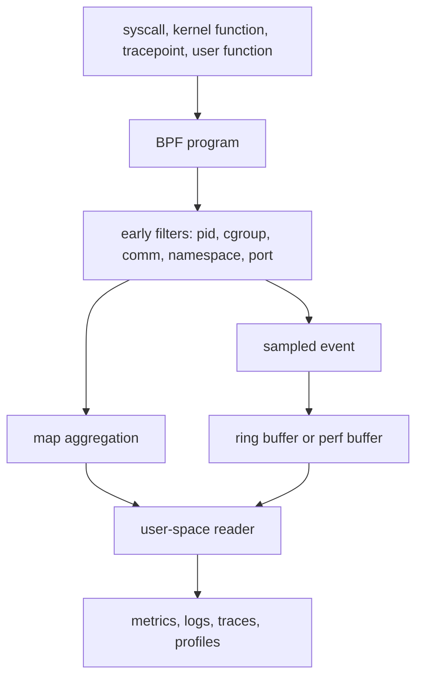

Purpose: Use eBPF observability safely for syscall, process, file, TCP, DNS, latency, off-CPU, lock, and application tracing while managing overhead, privacy, portability, and production troubleshooting.

# 16 eBPF Observability Uprobes Kprobes Tracepoints and CO-RE

Related notes: [Linux Systems Engineering](/compendium/linux-systems-engineering/linux-systems-engineering), [02 Processes Threads Scheduling Signals and Jobs](/compendium/linux-systems-engineering/processes-threads-scheduling-signals-and-jobs), [04 Filesystems VFS Block IO Page Cache and Storage](/compendium/linux-systems-engineering/filesystems-vfs-block-io-page-cache-and-storage), [05 Linux Networking TCP IP Routing Firewalling and DNS](/compendium/linux-systems-engineering/linux-networking-tcp-ip-routing-firewalling-and-dns), [06 System Calls ABI libc and User Kernel Boundaries](/compendium/linux-systems-engineering/system-calls-abi-libc-and-user-kernel-boundaries), [14 eBPF Fundamentals Verifier Maps Programs and Helpers](/compendium/linux-systems-engineering/ebpf-fundamentals-verifier-maps-programs-and-helpers), [15 eBPF Networking XDP TC Cilium and Service Dataplanes](/compendium/linux-systems-engineering/ebpf-networking-xdp-tc-cilium-and-service-dataplanes), [17 Production Operations Troubleshooting and Runbooks](/compendium/linux-systems-engineering/production-operations-troubleshooting-and-runbooks), [18 Linux Ecosystem Tools and Learning Projects](/compendium/linux-systems-engineering/linux-ecosystem-tools-and-learning-projects)

eBPF observability is event-driven instrumentation at kernel and user-space boundaries. It can answer questions that ordinary logs and metrics miss: which process opened this file, which syscall is slow, where TCP connects fail, which lock path blocks, which user-space function contributes latency, or which DNS names a workload resolves. It is powerful because it can run close to the event source. It is risky because the event source may be hot, sensitive, unstable, or different across kernel and binary versions.

On a local learning machine, use bpftrace one-liners, toy programs, disposable VMs, and known workloads. Trace too broadly once so you understand the cost. On production hosts and clusters, prefer narrow attach points, bounded duration, sampling, aggregation, redaction, and a clear exit condition. The question is not "can eBPF see this?" The question is "can this observation be collected without changing the incident more than it explains?"



## Choosing an Instrumentation Surface

| Surface | Stability | Use | Caution |
|---|---|---|---|
| tracepoint | relatively stable kernel event ABI | syscall, scheduler, block, network events | fields still vary by kernel and config |
| raw tracepoint | lower overhead and raw context | hot tracepoint paths | less friendly decoding |
| kprobe | dynamic kernel function entry | missing tracepoint, deep debugging | function names and arguments can change |
| kretprobe | dynamic kernel function return | return values and latency | return probes add overhead and can miss some paths |
| fentry | BTF-typed function entry | efficient kernel function tracing | needs BTF and support |
| fexit | BTF-typed function exit | return values with lower overhead than kretprobe in many cases | same portability requirements |
| uprobe | user-space function entry | app or library instrumentation | binary symbols, ASLR, inlining, versions |
| uretprobe | user-space function return | app latency and return values | higher overhead, recursive calls need correlation |
| USDT | user-level static probes | app-declared stable probe points | requires probes compiled into binary or runtime |

Prefer stable static points first: application metrics, OpenTelemetry spans, logs, kernel tracepoints, and USDT probes. Use dynamic kprobes and uprobes when the stable surface lacks the needed signal.

## Syscall Tracing

Syscall tracing maps user-space behavior to kernel entry points. It is useful for permission denials, unexpected file access, network calls, process spawning, and latency at the user-kernel boundary. Tracepoints such as syscall enter and exit events are usually a better production surface than kprobes on syscall implementation functions.

Example bpftrace for local learning:

```bash
sudo bpftrace -e 'tracepoint:syscalls:sys_enter_openat { @[comm] = count(); }'
```

Production shape:

- filter by cgroup, PID namespace, UID, command, or service
- aggregate counts instead of printing every event
- sample arguments only when needed
- never collect pathnames or arguments fleet-wide without data classification

Syscall names are not the same as application intent. A high `openat` count may be normal dynamic linker, config reload, logging, or filesystem cache behavior. Correlate with process, path class, latency, and error code.

## Process Exec Tracing

Exec tracing answers "what actually started?" It is valuable for incident response, cron surprises, container entrypoints, shell escapes, and deployment verification.

Common fields:

| Field | Why it matters |
|---|---|
| PID and parent PID | process tree and ancestry |
| UID and GID | actor and privilege |
| cgroup or container ID | workload attribution |
| command and args | executed program and intent |
| timestamp | timeline reconstruction |
| return code from exec | failed execution attempts |

Sensitive-data warning: command-line arguments often contain tokens, passwords, connection strings, file paths, customer identifiers, or incident secrets. In production, hash, truncate, or allowlist fields before export.

## File Access Tracing

File tracing can attach to syscalls, VFS functions, LSM hooks, or tracepoints depending on the question.

| Question | Better surface |
|---|---|
| which process attempted to open a path | syscall tracepoint or LSM hook |
| why did access fail | syscall exit plus errno, LSM audit if available |
| which filesystem path is hot | VFS or syscall aggregation |
| which block device is slow | block tracepoints, not path syscalls |
| who changed a sensitive file | auditd or fanotify may be better for durable policy |

Pathnames are hard. Kernel paths can be renamed while observed, dentries may not reconstruct cleanly, and containers see mount namespaces. A path from the host namespace may differ from the path inside the container. For production security monitoring, prefer established audit mechanisms unless eBPF is needed for a specific gap.

## TCP Connection Tracing

TCP tracing can expose connect attempts, accepts, retransmits, resets, state transitions, and latency. Useful surfaces include syscall tracepoints for `connect`, tracepoints in TCP state handling, kprobes or fentry on TCP functions when tracepoints are insufficient, and cgroup socket hooks for workload attribution.

Example fields:

| Field | Use |
|---|---|
| source and destination tuple | flow identity |
| PID, command, cgroup | workload attribution |
| TCP state | handshake and close behavior |
| errno or reset reason | failure classification where available |
| latency | connect or request phase timing |

Use [05 Linux Networking TCP IP Routing Firewalling and DNS](/compendium/linux-systems-engineering/linux-networking-tcp-ip-routing-firewalling-and-dns) for the packet and socket model before assuming every TCP failure is an application bug.

## DNS Tracing

DNS can be traced at multiple layers:

| Layer | What it shows | Blind spot |
|---|---|---|
| application library uprobe | requested name before resolver policy | language and library specific |
| libc resolver uprobe | names sent through glibc path | apps may bypass libc |
| UDP/TCP port 53 packet parsing | wire query and response | encrypted DNS and local cache behavior |
| CoreDNS or resolver logs | server-side answer path | misses client-side cache and NSS behavior |
| eBPF socket or packet tracing | tuple and payload where visible | privacy and encryption limits |

DNS names can be sensitive. They may reveal tenants, internal services, experiments, and incident targets. In production, aggregate by suffix, hash full names, or sample only failed responses when possible.

## Latency Histograms

Latency histograms are one of the best eBPF observability patterns. The BPF program records start time in a map, computes duration on completion, and increments a bucket. User space reads compact aggregated state.

```mermaid
sequenceDiagram
  participant Start as entry event
  participant Map as start-time map
  participant End as exit event
  participant Hist as histogram map
  Start->>Map: store key to timestamp
  End->>Map: lookup key
  End->>Hist: increment latency bucket
  End->>Map: delete key
```

Key choice matters. PID alone can collide across threads or reused processes. For syscalls, use PID/TID plus operation-specific identifiers where possible. Always delete start records on completion to avoid map leaks. Add fallback cleanup for long-lived missing exits if the workload or probe can miss events.

## Off-CPU Profiling

Off-CPU profiling asks where threads spend time not running: blocked on IO, locks, futexes, scheduler delays, or sleeping. eBPF can observe scheduler switches, capture stack traces for blocked tasks, and build aggregate blocked-time profiles.

Production cautions:

- stack capture is expensive
- symbolization needs debug symbols or frame pointers, depending on stack source
- blocked time is not always bad; sleeping event loops are normal
- container attribution requires cgroup or namespace correlation
- high-cardinality stack maps can consume memory

Use off-CPU profiles with CPU profiles. A service can be slow because it is burning CPU, waiting on storage, blocked on locks, rate limited, or starved by scheduling.

## Lock Contention Tracing

Lock contention tracing can use kernel lock tracepoints, scheduler signals, futex tracing, or application uprobes around lock functions. The right surface depends on whether the lock is kernel internal, pthread/futex-based, runtime-level, or application-defined.

| Lock type | Possible observation |
|---|---|
| kernel spinlock or mutex | lock tracepoints or kernel probes where available |
| pthread mutex | futex syscalls, libc uprobes, app runtime probes |
| JVM, Go, Rust runtime locks | runtime-specific probes or symbols if exposed |
| database locks | application metrics and logs are often better |

Do not infer lock ownership from one signal. Combine wait duration, stack traces, owner hints if available, and application-level context.

## Application Uprobes

Uprobes attach to user-space instruction addresses. They can instrument functions in binaries and shared libraries without modifying source. Uretprobes observe function returns and can compute latency or inspect return values.

Practical problems:

- stripped binaries may lack symbols
- optimized code may inline or eliminate functions
- shared library versions change offsets
- ASLR and containers complicate path resolution
- language runtimes may move work away from the function you chose
- function arguments follow ABI rules, not source-level names

Local example:

```bash
sudo bpftrace -e 'uprobe:/usr/lib/x86_64-linux-gnu/libc.so.6:getaddrinfo { @[comm] = count(); }'
```

Production guidance:

- pin binary build IDs or package versions
- prefer USDT or runtime-supported probes when available
- test against the exact container image
- filter by cgroup before reading arguments
- avoid attaching to extremely hot functions without sampling

## USDT Probes

USDT means user-level statically defined tracing. Applications or runtimes compile named probe points into binaries. Unlike arbitrary uprobes, USDT probes are intentional instrumentation contracts. They are common in runtimes, databases, and some system services.

USDT is often the best bridge between application semantics and eBPF mechanics. It can expose "request started", "query planned", or "garbage collection began" more directly than guessing from syscalls.

Limitations:

- probes must exist in the binary or runtime
- fields are only as good as the provider contract
- some environments strip or package binaries without probes
- high-rate probes still need sampling and aggregation

## OpenTelemetry Relationship

OpenTelemetry is an instrumentation and telemetry data model for traces, metrics, and logs. eBPF is a kernel mechanism for collecting or enforcing at low-level hooks. They are complementary.

| Need | OpenTelemetry | eBPF |
|---|---|---|
| business transaction trace | strong when app is instrumented | inferred and incomplete |
| kernel latency or syscall failures | weak unless app records it | strong at boundary |
| network flow attribution | app-level view | host and kernel view |
| low-level process/file evidence | usually absent | strong but sensitive |
| semantic labels | strong | must be derived |

The best production systems connect them carefully: eBPF fills blind spots, while OpenTelemetry provides request context. Avoid pretending eBPF can reconstruct encrypted application semantics or user intent without application cooperation.

## Overhead Management

Overhead comes from attach frequency, per-event work, map operations, stack capture, user memory reads, string handling, event emission, user-space decoding, and downstream export.

| Control | Effect |
|---|---|
| early filters | reduce work before maps and events |
| aggregation in maps | reduce event volume |
| sampling | bound cost on hot paths |
| per-CPU counters | reduce contention |
| ring-buffer drop counters | reveal lost visibility |
| duration limits | prevent forgotten incident tracers |
| feature flags | roll back high-cost probes quickly |

Production rule: export the tracer's own health. At minimum track load failures, attach failures, map update failures, buffer drops, events processed, events exported, and CPU or memory use of the user-space agent.

## Sampling and Cardinality

Sampling decides which events become detailed records. Cardinality decides how many unique keys maps and downstream systems must hold. Both are reliability controls.

High-cardinality keys:

- full pathnames
- full DNS names
- PID plus timestamp plus command-line
- complete stack traces
- source and destination tuple at internet scale
- Kubernetes pod UID plus container plus process plus request label

Prefer hierarchical aggregation: service, namespace, cgroup, executable, error code, latency bucket. Keep raw details for sampled exemplars or incident windows.

## Privacy and Sensitive Data

eBPF observability can see data that application logging intentionally avoids: arguments, file names, DNS names, socket addresses, process command lines, sometimes buffers, and user memory. Production collection needs explicit data handling.

Guidance:

- classify each captured field before rollout
- avoid payload capture by default
- hash or truncate sensitive names
- redact command-line arguments unless allowlisted
- separate local forensic scripts from fleet agents
- restrict who can run ad hoc tracers
- define retention for raw event streams

Root on a local lab is not a privacy model. Production hosts hold tenant data, credentials, and incident-sensitive artifacts.

## Verifier Failure Troubleshooting

Verifier failures are normal development feedback.

| Error shape | Likely cause | Fix pattern |
|---|---|---|
| invalid read from stack | stack slot not initialized | write before read, zero structs |
| invalid access to packet | missing bounds proof | check every header against `data_end` |
| R type mismatch | helper argument type wrong | follow helper prototype for program type |
| unbounded loop | max iteration cannot be proven | clamp loop count to a constant bound |
| map value may be NULL | map lookup not checked | branch after lookup before dereference |
| unreleased reference | socket or kptr reference not released | call release helper on all paths |
| program too large or complex | state explosion | simplify branches, split with tail calls |

Capture full verifier logs in CI for BPF programs. Compiler changes can alter bytecode shape enough to change verifier outcomes.

## Missing BTF Troubleshooting

CO-RE and fentry/fexit depend on BTF availability. First check:

```bash
ls -l /sys/kernel/btf/vmlinux
sudo bpftool btf dump file /sys/kernel/btf/vmlinux format raw | head
sudo bpftool feature probe kernel | grep -i btf
```

If BTF is missing:

- install the distribution kernel BTF or debug package if available
- generate a BTF file only if your build process supports it and the kernel allows it
- fall back to tracepoints, kprobes, or non-CO-RE builds where appropriate
- treat vendor kernels and backports as separate targets

If BTF exists but relocation fails:

- confirm the target type exists on that kernel
- check field renames or layout differences
- inspect compiled object BTF
- verify the loader is using the expected object and target kernel
- check architecture-specific differences

## Kernel Compatibility

Kernel version is a weak proxy. Distribution kernels backport features, disable configs, or carry patches. A 5.15 enterprise kernel and an upstream 5.15 kernel may not expose the same practical BPF surface.

Compatibility matrix fields:

| Field | Why it matters |
|---|---|
| kernel release and distro | feature and backport baseline |
| architecture | JIT, ABI, register conventions, stack unwinding |
| BTF presence | CO-RE and fentry/fexit |
| helper and map support | program load success |
| lockdown and capabilities | permissions to load and attach |
| cgroup mode | workload attribution and cgroup hooks |
| container runtime | cgroup and namespace mapping |

Use `bpftool feature probe` in preflight checks. Do not rely only on `uname -r`.

## CO-RE Portability Troubleshooting

CO-RE failures usually come from a mismatch between compiled expectations and target kernel types.

Runbook:

```bash
llvm-objdump -h program.bpf.o
bpftool btf dump file program.bpf.o format raw | head
bpftool btf dump file /sys/kernel/btf/vmlinux format c > /tmp/vmlinux.h
grep -n "struct task_struct" /tmp/vmlinux.h | head
```

Decision table:

| Symptom | Interpretation | Action |
|---|---|---|
| no `.BTF` in object | object was not built with BTF | fix compile flags and target |
| target has no vmlinux BTF | host lacks kernel BTF | install BTF package or use fallback |
| field relocation fails | field absent or renamed | use CO-RE existence checks or version-specific fallback |
| program loads on one distro only | backport or config difference | expand feature matrix |
| fentry attach fails | function not traceable or BTF mismatch | use tracepoint or kprobe fallback |

## Production Runbook

Before running a tracer:

1. State the question in one sentence.
2. Pick the narrowest stable attach point.
3. Define filters and sampling.
4. Define captured fields and privacy handling.
5. Define duration and rollback.
6. Watch tracer health while it runs.

During collection:

```bash
sudo bpftool prog show
sudo bpftool map show
sudo bpftool link show
top -H -p $(pidof your-agent)
journalctl -u your-agent --since -10m
```

After collection:

- detach programs or stop the agent
- remove temporary pinned maps and links
- record kernel version, tool version, attach points, filters, and known drops
- separate confirmed evidence from inference

## Common Mistakes

| Mistake | Result | Better practice |
|---|---|---|
| tracing every syscall on every process | high overhead and noisy data | filter by service, cgroup, syscall, and time |
| printing every event | user-space drain becomes bottleneck | aggregate and sample |
| reading full arguments by default | secret leakage | allowlist fields and redact |
| using kprobes as stable APIs | breakage after kernel update | prefer tracepoints, fentry with BTF, or compatibility tests |
| ignoring dropped events | false confidence | export drop counters |
| assuming host paths equal container paths | wrong file conclusions | include mount namespace or cgroup context |
| treating eBPF as OpenTelemetry replacement | missing request semantics | combine kernel evidence with app instrumentation |

eBPF observability is strongest when it is a scalpel: narrow, bounded, and connected to a concrete hypothesis. It is weakest when used as a permanent firehose of everything the kernel can expose.
