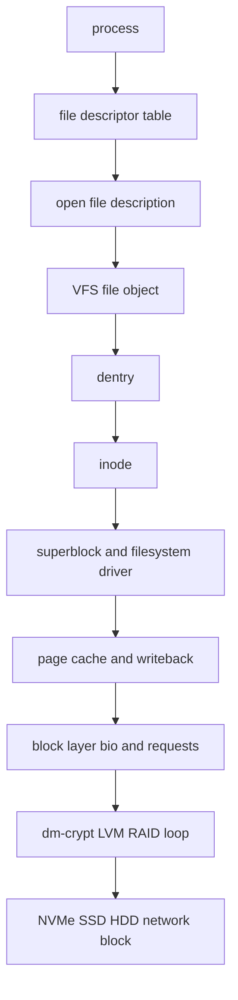
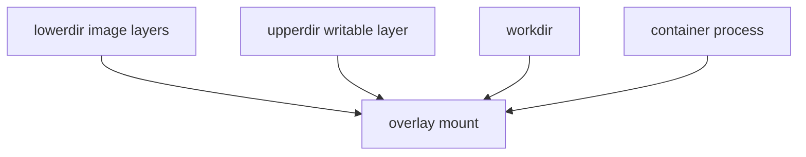
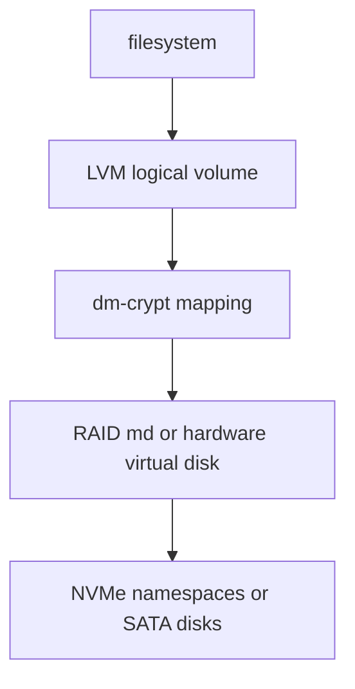

Purpose: Build an operator-grade mental model of Linux filesystems, VFS objects, block IO, page cache behavior, and storage layers so that local experiments stay educational and production storage changes stay deliberate.

Related: [Linux Systems Engineering](/compendium/linux-systems-engineering/linux-systems-engineering), [00 Linux Systems Mastery Roadmap](/compendium/linux-systems-engineering/linux-systems-mastery-roadmap), [05 Linux Networking TCP IP Routing Firewalling and DNS](/compendium/linux-systems-engineering/linux-networking-tcp-ip-routing-firewalling-and-dns)

# Field Model

Linux storage is a stack of contracts. A process sees file descriptors. The kernel maps descriptors to open file descriptions, VFS file objects, dentries, inodes, superblocks, filesystem drivers, block devices, request queues, device-mapper targets, controllers, and media. Bugs happen when an engineer debugs one layer with the assumptions of another.



On a local learning machine, you can create loop devices, corrupt scratch filesystems, remount read-only, run `fsck`, and watch writeback. On production hosts and clusters, treat every storage command as a change to durability, availability, blast radius, or recovery point. Prefer snapshots, maintenance windows, tested backups, and read-only inspection before repair.

# VFS Objects

The VFS gives Linux one syscall surface across many filesystem implementations. `open`, `stat`, `read`, `write`, `rename`, `chmod`, and `mount` do not know whether the backing filesystem is ext4, XFS, Btrfs, procfs, tmpfs, overlayfs, or a FUSE daemon. The VFS resolves paths through dentries, reaches inodes, and dispatches operations through filesystem-specific method tables.

| Object | What it represents | Operational consequence |
|---|---|---|
| File descriptor | Small per-process integer | Leaks exhaust `RLIMIT_NOFILE`; closing one duplicate may not close the underlying file object. |
| Open file description | System-wide open instance with offset and status flags | `dup`, `fork`, and descriptor passing can share offsets and append behavior. |
| Dentry | Cached name-to-inode relationship | Negative dentries speed misses; stale mental models arise when a path is renamed while FDs stay valid. |
| Inode | File object metadata and block mapping identity | Hard links share one inode; permissions and size live here, not in the directory entry. |
| Superblock | Mounted filesystem instance | Mount options, freeze, sync, quota, and filesystem health are superblock-level concerns. |

Example:

```bash
printf 'alpha\n' > demo
ln demo demo.hard
ln -s demo demo.sym
stat demo demo.hard demo.sym
exec 3<demo
rm demo
cat /proc/$$/fd/3
```

The open descriptor still refers to the old open file description even after the pathname is removed. The hard link keeps the inode reachable by another name. The symlink is a separate inode containing a path string.

# Names, Links, Permissions

A directory maps names to inode numbers. A hard link adds another directory entry to the same inode, subject to filesystem and directory rules. A symlink is an inode whose payload is a pathname resolved later. Hard links preserve identity. Symlinks preserve intention and may break.

Permissions are checked across the path and the target operation. Directory execute means search. Directory write plus execute controls create, unlink, and rename inside the directory. A file may be readable only if every parent directory is searchable. ACLs, idmapped mounts, capabilities, LSMs, immutable attributes, and read-only mounts can all override the simple mode-bit story.

Common mistakes:

| Mistake | Why it fails | Better habit |
|---|---|---|
| Debugging `EACCES` only with `ls -l file` | Parent directory search permission or ACL may block traversal. | Check `namei -l path`, `getfacl`, mount flags, and LSM denials. |
| Treating symlink ownership as access control | The target usually controls access. | Inspect target and path traversal. |
| Rotating logs with copy-and-truncate blindly | Writers may keep old descriptors or lose atomicity. | Prefer rename plus daemon reopen, or application-native rotation. |
| Assuming `rm` frees space immediately | Open unlinked files still consume blocks. | Use `lsof +L1` or inspect `/proc/*/fd`. |

# Mounts and Namespaces

A mount namespace is a view of mount points. Containers commonly combine mount namespaces, bind mounts, overlayfs, and propagation controls to present each workload with a tailored tree.

Bind mounts attach an existing tree at another path. They do not copy data. Recursive bind mounts can bring submounts along. Propagation controls decide whether later mount and unmount events flow between peers.

Overlayfs composes a lower read-only tree, an upper writable tree, and a work directory into one merged view. It is central to container image layers, but it is not a magic copy-on-write database. Rename, whiteouts, copy-up, inode identity, xattrs, and fsync behavior can surprise software that assumes a single ordinary filesystem.



Local learning:

```bash
mkdir -p lower upper work merged
printf base > lower/file
sudo mount -t overlay overlay -o lowerdir=lower,upperdir=upper,workdir=work merged
cat merged/file
printf changed > merged/file
find upper -maxdepth 2 -type f -print
sudo umount merged
```

Production and clusters: do not diagnose persistent data from inside only the merged container view. Check the host mount namespace, CSI or volume plugin, backing device, filesystem type, and mount options. In Kubernetes, distinguish image-layer overlayfs from PVC filesystems.

# Filesystem Choices

| Filesystem | Strengths | Tradeoffs | Production notes |
|---|---|---|---|
| ext4 | Mature, broadly supported, predictable recovery, good default for general Linux hosts. | Fixed inode tables at creation; feature set is conservative compared with Btrfs. | Watch inode exhaustion on small-file workloads; record `mkfs.ext4` options for rebuild parity. |
| XFS | Scales well for large filesystems, parallel allocation groups, strong metadata design. | Cannot shrink; repair workflows differ from ext4. | Common choice for large data volumes and enterprise Linux; use XFS-native tooling. |
| Btrfs | Copy-on-write, checksums, snapshots, subvolumes, send/receive, compression. | More policy surface; fragmentation and ENOSPC behavior need specific knowledge. | Useful where snapshots and integrity features are first-class; test workload fit and recovery runbooks. |
| overlayfs | Fast merged filesystem for containers and layered roots. | Copy-up and whiteouts change behavior; not a substitute for durable application storage. | Keep databases and durable state on real volumes, not writable image layers. |

Journaling usually protects filesystem metadata consistency, not necessarily the application-level fact that a transaction is durable. ext4 modes, XFS logging, device write caches, barriers, and application `fsync` strategy all matter. Btrfs copy-on-write changes the failure and performance profile: metadata and data checksums help detect corruption, but write amplification and fragmentation can matter.

# Block Devices and Storage Layers

Block devices expose fixed-size addressable sectors. Filesystems turn files into block mappings. Device mapper can transform block devices before the filesystem sees them.



Loop devices map a regular file as a block device. They are excellent for local learning and CI fixtures:

```bash
truncate -s 2G lab.img
sudo losetup --find --show lab.img
sudo mkfs.ext4 /dev/loopX
sudo mount /dev/loopX /mnt/lab
```

Do not treat loop-device performance as physical-disk performance. The loop file itself is mediated by a host filesystem and page cache.

LVM separates physical volumes, volume groups, and logical volumes. It gives flexible allocation, snapshots, and online growth paths, but it adds metadata and failure modes. RAID combines devices for redundancy, capacity, or performance. RAID is not backup: controller bugs, deletes, corruption, filesystem damage, and site loss can replicate quickly. `dm-crypt` provides block-level encryption; it protects offline media exposure, not a running root shell, mounted plaintext, or stolen application credentials.

# Page Cache and Writeback

The page cache is the kernel's cache of file-backed pages. Buffered reads populate it. Buffered writes usually dirty it and return before media persistence. Later, writeback sends dirty pages to the filesystem and block layer. Memory pressure can reclaim clean cache cheaply, but dirty pages must be written or discarded according to filesystem semantics.

Key commands:

```bash
free -h
grep -E 'Dirty|Writeback|Cached|MemAvailable' /proc/meminfo
cat /proc/sys/vm/dirty_ratio /proc/sys/vm/dirty_background_ratio
sync
```

`fsync(fd)` asks the kernel to persist file data and required metadata for that file. `fdatasync` narrows metadata requirements. For a durable create-then-rename pattern, applications often need to fsync the file and then fsync the containing directory. A database that ignores these rules can pass tests and still lose committed data after power loss.

Direct IO uses `O_DIRECT` to reduce page-cache effects. It is useful when an application has its own cache or needs more predictable cache residency, but alignment constraints and filesystem support matter. Direct IO is not automatically faster; it trades kernel caching for application responsibility.

`io_uring` is an asynchronous IO interface with submission and completion rings shared between user space and the kernel. It can reduce syscall overhead and support high-throughput designs, but it is not a universal latency fix. Queueing, filesystem support, registered buffers/files, polling flags, and completion handling determine whether it helps.

# IOPS, Throughput, Latency, Queue Depth

IOPS is operations per second. Throughput is bytes per second. Latency is time per operation. Queue depth is how many operations are outstanding. Storage devices often need concurrency to reach advertised throughput, but deeper queues can increase tail latency.

| Workload | Dominant pressure | Metric to watch | Typical failure mode |
|---|---|---|---|
| Tiny random reads | IOPS and latency | `iostat -x`, await, p99 read latency | CPU waits on storage despite low MB/s. |
| Large sequential backup | Throughput | MB/s, device utilization, queue size | Saturates bus or remote target; apps see slow fsync. |
| Sync-heavy database | fsync latency | p95/p99 commit latency, flushes | Good average throughput but bad transaction tails. |
| Small-file tree | Inodes, dentries, metadata IO | inode usage, slab, metadata ops | ENOSPC with free bytes remaining. |

Disk saturation is not only `%util == 100`. On multi-queue devices, `iostat` can hide per-queue behavior. Look for rising await, queue depth, writeback congestion, application stalls, throttling, controller errors, and filesystem logs. In clusters, also check networked storage latency, CSI events, node pressure, noisy neighbors, and replication state.

# Inode Exhaustion

Inode exhaustion is a distinct resource failure. ext4 commonly preallocates inode tables at mkfs time. A workload with millions of tiny files can hit `ENOSPC` while `df -h` shows free bytes.

```bash
df -h /var/lib/app
df -i /var/lib/app
find /var/lib/app -xdev -printf '%h\n' | sort | uniq -c | sort -nr | head
```

Local learning machines can be reformatted with a denser inode ratio. Production systems need workload-level fixes: compact small files, shard directories, move cache paths, expire objects, redesign artifact layout, or provision a filesystem suited to the object count.

# Troubleshooting Runbook

Start read-only:

```bash
findmnt -T /path
stat -f /path
df -hT /path
df -i /path
lsblk -o NAME,TYPE,SIZE,FSTYPE,MOUNTPOINTS,MODEL,SERIAL
cat /proc/self/mountinfo
dmesg -T | tail -200
```

Then separate symptoms:

| Symptom | First checks | Likely layer |
|---|---|---|
| `No space left on device` | `df -h`, `df -i`, project quota, Btrfs allocation, deleted-open files | Bytes, inodes, quota, COW metadata. |
| `Read-only file system` | `dmesg`, mount flags, storage errors, remount history | Filesystem protection after errors or deliberate policy. |
| High IO wait | `iostat -xz 1`, `pidstat -d 1`, dirty pages, app fsync rate | Device, writeback, or application sync pattern. |
| File vanished but process still writes | `/proc/PID/fd`, `lsof +L1` | Open file description still alive. |
| Container sees wrong files | `findmnt`, host namespace, bind propagation, overlay upperdir | Mount namespace or overlay behavior. |
| Corruption suspected | Stop writers, snapshot if possible, collect `dmesg`, run fsck on an unmounted copy | Filesystem or device integrity. |

Production guidance:

1. Preserve evidence before repair: `dmesg`, SMART/NVMe logs, mountinfo, filesystem metadata, storage-controller events.
2. Snapshot or clone before destructive repair when the storage layer supports it.
3. Do not run `fsck -y` on a mounted filesystem.
4. Do not benchmark a production volume during an incident unless you have capacity owner approval.
5. Document mount options and mkfs options as part of infrastructure state.
6. In clusters, map the application path to PVC, node mount, CSI driver, storage class, backing pool, and replication domain before changing anything.

# Production Patterns

Use local machines to learn by creating loop devices, small filesystems, artificial inode exhaustion, and temporary overlay mounts. Use production hosts to observe first, change second, and repair only with rollback. For critical data, the operational unit is not a filesystem but a recovery story: backups, restore tests, snapshots, consistency points, monitoring, capacity alerts, encryption-key custody, and disaster procedures.

For databases, prefer explicit storage recommendations from the database vendor and measure fsync latency under representative load. For container platforms, never assume writable container layers are durable. For multi-tenant clusters, make quotas and capacity alerts visible before tenants discover storage failure through application errors.

# Reference URLs

- https://docs.kernel.org/filesystems/vfs.html
- https://docs.kernel.org/filesystems/overlayfs.html
- https://docs.kernel.org/admin-guide/mm/concepts.html
- https://docs.kernel.org/filesystems/ext4/index.html
- https://docs.kernel.org/filesystems/xfs/index.html
- https://docs.kernel.org/filesystems/btrfs.html
- https://docs.kernel.org/block/index.html
- https://man7.org/linux/man-pages/man2/open.2.html
- https://man7.org/linux/man-pages/man2/io_uring_setup.2.html
- https://man7.org/linux/man-pages/man7/mount_namespaces.7.html
