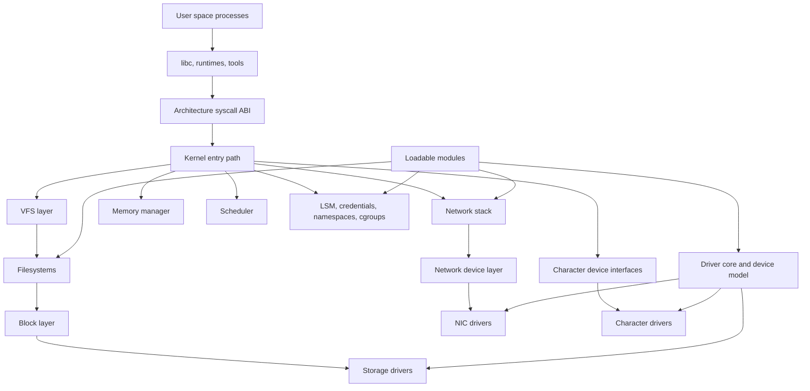
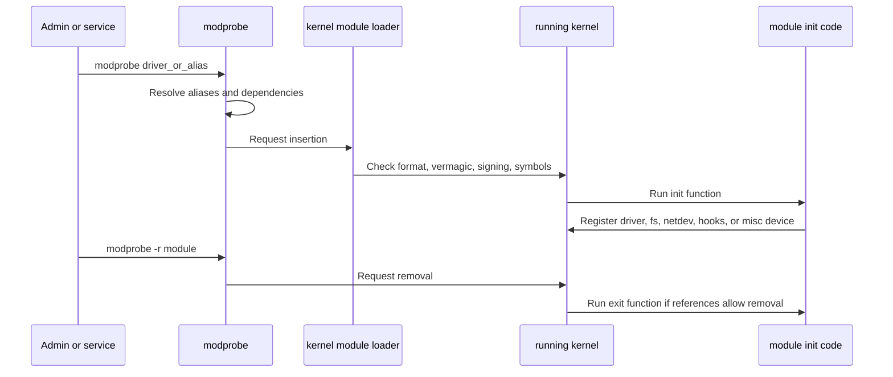
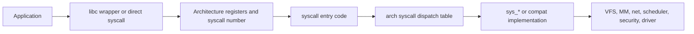
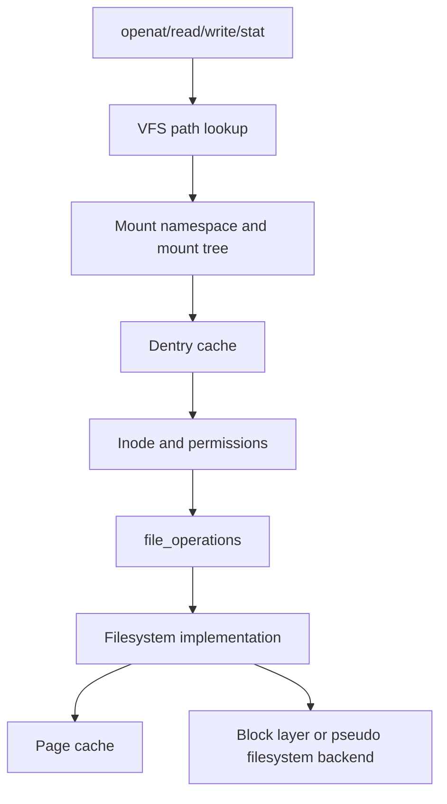
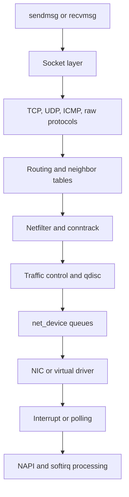
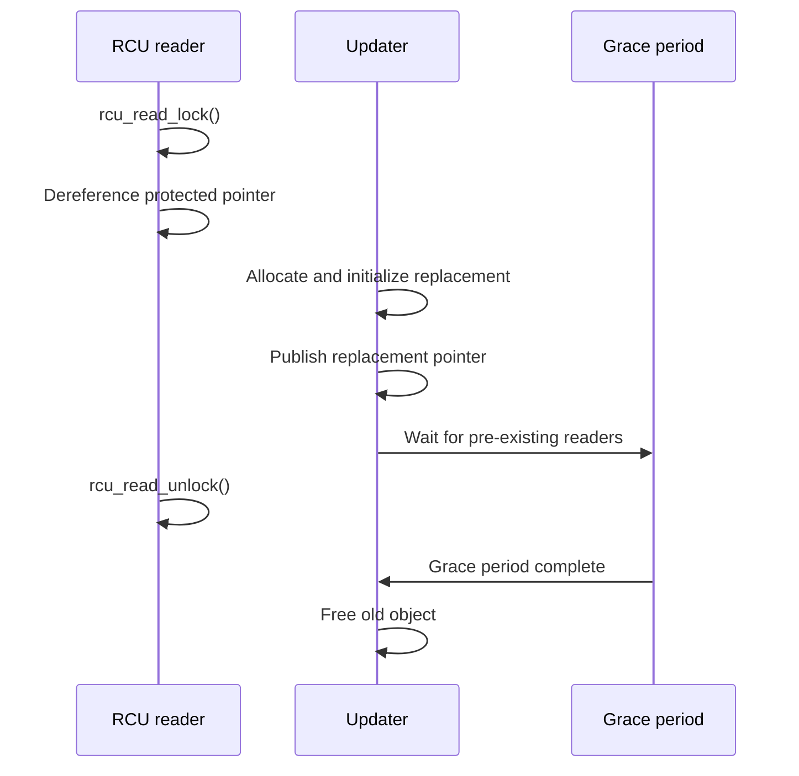
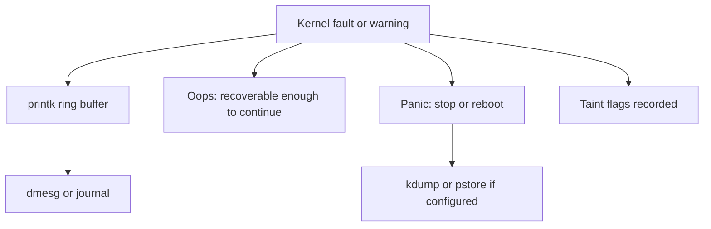
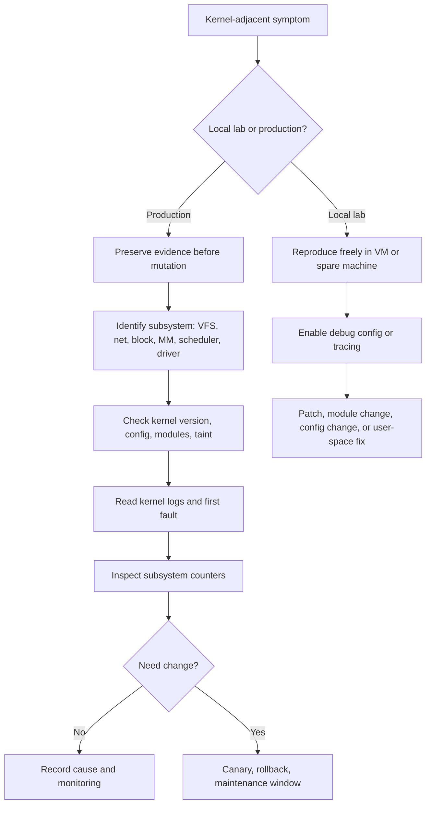

Purpose: Build a production-grade mental model of Linux kernel architecture, modules, drivers, subsystem boundaries, concurrency primitives, crash signals, configuration, and build discipline without treating kernel patching as a default operations tool.

# Kernel Architecture, Modules, Drivers, And Device Model

Related notes: [Linux Systems Engineering](/compendium/linux-systems-engineering/linux-systems-engineering), [01 Linux Mental Model User Space Kernel and Hardware](/compendium/linux-systems-engineering/linux-mental-model-user-space-kernel-and-hardware), [02 Processes Threads Scheduling Signals and Jobs](/compendium/linux-systems-engineering/processes-threads-scheduling-signals-and-jobs), [03 Memory Virtual Memory Paging Allocators and OOM](/compendium/linux-systems-engineering/memory-virtual-memory-paging-allocators-and-oom), [04 Filesystems VFS Block IO Page Cache and Storage](/compendium/linux-systems-engineering/filesystems-vfs-block-io-page-cache-and-storage), [05 Linux Networking TCP IP Routing Firewalling and DNS](/compendium/linux-systems-engineering/linux-networking-tcp-ip-routing-firewalling-and-dns), [06 System Calls ABI libc and User Kernel Boundaries](/compendium/linux-systems-engineering/system-calls-abi-libc-and-user-kernel-boundaries)

The Linux kernel is a privileged, shared, long-lived runtime. It is not a library linked into each application and it is not a microkernel that keeps most services in separate user-space servers. The practical model is a monolithic kernel with loadable modules: core subsystems, filesystems, protocol stacks, memory management, scheduling, security hooks, and drivers execute in one kernel address space, while modules can be inserted and removed at runtime if the build, policy, and current references allow it.

That model is powerful and unforgiving. A driver bug can corrupt unrelated kernel memory. A blocking call in atomic context can deadlock a host. A wrong lock order can freeze CPUs that have no relationship to the device being debugged. A local learning machine can tolerate experiments with custom kernels, unsigned modules, debug configs, and crash loops. A production host or cluster node cannot be treated that way: the node may be carrying customer traffic, persistent storage, CNI dataplane state, eBPF programs, kubelet responsibilities, hardware queues, and scheduler placement assumptions.

## Architecture Map



The important boundary is not "kernel code" versus "driver code". Device drivers are kernel code. Filesystems are kernel code. Network protocols are kernel code. Many features that look like optional plugins are compiled into the kernel image or loaded as modules, but once executing they run with kernel privilege and kernel failure modes.

## Monolithic Kernel Model

Linux keeps major operating-system services inside one kernel image and one kernel address space. System calls enter the kernel, perform work through internal subsystem interfaces, and return to user space. Internal kernel APIs are not stable in the same way user-kernel ABIs are stable. Distribution kernels may backport features, carry vendor patches, enable or disable config options, or expose module signing and lockdown policies that differ from upstream defaults.

| Property | Practical meaning | Field consequence |
| --- | --- | --- |
| Monolithic address space | Core kernel, built-in drivers, and loaded modules share privileged memory. | A bad module can corrupt state outside its apparent feature area. |
| Stable user-kernel ABI | Normal programs rely on documented syscalls, ioctls, procfs, sysfs, netlink, and device nodes. | Prefer user-space APIs over depending on internal symbols. |
| Unstable internal ABI | Internal structs, functions, and locking rules can change between kernel versions. | Out-of-tree modules carry ongoing maintenance risk. |
| Config-shaped behavior | `CONFIG_*` selections decide compiled code, debug features, hardening, and module support. | `uname -r` is not enough; inspect config and distro patch level. |
| Shared cluster kernel | Containers share the node kernel even when namespaces hide most global state. | A kernel bug or unsafe module is a node-wide and often cluster-wide risk. |

Local learning machine guidance: build kernels, toggle configs, crash VMs, load toy modules, read oops traces, and use debug options. Production guidance: prefer vendor-supported kernels, staged rollout, canaries, rollback entries, crash dump configuration, module allowlists, and observable success criteria before changing anything below user space.

## Modules

A module is an object file built for a specific kernel interface and configuration. It can provide a driver, filesystem, protocol, security feature, tracing helper, or other extension. Loading a module links it into the running kernel. The loader resolves exported symbols, checks version metadata when configured, applies relocation, runs module init code, and records the module in kernel state.

Common module commands:

```sh
uname -r
lsmod
modinfo ixgbe
modprobe vcan
modprobe -r vcan
insmod ./example.ko
rmmod example
depmod -a
cat /proc/modules
find /lib/modules/"$(uname -r)" -type f -name '*.ko*' | head
```

`modprobe` understands module aliases, dependency metadata, blacklists, install rules, and `/lib/modules/$(uname -r)`. `insmod` attempts to insert exactly the file you give it. In production, `modprobe` is usually the safer administrative tool because it uses the distribution's module dependency database. `insmod` belongs mostly in controlled development and break-glass debugging.

| Concern | Local learning machine | Production host or cluster |
| --- | --- | --- |
| Unsigned modules | Useful for learning module lifecycle. | Usually reject or tightly control through Secure Boot, lockdown, signing, and policy. |
| Out-of-tree modules | Good for understanding driver APIs. | Treat as kernel-adjacent supply chain and reliability risk. |
| Module unloading | Good for iteration. | Avoid unloading active storage, network, security, or filesystem modules unless a vendor runbook says it is safe. |
| Kernel taint | Acceptable during labs. | Capture taint state and expect upstream or vendor support to ask for reproduction without taint. |
| Version mismatch | Teaches vermagic and symbol versioning. | A deployment blocker, not something to force through. |

### Loading And Unloading Path



Unloading is not symmetric with loading. A module may refuse to unload because objects still hold references. Forced removal is a lab maneuver and a production hazard. A driver that is servicing block IO, owning a network interface, holding timers, exposing sysfs files, or waiting for asynchronous work can leave live callbacks behind if its teardown is wrong.

Common mistakes:

| Mistake | Failure mode | Better practice |
| --- | --- | --- |
| Loading a module built for a different kernel release | `Invalid module format`, unresolved symbols, or subtle ABI breakage. | Build against the exact headers and config for the target kernel. |
| Ignoring module parameters | Driver defaults surprise network, storage, or interrupt behavior. | Read `modinfo -p`, distro docs, and current `/sys/module/&lt;name&gt;/parameters`. |
| Treating `lsmod` absence as feature absence | Feature may be built in. | Check `/boot/config-*`, `/proc/config.gz`, sysfs, and subsystem evidence. |
| Removing a module to "reset" hardware | Host loses disks, NICs, or security hooks. | Use device-specific reset, maintenance windows, and vendor guidance. |
| Using DKMS blindly on cluster nodes | Module build changes node behavior outside image promotion. | Bake, sign, test, and roll out modules through the same node lifecycle as kernels. |

## Device Model

The Linux device model connects devices, buses, drivers, classes, firmware descriptions, hotplug, sysfs, and user-space device management. The core idea is binding: a device appears on a bus, the driver core matches it to a driver using IDs or firmware data, the driver's probe function initializes it, and user space sees a representation through sysfs, devtmpfs, netlink events, and sometimes `/dev` nodes created or labeled by udev.

```mermaid
flowchart LR
    Firmware[ACPI, Device Tree, PCI IDs, USB IDs] --> Bus[Bus type]
    Bus --> Device[struct device]
    Driver[struct device_driver] --> Match[match table or bus match]
    Device --> Match
    Match --> Probe[driver probe]
    Probe --> Resources[IRQ, DMA, MMIO, clocks, regulators]
    Probe --> Interfaces[netdev, block disk, char dev, input, hwmon, etc]
    Interfaces --> Sysfs[/sys]
    Interfaces --> Devtmpfs[/dev]
    Interfaces --> Udev[udev policy]
```

The device model is why the same NIC driver can bind when a PCI device appears at boot or when a hotplug device appears later. It is also why driver bugs often show as probe failures, deferred probes, missing firmware, DMA mapping errors, interrupt storms, or sysfs state that does not match operator expectation.

Production guidance:

| Task | Evidence to collect first |
| --- | --- |
| Device missing | `lspci -nn`, `lsusb`, `dmesg -T`, `/sys/bus/*/devices`, firmware logs. |
| Driver not bound | `modinfo`, `/sys/bus/*/drivers`, modalias, blacklists, kernel config, Secure Boot policy. |
| Probe failed | Kernel logs around probe, missing firmware, resource conflicts, ACPI or Device Tree data, IOMMU errors. |
| Hotplug unreliable | udev rules, power management, link state, cable or slot events, bus reset logs. |
| Cluster node differs | Node image, kernel version, module set, firmware package, BIOS settings, PCI topology, CNI or CSI daemonset state. |

## Character, Block, And Network Devices

Drivers expose different kernel interfaces depending on the resource being modeled.

| Device class | User-visible shape | Kernel path | Typical examples | Operational risk |
| --- | --- | --- | --- | --- |
| Character device | Byte stream or command interface under `/dev`. | `file_operations`, major/minor numbers, ioctl, read/write, mmap. | TTYs, serial ports, `/dev/kmsg`, GPUs, watchdogs, random devices, misc devices. | ioctls are often device-specific and can expose large privileged surfaces. |
| Block device | Random-access storage device with request queues. | Block layer, queue limits, bio, elevator or blk-mq, filesystem above. | NVMe, SCSI disks, loop devices, dm-crypt, LVM, mdraid. | Bugs can corrupt data, wedge IO, or trigger node-wide hangs in uninterruptible sleep. |
| Network device | Packet interface with link state and queues. | netdev, NAPI, qdisc, XDP, protocol stack, ethtool. | Ethernet NICs, veth, bridge, bond, VLAN, WireGuard, virtual CAN. | Driver or offload bugs can look like firewall, MTU, TLS, or application failures. |

Character devices are often narrow but sharp. A watchdog char device can reboot a host if mishandled. A GPU or accelerator char device may combine memory mapping, DMA, synchronization objects, and ioctls. A local lab can use toy char drivers to learn `open`, `read`, `write`, `poll`, and `ioctl`. In production, unknown char devices should be treated as privileged kernel-facing APIs.

Block devices sit below filesystems and page cache. They need correct queue limits, flush behavior, discard behavior, write barriers, error propagation, and hot removal handling. In clusters, a CSI stack, multipath setup, dm layer, cloud volume attachment, and node kernel all contribute to what looks like a single PVC symptom.

Network devices sit between hardware or virtual dataplanes and the protocol stack. NAPI polling, interrupt moderation, GRO/GSO/TSO, RSS, qdisc, XDP, and driver offloads can make a bug appear only under load. Local tests with `ip link`, `veth`, `bridge`, and `vcan` are useful, but production clusters add CNI policy, kube-proxy or eBPF service handling, overlay encapsulation, MTU constraints, and host firewall rules.

## Syscall Table Overview

The syscall table is the architecture-specific dispatch map from syscall numbers to kernel entry functions. User space does not call arbitrary kernel functions. It enters through an architecture ABI, passes a syscall number plus arguments, and the kernel dispatches to the implementation for that syscall number.



The syscall table is useful for understanding tracing, seccomp filters, audit events, and architecture differences. It is not a production extension point. Hooking syscall tables is associated with rootkits, brittle observability, and unsupported modules. Modern instrumentation should prefer tracepoints, kprobes with care, eBPF where appropriate, LSM hooks where intended, audit, perf, or documented subsystem APIs.

For boundary details, connect this note to [06 System Calls ABI libc and User Kernel Boundaries](/compendium/linux-systems-engineering/system-calls-abi-libc-and-user-kernel-boundaries). The production lesson is simple: syscalls are stable contracts; internal syscall implementation details are not.

## VFS Layer

The Virtual Filesystem layer gives Linux a common file model across ext4, XFS, tmpfs, procfs, sysfs, overlayfs, network filesystems, block-backed filesystems, and device-backed special files. VFS handles path lookup, dentries, inodes, superblocks, mount namespaces, open file descriptions, file operations, permissions, and delegation to filesystem-specific methods.



VFS is why "everything is a file" is useful but incomplete. A path may name a regular file, directory, procfs attribute, sysfs control, socket, FIFO, char device, block device, or overlay object. The same `read` syscall can hit page cache, a driver callback, a procfs generator, or a network filesystem.

Common mistakes:

| Mistake | Why it fails |
| --- | --- |
| Debugging an open path without checking mount namespace | The process may see a different mount tree from the shell. |
| Treating `/proc` values as stable file formats | Many are diagnostic interfaces, not strict application APIs. |
| Assuming block device health from filesystem symptoms only | Page cache, journal, IO scheduler, dm layer, and device driver may all be involved. |
| Ignoring dentry and inode caching | Deleted files can stay open and consume space until the last FD closes. |

## Network Stack

The network stack connects socket syscalls, protocol state, routing, neighbor discovery, netfilter, traffic control, device queues, NAPI, drivers, and hardware offloads. Packets may be processed by softirqs, ksoftirqd, qdisc code, XDP, tc, conntrack, tunnels, and virtual devices before an application sees a byte.



Production guidance:

| Symptom | Kernel-side angles |
| --- | --- |
| High packet loss | NIC ring drops, qdisc drops, conntrack table pressure, GRO/offload behavior, driver errors, MTU. |
| High CPU in softirq | NAPI budget, interrupt affinity, RSS, RPS/XPS, packet rate, firewall rules, encapsulation. |
| Latency spikes | Coalescing, qdisc backlog, ksoftirqd scheduling, lock contention, power management, CPU isolation mistakes. |
| Cluster service failure | CNI device graph, eBPF or iptables service rules, overlay MTU, node conntrack, host routing policy. |

On a local learning machine, virtual devices are excellent: `ip link add veth0 type veth peer name veth1`, `ip link add br0 type bridge`, `modprobe vcan`. On production nodes, virtual devices are owned by a runtime or CNI. Do not delete interfaces, flush qdiscs, or unload drivers without knowing which daemon will reconcile or break afterward.

## Memory Manager

The memory manager owns virtual memory, page allocation, reclaim, swap, NUMA policy, memory cgroups, slab caches, huge pages, page tables, and user-kernel copy boundaries. Kernel code must be explicit about allocation context. `GFP_KERNEL` can sleep and reclaim; atomic contexts need different flags and smaller ambitions. User pointers are not kernel pointers and must go through the correct access helpers.

Important production distinctions:

| Area | What it means | Failure mode |
| --- | --- | --- |
| Page allocator | Allocates physical pages under constraints. | Allocation failure, reclaim stalls, compaction stalls, OOM. |
| Slab or SLUB | Caches kernel objects. | Leaks, use-after-free, fragmentation, cache pressure. |
| vmalloc | Virtually contiguous kernel memory. | TLB overhead, limited address-space areas, not always suitable for DMA. |
| DMA memory | Device-visible memory with mapping rules. | Data corruption if cache coherency and IOMMU rules are wrong. |
| memcg | Per-cgroup accounting and limits. | Container OOM while host has free memory. |
| User copy | Controlled copy between user and kernel address spaces. | `EFAULT`, security bugs, sleeping in invalid context. |

For broader memory operations, see [03 Memory Virtual Memory Paging Allocators and OOM](/compendium/linux-systems-engineering/memory-virtual-memory-paging-allocators-and-oom). Kernel development adds stricter context rules: before allocating or copying, ask whether the current code can sleep, whether it holds a spinlock, whether it runs in interrupt or softirq context, whether reclaim can recurse into this path, and whether the memory must be DMA-capable.

## Scheduler And Kernel Threads

The scheduler chooses runnable tasks for CPUs. In Linux, tasks include normal user-space threads and kernel threads. Kernel threads have `comm` names such as `kworker/*`, `ksoftirqd/*`, `rcu*`, `migration/*`, `watchdog/*`, `jbd2/*`, and driver-specific workers. They do not have a normal user-space memory image, but they are scheduled entities and can consume CPU, block, inherit priority rules, and show up in `ps`, `top`, `perf`, and traces.

| Kernel thread family | What it usually signals |
| --- | --- |
| `kworker/*` | Workqueue execution. High CPU means queued kernel work, not automatically a scheduler bug. |
| `ksoftirqd/*` | Softirq processing overflow or threaded softirq work under load. |
| `rcu*` | RCU callback, grace period, or offload activity. |
| `jbd2/*` | ext4 journal work. Can indicate storage latency or writeback pressure. |
| `watchdog/*` | Lockup detection. |
| `irq/*` | Threaded interrupt handlers. |

Troubleshooting high kernel-thread CPU:

```sh
ps -eLo pid,tid,comm,psr,stat,pcpu,wchan:24 | sort -k6 -nr | head
cat /proc/softirqs
cat /proc/interrupts
perf top -g
cat /sys/kernel/debug/workqueue/* 2>/dev/null | head
```

Production caution: `perf`, ftrace, debugfs, and eBPF tracing may require elevated privileges and can expose sensitive data. Use bounded windows and avoid changing scheduler tunables on cluster nodes unless the workload owner and node owner both understand the blast radius.

## RCU Overview

RCU means Read-Copy-Update. It is a synchronization family optimized for read-mostly data. Readers run with very low overhead inside RCU read-side critical sections. Updaters publish a new version, remove or replace old references carefully, then wait for a grace period before freeing memory that old readers might still hold.



RCU is not a general replacement for locks. It is excellent when reads dominate, readers need low overhead, and updates can tolerate copy-and-publish discipline. It is dangerous when developers forget object lifetime, mix RCU and normal locking without a clear ownership rule, or free memory before a grace period.

| Pattern | Use RCU? | Reason |
| --- | --- | --- |
| Read-mostly routing or lookup table | Often yes | Readers stay fast while updates publish new state. |
| Short mutable counter | Usually no | Atomic operations or per-CPU counters are simpler. |
| Complex multi-field mutation | Maybe with locks | RCU can protect lookup while another lock protects mutation. |
| Blocking operation inside read-side critical section | Be careful | Rules vary by RCU flavor and kernel config. |

## Locking Primitives

Kernel locking starts with context. Can this code sleep? Can it run in hard IRQ, softirq, tasklet, timer, workqueue, syscall, or kernel-thread context? Can the same data be touched from another CPU? Does the lock protect data or merely surround code?

| Primitive | Sleeps? | Typical use | Bad fit |
| --- | --- | --- | --- |
| Spinlock | No | Short critical sections that may be used where sleeping is forbidden. | Long operations, memory allocation with sleep, user copy, calling unknown callbacks. |
| Mutex | Yes | Process context or kernel thread paths that may block. | Interrupt, softirq, tasklet, or spinlock-held paths. |
| Atomic operation | No | Simple counters, flags, reference transitions, bit operations. | Compound invariants that need multiple fields to change together. |
| RCU | Readers do not normally block | Read-mostly pointer-protected data with deferred freeing. | General mutual exclusion or write-heavy state. |
| rwsem/rwlock | Depends on type | Reader-writer protection when read sections justify complexity. | Short sections where simple spinlock or mutex is enough. |
| seqlock/seqcount | Writers serialize, readers retry | Small data read consistently, such as time-like state. | Data containing pointers that readers cannot safely retry around. |

Spinlocks are about atomic context and CPU-level exclusion. Holding a spinlock while doing expensive work is a latency bug. Holding a spinlock while calling code that might sleep is a correctness bug. `spin_lock_bh()` disables softirqs on the local CPU before taking the lock. `spin_lock_irqsave()` saves interrupt state and disables interrupts before locking, which is useful when the same lock can be touched from interrupt context.

Mutexes are sleeping locks. If a mutex is contended, the task can block and the scheduler can run something else. That makes mutexes efficient for longer process-context critical sections, but invalid from hard IRQ and softirq context. If code path context is uncertain, prove it before choosing a mutex.

Atomic operations are not tiny locks. They are useful when the invariant fits into the atomic operation. If a state transition needs "increment this, add to list, check flag, publish pointer", a single atomic counter does not protect the whole invariant.

Common locking mistakes:

| Mistake | Result |
| --- | --- |
| Taking the same non-recursive lock twice | Deadlock. |
| Holding a spinlock across `copy_to_user` or `copy_from_user` | Sleep-in-atomic bugs or lockups. |
| Calling arbitrary callbacks with a lock held | Lock-order inversion and subsystem deadlocks. |
| Protecting code instead of data | Future changes bypass the real invariant. |
| Assuming uniprocessor tests prove locking | `CONFIG_SMP`, `CONFIG_PREEMPT`, and real interrupt timing expose bugs. |
| Forgetting lockdep in development kernels | Missed lock-order bugs before production. |

## Deferred Work: Workqueues, Softirqs, Tasklets, And Threads

Kernel work often cannot be done at the moment an event arrives. Interrupt handlers need to finish quickly. Some work must run soon but cannot sleep. Other work may sleep and should run in process context. Linux provides several deferred execution mechanisms.

| Mechanism | Context | Can sleep? | Typical use | Production note |
| --- | --- | --- | --- | --- |
| Softirq | Softirq context, per-CPU, high priority. | No | Networking receive/transmit, timers, block completions, RCU callbacks. | High softirq load can starve normal work until pushed into `ksoftirqd`. |
| Tasklet | Built on softirq semantics, serialized per tasklet. | No | Legacy deferred driver work. | The API is deprecated in current kernel headers; prefer modern alternatives for new work. |
| Workqueue | Kernel worker thread or BH workqueue depending on type. | Threaded work can sleep. | Driver and subsystem asynchronous work. | Use dedicated workqueues when producers can flood or reclaim paths need forward progress. |
| Threaded IRQ | IRQ work in a schedulable kernel thread. | Thread function can sleep subject to IRQ rules. | Drivers that need lower hard-IRQ latency or RT-friendly handling. | Prefer for many modern driver interrupt designs. |
| Kernel thread | Dedicated schedulable task. | Yes, in normal process context. | Long-lived subsystem loops, daemons, special scheduling needs. | More explicit lifecycle and resource ownership than generic workqueue items. |

Softirqs are fast and constrained. They are appropriate for high-frequency paths such as network packet processing, but they make latency and CPU accounting less intuitive. `ksoftirqd/N` running hot means the system is spending significant time on deferred kernel work for CPU N, not that `ksoftirqd` itself is the root cause.

Tasklets are legacy. Existing drivers may still use them, but new designs should normally choose threaded interrupts, workqueues, timers, NAPI, or subsystem-specific mechanisms. The replacement depends on required context: choose threaded IRQs for interrupt work that should be schedulable, workqueues for sleepable asynchronous work, and softirq/NAPI only when the performance and context constraints justify it.

Workqueues are the common asynchronous execution API. Modern concurrency-managed workqueues share worker pools and regulate concurrency. Use `WQ_MEM_RECLAIM` when work participates in memory reclaim paths. Do not dump unbounded producer work into a system workqueue and assume fairness will save you.

## Kernel Panics, Oops, Taint, And Logs

An oops is a kernel-detected fault where the kernel may kill the current task and continue. A panic is a decision that the system cannot safely continue. A warning is diagnostic evidence, not necessarily a crash. A tainted kernel is one whose state includes events that may affect debugging trust, such as proprietary modules, forced module operations, machine checks, or prior warnings depending on flags.



Kernel logs are emitted through `printk` and stored in the kernel log buffer, visible through `/dev/kmsg`, `dmesg`, and often journald. Console log level controls what reaches the console immediately; it does not decide whether a message exists in the ring buffer. Excessive logging in hot paths can create its own latency or lockup risks, especially with slow consoles.

Commands for incident capture:

```sh
uname -a
cat /proc/sys/kernel/tainted
dmesg -T --level=err,warn,crit,alert,emerg
journalctl -k -b
cat /proc/modules
cat /proc/cmdline
zcat /proc/config.gz 2>/dev/null | head
```

Production guidance:

| Signal | What to do |
| --- | --- |
| Oops | Preserve full trace, modules list, taint state, kernel version, workload context, and recent hardware or driver changes. |
| Panic | Confirm crash dump or pstore capture, node reboot policy, fencing behavior, and whether the cluster rescheduled workload safely. |
| Taint | Decode flags and reproduce without taint when seeking upstream or vendor support. |
| Repeated WARN | Treat as a bug signal if correlated with workload or later failure. |
| Log flood | Rate-limit the source, reduce console verbosity, and capture bounded evidence before the log flood hides the first fault. |

On local learning machines, enable crash-friendly settings and practice reading traces. On production clusters, configure kdump or pstore before incidents, make node replacement routine, and avoid "debug by reboot loop" because it destroys first-failure evidence.

## Kernel Config And Build Overview

Kernel behavior is selected at build time through Kconfig symbols, Makefiles, architecture support, compiler choices, and distribution patches. A config option may build code in, build it as a module, or omit it. The same apparent version can behave differently across distributions because of backports and config choices.

Useful config evidence:

```sh
uname -r
cat /boot/config-"$(uname -r)" 2>/dev/null | grep CONFIG_MODULES
zcat /proc/config.gz 2>/dev/null | grep CONFIG_PREEMPT
modinfo module_name
```

High-level build flow for a local or lab kernel:

```sh
git clone https://git.kernel.org/pub/scm/linux/kernel/git/stable/linux.git
cd linux
make olddefconfig
make menuconfig
make -j"$(nproc)"
make modules
sudo make modules_install
sudo make install
```

External module builds require a prepared or built kernel tree with matching headers and configuration. `modules_prepare` prepares enough for many external module builds, but a full kernel build is needed for some versioning artifacts. Production module builds should be reproducible, signed when policy requires it, tied to the exact target kernel, and promoted with the node image or package pipeline.

| Build choice | Local learning machine | Production host or cluster |
| --- | --- | --- |
| Upstream vanilla kernel | Excellent for learning subsystem behavior. | Usually not the operational default unless your org owns kernel support. |
| Distro kernel source | Good for understanding real host behavior. | Preferred when support contract and patch stream matter. |
| Debug config | Useful for lockdep, KASAN, KCSAN, tracing labs. | Use canaries or dedicated debug nodes because overhead and behavior change. |
| Custom patch | Acceptable in a disposable VM. | Requires design review, security review, rollback, crash capture, performance testing, and owner signoff. |
| External module | Good for driver API learning. | Treat as production code with kernel-level blast radius. |

## When Not To Patch The Kernel

Do not patch the kernel just because the kernel is where a symptom appears. Many production kernel symptoms are caused by user-space policy, firmware, hardware, config, limits, or workload shape.

Prefer these before a kernel patch:

| Need | Usually better first move |
| --- | --- |
| Observe application behavior | `strace`, perf, tracepoints, eBPF tracing, logs, metrics. |
| Enforce service policy | systemd unit settings, cgroups, namespaces, seccomp, LSM policy. |
| Filter traffic | nftables, tc, XDP/eBPF, CNI policy, load balancer config. |
| Add device support | Vendor-supported kernel, firmware update, existing driver, distro backport. |
| Fix performance | Tune workload, IRQ affinity, queue depth, sysctls, scheduler class, storage layout. |
| Work around kernel bug | Upgrade to supported kernel or apply vendor patch before carrying private code. |

Patch the kernel only when the required behavior truly belongs in kernel space, no supported interface can express it, the change can be tested across relevant hardware and workloads, and the team is prepared to own security, crash, performance, and upgrade consequences.

## Troubleshooting Field Flow



Practical triage checklist:

| Question | Why it matters |
| --- | --- |
| Did the first kernel log line precede all later noise? | Later traces may be consequences. |
| Is the kernel tainted? | Supportability and root-cause confidence change. |
| Is the feature built in or loaded as a module? | `lsmod` is incomplete for built-in code. |
| Which context failed: syscall, workqueue, softirq, IRQ, kthread? | Determines whether sleeping, locking, and allocation behavior are valid. |
| Is this host a cluster node? | Kubelet, CNI, CSI, containerd, eBPF agents, and daemonsets may own the state. |
| Can the issue be reproduced on an untainted supported kernel? | This is often the threshold for vendor or upstream action. |

## Primary References

- Linux kernel workqueues: https://docs.kernel.org/core-api/workqueue.html
- Linux driver core infrastructure: https://docs.kernel.org/driver-api/infrastructure.html
- Linux kernel RCU requirements: https://docs.kernel.org/RCU/Design/Requirements/Requirements.html
- Linux lock types and rules: https://docs.kernel.org/locking/locktypes.html
- Linux mutex design: https://docs.kernel.org/locking/mutex-design.html
- Linux locking guide: https://docs.kernel.org/kernel-hacking/locking.html
- Linux tainted kernels guide: https://docs.kernel.org/admin-guide/tainted-kernels.html
- Linux kernel bug hunting guide: https://docs.kernel.org/admin-guide/bug-hunting.html
- Linux printk basics: https://docs.kernel.org/core-api/printk-basics.html
- Linux external module builds: https://docs.kernel.org/kbuild/modules.html
- Linux Kconfig targets and editors: https://docs.kernel.org/kbuild/kconfig.html
- Linux kernel Makefiles: https://docs.kernel.org/kbuild/makefiles.html
- Linux trimmed kernel build guide: https://docs.kernel.org/admin-guide/quickly-build-trimmed-linux.html
- Linux VFS overview: https://docs.kernel.org/filesystems/vfs.html
- Linux networking documentation index: https://docs.kernel.org/networking/index.html
- Linux scheduler documentation index: https://docs.kernel.org/scheduler/index.html
- Linux memory management APIs: https://docs.kernel.org/core-api/mm-api.html
- Current Linux tasklet header status: https://github.com/torvalds/linux/blob/master/include/linux/interrupt.h
