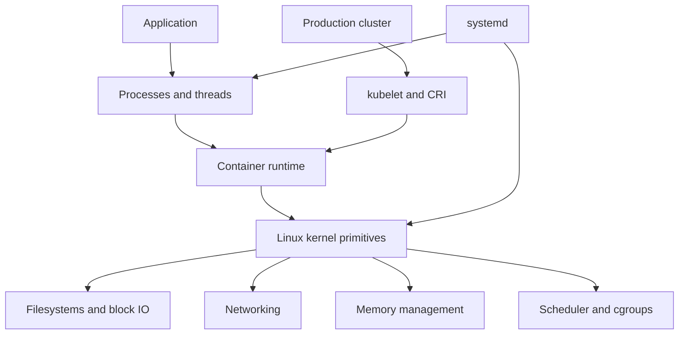

Purpose: Turn Linux systems engineering into a practical tool map and project sequence that is safe on local learning machines, disciplined on production Linux hosts, and realistic for production clusters.

Related notes: [09 cgroups Namespaces Containers and Runtime Isolation](/compendium/linux-systems-engineering/cgroups-namespaces-containers-and-runtime-isolation), [17 Production Operations Troubleshooting and Runbooks](/compendium/linux-systems-engineering/production-operations-troubleshooting-and-runbooks)

# Operating Position

Tools are only useful when you know their failure domain. A local learning machine is for destructive experiments, kernel feature exploration, and repeatable break-fix drills. A production Linux host is for narrow, audited observation and reversible repair. A production cluster is for declarative changes, node isolation, orchestrator-native evidence, and controlled replacement.

The learning objective is not to memorize commands. It is to recognize which layer owns the symptom:

# Tool Map

| Domain | First tools | Deeper tools | Production caution |
| --- | --- | --- | --- |
| Process state | `ps`, `top`, `pidstat`, `pstree`, `/proc/$pid` | `strace`, `perf`, `gdb`, `/proc/$pid/stack` | Tracing can slow or perturb critical processes. |
| CPU | `uptime`, `mpstat`, `pidstat`, `top` | `perf top`, `perf record`, flame graphs, eBPF profilers | Sampling overhead and symbol handling matter on busy hosts. |
| Memory | `free`, `vmstat`, `/proc/meminfo`, `pmap` | PSI, heap dumps, cgroup memory files, `smem` | Heap dump collection can be large and sensitive. |
| Disk space | `df`, `du`, `findmnt`, `lsof +L1` | filesystem debug tools, runtime GC tools | Deleting unknown files can corrupt services or erase evidence. |
| Block IO | `iostat`, `lsblk`, `blkid` | `blktrace`, `bpftrace`, vendor telemetry | Storage commands can be destructive; read man pages before repair modes. |
| Networking | `ip`, `ss`, `dig`, `curl`, `tcpdump` | `nft`, `iptables-save`, `conntrack`, `ethtool`, eBPF datapath tools | Packet capture can expose secrets and customer data. |
| TLS | `openssl s_client`, `curl -v`, `date` | CA store inspection, service mesh tooling | Do not disable verification as a fix. |
| systemd | `systemctl`, `journalctl`, `systemd-analyze` | unit drop-ins, coredumpctl, resource controls | Emergency drop-ins must be removed after incident. |
| Containers | `podman`, `docker`, `nerdctl`, `crictl`, `ctr` | `runc`, `nsenter`, cgroup files, runtime logs | `ctr` and runtime internals can bypass orchestrator expectations. |
| Kubernetes node | `kubectl describe`, events, logs | `crictl`, kubelet logs, CNI logs, node shell | Prefer cordon and drain before node-level mutation. |

# Local Learning Machine vs Production Host vs Cluster

| Practice | Local learning machine | Production Linux host | Production cluster |
| --- | --- | --- | --- |
| Namespace experiments | Use `unshare`, `nsenter`, rootless Podman, disposable VMs. | Observe namespaces with `/proc` and `nsenter` only when needed. | Use debug containers or node debug workflow under policy. |
| cgroup experiments | Use `systemd-run`, `stress-ng`, direct cgroup files. | Prefer systemd unit properties or runtime-owned cgroups. | Change pod resources and node config declaratively. |
| Network breaks | Add bad routes, DNS failures, MTU mismatch in lab. | Use timed rollback and console access. | Use scoped NetworkPolicy or test namespaces. |
| Storage breaks | Fill disks, exhaust inodes, corrupt throwaway filesystems. | Preserve evidence and escalate before repair. | Replace or cordon nodes when runtime storage is suspect. |
| Runtime internals | Use `runc`, `ctr`, `crictl` freely on lab nodes. | Use read-only inspection first. | Avoid bypassing kubelet except during node incident response. |

# Containers And Runtime Tools

Use [09 cgroups Namespaces Containers and Runtime Isolation](/compendium/linux-systems-engineering/cgroups-namespaces-containers-and-runtime-isolation) as the conceptual base. The tools below reveal different layers of the same container.

| Tool | Best use | Trap |
| --- | --- | --- |
| `podman` | Rootless local containers, pods, image builds, systemd integration. | Rootless behavior can differ from production rootful clusters. |
| `docker` | Common developer workflow and image packaging. | Desktop environments hide Linux VM details. |
| `nerdctl` | containerd-native Docker-like workflow. | It exposes containerd concepts that may differ from Docker assumptions. |
| `ctr` | Low-level containerd inspection and debugging. | Not a friendly operational interface; can bypass higher-level contracts. |
| `crictl` | Kubernetes CRI node inspection. | Requires runtime endpoint and node access; not a replacement for `kubectl`. |
| `runc` | OCI runtime learning and reproduction. | Too low-level for routine production operations. |
| `nsenter` | Enter existing process namespaces. | Enter only the namespaces needed; full entry can distort context. |
| `unshare` | Create namespaces for experiments. | Lab-only unless you are writing a runtime or controlled service. |

Local project: build an OCI bundle by hand.

1. Create a rootfs from a tiny image or directory.
2. Generate or write an OCI config.
3. Run it with `runc`.
4. Inspect `/proc/$pid/ns`, `/proc/$pid/cgroup`, and mounts from host and inside.
5. Repeat with added network namespace, read-only rootfs, dropped capabilities, and a cgroup memory limit.

Production lesson: the same primitives are present under kubelet, containerd, CRI-O, and runc, but the right control surface is usually Kubernetes or systemd, not manual runtime commands.

# cgroup And Resource Projects

Project 1: CPU throttling lab.

1. Run a CPU-bound process under `systemd-run --scope` or a transient service.
2. Apply a CPU quota.
3. Watch `cpu.stat`, latency, and throughput.
4. Remove the quota and compare.

Project 2: cgroup OOM lab.

1. Run a memory allocator under a low memory max.
2. Watch `memory.current`, `memory.events`, `dmesg`, and exit code.
3. Repeat with swap behavior if enabled.
4. Compare process OOM, cgroup OOM, and host OOM language.

Project 3: pids controller lab.

1. Run a controlled fork or thread generator.
2. Set `pids.max`.
3. Observe failed forks and `pids.events`.
4. Connect the behavior to web workers, thread pools, and runaway process supervisors.

Tradeoff table:

| Control | Good for | Risk |
| --- | --- | --- |
| CPU quota | Hard tenant ceiling. | Latency from throttling. |
| CPU weight | Fair sharing under contention. | No strict cap. |
| Memory max | Protect host and neighbors. | OOM if working set bursts. |
| Memory low or min | Protect important workload memory. | Can starve lower-priority work. |
| IO max | Prevent noisy IO tenant. | Can stretch recovery and batch jobs. |
| cpuset | Isolation and NUMA-aware workloads. | Fragmented capacity and poor scheduler flexibility. |

# systemd Learning Projects

systemd is the normal production entry point for Linux services. Learn it as a service manager, dependency graph, cgroup manager, log index, and boot coordinator.

Project: production-shaped service.

1. Write a small service with `ExecStart`, `Restart`, `RestartSec`, `User`, `Group`, `WorkingDirectory`, and environment file.
2. Add `ReadWritePaths`, `ProtectSystem`, `PrivateTmp`, `NoNewPrivileges`, and capability restrictions.
3. Add resource controls such as `MemoryMax` and `CPUQuota`.
4. Break the binary path and observe `status=203/EXEC`.
5. Create a restart loop and observe start-limit behavior.
6. Use a drop-in override, then remove it.

Operational lesson: a production service is more than a process. It has dependencies, restart semantics, resource policy, sandboxing, logs, and boot ordering. See [17 Production Operations Troubleshooting and Runbooks](/compendium/linux-systems-engineering/production-operations-troubleshooting-and-runbooks) for incident handling.

# Filesystem And Storage Projects

Project: disk full without data loss.

1. Create a loopback filesystem in a file.
2. Mount it in a lab VM or container with appropriate privileges.
3. Fill it with large files and many small files separately.
4. Compare `df -h` and `df -ih`.
5. Open a file, delete it, and observe `lsof +L1`.
6. Practice logrotate on the mounted filesystem.

Project: mount failure.

1. Add a bad test `fstab` entry in a disposable VM.
2. Boot into rescue or emergency mode.
3. Fix the entry, run `findmnt --verify`, and reboot.

Production lesson: storage is where "quick cleanup" becomes data loss. Before deleting, know ownership, service semantics, backup state, and whether the file is still open.

# Network Projects

Project: namespace network path.

1. Create a network namespace.
2. Add a veth pair.
3. Assign IP addresses and routes.
4. Enable forwarding and NAT in a lab.
5. Break DNS, route, MTU, and firewall one at a time.
6. Observe with `ip`, `ss`, `tcpdump`, `nft`, and `conntrack`.

Project: TLS failure matrix.

1. Run a local HTTPS server with a self-signed certificate.
2. Test wrong name, expired cert, missing CA, and wrong SNI.
3. Use `openssl s_client` and `curl -v`.
4. Add a reverse proxy and compare frontend vs backend TLS.

Production lesson: packet path evidence is namespace-specific. In clusters, pod namespace, node namespace, CNI datapath, service translation, DNS, ingress, and egress policy can all produce the same application timeout.

# Observability And Evidence Tools

| Evidence | Tooling | What it answers |
| --- | --- | --- |
| Kernel messages | `dmesg`, `journalctl -k` | OOM, blocked tasks, device errors, panics, LSM denials. |
| Unit logs | `journalctl -u`, app logs | Service lifecycle and application failure. |
| Metrics | Prometheus node exporter, cAdvisor, kubelet metrics, systemd-exporter | Trends, saturation, pressure, restarts. |
| Traces | OpenTelemetry, service mesh telemetry | Request path and dependency latency. |
| Profiles | `perf`, eBPF profilers, language profilers | Hot code paths and kernel time. |
| Events | Kubernetes events, audit logs, cloud events | Scheduling, eviction, policy, infrastructure change. |

Do not confuse metrics with evidence. Metrics show shape and timing. Logs show events and messages. Profiles show where time goes. Runtime state shows what the kernel is enforcing now.

# Cluster Learning Projects

Use a disposable cluster such as kind, minikube, k3d, or a temporary VM-based cluster. Do not use a shared production cluster for failure drills.

Project: Kubernetes resource behavior.

1. Deploy a workload with requests but no limits.
2. Add CPU limit and observe throttling.
3. Add memory limit and trigger OOMKilled.
4. Inspect pod events, kubelet logs if available, and cgroup files on the node.
5. Compare Guaranteed, Burstable, and BestEffort behavior.

Project: runtime and image path.

1. Pull an image by tag and by digest.
2. Inspect image layers and node image cache.
3. Break registry credentials.
4. Fill image filesystem in a lab node and observe eviction signals.

Project: CNI and DNS.

1. Deploy two namespaces and services.
2. Apply NetworkPolicy to break selected paths.
3. Break DNS search assumptions with intentionally ambiguous names.
4. Capture from pod namespace and node namespace.

Production lesson: Kubernetes is a desired-state and scheduling system over Linux primitives. When the kernel refuses memory, IO, pids, mounts, or syscalls, the cluster reports symptoms but the node enforces the boundary.

# Common Mistakes

| Mistake | Better habit |
| --- | --- |
| Learning only distro commands, not `/proc`, `/sys`, and kernel semantics. | Tie every command to the kernel object it reads or changes. |
| Practicing destructive repairs on a daily workstation. | Use disposable VMs, snapshots, and loopback filesystems. |
| Treating Docker Desktop as equivalent to a production Linux host. | Learn on a real Linux VM or lab node too. |
| Assuming Kubernetes hides Linux. | Use Kubernetes to manage Linux primitives, then inspect the node when needed. |
| Memorizing one CNI or runtime. | Learn the generic model, then map each implementation. |
| Using low-level tools in production because they worked in the lab. | Start with supported control planes and read-only evidence. |
| Disabling TLS, firewall, SELinux, seccomp, or AppArmor to "test". | Narrow the hypothesis and restore the control immediately after evidence collection. |

# Production Tool Discipline

Use this policy:

- Observation commands are allowed when they are read-only, scoped, and logged.
- Diagnostic attachment requires owner awareness for critical services.
- Mutation requires rollback plan, impact scope, and evidence preservation.
- Destructive storage operations require service-owner approval.
- Node-level cluster operations require cordon, drain, or an explicit reason not to.
- Runtime-internal commands require a note explaining why orchestrator-native tools are insufficient.

# Suggested Mastery Sequence

1. Linux process and `/proc` literacy.
2. systemd services, logs, units, resource controls, and rescue workflows.
3. Filesystems, mounts, disk pressure, inodes, loopback labs.
4. Networking namespaces, routing, DNS, firewall, packet capture.
5. cgroups v2 controllers and pressure signals.
6. Container image layers, overlayfs, OCI runtime, rootless containers.
7. Kubernetes CRI, pod resources, CNI, DNS, and node pressure.
8. Incident runbooks, post-incident reviews, and production change discipline.

# Official Reference Anchors

- https://docs.kernel.org/admin-guide/cgroup-v2.html
- https://docs.kernel.org/admin-guide/cgroup-v1/index.html
- https://docs.kernel.org/filesystems/overlayfs.html
- https://man7.org/linux/man-pages/man7/namespaces.7.html
- https://man7.org/linux/man-pages/man7/cgroups.7.html
- https://github.com/opencontainers/runtime-spec
- https://github.com/opencontainers/runc
- https://containerd.io/docs/
- https://cri-o.io/
- https://www.freedesktop.org/software/systemd/man/latest/systemd.unit.html
- https://kubernetes.io/docs/concepts/containers/cri/
- https://kubernetes.io/docs/concepts/scheduling-eviction/node-pressure-eviction/
