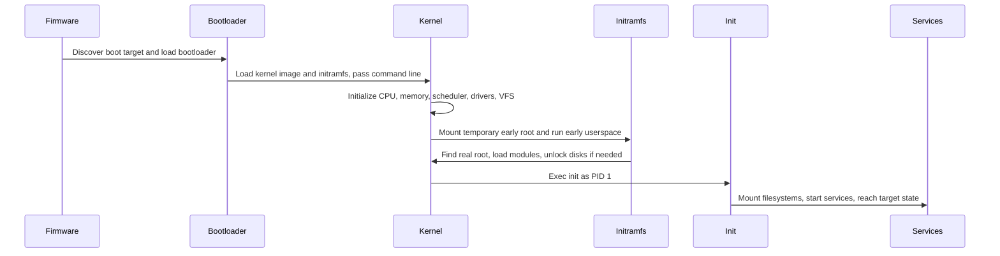

Purpose: Build the operating model for reading Linux as a set of boundaries: hardware, kernel, user space, process APIs, virtual filesystems, boot stages, distribution policy, and the shell environment that operators actually touch.

# Linux Mental Model: User Space, Kernel, and Hardware

Related notes: [06 System Calls ABI libc and User Kernel Boundaries](/compendium/linux-systems-engineering/system-calls-abi-libc-and-user-kernel-boundaries)

Linux is a kernel, not a full operating system by itself. In production speech people often say "Linux host" or "Linux cluster" to mean a kernel plus user space, init system, package manager, service manager, network stack configuration, storage layout, security policy, observability agents, and operational conventions. Keep that distinction sharp. The kernel multiplexes hardware and enforces protection. The distribution assembles a coherent user space around it. The cluster scheduler, image build system, configuration management, and incident process sit above both.

On a local learning machine, you can reboot often, install packages interactively, inspect `/proc` by hand, and intentionally break boot arguments. On production hosts and clusters, every one of those actions has blast radius: a package upgrade can rotate ABI-adjacent libraries, a kernel change can alter drivers or cgroups behavior, a bootloader edit can strand a remote node, and an exploratory `sysctl` can change isolation or networking for every workload on the machine.

## Layer Map

```mermaid
flowchart TD
    A[Applications and shells] --> B[libc and language runtimes]
    B --> C[System call ABI]
    C --> D[Linux kernel]
    D --> E[Device drivers]
    D --> F[Virtual filesystems]
    E --> G[Hardware: CPU, RAM, disks, NICs, GPUs]
    F --> H[/proc /sys /dev /run]
    D --> I[Scheduler, memory manager, VFS, networking, security]
```

The diagram is useful because most Linux mistakes are boundary mistakes. A developer blames "Linux" for a libc behavior. An operator edits a distribution service unit and expects the kernel to know. A cluster incident is debugged through pod logs when the real fault is a node-level device, cgroup, mount, or kernel parameter. The field skill is to know which layer owns the symptom.

## What Linux Is And Is Not

| Claim | Correct mental model | Operational consequence |
| --- | --- | --- |
| Linux is the operating system | Linux is the kernel. A usable system includes user space from a distribution or appliance vendor. | Kernel version alone does not tell you package versions, init behavior, NSS policy, shell defaults, or service layout. |
| The shell runs commands | The shell parses text, sets up processes, file descriptors, variables, pipes, and redirections, then asks the kernel to execute programs. | Shell bugs and process bugs are different. Reproduce with `env -i`, absolute paths, and direct `exec` where possible. |
| `/proc` is files on disk | `/proc` is a virtual filesystem generated by kernel code. | Reads can race with process exit. Do not parse it as stable storage. |
| `/sys` is configuration | `/sys` exports the kernel device model and attributes. Some attributes are writable control points. | Treat writes as live kernel operations, not config file edits. Use change control on production nodes. |
| A distribution kernel is generic Linux | Distribution kernels are patched, configured, signed, packaged, and supported differently. | Reproduce production bugs with the vendor kernel config, not only upstream version numbers. |

Linux is not a promise that all programs behave the same across distributions. The stable user-kernel ABI keeps old user programs running against newer kernels, but distributions can change init systems, library versions, default compiler hardening, package names, service units, NSS modules, PAM stacks, filesystem layout details, and container defaults.

## CPU Privilege, Kernel Space, And User Space

Modern CPUs expose privilege levels. On common x86 systems, user programs run in ring 3 and the kernel runs in ring 0. The exact architecture vocabulary differs, but the core rule stays: ordinary application code cannot directly execute privileged instructions, program device registers, manipulate page tables, or read arbitrary physical memory. It must cross into the kernel through controlled entry paths such as system calls, exceptions, and interrupts.

Kernel space is the privileged address space and execution context where the kernel runs. User space is where processes run. The split is not just address naming. It is a trust boundary, a fault boundary, and an API boundary. A null pointer in a normal process usually kills that process. A null pointer in kernel code can panic the host. A user program can be restarted. A kernel fault may take down every workload on the node.

| Boundary | User space side | Kernel side | Field check |
| --- | --- | --- | --- |
| Memory | Process virtual address space | Kernel mappings, page tables, allocator, page cache | `/proc/&lt;pid&gt;/maps`, `pmap`, `vmstat`, `dmesg` |
| CPU | Threads scheduled by kernel | Scheduler, interrupt handling, privileged instructions | `ps -eLo`, `top -H`, `perf`, `/proc/schedstat` |
| I/O | File descriptors and library calls | VFS, drivers, block layer, network stack | `strace`, `lsof`, `ss`, `iostat` |
| Devices | Names under `/dev` and metadata under `/sys` | Driver model, bus discovery, major and minor numbers | `udevadm`, `ls -l /dev`, `readlink /sys/class/...` |

Do not confuse root with kernel mode. UID 0 has broad permission in user space and can request privileged kernel operations, but root code still runs in user mode until it enters the kernel. Capabilities, namespaces, LSMs, seccomp filters, cgroups, and container runtimes can further restrict what UID 0 can do.

## System Calls In The Mental Model

System calls are the fundamental interface between user programs and the kernel. A program does not open a file by reading ext4 metadata itself. It calls a library function like `open` or `fopen`; that code eventually uses a system call such as `openat` to ask the kernel. The kernel validates arguments, permissions, namespace view, mount options, LSM policy, and available resources, then returns a result.

See [06 System Calls ABI libc and User Kernel Boundaries](/compendium/linux-systems-engineering/system-calls-abi-libc-and-user-kernel-boundaries) for syscall ABI details, libc wrappers, `errno`, vDSO, file descriptors, sockets, `ioctl`, `seccomp`, and `strace`.

The essential model:

```text
program source -> compiler and runtime -> libc wrapper -> syscall instruction -> kernel entry -> subsystem -> return value -> errno or result
```

The important production habit is to debug both sides of that arrow. Application logs tell you what the program believed. `strace` tells you what it asked the kernel. Kernel logs and virtual filesystems tell you what the kernel saw.

## Interrupts, Exceptions, And Traps

An interrupt is an asynchronous event, usually from hardware, that makes the CPU transfer control to the kernel. A network card has packets, a timer fires, a storage device completes I/O. The kernel interrupt path acknowledges the device, records work, and often defers heavier processing.

An exception is synchronous with current execution. Page faults, invalid instructions, divide faults, and breakpoints arise because the current instruction triggered them. Some exceptions are normal. A page fault can mean demand paging, copy-on-write, or stack growth. Other exceptions become process signals such as `SIGSEGV` or `SIGILL`.

A trap is a controlled transfer to privileged handling. System calls are trap-like controlled entries. The lesson is that "the kernel ran" does not mean the same thing each time. It may be reacting to a device, servicing a syscall, handling a fault, scheduling another task, or cleaning up after process exit.

Common mistake: treating high interrupt time as an application CPU problem. In production, check NIC offloads, packet rate, IRQ affinity, storage completion rates, virtualization overhead, and noisy neighbors before rewriting application code.

## Boot Process Overview

Linux boot is a chain of trust and handoff. Each stage has different tooling and failure modes.



Firmware is BIOS or UEFI. It initializes enough hardware to find a boot target. The bootloader, often GRUB or systemd-boot on general purpose machines, loads the kernel image and optional initramfs, then passes the kernel command line. The kernel initializes architecture state, memory management, scheduling, interrupt handling, drivers, security hooks, and the VFS. The initramfs is early user space, commonly used to load storage drivers, assemble RAID, unlock encrypted disks, discover root filesystems, or prepare network boot. Then the kernel starts PID 1, usually `systemd` on current mainstream distributions, though embedded and container systems may use something smaller.

The kernel command line is not a shell script. It is a list of parameters consumed by the kernel and, in some cases, early user space. It can select root devices, control consoles, tune cgroups, enable debug paths, blacklist modules, alter mitigations, or change init. On a laptop, experimenting with `init=/bin/sh` is educational. On a production cluster node, changing `systemd.unified_cgroup_hierarchy`, `isolcpus`, `intel_iommu`, `apparmor`, `selinux`, or `console` settings can alter workload placement, security posture, device assignment, and recovery access.

## Init, PID 1, And Service Reality

PID 1 is special. It is the first user space process the kernel starts and it inherits orphaned processes. It also defines how services are started, supervised, stopped, and ordered. With `systemd`, unit files describe dependencies, environment, resource controls, restart policy, credentials, mounts, sockets, and targets. In minimal containers, PID 1 may be the application itself, which means signal handling and child reaping become application responsibilities.

Local learning machine guidance:

| Action | Good for learning | Production concern |
| --- | --- | --- |
| Edit a service unit and `systemctl daemon-reload` | Learn unit ordering and environment injection | Can restart critical services or create boot loops |
| Boot with a rescue target | Practice recovery | Remote nodes may lose network or orchestration access |
| Inspect `journalctl -b` freely | Understand boot sequence | Logs may contain secrets or tenant data |
| Mask a unit | See dependency failure modes | Can disable networking, storage, logging, or agents |

Production guidance: treat init changes as release artifacts. Review unit dependencies, verify rollback, test cold boot, and inspect both `systemctl status` and the relevant kernel or service logs after reboot.

## Device Model, udev, devtmpfs, And `/dev`

The kernel device model represents buses, devices, drivers, classes, and attributes. It exposes much of that model through sysfs under `/sys`. Device nodes under `/dev` are how many user programs open devices. A block disk, terminal, random source, GPU node, or container pseudo-device is accessed through a special file with major and minor numbers that identify a kernel driver endpoint.

`devtmpfs` lets the kernel provide a basic `/dev` populated with device nodes early. `udev` is user space policy on top: it listens for kernel uevents, applies rules, creates symlinks, sets permissions, tags devices for systemd, and can trigger follow-on actions. This split matters during boot and incidents. If a device exists in `/sys` but expected names under `/dev/disk/by-id` do not appear, you may have a udev rule, timing, permission, or naming problem rather than a missing driver.

Troubleshooting path:

```text
lspci or lsusb
  -> kernel driver bound under /sys
  -> kernel log for probe errors
  -> udev event and rules
  -> /dev node and permissions
  -> application open failure
```

Common commands:

```sh
udevadm monitor --kernel --udev
udevadm info --query=all --name=/dev/sda
readlink -f /sys/class/block/sda
ls -l /dev/disk/by-id/
dmesg -T | tail -200
```

On production hosts, avoid ad hoc udev rules unless you understand naming stability and ordering. Device names such as `/dev/sda` are not stable enough for durable mount policy. Prefer filesystem UUIDs, labels, multipath names, or distribution-supported persistent names.

## Virtual Filesystems: procfs, sysfs, tmpfs, devtmpfs

Virtual filesystems expose kernel state through file operations. They are not all the same.

| Filesystem | Common mount | Backing | What it is for | Operator warning |
| --- | --- | --- | --- | --- |
| procfs | `/proc` | Kernel-generated process and system views | Process state, kernel knobs, mounts, cmdline, pressure data | Values can be per-process, per-namespace, or racy |
| sysfs | `/sys` | Kernel object model | Devices, drivers, buses, classes, attributes | Writable files can change live kernel behavior |
| tmpfs | `/run`, `/dev/shm`, sometimes `/tmp` | RAM and swap backed memory filesystem | Runtime state, sockets, shared memory, temporary files | Capacity pressure is memory pressure |
| devtmpfs | `/dev` | Kernel-provided device node filesystem | Early and basic device nodes | Policy usually comes from udev, not only kernel |
| cgroupfs | `/sys/fs/cgroup` | Kernel cgroup controllers | Resource accounting and control | Container runtimes and systemd own much of it |
| securityfs, debugfs, tracefs | `/sys/kernel/...` | Kernel instrumentation and control | Security modules, tracing, debugging | Often privileged and unsafe to expose broadly |

`/proc/&lt;pid&gt;` is a live view of a process. `/proc/self` is a symlink-like view of the current process. `/proc/sys` exposes many sysctl settings. `/proc/mounts` reflects the kernel view of mounts, not a static config file. `/sys` is organized around kernel objects and relationships, not around administrator preferences.

Production guidance: scrape virtual filesystems deliberately. Pin metric meanings to kernel and distribution versions. Avoid high-frequency recursive walks of `/proc` and `/sys` on busy hosts. Treat writes to `/proc/sys`, `/sys`, and cgroups as API calls with immediate effect.

## Filesystem Hierarchy In Practice

The hierarchy is a convention made real by packages, init, mounts, and policy.

| Path | Field meaning |
| --- | --- |
| `/bin`, `/sbin`, `/usr/bin`, `/usr/sbin` | Executables. Many distributions merge `/bin` and `/sbin` into `/usr`. Scripts should use absolute paths for critical commands or a controlled `PATH`. |
| `/etc` | Host configuration. In immutable images, this may be generated or overlaid. |
| `/var` | Variable state such as logs, databases, package caches, spools, and service data. |
| `/run` | Runtime tmpfs for PID files, sockets, locks, generated config, and boot-session state. |
| `/home` | User data on general purpose systems. Often absent or irrelevant on servers and containers. |
| `/root` | Root user's home, separate from `/home` so rescue workflows can work when `/home` is unavailable. |
| `/tmp` | Temporary files. May be tmpfs, disk backed, cleaned by policy, or isolated per service. |
| `/boot` | Kernel images, initramfs files, bootloader config, and related metadata. |
| `/opt` | Add-on software outside the base distribution policy. |
| `/srv` | Service data by local convention. Less universal than `/var/lib`. |
| `/proc`, `/sys`, `/dev` | Kernel-facing virtual and device filesystems. |

Local machines tolerate hand edits and leftover experiments. Production hosts need ownership. Know whether a path is owned by the package manager, configuration management, systemd tmpfiles, a container runtime, Kubernetes, an operator, or a human.

## Distribution, Kernel, And Package Managers

A distribution chooses kernel builds, boot integration, libc, compiler defaults, package format, dependency policy, security updates, service conventions, and filesystem defaults. Debian and Ubuntu use `dpkg` plus `apt`. Fedora, RHEL, and related systems use RPM packages with `dnf` or `yum` frontends. Arch uses `pacman`. SUSE uses RPM with `zypper`. Alpine uses `apk` and musl libc. NixOS uses a declarative store and profiles. Containers may contain only enough user space to run one service.

The package manager is not only an installer. It is a database of file ownership, versions, dependencies, scripts, triggers, service integration, and verification state. Production incident rule: before editing a packaged file, ask how that edit survives upgrade, rollback, image rebuild, or drift detection.

Useful checks:

```sh
uname -a
cat /etc/os-release
ldd --version 2>&1 | head -1
command -v apt dnf yum rpm dpkg pacman apk zypper nix-env
systemctl --version 2>/dev/null | head -1
```

Do not infer kernel behavior from distribution name alone. Do not infer distribution behavior from kernel version alone.

## Environment Variables, PATH, And Shell Process Model

Environment variables are inherited key-value strings passed from parent process to child at exec time. They are not global kernel settings. If you export `FOO=bar` in one shell, sibling processes do not see it. A service started by systemd does not inherit your interactive shell profile unless explicitly configured to do so.

`PATH` is a colon-separated search list used by shells and exec helpers to find programs when a command name lacks a slash. `PATH` ordering is security-sensitive. In production scripts, prefer absolute paths for critical tools or set a minimal known `PATH`.

The shell process model:

```text
terminal -> shell process
shell parses command line
shell expands variables, globs, quotes, substitutions
shell creates pipes and redirections
shell forks child processes as needed
child execs target program
parent shell waits or continues for background jobs
```

Exit codes are process status conventions. Zero means success. Nonzero means failure or a program-specific condition. Signals are often reported by shells as 128 plus signal number. Pipelines hide failures unless the shell is configured to notice them; in `bash`, `set -o pipefail` makes a pipeline fail if any command fails.

Standard file descriptors:

| FD | Name | Default role |
| --- | --- | --- |
| 0 | stdin | Input stream |
| 1 | stdout | Normal output |
| 2 | stderr | Diagnostics |

Pipes connect stdout of one process to stdin of another. Redirection changes file descriptor targets before exec. This is why `cmd &gt;out 2&gt;err`, `cmd 2&gt;&1 &gt;out`, and `cmd &gt;out 2&gt;&1` differ. Order matters because the shell rewires descriptors left to right.

Examples:

```sh
# Capture normal output but keep diagnostics visible.
some_command >result.txt

# Capture both stdout and stderr in one file.
some_command >combined.log 2>&1

# Fail a shell script when an early pipeline stage fails.
set -o pipefail
journalctl -u app.service | grep -F "panic" | head

# Run with a nearly empty environment to expose hidden dependencies.
env -i PATH=/usr/bin:/bin HOME="$HOME" /usr/bin/mytool
```

Production guidance: service failures caused by `PATH`, locale, `HOME`, `TMPDIR`, `LD_LIBRARY_PATH`, proxy variables, or credential environment often reproduce only outside your interactive shell. Inspect the real environment from the service manager, container spec, or `/proc/&lt;pid&gt;/environ` with appropriate secrecy controls.

## Tradeoffs That Shape Linux Operations

| Design choice | Benefit | Cost | Production stance |
| --- | --- | --- | --- |
| Everything has a file-like interface | Uniform tooling, easy composition, shell visibility | Not every file-like thing has disk semantics | Check the filesystem type and ownership before treating it as storage |
| Stable user-kernel ABI | Old binaries keep working on newer kernels | Kernel internals cannot be casually cleaned up | Prefer public APIs over scraping internals |
| Distribution packaging | Repeatable install and security updates | Package scripts can mutate services and config | Test upgrades, track file ownership, keep rollback |
| Virtual filesystems | Low-friction introspection | Racy, versioned, and sometimes writable | Scrape with version awareness and minimal privileges |
| Dynamic device discovery | Hardware and virtual devices appear automatically | Names and timing can shift | Use persistent identifiers and udev-aware checks |
| Shell composition | Fast diagnostics and automation | Quoting, environment, and pipe failures are subtle | Use strict modes carefully, log commands, validate exits |

## Common Mistakes

| Mistake | Why it hurts | Better move |
| --- | --- | --- |
| Equating root with unrestricted kernel access | Capabilities, namespaces, LSMs, seccomp, and lockdown can still deny operations | Inspect `id`, capabilities, namespace, LSM mode, and seccomp status |
| Assuming `/dev/sda` is stable | Enumeration order changes with hardware, firmware, drivers, and boot timing | Use UUIDs, labels, by-id paths, or orchestrator-provided device identity |
| Editing generated files under `/run` | `/run` is tmpfs and rebuilt each boot | Find the generator or unit that owns it |
| Debugging containers only from inside the container | The host controls cgroups, mounts, devices, networking, and security policy | Compare container view with host view |
| Treating `strace` output as source-level truth | It shows kernel boundary calls, not all library or runtime behavior | Combine with application logs, runtime tracing, and kernel logs |
| Running package updates by hand on cluster nodes | Drift from image or configuration management breaks reproducibility | Roll through the node lifecycle or approved update mechanism |
| Writing to `/proc/sys` and forgetting persistence | Runtime sysctl differs from boot-time or config-managed state | Use the distribution sysctl mechanism and verify after reboot |

## Troubleshooting Field Loop

Use this loop when a Linux symptom is vague:

1. Identify the failing process, service, container, or boot stage.
2. Determine the boundary crossed at failure: shell parse, exec, library, syscall, kernel subsystem, device, filesystem, network, or init.
3. Capture the exact error and exit status.
4. Inspect the process context: user, groups, capabilities, namespaces, cgroups, cwd, root, mounts, environment, open FDs.
5. Trace the kernel boundary with `strace` when safe.
6. Check kernel and init logs for the same timestamp.
7. Compare local learning behavior against production policy: distribution version, kernel config, security modules, cgroups, container runtime, and package ownership.
8. Make the smallest reversible change and verify from both user-space and kernel-facing views.

Quick command set:

```sh
ps -o pid,ppid,user,stat,comm,args -p "$PID"
readlink -f /proc/"$PID"/exe
tr '\0' '\n' < /proc/"$PID"/environ
ls -l /proc/"$PID"/fd
cat /proc/"$PID"/status
cat /proc/"$PID"/mountinfo
systemctl status app.service
journalctl -u app.service -b --no-pager
dmesg -T | tail -200
```

On production hosts, avoid commands that dump secrets into terminals or tickets. Environment, command lines, mount options, and logs can contain tokens. Prefer scoped reads, redaction, and audited access.

## Source Trail

- Linux kernel command-line parameters: https://docs.kernel.org/admin-guide/kernel-parameters.html
- Linux kernel initramfs documentation: https://docs.kernel.org/filesystems/ramfs-rootfs-initramfs.html
- Linux kernel device model overview: https://docs.kernel.org/driver-api/driver-model/overview.html
- Linux kernel sysfs documentation: https://docs.kernel.org/filesystems/sysfs.html
- Linux man-pages boot(7): https://man7.org/linux/man-pages/man7/boot.7.html
- Linux man-pages proc(5): https://man7.org/linux/man-pages/man5/proc.5.html
- Linux man-pages sysfs(5): https://man7.org/linux/man-pages/man5/sysfs.5.html
- Linux man-pages environ(7): https://man7.org/linux/man-pages/man7/environ.7.html
- Linux man-pages pipe(7): https://man7.org/linux/man-pages/man7/pipe.7.html
