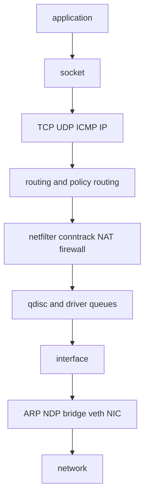
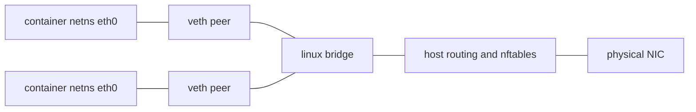
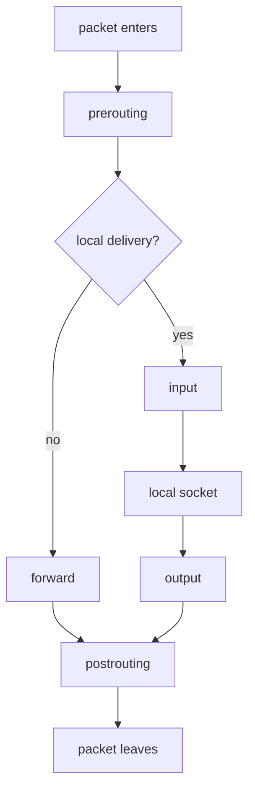

Purpose: Build an operator-grade mental model of Linux networking, TCP/IP behavior, routing, firewalling, DNS resolution, and packet troubleshooting across learning hosts, production servers, and clusters.

Related: [Linux Systems Engineering](/compendium/linux-systems-engineering/linux-systems-engineering), [00 Linux Systems Mastery Roadmap](/compendium/linux-systems-engineering/linux-systems-mastery-roadmap), [04 Filesystems VFS Block IO Page Cache and Storage](/compendium/linux-systems-engineering/filesystems-vfs-block-io-page-cache-and-storage)

# Field Model

Linux networking is not one feature. It is namespaces, links, addresses, neighbor tables, routing policy, sockets, qdiscs, conntrack, firewall hooks, resolver policy, and application protocol behavior. Packet loss, latency, and name-resolution failures often look like application bugs until the path is decomposed.



On a local learning machine, use network namespaces, veth pairs, bridges, nftables rules, and `tcpdump` freely in a disposable lab. On production hosts and clusters, packet path changes can cut off SSH, health checks, service discovery, east-west traffic, or storage traffic. Prefer out-of-band access, saved rulesets, staged changes, and narrow packet captures.

# Network Namespaces and Interfaces

A network namespace isolates interfaces, addresses, routing tables, firewall rules, `/proc/net`, selected sysctls, ports, and abstract UNIX socket namespace. Containers use this to give each workload its own network view.

The loopback interface is per namespace. If `lo` is down inside a namespace, local services can fail even when Ethernet links are correct.

```bash
sudo ip netns add left
sudo ip netns add right
sudo ip link add veth-left type veth peer name veth-right
sudo ip link set veth-left netns left
sudo ip link set veth-right netns right
sudo ip -n left addr add 10.10.0.1/24 dev veth-left
sudo ip -n right addr add 10.10.0.2/24 dev veth-right
sudo ip -n left link set lo up
sudo ip -n right link set lo up
sudo ip -n left link set veth-left up
sudo ip -n right link set veth-right up
sudo ip netns exec left ping -c 2 10.10.0.2
```

Veth pairs behave like a patch cable between namespaces. Bridges switch Ethernet frames among ports. A common container layout is namespace veth to host bridge, then routing or NAT to the outside.



# Addresses, Neighbors, and Routing

ARP resolves IPv4 next-hop addresses to link-layer addresses. NDP does the analogous job for IPv6 and also handles router discovery and neighbor reachability. If IP configuration is correct but the neighbor table is incomplete, traffic still fails at layer 2.

Routing tables choose the next hop. Policy routing adds rules before table lookup, usually based on source address, fwmark, incoming interface, or other selectors.

Commands:

```bash
ip addr show
ip link show
ip neigh show
ip route show table main
ip rule show
ip route get 203.0.113.10
ip -6 route get 2001:db8::10
```

| Problem | Look at | Production caution |
|---|---|---|
| Wrong source IP | `ip route get`, `ip rule`, source-specific routes | Source changes can break ACLs, TLS SAN assumptions, and return routing. |
| Intermittent same-subnet failure | `ip neigh`, duplicate IPs, ARP flux | Gratuitous ARP and failover systems need deliberate testing. |
| Container cannot reach outside | namespace routes, host forwarding, NAT, bridge state | Cluster CNIs may own rules; manual host edits can fight controllers. |
| IPv6 works locally but not globally | RA, NDP, default route, firewall ICMPv6 | Blocking ICMPv6 can break normal IPv6 operation. |

# Sockets and Transport Protocols

A socket is the kernel object applications use for network IO. TCP is connection-oriented, ordered, reliable byte-stream transport. UDP is datagram transport with no built-in delivery, ordering, congestion, or retry semantics. ICMP carries control and error signals such as echo, unreachable, time exceeded, and path-MTU feedback.

TCP state matters operationally:

| State | Meaning | Operational read |
|---|---|---|
| LISTEN | Server socket is accepting new connection attempts. | Backlog, bind address, firewall, and service health matter. |
| SYN-SENT | Local host sent SYN and awaits SYN-ACK. | Routing, firewall, remote listener, or packet loss may be involved. |
| SYN-RECV | SYN received and response in progress. | Can indicate normal handshakes or SYN pressure. |
| ESTABLISHED | Bidirectional connection exists. | Throughput, congestion window, receive windows, and app reads now matter. |
| FIN-WAIT, CLOSE-WAIT | Shutdown in progress. | Many CLOSE-WAIT sockets usually mean the application is not closing. |
| TIME-WAIT | Old connection tuple is being held to catch late packets. | Normal on active closers; a problem only when tuple or port pressure appears. |

Listen backlog is not a single queue. TCP has handshake state, completed accepts, syncookies, and application accept rate. Raising `somaxconn` without fixing a stalled accept loop can hide symptoms.

Ephemeral ports are the local temporary ports used for outgoing connections. Exhaustion appears as connection failures despite healthy remote services. Look at `ip_local_port_range`, connection cardinality, TIME_WAIT counts, NAT fan-out, and client connection pooling.

```bash
ss -ltnp
ss -tan state time-wait | wc -l
sysctl net.ipv4.ip_local_port_range
sysctl net.core.somaxconn
```

# Netfilter, Conntrack, NAT, and Firewalls

Netfilter is the kernel packet filtering and transformation framework. Conntrack records flows so rules can match connection state and NAT can rewrite subsequent packets consistently. NAT changes source or destination addresses and ports, commonly for internet egress, load balancing, port forwarding, and container networking.

iptables is the older user-space interface. nftables is the modern ruleset framework and `nft` is its administration tool. firewalld is a higher-level service that manages firewall policy, often using nftables underneath on current distributions.



| Layer | Tooling | Use |
|---|---|---|
| nftables | `nft list ruleset`, `nft monitor trace` | Precise packet filtering, NAT, sets, maps, counters. |
| iptables | `iptables-save`, `ip6tables-save` | Legacy rules or compatibility layer. |
| firewalld | `firewall-cmd --list-all` | Zone/service abstraction managed by distribution tooling. |
| conntrack | `conntrack -L`, `/proc/sys/net/netfilter/*` | Flow state, NAT state, table pressure. |

Production guidance:

1. Save the current ruleset before changes.
2. Avoid flushing rules on a remote host without console access.
3. Use counters and narrow matches before broad drops.
4. Know whether your distribution is using iptables-legacy, iptables-nft compatibility, native nftables, or firewalld.
5. In clusters, CNI, kube-proxy, service mesh, ingress controllers, and host firewalls can all program packet paths.

# DNS Resolution

DNS failure can be resolver policy, search domains, split DNS, DNSSEC, transport reachability, cache behavior, or authoritative data. `/etc/resolv.conf` is a resolver configuration file, but on systemd-based hosts it may be a symlink to a stub resolver path managed by `systemd-resolved`.

`systemd-resolved` provides local name resolution, caching, per-link DNS, routing domains, LLMNR, mDNS, DNSSEC policy, and DNS-over-TLS options depending on configuration. Traditional glibc lookup through NSS may use `files`, `dns`, `resolve`, `myhostname`, or other modules. Therefore `dig` and `getent hosts` can legitimately disagree.

Commands:

```bash
readlink -f /etc/resolv.conf
cat /etc/resolv.conf
resolvectl status
getent hosts example.com
dig example.com A
dig @1.1.1.1 example.com A +trace
```

| Symptom | Check | Likely cause |
|---|---|---|
| Short name works on one link only | `resolvectl domain`, search domains | Split DNS or search-domain policy. |
| `dig` works but app fails | NSS order, `getent hosts`, resolver library | App does not use the same resolver path. |
| Random slow lookups | unreachable resolver, IPv6 timeout, DNSSEC fallback, search suffix expansion | Resolver ordering or network reachability. |
| Cluster service names fail | pod namespace DNS config, CoreDNS logs, search path, ndots | Kubernetes DNS policy or CoreDNS issue. |

# TLS Overview

TLS sits above TCP for HTTPS and many service protocols. Networking can be correct while TLS fails because of SNI, certificate names, trust roots, protocol versions, ALPN, client certificates, or middleboxes. Always separate TCP reachability from TLS validation.

```bash
openssl s_client -connect example.com:443 -servername example.com -brief
curl -v https://example.com/
```

In production, do not "fix" TLS by disabling verification. Identify whether the failure is name mismatch, expired certificate, missing intermediate, wrong trust store, wrong SNI, clock skew, or proxy interception.

# MTU, Fragmentation, Loss, Latency, Throughput

MTU is maximum transmission unit. Path MTU is the smallest MTU along the route. IPv4 can fragment in some cases; IPv6 relies on path-MTU discovery and ICMPv6 packet-too-big messages. Blocking required ICMP creates black holes: small packets work, large packets hang.

Packet loss drives retransmissions and congestion-control backoff. Latency is delay. Throughput is delivered bytes per second. Bandwidth-delay product determines how much in-flight data is needed to fill a path. Congestion control decides how TCP grows and shrinks that in-flight window.

```bash
ping -M do -s 1472 192.0.2.1
tracepath example.com
mtr -ezbw example.com
iperf3 -c host
ss -tin dst 203.0.113.10
```

| Metric | What it means | Trap |
|---|---|---|
| RTT | Round-trip delay | Low average can hide high p99. |
| Loss | Missing packets | 1 percent loss can devastate TCP throughput. |
| Throughput | Application delivery rate | Good bandwidth does not imply low latency. |
| Retransmits | TCP had to resend | Can be network loss, receiver pressure, or path issues. |
| MTU | Frame payload limit | Overlay networks reduce effective MTU. |

# Troubleshooting Runbook

Work from local to remote and from lower layers upward.

```bash
ip -br link
ip -br addr
ip route get 8.8.8.8
ip neigh show
ss -lntup
ss -s
nft list ruleset
sudo tcpdump -ni any host 203.0.113.10
dig example.com
mtr -ezbw example.com
ethtool eth0
ethtool -S eth0 | egrep 'drop|error|timeout|miss|crc'
```

Decision table:

| Observation | Next action |
|---|---|
| No route from `ip route get` | Fix address, route, policy rule, or namespace. |
| SYN leaves but no SYN-ACK returns | Check remote listener, return path, firewall, NAT, security group, packet loss. |
| SYN-ACK returns but local resets | Check local socket binding, TLS proxy, stale NAT, conntrack, service restarts. |
| DNS returns wrong address | Check resolver path, split DNS domains, cache, authoritative records. |
| Packets arrive but app sees nothing | Check firewall input, socket bind address, namespace, SELinux/AppArmor, application accept loop. |
| Interface errors increment | Check cabling, optics, NIC driver, offloads, MTU, switch counters. |

`tcpdump` sees packets at a specific capture point. On bridges, veths, tunnels, and offloaded NICs, a packet can appear different depending on where it is captured. Use `-ni` to avoid DNS lookups during capture. Capture both sides of a suspected boundary when possible.

Production and cluster cautions:

1. Packet captures can expose secrets, tokens, internal hostnames, and customer data.
2. `tcpdump -i any` is convenient but can obscure ingress versus egress interface details.
3. Conntrack table exhaustion can break new flows while old flows continue.
4. NAT makes logs lie unless you preserve pre-NAT and post-NAT context.
5. Service meshes add proxy listeners, mTLS, redirection rules, and extra TCP hops.
6. Kubernetes NetworkPolicy is usually enforced by the CNI, not by Kubernetes itself; inspect the node dataplane.

# Common Mistakes

| Mistake | Correction |
|---|---|
| Treating ping failure as proof TCP is down | ICMP may be filtered; test the target port with `ss`, `nc`, `curl`, or packet capture. |
| Editing `/etc/resolv.conf` on a resolved-managed host | Configure resolved, NetworkManager, networkd, or DHCP policy instead. |
| Flushing nftables to "start clean" over SSH | Save rules, schedule rollback, and use console access. |
| Assuming TIME_WAIT is a leak | It is normal TCP hygiene; investigate only with port pressure or tuple churn. |
| Ignoring MTU in overlays and VPNs | Test path MTU and account for encapsulation overhead. |
| Comparing `dig` to application behavior directly | `dig` bypasses parts of NSS and application resolver logic. |

# Production Patterns

Use namespaces and veths locally to learn packet movement without risking shared hosts. In production, classify the path first: same namespace, same host different namespace, bridged container path, routed host path, NAT path, overlay path, ingress path, or service-mesh path. Then capture at boundaries and compare counters.

For servers, standardize firewall ownership. For clusters, document which component owns pod routing, service load balancing, egress NAT, network policy, DNS, and ingress. For incident response, keep a minimal command set that works on stripped-down hosts: `ip`, `ss`, `tcpdump`, `dig` or `getent`, `nft` or `iptables-save`, `mtr`, and `ethtool`.

# Reference URLs

- https://docs.kernel.org/networking/index.html
- https://man7.org/linux/man-pages/man7/network_namespaces.7.html
- https://man7.org/linux/man-pages/man2/socket.2.html
- https://man7.org/linux/man-pages/man7/ip.7.html
- https://man7.org/linux/man-pages/man7/tcp.7.html
- https://man7.org/linux/man-pages/man7/udp.7.html
- https://man7.org/linux/man-pages/man7/icmp.7.html
- https://man7.org/linux/man-pages/man2/listen.2.html
- https://man7.org/linux/man-pages/man8/ip.8.html
- https://www.netfilter.org/projects/nftables/manpage.html
- https://man7.org/linux/man-pages/man5/resolv.conf.5.html
- https://www.freedesktop.org/software/systemd/man/systemd-resolved.service.html
- https://www.freedesktop.org/software/systemd/man/resolved.conf.html
