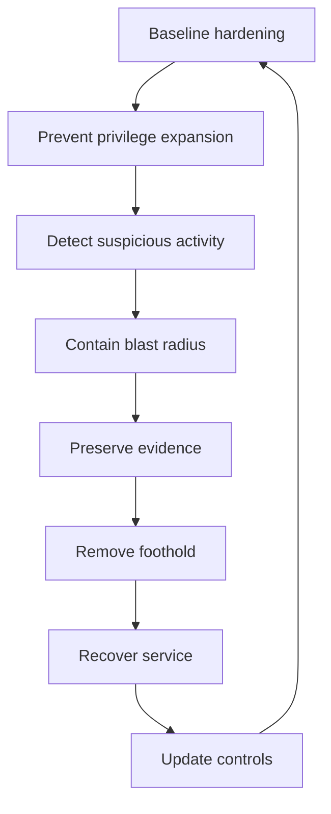

Purpose: Build a production-focused Linux hardening and incident response manual that extends the permissions and LSM model into service hardening, secrets handling, SSH, auditd, patching, CVE response, and bounded incident commands.

# 12 Linux Security Hardening Secrets and Incident Response

Related notes: [08 Permissions Users Groups Capabilities and LSMs](/compendium/linux-systems-engineering/permissions-users-groups-capabilities-and-lsms), [07 systemd Boot Init Units Timers Journald and Services](/compendium/linux-systems-engineering/systemd-boot-init-units-timers-journald-and-services), [09 cgroups Namespaces Containers and Runtime Isolation](/compendium/linux-systems-engineering/cgroups-namespaces-containers-and-runtime-isolation), [10 Observability Logs Metrics Tracing and Debugging](/compendium/linux-systems-engineering/observability-logs-metrics-tracing-and-debugging), [11 Performance Engineering perf Flamegraphs and Capacity](/compendium/linux-systems-engineering/performance-engineering-perf-flamegraphs-and-capacity), [05 Linux Networking TCP IP Routing Firewalling and DNS](/compendium/linux-systems-engineering/linux-networking-tcp-ip-routing-firewalling-and-dns), [17 Production Operations Troubleshooting and Runbooks](/compendium/linux-systems-engineering/production-operations-troubleshooting-and-runbooks)

This note assumes the base model in [08 Permissions Users Groups Capabilities and LSMs](/compendium/linux-systems-engineering/permissions-users-groups-capabilities-and-lsms): Linux security starts with users, groups, mode bits, capabilities, namespaces, seccomp, and LSMs. This note focuses on hardening and response. The practical goal is to reduce attacker freedom, preserve operator access, keep secrets out of places they do not belong, patch with discipline, and collect evidence without destroying the state needed for root cause.

On a local learning machine, it is acceptable to break SSH, experiment with audit rules, mount debug interfaces, run vulnerable services in throwaway labs, and practice incident commands. On production Linux hosts, hardening must be staged, reversible, observable, and compatible with recovery access. On production clusters, host security includes kubelet, container runtime, CNI, CSI, node credentials, service account tokens, image supply chain, admission policy, and the fact that every container shares the node kernel.



## Security Posture by Environment

| Environment | Bias | Acceptable experiments | Production boundary |
|---|---|---|---|
| Local learning machine | learn by breaking and rebuilding | permissive audit rules, SSH lockout recovery, bpftrace, vulnerable labs | do not treat local root habits as fleet practice |
| Production Linux host | least privilege, recoverability, evidence | staged hardening, canary audit rules, controlled packet capture | avoid unreviewed privilege, broad debug surfaces, and destructive cleanup |
| Production cluster | node plus orchestrator security | policy dry runs, canary nodes, runtime profiles | containers share the kernel and cluster credentials expand blast radius |

Hardening is only useful when operators can still deploy, rotate, patch, recover, and investigate. A host that is locked down but impossible to patch or inspect will fail under real incidents.

## Hardening Layers

| Layer | Control examples | Failure if ignored |
|---|---|---|
| Identity | dedicated service users, sudo policy, PAM, MFA upstream | shared accounts and weak attribution |
| Filesystem | ownership, mode bits, mount options, immutable baselines | writable config, secret leakage, persistence |
| Process privilege | capabilities, `NoNewPrivileges`, seccomp, LSMs | root-equivalent service compromise |
| Service manager | systemd sandboxing, resource limits, restart policy | daemon escape, noisy failure, weak recovery |
| Network | SSH policy, firewall, bind addresses, segmentation | exposed admin planes and lateral movement |
| Secrets | external secret store, short lifetime, rotation, redaction | long-lived credentials in files and logs |
| Audit | auditd rules, journal, EDR, file integrity | no evidence after compromise |
| Patch | CVE triage, kernel and package updates, reboot process | known exploit window remains open |
| Incident response | containment, evidence, recovery, lessons | destructive panic and repeated compromise |

## Service Hardening with systemd

systemd service hardening is a practical way to apply kernel controls per daemon. It does not replace application security, but it can reduce what a compromised process can read, write, execute, or ask the kernel to do.

Example service profile:

```ini
[Service]
User=example
Group=example
UMask=0077
NoNewPrivileges=yes
PrivateTmp=yes
PrivateDevices=yes
ProtectSystem=strict
ProtectHome=read-only
ReadWritePaths=/var/lib/example /var/log/example
CapabilityBoundingSet=CAP_NET_BIND_SERVICE
AmbientCapabilities=CAP_NET_BIND_SERVICE
SystemCallFilter=@system-service
SystemCallArchitectures=native
RestrictAddressFamilies=AF_INET AF_INET6 AF_UNIX
RestrictNamespaces=yes
LockPersonality=yes
MemoryDenyWriteExecute=yes
ProtectKernelTunables=yes
ProtectKernelModules=yes
ProtectControlGroups=yes
RestrictSUIDSGID=yes
```

Tradeoffs:

| Control | Benefit | Risk |
|---|---|---|
| `User=` and `Group=` | removes default root execution | file ownership and low-port binding need planning |
| `NoNewPrivileges=yes` | blocks privilege gain through exec | breaks programs that rely on setuid transitions |
| `ProtectSystem=strict` | makes most OS paths read-only | requires explicit writable paths |
| `PrivateTmp=yes` | isolates temporary files | breaks sharing through `/tmp` |
| `CapabilityBoundingSet=` | limits kernel privilege bits | wrong capability set breaks legitimate operations |
| `SystemCallFilter=` | reduces syscall surface | incomplete profiles fail at runtime |
| `RestrictAddressFamilies=` | narrows network protocol use | breaks DNS, Unix sockets, or IPv6 if omitted |
| `ProtectKernelModules=yes` | blocks module loading by service | not useful if service never had that privilege |

Production workflow:

1. Run `systemd-analyze security example.service` for a rough exposure review.
2. Add controls in small batches.
3. Test under representative workload.
4. Check `journalctl -u example.service` for sandbox denials or startup failures.
5. Record why each exception exists.
6. Keep a rollback drop-in ready.

Common mistake: copying a maximal hardening block into every service. A web server, backup agent, hardware monitor, database, and container runtime need different access. Harden from the service contract, not from a generic checklist.

## Secrets Handling

A secret is any value that grants access or proves identity: passwords, API keys, private keys, tokens, cookies, database URLs, cloud credentials, kubeconfigs, signing keys, recovery codes, and session material.

Rules:

- keep secrets out of Git, shell history, screenshots, tickets, and logs
- prefer a managed secret store with audit, access policy, and rotation
- use short-lived credentials where practical
- scope secrets to the smallest service, tenant, environment, and action
- rotate after exposure, role change, host compromise, or suspicious access
- avoid putting secrets in command-line arguments because process listings can expose them
- treat packet captures, heap dumps, core dumps, and debug logs as secret-bearing artifacts

Storage tradeoffs:

| Location | Use | Risk |
|---|---|---|
| environment variable | common for simple service config | inherited by children, visible in some process contexts, dumped in diagnostics |
| root-owned file `0600` | stable host secret | backup and file permission risk |
| systemd credential | better unit-scoped secret delivery on supporting systems | version and operational support vary |
| external secret manager | audit, rotation, centralized policy | availability and bootstrap dependency |
| Kubernetes Secret | integrates with cluster workloads | base64 is not encryption; node and RBAC access matter |
| command argument | almost never justified | visible in process listings and shell history |

Incident response for exposed secrets:

1. Identify exact secret and scope.
2. Revoke or rotate it.
3. Search logs, repos, tickets, and artifacts for copies.
4. Review access logs for use before and after exposure.
5. Replace deployment paths that reintroduce the old value.
6. Document blast radius and residual risk.

## SSH Hardening

SSH is usually the highest-value administrative path on a Linux host. Harden it without locking out recovery.

Baseline directions:

```text
PermitRootLogin no
PasswordAuthentication no
KbdInteractiveAuthentication no
PubkeyAuthentication yes
PermitEmptyPasswords no
AllowUsers alice bob
X11Forwarding no
AllowTcpForwarding no
PermitTunnel no
ClientAliveInterval 300
ClientAliveCountMax 2
LogLevel VERBOSE
```

Use `sshd -t` before reload:

```bash
sudo sshd -t
sudo systemctl reload sshd
```

Production workflow:

- keep an existing root or admin session open while changing SSH
- confirm console or out-of-band recovery
- use drop-in config where the distribution supports it
- deploy to canaries before fleet rollout
- log authentication centrally
- prefer hardware-backed or centrally managed keys for sensitive fleets
- remove stale authorized keys
- restrict bastion access and port forwarding

Common mistakes:

| Mistake | Consequence | Correction |
|---|---|---|
| disabling passwords without key validation | lockout | test a new session before closing old one |
| allowing root login for convenience | larger brute-force and post-compromise impact | use named accounts plus sudo |
| unmanaged `authorized_keys` | stale access | central inventory and rotation |
| broad agent forwarding | credential theft path | avoid or restrict agent forwarding |
| SSH from every network | exposed admin surface | bind, firewall, VPN, bastion, or zero trust access |

In production clusters, SSH may be intentionally disabled on nodes. That is fine only if there is a supported node debug, console, or break-glass path.

## auditd

auditd is the userspace component of the Linux Audit system. It writes audit records to disk, while rules are loaded into the kernel through `auditctl` or rule files. auditd is not a complete detection platform, but it is useful for high-value host evidence: identity changes, sudoers edits, secret file reads, module loads, time changes, audit config changes, and suspicious exec paths.

Commands:

```bash
sudo auditctl -s
sudo auditctl -l
sudo ausearch -m USER_LOGIN --success no -i
sudo ausearch -k identity -i
sudo aureport --summary
```

Example rules:

```bash
-w /etc/passwd -p wa -k identity
-w /etc/group -p wa -k identity
-w /etc/shadow -p wa -k identity
-w /etc/sudoers -p wa -k privilege
-w /etc/sudoers.d/ -p wa -k privilege
-w /etc/ssh/sshd_config -p wa -k ssh_config
-a always,exit -F arch=b64 -S init_module,finit_module,delete_module -k kernel_modules
-a always,exit -F arch=b64 -S adjtimex,settimeofday,clock_settime -k time_change
```

Tradeoffs:

| Audit choice | Benefit | Cost |
|---|---|---|
| watch high-value files | clear evidence of config tampering | misses equivalent changes elsewhere |
| audit execve broadly | strong process evidence | high volume and sensitive arguments |
| immutable audit rules | harder attacker tampering | harder emergency changes |
| central forwarding | preserves evidence after host loss | network and collector dependency |

Production guidance:

- test audit rules under load
- watch for backlog drops
- avoid broad path watches on high-churn trees
- protect audit logs from local deletion through forwarding or immutable storage
- include audit rule changes in change control

## Patching and CVE Response

Patch response is operational risk management. Not every CVE has the same exposure, exploitability, or mitigation path. Linux distributions often backport fixes without changing upstream version numbers, so version checks must account for distro advisories and package changelogs.

CVE triage:

| Question | Why it matters |
|---|---|
| Is the affected package or kernel code present? | avoids false positives |
| Is the vulnerable feature enabled or reachable? | exposure depends on config and workload |
| Is exploitation local, remote, authenticated, or privileged? | drives urgency |
| Is there a public exploit or active exploitation? | changes response priority |
| Is a vendor fix available for this distro release? | determines patch path |
| Does mitigation exist before patching? | buys time but may reduce functionality |
| Does patching require restart or reboot? | affects maintenance and failover |

Commands:

```bash
uname -a
cat /etc/os-release
systemctl list-units --type=service --state=running --no-pager
rpm -qa --last 2>/dev/null | head
dpkg-query -W 2>/dev/null | head
needrestart -r a 2>/dev/null
```

Production patch workflow:

1. Confirm exposure using distro advisories, package state, kernel config, and feature use.
2. Choose mitigation, patch, isolation, or shutdown.
3. Patch canary hosts first.
4. Validate service health and security control health.
5. Roll through the fleet with monitoring.
6. Reboot when kernel, libc, OpenSSL, container runtime, or other in-memory components require it.
7. Record residual risk and exceptions.

Kernel CVEs deserve special care because containers share the host kernel. A container escape or local privilege escalation on a node can become a cluster incident if node credentials, kubelet permissions, or cloud metadata are reachable.

## Incident Response Principles

Security incidents need containment and evidence, not panic cleanup. The wrong command can destroy forensic state, rotate logs, kill the only process that shows the attack path, or tip off an attacker before containment.

Phases:

| Phase | Goal | Examples |
|---|---|---|
| identify | determine whether abnormal activity is security-relevant | suspicious process, new user, odd network connection |
| contain | stop spread or damage | isolate host, revoke secret, block route |
| preserve | capture volatile evidence | process, network, logs, memory policy if available |
| eradicate | remove persistence and vulnerability | patch, rebuild, remove unauthorized access |
| recover | restore service safely | redeploy, rotate, monitor |
| learn | prevent repeat | controls, alerts, runbooks |

Production rule: prefer rebuild from trusted images over hand-cleaning a compromised host. Cleaning may be useful for learning, but recovery should assume the host is untrusted until reimaged or otherwise verified through an approved process.

## Incident Commands

Use these as starting points. Record time, host, operator, command, and output destination.

Host identity and time:

```bash
date -Is
hostnamectl
who -a
w
last -a | head -n 30
lastb -a | head -n 30
```

Process and service state:

```bash
systemctl --failed --no-pager
systemctl list-units --type=service --state=running --no-pager
ps -eo pid,ppid,user,group,state,lstart,comm,args --sort=pid
pstree -ap
```

Network state:

```bash
ss -tulpen
ss -tanp
ip addr
ip route
ip rule
nft list ruleset 2>/dev/null
iptables-save 2>/dev/null
```

Persistence checks:

```bash
crontab -l 2>/dev/null
sudo ls -la /etc/cron* /var/spool/cron 2>/dev/null
systemctl list-timers --all --no-pager
find /etc/systemd/system -type f -mtime -30 -ls
find /usr/local/bin /usr/local/sbin -type f -mtime -30 -ls 2>/dev/null
```

Identity and privilege:

```bash
getent passwd
getent group
sudo -l -U example 2>/dev/null
find / -xdev \( -perm -4000 -o -perm -2000 \) -type f -printf '%m %u %g %p\n' 2>/dev/null
getcap -r / 2>/dev/null
```

Logs:

```bash
journalctl --since '24 hours ago' --no-pager
journalctl -p warning..alert --since '24 hours ago' --no-pager
journalctl -u sshd --since '24 hours ago' --no-pager
journalctl -k --since '24 hours ago' --no-pager
sudo ausearch --start today -i 2>/dev/null
```

Filesystem triage:

```bash
find /tmp /var/tmp /dev/shm -xdev -type f -mtime -7 -ls 2>/dev/null
find / -xdev -type f -mtime -1 -ls 2>/dev/null | head -n 200
find / -xdev -type f -perm -0002 -ls 2>/dev/null | head -n 200
```

Container and cluster node context:

```bash
crictl ps 2>/dev/null
crictl pods 2>/dev/null
ctr -n k8s.io containers list 2>/dev/null
systemctl status kubelet --no-pager 2>/dev/null
journalctl -u kubelet --since '2 hours ago' --no-pager 2>/dev/null
```

Do not run destructive cleanup commands such as deleting unknown files, killing unknown processes, clearing logs, flushing firewall state, or rotating all credentials until containment strategy is agreed.

## Suspicious Findings

| Finding | Possible benign cause | Security concern |
|---|---|---|
| unknown listening port | new service, debug server | backdoor, exposed admin API |
| new setuid file | package update | privilege escalation persistence |
| unexpected capability on binary | package feature | root-equivalent helper |
| shell history disabled | privacy config | anti-forensics |
| deleted executable still running | package upgrade | memory-only implant |
| SSH login from unusual ASN | travel, VPN change | credential compromise |
| audit backlog drops | load spike | evidence loss or evasion |
| unknown BPF program | observability agent | rootkit or policy bypass |

For unknown BPF programs:

```bash
sudo bpftool prog show
sudo bpftool map show
sudo bpftool link show
```

Do not unload BPF programs before identifying whether they belong to CNI, observability, security, or traffic control. In clusters, removing the wrong program can break networking.

## Hardening Checklist

| Area | Production control |
|---|---|
| accounts | no shared human accounts, dedicated service users, reviewed privileged groups |
| sudo | least privilege rules, no writable scripts, logged elevation |
| SSH | no root login, key-based auth, tested reloads, restricted forwarding |
| services | non-root where possible, systemd sandboxing, resource limits |
| filesystem | correct ownership, no world-writable service paths, setuid inventory |
| secrets | secret store, scoped credentials, rotation, no command-line secrets |
| logs | persistent enough for incidents, centrally forwarded, redaction policy |
| audit | high-value file watches, module and time-change rules, backlog monitoring |
| patching | CVE triage, canary patches, reboot discipline |
| cluster nodes | restricted debug access, kubelet and runtime hardening, node credential protection |

## Common Mistakes

| Mistake | Impact | Better practice |
|---|---|---|
| hardening without recovery path | operator lockout | console, break-glass, canary rollout |
| storing secrets in `.env` files forever | credential sprawl | secret manager and rotation |
| treating auditd as magic detection | false confidence | targeted rules plus central analysis |
| patching only packages, never rebooting | vulnerable code remains in memory | restart or reboot based on affected component |
| clearing logs during incident | evidence destruction | preserve and restrict access |
| editing SSH on all hosts at once | fleet lockout | canary and test new sessions |
| giving services `CAP_SYS_ADMIN` | root-like power | redesign or use narrower capabilities |
| debugging containers as sandboxes | missed kernel and node risk | treat containers as processes sharing the host kernel |

## Troubleshooting Hardening Failures

Service fails after hardening:

```bash
systemctl status example.service --no-pager
journalctl -u example.service -b --no-pager
systemd-analyze security example.service
```

Check:

- missing writable path after `ProtectSystem=strict`
- blocked syscall after `SystemCallFilter`
- missing address family after `RestrictAddressFamilies`
- missing capability after `CapabilityBoundingSet`
- denied home access after `ProtectHome`
- temp file sharing broken by `PrivateTmp`
- LSM denial in audit or journal logs

SSH reload fails:

```bash
sudo sshd -t
sudo journalctl -u sshd -b --no-pager
sudo systemctl reload sshd
```

Check:

- syntax error
- unsupported directive for distro version
- match block ordering
- include directory precedence
- PAM or authorized keys path issue

Audit volume too high:

```bash
sudo auditctl -s
sudo aureport --summary
sudo ausearch --start recent -i | head
```

Check:

- broad exec rules
- watched high-churn directories
- missing filters by architecture, UID, or path
- backlog limit and rate settings
- central collector throughput

## Production Guidance

Hardening changes should be deployed like reliability changes:

- define expected behavior before rollout
- stage on canary hosts
- keep an active rollback path
- monitor logs, audit backlog, service health, and support tickets
- document exceptions
- revisit exceptions after incidents and upgrades

Incident response should be practiced on local and staging systems. The first time an operator runs `ausearch`, `bpftool`, `ss`, `journalctl`, or recovery console steps should not be during a live compromise.

## Reference Anchors

- `systemd.exec` defines many service sandboxing and privilege controls.
- `sshd_config` defines OpenSSH server authentication, login, forwarding, and access directives.
- Linux audit man pages define auditd, auditctl, ausearch, and audit rule handling.
- Linux kernel security bug documentation describes kernel security reporting and coordination.
- Linux man pages for capabilities, seccomp, ptrace, and syscalls explain privilege and tracing boundaries.
- systemd journal documentation supports incident log collection and time-bounded queries.
- `bpftool` documentation supports inspection of BPF programs, maps, and links during security triage.
