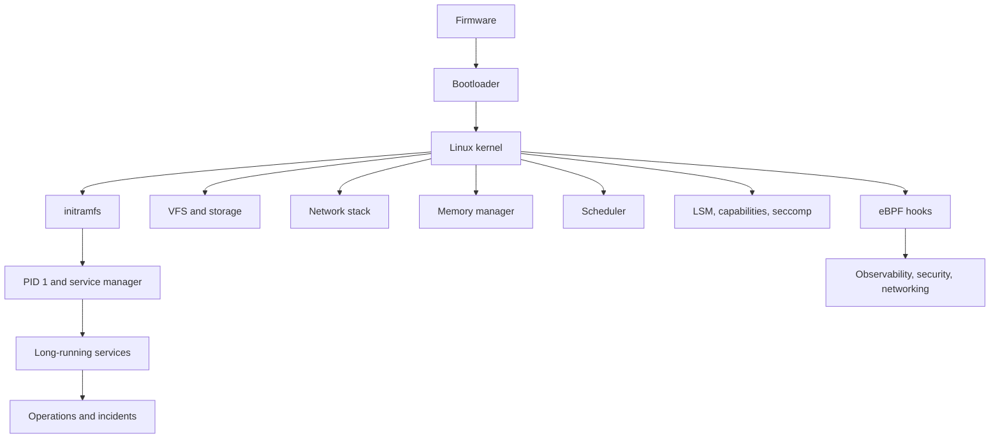

Purpose: Map the Linux systems engineering knowledge base into a navigable field manual for deep Linux, kernel, container, performance, security, and eBPF mastery.

# Linux Systems Engineering

This compendium treats Linux as a layered production system: hardware and firmware start the machine, the kernel arbitrates privileged resources, user space composes policy and services, and operators keep the whole stack observable, secure, and recoverable. It is not a beginner command cheat sheet. It is a reference for engineers who need to predict how Linux behaves when systems are slow, isolated, overloaded, attacked, upgraded, or extended with eBPF.

Linux is a kernel, not a complete operating environment by itself. A distribution combines the kernel with a boot chain, init system, libc, package manager, user space tools, default security policy, service manager, logging stack, and release process. Production behavior often depends on both layers: a kernel feature may exist, while the distribution chooses a different default, disables a config option, backports a patch, or wraps it with systemd, NetworkManager, firewalld, SELinux, AppArmor, or a container runtime.

## Core Path

| Stage | Notes | Mastery outcome |
| --- | --- | --- |
| Mental model | [01 Linux Mental Model User Space Kernel and Hardware](/compendium/linux-systems-engineering/linux-mental-model-user-space-kernel-and-hardware), [06 System Calls ABI libc and User Kernel Boundaries](/compendium/linux-systems-engineering/system-calls-abi-libc-and-user-kernel-boundaries) | Explain where an operation runs, which ABI it crosses, and why kernel boundaries shape reliability. |
| Process model | [02 Processes Threads Scheduling Signals and Jobs](/compendium/linux-systems-engineering/processes-threads-scheduling-signals-and-jobs) | Debug process lifecycles, signal behavior, job control, CPU scheduling, and daemon failures. |
| Memory model | [03 Memory Virtual Memory Paging Allocators and OOM](/compendium/linux-systems-engineering/memory-virtual-memory-paging-allocators-and-oom) | Interpret RSS, page cache, reclaim, swap, NUMA, overcommit, and cgroup memory failures. |
| Storage model | [04 Filesystems VFS Block IO Page Cache and Storage](/compendium/linux-systems-engineering/filesystems-vfs-block-io-page-cache-and-storage) | Trace a file operation through VFS, page cache, block IO, journaling, and storage saturation. |
| Network model | [05 Linux Networking TCP IP Routing Firewalling and DNS](/compendium/linux-systems-engineering/linux-networking-tcp-ip-routing-firewalling-and-dns) | Diagnose routes, sockets, conntrack, NAT, nftables, DNS, TLS symptoms, packet loss, and throughput limits. |
| Service model | [07 systemd Boot Init Units Timers Journald and Services](/compendium/linux-systems-engineering/systemd-boot-init-units-timers-journald-and-services) | Operate systemd units, dependencies, logs, timers, hardening, resource controls, and boot failures. |
| Security model | [08 Permissions Users Groups Capabilities and LSMs](/compendium/linux-systems-engineering/permissions-users-groups-capabilities-and-lsms), [12 Linux Security Hardening Secrets and Incident Response](/compendium/linux-systems-engineering/linux-security-hardening-secrets-and-incident-response) | Reason about identity, capabilities, LSMs, seccomp, secrets, patching, and incident containment. |
| Isolation model | [09 cgroups Namespaces Containers and Runtime Isolation](/compendium/linux-systems-engineering/cgroups-namespaces-containers-and-runtime-isolation) | Explain containers as Linux process isolation using namespaces, cgroups, mounts, runtime specs, and host kernel policy. |
| Observability model | [10 Observability Logs Metrics Tracing and Debugging](/compendium/linux-systems-engineering/observability-logs-metrics-tracing-and-debugging), [11 Performance Engineering perf Flamegraphs and Capacity](/compendium/linux-systems-engineering/performance-engineering-perf-flamegraphs-and-capacity) | Collect useful evidence without distorting the workload, then connect symptoms to bottlenecks. |
| Kernel model | [13 Kernel Architecture Modules Drivers and Device Model](/compendium/linux-systems-engineering/kernel-architecture-modules-drivers-and-device-model) | Understand kernel subsystems, modules, drivers, locking, RCU, panics, taint, and build boundaries. |
| eBPF model | [14 eBPF Fundamentals Verifier Maps Programs and Helpers](/compendium/linux-systems-engineering/ebpf-fundamentals-verifier-maps-programs-and-helpers), [15 eBPF Networking XDP TC Cilium and Service Dataplanes](/compendium/linux-systems-engineering/ebpf-networking-xdp-tc-cilium-and-service-dataplanes), [16 eBPF Observability Uprobes Kprobes Tracepoints and CO-RE](/compendium/linux-systems-engineering/ebpf-observability-uprobes-kprobes-tracepoints-and-co-re) | Use eBPF as constrained kernel extension machinery for tracing, networking, and security without treating it as magic. |
| Operations model | [17 Production Operations Troubleshooting and Runbooks](/compendium/linux-systems-engineering/production-operations-troubleshooting-and-runbooks), [18 Linux Ecosystem Tools and Learning Projects](/compendium/linux-systems-engineering/linux-ecosystem-tools-and-learning-projects) | Practice repeatable incident response, tool fluency, and learning projects that map to production realities. |

## Operating Principles

| Principle | Practical consequence |
| --- | --- |
| The kernel owns enforcement. | A CLI can request behavior, but the kernel decides based on credentials, namespaces, LSM policy, cgroup limits, device state, and current resources. |
| User space owns policy. | systemd units, package hooks, DNS resolvers, firewalls, PAM stacks, container runtimes, and orchestrators express policy through kernel APIs. |
| Most incidents are boundary failures. | Slow DNS, stuck mounts, OOM kills, packet drops, service restarts, and permission denials usually involve a mismatch between user space intent and kernel state. |
| Observability changes systems. | `strace`, `perf`, eBPF, tcpdump, debugfs, and verbose logs add overhead, expose sensitive data, or require privileges. Use bounded scope in production. |
| Containers share the host kernel. | Namespaces hide global resources and cgroups meter resources, but the kernel, many drivers, and many attack surfaces remain shared. |
| Version details matter. | Kernel config, distribution backports, systemd version, cgroup mode, BTF availability, nftables backend, and container runtime defaults can change behavior. |

## Local Machines, Production Hosts, and Clusters

| Environment | Bias | What to avoid |
| --- | --- | --- |
| Local learning machine | Experiment freely with namespaces, custom kernels, bpftrace one-liners, mount labs, and toy cgroups. | Confusing permissive local privileges with production access. |
| Production Linux host | Prefer read-only inspection, bounded tracing, reversible unit changes, staged firewall changes, and evidence capture before mutation. | Running unbounded tracers, deleting logs, killing processes blindly, flushing conntrack, or changing sysctls without rollback. |
| Production cluster | Treat the node as part of a scheduler, network dataplane, storage plane, and security policy set. | Debugging a node as if Kubernetes, containerd, CNI, CSI, and cloud metadata are irrelevant. |

## Fast Diagnostic Triage

| Symptom | First boundary to check | Notes |
| --- | --- | --- |
| Service will not start | [07 systemd Boot Init Units Timers Journald and Services](/compendium/linux-systems-engineering/systemd-boot-init-units-timers-journald-and-services) | Unit dependency, environment, permission, mount, cgroup, or executable path failure. |
| High load with low CPU | [02 Processes Threads Scheduling Signals and Jobs](/compendium/linux-systems-engineering/processes-threads-scheduling-signals-and-jobs), [04 Filesystems VFS Block IO Page Cache and Storage](/compendium/linux-systems-engineering/filesystems-vfs-block-io-page-cache-and-storage) | Often IO wait, uninterruptible sleep, lock contention, or blocked storage path. |
| OOM killed container | [03 Memory Virtual Memory Paging Allocators and OOM](/compendium/linux-systems-engineering/memory-virtual-memory-paging-allocators-and-oom), [09 cgroups Namespaces Containers and Runtime Isolation](/compendium/linux-systems-engineering/cgroups-namespaces-containers-and-runtime-isolation) | Compare host memory pressure with memcg limits and `memory.events`. |
| Cannot bind port | [05 Linux Networking TCP IP Routing Firewalling and DNS](/compendium/linux-systems-engineering/linux-networking-tcp-ip-routing-firewalling-and-dns), [08 Permissions Users Groups Capabilities and LSMs](/compendium/linux-systems-engineering/permissions-users-groups-capabilities-and-lsms) | Existing socket, namespace mismatch, privilege, SELinux/AppArmor, or ephemeral port exhaustion. |
| DNS slow or wrong | [05 Linux Networking TCP IP Routing Firewalling and DNS](/compendium/linux-systems-engineering/linux-networking-tcp-ip-routing-firewalling-and-dns), [17 Production Operations Troubleshooting and Runbooks](/compendium/linux-systems-engineering/production-operations-troubleshooting-and-runbooks) | Resolver order, systemd-resolved split DNS, search domains, packet loss, or firewall. |
| BPF program rejected | [14 eBPF Fundamentals Verifier Maps Programs and Helpers](/compendium/linux-systems-engineering/ebpf-fundamentals-verifier-maps-programs-and-helpers), [16 eBPF Observability Uprobes Kprobes Tracepoints and CO-RE](/compendium/linux-systems-engineering/ebpf-observability-uprobes-kprobes-tracepoints-and-co-re) | Verifier proof failure, helper mismatch, unbounded access, missing BTF, or unsupported attach point. |

## Operational Vocabulary Anchors

These exact phrases are intentionally present for Obsidian search and review. The detailed treatment lives in the linked notes.

| Anchor | Operational reading |
| --- | --- |
| Kernel space vs user space | [01 Linux Mental Model User Space Kernel and Hardware](/compendium/linux-systems-engineering/linux-mental-model-user-space-kernel-and-hardware) explains privilege, address space separation, and why failures often appear at this boundary. |
| libc and ABI boundaries | [06 System Calls ABI libc and User Kernel Boundaries](/compendium/linux-systems-engineering/system-calls-abi-libc-and-user-kernel-boundaries) explains libc wrappers, syscall ABI contracts, errno, and stable user space behavior. |
| CPU privilege rings | [01 Linux Mental Model User Space Kernel and Hardware](/compendium/linux-systems-engineering/linux-mental-model-user-space-kernel-and-hardware) ties rings to traps, interrupts, exceptions, syscall entry, and device access. |
| Interrupts and exceptions | [01 Linux Mental Model User Space Kernel and Hardware](/compendium/linux-systems-engineering/linux-mental-model-user-space-kernel-and-hardware) separates asynchronous hardware interrupts from synchronous CPU exceptions. |
| Distribution vs kernel distinction | [01 Linux Mental Model User Space Kernel and Hardware](/compendium/linux-systems-engineering/linux-mental-model-user-space-kernel-and-hardware) separates upstream kernel mechanisms from distribution defaults and support policy. |
| Package managers overview | [18 Linux Ecosystem Tools and Learning Projects](/compendium/linux-systems-engineering/linux-ecosystem-tools-and-learning-projects) compares package managers as distribution policy and supply chain machinery. |
| stdin stdout stderr | [01 Linux Mental Model User Space Kernel and Hardware](/compendium/linux-systems-engineering/linux-mental-model-user-space-kernel-and-hardware) treats standard streams as inherited file descriptors, not special shell magic. |
| Tasks in the Linux kernel | [02 Processes Threads Scheduling Signals and Jobs](/compendium/linux-systems-engineering/processes-threads-scheduling-signals-and-jobs) maps processes and threads onto kernel tasks. |
| SIGKILL vs SIGTERM | [02 Processes Threads Scheduling Signals and Jobs](/compendium/linux-systems-engineering/processes-threads-scheduling-signals-and-jobs) distinguishes cooperative termination from uncatchable forced termination. |
| CFS scheduler | [02 Processes Threads Scheduling Signals and Jobs](/compendium/linux-systems-engineering/processes-threads-scheduling-signals-and-jobs) places CFS in context with EEVDF documentation and real-time classes. |
| jobs and daemons | [02 Processes Threads Scheduling Signals and Jobs](/compendium/linux-systems-engineering/processes-threads-scheduling-signals-and-jobs) connects shell job control to long-running service supervision. |
| Pages and huge pages | [03 Memory Virtual Memory Paging Allocators and OOM](/compendium/linux-systems-engineering/memory-virtual-memory-paging-allocators-and-oom) explains base pages, transparent huge pages, hugetlbfs, and TLB tradeoffs. |
| brk and heap | [03 Memory Virtual Memory Paging Allocators and OOM](/compendium/linux-systems-engineering/memory-virtual-memory-paging-allocators-and-oom) separates classic heap growth from mmap-backed allocations. |
| debugging OOM and memory pressure | [03 Memory Virtual Memory Paging Allocators and OOM](/compendium/linux-systems-engineering/memory-virtual-memory-paging-allocators-and-oom) uses dmesg, cgroup events, PSI, smaps, and workload evidence. |
| symbolic links | [04 Filesystems VFS Block IO Page Cache and Storage](/compendium/linux-systems-engineering/filesystems-vfs-block-io-page-cache-and-storage) covers symlink path resolution and security footguns. |
| Btrfs overview | [04 Filesystems VFS Block IO Page Cache and Storage](/compendium/linux-systems-engineering/filesystems-vfs-block-io-page-cache-and-storage) treats Btrfs as copy-on-write storage with snapshots and operational complexity. |
| LVM overview | [04 Filesystems VFS Block IO Page Cache and Storage](/compendium/linux-systems-engineering/filesystems-vfs-block-io-page-cache-and-storage) places LVM between filesystems and block devices. |
| RAID overview | [04 Filesystems VFS Block IO Page Cache and Storage](/compendium/linux-systems-engineering/filesystems-vfs-block-io-page-cache-and-storage) separates redundancy, availability, rebuild risk, and backup. |
| dm-crypt overview | [04 Filesystems VFS Block IO Page Cache and Storage](/compendium/linux-systems-engineering/filesystems-vfs-block-io-page-cache-and-storage) maps encryption at the device-mapper layer. |
| io_uring overview | [04 Filesystems VFS Block IO Page Cache and Storage](/compendium/linux-systems-engineering/filesystems-vfs-block-io-page-cache-and-storage) frames io_uring as an async submission and completion interface, not a universal speed switch. |
| IOPS vs throughput | [04 Filesystems VFS Block IO Page Cache and Storage](/compendium/linux-systems-engineering/filesystems-vfs-block-io-page-cache-and-storage) distinguishes operation rate from sustained bytes per second. |
| latency and queue depth | [04 Filesystems VFS Block IO Page Cache and Storage](/compendium/linux-systems-engineering/filesystems-vfs-block-io-page-cache-and-storage) explains why deeper queues can improve throughput while hurting tail latency. |
| filesystem troubleshooting | [04 Filesystems VFS Block IO Page Cache and Storage](/compendium/linux-systems-engineering/filesystems-vfs-block-io-page-cache-and-storage) starts from mounts, inodes, free space, dirty writeback, and block saturation. |
| firewalld overview | [05 Linux Networking TCP IP Routing Firewalling and DNS](/compendium/linux-systems-engineering/linux-networking-tcp-ip-routing-firewalling-and-dns) treats firewalld as policy management over nftables or iptables backends. |
| MTU and fragmentation | [05 Linux Networking TCP IP Routing Firewalling and DNS](/compendium/linux-systems-engineering/linux-networking-tcp-ip-routing-firewalling-and-dns) maps packet size failures to PMTU, tunnels, ICMP, and drops. |
| TCP states | [05 Linux Networking TCP IP Routing Firewalling and DNS](/compendium/linux-systems-engineering/linux-networking-tcp-ip-routing-firewalling-and-dns) uses `ss` state output to reason about listeners, handshakes, close, and TIME_WAIT. |
| ordering vs requirement | [07 systemd Boot Init Units Timers Journald and Services](/compendium/linux-systems-engineering/systemd-boot-init-units-timers-journald-and-services) separates `After=` ordering from `Requires=` dependency. |
| setuid and setgid | [08 Permissions Users Groups Capabilities and LSMs](/compendium/linux-systems-engineering/permissions-users-groups-capabilities-and-lsms) explains legacy privilege transitions and modern capability alternatives. |
| Landlock overview | [08 Permissions Users Groups Capabilities and LSMs](/compendium/linux-systems-engineering/permissions-users-groups-capabilities-and-lsms) describes unprivileged filesystem access restrictions as an LSM feature. |
| module signing overview | [08 Permissions Users Groups Capabilities and LSMs](/compendium/linux-systems-engineering/permissions-users-groups-capabilities-and-lsms) and [13 Kernel Architecture Modules Drivers and Device Model](/compendium/linux-systems-engineering/kernel-architecture-modules-drivers-and-device-model) connect signed modules to secure boot and lockdown posture. |
| cgroup v1 vs cgroup v2 | [09 cgroups Namespaces Containers and Runtime Isolation](/compendium/linux-systems-engineering/cgroups-namespaces-containers-and-runtime-isolation) explains unified hierarchy behavior and migration tradeoffs. |
| CPU controller | [09 cgroups Namespaces Containers and Runtime Isolation](/compendium/linux-systems-engineering/cgroups-namespaces-containers-and-runtime-isolation) covers CPU weights, quotas, throttling, and scheduler impact. |
| memory controller | [09 cgroups Namespaces Containers and Runtime Isolation](/compendium/linux-systems-engineering/cgroups-namespaces-containers-and-runtime-isolation) covers memcg accounting, limits, reclaim, and OOM. |
| IO controller | [09 cgroups Namespaces Containers and Runtime Isolation](/compendium/linux-systems-engineering/cgroups-namespaces-containers-and-runtime-isolation) covers block IO control where supported by kernel and device stack. |
| cpuset controller | [09 cgroups Namespaces Containers and Runtime Isolation](/compendium/linux-systems-engineering/cgroups-namespaces-containers-and-runtime-isolation) covers CPU and NUMA node placement constraints. |
| uts namespace | [09 cgroups Namespaces Containers and Runtime Isolation](/compendium/linux-systems-engineering/cgroups-namespaces-containers-and-runtime-isolation) explains hostname and domain-name isolation. |
| container runtime model | [09 cgroups Namespaces Containers and Runtime Isolation](/compendium/linux-systems-engineering/cgroups-namespaces-containers-and-runtime-isolation) separates image manager, CRI service, OCI runtime, and kernel primitives. |
| CRI-O overview | [09 cgroups Namespaces Containers and Runtime Isolation](/compendium/linux-systems-engineering/cgroups-namespaces-containers-and-runtime-isolation) compares CRI-O with containerd as a Kubernetes CRI implementation. |
| overlayfs for containers | [09 cgroups Namespaces Containers and Runtime Isolation](/compendium/linux-systems-engineering/cgroups-namespaces-containers-and-runtime-isolation) links image layers to merged writable container root filesystems. |
| container security boundaries | [09 cgroups Namespaces Containers and Runtime Isolation](/compendium/linux-systems-engineering/cgroups-namespaces-containers-and-runtime-isolation) treats boundaries as layered controls, not VM equivalence. |
| diagnosing high memory | [10 Observability Logs Metrics Tracing and Debugging](/compendium/linux-systems-engineering/observability-logs-metrics-tracing-and-debugging) and [17 Production Operations Troubleshooting and Runbooks](/compendium/linux-systems-engineering/production-operations-troubleshooting-and-runbooks) start with RSS, cache, cgroups, swap, PSI, and OOM logs. |
| diagnosing slow disk | [10 Observability Logs Metrics Tracing and Debugging](/compendium/linux-systems-engineering/observability-logs-metrics-tracing-and-debugging) uses latency, utilization, queue depth, dirty pages, and filesystem evidence. |
| diagnosing network latency | [10 Observability Logs Metrics Tracing and Debugging](/compendium/linux-systems-engineering/observability-logs-metrics-tracing-and-debugging) combines routes, DNS, retransmits, packet loss, tcpdump, and service metrics. |
| Module loading and unloading | [13 Kernel Architecture Modules Drivers and Device Model](/compendium/linux-systems-engineering/kernel-architecture-modules-drivers-and-device-model) covers `modprobe`, `insmod`, dependencies, reference counts, and production risk. |
| syscalls table overview | [13 Kernel Architecture Modules Drivers and Device Model](/compendium/linux-systems-engineering/kernel-architecture-modules-drivers-and-device-model) places syscall dispatch in the architecture boundary without promising a stable internal table layout. |
| tasklets status and modern alternatives | [13 Kernel Architecture Modules Drivers and Device Model](/compendium/linux-systems-engineering/kernel-architecture-modules-drivers-and-device-model) notes legacy tasklets and prefers workqueues, threaded IRQs, NAPI, and other maintained mechanisms when appropriate. |
| building a kernel overview | [13 Kernel Architecture Modules Drivers and Device Model](/compendium/linux-systems-engineering/kernel-architecture-modules-drivers-and-device-model) treats kernel builds as lab or vendor-governed production work. |
| What eBPF is and is not | [14 eBPF Fundamentals Verifier Maps Programs and Helpers](/compendium/linux-systems-engineering/ebpf-fundamentals-verifier-maps-programs-and-helpers) frames eBPF as verified kernel extension, not arbitrary kernel scripting. |
| BPF instruction set overview | [14 eBPF Fundamentals Verifier Maps Programs and Helpers](/compendium/linux-systems-engineering/ebpf-fundamentals-verifier-maps-programs-and-helpers) describes registers, instructions, helpers, maps, and JIT context. |
| kretprobes | [14 eBPF Fundamentals Verifier Maps Programs and Helpers](/compendium/linux-systems-engineering/ebpf-fundamentals-verifier-maps-programs-and-helpers) and [16 eBPF Observability Uprobes Kprobes Tracepoints and CO-RE](/compendium/linux-systems-engineering/ebpf-observability-uprobes-kprobes-tracepoints-and-co-re) cover return probes and fragility. |
| raw tracepoints | [14 eBPF Fundamentals Verifier Maps Programs and Helpers](/compendium/linux-systems-engineering/ebpf-fundamentals-verifier-maps-programs-and-helpers) covers lower overhead tracepoint variants and type safety tradeoffs. |
| Aya overview | [14 eBPF Fundamentals Verifier Maps Programs and Helpers](/compendium/linux-systems-engineering/ebpf-fundamentals-verifier-maps-programs-and-helpers) places Aya as Rust tooling over the same kernel BPF APIs. |
| when eBPF is the wrong tool | [14 eBPF Fundamentals Verifier Maps Programs and Helpers](/compendium/linux-systems-engineering/ebpf-fundamentals-verifier-maps-programs-and-helpers) lists cases where logs, metrics, perf, tcpdump, or code changes are safer. |
| TC ingress and egress | [15 eBPF Networking XDP TC Cilium and Service Dataplanes](/compendium/linux-systems-engineering/ebpf-networking-xdp-tc-cilium-and-service-dataplanes) compares TC hooks with XDP and socket hooks. |
| socket-level hooks | [15 eBPF Networking XDP TC Cilium and Service Dataplanes](/compendium/linux-systems-engineering/ebpf-networking-xdp-tc-cilium-and-service-dataplanes) covers socket filters and socket-related cgroup hooks. |
| Hubble style flows | [15 eBPF Networking XDP TC Cilium and Service Dataplanes](/compendium/linux-systems-engineering/ebpf-networking-xdp-tc-cilium-and-service-dataplanes) connects flow observability to service and policy context. |
| USDT probes overview | [16 eBPF Observability Uprobes Kprobes Tracepoints and CO-RE](/compendium/linux-systems-engineering/ebpf-observability-uprobes-kprobes-tracepoints-and-co-re) explains application-defined tracing points. |
| production overhead management | [16 eBPF Observability Uprobes Kprobes Tracepoints and CO-RE](/compendium/linux-systems-engineering/ebpf-observability-uprobes-kprobes-tracepoints-and-co-re) covers sampling, filtering, aggregation, and rollout limits. |
| cardinality control | [16 eBPF Observability Uprobes Kprobes Tracepoints and CO-RE](/compendium/linux-systems-engineering/ebpf-observability-uprobes-kprobes-tracepoints-and-co-re) limits map keys, labels, and emitted events. |
| kernel version compatibility | [16 eBPF Observability Uprobes Kprobes Tracepoints and CO-RE](/compendium/linux-systems-engineering/ebpf-observability-uprobes-kprobes-tracepoints-and-co-re) covers helper availability, BTF, CO-RE, and attach point differences. |
| Boot failure troubleshooting | [17 Production Operations Troubleshooting and Runbooks](/compendium/linux-systems-engineering/production-operations-troubleshooting-and-runbooks) starts from firmware, bootloader, kernel command line, initramfs, root mount, and PID 1. |
| high CPU incidents | [17 Production Operations Troubleshooting and Runbooks](/compendium/linux-systems-engineering/production-operations-troubleshooting-and-runbooks) moves from saturation confirmation to process, thread, syscall, and profile evidence. |
| memory pressure incidents | [17 Production Operations Troubleshooting and Runbooks](/compendium/linux-systems-engineering/production-operations-troubleshooting-and-runbooks) checks PSI, reclaim, cgroups, swap, page cache, and OOM sequence. |
| OOM incidents | [17 Production Operations Troubleshooting and Runbooks](/compendium/linux-systems-engineering/production-operations-troubleshooting-and-runbooks) separates global OOM from memcg OOM and captures killer logs. |
| load average investigation | [17 Production Operations Troubleshooting and Runbooks](/compendium/linux-systems-engineering/production-operations-troubleshooting-and-runbooks) separates runnable work from uninterruptible sleep. |
| zombie processes | [17 Production Operations Troubleshooting and Runbooks](/compendium/linux-systems-engineering/production-operations-troubleshooting-and-runbooks) treats zombies as wait failures owned by parents or service supervisors. |
| systemd unit failures | [17 Production Operations Troubleshooting and Runbooks](/compendium/linux-systems-engineering/production-operations-troubleshooting-and-runbooks) checks unit state, logs, dependency graph, credentials, cgroups, and sandboxing. |
| data collection checklist | [17 Production Operations Troubleshooting and Runbooks](/compendium/linux-systems-engineering/production-operations-troubleshooting-and-runbooks) prioritizes volatile evidence before mutation. |
| escalation checklist | [17 Production Operations Troubleshooting and Runbooks](/compendium/linux-systems-engineering/production-operations-troubleshooting-and-runbooks) defines when to involve application, kernel, network, security, or vendor owners. |
| post-incident review checklist | [17 Production Operations Troubleshooting and Runbooks](/compendium/linux-systems-engineering/production-operations-troubleshooting-and-runbooks) connects symptoms, timeline, contributing factors, and durable follow-up. |

## Reference Sources Used For Drift-Prone Facts

Official and primary sources should be preferred for current behavior:

| Domain | Primary references |
| --- | --- |
| Kernel user visible APIs | `https://docs.kernel.org/`, `https://man7.org/linux/man-pages/` |
| cgroup v2 | `https://docs.kernel.org/admin-guide/cgroup-v2.html` |
| eBPF verifier and APIs | `https://docs.kernel.org/bpf/`, `https://docs.kernel.org/userspace-api/ebpf/` |
| systemd units and execution | `https://www.freedesktop.org/software/systemd/man/` |
| nftables | `https://www.netfilter.org/projects/nftables/manpage.html` |
| iproute2 and sockets | `https://man7.org/linux/man-pages/man8/ip.8.html`, distribution man pages for `ss(8)` |

## Related Notes

- [00 Linux Systems Mastery Roadmap](/compendium/linux-systems-engineering/linux-systems-mastery-roadmap)
- [17 Production Operations Troubleshooting and Runbooks](/compendium/linux-systems-engineering/production-operations-troubleshooting-and-runbooks)
- [18 Linux Ecosystem Tools and Learning Projects](/compendium/linux-systems-engineering/linux-ecosystem-tools-and-learning-projects)
