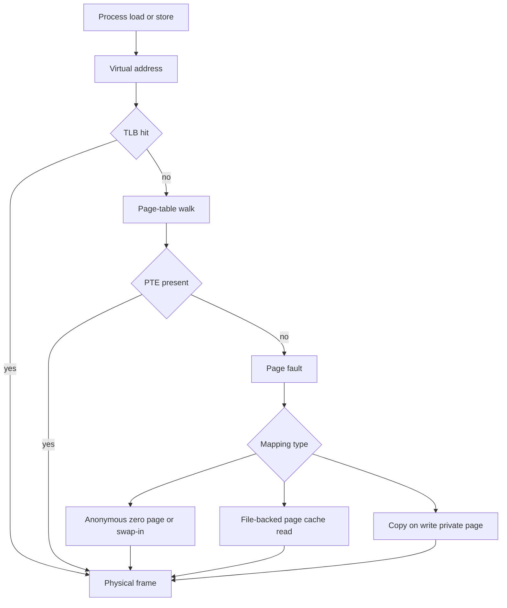
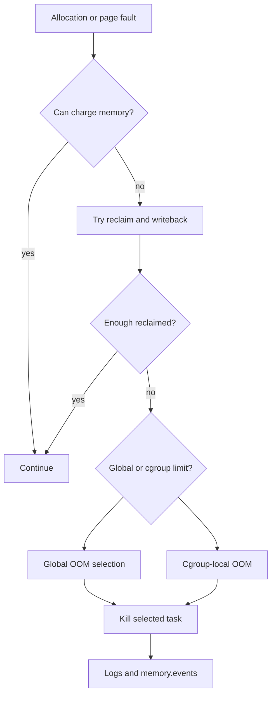

Purpose: Build a production-ready mental model for Linux virtual memory, paging, allocation, page cache, reclaim, swap, cgroup memory accounting, NUMA, and OOM behavior, with enough practical detail to debug memory pressure without confusing address space size, resident memory, cache, and enforceable limits.

Related notes: [Linux Systems Engineering](/compendium/linux-systems-engineering/linux-systems-engineering), [00 Linux Systems Mastery Roadmap](/compendium/linux-systems-engineering/linux-systems-mastery-roadmap), [01 Linux Mental Model User Space Kernel and Hardware](/compendium/linux-systems-engineering/linux-mental-model-user-space-kernel-and-hardware), [02 Processes Threads Scheduling Signals and Jobs](/compendium/linux-systems-engineering/processes-threads-scheduling-signals-and-jobs), [04 Filesystems VFS Block IO Page Cache and Storage](/compendium/linux-systems-engineering/filesystems-vfs-block-io-page-cache-and-storage), [06 System Calls ABI libc and User Kernel Boundaries](/compendium/linux-systems-engineering/system-calls-abi-libc-and-user-kernel-boundaries)

# Memory, Virtual Memory, Paging, Allocators, and OOM

Linux memory diagnosis is mostly a discipline of naming the layer precisely. A process has a virtual address space. The kernel maps virtual pages to physical frames through page tables. Some mappings are anonymous, some are file-backed, some are shared, and some are not resident at all. The page cache is memory used to cache file contents and filesystem metadata. Cgroups add accounting and limits that can make a container OOM while the host still has free memory. NUMA can make memory local or remote. The OOM killer is not a performance tool; it is a last-resort survival mechanism when reclaim cannot satisfy allocation demand.

Local learning machines are good places to test `mmap`, overcommit, swap, `stress-ng`, and `/proc/PID/smaps`. Production hosts and clusters require stricter evidence handling. Do not clear caches, disable OOM, or add swap blindly. Establish whether the pressure is global or cgroup-local, anonymous or file-backed, leak or cache growth, reclaimable or unreclaimable, host-level or NUMA-local.



## Address Spaces and Mappings

Every normal process sees a private virtual address space. That space contains executable text, shared libraries, heap, stacks, memory mappings, guard pages, VDSO, and holes. Virtual size is not the same as physical memory. A program can reserve a large range without faulting all of it into RAM. A mapping can be shared with other processes. A file-backed mapping may reflect clean pages that can be dropped and re-read rather than written to swap.

| Region | Backing | Grows | Common evidence |
| --- | --- | --- | --- |
| Text and read-only data | Executable or shared library file | No | `/proc/PID/maps`, `smaps` file mappings |
| Heap | Usually anonymous memory managed through `brk` and `mmap` by allocator | Up and down by allocator policy | `heap` mapping, allocator stats |
| Thread stacks | Anonymous private mappings | Usually downward with guard pages | Many `[stack]` or thread stacks in `smaps` |
| `mmap` file mapping | File and page cache | Fixed mapping size unless remapped | Path in `/proc/PID/maps` |
| Anonymous `mmap` | Zero-filled private memory, swap-backed if needed | Fixed mapping size unless remapped | Anonymous ranges in `smaps` |
| Shared memory | tmpfs, System V, POSIX shm, memfd, or shared anonymous | Application-defined | `RssShmem`, `/dev/shm`, deleted memfd names |
| Kernel memory | Slab, vmalloc, page tables, stacks, buffers | Kernel-managed | `/proc/meminfo`, slab tools, cgroup kernel accounting where available |

`mmap(2)` creates mappings in the process virtual address space. It can map files, anonymous memory, shared memory objects, device memory, and special kernel-provided objects. `brk(2)` adjusts the traditional program break used for the contiguous heap, but modern allocators often use both `brk` and `mmap`. Large allocations may be separate mappings. Freed memory may return to the allocator but not immediately to the kernel, which makes RSS behavior allocator-dependent.

## Pages, Page Tables, Huge Pages, and TLB

The kernel manages memory in pages. Page tables describe virtual-to-physical mappings and permissions. CPUs cache translations in the TLB, so TLB misses and page-table walks matter for large working sets. Huge pages reduce TLB pressure and page-table overhead by mapping larger chunks, but they can waste memory, increase allocation constraints, and complicate reclaim behavior.

| Mechanism | Benefit | Cost | Production guidance |
| --- | --- | --- | --- |
| Base pages | Flexible allocation and reclaim. | More page-table entries and TLB pressure for large working sets. | Default for general services. |
| Transparent Huge Pages | Automatic large-page backing for eligible mappings. | Latency spikes, compaction work, unexpected memory behavior for some workloads. | Measure workload-specific impact; many databases document preferred settings. |
| hugetlbfs huge pages | Predictable reserved huge pages. | Reserved pool, less flexible reclaim, operational planning needed. | Useful for databases, low-latency systems, and packet processing when explicitly sized. |
| TLB locality | Faster address translation. | Bad locality and random access patterns defeat it. | Profile before tuning; data layout often beats kernel knob changes. |

Huge pages are not universally faster. They help when the working set is large, hot, and translation-heavy. They hurt when memory is fragmented, lightly used, latency-sensitive to compaction, or mostly sparse. In clusters, huge page requests are capacity planning decisions because they reserve a node resource and can restrict placement.

## Anonymous, File-Backed, Shared, and Page Cache Memory

Anonymous memory is memory not backed by a regular file: heaps, stacks, private anonymous mappings, and copy-on-write private pages. If it must leave RAM, it generally needs swap or must be discarded because the process exits.

File-backed memory is backed by a file. Clean file-backed pages can usually be reclaimed by dropping them from memory because the source exists on storage. Dirty file-backed pages must be written back first. Shared libraries, executables, memory-mapped files, and many database files appear here.

The page cache stores file contents and metadata to avoid repeated I/O. It is supposed to grow when memory is otherwise unused and shrink under pressure. High "used" memory on Linux is not automatically a leak. The question is whether reclaim can free enough memory quickly, whether dirty writeback is stuck, and whether cgroup limits prevent the workload from using host-level cache elasticity.

Shared memory can be counted in multiple process RSS totals. That makes per-process RSS sums misleading. Use PSS from `smaps` or `smaps_rollup` when attribution matters.

```text
Do not sum RSS across a process tree and call it total memory.
RSS includes resident shared pages in each process that maps them.
PSS divides shared pages proportionally and is often better for attribution.
```

## Copy on Write

After `fork`, parent and child initially share physical pages as copy-on-write. Page tables mark the relevant private mappings so that a write fault allocates a new page for the writer. This makes `fork` cheap for the common fork-then-exec pattern and expensive for workloads that fork large hot address spaces and then write many pages.

Copy-on-write can surprise operators:

| Scenario | What happens | Risk |
| --- | --- | --- |
| Prefork server loads a large read-mostly dataset | Workers share many clean private pages until written. | Good memory density if dataset remains read-mostly. |
| Worker mutates global cache after fork | COW breaks sharing page by page. | RSS rises across workers. |
| Fork under memory pressure | Page tables and later COW faults still need memory. | Fork or child operation can fail despite apparent sharing. |
| Container with tight memory limit | COW charges can hit cgroup limit. | Pod OOM even when host has memory. |

The process lifecycle details connect directly to [02 Processes Threads Scheduling Signals and Jobs](/compendium/linux-systems-engineering/processes-threads-scheduling-signals-and-jobs): `fork`, `exec`, child reaping, and service supervision influence memory behavior as much as allocator code does.

## RSS, VSZ, PSS, and What They Hide

| Metric | Meaning | Trap |
| --- | --- | --- |
| VSZ or VIRT | Total virtual address space size. | Includes unmapped reservations and nonresident mappings. |
| RSS | Resident pages currently in RAM for the process. | Counts shared resident pages in every process that maps them. |
| PSS | Proportional share of resident pages. | More expensive to collect; still a snapshot. |
| USS | Private resident memory unique to process. | Not always exposed directly by basic tools. |
| Swap | Process pages swapped out. | A low value can still hide pressure if swap is disabled or cgroup-limited. |
| Cache | File-backed pages and filesystem cache. | Often reclaimable, but dirty or hot cache may be slow to reclaim. |
| Slab | Kernel object caches. | Some is reclaimable, some is not; growth may indicate kernel-side pressure. |

For process-level memory, `/proc/PID/status` gives convenient but not perfectly precise rollups. `/proc/PID/smaps` gives mapping-level detail. `/proc/PID/smaps_rollup` is faster for whole-process PSS-style views when available. For host-level state, `/proc/meminfo`, `vmstat`, PSI, slab tools, and cgroup files are more useful than one top-line "free memory" number.

Useful commands:

```bash
cat /proc/meminfo
cat /proc/pressure/memory
cat /proc/PID/status
cat /proc/PID/smaps_rollup 2>/dev/null || cat /proc/PID/smaps
pmap -x PID
grep -E 'Vm|Rss|Pss|Private|Shared|Swap' /proc/PID/smaps_rollup
```

## Reclaim, Swap, and Memory Pressure

When memory is needed, the kernel reclaims pages. Clean file-backed pages are easiest: drop them and re-read later if needed. Dirty file-backed pages require writeback. Anonymous pages require swap to be reclaimed without killing the process. Slab objects may or may not be reclaimable. Page tables, kernel stacks, pinned pages, mlocked memory, and device-related memory can be difficult or impossible to reclaim quickly.

Swap is not simply "slow RAM". It is a pressure valve for anonymous memory and a source of latency when overused. Disabling swap can make OOM arrive sooner. Excessive swap can preserve liveness while destroying latency. Production decisions depend on workload: databases with strict latency may limit or avoid swap; general-purpose hosts often benefit from some swap plus monitoring; Kubernetes nodes need careful alignment with kubelet, cgroup, and runtime behavior.

| Pressure source | Evidence | Response |
| --- | --- | --- |
| Anonymous growth | Rising `RssAnon`, heap mappings, allocator stats. | Find leak, cap cache, restart safely, adjust memory limit. |
| File cache growth | High cache, low PSI, reclaim succeeds. | Usually normal; do not clear caches reflexively. |
| Dirty writeback stuck | High dirty/writeback, I/O latency, blocked tasks. | Fix storage path, throttle writers, inspect filesystem and device health. |
| Slab growth | Rising `SReclaimable` or `SUnreclaim`, slabtop hot caches. | Identify kernel object type, workload driver, filesystem/network behavior. |
| Cgroup limit pressure | `memory.events`, `memory.current`, container OOM. | Tune limit/request, reduce workload, inspect cgroup-local reclaim. |
| NUMA imbalance | Remote memory access, local node pressure. | Check placement, affinity, memory policy, interleave or bind carefully. |

Pressure Stall Information is useful because it measures time tasks lose due to resource pressure. Memory PSI can show reclaim stalls before OOM. In production, PSI trends are often more actionable than a single free-memory threshold.

## Overcommit and OOM

Linux can allow virtual memory commitments that exceed immediate physical memory plus swap. The `/proc/sys/vm/overcommit_memory` policy controls how strictly the kernel checks commitments. Mode `0` is heuristic overcommit, mode `1` allows broad overcommit, and mode `2` enforces a stricter commit limit. The right mode is workload-dependent.

Overcommit failure and OOM kill are different. An allocation can fail with `ENOMEM` before memory is touched. Or an allocation can succeed, then a later page fault can trigger reclaim and eventually OOM if no memory can be made available. Many language runtimes do not handle allocation failure gracefully, so overcommit policy is a reliability decision, not just a performance knob.

The OOM killer chooses a victim to preserve the rest of the system. Selection considers badness scoring, memory usage, privilege, `oom_score_adj`, and cgroup context. In cgroup v2, a memory cgroup can hit its own limit and trigger cgroup-local OOM even if the host has free memory. That is normal enforcement, not host exhaustion.



Production OOM response:

1. Preserve the first OOM evidence: kernel log, service logs, cgroup `memory.events`, container exit reason, and timestamps.
2. Identify scope: global host OOM, cgroup-local OOM, application allocation failure, or orchestrator eviction.
3. Attribute memory by type: anonymous, file, shmem, slab, page tables, swap.
4. Decide mitigation: lower traffic, restart leaking process, increase limit, roll back release, reduce cache, fix query/workload, or change allocator settings.
5. Do not set `oom_score_adj=-1000` broadly. Protecting everything protects nothing and can force worse victims.

## cgroup Memory Accounting

cgroup v2 exposes memory control through files such as `memory.current`, `memory.max`, `memory.high`, `memory.low`, `memory.min`, `memory.swap.current`, `memory.swap.max`, `memory.events`, and `memory.stat`. systemd and container runtimes use these controls. The memory shown inside a container can be limited by the cgroup, not the host. A workload can OOM at its cgroup limit while the node has free pages.

| File | Practical meaning |
| --- | --- |
| `memory.current` | Current charged memory for the cgroup. |
| `memory.max` | Hard limit. Hitting it can trigger cgroup OOM. |
| `memory.high` | Throttling and reclaim pressure threshold, not a hard kill limit. |
| `memory.low` | Best-effort protection under pressure. |
| `memory.min` | Stronger protection, dangerous if overcommitted across groups. |
| `memory.swap.max` | Swap limit for the group. |
| `memory.events` | Counters for high, max, OOM, and OOM kill events. |
| `memory.stat` | Breakdown by anonymous, file, kernel, slab, workingset, and more. |

On production clusters, always capture the cgroup path. For systemd services, `systemctl status UNIT` and `/proc/PID/cgroup` show ownership. For containers, map container ID to cgroup path and read the relevant files on the node. Inside a container, tooling may hide host context; outside the container, host totals may hide cgroup-local failure.

## NUMA Overview

NUMA systems have multiple memory nodes with different access costs from different CPUs. Local memory is faster than remote memory. The scheduler, allocator, memory policy, and cgroups all influence placement. NUMA problems often look like inconsistent latency, lower throughput after rescheduling, or one node under pressure while another has free memory.

| Tool or signal | Use |
| --- | --- |
| `numactl --hardware` | See nodes, CPUs, and memory sizes. |
| `/proc/PID/numa_maps` | Inspect mapping locality and policy. |
| `numastat` | Attribute local and remote memory behavior. |
| CPU affinity | Keep threads near memory, if workload is designed for it. |
| Memory policy | Bind, prefer, or interleave allocations. |

Do not pin blindly. Pinning can improve cache and NUMA locality, but it can also overload one node, defeat scheduler balancing, and make failover harder. In clusters, node topology, CPU manager policy, huge pages, and workload requests should be considered together.

## Slab Allocators and Kernel Memory

The kernel uses slab-style allocators to cache frequently used kernel objects: dentries, inodes, network buffers, task structures, file objects, and many subsystem-specific objects. Slab caches reduce allocation overhead but can grow under workloads that create many filesystem entries, sockets, namespaces, conntrack entries, or short-lived tasks.

`SReclaimable` in `/proc/meminfo` means the kernel believes some slab memory can be reclaimed under pressure. `SUnreclaim` is harder pressure. `slabtop` and `/proc/slabinfo` help identify the cache. A large dentry cache on a busy file server may be normal. A growing unreclaimable driver cache may be a leak. A container-heavy node can spend significant memory on kernel objects attributed to workload behavior.

## Memory Leaks and Allocator Behavior

Not every rising RSS is a leak. Allocators keep arenas for reuse. Language runtimes reserve heaps and return memory slowly. File-backed mappings grow RSS as data is read. Caches can be intentional. A leak is memory that remains reachable only by accident or unreachable but not freed, and it matters when it grows relative to workload and does not stabilize.

| Symptom | Possible cause | Better evidence |
| --- | --- | --- |
| RSS rises then plateaus | Warm cache, allocator arenas, JIT, steady working set. | Compare traffic, heap stats, PSS, allocation profile. |
| RSS rises linearly with requests | Application leak or unbounded cache. | Heap profiler, object counts, request correlation. |
| VSZ huge, RSS modest | Reserved address space, sparse mappings. | `smaps`, page residency, allocator configuration. |
| RSS high across many workers | Shared pages counted repeatedly or COW broken. | PSS, private dirty, worker mutation patterns. |
| Memory drops only after restart | Leak or allocator not releasing to OS. | Runtime allocator stats, jemalloc/glibc tuning, heap dumps. |
| Host memory low, process RSS modest | Page cache, slab, other cgroups, kernel memory. | `/proc/meminfo`, cgroup stats, slabtop. |

Production guidance: instrument application heap and cache sizes before the incident. During the incident, avoid attaching intrusive profilers to critical latency paths unless the blast radius is acceptable. Prefer sampling profilers and built-in runtime endpoints where available. After mitigation, reproduce on a local or staging machine with the same allocator, cgroup limit, traffic shape, and kernel settings.

## Debugging OOM and Pressure

### Host-Level Triage

```bash
date -Is
free -h
cat /proc/meminfo
cat /proc/pressure/memory
vmstat 1
dmesg -T | grep -i -E 'out of memory|oom|killed process'
slabtop -o | head -30
```

Look for the first pressure signal, not just the final kill. OOM logs often identify the killed process, total VM, anonymous RSS, file RSS, shmem RSS, page tables, and `oom_score_adj`. Capture the full OOM block because the surrounding lines show allocation context and memory zones.

### Process-Level Triage

```bash
PID=1234
cat /proc/$PID/status
cat /proc/$PID/smaps_rollup 2>/dev/null || true
grep -E '^(Size|Rss|Pss|Private|Shared|Swap|KernelPageSize|MMUPageSize)' /proc/$PID/smaps | head -200
ls -l /proc/$PID/fd | wc -l
cat /proc/$PID/limits
```

Check whether the process is still alive. After an OOM kill, inspect supervisor logs, coredumps if enabled, container status, and cgroup event counters. For a service connected to [02 Processes Threads Scheduling Signals and Jobs](/compendium/linux-systems-engineering/processes-threads-scheduling-signals-and-jobs), also inspect restart policy and whether repeated restarts are amplifying memory pressure.

### cgroup v2 Triage

```bash
CG=/sys/fs/cgroup/path/to/group
cat $CG/memory.current
cat $CG/memory.max
cat $CG/memory.high
cat $CG/memory.events
cat $CG/memory.stat
cat $CG/memory.swap.current 2>/dev/null
cat $CG/memory.swap.max 2>/dev/null
```

If `memory.events` shows `oom_kill` increasing, the group hit an enforced limit. If `high` increments but no OOM kill occurs, the workload may be throttled by reclaim. In Kubernetes, correlate these counters with pod restart count, container last state, node pressure conditions, eviction messages, and application logs.

## Common Mistakes

| Mistake | Why it is wrong | Better move |
| --- | --- | --- |
| Calling all used memory a leak | Linux uses free memory for cache. | Separate anonymous, file, slab, and cgroup memory. |
| Summing RSS across workers | Shared pages are counted repeatedly. | Use PSS or cgroup totals. |
| Clearing page cache during incidents | Destroys useful cache and changes evidence. | Measure reclaim and pressure first. |
| Raising memory limit without leak analysis | Buys time but may increase blast radius. | Pair limit change with attribution and rollback plan. |
| Disabling OOM killer | Can hang the host instead of killing one victim. | Tune limits, `oom_score_adj`, and service behavior deliberately. |
| Treating swap as either always good or always bad | It trades liveness and latency. | Choose per workload and monitor PSI plus latency. |
| Ignoring cgroup scope | Container OOM is often local enforcement. | Read cgroup memory files and orchestrator events. |
| Tuning THP globally from folklore | Workload impact varies. | Follow workload vendor guidance and benchmark. |
| Ignoring NUMA | Remote memory can hurt latency and throughput. | Inspect placement before pinning or binding. |

## Local, Host, and Cluster Rules

Local learning machines:

- Use `stress-ng`, small C programs, Python allocators, and shell loops to create controlled pressure.
- Toggle overcommit and THP only if you can restore settings.
- Read `/proc` before and after each experiment.
- Expect results to differ across kernels, cgroup versions, and hardware.

Production hosts:

- Preserve OOM logs, PSI, cgroup counters, and process memory maps before restarting if possible.
- Tune service memory through systemd or deployment config, not one-off shell edits.
- Avoid global VM sysctl changes without workload review and rollback.
- Watch memory pressure, not just percent used.

Clusters:

- Treat requests, limits, cgroup files, node pressure, eviction policy, and application memory behavior as one system.
- Distinguish application OOM, cgroup OOM kill, kubelet eviction, and node global OOM.
- Account for page cache, tmpfs, shared memory, and sidecars inside pod limits.
- Size huge pages, NUMA-sensitive workloads, and memory-backed volumes explicitly.

## References

- https://docs.kernel.org/admin-guide/mm/index.html
- https://docs.kernel.org/admin-guide/mm/concepts.html
- https://docs.kernel.org/mm/page_tables.html
- https://docs.kernel.org/admin-guide/mm/transhuge.html
- https://docs.kernel.org/admin-guide/mm/hugetlbpage.html
- https://docs.kernel.org/admin-guide/sysctl/vm.html
- https://docs.kernel.org/filesystems/proc.html
- https://docs.kernel.org/admin-guide/cgroup-v2.html
- https://man7.org/linux/man-pages/man2/mmap.2.html
- https://man7.org/linux/man-pages/man2/execve.2.html
- https://man7.org/linux/man-pages/man2/fork.2.html
- https://man7.org/linux/man-pages/man5/proc_pid_status.5.html
- https://man7.org/linux/man-pages/man5/proc_pid_smaps.5.html
- https://man7.org/linux/man-pages/man3/shm_open.3.html
- https://man7.org/linux/man-pages/man7/shm_overview.7.html
