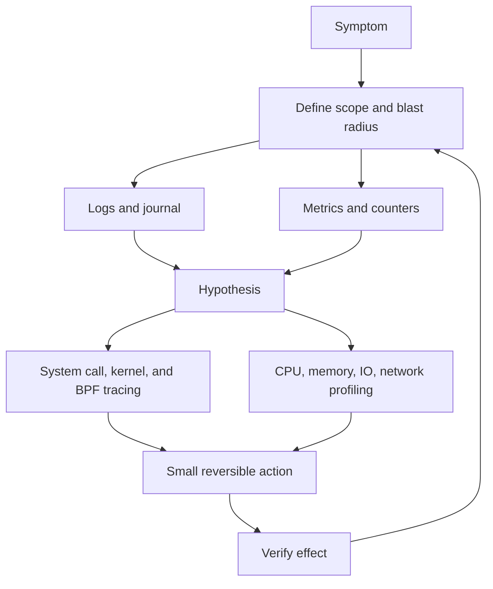

Purpose: Build an operator-grade observability and debugging model for Linux hosts and clusters, connecting logs, metrics, tracing, profiling, packet inspection, and incident triage without confusing local experiments with production-safe evidence collection.

# 10 Observability Logs Metrics Tracing and Debugging

Related notes: [07 systemd Boot Init Units Timers Journald and Services](/compendium/linux-systems-engineering/systemd-boot-init-units-timers-journald-and-services), [11 Performance Engineering perf Flamegraphs and Capacity](/compendium/linux-systems-engineering/performance-engineering-perf-flamegraphs-and-capacity), [06 System Calls ABI libc and User Kernel Boundaries](/compendium/linux-systems-engineering/system-calls-abi-libc-and-user-kernel-boundaries), [02 Processes Threads Scheduling Signals and Jobs](/compendium/linux-systems-engineering/processes-threads-scheduling-signals-and-jobs), [03 Memory Virtual Memory Paging Allocators and OOM](/compendium/linux-systems-engineering/memory-virtual-memory-paging-allocators-and-oom), [04 Filesystems VFS Block IO Page Cache and Storage](/compendium/linux-systems-engineering/filesystems-vfs-block-io-page-cache-and-storage), [05 Linux Networking TCP IP Routing Firewalling and DNS](/compendium/linux-systems-engineering/linux-networking-tcp-ip-routing-firewalling-and-dns), [09 cgroups Namespaces Containers and Runtime Isolation](/compendium/linux-systems-engineering/cgroups-namespaces-containers-and-runtime-isolation), [17 Production Operations Troubleshooting and Runbooks](/compendium/linux-systems-engineering/production-operations-troubleshooting-and-runbooks)

Linux observability is the discipline of asking the kernel, services, runtimes, and network stack for evidence while keeping the workload as close as possible to its failing state. Logs explain discrete events. Metrics show resource shape over time. Traces connect actions across boundaries. Profilers reveal where time is spent. Debuggers and tracers show precise interactions, but they can perturb the system, expose sensitive data, or require privileges that production hosts intentionally restrict.

On a local learning machine, it is acceptable to attach `strace` to toy programs, mount `debugfs`, run wide `bpftrace` scripts, capture packets on any interface, and tune logging aggressively. On production Linux hosts, every command must be bounded by scope, duration, privilege, retention, and data sensitivity. On production clusters, node evidence must be interpreted together with scheduler placement, container cgroups, CNI routing, CSI storage, service mesh sidecars, kubelet state, and cluster-level telemetry.



## Observability Surfaces

| Surface | Best at | Typical tools | Production caution |
|---|---|---|---|
| Logs | discrete events, errors, restarts, authentication, kernel messages | `journalctl`, application logs, `dmesg` | may contain secrets, tokens, user data, request bodies |
| Metrics | trend, saturation, rate, utilization, error budget burn | `sar`, Prometheus exporters, `pidstat`, `vmstat`, `iostat` | averages hide tail latency and per-cgroup pain |
| Traces | causality across calls, syscalls, locks, scheduler, packets | distributed tracing, `strace`, ftrace, eBPF | high cardinality and high volume can overload storage |
| Profiles | where CPU time, wait time, memory, IO, or locks concentrate | `perf`, flamegraphs, BPF profilers | sampling bias, missing symbols, and short windows mislead |
| Packet evidence | what actually crossed an interface | `ss`, `tcpdump`, flow logs | captures may include credentials and customer payloads |
| Kernel state | scheduler, memory, block, network, cgroups, BPF objects | `/proc`, `/sys`, tracefs, debugfs, `bpftool` | access may be privileged and unstable across kernels |

Good incident work starts with a question that is narrow enough to disprove. "The host is slow" is not a question. "Are requests spending time waiting for disk writes, CPU run queue, memory reclaim, DNS, or upstream network response?" is a useful question because each branch maps to evidence.

## Local, Host, Cluster

| Environment | What you can do | What changes in production |
|---|---|---|
| Local learning machine | run root-only tracers, install debug symbols, enable verbose logs, capture broad packets, mount tracefs and debugfs | safe because blast radius is the machine you own |
| Production Linux host | prefer read-only inspection, short sampling windows, filters, process or cgroup scoping, documented commands | protect customer data, avoid overload, preserve evidence, respect change control |
| Production cluster | correlate pod, node, kubelet, container runtime, service mesh, CNI, CSI, and cloud control plane signals | a node symptom may be caused by placement, cgroup limits, network policy, overlay routing, or noisy neighbors |

Never debug a production cluster node as if it were an isolated laptop. A pod with high latency may be CPU throttled by its cgroup, blocked by a network policy, delayed by DNS, starved by image pulls, affected by node pressure, or waiting on a remote volume.

## Logs

Logs are indexed statements of events, not complete truth. A missing log line can mean the event did not happen, logging was disabled, the process died before flushing, rate limiting dropped it, clock skew hid it, or the log pipeline failed.

Production log questions:

- What component emitted this log?
- Was it emitted before, during, or after the user-visible symptom?
- Is the timestamp from the host, container, application, sidecar, or collector?
- Is the message an error, a retry, a timeout wrapper, or a downstream symptom?
- Are similar messages present on healthy nodes?
- Did rate limiting or sampling drop the most useful period?

Useful commands:

```bash
journalctl -u example.service --since '30 minutes ago' --no-pager
journalctl -k --since '1 hour ago' --no-pager
journalctl -p warning..alert --since today --no-pager
journalctl _PID=1234 --output=short-iso --no-pager
journalctl --list-boots
journalctl -b -1 -u example.service --no-pager
```

For production, copy relevant excerpts to the incident record without deleting or rotating logs unless retention is itself the incident. If logs contain secrets, redact them in the incident artifact and rotate the exposed secret through the process in [12 Linux Security Hardening Secrets and Incident Response](/compendium/linux-systems-engineering/linux-security-hardening-secrets-and-incident-response).

## journald

`systemd-journald` collects structured log records from service stdout and stderr, syslog, kernel messages, audit messages on some systems, and native journal APIs. `journalctl` is the primary query tool. The journal is not just text; records carry fields such as `_SYSTEMD_UNIT`, `_PID`, `_UID`, `_HOSTNAME`, `_BOOT_ID`, `PRIORITY`, and `_TRANSPORT`.

```mermaid
flowchart LR
    Service[service stdout and stderr] --> Journald[systemd-journald]
    Syslog[syslog API] --> Journald
    Kernel[kmsg] --> Journald
    Audit[audit records] --> Journald
    Journald --> Volatile[/run/log/journal]
    Journald --> Persistent[/var/log/journal]
    Journald --> Query[journalctl filters]
```

Important operating points:

- volatile journals live under `/run` and disappear after reboot
- persistent journals require storage under `/var/log/journal` on many distributions
- journal files are binary, indexed, and queryable
- service logs are tied to systemd units, which makes restarts and boot history easier to follow
- rate limiting can suppress repetitive messages
- large journals can consume disk and slow queries if retention is unmanaged

Tradeoffs:

| Choice | Benefit | Cost |
|---|---|---|
| persistent journal | post-reboot evidence and boot history | disk use and sensitive data at rest |
| volatile journal | less persistent sensitive data | weak incident forensics after reboot |
| app logs to stdout | systemd and container friendly | structured fields may be lost unless emitted as JSON or native journal |
| app writes own log files | application-specific rotation and format | split evidence and more rotation failure modes |

Common mistakes:

- reading only `journalctl -u` and missing kernel or dependency messages
- ignoring previous boots with `journalctl -b -1`
- treating local time output as globally comparable during cluster incidents
- overlooking rate limit messages
- assuming the absence of a log entry proves absence of the event

## dmesg and Kernel Ring Buffer

The kernel ring buffer contains kernel messages produced by `printk` and related paths. `dmesg` reads those messages. journald usually imports kernel messages too, but `dmesg` remains useful during early boot, driver, storage, OOM, networking, and panic investigation.

Commands:

```bash
dmesg -T
dmesg --level=err,warn
journalctl -k -b --no-pager
journalctl -k --since '10 minutes ago' --output=short-monotonic
```

Use kernel messages for:

- OOM kills and memory reclaim warnings
- filesystem and block device errors
- NIC link changes, driver resets, firmware messages
- kernel warnings, stack traces, lockups, RCU stalls
- audit or LSM denials when forwarded
- BPF verifier or loader failures in some paths

Production guidance: the ring buffer is finite. It can overwrite earlier evidence under log storms. Capture relevant output early. Do not reboot before preserving kernel evidence unless reboot is the declared mitigation and evidence loss is accepted.

## Metrics

Metrics turn observations into time series. They are strongest when they express RED and USE models:

- RED for request paths: rate, errors, duration
- USE for resources: utilization, saturation, errors

Linux resource symptoms often become clear only when counters are paired:

| Resource | Utilization signal | Saturation signal | Error signal |
|---|---|---|---|
| CPU | per-CPU busy, process CPU, steal time | run queue length, scheduler latency, throttling | soft lockups, watchdog, failed realtime deadlines |
| Memory | used memory, RSS, page cache | reclaim, swap in/out, PSI memory stall | OOM kill, allocation failure |
| Disk | device busy, read/write throughput | await, queue depth, IO PSI | IO errors, filesystem remount read-only |
| Network | throughput, packets per second | retransmits, drops, queue backlog | connection resets, route errors, DNS failures |

Useful baseline commands:

```bash
uptime
top -H
htop
ps -eo pid,ppid,stat,comm,%cpu,%mem,rss,vsz,wchan:32 --sort=-%cpu | head
pidstat -durh 1
vmstat 1
iostat -xz 1
sar -u -r -b -n DEV,TCP,ETCP 1
ss -s
```

In production, do not treat one-minute host averages as the whole story. A Kubernetes pod can be throttled while host CPU looks moderate. A single disk can be saturated while aggregate storage dashboards look healthy. A single IRQ-heavy CPU can be overloaded while total CPU is below 50 percent.

## Pressure Stall Information

Pressure Stall Information, or PSI, measures time lost because tasks are waiting for CPU, memory, or IO resources. It is useful because it captures productivity loss, not only utilization. A host can show moderate CPU use while tasks still experience CPU pressure due to run queue contention or cgroup limits.

Commands:

```bash
cat /proc/pressure/cpu
cat /proc/pressure/memory
cat /proc/pressure/io
find /sys/fs/cgroup -name cpu.pressure -o -name memory.pressure -o -name io.pressure
```

Interpretation:

- `some` means at least one task was stalled
- `full` means all non-idle tasks were stalled for that resource, where supported
- rising averages during the incident window are stronger evidence than a single sample
- cgroup PSI can point to pod or service pressure hidden by host-wide summaries

Production use:

- alert on sustained pressure, not isolated spikes
- pair PSI with latency, throttling, OOM, IO await, and run queue metrics
- use cgroup PSI for containerized workloads

## Tracing

Tracing follows events at boundaries. There are several layers:

| Tool | Boundary | Best use | Risk |
|---|---|---|---|
| `strace` | process to kernel syscalls | missing files, permissions, blocking syscalls, connect failures | ptrace overhead, sensitive arguments |
| `ltrace` | dynamic library calls | libc, resolver, malloc, library API behavior | misses static linking and many in-process paths |
| `perf trace` | syscall and event tracing through perf | lower-friction syscall view on some systems | still can be noisy |
| ftrace | kernel functions and tracepoints | scheduler, IRQ, block, networking, latency | privileged, high volume |
| bpftrace | dynamic BPF tracing | targeted kernel and userspace probes | verifier limits, overhead, privilege, data exposure |
| `bpftool` | inspect BPF objects | programs, maps, links, feature state | changes are possible if used carelessly |

Use tracing after logs and metrics have narrowed the question. Tracing the wrong thing at high volume creates a new incident.

## strace

`strace` observes system calls and signals. It is useful because syscalls are the contract between user space and the kernel. When an application says "permission denied", "timeout", or "not found", `strace` can show the exact `openat`, `connect`, `futex`, `read`, `write`, `statx`, or `execve` path.

Examples:

```bash
strace -f -tt -T -o /tmp/example.strace -- /usr/local/bin/example --check
strace -p 1234 -f -tt -T -e trace=network
strace -p 1234 -f -tt -T -e trace=file
strace -c -p 1234
```

What to look for:

- `ENOENT` on config, socket, library, certificate, or device paths
- `EACCES` or `EPERM` from permissions, capabilities, LSM, or seccomp
- long `connect`, `read`, `write`, `fsync`, `futex`, or `poll` calls
- repeated `stat` or failed search paths
- unexpected DNS resolver files, NSS modules, or certificate paths

Production cautions:

- `strace` uses ptrace and can slow or perturb the process
- attaching may require privileges and may be blocked by Yama, containers, or security policy
- arguments and buffers can contain secrets
- tracing a hot multi-threaded process can produce large output quickly

## ltrace Overview

`ltrace` records dynamic library calls made by a process. It is narrower than `strace` because it focuses on userspace library boundaries. It is useful when a dynamically linked program calls libc, resolver, crypto, malloc, or another shared library in surprising ways.

Examples:

```bash
ltrace -f -o /tmp/example.ltrace -- /usr/local/bin/example
ltrace -e malloc+free+getaddrinfo -- /usr/local/bin/example
```

Use it locally for learning and in production only with clear scope. It may miss statically linked code, direct syscalls, inlined functions, JIT code, and calls hidden by symbol visibility.

## perf

`perf` is both a profiler and a tracing interface over perf events, tracepoints, hardware counters, and software counters. In this observability note, use it for quick symptom isolation. The full performance workflow is in [11 Performance Engineering perf Flamegraphs and Capacity](/compendium/linux-systems-engineering/performance-engineering-perf-flamegraphs-and-capacity).

Commands:

```bash
perf stat -p 1234 -- sleep 10
perf top -p 1234
perf record -F 99 -g -p 1234 -- sleep 30
perf report
perf sched record -- sleep 10
perf sched latency
```

Use cases:

- high CPU: sample stacks and identify hot functions
- scheduler latency: record scheduling events and summarize wakeup delays
- lock contention: use lock events when available or BPF lock tools
- syscall-heavy workloads: compare context switches, migrations, faults, cycles, and instructions

Production cautions:

- hardware counter availability varies by CPU, kernel, virtualization, and `perf_event_paranoid`
- stack unwinding needs frame pointers, DWARF data, or ORC kernel unwinder support
- high sample rates increase overhead
- container symbols may need host access to container filesystems and debug packages

## ftrace, tracefs, and debugfs

ftrace is a kernel tracing framework. It exposes controls and ring buffers through tracefs, usually mounted at `/sys/kernel/tracing`. Older documentation and workflows may mention debugfs paths such as `/sys/kernel/debug/tracing`; modern systems should prefer tracefs for tracing. debugfs is a developer-oriented filesystem with no stable ABI guarantee, so production automation should not depend on arbitrary debugfs file formats unless the platform owns the kernel and operational contract.

Basic tracefs workflow:

```bash
sudo mount -t tracefs tracefs /sys/kernel/tracing
cd /sys/kernel/tracing
cat available_tracers
cat available_events | head
echo 0 | sudo tee tracing_on
echo nop | sudo tee current_tracer
echo 1 | sudo tee events/sched/sched_switch/enable
echo 1 | sudo tee tracing_on
sleep 5
echo 0 | sudo tee tracing_on
sudo cat trace > /tmp/trace.txt
echo 0 | sudo tee events/sched/sched_switch/enable
```

Use ftrace for:

- scheduler wakeup and context switch questions
- IRQ and softirq behavior
- block IO issue, completion, and latency events
- function graph tracing in local or tightly controlled systems
- kernel debugging where static tracepoints answer the question

Production guidance:

- use event filters whenever possible
- capture short windows
- reset enabled events after capture
- avoid function graph tracing on hot paths unless you have tested overhead
- never mount broad debug surfaces casually on hardened hosts

## bpftrace and bpftool

eBPF lets approved programs run at kernel or userspace hook points under verifier constraints. `bpftrace` is a high-level tracing language for quick questions. `bpftool` inspects BPF programs, maps, links, BTF, and feature support. eBPF is powerful because it can aggregate in kernel before sending data to user space, but it is not free and not automatically safe for all production workloads.

Examples:

```bash
sudo bpftrace -e 'tracepoint:syscalls:sys_enter_openat { @[comm] = count(); }'
sudo bpftrace -e 'tracepoint:sched:sched_switch { @[prev_comm, next_comm] = count(); }'
sudo bpftrace -e 'kprobe:vfs_read { @[comm] = count(); }'
sudo bpftool prog show
sudo bpftool map show
sudo bpftool feature probe kernel
sudo bpftool prog profile id 123 duration 10
```

Use bpftrace when:

- logs and metrics identify a kernel boundary but not the culprit
- you need counts, histograms, or stack samples by process, cgroup, or event
- ftrace can expose the event but BPF aggregation would reduce output

Common mistakes:

- writing unfiltered scripts that fire on every syscall on a busy host
- printing every event instead of aggregating
- assuming BPF helper and attach support are identical across kernel versions
- ignoring BTF availability
- leaving pinned programs or maps behind
- treating unexpected `bpftool` output as harmless on hardened systems

## Flamegraphs and Off-CPU Analysis

A flamegraph visualizes stack samples. CPU flamegraphs answer "where did on-CPU samples land?" Off-CPU flamegraphs answer "where did tasks wait?" The distinction matters. A slow service with low CPU may have an empty-looking CPU flamegraph but a strong off-CPU signature in `futex`, disk IO, socket reads, DNS, locks, or scheduler delay.

High-level workflow:

```bash
perf record -F 99 -g -p 1234 -- sleep 30
perf script > /tmp/perf.stacks
# Fold stacks and render with a flamegraph toolchain.
```

Off-CPU directions:

- scheduler tracepoints and BPF tools can capture blocked stacks
- `perf sched latency` can expose wakeup delay
- `pidstat -w` shows context switch rates
- `cat /proc/&lt;pid&gt;/stack` can help for kernel blocked tasks
- `ps -eo state,wchan,pid,comm` points at wait channels

Production use:

- sample before optimizing
- keep windows representative and short
- capture symbols and build IDs
- annotate whether the graph is CPU, off-CPU, allocation, IO, or lock based
- avoid comparing graphs from different kernel builds or symbol states as if exact

## CPU Profiling

First split CPU symptoms:

| Symptom | Likely meaning | Evidence |
|---|---|---|
| high user CPU | application compute, JSON, crypto, compression, GC | `top`, `pidstat -u`, CPU flamegraph |
| high system CPU | syscalls, networking, storage, kernel work | `pidstat -u`, `perf top`, syscall tracing |
| high softirq | packet processing, timers, block completions | `/proc/softirqs`, `mpstat`, perf/ftrace |
| high steal | hypervisor contention | `mpstat`, cloud metrics |
| high load, low CPU | IO wait, locks, uninterruptible sleep, cgroup throttling | `vmstat`, `ps state`, PSI, `pidstat -w` |

Commands:

```bash
top -H -p 1234
ps -L -p 1234 -o pid,tid,psr,pcpu,stat,comm,wchan:32
pidstat -t -u -p 1234 1
perf top -p 1234
perf stat -e cycles,instructions,cache-misses,context-switches,cpu-migrations,page-faults -p 1234 -- sleep 10
```

Diagnosing high CPU:

1. Confirm scope: host, cgroup, process, thread, or interrupt.
2. Check whether CPU is user, system, softirq, irq, steal, or throttled.
3. Sample stacks with `perf` or BPF.
4. Compare hot stacks with release changes, traffic shape, and input size.
5. Mitigate by rate limiting, scaling, disabling the bad path, or rolling back before deep optimization.

## Memory Profiling

Memory symptoms can be process RSS growth, page cache growth, kernel slab growth, cgroup OOM, host OOM, swap storms, or memory pressure without OOM.

Commands:

```bash
free -h
vmstat 1
cat /proc/meminfo
cat /proc/pressure/memory
ps -eo pid,ppid,comm,rss,vsz,%mem,oom_score --sort=-rss | head
pmap -x 1234 | tail -n 20
cat /proc/1234/smaps_rollup
cat /sys/fs/cgroup/memory.current 2>/dev/null
cat /sys/fs/cgroup/memory.events 2>/dev/null
```

Interpretation:

- RSS is resident process memory, not total allocation intent
- VSZ can be huge for mapped address spaces and is often not the problem
- page cache is reclaimable until it is not fast enough
- swap activity matters more than swap allocation alone
- memcg OOM can kill a container while host memory looks healthy
- PSI memory pressure reveals stalled work before the OOM killer fires

Common mistakes:

- blaming page cache because `free` shows low free memory
- ignoring cgroup limits and `memory.events`
- diagnosing from `top` alone
- treating one process RSS as the whole leak without allocator or workload evidence
- collecting heap dumps from production without considering sensitive data

## IO Profiling

Slow disk symptoms may come from device saturation, filesystem locks, journal commits, sync writes, remote block devices, overlay filesystems, throttling, or noisy neighbors.

Commands:

```bash
iostat -xz 1
pidstat -d -p ALL 1
vmstat 1
cat /proc/pressure/io
lsblk -o NAME,TYPE,SIZE,FSTYPE,MOUNTPOINTS,ROTA,MODEL
findmnt
df -h
df -i
```

Signals:

- high `await` can mean queueing or slow service time
- high `%util` on one device can hide behind normal aggregate charts
- high `aqu-sz` means queue depth
- rising IO PSI means tasks are stalled on IO
- `D` state tasks often wait in uninterruptible kernel paths
- `fsync` heavy workloads often show latency spikes under journal or remote storage pressure

Troubleshooting slow disk:

1. Identify the mount and backing device, not just the path.
2. Check filesystem full and inode full states.
3. Use `pidstat -d` to find process-level IO.
4. Use `iostat -xz 1` to observe device latency and queueing.
5. Check kernel logs for resets, media errors, read-only remounts, and filesystem warnings.
6. In clusters, check PVC, CSI, node volume attachment, and storage class behavior.

## Network Profiling

Network latency may be DNS, local socket backlog, conntrack, routing, MTU, packet loss, TCP retransmits, TLS, upstream saturation, CNI overlay, service mesh, or application queueing.

Commands:

```bash
ss -tuna
ss -tin sport = :443
ss -s
ip route get 198.51.100.10
ip -s link
nstat -az | head -n 50
sar -n DEV,TCP,ETCP 1
tcpdump -i eth0 -nn host 198.51.100.10 and port 443 -w /tmp/capture.pcap
```

`ss` is the first socket truth tool. It can show established sockets, listen queues, retransmission data, timers, memory, and TCP internal state. `tcpdump` is packet truth, but packet truth is scoped to the interface where you capture. On a Kubernetes node, the packet may appear on veth, bridge, overlay, host interface, or sidecar interfaces depending on the dataplane.

Troubleshooting network latency:

1. Split DNS lookup time from TCP connect time, TLS time, and application response time.
2. Use `ss -tin` for retransmits, RTT, congestion window, and send or receive queues.
3. Use `ip route get` to confirm routing and source address.
4. Use `tcpdump` with narrow host, port, and duration filters.
5. Check drops on interfaces and qdiscs.
6. In clusters, compare pod namespace, node namespace, CNI policy, kube-proxy or eBPF service dataplane, and service mesh sidecars.

Production packet capture rules:

- capture for minutes, not hours, unless using an approved rolling capture system
- use BPF filters
- write to a file with restricted permissions
- record interface, host, time window, and filter
- treat captures as sensitive data

## Lock Contention and Scheduler Latency

Lock contention and scheduler latency often look like high latency with moderate CPU. A process can be runnable but waiting behind other runnable tasks. It can be blocked on a futex, kernel lock, file lock, cgroup throttle, or IO completion. It can also be woken but not scheduled promptly.

Commands:

```bash
ps -eo pid,ppid,state,ni,pri,psr,comm,wchan:32 --sort=state
pidstat -w -p ALL 1
perf sched record -- sleep 10
perf sched latency
cat /proc/pressure/cpu
cat /proc/1234/sched
```

Evidence map:

| Observation | Likely direction |
|---|---|
| many voluntary context switches | blocking waits, locks, IO, condition variables |
| many involuntary context switches | CPU competition or time slice pressure |
| high CPU PSI | runnable tasks waiting for CPU |
| high futex time | userspace lock contention or runtime scheduler waits |
| `D` state tasks | uninterruptible kernel wait, often IO or filesystem |
| high run queue latency | saturation, affinity mistake, throttling, or host contention |

In production, scheduler findings are only useful if tied back to the workload. "High context switches" is not automatically bad. A proxy, database, or runtime may have expected patterns. Look for change from baseline and correlation with user latency.

## Tool Selection Matrix

| Symptom | Start with | Then narrow with | Avoid first |
|---|---|---|---|
| high CPU | `top -H`, `pidstat -u`, `perf top` | `perf record`, CPU flamegraph | random code changes |
| high memory | `free`, `ps`, `smaps_rollup`, cgroup files | heap profiles, allocation tracing, PSI | killing the largest process blindly |
| slow disk | `iostat -xz`, `pidstat -d`, `dmesg` | block tracepoints, IO flamegraphs | assuming cloud disk is healthy |
| network latency | `ss`, `sar -n`, `ip route`, logs | `tcpdump`, BPF TCP tools | packet capture without filters |
| service failing | `systemctl status`, `journalctl -u`, `strace -e file,network` | unit sandbox review, LSM logs | editing vendor units in place |
| container slow | cgroup CPU, memory, IO, PSI | node plus pod profiling | host-only averages |
| kernel warning | `journalctl -k`, `dmesg`, tracefs if needed | crash dump, ftrace, vendor support | reboot before saving evidence |

## Incident Command Packs

Host snapshot:

```bash
date -Is
hostnamectl
uptime
systemctl --failed --no-pager
journalctl -p warning..alert --since '1 hour ago' --no-pager
journalctl -k --since '1 hour ago' --no-pager
ps -eo pid,ppid,state,comm,%cpu,%mem,rss,wchan:32 --sort=-%cpu | head -n 30
vmstat 1 5
iostat -xz 1 5
ss -s
cat /proc/pressure/cpu /proc/pressure/memory /proc/pressure/io
```

Process snapshot:

```bash
PID=1234
date -Is
ps -p "$PID" -o pid,ppid,state,comm,%cpu,%mem,rss,vsz,wchan:32
ps -L -p "$PID" -o pid,tid,psr,pcpu,state,comm,wchan:32 | head -n 40
cat /proc/"$PID"/status
cat /proc/"$PID"/sched
cat /proc/"$PID"/smaps_rollup
ls -l /proc/"$PID"/fd | head
```

Short CPU profile:

```bash
PID=1234
perf stat -p "$PID" -- sleep 10
perf record -F 99 -g -p "$PID" -- sleep 30
perf report
```

Short packet capture:

```bash
sudo tcpdump -i eth0 -nn host 198.51.100.10 and port 443 -G 60 -W 1 -w /tmp/incident.pcap
```

## Common Mistakes

| Mistake | Why it hurts | Better practice |
|---|---|---|
| starting with the most powerful tracer | creates overhead and noise | start with logs, metrics, and scoped hypotheses |
| trusting averages | hides tail latency and cgroup pressure | inspect percentiles, PSI, cgroups, and per-device data |
| ignoring time alignment | makes unrelated events look causal | use absolute timestamps and boot IDs |
| losing evidence during mitigation | removes root-cause path | collect minimal snapshots before reboot or restart |
| tracing everything | overloads host and storage | filter by PID, cgroup, event, address, or duration |
| ignoring symbols | makes profiles unactionable | install symbols or preserve build IDs where appropriate |
| treating local success as production safety | local machines lack workload and policy | test overhead and permissions on staging or canary |
| forgetting cluster layers | node evidence is partial | include pod, kubelet, CNI, CSI, and service routing |

## Production Guidance

Use a three-level evidence posture:

| Level | Use | Examples |
|---|---|---|
| Always on | low overhead, fleet-wide, retained | service metrics, journal warnings, node exporters, cgroup pressure |
| On demand | bounded, operator-triggered | `perf record`, `strace`, `tcpdump`, bpftrace one-liners |
| Lab only | high overhead or intrusive | broad function graph tracing, unfiltered syscall tracing, debug kernels |

For production Linux hosts:

- write commands into the incident record before or immediately after running them
- capture start and end times
- include host, namespace, container, unit, PID, and cgroup context
- limit duration and output size
- prefer read-only commands
- clean up tracing state
- preserve sensitive outputs with restricted permissions

For production clusters:

- correlate node pressure with pod resource limits and throttling
- compare affected and healthy pods on the same node
- compare affected and healthy nodes running the same workload
- check recent deployments, reschedules, evictions, CNI changes, storage events, and node kernel messages
- avoid debugging inside a container only; the host kernel is shared

## Troubleshooting Recipes

### High CPU

```bash
top -H
pidstat -t -u -p ALL 1
perf top
perf record -F 99 -g -p 1234 -- sleep 30
perf report
```

Decision path:

1. If one process dominates, sample its threads.
2. If system CPU dominates, inspect syscalls, networking, storage, and kernel stacks.
3. If softirq dominates, check packet rate, drops, NIC queues, and network stack.
4. If steal dominates, escalate to virtualization or cloud capacity.
5. If cgroup throttling dominates, inspect CPU quota, run queue, and pod limits.

### High Memory

```bash
free -h
cat /proc/meminfo
cat /proc/pressure/memory
ps -eo pid,comm,rss,vsz,%mem,oom_score --sort=-rss | head
journalctl -k | grep -i -E 'oom|out of memory|killed process'
```

Decision path:

1. Separate host OOM from cgroup OOM.
2. Separate RSS growth from page cache and slab growth.
3. Check swap activity and PSI.
4. Inspect workload changes, caches, queues, and leaks.
5. Mitigate with traffic reduction, restart, memory limit correction, or rollback.

### Slow Disk

```bash
iostat -xz 1
pidstat -d -p ALL 1
cat /proc/pressure/io
journalctl -k --since '1 hour ago'
df -h
df -i
```

Decision path:

1. Identify device and mount.
2. Check full filesystem and inode exhaustion.
3. Check device latency, queueing, and errors.
4. Find process-level IO.
5. In clusters, inspect PVC, CSI, volume attachment, and storage backend.

### Network Latency

```bash
ss -s
ss -tin
ip route get 198.51.100.10
sar -n DEV,TCP,ETCP 1
tcpdump -i eth0 -nn host 198.51.100.10 and port 443
```

Decision path:

1. Split DNS, connect, TLS, and application latency.
2. Check retransmits, RTT, queues, and connection state.
3. Confirm route and source address.
4. Capture a short filtered packet sample.
5. In clusters, inspect pod namespace, service routing, network policy, and sidecars.

## Reference Anchors

- `journalctl`, `systemd-journald`, and journald configuration define the primary systemd log query and storage model.
- Linux kernel tracing documentation defines ftrace, tracefs, trace events, and debugging workflows.
- Linux kernel PSI documentation defines CPU, memory, and IO pressure stall accounting.
- Linux debugfs documentation warns that debugfs is developer-oriented and not a stable userspace ABI.
- `strace`, `ltrace`, `ptrace`, and `syscalls` man pages define syscall and library-call tracing boundaries.
- `perf` man pages define `perf stat`, `perf record`, `perf report`, and related profiling commands.
- `bpftool` documentation and man pages define BPF object inspection and manipulation.
