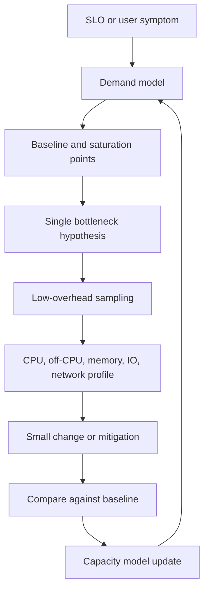
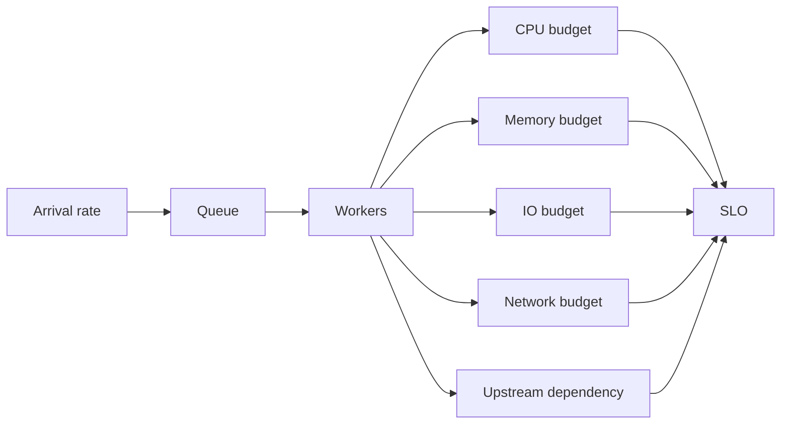

Purpose: Build a production performance engineering playbook for Linux systems that connects capacity models, bottleneck discipline, sampling, perf, flamegraphs, off-CPU analysis, and host or cluster profiling into repeatable decisions.

# 11 Performance Engineering perf Flamegraphs and Capacity

Related notes: [10 Observability Logs Metrics Tracing and Debugging](/compendium/linux-systems-engineering/observability-logs-metrics-tracing-and-debugging), [02 Processes Threads Scheduling Signals and Jobs](/compendium/linux-systems-engineering/processes-threads-scheduling-signals-and-jobs), [03 Memory Virtual Memory Paging Allocators and OOM](/compendium/linux-systems-engineering/memory-virtual-memory-paging-allocators-and-oom), [04 Filesystems VFS Block IO Page Cache and Storage](/compendium/linux-systems-engineering/filesystems-vfs-block-io-page-cache-and-storage), [05 Linux Networking TCP IP Routing Firewalling and DNS](/compendium/linux-systems-engineering/linux-networking-tcp-ip-routing-firewalling-and-dns), [06 System Calls ABI libc and User Kernel Boundaries](/compendium/linux-systems-engineering/system-calls-abi-libc-and-user-kernel-boundaries), [09 cgroups Namespaces Containers and Runtime Isolation](/compendium/linux-systems-engineering/cgroups-namespaces-containers-and-runtime-isolation), [17 Production Operations Troubleshooting and Runbooks](/compendium/linux-systems-engineering/production-operations-troubleshooting-and-runbooks)

Performance engineering is not making every function faster. It is preserving user-visible service quality under expected and unexpected load with enough evidence to know which constraint matters. Linux performance work must connect workload demand, resource supply, queueing, kernel behavior, application architecture, and failure modes. The fastest local benchmark can be irrelevant if production bottlenecks are cgroup CPU quota, remote storage latency, DNS retries, lock contention, noisy neighbors, packet loss, or a database queue outside the host.

On a local learning machine, use synthetic benchmarks to learn tools and mechanics. On production Linux hosts, measure the real workload with bounded overhead before changing code or kernel settings. In production clusters, include pod limits, scheduling, autoscaling, service mesh, storage classes, CNI dataplane, and node pressure in the capacity model.



## Bottleneck Discipline

A bottleneck is the resource, queue, lock, dependency, or policy that limits useful work at the moment. It can move after each mitigation. Performance work fails when engineers optimize a visible cost that is not limiting throughput or latency.

Discipline:

1. State the symptom in user or SLO terms.
2. Define the workload window and affected population.
3. Identify the first saturated resource or queue.
4. Gather evidence with sampling before tracing heavily.
5. Change one meaningful variable.
6. Verify against the original metric and a control.
7. Update the capacity model.

| Bad question | Better question |
|---|---|
| Why is the server slow? | Which resource or queue explains p95 latency from 14:05 to 14:20? |
| Can we optimize this function? | Does this function consume enough on-CPU time to affect the SLO? |
| Is CPU high? | Is useful throughput limited by CPU, run queue latency, throttling, or another wait? |
| Is memory used? | Is memory pressure causing reclaim, swap, OOM, or cgroup stalls? |
| Is disk busy? | Are writes queued, slow to complete, throttled, or waiting on a remote backend? |

## Capacity Model

A capacity model describes how much useful work the system can handle before the next constraint becomes unacceptable. It should be simple enough to update during incidents.

Core variables:

- arrival rate: requests, jobs, packets, messages, queries, bytes
- service time: CPU time, IO time, upstream time, lock wait, queue time
- concurrency: active requests, worker threads, connections, queue depth
- resource budget: cores, memory, IO operations, bandwidth, file descriptors, ephemeral ports
- limits: cgroup quota, memory limit, connection pools, rate limits, max workers
- SLO: latency percentile, error rate, freshness, throughput, recovery time



Useful equations are approximations, not truth:

| Model | Use | Caution |
|---|---|---|
| utilization = demand / capacity | quick saturation estimate | ignores burstiness and queues |
| concurrency = arrival rate x latency | estimate in-flight work | latency includes wait and service time |
| headroom = capacity - peak demand | planning buffer | capacity changes when bottleneck moves |
| p95 latency budget = sum of stage budgets | service-level budget | tails are not additive in a simple way |
| work per request = CPU seconds or IO ops per request | sizing and regression detection | requires stable workload mix |

Production capacity guidance:

- track peak and sustained demand separately
- model cgroup limits, not only host hardware
- document one bottleneck per service at current scale
- include dependency budgets such as database connections and remote storage IOPS
- validate autoscaling lag and cold-start cost
- reserve incident headroom for retries and failover

## Local, Host, Cluster

| Environment | Performance goal | Trap |
|---|---|---|
| Local learning machine | learn tools, reproduce micro-behavior, inspect symbols | extrapolating laptop benchmarks to production |
| Production Linux host | protect SLO and isolate the active bottleneck | changing tunables based on folklore |
| Production cluster | maintain service capacity across nodes, pods, quotas, and dependencies | treating pod latency as only application code |

Cluster performance is often capacity policy. A pod can be slow because it has a CPU quota lower than its burst demand, a memory limit that drives GC and reclaim, a noisy node, remote volume latency, a sidecar with its own queue, or service routing that sends traffic across zones.

## Sampling

Sampling observes a subset of events to infer where time or events concentrate. It is the default production profiling approach because it can be bounded and lower overhead than tracing every event.

Sampling choices:

| Choice | Good for | Tradeoff |
|---|---|---|
| fixed frequency CPU sampling | hot code paths | may miss rare latency events |
| event-based sampling | cache misses, page faults, branches | hardware and permission dependent |
| tracepoint sampling | kernel subsystem events | event volume can be high |
| wall-clock profiling | language runtime latency | runtime-specific support |
| off-CPU sampling | wait time and blocked stacks | needs scheduler or BPF support |
| allocation sampling | heap growth and churn | may miss short-lived or native allocations |

Production rules:

- capture during the symptom window
- record duration, sample rate, PID, cgroup, host, and kernel
- prefer multiple short samples over one huge sample
- avoid coordinated profiling across every node unless capacity is planned
- annotate whether the result is on-CPU, off-CPU, allocation, IO, network, or lock data

## perf Mental Model

`perf` fronts Linux perf events. It can count events, sample events, trace selected events, and read kernel tracepoints. It connects hardware PMU counters, software events, and kernel instrumentation through a consistent CLI.

| Command | Primary job | Typical output |
|---|---|---|
| `perf stat` | count events over a time window | cycles, instructions, faults, context switches |
| `perf record` | sample events and write `perf.data` | captured samples and call graphs |
| `perf report` | inspect recorded profile interactively | symbols, percentages, call chains |
| `perf script` | dump samples for tooling | stack lines for flamegraphs |
| `perf top` | live hot symbol view | live sample table |
| `perf sched` | scheduler recording and latency analysis | wakeup and scheduling delay |
| `perf list` | show available events | event names and PMU support |

Important constraints:

- `perf_event_paranoid` and capabilities control access
- container profiling may require host PID namespace or cgroup filters
- hardware events vary across CPUs and virtual machines
- call graphs need frame pointers, DWARF unwind data, LBR, or kernel unwind support
- symbol resolution depends on binaries, debug packages, build IDs, and JIT maps
- high-frequency sampling adds overhead

## perf stat

`perf stat` counts events for a command, process, CPU, or system. It is a fast first step because counters can show whether work is CPU-bound, syscall-heavy, fault-heavy, migration-heavy, or context-switch-heavy.

Examples:

```bash
perf stat -- sleep 10
perf stat -p 1234 -- sleep 10
perf stat -a -- sleep 10
perf stat -e cycles,instructions,cache-misses,context-switches,cpu-migrations,page-faults -p 1234 -- sleep 10
perf stat -d -- /usr/local/bin/example-benchmark
```

Interpretation:

| Signal | Direction |
|---|---|
| high cycles with low instructions per cycle | stalls, cache misses, branch misses, memory latency, virtualization |
| high context switches | locks, IO waits, thread oversubscription, event loop wakeups |
| high CPU migrations | scheduler movement, poor affinity, cache locality loss |
| high page faults | cold start, mmap behavior, memory pressure, file-backed demand paging |
| high cache misses | working set too large, poor locality, shared data contention |

Production guidance:

- use `perf stat` to compare before and after a change
- run on the same workload window when possible
- avoid treating one counter as root cause
- pair counters with latency and throughput metrics

## perf record and perf report

`perf record` captures samples into `perf.data`. `perf report` reads that file and attributes samples to symbols and call chains.

CPU profile:

```bash
PID=1234
perf record -F 99 -g -p "$PID" -- sleep 30
perf report
```

System-wide short profile:

```bash
sudo perf record -a -F 99 -g -- sleep 30
sudo perf report
```

Container-aware direction:

```bash
perf record -F 99 -g -p "$PID" -- sleep 30
perf report --stdio
```

If symbols are poor:

- install debug symbols for the package
- ensure binaries are not stripped without build IDs
- preserve deployed artifacts for symbolization
- enable frame pointers in performance-critical services where acceptable
- configure language runtime symbol support for JITs

Common mistakes:

- profiling outside the incident window
- recording too briefly for a bursty symptom
- comparing samples with different load shape
- ignoring kernel samples because the service is "application code"
- interpreting flat profile percentages without call chains
- optimizing a startup path for a steady-state issue

## Flamegraph Workflow

A flamegraph compresses stack samples into a visual shape. Wider frames mean more samples in that stack context. It does not directly show time order. It shows aggregation.

Workflow:

```bash
PID=1234
perf record -F 99 -g -p "$PID" -- sleep 30
perf script > /tmp/perf.script
# Convert perf script output to folded stacks, then render a flamegraph SVG.
```

Reading rules:

- width is sample count, not wall-clock duration unless the sampling source means that
- vertical position is stack depth
- top frames are leaf work
- wide plateaus indicate broad cost centers
- narrow towers may be deep but not important
- missing symbols can hide the real owner

Tradeoffs:

| Graph type | Answers | Does not answer |
|---|---|---|
| CPU flamegraph | where on-CPU samples landed | why tasks waited off CPU |
| off-CPU flamegraph | where blocked time accumulated | what consumed CPU while waiting |
| differential flamegraph | what changed between two profiles | whether change improved user SLO by itself |
| allocation flamegraph | where allocations originate | retained memory without heap retention data |
| lock flamegraph | where lock wait accumulates | whether the lock protects necessary design state |

Production guidance:

- always label graph type, host, PID or cgroup, time, sample rate, and workload
- keep raw `perf.data` or folded stacks when allowed
- restrict access because stack symbols can reveal code and business logic
- compare against a healthy control when possible

## Off-CPU Analysis

Off-CPU time is time a task is not running on CPU because it is sleeping, blocked, waiting for IO, waiting for a lock, throttled, or waiting to be scheduled. Many latency incidents are off-CPU incidents.

Evidence:

```bash
pidstat -w -p 1234 1
ps -L -p 1234 -o pid,tid,state,pcpu,wchan:32,comm
cat /proc/1234/stack
cat /proc/pressure/cpu
cat /proc/pressure/io
cat /proc/pressure/memory
perf sched record -- sleep 10
perf sched latency
```

Common wait classes:

| Wait | Typical source | Evidence |
|---|---|---|
| futex | userspace locks, runtime scheduler, condition variables | `strace`, off-CPU stacks, high context switches |
| disk IO | sync writes, reads, filesystem journal, remote volumes | `iostat`, IO PSI, `D` state, block tracepoints |
| network IO | upstream slow, TCP loss, DNS, connection pool | `ss`, `tcpdump`, app spans |
| scheduler | CPU saturation, affinity, cgroup quota | CPU PSI, run queue latency, throttling |
| memory reclaim | pressure, swap, compaction | memory PSI, `vmstat`, kernel logs |

Do not answer off-CPU questions with only CPU flamegraphs. A service can be slow because every worker is waiting on `futex` or `ep_poll` while CPU looks healthy.

## CPU Performance

CPU capacity is not just percent busy. A core can be busy doing useful work, kernel overhead, interrupts, spin, bad speculation, cache misses, or work that will be discarded due to retries.

Checklist:

```bash
mpstat -P ALL 1
pidstat -t -u -p ALL 1
perf stat -a -- sleep 10
perf top
cat /proc/softirqs
cat /proc/pressure/cpu
```

Production questions:

- Is high CPU in user, system, irq, softirq, steal, or guest?
- Is one thread hot or all workers hot?
- Is work evenly distributed across CPUs?
- Is the process CPU-throttled by cgroup quota?
- Are interrupts concentrated on one CPU?
- Did retries, logging, compression, encryption, or serialization increase?

CPU mitigations:

| Cause | Short mitigation | Long fix |
|---|---|---|
| traffic spike | rate limit, scale out, shed low-priority work | capacity and autoscaling model |
| hot code path | rollback, disable feature flag | optimize proven hot path |
| excessive retries | reduce retry storm, circuit break | bounded retry and backoff design |
| softirq pressure | rebalance queues, reduce packet rate | NIC, kernel, CNI, or architecture tuning |
| cgroup throttling | adjust request and limit, scale replicas | resource model based on real demand |

## Memory Performance

Memory capacity failures include allocation latency, reclaim stalls, swap storms, OOM kills, allocator fragmentation, page cache churn, memcg limits, kernel slab growth, and NUMA locality issues.

Commands:

```bash
free -h
vmstat 1
cat /proc/meminfo
cat /proc/pressure/memory
ps -eo pid,comm,rss,vsz,%mem,oom_score --sort=-rss | head
cat /proc/1234/smaps_rollup
numastat -p 1234 2>/dev/null
```

Performance reading:

- memory use is not bad; memory pressure is bad
- page cache improves performance until churn or reclaim dominates
- swap configured is not the same as swap storm
- GC-heavy runtimes can turn memory limits into CPU and latency spikes
- cgroup memory limits change OOM behavior from host-wide to workload-local

Capacity questions:

- What is steady RSS per unit of concurrency?
- How much memory is cache, heap, stack, mmap, and kernel?
- What happens at peak traffic plus failover traffic?
- Does the service degrade before OOM?
- Are memory limits aligned with runtime heap sizing?

## IO Performance

Block IO performance is queueing. A storage path includes filesystem, page cache, block layer, scheduler, device, hypervisor, remote backend, and application sync behavior.

Commands:

```bash
iostat -xz 1
pidstat -d -p ALL 1
cat /proc/pressure/io
vmstat 1
journalctl -k --since '1 hour ago'
```

IO questions:

- Is latency read, write, flush, discard, or metadata?
- Is the workload buffered or direct IO?
- Is the pain per-device or per-filesystem?
- Are writes synchronous with request latency?
- Are containers writing through overlay layers?
- Is the backing volume remote, throttled, burst-limited, or shared?

Tradeoffs:

| Tactic | Helps | Risk |
|---|---|---|
| batching writes | fewer syscalls and flushes | higher loss window and tail latency |
| async IO | better concurrency | harder backpressure |
| caching | lower read latency | stale data and memory pressure |
| more queue depth | higher throughput | worse tail latency under saturation |
| faster disk | more headroom | bottleneck may move to locks or CPU |

## Network Performance

Network capacity includes socket buffers, kernel queues, NIC queues, TCP congestion, DNS, TLS, routing, conntrack, firewall rules, overlays, service mesh, and upstream service time.

Commands:

```bash
ss -s
ss -tin
ip -s link
nstat -az
sar -n DEV,TCP,ETCP 1
tcpdump -i eth0 -nn host 198.51.100.10 and port 443
```

Network questions:

- Is latency before connect, during connect, during TLS, during request, or during response body?
- Are retransmits or zero windows visible?
- Are send or receive queues growing?
- Are drops increasing on interfaces or qdiscs?
- Is conntrack full or expensive?
- Does cluster routing cross zones or nodes unnecessarily?
- Is DNS latency hidden inside application request timing?

Mitigation examples:

| Cause | Short mitigation | Long fix |
|---|---|---|
| DNS latency | cache, reduce resolver retries, pin known-good resolver | resolver architecture and observability |
| TCP retransmits | shift traffic, fix path, reduce overload | network path and congestion control review |
| connection pool exhaustion | raise carefully, shed load | pool sizing by concurrency model |
| sidecar queueing | bypass, scale, or tune sidecar | service mesh capacity model |
| conntrack saturation | reduce churn, increase limits with care | architecture to reduce connection churn |

## Lock Contention

Lock contention is a queue with ownership. It can live in application mutexes, runtime locks, kernel locks, filesystem locks, database locks, or distributed locks.

Signals:

```bash
pidstat -w -p 1234 1
strace -p 1234 -f -tt -T -e trace=futex
perf lock record -- sleep 10
perf lock report
```

Not every futex wait is a problem. Event loops and runtimes use futexes normally. A lock is suspect when wait time, queue length, or tail latency rises with load and throughput stops scaling.

Design fixes:

- reduce critical section length
- shard state
- replace global locks with per-core or per-tenant structures
- avoid blocking IO while holding locks
- add backpressure before lock queues explode
- remove unnecessary cross-request shared state

## Scheduler and Run Queue Latency

Run queue latency is time a runnable task waits before getting CPU. Scheduler latency matters when CPU looks busy enough to delay work or when policy prevents work from running.

Commands:

```bash
uptime
pidstat -w -p ALL 1
cat /proc/pressure/cpu
perf sched record -- sleep 10
perf sched latency
cat /proc/1234/sched
```

Common causes:

- too many runnable threads for available cores
- cgroup CPU quota too low for bursty demand
- CPU affinity confines work to a subset of cores
- realtime or high-priority tasks starve normal work
- host noisy neighbor or hypervisor steal
- GC or runtime worker policies interact badly with quotas

Production cluster note: Kubernetes CPU requests affect scheduling, while limits create quota. A workload can be placed on a node because requests fit, then throttle under real bursts because limits are lower than demand. Host CPU can have headroom while the pod is throttled.

## Capacity Testing

Capacity tests should answer a specific question, not produce a vanity requests-per-second number.

Test design:

| Dimension | Production-grade choice |
|---|---|
| workload mix | match real endpoints, payloads, tenants, cache states |
| ramp | gradual enough to observe knee points |
| duration | long enough to hit caches, GC, compaction, rotation, and autoscaling |
| success metric | SLO, error rate, saturation, and recovery |
| environment | same limits, kernel, storage, network, and sidecars where possible |
| failure | include dependency slowness, retries, failover, and partial outage |

Capacity artifacts:

- maximum sustainable load at SLO
- first saturation point
- second bottleneck after mitigation if known
- per-request CPU, memory, IO, and network cost
- autoscaling lag and overshoot
- rollback or load-shedding threshold

## Performance Hardening

Performance hardening means making overload predictable and survivable.

Patterns:

- explicit resource requests and limits
- bounded queues
- timeouts and budgets per dependency
- retry budgets with jittered backoff
- load shedding before collapse
- connection pool limits tied to downstream capacity
- cache limits and eviction policy
- log rate limits
- batch size caps
- memory-aware runtime configuration
- graceful degradation paths

Anti-patterns:

- unlimited workers
- unlimited request body size
- unlimited logging during errors
- retry loops without deadlines
- queues that hide overload until OOM
- autoscaling only on CPU when bottleneck is IO, memory, or downstream latency
- treating restarts as capacity management

## Common Mistakes

| Mistake | Consequence | Correction |
|---|---|---|
| optimizing before measuring | time spent on non-bottlenecks | sample under real load first |
| using local microbenchmarks as proof | wrong workload and missing production limits | reproduce production constraints |
| ignoring cgroups | host looks fine while workload is throttled | inspect cgroup CPU, memory, IO, and PSI |
| reading CPU flamegraphs for waiting problems | misses lock, IO, and network waits | use off-CPU and scheduler analysis |
| comparing profiles with poor symbols | wrong owner assignment | preserve symbols and build IDs |
| tuning kernel knobs blindly | destabilizes host | tie every tuning to measured evidence and rollback |
| no capacity artifact | repeat incidents | record bottleneck, limit, and next threshold |

## Troubleshooting Playbooks

### CPU-Bound Service

```bash
pidstat -t -u -p 1234 1
perf stat -p 1234 -- sleep 10
perf record -F 99 -g -p 1234 -- sleep 30
perf report
```

Actions:

1. Confirm service throughput rises with more CPU.
2. Check cgroup throttling.
3. Identify hot stacks.
4. Compare with healthy version or previous release.
5. Mitigate with scale-out, feature flag, rollback, or traffic shedding.
6. Optimize only proven hot paths.

### High Latency With Low CPU

```bash
cat /proc/pressure/cpu /proc/pressure/io /proc/pressure/memory
pidstat -w -p 1234 1
ps -L -p 1234 -o tid,state,wchan:32,pcpu,comm
ss -tin
iostat -xz 1
```

Actions:

1. Look for waiting, not compute.
2. Split lock, IO, network, memory reclaim, and scheduler delay.
3. Capture off-CPU evidence.
4. Reduce queueing or dependency latency.

### Slow Disk

```bash
iostat -xz 1
pidstat -d -p ALL 1
cat /proc/pressure/io
journalctl -k --since '1 hour ago'
```

Actions:

1. Map path to filesystem and device.
2. Separate read, write, flush, and metadata latency.
3. Identify responsible process or cgroup.
4. Check remote volume or cloud throttling.
5. Mitigate by reducing sync writes, shedding load, moving workload, or increasing provisioned storage.

### Network Bottleneck

```bash
ss -s
ss -tin
sar -n DEV,TCP,ETCP 1
ip -s link
tcpdump -i eth0 -nn host 198.51.100.10 and port 443 -G 60 -W 1 -w /tmp/net.pcap
```

Actions:

1. Split DNS, connect, TLS, request, and response.
2. Check retransmits and queues.
3. Compare node, pod, and upstream views.
4. Mitigate with route shift, pool tuning, traffic reduction, or dependency failover.

## Reference Anchors

- `perf`, `perf-stat`, `perf-record`, and `perf-report` man pages define the perf CLI workflows.
- Linux kernel ftrace, tracefs, scheduler, and PSI documentation define low-level tracing and stall evidence.
- Linux man pages for `syscalls`, `ptrace`, and related tools explain the syscall boundary that many profiles and traces expose.
- systemd journal documentation supports correlating performance symptoms with unit restarts and host logs.
- `bpftool` and BPF documentation support production inspection of BPF-based profilers and tracers.
