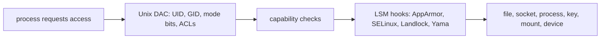
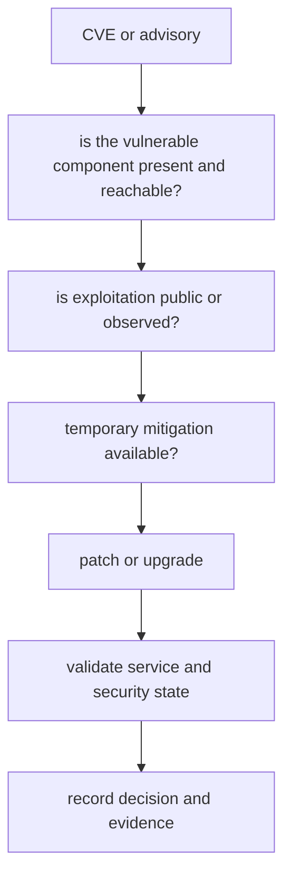

Purpose: Build a production-focused model of Linux identity, permissions, privilege boundaries, kernel isolation primitives, LSMs, host secrets, patching, and incident response, with explicit separation between local learning machines and hardened production hosts or clusters.

# 08 Permissions Users Groups Capabilities and LSMs

Related notes: [06 System Calls ABI libc and User Kernel Boundaries](/compendium/linux-systems-engineering/system-calls-abi-libc-and-user-kernel-boundaries), [07 systemd Boot Init Units Timers Journald and Services](/compendium/linux-systems-engineering/systemd-boot-init-units-timers-journald-and-services), [09 cgroups Namespaces Containers and Runtime Isolation](/compendium/linux-systems-engineering/cgroups-namespaces-containers-and-runtime-isolation), [17 Production Operations Troubleshooting and Runbooks](/compendium/linux-systems-engineering/production-operations-troubleshooting-and-runbooks)

Linux security is layered. The basic discretionary access control model uses users, groups, mode bits, ownership, and process credentials. Privilege is then split and constrained through capabilities, setuid and setgid semantics, namespaces, cgroups, seccomp, and Linux Security Modules. Production hardening is not one feature. It is the discipline of making every layer deny something useful to an attacker while preserving operability.

On a local learning machine, you can safely inspect `/etc/passwd`, create throwaway users, experiment with `chmod`, use containers to learn namespaces, and test AppArmor or SELinux in permissive modes. On production hosts and cluster nodes, identity and policy changes are change-controlled because a single group membership, sudo rule, capability, or LSM label can become a root path.

## Users, groups, UID, and GID

The kernel mostly reasons about numeric IDs. Names are userspace mapping conveniences from sources such as `/etc/passwd`, `/etc/group`, LDAP, SSSD, or another NSS provider.

| Concept | Kernel-facing meaning | Operational guidance |
|---|---|---|
| UID | numeric user identity | stable service UIDs matter for file ownership and audit trails |
| GID | primary group identity | do not overload one shared group for unrelated services |
| supplementary groups | additional group credentials attached at login or exec context | review because they silently grant file and device access |
| effective UID | identity used for many permission checks | setuid and sudo change this boundary |
| filesystem UID | identity used for filesystem checks on Linux | usually tracks effective UID but matters in privileged code |

Commands:

```bash
id
id example
getent passwd example
getent group example
groups example
find / -xdev -uid 1001 -ls
find / -xdev -gid 1001 -ls
```

Production guidance:

- use dedicated service users for daemons
- avoid shared writable directories across service users
- keep human accounts separate from service accounts
- prefer centrally managed identities for fleets, but know the local break-glass path
- audit supplementary groups such as `docker`, `wheel`, `sudo`, `adm`, `systemd-journal`, `disk`, `video`, and hardware-specific groups

Membership in groups such as `docker` or `disk` can be equivalent to root in practice. Treat them as privileged access, not convenience.

## File permissions

Traditional mode bits are simple and sharp:

```text
-rwxr-x---  owner group other
```

For files, read means read bytes, write means modify bytes, execute means execute as a program or script. For directories, read means list names, write means create or remove names, and execute means traverse. Directory execute without read lets a process access known names without listing the directory.

```bash
stat /etc/passwd
namei -l /var/lib/example/data.db
chmod 0640 file
chown example:example file
chgrp example file
```

Special mode bits matter:

| Bit | On files | On directories | Risk |
|---|---|---|---|
| setuid | execute with file owner effective UID | usually ignored | root-owned setuid binaries are high-value escalation targets |
| setgid | execute with file group effective GID | new files inherit directory group | useful for shared project dirs, risky with broad write |
| sticky | rarely useful | only owner, dir owner, or root can delete entries | required for shared temp dirs like `/tmp` |

Find sensitive bits:

```bash
find / -xdev -perm -4000 -type f -ls
find / -xdev -perm -2000 -type f -ls
find / -xdev -perm -0002 ! -perm -1000 -type d -ls
```

Production systems should have an expected inventory of setuid and setgid files. A new root-owned setuid file is an incident until explained.

## umask

`umask` subtracts permissions from newly created files and directories. A process that creates files with mode `0666` under umask `0027` gets `0640`. A process that creates directories with mode `0777` under umask `0027` gets `0750`.

| umask | File result from 0666 | Directory result from 0777 | Use |
|---|---|---|---|
| `0022` | `0644` | `0755` | common default, world-readable |
| `0027` | `0640` | `0750` | production service default for private group access |
| `0077` | `0600` | `0700` | secrets and user-private files |
| `0002` | `0664` | `0775` | collaborative group directories |

For services, set `UMask=` in the systemd unit rather than relying on login shell defaults. See [07 systemd Boot Init Units Timers Journald and Services](/compendium/linux-systems-engineering/systemd-boot-init-units-timers-journald-and-services) for unit-level controls.

## sudo

sudo is a policy engine for controlled command execution, not only a root wrapper. A sudo rule defines who may run what, as which user or group, from which host, with which authentication and environment handling.

Production rules:

- edit with `visudo`
- prefer command-specific rules over `ALL=(ALL) ALL`
- avoid writable scripts in sudo command paths
- avoid wildcards unless every expansion is understood
- reset or tightly preserve environment
- log sudo use centrally
- require MFA or short-lived elevation for sensitive fleets when available

Common mistake:

```text
operator ALL=(root) NOPASSWD: /usr/local/bin/backup *
```

If `backup` accepts arbitrary paths, config files, shell escapes, or plugin loading, this may be root. The safe rule is not only about the sudoers line. It is about the called program's complete input surface.

## PAM overview

PAM, the Pluggable Authentication Modules framework, lets services compose authentication, account checks, password changes, and session setup. Login, sshd, sudo, su, display managers, and many other services can have separate PAM stacks.

| PAM phase | Purpose | Examples |
|---|---|---|
| auth | prove identity | password, FIDO, smart card, Kerberos |
| account | decide whether access is allowed | expiry, time restrictions, host rules |
| password | update credentials | password quality and history |
| session | setup and teardown | limits, keyrings, home mounts, audit sessions |

Production caution: PAM changes can lock out administrators. Test through a second root session or console, stage changes, and know the recovery path. In clusters, PAM controls node login, not application pod identity unless explicitly integrated.

## Capabilities

Linux capabilities split traditional root privilege into named units such as `CAP_NET_BIND_SERVICE`, `CAP_SYS_ADMIN`, `CAP_SYS_PTRACE`, and `CAP_SYS_MODULE`. Capabilities are per-thread attributes, and file capabilities can grant capabilities at exec time.

Inspect:

```bash
capsh --print
getpcaps $$
getcap -r /usr/bin /usr/sbin 2>/dev/null
grep Cap /proc/$$/status
```

Grant low-port bind without full root:

```bash
sudo setcap cap_net_bind_service=+ep /usr/local/bin/example
getcap /usr/local/bin/example
```

Production guidance:

- prefer running as non-root with one narrow capability over root
- avoid `CAP_SYS_ADMIN`; it is intentionally broad and often container-escape relevant
- inventory file capabilities like setuid binaries
- remove capabilities from interpreters and writable deployment paths
- combine capabilities with systemd `CapabilityBoundingSet=`, `AmbientCapabilities=`, `NoNewPrivileges=yes`, and LSM policy

Capabilities are not a sandbox. A process with `CAP_SYS_PTRACE`, `CAP_SYS_MODULE`, `CAP_DAC_OVERRIDE`, or `CAP_SYS_ADMIN` can often cross boundaries that look separate at the file-permission layer.

## setuid and setgid

setuid and setgid are old privilege transition mechanisms. They remain necessary for some core utilities, but they concentrate risk because the executable starts with elevated effective credentials.

Production handling:

- minimize the installed setuid inventory
- prefer capabilities or brokered privileged helpers where possible
- ensure setuid binaries are root-owned and not writable by group or other
- avoid setuid scripts
- watch for setuid copies in writable paths
- include setuid inventory in baseline integrity monitoring

Incident command:

```bash
find / -xdev \( -perm -4000 -o -perm -2000 \) -type f -printf '%m %u %g %p\n'
```

## seccomp

seccomp filters reduce the system call surface available to a process. They are useful because many processes need only a small subset of kernel entry points. The kernel documentation is clear that seccomp filtering is not a complete sandbox; it is a primitive used by sandboxes and hardening profiles.

Common places seccomp appears:

- container runtimes
- browsers
- systemd `SystemCallFilter=`
- language runtimes or security wrappers
- high-risk parsers and media processors

Production guidance:

- start from known profiles rather than hand-writing broad deny lists
- test under representative workload, including DNS, TLS, locale, time, signals, file rotation, and crash handling
- log denied syscalls where possible during rollout
- prefer allow-list thinking, but avoid breaking emergency diagnostics
- combine with `NoNewPrivileges=yes` when installing filters as unprivileged code

Example systemd hardening:

```ini
[Service]
NoNewPrivileges=yes
SystemCallFilter=@system-service
SystemCallErrorNumber=EPERM
```

## LSMs: AppArmor, SELinux, Landlock, and friends

Linux Security Modules add mandatory access control and other security hooks. The active LSM list is visible at:

```bash
cat /sys/kernel/security/lsm
```

The capability module is always present. Distros may enable minor modules such as Yama or Landlock and one major MAC module such as AppArmor or SELinux, depending on kernel configuration and boot parameters.



### AppArmor

AppArmor is profile-oriented. Policy is usually attached to executable paths and describes what a confined program may access. It is common on Ubuntu and SUSE-derived systems.

Useful commands:

```bash
aa-status
sudo aa-complain /etc/apparmor.d/usr.sbin.example
sudo aa-enforce /etc/apparmor.d/usr.sbin.example
journalctl -k -g apparmor
```

Production guidance:

- use complain mode to learn denials before enforcing new profiles
- keep profiles with package or config management
- remember unprofiled tasks run under normal DAC unless another LSM confines them
- path-based policy can be easier to operate, but renames, bind mounts, and alternate paths require attention

### SELinux

SELinux is label-oriented. Subjects and objects have security contexts, and policy decides allowed interactions. It is common on Fedora, RHEL, CentOS Stream, and derivatives.

Useful commands:

```bash
getenforce
sestatus
ls -Z /var/www
ps -eZ | head
sudo ausearch -m avc -ts recent
sudo restorecon -Rv /var/www
```

Production guidance:

- do not disable SELinux to fix an application; identify the denied action and correct labels or policy
- understand the difference between permissive and enforcing modes
- use distro-provided policy as the baseline
- label persistence matters; `chcon` is quick, `semanage fcontext` plus `restorecon` is durable
- AVC denials are evidence, but not every denial is the root cause

### Landlock

Landlock is a stackable LSM intended to let processes, including unprivileged processes, restrict their own future access. It is useful for application-level sandboxing where a process voluntarily gives up ambient filesystem or network rights. It does not replace system-wide MAC policy because it is usually applied by the program itself or its launcher.

Check for evidence:

```bash
dmesg | grep -i landlock || journalctl -kb -g landlock
cat /sys/kernel/security/lsm
```

Production use is strongest when application code or a trusted launcher applies Landlock rules early, before parsing untrusted input.

## Namespaces as isolation

Namespaces partition what a process can see: PIDs, mounts, UTS hostname, IPC, network, users, cgroups, and time. Containers are mostly composed from namespaces plus cgroups plus capabilities plus seccomp plus LSM policy.

Inspect:

```bash
lsns
readlink /proc/$$/ns/user
readlink /proc/1/ns/mnt
nsenter --target 1 --mount --uts --ipc --net --pid
```

Production guidance:

- namespaces isolate views, not all kernel attack surface
- user namespaces change capability meaning inside the namespace, but host-level effects still depend on mappings and kernel checks
- mount namespaces require careful propagation settings
- PID namespaces hide process IDs but do not provide resource limits
- network namespaces isolate network stacks, but host bridges, CNI, iptables, nftables, and eBPF still matter

## Cgroups as control

cgroups control and account for resources. They are not primarily a secrecy boundary. They answer questions such as how much CPU, memory, IO, process count, or device access a group of processes may use.

Inspect:

```bash
systemd-cgls
systemd-cgtop
cat /proc/$$/cgroup
systemctl show example.service -p ControlGroup -p MemoryCurrent -p TasksCurrent
```

Production guidance:

- use cgroups to prevent noisy-neighbor failure
- combine cgroup limits with alerts, because enforced limits can become outages
- on Kubernetes nodes, avoid manual changes under pod cgroups unless debugging
- for systemd services, prefer unit-level resource directives over direct cgroup filesystem writes

## chroot limitations

`chroot` changes the apparent root directory for a process. It is not a full security boundary. A privileged process can often escape, and chroot does not isolate PIDs, network, IPC, mounts outside the setup, hostname, resource usage, or kernel attack surface.

Use chroot for build roots, recovery, packaging, and legacy workflows. For isolation, use namespaces, cgroups, seccomp, capabilities, and LSM policy together. On production systems, any design that says "secured by chroot" needs review.

## Secrets on Linux

Secrets leak through more paths than teams expect: command arguments, environment variables, shell history, world-readable config, core dumps, debug endpoints, process inspection, logs, backups, and container image layers.

Safer patterns:

- store root-owned secret files as `0600` or service-group-readable as `0640`
- put secrets under directories that are not listable by unrelated users
- use tmpfs for short-lived material when appropriate
- disable or restrict core dumps for secret-handling services
- avoid passing secrets on command lines
- avoid long-lived secrets in environment variables for high-risk services
- use a real secret manager for rotation, audit, and revocation
- make backup encryption and restore access part of the secret model

Commands:

```bash
find /etc /var/lib -xdev -type f -perm -004 -name '*secret*' -ls 2>/dev/null
grep -R --exclude-dir=.git -n 'BEGIN .*PRIVATE KEY' /etc /opt 2>/dev/null
coredumpctl list
```

For systemd services, see [07 systemd Boot Init Units Timers Journald and Services](/compendium/linux-systems-engineering/systemd-boot-init-units-timers-journald-and-services) for environment files and unit hardening.

## SSH hardening

SSH is often the production host control plane. Harden it like an internet-facing API even on private networks.

Baseline `/etc/ssh/sshd_config` direction:

```text
PermitRootLogin no
PasswordAuthentication no
KbdInteractiveAuthentication no
PubkeyAuthentication yes
AllowGroups ssh-admins
X11Forwarding no
AllowTcpForwarding no
PermitTunnel no
ClientAliveInterval 300
ClientAliveCountMax 2
```

Validate before reload:

```bash
sudo sshd -t
sudo systemctl reload sshd
journalctl -u sshd -b
```

Production guidance:

- keep an active session open while changing sshd
- use short-lived certificates or managed keys where available
- remove stale keys during offboarding
- monitor failed login patterns
- avoid agent forwarding to untrusted hosts
- document console or out-of-band recovery

On a local learning machine, password SSH may be acceptable on a private lab network. On production hosts, password login should be the rare exception.

## auditd and evidence

auditd records security-relevant events from the kernel audit subsystem. It is useful for authentication, SELinux AVCs, watched files, exec events, and incident timelines. It can also be noisy and expensive if configured without focus.

Commands:

```bash
sudo auditctl -s
sudo auditctl -l
sudo ausearch -m USER_LOGIN,USER_AUTH -ts today
sudo ausearch -m AVC -ts recent
sudo aureport --auth
sudo aureport --exec
```

Example watch:

```bash
sudo auditctl -w /etc/sudoers -p wa -k sudoers_changes
sudo ausearch -k sudoers_changes
```

Production guidance:

- define high-signal watches for identity, sudoers, SSH config, service units, package manager state, and sensitive app config
- forward audit logs off-host
- protect audit log retention
- test performance before enabling broad exec logging on busy hosts
- treat missing logs during a suspected incident as evidence itself

## Kernel lockdown and module signing

Kernel lockdown restricts interfaces that allow root to modify the running kernel or read sensitive kernel memory. It is often associated with Secure Boot and has integrity and confidentiality implications. Module signing verifies that loadable kernel modules are signed by trusted keys when enforcement is configured.

Inspect:

```bash
cat /sys/kernel/security/lockdown 2>/dev/null || true
mokutil --sb-state 2>/dev/null || true
cat /proc/sys/kernel/modules_disabled
lsmod
modinfo module_name
journalctl -k -g lockdown
```

Production guidance:

- use signed modules on Secure Boot fleets
- avoid out-of-tree modules unless ownership, patch cadence, and signing are clear
- know whether eBPF, kprobes, perf, hibernation, debugfs, or kexec workflows are affected by lockdown
- never disable Secure Boot or lockdown during an incident without preserving why and who approved it
- for cluster nodes, kernel module policy affects CNI, CSI, eBPF observability, GPU drivers, and security agents

## Supply chain considerations

Linux host compromise often arrives through the supply chain: packages, repositories, curl-piped scripts, container images, language package managers, kernel modules, CI artifacts, or vendor agents.

Production controls:

- pin trusted repositories and verify GPG key ownership
- prefer distro packages for security-sensitive base components
- review third-party install scripts before execution
- restrict who can add apt, dnf, yum, zypper, pacman, snap, or flatpak sources
- scan container images and host packages for known CVEs
- track SBOMs or at least package manifests for critical images
- use reproducible image builds where feasible
- monitor unexpected changes under `/usr/local/bin`, `/opt`, systemd unit paths, and shell profile directories

Local learning machines can tolerate experimental package sources. Production hosts should have a small, explainable package trust root.

## Patching and CVE response

Patch response is an operational process, not only a package command.



Commands vary by distro:

```bash
uname -a
cat /etc/os-release
apt list --upgradable 2>/dev/null
dnf updateinfo list security 2>/dev/null
yum updateinfo list security 2>/dev/null
zypper list-patches 2>/dev/null
pacman -Qu 2>/dev/null
needrestart 2>/dev/null
```

Production guidance:

- classify by exposure, exploitability, privilege required, and asset criticality
- patch test rings before broad rollout when time allows
- reboot when kernel, libc, OpenSSL, systemd, container runtime, or critical daemons require it
- verify that the running process is using the patched binary or library
- in clusters, coordinate node drains, disruption budgets, and control-plane safety
- document accepted risk when patching is deferred

## Incident response commands

Use commands that preserve evidence before changing state. Prefer read-only inspection first.

Identity and login:

```bash
who
w
last -a | head -50
lastlog | head
faillock --user example 2>/dev/null
journalctl -u sshd -b
```

Processes and network:

```bash
ps auxwwf
pstree -aps
ss -tulpn
lsof -nP -i 2>/dev/null
lsns
systemd-cgls
```

Persistence:

```bash
systemctl list-unit-files
systemctl list-timers --all
systemctl list-units --failed
find /etc/systemd/system /usr/local/bin /opt -xdev -type f -mtime -7 -ls 2>/dev/null
crontab -l
ls -la /etc/cron* /var/spool/cron 2>/dev/null
```

Privilege and policy:

```bash
getent passwd
getent group sudo
getent group wheel
sudo -l -U example
find / -xdev -perm -4000 -type f -ls
getcap -r / 2>/dev/null
cat /sys/kernel/security/lsm
getenforce 2>/dev/null
aa-status 2>/dev/null
```

Logs and kernel evidence:

```bash
journalctl -b
journalctl --list-boots
journalctl -p warning..alert -b
journalctl -k -b
dmesg -T
ausearch -ts recent 2>/dev/null
```

Package and file integrity:

```bash
dpkg -V 2>/dev/null
rpm -Va 2>/dev/null
find / -xdev -type f -mtime -1 -ls 2>/dev/null
```

Production caution: commands such as killing processes, deleting files, rotating logs, rebooting, or patching can destroy volatile evidence. In a serious incident, capture memory, disk, logs, and cloud control-plane evidence according to the incident runbook before containment actions that alter state.

## Common mistakes

| Mistake | Why it hurts | Better practice |
|---|---|---|
| adding a user to `docker` for convenience | Docker control can often become host root | use rootless containers or tightly controlled admin path |
| fixing permission errors with `chmod -R 777` | destroys confidentiality and integrity | identify exact UID, GID, mode, ACL, or LSM denial |
| disabling SELinux or AppArmor globally | removes a whole mandatory control layer | fix labels, profiles, or policy |
| granting `CAP_SYS_ADMIN` to a container | near-root kernel attack surface | grant narrow capabilities or redesign |
| storing secrets in unit environment | easy process and log leakage | use secret manager, credentials, or protected files |
| assuming chroot is a sandbox | privileged escape paths remain | use namespaces, cgroups, seccomp, and LSMs |
| relying only on sudo logs | misses direct root, setuid, service, and key misuse | combine auditd, journal, SSH logs, and file integrity |
| patching without restart validation | vulnerable code may still be mapped | check running processes and reboot requirements |

## Local vs production operating stance

| Area | Local learning machine | Production host or cluster |
|---|---|---|
| Users and groups | create and delete freely for practice | managed identities, reviewed group grants |
| Permissions | experiment with mode bits and ACLs | least privilege, baseline scans, no broad recursive fixes |
| sudo | learn rule syntax in a VM | command-specific, logged, MFA or approval where possible |
| Capabilities | test with throwaway binaries | inventory and pair with bounding sets |
| LSMs | permissive or complain mode is useful | enforcing mode with documented exceptions |
| Namespaces | use `unshare` and containers to learn | understand runtime defaults and escape surface |
| Secrets | local `.env` files can be acceptable | rotation, audit, protected storage, no shell history |
| Patching | update when convenient | severity-driven rings, reboot coordination, evidence |
| Incident response | practice commands | preserve evidence and follow runbooks |

The field rule: root is not a design pattern. Every privilege grant should be narrow, observable, revocable, and tied to a named operational need.

## Reference URLs

- https://man7.org/linux/man-pages/man7/capabilities.7.html
- https://man7.org/linux/man-pages/man7/namespaces.7.html
- https://man7.org/linux/man-pages/man2/seccomp.2.html
- https://docs.kernel.org/userspace-api/seccomp_filter.html
- https://docs.kernel.org/admin-guide/LSM/index.html
- https://docs.kernel.org/admin-guide/LSM/apparmor.html
- https://docs.kernel.org/admin-guide/LSM/SELinux.html
- https://docs.kernel.org/userspace-api/landlock.html
- https://man7.org/linux/man-pages/man7/kernel_lockdown.7.html
