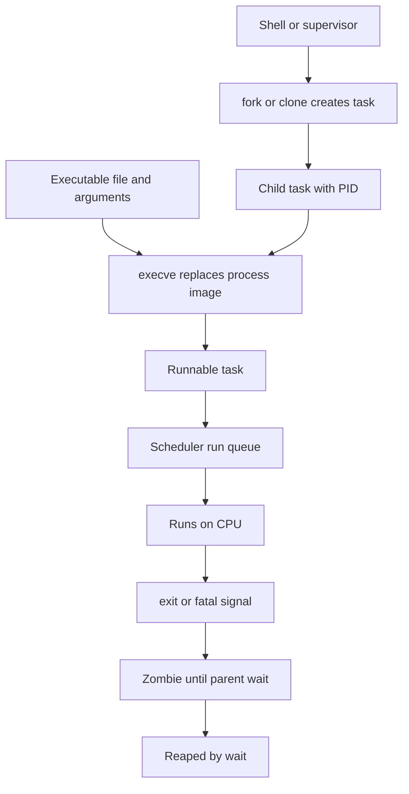
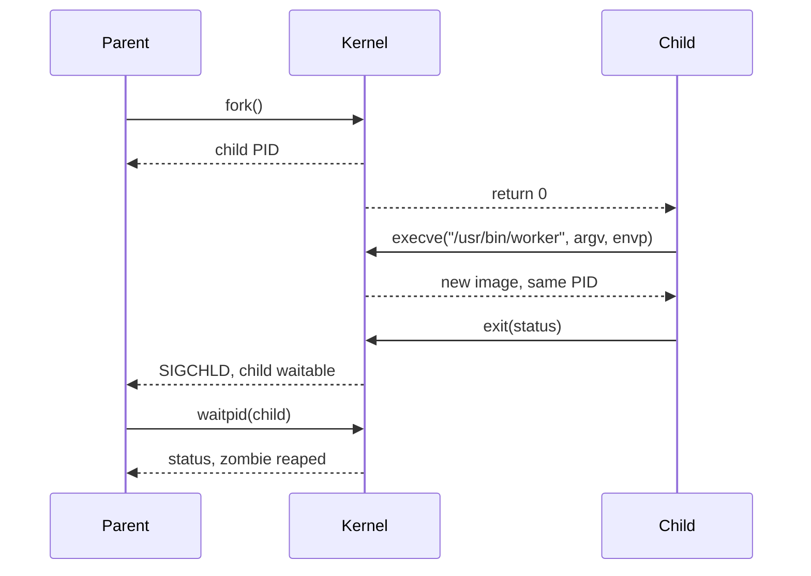
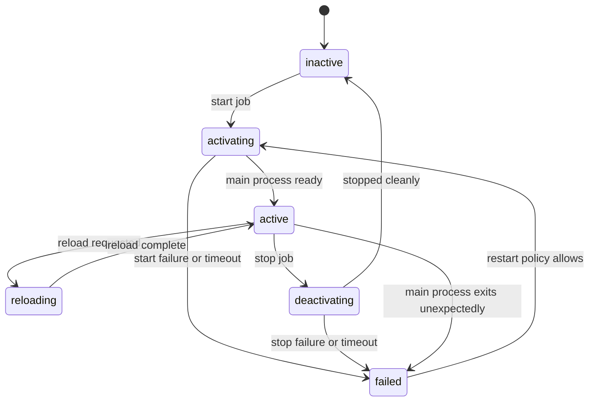

Purpose: Build an operator-grade mental model for Linux processes, threads, kernel tasks, scheduling, signals, terminals, jobs, daemons, and systemd service lifecycles, with enough detail to debug production incidents without confusing shell behavior, kernel scheduling policy, and service supervision.

Related notes: [Linux Systems Engineering](/compendium/linux-systems-engineering/linux-systems-engineering), [00 Linux Systems Mastery Roadmap](/compendium/linux-systems-engineering/linux-systems-mastery-roadmap), [01 Linux Mental Model User Space Kernel and Hardware](/compendium/linux-systems-engineering/linux-mental-model-user-space-kernel-and-hardware), [03 Memory Virtual Memory Paging Allocators and OOM](/compendium/linux-systems-engineering/memory-virtual-memory-paging-allocators-and-oom), [06 System Calls ABI libc and User Kernel Boundaries](/compendium/linux-systems-engineering/system-calls-abi-libc-and-user-kernel-boundaries)

# Processes, Threads, Scheduling, Signals, and Jobs

Linux does not treat "a program" as the primary runtime object. The kernel schedules tasks. A process is an address space plus a group of resources. A thread is usually a task that shares selected resources with sibling tasks through `clone(2)` flags. A daemon is a process shaped by service supervision, not a different kernel species. A shell job is a process group managed by a controlling terminal. A systemd service is a unit state machine around one or more processes in a cgroup.

That distinction matters in production. A command can be "running" in a shell while its process group is stopped. A service can be "active" while the worker process is wedged in uninterruptible sleep. A process can be gone while its zombie entry remains because the parent has not waited. A cluster workload can be CPU throttled by cgroups while every host-level `top` display looks mostly idle. Local learning machines tolerate blunt commands like `kill -9` and manual `renice`; production hosts and clusters require preserving evidence, respecting supervisors, and understanding what layer owns the process.



## Vocabulary That Prevents Bad Diagnoses

| Term | Operational meaning | What to inspect |
| --- | --- | --- |
| PID | Identifier for a process or thread-group leader as seen in the default process view. | `ps -o pid,ppid,stat,comm -p PID`, `/proc/PID/status` |
| TID | Kernel task ID for an individual thread. In Linux each thread is schedulable. | `/proc/PID/task/`, `ps -L -p PID` |
| TGID | Thread group ID, usually the PID of the thread-group leader. | `/proc/PID/status` |
| Process | Address space, file descriptor table, signal dispositions, credentials, namespaces, and one or more tasks. | `/proc/PID/`, `lsns`, `lsof -p PID` |
| Thread | A task that commonly shares address space and other resources with peer tasks. | `ps -eLf`, `/proc/PID/task/TID/status` |
| Kernel task | The schedulable entity. User threads and many kernel threads are tasks. | `ps -eLo pid,tid,cls,rtprio,pri,ni,psr,stat,comm` |
| Process group | Set of processes signaled together by terminals and shells. | `ps -o pid,ppid,pgid,sid,tpgid,stat,cmd` |
| Session | Collection of process groups, usually tied to a login or service context. | `ps -o sid,pgid,tpgid,tty,cmd` |
| Controlling terminal | Terminal device that drives foreground and background job semantics. | `ps -o tty,tpgid,stat,cmd`, `stty -a` |
| Cgroup | Resource accounting and control boundary, central for systemd and containers. | `systemctl status`, `/proc/PID/cgroup`, `systemd-cgls` |

The useful habit is to ask "which identity is relevant here?" A signal sent to a PID is not the same as a signal sent to a process group. A process shown by `ps` may hide hundreds of runnable threads. A systemd unit may contain helper processes that outlive the main PID unless the unit kill mode and cgroup ownership are correct.

## fork, exec, clone, wait

`fork(2)` creates a child process by duplicating the calling process context. The child gets a distinct PID, a parent link, inherited open file descriptors that refer to the same open file descriptions, copied signal dispositions, copied signal mask, and a virtual memory image initially implemented with copy on write. After `fork`, parent and child continue from the same code path with different return values.

`execve(2)` does not create a new process. It replaces the current process image with a new executable image. PID remains stable. File descriptors remain open unless marked close-on-exec. Handled signal dispositions reset to defaults, ignored dispositions remain ignored, and the signal mask is preserved. This is why a process can accidentally inherit blocked signals or open sockets across an exec boundary.

`clone(2)` is the primitive behind many Linux process and thread arrangements. By choosing flags, a caller can share or separate address space, file descriptor table, signal handling, filesystem context, namespaces, and parentage. POSIX threads are built on clone-like sharing, especially shared memory and shared signal handling. Container runtimes use clone flags and namespaces to create process trees with altered views of PID, mount, network, IPC, UTS, cgroup, and user state.

`wait(2)` and related calls reap child state changes. If a child exits and the parent does not wait, the process becomes a zombie: it no longer runs code or holds most resources, but its exit status and accounting entry remain so the parent can collect them. Zombies are a parent bug or a parent design issue, not a memory leak by the zombie itself. Orphans are children whose parent exited; they are reparented to init or a subreaper such as systemd or a container runtime.



### Fork and Exec Failure Patterns

| Pattern | Why it happens | Production consequence | Response |
| --- | --- | --- | --- |
| Fork after many threads | Only the calling thread exists in the child, but locks may reflect vanished sibling threads. | Deadlock before exec, especially in language runtimes. | In child, call only async-signal-safe operations before exec; prefer spawn APIs when suitable. |
| Descriptor leak across exec | Descriptor lacks `FD_CLOEXEC` or was opened without an atomic close-on-exec flag. | Secrets, sockets, and pipes leak into child programs. | Use `O_CLOEXEC`, `pipe2`, `dup3`, and audit `/proc/PID/fd`. |
| Parent never waits | Parent ignores `SIGCHLD` semantics or has a faulty worker reap loop. | Zombie buildup, PID exhaustion risk, misleading process tables. | Inspect parent, not zombie; fix wait loop or supervisor configuration. |
| Child exits too early | Exec path missing, env invalid, permissions wrong, dynamic linker failure. | Crash loops under systemd or orchestration. | Read unit logs, exit status, `strace -f -e execve`, and file permissions. |
| Orphaned worker tree | Parent dies without a supervisor or subreaper owning descendants. | Leaked background work, ports held, stale locks. | Use systemd, container init, or subreaper; avoid ad hoc daemonization. |

## Process Groups, Sessions, and Controlling Terminals

The terminal job-control model is not just shell decoration. A terminal has a foreground process group. Terminal-generated signals such as interrupt and suspend target the foreground process group, not just one PID. Background process groups that read from the terminal can be stopped. Shells use sessions and process groups to support pipelines, foreground and background jobs, `Ctrl-C`, `Ctrl-Z`, `fg`, `bg`, and `disown`.

```text
login/session leader
  shell session SID=1000
    foreground process group PGID=2200: vim
    background process group PGID=2300: find | xargs grep
```

`setsid` creates a new session and detaches from the controlling terminal when allowed. Classic daemons double-forked to detach from terminals and avoid reacquiring one. Modern production services should usually let systemd own lifecycle, cgroups, stdio, restart policy, logging, credentials, and dependency ordering. A local learning machine is a fine place to experiment with `nohup`, `setsid`, `disown`, and shell job control. Production hosts should prefer explicit service units, timers, scopes, or containers so ownership and cleanup are visible.

## Signals

Signals are asynchronous notifications with process-directed and thread-directed forms. Some signals terminate, stop, continue, or dump core by default. Some can be caught or ignored. `SIGKILL` and `SIGSTOP` cannot be caught, blocked, or ignored. Signal disposition is process-wide for a multithreaded process, but each thread has its own signal mask. A process-directed signal may be delivered to any unblocked eligible thread, which is why signal handling in multithreaded programs needs a deliberate design.

| Signal | Default role | Catchable | Production guidance |
| --- | --- | --- | --- |
| `SIGTERM` | Polite termination request. | Yes | First-choice operational stop signal. Service should drain, flush, and exit. |
| `SIGINT` | Terminal interrupt, often `Ctrl-C`. | Yes | Expected in interactive jobs; do not treat as data corruption by itself. |
| `SIGHUP` | Terminal hangup, often reload by convention. | Yes | Only use for reload if service documents it. |
| `SIGQUIT` | Quit with core dump by default. | Yes | Useful for diagnostics in some runtimes, risky as a generic stop. |
| `SIGCHLD` | Child changed state. | Yes | Parent must reap children or configure intentional behavior. |
| `SIGSTOP` | Stop execution. | No | Debugging and job control; can make services look hung. |
| `SIGCONT` | Continue a stopped task. | Yes | Pair with stopped process analysis. |
| `SIGKILL` | Immediate kill by kernel. | No | Last resort. It prevents application cleanup and can hide root cause. |

`SIGTERM` asks a process to cooperate. `SIGKILL` removes the task without giving user-space cleanup code a chance. On a local learning machine, `kill -9` is acceptable when a toy process is stuck and evidence is irrelevant. On production hosts and clusters, use it only after collecting enough state or when the blast radius of waiting is worse. For databases, queues, storage agents, and sidecars, blunt killing can extend recovery by forcing replay, lock cleanup, or quorum repair.

### Signal Masks and Delivery

Signal masks block delivery to a thread, not to the entire process by default. `sigprocmask` is for single-threaded programs; `pthread_sigmask` is the right interface in POSIX-threaded programs. A common robust design is to block operational signals in every worker thread, create one signal-management thread, then use `sigwaitinfo` or `signalfd` to convert asynchronous delivery into a controlled event loop.

Common mistakes:

| Mistake | Result | Better practice |
| --- | --- | --- |
| Assuming `kill PID` reaches every worker in a pipeline | Only one process receives the signal. | Signal the process group with a negative PGID when appropriate. |
| Ignoring inherited signal mask across exec | New program starts with important signals blocked. | Reset or deliberately set masks before exec. |
| Doing complex work inside a signal handler | Deadlocks, corrupted state, non-reentrant library calls. | Set an atomic flag, write to a pipe, or use signalfd/event loop integration. |
| Treating `SIGKILL` as a normal shutdown | Lost cleanup and poor diagnostics. | Try `SIGTERM`, observe, collect state, then escalate. |
| Forgetting stopped state | Process is not consuming CPU but still owns resources. | Check `STAT` for `T`, send `SIGCONT` or inspect job control. |

## Scheduling Model

The scheduler decides which runnable task executes on which CPU and when. It does not make blocked tasks runnable, fix I/O latency, or override cgroup quotas. A task that is sleeping on disk, network, futex, memory reclaim, or a kernel wait queue is not losing a CPU scheduling contest. Start every performance diagnosis by separating runnable pressure from blocked waiting.

Linux historically documents CFS, the Completely Fair Scheduler, for normal `SCHED_OTHER` tasks. Current kernel scheduler documentation notes that CFS is making room for EEVDF, and EEVDF has its own scheduler documentation. The practical operator model remains: normal tasks compete for proportional CPU service, nice values alter weight, runnable tasks live in per-CPU run queues, and cgroups can impose bandwidth limits. On newer kernels, use the kernel's EEVDF documentation for the exact fairness model rather than assuming old CFS internals are authoritative.

### Normal Scheduling, Nice, and Priority

Nice is a user-facing weight hint for normal scheduling classes. Lower nice values mean more CPU share when there is contention. Nice does not reserve CPU, does not preempt real-time classes, and does little when CPUs are idle. Kernel priority displays can confuse because `PRI`, `NI`, policy class, real-time priority, and cgroup CPU weights are different dimensions.

| Lever | Scope | Good use | Bad assumption |
| --- | --- | --- | --- |
| `nice` | Process start weight for normal class. | Make batch work less competitive on shared hosts. | It guarantees latency. |
| `renice` | Existing normal task weight. | Reduce impact of known background process. | It fixes I/O or lock waiting. |
| CPU affinity | CPUs allowed for a task. | Isolate hot paths, reduce cache migration, respect NUMA locality. | Pinning always improves performance. |
| cgroup CPU weight | Relative group share. | Service-level fairness under systemd or containers. | Host-level `nice` overrides container quotas. |
| CPU quota | Hard runtime budget per period. | Enforce tenant or workload limits. | Throttled workload is "idle" because host CPU is free. |

### Real-Time and Deadline Classes

Linux also has real-time scheduling classes such as `SCHED_FIFO` and `SCHED_RR`, plus deadline scheduling for tasks with runtime, deadline, and period constraints. These are powerful and dangerous. A runaway real-time task can starve normal work, including the shell you need for recovery. Production use requires explicit limits, monitoring, tested recovery access, and often cgroup real-time controls. Local experiments should be done in disposable sessions with a second root shell or remote console.

| Class | Behavior | Production risk |
| --- | --- | --- |
| `SCHED_OTHER` | Normal fair scheduling for most work. | Misread latency as scheduler failure when task is blocked elsewhere. |
| `SCHED_BATCH` | Batch-oriented normal work with less interactivity concern. | Poor fit for latency-sensitive services. |
| `SCHED_IDLE` | Runs only when the system has spare CPU. | Starves under constant load. |
| `SCHED_FIFO` | Real-time task runs until it blocks, exits, or a higher-priority RT task appears. | Can starve the host. |
| `SCHED_RR` | Real-time round-robin among same-priority tasks. | Still can starve normal tasks. |
| `SCHED_DEADLINE` | Deadline scheduling with explicit runtime constraints. | Requires deep workload modeling and guardrails. |

## Context Switching, Run Queues, and Load Average

A context switch saves enough state from the current task and restores another task. Voluntary switches happen when a task blocks or yields. Involuntary switches happen when the scheduler preempts a task. Context switches are not inherently bad; they are the price of multiplexing. They become suspicious when paired with high run-queue length, lock contention, tiny timeslices, or workload designs that create far more runnable threads than CPUs.

Run queues hold runnable tasks per CPU. A host with 64 runnable CPU-bound tasks on 8 CPUs has CPU contention even if each individual task looks modest. A process with 500 threads may have only one runnable thread, or all 500 may be fighting. Use thread-level views before concluding.

Load average is not CPU utilization. On Linux it includes runnable tasks and tasks in uninterruptible sleep. A host can show high load with low CPU when many tasks are stuck in disk, NFS, block device, or kernel waits. In clusters, load average can be distorted by container density, CPU quotas, and node-level daemons; compare it with cgroup CPU throttling, PSI, run queues, and I/O wait.

Useful commands:

```bash
ps -eLo pid,tid,ppid,cls,rtprio,pri,ni,psr,stat,wchan:24,comm --sort=-pri | head -50
cat /proc/loadavg
cat /proc/schedstat
cat /proc/pressure/cpu
pidstat -w -t 1
perf sched timehist --pid PID
systemd-cgtop
```

## Jobs, Daemons, and systemd

Shell jobs are interactive process groups. Daemons are long-running services expected to survive without a controlling terminal. systemd units describe desired lifecycle and resource policy. Confusing these layers creates brittle operations: a background shell job is not a service; a double-forking daemon can confuse `Type=simple`; a service process that forks workers outside its cgroup can evade cleanup.

### systemd Service Lifecycle



`Type=simple` treats the started process as the service process immediately. `Type=exec` waits until exec succeeds. `Type=forking` exists for legacy daemons that fork and leave a parent. `Type=notify` lets a service tell systemd when it is ready. Readiness matters: without it, dependencies may start before sockets, caches, migrations, or leader election are actually ready.

| Unit control | Operational use | Failure mode if wrong |
| --- | --- | --- |
| `Restart=` | Recover from crash according to policy. | Crash loops hide real failure and hammer dependencies. |
| `TimeoutStartSec=` | Bound startup wait. | Too short kills slow cold starts; too long delays failure. |
| `KillSignal=` | Choose polite stop signal. | Service ignores stop or exits without cleanup. |
| `KillMode=` | Decide whether to kill main process or whole cgroup. | Worker leaks or collateral child termination. |
| `OOMPolicy=` | Define unit reaction to OOM events. | Unit remains half-dead after worker kill. |
| `MemoryMax=`, `CPUQuota=` | Resource controls through cgroups. | Host diagnosis misses service-level throttling or OOM. |

Local learning machines: it is useful to run a toy service under `systemd-run --user --scope`, inspect cgroups, and send signals manually. Production hosts: change unit files through configuration management, preserve journal evidence, and prefer `systemctl kill`, `systemctl restart`, and `systemctl show` over direct PID surgery unless the supervisor is the thing under investigation. Clusters: the service lifecycle may be owned by kubelet, a container runtime, or an init process inside the container; inspect pod events, cgroup limits, and node-level systemd units separately.

## Common Process Failure Modes

| Symptom | Likely layer | What to check first |
| --- | --- | --- |
| Process is `Z` | Parent/reaping | `ps -o pid,ppid,stat,cmd`, parent logs, wait loop, subreaper. |
| Process is `D` | Kernel wait, often I/O | `wchan`, block/NFS health, hung task logs, storage latency. |
| Service stuck stopping | Signal handling or blocked kernel wait | `systemctl status`, `journalctl -u`, `TimeoutStopSec`, `KillMode`, task state. |
| High load, low CPU | Uninterruptible waits or throttling | `/proc/pressure/*`, `iostat`, `pidstat -d`, cgroup CPU stats. |
| `fork: Resource temporarily unavailable` | PID, process, cgroup, memory, or user limits | `pids.max`, `ulimit -u`, `/proc/sys/kernel/pid_max`, memory pressure. |
| Random children inherit sockets | Descriptor flags | `/proc/PID/fd`, close-on-exec use, exec wrapper code. |
| `Ctrl-C` kills wrong thing or not enough | Process groups and terminal | `ps -o pid,pgid,sid,tpgid,tty,stat,cmd`. |
| CPU-bound process ignores `renice` expectations | Policy or cgroup | Scheduler class, cgroup quota/weight, affinity, run queue. |
| Real-time process locks host | RT scheduling | `chrt -p`, RT priority, emergency shell, cgroup RT limits. |
| Container has one stuck process but pod is "Running" | Supervisor or application health | Readiness/liveness probes, PID 1 behavior, child reaping. |

## Troubleshooting Playbooks

### Unknown Hung Process

1. Identify state, parent, group, session, and cgroup:

```bash
ps -o pid,ppid,pgid,sid,tpgid,tty,stat,ni,pri,psr,wchan:24,cmd -p PID
cat /proc/PID/status
cat /proc/PID/cgroup
```

2. Decide whether it is runnable, sleeping, stopped, zombie, or in uninterruptible sleep. Do not apply CPU tuning to a blocked task.
3. Capture file descriptors, maps, stack if permitted, and logs before termination:

```bash
ls -l /proc/PID/fd
cat /proc/PID/stack 2>/dev/null
journalctl _PID=PID --no-pager
```

4. Use owner-aware control. For a systemd service, start with `systemctl status UNIT` and `systemctl kill -s SIGTERM UNIT`. For an interactive job, signal the process group if that is the real target. For a container, inspect runtime and orchestrator state before entering the namespace.

### Zombie Buildup

1. Confirm zombie state with `STAT=Z`.
2. Inspect `PPID`; the fix is usually in the parent or supervisor.
3. If the parent is healthy, inspect its child reaping logic and `SIGCHLD` handling.
4. If the parent is wedged, restart the parent through its supervisor after capturing evidence.
5. Do not waste time trying to `kill` the zombie; it is already dead.

### High CPU or Run Queue Pressure

1. Separate host pressure from cgroup pressure:

```bash
uptime
mpstat -P ALL 1
pidstat -u -t 1
cat /proc/pressure/cpu
systemd-cgtop
```

2. Check scheduler class, nice, affinity, and cgroup CPU quota.
3. Look for thread explosion, spin loops, lock contention, garbage collection, encryption/compression, and retry storms.
4. In production, prefer rate limiting, load shedding, rollback, or cgroup quota changes over hand-renicing random processes.

### Service Will Not Stop

1. Inspect unit ownership: `systemctl status UNIT`, `systemctl show UNIT -p MainPID,ControlPID,KillMode,KillSignal,TimeoutStopUSec`.
2. Inspect task state of main and child processes.
3. Send documented graceful signal through systemd.
4. If escalation is necessary, record state first, then use `systemctl kill -s SIGKILL UNIT` or equivalent owner-aware action.
5. After recovery, fix the service: shutdown handler, child lifecycle, readiness, stop timeout, or storage dependency.

## Production Guidance

Local learning machine rules:

- Experiment with `fork`, `exec`, `strace`, `kill`, `chrt`, `taskset`, shell job control, and toy systemd units.
- Prefer disposable processes and clear terminal sessions.
- It is acceptable to kill a broken experiment after noting what happened.

Production host rules:

- Preserve evidence before termination when the incident allows it.
- Operate through the supervisor that owns the process.
- Inspect task state before assuming CPU scheduling, memory pressure, or application deadlock.
- Treat real-time scheduling, affinity, and cgroup quota changes as production changes with rollback.
- Keep unit files explicit about readiness, restart policy, kill behavior, resource accounting, and logging.

Cluster rules:

- Debug both inside and outside the container boundary.
- Distinguish PID namespace PID from host PID.
- Read pod events, container exit codes, cgroup limits, and node pressure together.
- Remember that PID 1 inside a container must reap children and handle signals correctly.
- A pod restart may hide the kernel-level cause if node logs, cgroup stats, and OOM or pressure evidence are not captured.

## References

- https://docs.kernel.org/scheduler/index.html
- https://docs.kernel.org/scheduler/sched-design-CFS.html
- https://docs.kernel.org/scheduler/sched-eevdf.html
- https://docs.kernel.org/scheduler/sched-bwc.html
- https://man7.org/linux/man-pages/man2/fork.2.html
- https://man7.org/linux/man-pages/man2/clone.2.html
- https://man7.org/linux/man-pages/man2/execve.2.html
- https://man7.org/linux/man-pages/man2/wait.2.html
- https://man7.org/linux/man-pages/man7/signal.7.html
- https://man7.org/linux/man-pages/man2/sigaction.2.html
- https://docs.kernel.org/filesystems/proc.html
- https://docs.kernel.org/admin-guide/cgroup-v2.html
