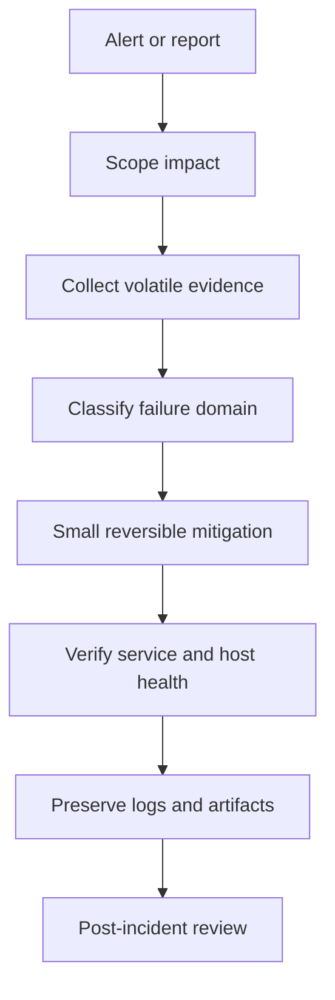

Purpose: Provide production-safe Linux incident runbooks that separate local learning experiments from real host and cluster operations, with enough kernel, systemd, network, filesystem, and escalation detail to act under pressure.

Related notes: [09 cgroups Namespaces Containers and Runtime Isolation](/compendium/linux-systems-engineering/cgroups-namespaces-containers-and-runtime-isolation), [18 Linux Ecosystem Tools and Learning Projects](/compendium/linux-systems-engineering/linux-ecosystem-tools-and-learning-projects)

# Operating Position

Troubleshooting is evidence management. On a local learning machine, you can reboot, kill processes, remount filesystems, load debug modules, alter firewall rules, and reproduce failures aggressively. On a production Linux host, every command can destroy evidence or widen the outage. On a production cluster, a node symptom may be caused by a workload, kubelet, runtime, CNI, storage layer, cloud or hypervisor issue, or control-plane policy.

Use this order:

1. Stabilize user impact without erasing root-cause evidence.
2. Classify the failure domain: boot, storage, CPU, memory, process state, network, TLS, firewall, systemd, mount, kernel, runtime, or cluster.
3. Collect minimal high-signal evidence.
4. Make the smallest reversible change.
5. Record the exact timeline, commands, and observed state.
6. Escalate when the risk crosses host, data, kernel, or cluster boundaries.



# Live Debugging Safety

| Action | Local learning machine | Production Linux host | Production cluster |
| --- | --- | --- | --- |
| Reboot | Fine for practice. | Only after impact, evidence, and failover are handled. | Prefer cordon, drain, replace, or node recycle through platform process. |
| Kill process | Fine to learn process states. | Confirm owner, parent, data safety, and restart policy. | Prefer workload rollout, scale, delete pod, or eviction through orchestrator. |
| Edit firewall | Good lab exercise. | Use console access or rollback path before applying. | Change declared policy, security group, or CNI policy with peer review. |
| Remount filesystem | Fine in a VM snapshot. | High risk; collect `findmnt`, `dmesg`, and app state first. | Node-local only after scheduling impact is understood. |
| Attach debugger or strace | Useful and safe on test processes. | Can pause or slow critical processes; use targeted time windows. | Prefer replica or debug pod unless node agent is the target. |
| Clear logs or caches | Fine when learning. | Avoid until evidence is copied. | Avoid on nodes unless pressure mitigation requires it and evidence is captured. |

Minimum evidence packet:

```bash
date -Is
hostnamectl 2>/dev/null || hostname
uname -a
uptime
who -b 2>/dev/null
systemctl --failed --no-pager 2>/dev/null
journalctl -b -p warning..alert --no-pager | tail -200
dmesg -T | tail -200
df -h
df -ih
free -h
vmstat 1 5
ps -eo pid,ppid,stat,ni,pri,pcpu,pmem,wchan:24,comm,args --sort=-pcpu | head -40
ss -s
ip -s link
```

# Boot Failure

Boot failures split into firmware, bootloader, kernel load, initramfs, root filesystem, systemd target, or service dependency failure.

Runbook:

1. Use console, serial, or hypervisor screenshot. Do not rely on SSH absence as the only signal.
2. Capture the last visible error exactly.
3. Identify the phase:
   - No bootloader: firmware, disk, boot order, EFI, degraded boot disk.
   - Kernel panic before init: kernel, initramfs, root device, driver, command line.
   - Emergency shell: root mount, fstab, crypt, LVM, fsck, generator failure.
   - Multi-user target not reached: systemd dependency or failed service.
4. In emergency or rescue shell, remount root read-only unless edits are required.
5. Inspect `journalctl -xb`, `systemctl --failed`, `systemctl list-jobs`, `findmnt`, `/etc/fstab`, and kernel command line.
6. If a recent kernel or initramfs changed, boot the previous entry before attempting invasive repair.

Emergency mode is for minimal root access when normal boot cannot proceed. Rescue mode starts more of the local system but not full multi-user service. In production, use rescue mode to collect and repair; do not start ad hoc services that can mutate data stores unless the service owner approves.

# Disk Full

Disk full incidents are not solved by deleting the largest file blindly. First identify the filesystem, writer, and data retention contract.

Runbook:

```bash
df -hT
findmnt -o TARGET,SOURCE,FSTYPE,OPTIONS
du -xhd1 /var 2>/dev/null | sort -h
lsof +L1 2>/dev/null | head -50
journalctl --disk-usage 2>/dev/null
```

Decision table:

| Signal | Meaning | Action |
| --- | --- | --- |
| `df` full but `du` does not explain it | Deleted file still held open, hidden mount, or reserved blocks. | Use `lsof +L1`, restart owning process if safe, inspect mount layout. |
| `/var/log` growth | Logging loop, debug level, or retention failure. | Compress or rotate only after copying samples; fix source rate. |
| Container writable layers grow | App writes state into image layer or logs to files. | Move state to volume or external store; clean through runtime tools. |
| Image filesystem full on node | Pull churn, stale images, failed garbage collection. | Use orchestrator or runtime GC policy; avoid manual random deletion under runtime state. |
| Database volume full | Data availability risk. | Escalate to service owner before deleting or vacuuming. |

Production guidance: if the filesystem contains database, queue, object store, or runtime metadata, escalate before deletion. On a local learning machine, practice log rotation and `lsof +L1`; on a production cluster, prefer eviction-safe cleanup and node replacement over manual runtime surgery.

# Inode Exhaustion

Inode exhaustion looks like disk full even when bytes are available.

Runbook:

```bash
df -ih
find /var -xdev -type f 2>/dev/null | awk -F/ '{print "/"$2"/"$3}' | sort | uniq -c | sort -n | tail
```

Common causes:

- Millions of small cache, session, mail, metric, or temp files.
- Container layer leaks.
- Build artifacts on shared hosts.
- Application retry loops creating one file per event.

Production fix: stop the writer or reduce rate before deleting. Deleting millions of files can create IO storms. Use batched deletion with nice and ionice where appropriate, and consider moving the directory aside only when the application can tolerate it.

# High CPU

High CPU is not always bad. The question is whether useful work, spin, throttling, interrupts, or steal time is consuming capacity.

Runbook:

```bash
uptime
mpstat -P ALL 1 5 2>/dev/null || top -b -n1 | head -40
pidstat 1 5 2>/dev/null
ps -eo pid,ppid,stat,pcpu,pmem,comm,args --sort=-pcpu | head -30
perf top 2>/dev/null
```

Decision table:

| Signal | Likely issue | Next step |
| --- | --- | --- |
| One process near 100 percent of one CPU | Single-thread hot path or loop. | Capture stack, profile, logs, recent deploy. |
| Many runnable processes, high load | Saturation or thundering herd. | Check queue depth, worker count, CPU quotas. |
| High system CPU | Kernel path, network, filesystem, syscall rate. | Check interrupts, softirqs, perf, packet rate. |
| High steal | Hypervisor contention. | Escalate to infrastructure provider or move workload. |
| Low CPU but high latency | Not CPU-bound. | Check IO, DNS, locks, memory pressure, network. |

Container and cluster note: CPU limits can create throttling while host CPU appears available. Inspect cgroup `cpu.stat` as described in [09 cgroups Namespaces Containers and Runtime Isolation](/compendium/linux-systems-engineering/cgroups-namespaces-containers-and-runtime-isolation).

# Memory Pressure And OOM

Memory failures split into process leak, page cache pressure, cgroup limit, kernel memory, tmpfs, memory fragmentation, or node-level eviction.

Runbook:

```bash
free -h
cat /proc/meminfo | head -40
vmstat 1 5
ps -eo pid,ppid,stat,rss,vsz,pmem,oom,comm,args --sort=-rss | head -30
dmesg -T | egrep -i 'out of memory|oom-kill|killed process' | tail -50
cat /proc/pressure/memory 2>/dev/null
```

Interpretation:

- Available memory near zero plus swap storms means reclaim pressure.
- OOM logs name the victim and often the cgroup.
- A cgroup OOM can happen while the host still has memory.
- tmpfs and container `emptyDir` memory can count against memory budgets.
- Memory pressure with high IO can be reclaim rather than application allocation.

Mitigation:

1. Stop the leak or reduce traffic if known.
2. Restart only after collecting heap, logs, cgroup events, and OOM lines where feasible.
3. Add memory only if the working set is legitimate.
4. In Kubernetes, compare requests, limits, QoS class, node pressure, and eviction events.

# Load Average

Load average counts runnable tasks and tasks in uninterruptible sleep. It is not "CPU percent".

Runbook:

```bash
uptime
vmstat 1 5
ps -eo pid,stat,wchan:24,pcpu,comm,args | awk '$2 ~ /R|D/ {print}' | head -80
iostat -xz 1 5 2>/dev/null
```

| Pattern | Meaning |
| --- | --- |
| High load, high CPU runnable tasks | CPU saturation. |
| High load, low CPU, many `D` tasks | IO, network filesystem, block device, or kernel wait. |
| High load after disk issue | Processes blocked on storage, not compute. |
| High load in container | Check both container cgroup and host run queue. |

# Stuck Processes, Zombies, And Uninterruptible Sleep

Process states matter:

| State | Meaning | Operator action |
| --- | --- | --- |
| `R` | Running or runnable. | CPU scheduling or loop investigation. |
| `S` | Interruptible sleep. | Often normal wait. |
| `D` | Uninterruptible sleep. | Usually waiting on IO or kernel path; `kill -9` will not help until wait resolves. |
| `Z` | Zombie. | Process exited but parent has not reaped it. Kill or restart parent, not the zombie. |
| `T` | Stopped or traced. | Check debugger, job control, or signal. |

Runbook:

```bash
ps -eo pid,ppid,stat,wchan:32,comm,args | egrep ' D | Z | T '
cat /proc/<pid>/stack 2>/dev/null
ls -l /proc/<pid>/fd 2>/dev/null | head
```

Escalate D-state storms involving block devices, NFS, FUSE, kernel filesystems, or container runtime storage. Reboot may be the only recovery, but collect `dmesg`, blocked task logs, and storage telemetry first.

# Slow DNS

DNS failures are usually search path, resolver reachability, retransmission, TCP fallback, split-horizon, negative caching, or overloaded local resolver.

Runbook:

```bash
cat /etc/resolv.conf
getent hosts example.com
resolvectl status 2>/dev/null
dig +stats example.com 2>/dev/null
dig +trace example.com 2>/dev/null
ss -u -a | grep ':53' 2>/dev/null
```

Production cluster additions:

- Test from inside the pod network namespace, not only from the node.
- Separate CoreDNS health, node-local DNS cache, upstream resolver, search path expansion, and network policy.
- Watch for `ndots` expansion causing many queries per application lookup.

# Packet Drops

Runbook:

```bash
ip -s link
nstat -az 2>/dev/null | egrep -i 'drop|timeout|retrans|listen|reset'
ss -s
ethtool -S <iface> 2>/dev/null | egrep -i 'drop|err|timeout|crc|miss'
tc -s qdisc show 2>/dev/null
```

Classify drops by layer:

| Layer | Evidence |
| --- | --- |
| NIC or driver | `ethtool -S`, kernel logs, interface errors. |
| qdisc or shaping | `tc -s qdisc`. |
| Firewall or policy | nftables or iptables counters, CNI policy logs. |
| Conntrack | conntrack table full, insert failures. |
| Application backlog | listen drops, accept queue overflow, SYN backlog. |
| MTU | fragmentation needed, blackhole after path change, TLS stalls. |

# TLS Failures

TLS incidents are time, trust, name, certificate chain, protocol, cipher, SNI, mTLS identity, proxy interception, or application config.

Runbook:

```bash
date -Is
openssl s_client -connect host:443 -servername host -showcerts </dev/null
curl -vI https://host/
```

Decision table:

| Symptom | Likely cause |
| --- | --- |
| Certificate expired or not yet valid | Clock or cert lifecycle. |
| Name mismatch | Wrong SNI, wrong certificate, missing SAN. |
| Unknown issuer | Missing CA bundle or private CA not installed. |
| Handshake failure | Protocol, cipher, ALPN, mTLS, or middlebox. |
| Works by IP but not name | DNS, SNI, virtual host, or route. |

In clusters, verify secret rotation, ingress controller reload, service mesh certificates, node clock, and client trust bundle separately.

# Firewall Mistakes

Firewall failures are dangerous because the same change that blocks traffic can block rollback access.

Runbook:

1. Confirm out-of-band access before changing host firewall on production.
2. Snapshot rules:
   - `nft list ruleset`
   - `iptables-save`
   - `ip6tables-save`
3. Check counters before flushing anything.
4. Apply a timed rollback when possible.
5. In clusters, identify whether the policy is host firewall, CNI, cloud security group, load balancer, service mesh, or application ACL.

Common mistake: flushing iptables on a Kubernetes node. That can break kube-proxy, CNI, service routing, and network policy. Prefer node replacement or CNI-specific repair procedure.

# systemd Failures

systemd manages dependencies, ordering, restarts, resource slices, sockets, timers, mounts, and service state. A failed service can be a dependency failure, executable failure, environment issue, watchdog, sandboxing denial, start-limit hit, or mount ordering problem.

Runbook:

```bash
systemctl status name.service --no-pager
journalctl -u name.service -b --no-pager
systemctl cat name.service
systemctl show name.service -p FragmentPath -p DropInPaths -p ExecMainStatus -p Result -p NRestarts
systemd-analyze critical-chain name.service 2>/dev/null
systemctl list-dependencies --reverse name.service --no-pager
```

Decision table:

| Signal | Meaning |
| --- | --- |
| `Result=exit-code` | Main process exited with failure. |
| `Result=timeout` | Start, stop, or watchdog timeout. |
| `start-limit-hit` | Restart loop throttled by systemd. |
| `status=203/EXEC` | Binary path, interpreter, permissions, or mount issue. |
| Sandbox denial | `ProtectSystem`, `PrivateTmp`, `ReadWritePaths`, capabilities, or LSM. |
| Dependency failed | Root cause may be another unit or mount. |

Production guidance: use drop-ins for emergency overrides, record them, and remove them after the incident. Do not edit vendor unit files directly.

# Failed Mounts

Mount failures can block boot, stall services, or create silent writes into the wrong directory before the real mount appears.

Runbook:

```bash
findmnt
findmnt --verify 2>/dev/null
systemctl status '*.mount' --no-pager 2>/dev/null
journalctl -b -u '*.mount' --no-pager 2>/dev/null
cat /etc/fstab
```

Checks:

- Device identity: UUID, label, multipath, LVM, crypt, network dependency.
- Filesystem state: dirty, needs fsck, read-only remount, unsupported option.
- Ordering: network mount before network online, service before mount.
- Permissions: mountpoint ownership after mount vs before mount.
- Container bind mounts: host path exists but is not the expected mounted filesystem.

Production rule: before `fsck`, unmount or ensure read-only access. For shared storage, confirm no other node is writing unless the filesystem is designed for it.

# Kernel Panic Response

A kernel panic is a host-level failure. The goal is to preserve enough evidence to identify whether the cause was hardware, driver, filesystem, memory, kernel bug, module, eBPF program, or workload-triggered path.

Runbook:

1. Capture console output or crash dump reference.
2. Note kernel version, uptime, recent changes, hardware or hypervisor events.
3. If kdump exists, preserve vmcore and matching debuginfo path.
4. After reboot, collect previous boot logs: `journalctl -k -b -1`, `last -x`, platform events.
5. Check for repeated panics before returning node to service.
6. In a cluster, cordon or quarantine the node until confidence is restored.

Magic SysRq can help collect sync, remount, task, memory, and reboot actions when the kernel is partially alive. In production, use only if console access and incident command agree, because it can force disruptive actions.

# Data Collection And Escalation

Escalate early when any of these are true:

- Possible data corruption, filesystem damage, database volume pressure, or split brain.
- Kernel panic, repeated host crash, D-state storm, or hardware error.
- Security boundary collapse, privileged container misuse, exposed runtime socket, or suspicious process.
- Cluster-wide DNS, CNI, runtime, image pull, or node pressure event.
- You need to delete data, remount storage, reboot primary nodes, or change network policy broadly.

Escalation packet:

- Impact: users, services, regions, clusters, nodes.
- Timeline: first alert, first human action, changes before incident.
- Evidence: commands, logs, screenshots, metrics, event IDs.
- Mitigation attempted and result.
- Current risk and proposed next action.

# Post-Incident Review

Post-incident review is not a blame document. It is a control improvement loop.

Review structure:

| Section | Required content |
| --- | --- |
| Customer impact | Who was affected, for how long, and how severely. |
| Technical trigger | The immediate condition that started the failure. |
| Contributing factors | Missing limits, weak alerts, unsafe defaults, slow rollback, poor runbook, unclear ownership. |
| Detection | Which signal fired, which signal should have fired earlier. |
| Response | What helped, what slowed recovery, what evidence was lost. |
| Corrective actions | Specific owner, date, and validation method. |
| Learning | What changes in mental model, design, or operations. |

Good actions are testable: add a disk pressure alert with a threshold and dashboard link, change log retention, add a boot rescue drill, enforce pod limits, create a TLS expiration monitor, add `systemd` restart policy, or document a CNI packet-drop collection path.

# Practice Path

Use [18 Linux Ecosystem Tools and Learning Projects](/compendium/linux-systems-engineering/linux-ecosystem-tools-and-learning-projects) for safe labs. Reproduce disk full, inode exhaustion, cgroup OOM, CPU throttling, DNS failure, TLS mismatch, broken `fstab`, failed service, and container namespace debugging in disposable VMs or local containers before touching production. The point is to build muscle memory without spending production error budget.

# Official Reference Anchors

- https://www.freedesktop.org/software/systemd/man/latest/systemd.unit.html
- https://www.freedesktop.org/software/systemd/man/systemd.special.html
- https://www.kernel.org/doc/html/latest/admin-guide/bug-hunting.html
- https://www.kernel.org/doc/html/latest/admin-guide/sysrq.html
- https://docs.kernel.org/admin-guide/mm/concepts.html
- https://man7.org/linux/man-pages/man7/cgroups.7.html
- https://man7.org/linux/man-pages/man7/namespaces.7.html
- https://kubernetes.io/docs/concepts/scheduling-eviction/node-pressure-eviction/
- https://kubernetes.io/docs/concepts/containers/cri/
