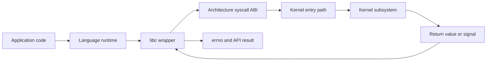
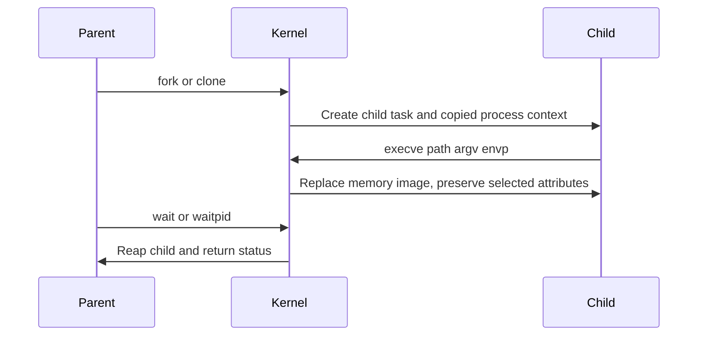

Purpose: Explain the exact user-kernel boundary in Linux: syscall ABI, libc wrappers, errno, vDSO, process creation, file descriptors, sockets, ioctls, seccomp, tracing, and what the stable ABI does and does not promise.

# System Calls, ABI, libc, And User-Kernel Boundaries

Related notes: [01 Linux Mental Model User Space Kernel and Hardware](/compendium/linux-systems-engineering/linux-mental-model-user-space-kernel-and-hardware)

The Linux syscall boundary is where a user-space thread asks the kernel to perform privileged work. That boundary is narrow by design and stable by policy. The kernel does not promise that its internal functions, structs, locks, driver details, or `/proc` formatting remain stable for every use. It does promise that the documented user-kernel ABI used by normal programs is treated as a compatibility contract.

This note stays at boundary level. For the broader map of hardware, boot, device model, virtual filesystems, package managers, filesystem hierarchy, environment variables, shell process model, exit codes, and pipes, see [01 Linux Mental Model User Space Kernel and Hardware](/compendium/linux-systems-engineering/linux-mental-model-user-space-kernel-and-hardware).

## Boundary Diagram



A C program might call `read(fd, buf, len)`. That symbol is usually provided by libc. libc places the syscall number and arguments according to the architecture ABI, enters the kernel with the relevant instruction, receives a raw result, translates negative kernel errors into `errno` plus `-1`, and returns to the caller. Higher-level runtimes add more policy: buffering, retry loops, cancellation points, async schedulers, exceptions, promises, green threads, or event loops.

## System Call ABI

The syscall ABI is not the same as the C function ABI. It defines how a process enters the kernel, where the syscall number goes, where arguments go, how return values are represented, and which registers are clobbered. On x86-64 Linux, for example, the `syscall` instruction is used and arguments are passed in a specific register sequence. Other architectures use different entry instructions and register conventions.

The kernel receives machine values, not C types with rich meaning. Pointers are user virtual addresses. File descriptors are integers indexing the calling process file descriptor table. Flags are bitmasks. Struct layouts are ABI artifacts and must be treated carefully across word size, time size, alignment, and architecture differences.

| Layer | ABI concern | Production implication |
| --- | --- | --- |
| Source API | `open`, `fopen`, `socket`, `pthread_create` | May be libc or runtime behavior, not a direct syscall |
| libc wrapper | symbol versioning, feature macros, retry behavior, `errno` | Container base image and libc family matter |
| Syscall ABI | syscall number, registers, raw return convention | Direct syscall code is architecture-specific |
| Kernel implementation | VFS, scheduler, network, driver, LSM, cgroup | Behavior depends on kernel config, namespaces, policy, resources |
| User-kernel ABI | documented behavior and structures | Stable contract, but new features need runtime detection |

Direct syscall use is valid for low-level tools, sandboxed runtimes, language standard libraries, or new syscalls without wrappers. For ordinary application code, prefer libc or runtime APIs because they handle portability, cancellation, feature detection, and error translation.

## libc Wrappers Are Not Just Boilerplate

libc is the C user-space interface layer. It provides wrappers for many system calls, but also implements functions entirely in user space, chooses newer syscalls when available, falls back when needed, and normalizes error reporting. The wrapper name may match a syscall name, but do not assume one-to-one mapping.

Examples:

| Function | Boundary reality |
| --- | --- |
| `printf` | Usually buffered user-space work until it writes to an FD. |
| `fopen` | libc stream setup plus one or more syscalls such as `openat`, `fcntl`, `fstat`, or locale work. |
| `pthread_mutex_lock` | Often user-space atomics in the uncontended path, futex syscall when blocking is needed. |
| `clock_gettime` | May use vDSO without a trap into the kernel for supported clocks. |
| `fork` | libc may call `clone` or `clone3` internally on some systems. |
| `system` | Shell invocation, signal handling, fork or clone, exec, wait, and environment exposure. |

Production consequence: an application upgrade, base image change, or switch from glibc to musl can change behavior at the boundary even when the kernel is unchanged. Conversely, a kernel upgrade can expose new syscall features that libc starts using after a library update.

## errno And Raw Kernel Errors

Kernel syscalls return success values or negative error numbers according to the architecture convention. libc normally converts a failing syscall into `-1` and stores the positive error number in thread-local `errno`. Code must read `errno` only after a function indicates failure. Successful calls are not required to clear it.

| Error | Typical meaning | Field interpretation |
| --- | --- | --- |
| `ENOENT` | Path component or object not found | Check namespace, chroot, container root, cwd, mount propagation, race |
| `EACCES` | Permission denied by mode bits or search permission | Check directory execute bits, user, groups, ACLs |
| `EPERM` | Operation not permitted | Check capabilities, LSM, seccomp, namespace, immutable flags |
| `EBADF` | Bad file descriptor | FD closed, wrong process, close-on-exec, race, descriptor reuse |
| `EAGAIN` | Try again, would block, or resource temporarily unavailable | Nonblocking I/O, process limits, cgroup pressure, queue saturation |
| `EINTR` | Interrupted by signal | Retry policy depends on syscall and application semantics |
| `ENOSPC` | No space left | Could be filesystem blocks, inodes, project quota, thin pool, or tmpfs memory |
| `EROFS` | Read-only filesystem | Check mount flags, remounts, container layers, emergency remount after errors |

Common mistake: printing `errno` after calling another library function, which may overwrite it. Save it immediately if you need it.

```c
int fd = open(path, O_RDONLY | O_CLOEXEC);
if (fd == -1) {
    int saved = errno;
    fprintf(stderr, "open %s failed: %s\n", path, strerror(saved));
    return -1;
}
```

In production, pair the application-level error with `strace` or audit logs when the cause is ambiguous. `EPERM` from `mount`, `bpf`, `perf_event_open`, or `clone3` can mean very different policies.

## vDSO

The vDSO is a small kernel-provided shared object mapped into user processes. It lets selected operations run in user space while still using kernel-maintained data. Time queries are the common example. This avoids the full cost of a syscall trap for hot paths such as `clock_gettime` when the kernel and architecture support it.

Field implications:

| Symptom | vDSO angle |
| --- | --- |
| `strace` does not show every time call | Some calls may be satisfied through vDSO without a visible syscall. |
| Time-related behavior changes after virtualization or kernel changes | Clocksource, vDSO support, and time namespace behavior can matter. |
| Direct syscall benchmark differs from libc call | libc may choose vDSO or a fallback path. |

Do not disable or bypass vDSO to "make tracing easier" on production systems unless there is a strong reason. Use the right tracing layer for the question.

## strace As A Boundary Microscope

`strace` observes system calls and signals. It answers "what did this process ask the kernel to do and what came back?" It does not answer every source-level question, every library call, or every scheduling event.

Useful patterns:

```sh
# Trace a new command with timing and strings large enough for paths.
strace -f -tt -s 256 -o trace.log command arg1 arg2

# Attach to a running process. Use carefully in production.
strace -f -p "$PID" -s 256

# Summarize syscall time and counts.
strace -f -c command

# Focus on file and process boundaries.
strace -f -e trace=file,process command

# Focus on network calls.
strace -f -e trace=network command
```

Production caution: tracing can slow workloads, change timing, expose secrets in arguments or environment-related paths, and generate large logs. Prefer a short capture window, scrub output, and trace a replica or canary when possible. For high-volume hosts, eBPF or perf-based tools may be lower overhead, but they have their own privilege and kernel-version constraints.

## fork, exec, wait, And The Boundary

Process creation is a set of boundary operations, not one magic action.



`fork` creates a child process with a new PID and a mostly copied process context. Modern kernels use copy-on-write for memory pages, so `fork` does not immediately duplicate all memory. File descriptors are copied as references to the same underlying open file descriptions, which means offsets and some status flags can be shared.

`execve` replaces the current process image with a new program. PID remains the same. Many attributes persist, while signal dispositions, memory mappings, alternate stacks, and other process details are reset according to documented rules. Arguments and environment are passed at exec. Close-on-exec flags decide which FDs survive.

`wait`, `waitpid`, and related calls collect child exit state. If a parent never waits, exited children remain zombies until reaped. If PID 1 in a container does not reap children, a long-running container can accumulate zombies even though the host kernel is working correctly.

Boundary-level failure examples:

| Failure | Likely boundary |
| --- | --- |
| `execve` returns `ENOENT` for an existing script | Interpreter in shebang missing inside that root or namespace |
| Child inherits a listening socket unexpectedly | Missing `O_CLOEXEC` or `FD_CLOEXEC` |
| Process starts manually but not under service manager | Environment, cwd, limits, capabilities, `NoNewPrivileges`, seccomp, mount namespace |
| Pipeline hides first command failure | Shell wait and pipeline status policy |
| Container exits but leaves children | PID 1 signal handling and wait behavior |

## File Descriptors

A file descriptor is a per-process integer handle. It can refer to regular files, directories, pipes, sockets, terminals, eventfd, timerfd, signalfd, epoll instances, memfd, pidfd, device nodes, or other kernel-backed objects. The integer is process-local. FD 3 in one process is unrelated to FD 3 in another unless inherited or passed.

Important distinctions:

| Concept | Meaning |
| --- | --- |
| File descriptor | Integer in a process table. |
| Open file description | Kernel object created by `open`; stores offset and file status flags. |
| File descriptor flags | Per-FD flags such as close-on-exec. |
| File status flags | Flags on the open file description, such as nonblocking mode. |
| Inode | Filesystem object identity for many filesystems. |
| Path | Name lookup route, not the open object itself. |

After `open`, path permissions are not rechecked for each read and write in the simple way beginners expect. The kernel checks access at open and then operations use the open object, though later writes can still fail because of quotas, seals, leases, revoked devices, I/O errors, mount changes, or filesystem-specific policy.

Production guidance:

```sh
ls -l /proc/"$PID"/fd
cat /proc/"$PID"/limits
lsof -p "$PID"
readlink /proc/"$PID"/fd/3
```

Watch for FD leaks. Symptoms include `EMFILE`, `ENFILE`, inability to accept sockets, failed log rotation, stuck deleted files consuming disk, and services that only fail after days.

## Sockets Are File Descriptors

Sockets use the FD model. `socket` returns an FD. `bind`, `listen`, `accept`, `connect`, `sendmsg`, `recvmsg`, `getsockopt`, and `setsockopt` operate on it. Readiness APIs such as `select`, `poll`, and `epoll` also work with socket FDs.

This gives Linux a composable I/O model, but it also creates subtle mistakes:

| Mistake | Consequence |
| --- | --- |
| Forgetting nonblocking mode on event-loop sockets | Thread or loop can hang in a syscall |
| Not setting close-on-exec on accepted sockets | Child processes inherit production connections |
| Assuming `write` sends all bytes | Short writes happen, especially on nonblocking sockets |
| Treating `ECONNRESET` as app-level protocol only | Peer, network, load balancer, kernel timeout, or process crash could be responsible |
| Ignoring socket buffer sizes | Backpressure becomes latency or memory pressure |

Troubleshooting set:

```sh
ss -tanp
ss -lunp
cat /proc/net/sockstat
ls -l /proc/"$PID"/fd | grep socket
strace -f -e trace=network -p "$PID"
```

In clusters, remember that socket behavior may be shaped by network namespaces, service proxies, conntrack, CNI plugins, host firewall policy, sidecars, load balancers, and MTU. A successful `connect` inside one namespace does not prove the host or another pod has the same route.

## ioctl

`ioctl` is an escape hatch syscall for device-specific and subsystem-specific operations that do not fit cleanly into read, write, mmap, or structured syscalls. It takes an FD, a request number, and an untyped argument. That argument may be an integer or a pointer to a structure whose layout is defined by the subsystem ABI.

Why it exists:

| Benefit | Cost |
| --- | --- |
| Extends existing FD model | Request semantics are less discoverable |
| Supports device-specific control | ABI can be architecture-sensitive if designed poorly |
| Avoids adding a syscall for every operation | Error interpretation requires subsystem knowledge |
| Works with terminals, block devices, GPUs, network devices, and more | Security filtering is harder than for narrow syscalls |

Production stance: do not treat all `ioctl` calls as suspicious, but do not treat them as transparent either. When debugging, identify the FD target and request name. `strace` can decode many known ioctls, but unknown ones may appear as numbers. Driver documentation, kernel headers, and subsystem tools may be necessary.

## seccomp Implications

seccomp restricts the syscalls a process may make. In filter mode, a BPF program evaluates syscall metadata and returns an action such as allow, kill, trap, log, trace, or return an error. Containers commonly use seccomp profiles to reduce kernel attack surface.

Operational consequences:

| Situation | Boundary reading |
| --- | --- |
| Program works on laptop but fails in container with `EPERM` | Container seccomp profile may block the syscall |
| New language runtime version fails under old profile | Runtime began using a newer syscall such as `clone3`, `openat2`, `pidfd_open`, or `futex_waitv` |
| Security profile allows `ioctl` too broadly | A narrow syscall count can still expose broad device control |
| Debugger cannot attach | `ptrace`, capabilities, Yama, seccomp, and container policy may block it |

Do not solve seccomp failures by turning seccomp off globally. Identify the exact syscall, arguments if relevant, kernel version, runtime version, container profile, and workload need. Add the narrowest allow rule or update the base image/runtime combination. On production clusters, profile changes are security changes and need the same review discipline as network or RBAC changes.

## Stable User-Kernel ABI

Linux maintains a strong compatibility stance for user space. Old binaries should keep running on newer kernels unless they depend on bugs, removed unsafe behavior, obsolete hardware, or noncontract internals. This is why system call semantics, structure layouts, procfs fields used as ABI, and device interfaces are handled carefully.

The stable ABI does not mean:

| Misread | Reality |
| --- | --- |
| All kernel internals are stable | Internal functions and structs are not a user-space contract. |
| All `/proc` and `/sys` text is safe to scrape forever | Some files are ABI, some are diagnostic, and context matters. |
| New syscalls exist everywhere | Runtime detection and fallback are required across kernel versions. |
| A binary is portable across libc families | libc ABI, dynamic linker path, NSS, locale, and symbol versions matter. |
| Containers hide kernel differences | Containers share the host kernel unless using a VM boundary. |

For production fleets, the ABI question is practical: what exact kernel features does this workload require, what user-space libraries call them, and what happens when the syscall is absent or blocked? The answer belongs in release notes, base image policy, and node compatibility checks.

## Local Learning Machine Versus Production Host

| Activity | Local learning machine | Production host or cluster |
| --- | --- | --- |
| `strace -f` a service | Good way to learn boundary behavior | Use limited windows; consider latency and secret exposure |
| Build a static binary and direct syscalls | Useful for ABI experiments | Avoid unless portability and maintenance are owned |
| Disable seccomp | Helps isolate a hypothesis | Treat as temporary emergency change with audit trail |
| Upgrade libc or kernel | Teaches compatibility surfaces | Requires staged rollout, rollback, workload compatibility checks |
| Inspect `/proc/&lt;pid&gt;/environ` | Fine on your own process | Sensitive data exposure risk |
| Change sysctls | Educational | Live kernel behavior change with fleet impact |

Clusters add another boundary stack: container runtime, namespaces, cgroups, seccomp, LSM, service mesh, CNI, CSI, node image, orchestrator health checks, and scheduler policy. A syscall failure inside a pod can be caused by any of those layers plus the kernel itself.

## Troubleshooting Syscall Boundary Failures

Use this sequence:

1. Reproduce the exact command or service path, not only the source function.
2. Capture exit code, signal status, and application error.
3. Trace syscalls with a narrow filter if possible.
4. Map failing FD numbers to targets through `/proc/&lt;pid&gt;/fd`.
5. Map paths to namespaces, mounts, and root with `/proc/&lt;pid&gt;/mountinfo` and `/proc/&lt;pid&gt;/root`.
6. Check identity and permissions: UID, GID, supplementary groups, capabilities, LSM, seccomp, cgroups.
7. Check kernel logs and audit logs for denial records.
8. Compare host and container views.
9. Verify kernel version and libc family.
10. Make the smallest policy or code change and retest the same boundary call.

Command set:

```sh
strace -f -tt -s 256 -o trace.log command arg
grep -E ' = -1 (EACCES|EPERM|ENOENT|EBADF|EAGAIN|ENOSPC|EROFS)' trace.log
ps -o pid,ppid,user,stat,comm,args -p "$PID"
cat /proc/"$PID"/status
ls -l /proc/"$PID"/fd
cat /proc/"$PID"/mountinfo
readlink -f /proc/"$PID"/root
grep Seccomp: /proc/"$PID"/status
grep CapEff: /proc/"$PID"/status
dmesg -T | tail -200
```

If a file open fails:

```text
path string
  -> cwd and root
  -> mount namespace
  -> path lookup and symlinks
  -> directory execute permission
  -> file mode, ACL, idmap, LSM
  -> open flags
  -> filesystem state
  -> cgroup or quota pressure
```

If process start fails:

```text
exec path
  -> interpreter or dynamic linker path
  -> executable bit and mount noexec
  -> architecture and ELF class
  -> shared libraries
  -> environment
  -> close-on-exec FDs
  -> limits, capabilities, seccomp, LSM
```

## Common Mistakes

| Mistake | Why it is wrong | Better practice |
| --- | --- | --- |
| Assuming libc call equals syscall | libc may buffer, emulate, fallback, or use vDSO | Trace the actual boundary and read libc docs when behavior matters |
| Checking `errno` without a failing return | `errno` can contain stale values | Read `errno` only after documented failure |
| Retrying every `EINTR` blindly | Some operations have partial effects or application-level deadlines | Use syscall-specific and protocol-specific retry policy |
| Treating FD numbers as global | FDs are process-local and reused | Capture PID, FD target, and timestamp together |
| Forgetting close-on-exec | Secrets, sockets, and pipes leak into children | Use `O_CLOEXEC`, `SOCK_CLOEXEC`, `pipe2`, `dup3` |
| Treating `EPERM` as Unix mode bits | Often capabilities, LSM, seccomp, namespace, or lockdown | Inspect policy layers before chmod or chown |
| Assuming containers have their own kernel | Most containers share the host kernel | Check node kernel and runtime policy |
| Parsing unknown `/sys` attributes as stable API | sysfs is structured but subsystem semantics vary | Prefer documented ABI files and supported tools |

## Production Guidance

For application teams:

- Log failing operation, path or endpoint, saved `errno`, and relevant flags, but redact secrets.
- Prefer high-level APIs unless you own portability and fallback for direct syscalls.
- Set close-on-exec by default for FDs.
- Make nonblocking I/O explicit and test backpressure.
- Treat base image, libc family, and kernel minimum as compatibility inputs.

For platform teams:

- Version seccomp profiles with runtime and base image upgrades.
- Record node kernel config and distribution patch level in fleet inventory.
- Test workloads against the same namespace, cgroup, LSM, and seccomp policy used in production.
- Keep kernel logs, audit logs, and container runtime events correlated by time.
- Avoid relying on undocumented kernel internals for health checks.

For incident response:

- Start from the failing syscall and raw error when possible.
- Separate "object does not exist in this namespace" from "object exists but policy denies access."
- Check both the process view and the host view.
- Remember that successful startup does not prove FD inheritance, limits, or seccomp are correct under later load.

## Source Trail

- Linux man-pages syscalls(2): https://man7.org/linux/man-pages/man2/syscalls.2.html
- Linux man-pages syscall(2): https://man7.org/linux/man-pages/man2/syscall.2.html
- Linux man-pages errno(3): https://man7.org/linux/man-pages/man3/errno.3.html
- Linux man-pages vdso(7): https://man7.org/linux/man-pages/man7/vdso.7.html
- Linux man-pages fork(2): https://man7.org/linux/man-pages/man2/fork.2.html
- Linux man-pages execve(2): https://man7.org/linux/man-pages/man2/execve.2.html
- Linux man-pages seccomp(2): https://man7.org/linux/man-pages/man2/seccomp.2.html
- Linux man-pages proc(5): https://man7.org/linux/man-pages/man5/proc.5.html
- Linux man-pages sysfs(5): https://man7.org/linux/man-pages/man5/sysfs.5.html
