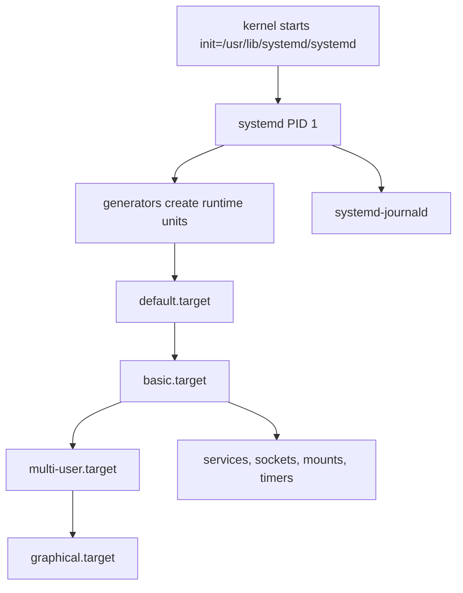
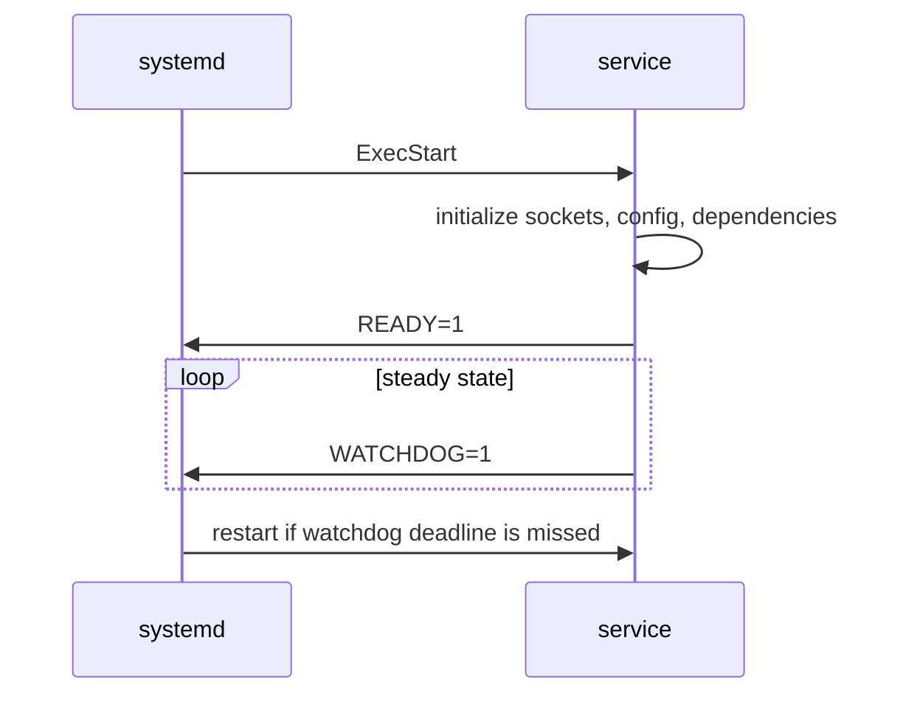

Purpose: Build an operator-grade mental model for systemd as PID 1, service supervisor, boot transaction engine, resource controller, and logging substrate, with clear differences between a local learning machine and production hosts or clusters.

# 07 systemd Boot Init Units Timers Journald and Services

Related notes: [06 System Calls ABI libc and User Kernel Boundaries](/compendium/linux-systems-engineering/system-calls-abi-libc-and-user-kernel-boundaries), [08 Permissions Users Groups Capabilities and LSMs](/compendium/linux-systems-engineering/permissions-users-groups-capabilities-and-lsms), [09 cgroups Namespaces Containers and Runtime Isolation](/compendium/linux-systems-engineering/cgroups-namespaces-containers-and-runtime-isolation), [17 Production Operations Troubleshooting and Runbooks](/compendium/linux-systems-engineering/production-operations-troubleshooting-and-runbooks)

systemd is not only an init program. On a modern Linux host it is the first long-lived userspace process, the coordinator for boot and shutdown, a dependency resolver, a cgroup manager, a service monitor, an activation broker, and often the front door for host logs. Treat it as an operating system control plane. On a local learning machine, it is acceptable to experiment with unit files, timers, socket activation, and journald retention. On production hosts and clusters, every unit is part of the host reliability model: it affects boot ordering, shutdown behavior, blast radius, logging, resource contention, and incident response.

## PID 1 responsibilities

PID 1 has special kernel semantics. If it exits, the system is not viable. If orphaned processes need a parent, PID 1 adopts them. If child processes terminate, PID 1 must reap them. systemd adds higher-level policy on top of those kernel duties:

- start configured boot targets and their dependencies
- track services and scopes with cgroups rather than only parent-child process trees
- supervise process lifecycle and restart policy
- translate fstab, crypttab, device, and generator output into units
- coordinate shutdown, reboot, halt, rescue, and emergency modes
- expose state through D-Bus, systemctl, and journal metadata
- enforce resource controls and many sandboxing controls through unit configuration

The key production lesson is that PID 1 should own process lifetime. A daemon that double-forks, writes a stale pidfile, or escapes its service cgroup makes supervision less reliable. Prefer foreground services with `Type=simple`, `Type=notify`, or `Type=exec`, and let systemd manage the process tree.

## Unit model

A unit is a named object that systemd knows how to load, order, start, stop, reload, monitor, or bind into another unit. Unit files are INI-style files with common sections such as `[Unit]` and `[Install]`, plus type-specific sections such as `[Service]`, `[Timer]`, `[Socket]`, or `[Mount]`.

| Unit type | What it represents | Production use | Common trap |
|---|---|---|---|
| `.service` | supervised process or process set | API daemons, workers, agents | writing for SysV daemon behavior instead of foreground execution |
| `.target` | synchronization point and grouping node | boot modes, dependency anchors | assuming targets run code themselves |
| `.timer` | time-based activation | backups, cleanup, renewal jobs | forgetting the matching `.service` name |
| `.socket` | socket-based activation | lazy start, service dependency reduction | ignoring backlog, permissions, and protocol behavior |
| `.mount` | mounted filesystem | explicit mount dependencies | using the wrong escaped unit name for a path |
| `.automount` | on-demand mount trigger | avoid boot blocking on slow storage | hiding intermittent storage latency until first access |
| `.path` | filesystem path activation | simple local automation | treating it as a full file watcher pipeline |
| `.slice` | cgroup resource partition | host resource budgets | leaving everything in default slices |
| `.scope` | externally created process group | transient commands, containers, sessions | expecting full service restart semantics |

Load path precedence matters. Administrator-owned system units and drop-ins belong under `/etc/systemd/system`. Runtime units belong under `/run/systemd/system`. Package-owned units belong under `/usr/lib/systemd/system` or the distro equivalent. Do not edit vendor unit files in place on production hosts; use drop-ins so package upgrades remain manageable.

## Boot transaction

systemd computes a boot transaction from the default target and the units pulled in through dependencies, generated units, device discovery, and preset state. It is not a linear script. Multiple jobs run in parallel when their ordering constraints allow it.



On a laptop, boot analysis is often about shaving seconds or understanding what started. On production hosts, boot analysis is about determinism: remote filesystems, secrets, network readiness, cloud-init, storage activation, container runtimes, and monitoring agents must come up in a predictable order without deadlocking the machine.

## Requirements vs ordering

The most common systemd mistake is confusing requirement dependencies with ordering dependencies.

| Directive | Meaning | What it does not mean |
|---|---|---|
| `Requires=` | If this unit is activated, also activate the listed unit; failure can propagate | It does not order start by itself |
| `Wants=` | Weaker pull-in; listed unit failure does not fail the requiring unit by itself | It does not prove readiness |
| `BindsTo=` | Strong lifecycle binding to another unit | It still often needs ordering |
| `PartOf=` | Stop or restart propagation from another unit | It does not pull the unit in at boot |
| `After=` | Start this unit after listed unit start job completes | It does not pull the listed unit in |
| `Before=` | Start this unit before listed unit | It does not pull the other unit in |
| `Conflicts=` | Cannot be active together | It does not define which one wins without transaction context |

Use both a requirement and an ordering directive when both are needed:

```ini
[Unit]
Description=Example API
Wants=network-online.target
After=network-online.target
```

Even that does not guarantee the remote dependency is healthy. `network-online.target` means the local network stack reached the distro's configured definition of online. It does not mean DNS, a database, a load balancer, or a Kubernetes service endpoint is reachable. In production, add application-level retries and health checks instead of encoding every remote fact into boot ordering.

## Services

A service unit tells systemd how to start, stop, reload, and supervise a process.

```ini
[Unit]
Description=Guards an example HTTP service
Documentation=https://example.internal/runbooks/example-http
Wants=network-online.target
After=network-online.target

[Service]
Type=notify
User=example
Group=example
EnvironmentFile=-/etc/example/example.env
ExecStart=/usr/local/bin/example-http --config /etc/example/config.toml
ExecReload=/bin/kill -HUP $MAINPID
Restart=on-failure
RestartSec=5s
TimeoutStartSec=45s
TimeoutStopSec=30s
WatchdogSec=30s
NotifyAccess=main
NoNewPrivileges=yes
PrivateTmp=yes
ProtectSystem=strict
ProtectHome=read-only
ReadWritePaths=/var/lib/example /var/log/example
CapabilityBoundingSet=CAP_NET_BIND_SERVICE
AmbientCapabilities=CAP_NET_BIND_SERVICE
SystemCallFilter=@system-service
MemoryMax=512M
CPUQuota=200%

[Install]
WantedBy=multi-user.target
```

Service type is a contract:

| Type | Contract | Use when |
|---|---|---|
| `simple` | process started by `ExecStart` is the main service immediately | most foreground daemons without readiness signaling |
| `exec` | like simple, but systemd waits until `execve` succeeds | catching missing binary or permission failures earlier |
| `forking` | process forks and parent exits | legacy daemons only |
| `oneshot` | command runs to completion | migrations, setup jobs, small host tasks |
| `notify` | service calls sd_notify for readiness and watchdog | production daemons that can signal real readiness |
| `dbus` | readiness is tied to acquiring a bus name | D-Bus services |

For production, prefer `Type=notify` when the daemon supports it. It distinguishes "process exists" from "service is ready." For a local learning box, `Type=simple` is fine for most experiments.

## Targets

A target is a named synchronization point, not a script. `multi-user.target` is the normal non-graphical multi-user boot target. `graphical.target` adds the display stack. `rescue.target` provides a single-user repair environment with more of the system mounted. `emergency.target` is smaller and useful when normal boot is broken.

Production guidance:

- enable long-running services with `WantedBy=multi-user.target` unless they are explicitly graphical, early boot, or tied to another target
- avoid custom boot targets unless you own the whole image or appliance behavior
- know how to boot into rescue or emergency mode from the console before a bad unit breaks remote access
- for cluster nodes, document what should happen when kubelet, container runtime, storage agents, or node exporters are disabled

## Timers

Timers replace many cron use cases and integrate with unit state, logs, missed-run behavior, and dependency management.

```ini
# /etc/systemd/system/example-backup.timer
[Unit]
Description=Run example backup

[Timer]
OnCalendar=*-*-* 02:15:00
Persistent=true
RandomizedDelaySec=20m
AccuracySec=1m
Unit=example-backup.service

[Install]
WantedBy=timers.target
```

```ini
# /etc/systemd/system/example-backup.service
[Unit]
Description=Example backup job
Wants=network-online.target
After=network-online.target

[Service]
Type=oneshot
User=backup
ExecStart=/usr/local/sbin/example-backup
```

| Timer choice | Field effect | Production guidance |
|---|---|---|
| `OnCalendar=` | wall-clock scheduling | use for daily, weekly, monthly operations |
| `OnBootSec=` | relative to boot | use for delayed host tasks |
| `OnUnitActiveSec=` | relative to last activation | use for periodic maintenance loops |
| `Persistent=true` | catch up missed wall-clock timers after downtime | useful for backups and renewals, risky for expensive jobs after fleet outage |
| `RandomizedDelaySec=` | spread execution time | use on fleets to avoid synchronized load |
| `AccuracySec=` | coalesce wakeups | keep loose unless exact timing matters |

On clusters, prefer native controllers for cluster-level reconciliation. Use systemd timers for node-local tasks such as log cleanup, certificate renewal, agent housekeeping, or backup hooks that truly belong to the host.

## Socket activation

Socket units let systemd bind sockets before the service runs and start the service when traffic arrives.

```ini
[Socket]
ListenStream=127.0.0.1:9000
SocketUser=example
SocketGroup=example
Accept=no

[Install]
WantedBy=sockets.target
```

Socket activation reduces explicit dependencies because clients can connect to a stable socket while systemd starts the provider. It is powerful for local IPC, D-Bus-adjacent services, and infrequently used daemons. It is not a magic performance feature. For high-volume production APIs, confirm backlog sizing, readiness behavior, connection handoff, protocol expectations, and observability before relying on it.

## Mounts and automounts

systemd derives many mount units from `/etc/fstab`. A path becomes an escaped unit name; for example `/var/lib/example` maps to `var-lib-example.mount`. Mount units can block boot if storage is slow or unavailable. Automount units can defer the mount until first access.

Production rules:

- for local disks required by services, make dependencies explicit through mount units or paths
- for remote storage, choose between fail-fast, nofail, automount, and service-level retry deliberately
- do not let an optional network mount block SSH or emergency access
- monitor mount state and I/O errors, not only service state

Example service dependency on a required local mount:

```ini
[Unit]
RequiresMountsFor=/var/lib/example
After=var-lib-example.mount
```

## Environment files and secrets

`Environment=` and `EnvironmentFile=` are configuration mechanisms, not secret stores. Environment variables are often visible through process inspection, crash dumps, service metadata, or accidental logging.

Use environment files for non-secret runtime configuration:

```ini
[Service]
EnvironmentFile=-/etc/example/example.env
```

The leading `-` means missing file is tolerated. That is convenient on a learning machine. In production, use it only for truly optional files. For required config, fail loudly.

For secrets, prefer a host secret manager, systemd credentials where available, kernel keyrings for narrow cases, or application-native secret retrieval with clear rotation semantics. See [08 Permissions Users Groups Capabilities and LSMs](/compendium/linux-systems-engineering/permissions-users-groups-capabilities-and-lsms) for Linux secret handling and incident response.

## Drop-ins and overrides

Use drop-ins to change package units without editing vendor files:

```bash
sudo systemctl edit example.service
sudo systemctl cat example.service
sudo systemctl daemon-reload
sudo systemctl restart example.service
```

Drop-ins are merged in lexicographic order after the main unit. To reset a list directive, assign it to an empty value first:

```ini
[Service]
ExecStart=
ExecStart=/usr/local/bin/example --new-mode
```

Production guidance:

- keep drop-ins small and named for intent, such as `10-hardening.conf` or `20-resource-limits.conf`
- record why the override exists in config management or an image build recipe
- after package upgrades, inspect `systemctl cat` and `systemd-analyze verify`
- avoid manual one-off overrides on cluster nodes unless the incident record captures them

## Journald

`systemd-journald` collects structured logs from the kernel, stdout and stderr of services, syslog clients, audit messages when forwarded, and native journal clients. It stores metadata such as unit, PID, UID, boot ID, cgroup, executable path, priority, and monotonic timestamp.

Important commands:

```bash
journalctl -b
journalctl -b -1
journalctl -u example.service
journalctl -u example.service --since "1 hour ago"
journalctl -p warning..alert
journalctl -k
journalctl -o short-iso
journalctl -o json-pretty -u example.service
journalctl --list-boots
```

Log persistence depends on storage configuration. Many distros keep journals in memory unless `/var/log/journal` exists or `Storage=persistent` is set in `journald.conf`. A local learning machine can use volatile logs to reduce disk writes. Production hosts should generally persist local boot logs even if a central log pipeline exists, because early boot, network loss, and collector failure are exactly when local evidence matters.

Operational cautions:

- set retention and size limits so journald cannot consume the filesystem
- forward to central logging, but do not assume forwarding captures early boot or late shutdown
- prefer structured fields for custom services when possible
- use `journalctl --vacuum-time` or `--vacuum-size` as a controlled operation, not a blind cron habit
- preserve relevant logs before rebooting during incident response

## Service hardening

systemd hardening is defense in depth. It does not replace application security, Unix permissions, LSM policy, patching, or network controls. It is still valuable because it constrains what a compromised daemon can do.

| Directive | Effect | Production caution |
|---|---|---|
| `User=` and `Group=` | run as non-root identity | create dedicated service users |
| `DynamicUser=yes` | allocate ephemeral service identity | good for stateless services, awkward for preexisting file ownership |
| `NoNewPrivileges=yes` | block privilege gain through exec | may break setuid helper workflows |
| `CapabilityBoundingSet=` | limit retained capabilities | avoid broad `CAP_SYS_ADMIN` |
| `AmbientCapabilities=` | pass selected capabilities to non-root process | use only with tight bounding set |
| `PrivateTmp=yes` | private `/tmp` namespace | can break services sharing temp paths |
| `ProtectSystem=strict` | make most system paths read-only | pair with explicit `ReadWritePaths=` |
| `ProtectHome=yes` | block home directory access | validate apps that read user files |
| `PrivateDevices=yes` | restrict device access | may break hardware, GPU, FUSE, or loop use |
| `RestrictAddressFamilies=` | restrict socket families | test DNS, Unix sockets, and IPv6 needs |
| `SystemCallFilter=` | seccomp syscall filtering | validate under real workload |
| `LockPersonality=yes` | block personality changes | usually safe for normal services |
| `MemoryDenyWriteExecute=yes` | block writable executable memory mappings | can break JIT runtimes |
| `ProtectKernelTunables=yes` | block writes to kernel tunables | usually appropriate for apps |
| `ProtectControlGroups=yes` | block direct cgroup modification | avoid for container managers |

Use `systemd-analyze security example.service` as a review aid, not as an absolute score. Some low scores are correct for kubelet, container runtimes, storage agents, or observability tools because their job requires host access. Ordinary application services should be much tighter.

## Watchdogs and readiness

A restart policy handles process exit. A watchdog handles process wedging after startup. With `Type=notify`, a service can call `sd_notify("READY=1")` when it is actually ready and periodically call `WATCHDOG=1` before `WatchdogSec` expires.



Production guidance:

- watchdog pings must come from the main event loop or a meaningful health path, not a side thread that can keep pinging while the service is deadlocked
- set `RestartSec` to avoid hot loops
- combine watchdogs with external health checks; systemd sees the host-local process, not full user-visible service health
- for cluster-managed workloads, avoid fighting the orchestrator with aggressive host-level restarts unless the service is node infrastructure

## Restart policies

| Policy | Behavior | Use |
|---|---|---|
| `Restart=no` | do not restart | oneshot jobs, failure should stay visible |
| `Restart=on-failure` | restart on non-zero exit, signal, timeout, watchdog | default for many daemons |
| `Restart=always` | restart even on clean exit | persistent agents that should never stop |
| `Restart=on-abnormal` | restart on signal, timeout, watchdog | avoid hiding clean application exits |
| `Restart=on-watchdog` | restart only on watchdog expiry | specialized supervision |

Use rate limits:

```ini
[Unit]
StartLimitIntervalSec=5m
StartLimitBurst=5

[Service]
Restart=on-failure
RestartSec=10s
```

When start limits are hit, the unit stays failed until reset or the interval clears. During incidents, check both the original failure and the rate-limit state.

## Resource controls

systemd maps units to cgroups. Resource controls let the host protect itself from a noisy service:

```ini
[Service]
MemoryMax=1G
MemoryHigh=768M
CPUQuota=150%
TasksMax=512
IOWeight=100
```

Local learning machines can use these controls to observe behavior under pressure. Production hosts should set budgets for untrusted or bursty services, but must understand failure semantics. `MemoryMax` can cause OOM kills inside the service cgroup. `CPUQuota` can increase latency. `TasksMax` can break thread-heavy runtimes. Resource limits need metrics and load testing.

On cluster nodes, know which layer owns the budget. Kubernetes usually owns pod cgroups, while systemd owns node services such as kubelet, containerd, journald, and monitoring agents. Do not set host unit limits that starve the orchestrator.

## Transient units

Transient units are runtime units created through the systemd API, commonly with `systemd-run`.

```bash
systemd-run --unit=debug-shell --pty /bin/bash
systemd-run --scope -p MemoryMax=2G make -j8
systemd-run --on-calendar='*:0/15' --unit=example-poll /usr/local/bin/poll
```

Use transient units for controlled debugging, one-off commands with cgroup boundaries, and runtime experiments. For production, durable behavior belongs in versioned unit files, image builds, or configuration management. A transient unit that fixes an incident should be converted into a tracked change or explicitly removed.

## systemctl field commands

```bash
systemctl status example.service
systemctl start example.service
systemctl stop example.service
systemctl restart example.service
systemctl reload example.service
systemctl enable --now example.service
systemctl disable --now example.service
systemctl mask example.service
systemctl unmask example.service
systemctl list-units --failed
systemctl list-dependencies example.service
systemctl show example.service
systemctl cat example.service
systemctl edit example.service
systemctl daemon-reload
systemctl reset-failed example.service
```

Production habits:

- run `systemctl cat` before assuming which file is active
- run `systemctl show -p FragmentPath -p DropInPaths -p ActiveState -p SubState -p Result unit`
- use `enable --now` only when you intend both boot activation and immediate start
- use `mask` sparingly; it prevents manual starts too
- after unit file changes, run `daemon-reload`, then restart or reload the unit as appropriate

## Boot analysis

```bash
systemd-analyze
systemd-analyze blame
systemd-analyze critical-chain
systemd-analyze plot > boot.svg
systemd-analyze verify /etc/systemd/system/example.service
journalctl -b -p warning..alert
systemctl list-jobs
```

`blame` shows elapsed activation time, not necessarily blocking time. `critical-chain` is better for finding what delayed the boot path. For production boot regressions, compare boot IDs, kernel versions, initramfs changes, storage discovery, network wait units, cloud-init, and failed dependencies.

## Failed unit troubleshooting

Start with the unit and the current boot:

```bash
systemctl status example.service
journalctl -b -u example.service
systemctl show example.service -p Result -p ExecMainStatus -p ExecMainCode -p NRestarts
systemctl cat example.service
systemd-analyze verify /etc/systemd/system/example.service
```

Then classify the failure:

| Symptom | Likely class | Next checks |
|---|---|---|
| `status=203/EXEC` | binary missing, not executable, bad path, wrong interpreter | `ls -l`, shebang, mount availability, SELinux/AppArmor denial |
| `status=217/USER` | configured user or group missing | `getent passwd`, `getent group`, image provisioning |
| timeout on start | readiness mismatch or dependency hang | `Type=`, `TimeoutStartSec=`, app logs, network and storage |
| rapid restart then failed | restart rate limit | `StartLimit*`, original exit, `reset-failed` after fix |
| permission denied | DAC, capability, LSM, read-only paths | [08 Permissions Users Groups Capabilities and LSMs](/compendium/linux-systems-engineering/permissions-users-groups-capabilities-and-lsms), `journalctl -k`, audit logs |
| works manually but not as service | environment, working directory, privileges, namespaces | `systemctl show -p Environment`, `WorkingDirectory=`, hardening directives |
| no logs | stdout handling, early crash, journal storage | `StandardOutput=`, `journalctl _PID=`, core dumps |

Do not fix production units by blindly adding `After=network-online.target`, running as root, disabling hardening, or increasing timeouts. Those changes often hide the failure mode. Reproduce the service environment:

```bash
sudo systemd-run --pty --same-dir --wait --collect \
  -p User=example \
  -p WorkingDirectory=/var/lib/example \
  /usr/local/bin/example-http --check
```

## Local vs production operating stance

| Area | Local learning machine | Production host or cluster node |
|---|---|---|
| Unit edits | direct experimentation is fine | version controlled, reviewed, and rolled out through config management |
| Logs | volatile logs may be acceptable | persistent local journal plus central aggregation |
| Hardening | learn one directive at a time | baseline hardening with documented exceptions |
| Timers | convenient replacement for cron | jittered, monitored, and owned by a runbook |
| Restarts | aggressive restart can aid iteration | rate-limited, observable, and coordinated with orchestrators |
| Dependencies | acceptable to over-specify while learning | keep explicit dependencies minimal and prove readiness in the app |
| Transient units | excellent for exploration | incident tool only unless converted to durable config |

The field rule: systemd configuration is executable operations policy. Every directive should answer one of four questions: what starts, when it starts, what it can touch, and what happens when it fails.

## Reference URLs

- https://www.freedesktop.org/software/systemd/man/latest/systemd.html
- https://www.freedesktop.org/software/systemd/man/latest/systemd.unit.html
- https://www.freedesktop.org/software/systemd/man/systemd.service.html
- https://www.freedesktop.org/software/systemd/man/systemd.timer.html
- https://www.freedesktop.org/software/systemd/man/journald.conf.html
- https://www.freedesktop.org/software/systemd/man/systemd.exec.html
