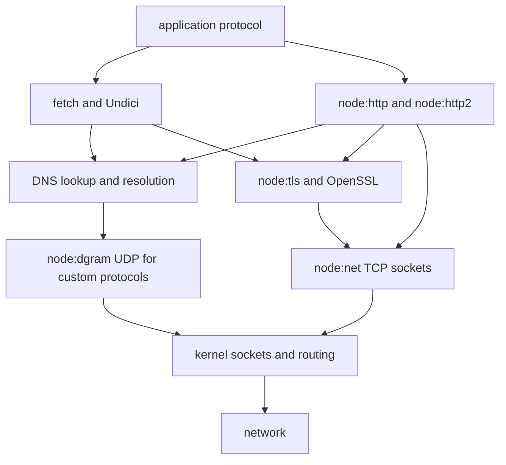

Purpose: Field manual for building, tuning, debugging, and operating Node.js networking systems across [Node.js V8 Runtime Engineering](/compendium/nodejs-v8-runtime-engineering/node-js-v8-runtime-engineering), raw sockets, UDP, DNS, HTTP, HTTP/2, TLS, Undici, and Fetch, with links forward to [12 Web Platform APIs in Node.js URL Blob Web Streams AbortController and Test Runner](/compendium/nodejs-v8-runtime-engineering/web-platform-apis-in-node-js-url-blob-web-streams-abortcontroller-and-test-runner) and boundary concerns in [13 Native Addons N-API WASM FFI and Embedding](/compendium/nodejs-v8-runtime-engineering/native-addons-n-api-wasm-ffi-and-embedding).

# Networking HTTP TLS DNS Sockets Undici and Fetch

Node.js networking is a set of layered interfaces over libuv, OpenSSL, the operating system resolver, c-ares DNS resolution, HTTP parsers, stream backpressure, and JavaScript cancellation. The runtime gives you a low-friction path from a single `fetch()` to a custom TCP server, but production systems fail at the seams: DNS lookup behavior, keep-alive pool limits, half-open sockets, TLS trust, HTTP timeout defaults, body buffering, backpressure, proxy handling, and shutdown.

Use this note as a network operations map. Reach for the highest-level API that preserves the control you need, then instrument the layer below it.

## Mental model



Node does not make network IO magically safe. It gives you nonblocking handles and event-driven APIs. You still own deadlines, cancellation, circuit breaking, body size limits, DNS policy, socket pool sizing, TLS trust, and graceful close.

## API selection

| Need | Prefer | Why | Watch |
|---|---|---|---|
| Ordinary outbound HTTP(S) | `fetch()` | Browser-compatible request model, AbortSignal support, powered by Undici in Node. | Pool tuning and proxy policy need dispatcher configuration. |
| High-control outbound HTTP/1.1 | `undici` package or `node:http` | Explicit dispatcher, agents, pipelining, raw headers, socket controls. | You own status/body handling and connection lifecycle. |
| HTTP server | `node:http` or framework built on it | Direct access to request and response streams. | Timeouts, body limits, slow clients, keep-alive shutdown. |
| HTTP/2 service or client | `node:http2` | Multiplexed sessions, streams, ALPN integration. | Session-level flow control and GOAWAY handling. |
| TCP protocol | `node:net` | Stream socket over TCP or IPC. | Framing, backpressure, half-open behavior, idle timeouts. |
| UDP protocol | `node:dgram` | Datagram socket for DNS-like, metrics, discovery, or game traffic. | Packet loss, message size, no delivery guarantee. |
| DNS operations | `node:dns/promises` | Explicit resolver methods and record types. | `lookup()` and `resolve*()` have different implementation paths. |
| TLS controls | `node:tls` and `node:https` | Certificates, SNI, ALPN, mTLS, session behavior. | Trust store, hostname verification, rotation, protocol selection. |

## DNS

Node exposes two different DNS families that look similar but behave differently.

| API | Backing behavior | Uses OS hosts and NSS policy | Uses libuv threadpool | Best for |
|---|---|---:|---:|---|
| `dns.lookup()` | OS `getaddrinfo` style lookup. | Yes | Yes | Matching platform behavior, honoring `/etc/hosts`, ordinary socket connection lookup. |
| `dns.resolve*()` | DNS query through Node resolver APIs. | No | No | Explicit DNS records, avoiding `getaddrinfo` threadpool pressure, service discovery. |
| `dns.Resolver` | Per-instance resolver configuration. | No for `resolve*()` methods | No for network query methods | Custom DNS servers, test isolation, split-horizon lookups. |
| Socket implicit lookup | Many network APIs call `dns.lookup()` unless a custom `lookup` is passed. | Yes | Yes | Convenience, not high-volume custom DNS policy. |

Production DNS guidance:

- Decide whether you need OS semantics or DNS wire queries. They are not substitutes.
- For high fan-out clients, measure `UV_THREADPOOL_SIZE` pressure before blaming the remote service.
- Cache carefully. DNS TTL, negative caching, failover, and load balancer behavior are operational policy, not just speed knobs.
- For dual-stack hosts, test IPv4, IPv6, and "happy eyeballs" behavior under partial failure.
- If you pre-resolve and connect by address, preserve the original hostname for TLS SNI and certificate verification.

Example: use a resolver when DNS policy is part of the component contract.

```js
import { Resolver } from 'node:dns/promises';

const resolver = new Resolver();
resolver.setServers(['1.1.1.1', '8.8.8.8']);

export async function resolveApiTargets(name) {
  const records = await resolver.resolve4(name, { ttl: true });
  return records
    .sort((a, b) => a.ttl - b.ttl)
    .map((record) => ({ address: record.address, ttl: record.ttl }));
}
```

Footguns:

| Symptom | Likely cause | Check |
|---|---|---|
| Random latency spikes before connect | `dns.lookup()` queued behind other threadpool work. | Compare `lookup` timing with `resolve4`; inspect threadpool users like fs, crypto, zlib. |
| Service ignores `/etc/hosts` in tests | Used `dns.resolve*()` instead of `lookup()`. | Replace with `lookup()` or inject resolver behavior. |
| TLS fails after pre-resolving address | Connection uses IP as server name. | Pass `servername` for TLS or keep URL hostname in higher-level client. |
| IPv6-only or IPv4-only incidents | Address family ordering assumption. | Log attempted addresses and failure families. |

## TCP sockets with node:net

`node:net` exposes `net.Server` and `net.Socket`. TCP is a byte stream, not a message stream. Your application protocol must define framing, max frame size, timeouts, and close semantics.

Core events and methods:

| Surface | Meaning | Production use |
|---|---|---|
| `net.createServer()` | Accepts TCP or IPC stream connections. | Custom protocols, local agents, sidecars. |
| `net.createConnection()` | Opens a client socket. | Protocol clients, health probes, tunnels. |
| `socket.write()` | Queues bytes and returns a backpressure signal. | Stop writing when it returns `false`; resume on `drain`. |
| `socket.setTimeout()` | Emits `timeout` after inactivity. | Destroy or close idle sockets explicitly. |
| `socket.end()` | Half-closes writable side after queued data. | Graceful protocol close. |
| `socket.destroy()` | Forcefully tears down socket. | Deadline, protocol violation, resource exhaustion. |
| `server.close()` | Stops accepting new connections. | Shutdown path; existing sockets still matter. |

Example: length-prefixed echo server with backpressure and idle timeout.

```js
import net from 'node:net';

const MAX_FRAME = 64 * 1024;

function handleSocket(socket) {
  let buffer = Buffer.alloc(0);
  socket.setTimeout(30_000);

  socket.on('data', (chunk) => {
    buffer = Buffer.concat([buffer, chunk]);

    while (buffer.length >= 4) {
      const size = buffer.readUInt32BE(0);
      if (size > MAX_FRAME) {
        socket.destroy(new Error('frame too large'));
        return;
      }
      if (buffer.length < 4 + size) break;

      const payload = buffer.subarray(4, 4 + size);
      buffer = buffer.subarray(4 + size);

      const ok = socket.write(Buffer.concat([Buffer.from([0, 0, 0, payload.length]), payload]));
      if (!ok) socket.pause();
    }
  });

  socket.on('drain', () => socket.resume());
  socket.on('timeout', () => socket.destroy(new Error('idle timeout')));
  socket.on('error', (error) => {
    console.error({ remote: socket.remoteAddress, error: error.code }, 'socket failed');
  });
}

const server = net.createServer(handleSocket);
server.listen(9000, '127.0.0.1');
```

Socket production checklist:

| Concern | Rule |
|---|---|
| Framing | Never parse TCP with "one data event equals one message". |
| Memory | Set max frame and max buffered bytes. |
| Backpressure | Treat `write()` returning `false` as a real signal. |
| Idle clients | Set inactivity deadlines and close. |
| Shutdown | Track accepted sockets so deploy shutdown can stop them. |
| Errors | Listen for `error` on every socket and server. |
| Half-open | Understand whether the protocol supports one-sided close. |

## UDP datagrams with node:dgram

UDP gives you datagrams, not streams. Messages can be lost, duplicated, reordered, truncated by path MTU, or blocked by middleboxes. Node's `node:dgram` is appropriate when the protocol already tolerates datagram behavior.

Use UDP for:

- Local discovery where loss is acceptable.
- Metrics firehose where approximate delivery is acceptable.
- DNS-like request/response protocols.
- Game or media protocols with explicit sequencing.

Avoid UDP for:

- Business commands that must be delivered once.
- Large payloads without fragmentation strategy.
- Protocols where NAT and firewall behavior are unknown.

Example: bounded UDP receiver.

```js
import dgram from 'node:dgram';

const socket = dgram.createSocket('udp4');
const MAX_PACKET = 1400;

socket.on('message', (message, remote) => {
  if (message.length > MAX_PACKET) {
    console.warn({ remote, length: message.length }, 'dropping oversized datagram');
    return;
  }

  const text = message.toString('utf8');
  console.log({ from: `${remote.address}:${remote.port}`, text });
});

socket.on('error', (error) => {
  console.error({ code: error.code }, 'udp socket failed');
  socket.close();
});

socket.bind(8125, '0.0.0.0');
```

## HTTP/1.1 servers

The `node:http` server presents request and response streams. Most production bugs are timeout and body-size bugs.

| Control | Why it matters |
|---|---|
| Header timeout | Protects against slow header attacks. |
| Request timeout | Prevents endless request body uploads. |
| Keep-alive timeout | Controls idle connection retention. |
| Max headers count and size | Limits parser memory pressure. |
| Body limit | Prevents unbounded buffering in application code. |
| Graceful shutdown | Stops accepts, drains active responses, closes idle keep-alive sockets. |

Example: strict JSON endpoint without framework assumptions.

```js
import http from 'node:http';

const MAX_BODY = 1_000_000;

async function readJson(req) {
  let size = 0;
  const chunks = [];

  for await (const chunk of req) {
    size += chunk.length;
    if (size > MAX_BODY) {
      const error = new Error('body too large');
      error.statusCode = 413;
      throw error;
    }
    chunks.push(chunk);
  }

  return JSON.parse(Buffer.concat(chunks).toString('utf8'));
}

const server = http.createServer(async (req, res) => {
  try {
    if (req.method !== 'POST' || req.url !== '/events') {
      res.writeHead(404).end();
      return;
    }

    const event = await readJson(req);
    res.writeHead(202, { 'content-type': 'application/json' });
    res.end(JSON.stringify({ accepted: true, type: event.type }));
  } catch (error) {
    res.writeHead(error.statusCode ?? 500, { 'content-type': 'application/json' });
    res.end(JSON.stringify({ error: error.message }));
  }
});

server.requestTimeout = 30_000;
server.headersTimeout = 10_000;
server.keepAliveTimeout = 5_000;
server.listen(8080);
```

HTTP footguns:

| Footgun | Consequence | Safer practice |
|---|---|---|
| Buffering every request body | Memory exhaustion under slow or large uploads. | Stream, cap, or hand off to storage. |
| Not consuming response bodies in clients | Connection reuse can stall or leak. | Consume, cancel, or destroy the body. |
| Missing `error` handlers | Process crash or silent connection loss. | Attach handlers to request, response, and server. |
| No timeout strategy | Hung sockets survive incidents. | Set connect, headers, body, idle, and total deadlines. |
| Assuming header case | HTTP headers are case-insensitive. | Normalize at boundaries. |

## HTTP clients and agents

HTTP connection reuse is a performance feature and a resource risk. Node's `http.Agent` manages connection pooling for `node:http`. Undici manages pooling through dispatchers such as `Agent`, `Pool`, and `Client`.

Agent tuning questions:

| Question | Why |
|---|---|
| How many origins can this service call? | Pool counts multiply by origin. |
| What is the maximum concurrent request count per origin? | Prevents local saturation and remote overload. |
| Are idle sockets closed on shutdown? | Prevents hanging deploys. |
| Is the remote load balancer idle timeout lower than ours? | Avoids reuse of stale sockets. |
| Are requests idempotent? | Determines retry safety after socket reset. |

Node `http.Agent` example:

```js
import { Agent, request } from 'node:https';

const agent = new Agent({
  keepAlive: true,
  maxSockets: 64,
  maxFreeSockets: 16,
  timeout: 30_000,
});

export function closeHttpClient() {
  agent.destroy();
}

export function postJson(url, body) {
  return new Promise((resolve, reject) => {
    const req = request(url, {
      method: 'POST',
      agent,
      headers: { 'content-type': 'application/json' },
    }, (res) => {
      const chunks = [];
      res.on('data', (chunk) => chunks.push(chunk));
      res.on('end', () => resolve({ statusCode: res.statusCode, body: Buffer.concat(chunks) }));
    });

    req.setTimeout(30_000, () => req.destroy(new Error('request timeout')));
    req.on('error', reject);
    req.end(JSON.stringify(body));
  });
}
```

## TLS

TLS in Node is built on OpenSSL. You normally use it through `https`, `fetch`, or reverse proxies, but direct `node:tls` matters for custom protocols, mTLS, ALPN, SNI, and certificate diagnostics.

TLS field guide:

| Topic | Production guidance |
|---|---|
| Trust | Do not disable certificate verification in production. Add the correct CA bundle or trust store. |
| Hostname | Preserve the logical hostname for SNI and certificate validation, even if connecting by IP. |
| mTLS | Separate client certificate rotation from server certificate rotation. Log certificate subject and issuer only where privacy policy permits. |
| ALPN | Use ALPN to negotiate HTTP/2 versus HTTP/1.1; test unsupported protocol behavior. |
| Session reuse | Useful for latency, but verify behavior behind load balancers. |
| Key logging | Useful for packet debugging, but secrets must be protected and short-lived. |

Example: TLS client with explicit CA and server name.

```js
import tls from 'node:tls';
import { readFile } from 'node:fs/promises';

export async function openTlsSocket({ host, address, port }) {
  const ca = await readFile('/etc/my-service/ca.pem');

  return tls.connect({
    host: address,
    port,
    ca,
    servername: host,
    ALPNProtocols: ['h2', 'http/1.1'],
    rejectUnauthorized: true,
  });
}
```

TLS troubleshooting:

| Error or symptom | Meaning to investigate |
|---|---|
| `UNABLE_TO_VERIFY_LEAF_SIGNATURE` | Missing intermediate or wrong CA bundle. |
| `ERR_TLS_CERT_ALTNAME_INVALID` | Hostname does not match certificate SAN. |
| Handshake timeout | Firewall, protocol mismatch, client auth requirement, or overloaded peer. |
| HTTP/2 not selected | ALPN not offered, proxy terminates TLS, or server lacks h2 support. |
| Works with `curl -k` only | Verification is broken; do not ship the Node equivalent. |

## HTTP/2

HTTP/2 multiplexes streams over a session. That shifts the failure model from "one request equals one TCP connection" to "many request streams share session-level flow control and lifecycle".

HTTP/2 production concepts:

| Concept | Operational meaning |
|---|---|
| Session | Shared connection state. Failure can affect many streams. |
| Stream | Per-request bidirectional channel. Must be closed or reset. |
| Flow control | Receiver controls how much data may be in flight. |
| GOAWAY | Peer is draining or closing a session. New streams should move elsewhere. |
| ALPN | TLS negotiation usually decides whether h2 is used. |

Example: small HTTP/2 server.

```js
import http2 from 'node:http2';

const server = http2.createServer();

server.on('stream', (stream, headers) => {
  if (headers[':path'] !== '/health') {
    stream.respond({ ':status': 404 });
    stream.end();
    return;
  }

  stream.respond({ ':status': 200, 'content-type': 'application/json' });
  stream.end(JSON.stringify({ ok: true }));
});

server.on('sessionError', (error) => {
  console.error({ code: error.code }, 'http2 session failed');
});

server.listen(8081);
```

## Fetch and Undici

Node's global `fetch()` is browser-compatible and no longer experimental in modern Node. In Node, it is powered by Undici. The official docs expose a custom dispatcher option; installing `undici` also lets you set a global dispatcher that affects both Undici and Node's fetch.

Fetch strengths:

- Simple outbound HTTP(S).
- Standards-shaped `Request`, `Response`, `Headers`, `FormData`, `Blob`, and Web Streams.
- `AbortSignal` cancellation.
- Dispatcher-based control when using Undici-compatible dispatchers.

Fetch differences that matter in services:

| Browser habit | Node service reality |
|---|---|
| Let the tab own lifecycle | A server process must close pools and abort work during shutdown. |
| Small user-triggered requests | Services can create thousands of concurrent calls and exhaust pools. |
| CORS dominates | Server-side fetch is not a browser security boundary. |
| Body size is user-interface bounded | Body size must be explicitly capped. |
| Proxy is environment-dependent | Proxy behavior should be configured and tested. |

Example: deadline and body cap around fetch.

```js
const MAX_BYTES = 2_000_000;

export async function fetchJson(url, { signal } = {}) {
  const timeout = AbortSignal.timeout(10_000);
  const combined = signal ? AbortSignal.any([signal, timeout]) : timeout;

  const response = await fetch(url, {
    headers: { accept: 'application/json' },
    signal: combined,
  });

  if (!response.ok) {
    await response.body?.cancel();
    throw new Error(`upstream returned ${response.status}`);
  }

  const reader = response.body.getReader();
  let bytes = 0;
  const chunks = [];

  while (true) {
    const { done, value } = await reader.read();
    if (done) break;
    bytes += value.byteLength;
    if (bytes > MAX_BYTES) {
      await reader.cancel('response too large');
      throw new Error('response too large');
    }
    chunks.push(value);
  }

  const text = new TextDecoder().decode(Buffer.concat(chunks));
  return JSON.parse(text);
}
```

Undici dispatcher guidance:

| Need | Dispatcher approach |
|---|---|
| Per-call routing | Pass a dispatcher in `fetch(url, { dispatcher })`. |
| Process-wide pool policy | Use `setGlobalDispatcher()` from the `undici` package. |
| Per-origin tuning | Use `Agent` or `Pool` with explicit connection and pipelining settings. |
| Tests | Inject a dispatcher or use mock agent facilities from Undici. |

## Deadlines, retries, and cancellation

Every network operation needs a deadline. A timeout is not only a client concern; servers also need timeouts for headers, body upload, idle keep-alive, downstream calls, graceful shutdown, and forced termination.

Timeout taxonomy:

| Timeout | Applies to | Failure handling |
|---|---|---|
| DNS lookup | Host resolution. | Retry only if resolver policy says transient. |
| Connect | TCP or TLS establishment. | Retry idempotent operations on another endpoint. |
| TLS handshake | Secure negotiation. | Treat certificate errors as configuration, not transient. |
| Headers | Waiting for response headers. | Circuit-break slow upstreams. |
| Body | Streaming response or upload. | Abort and classify as partial IO. |
| Idle | No traffic on established socket. | Close socket. |
| Total | End-to-end operation. | Abort all nested work. |

Retry checklist:

- Retry only idempotent operations by default.
- Add jittered backoff.
- Cap total elapsed time.
- Classify DNS, connect, TLS, HTTP status, and body errors separately.
- Preserve trace context and idempotency keys.
- Avoid retrying after partial request body write unless the protocol guarantees safety.

## Observability

Minimum network telemetry:

| Signal | Labels |
|---|---|
| Outbound request count | method, origin, route class, status class, error class. |
| Request duration | DNS, connect, TLS, headers, body if available. |
| Pool state | active sockets, idle sockets, queued requests, origin. |
| DNS result | family, resolver path, TTL if explicit. |
| Socket errors | code, local address family, remote address family. |
| TLS handshake | protocol, cipher, authorized flag, authorization error class. |
| Server traffic | active requests, active sockets, keep-alive sockets, rejected requests. |

Troubleshooting flow:

1. Establish the failing layer: DNS, TCP connect, TLS, HTTP headers, HTTP body, or application payload.
2. Capture error code and timeout type.
3. Compare a single request with concurrency.
4. Compare hostname connection with pre-resolved address.
5. Compare Node client with `curl` while preserving SNI, CA, proxy, and HTTP version.
6. Inspect pool limits and active handles.
7. Verify remote load balancer idle timeout against client keep-alive reuse.

## Security checklist

| Area | Check |
|---|---|
| TLS | Verification enabled; CA bundle managed; old protocols disabled by policy. |
| SSRF | Outbound URLs validated; private address ranges blocked after DNS resolution; redirects constrained. |
| Request body | Size caps, content type checks, streaming parser where needed. |
| Response body | Size caps and content type checks before parsing. |
| Headers | No trust in `x-forwarded-*` unless proxy boundary is known. |
| DNS rebinding | Resolve and connect policy prevents hostname swapping to private ranges. |
| Proxy | Proxy credentials protected; no accidental environment leakage. |
| Logs | No tokens, cookies, private keys, or full PII payloads. |

## Related notes

- [Node.js V8 Runtime Engineering](/compendium/nodejs-v8-runtime-engineering/node-js-v8-runtime-engineering)
- [12 Web Platform APIs in Node.js URL Blob Web Streams AbortController and Test Runner](/compendium/nodejs-v8-runtime-engineering/web-platform-apis-in-node-js-url-blob-web-streams-abortcontroller-and-test-runner)
- [13 Native Addons N-API WASM FFI and Embedding](/compendium/nodejs-v8-runtime-engineering/native-addons-n-api-wasm-ffi-and-embedding)
- [Software Engineering/05 Distributed Systems](/compendium/software-engineering/distributed-systems)
- [Software Engineering/08 Reliability Observability and Operations](/compendium/software-engineering/reliability-observability-and-operations)
- [Software Engineering/09 Security and Supply Chain](/compendium/software-engineering/security-and-supply-chain)

## Official reference anchors checked

- Node.js v26.3.0 `node:net`: https://nodejs.org/api/net.html
- Node.js v26.3.0 `node:dgram`: https://nodejs.org/api/dgram.html
- Node.js v26.3.0 `node:dns`: https://nodejs.org/api/dns.html
- Node.js v26.3.0 `node:http`: https://nodejs.org/api/http.html
- Node.js v26.3.0 `node:http2`: https://nodejs.org/api/http2.html
- Node.js v26.3.0 `node:tls`: https://nodejs.org/api/tls.html
- Node.js v26.3.0 global `fetch`: https://nodejs.org/api/globals.html#fetch
