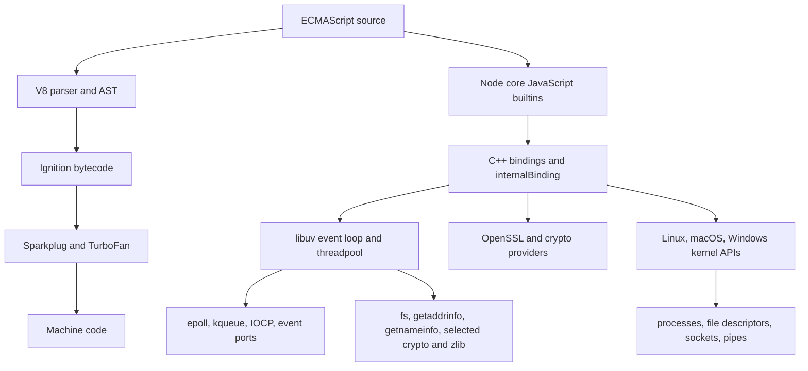

Purpose: Index the Node.js, V8, JavaScript runtime, and production backend engineering compendium as a dense map from language semantics to production incident response.

# Node.js V8 Runtime Engineering

This compendium is a field manual for engineers who need to reason about Node.js as a runtime system, not only as a web framework host. Node.js sits at the boundary between ECMAScript semantics, V8 execution, libuv evented IO, C++ bindings, OpenSSL, package managers, Linux process behavior, containers, and production observability. A correct mental model explains why a promise callback can starve timers, why a synchronous filesystem call can flatten HTTP tail latency, why `Buffer` memory can exceed `heapUsed`, why `npm ci` is not the same operational action as `npm install`, and why a worker thread is useful for CPU work but usually wasteful for normal network IO.

Official source anchors consulted during this build:

| Area | Current source family |
|---|---|
| Runtime APIs and flags | Node.js v26.3.0 API docs, especially CLI, process, permissions, modules, packages, worker_threads, stream, fs, http, tls, crypto, test, inspector, diagnostics_channel, perf_hooks, v8 |
| Release policy | Node.js official releases page, current as of 2026-06-15, including v26 Current and v24 and v22 LTS lines |
| Event loop and threadpool | libuv design, loop, filesystem, and threadpool docs |
| Engine internals | V8 docs and V8 blog material on Ignition, TurboFan, Sparkplug, elements kinds, fast properties, Orinoco, and code caching |
| Package manager behavior | npm docs for `npm ci`, package lock files, scripts, audit, and workspaces |
| Observability | OpenTelemetry JavaScript docs for SDK setup, context propagation, resources, traces, metrics, and logs |

## Reading Order

Start with [00 Node.js Runtime Mastery Roadmap](/compendium/nodejs-v8-runtime-engineering/node-js-runtime-mastery-roadmap), then read the runtime stack in order:

1. [01 Node.js Mental Model JavaScript Runtime V8 libuv and OS](/compendium/nodejs-v8-runtime-engineering/node-js-mental-model-javascript-runtime-v8-libuv-and-os)
2. [02 JavaScript Execution Model Call Stack Jobs Microtasks and Event Loop](/compendium/nodejs-v8-runtime-engineering/javascript-execution-model-call-stack-jobs-microtasks-and-event-loop)
3. [03 V8 Engine Internals Parsing Ignition TurboFan JIT and Deoptimization](/compendium/nodejs-v8-runtime-engineering/v8-engine-internals-parsing-ignition-turbofan-jit-and-deoptimization)
4. [04 V8 Memory Heap Garbage Collection Shapes and Performance](/compendium/nodejs-v8-runtime-engineering/v8-memory-heap-garbage-collection-shapes-and-performance)
5. [05 Node.js Core Architecture Bootstrapping Bindings and Native Boundaries](/compendium/nodejs-v8-runtime-engineering/node-js-core-architecture-bootstrapping-bindings-and-native-boundaries)
6. [06 Modules CommonJS ESM Resolution Package Exports and TypeScript Interop](/compendium/nodejs-v8-runtime-engineering/modules-commonjs-esm-resolution-package-exports-and-typescript-interop)
7. [07 npm pnpm yarn Packages Lockfiles Supply Chain and Monorepos](/compendium/nodejs-v8-runtime-engineering/npm-pnpm-yarn-packages-lockfiles-supply-chain-and-monorepos)
8. [08 Async Programming Promises Async Await Timers and Cancellation](/compendium/nodejs-v8-runtime-engineering/async-programming-promises-async-await-timers-and-cancellation)
9. [09 Streams Buffers Backpressure and Binary Data](/compendium/nodejs-v8-runtime-engineering/streams-buffers-backpressure-and-binary-data)
10. [10 Filesystem Processes Signals Workers Cluster and Child Processes](/compendium/nodejs-v8-runtime-engineering/filesystem-processes-signals-workers-cluster-and-child-processes)
11. [11 Networking HTTP TLS DNS Sockets Undici and Fetch](/compendium/nodejs-v8-runtime-engineering/networking-http-tls-dns-sockets-undici-and-fetch)
12. [12 Web Platform APIs in Node.js URL Blob Web Streams AbortController and Test Runner](/compendium/nodejs-v8-runtime-engineering/web-platform-apis-in-node-js-url-blob-web-streams-abortcontroller-and-test-runner)
13. [13 Native Addons N-API WASM FFI and Embedding](/compendium/nodejs-v8-runtime-engineering/native-addons-n-api-wasm-ffi-and-embedding)
14. [14 Observability Diagnostics Inspector Tracing Profiling and Core Dumps](/compendium/nodejs-v8-runtime-engineering/observability-diagnostics-inspector-tracing-profiling-and-core-dumps)
15. [15 Performance Engineering Benchmarking Flamegraphs GC and Event Loop Latency](/compendium/nodejs-v8-runtime-engineering/performance-engineering-benchmarking-flamegraphs-gc-and-event-loop-latency)
16. [16 Security Permissions Crypto Secrets Sandboxing and Dependency Risk](/compendium/nodejs-v8-runtime-engineering/security-permissions-crypto-secrets-sandboxing-and-dependency-risk)
17. [17 Production Operations Deployment Containers Scaling and Runbooks](/compendium/nodejs-v8-runtime-engineering/production-operations-deployment-containers-scaling-and-runbooks)
18. [18 Node.js Ecosystem Frameworks Tooling and Learning Projects](/compendium/nodejs-v8-runtime-engineering/node-js-ecosystem-frameworks-tooling-and-learning-projects)

## Runtime Stack Map

## Operating Assumptions

| Environment | Useful for | Misleading if treated as production |
|---|---|---|
| Local learning machine | REPL work, debugger, small profiling experiments, package manager exploration | CPU topology, container memory pressure, DNS path, TLS trust roots, cgroup limits, and noisy neighbor effects differ |
| Production Linux host | systemd behavior, file descriptor limits, kernel socket state, coredumps, perf, journal logs | Does not model orchestrator probes, pod eviction, sidecar latency, or service mesh policy by itself |
| Production container | Image build reproducibility, PID 1 behavior, signal delivery, cgroup memory and CPU limits | Shell tools, CA bundle, libc, `/tmp`, timezone data, and native addon compatibility may differ from a full host |
| Production cluster | Rolling deploys, readiness, DNS, load balancer behavior, horizontal scaling, SLO alerts | Individual process debugging is harder and must respect workload disruption, PII, and shared infrastructure |

## Cross-Cutting Failure Model

| Symptom | Primary layers to inspect | First evidence |
|---|---|---|
| High CPU | [03 V8 Engine Internals Parsing Ignition TurboFan JIT and Deoptimization](/compendium/nodejs-v8-runtime-engineering/v8-engine-internals-parsing-ignition-turbofan-jit-and-deoptimization), [15 Performance Engineering Benchmarking Flamegraphs GC and Event Loop Latency](/compendium/nodejs-v8-runtime-engineering/performance-engineering-benchmarking-flamegraphs-gc-and-event-loop-latency) | CPU profile, flamegraph, `process.resourceUsage()`, host CPU throttling |
| Rising RSS with stable `heapUsed` | [04 V8 Memory Heap Garbage Collection Shapes and Performance](/compendium/nodejs-v8-runtime-engineering/v8-memory-heap-garbage-collection-shapes-and-performance), [09 Streams Buffers Backpressure and Binary Data](/compendium/nodejs-v8-runtime-engineering/streams-buffers-backpressure-and-binary-data) | `process.memoryUsage()`, heap snapshot, external memory, buffer allocation paths |
| HTTP tail latency spike | [02 JavaScript Execution Model Call Stack Jobs Microtasks and Event Loop](/compendium/nodejs-v8-runtime-engineering/javascript-execution-model-call-stack-jobs-microtasks-and-event-loop), [11 Networking HTTP TLS DNS Sockets Undici and Fetch](/compendium/nodejs-v8-runtime-engineering/networking-http-tls-dns-sockets-undici-and-fetch) | event loop delay, socket pool metrics, request timeout histogram, GC trace |
| Missing trace context | [05 Node.js Core Architecture Bootstrapping Bindings and Native Boundaries](/compendium/nodejs-v8-runtime-engineering/node-js-core-architecture-bootstrapping-bindings-and-native-boundaries), [14 Observability Diagnostics Inspector Tracing Profiling and Core Dumps](/compendium/nodejs-v8-runtime-engineering/observability-diagnostics-inspector-tracing-profiling-and-core-dumps) | AsyncLocalStorage boundaries, OpenTelemetry context manager, instrumentation load order |
| Install drift in CI | [06 Modules CommonJS ESM Resolution Package Exports and TypeScript Interop](/compendium/nodejs-v8-runtime-engineering/modules-commonjs-esm-resolution-package-exports-and-typescript-interop), [07 npm pnpm yarn Packages Lockfiles Supply Chain and Monorepos](/compendium/nodejs-v8-runtime-engineering/npm-pnpm-yarn-packages-lockfiles-supply-chain-and-monorepos) | lockfile diff, package manager version, workspace graph, lifecycle scripts |
| Dependency compromise | [16 Security Permissions Crypto Secrets Sandboxing and Dependency Risk](/compendium/nodejs-v8-runtime-engineering/security-permissions-crypto-secrets-sandboxing-and-dependency-risk), [17 Production Operations Deployment Containers Scaling and Runbooks](/compendium/nodejs-v8-runtime-engineering/production-operations-deployment-containers-scaling-and-runbooks) | lockfile integrity, provenance, script execution, registry logs, SBOM diff |

## Mastery Outcomes

You should be able to:

- Explain the difference between JavaScript language semantics, V8 implementation behavior, Node core APIs, libuv platform abstraction, and OS facilities.
- Predict callback ordering across synchronous code, `process.nextTick`, microtasks, timers, poll callbacks, `setImmediate`, close callbacks, and promise reactions.
- Read V8 optimization behavior without cargo-culting hidden class tricks.
- Distinguish V8 heap growth from external memory, native memory, RSS, cgroup limits, and kernel OOM kills.
- Choose between callbacks, promises, EventEmitter, streams, worker threads, child processes, cluster, queues, and horizontal scaling based on failure domain and backpressure needs.
- Design packages that work across CommonJS, ESM, TypeScript, conditional exports, bundlers, and runtime execution.
- Operate Node.js services with profiling, diagnostic reports, event loop latency monitoring, RED and USE metrics, trace context, safe logging, and runbooks.
- Treat package installation, lockfiles, lifecycle scripts, native addons, permissions, crypto, TLS, secrets, and container privileges as production security surfaces.

## Related Vault Areas

- [Software Engineering](/compendium/software-engineering/software-engineering)
- [Linux Systems Engineering](/compendium/linux-systems-engineering/linux-systems-engineering)
- [Kubernetes](/compendium/kubernetes/kubernetes)
- Rust

## Strict Topic Ledger

This ledger preserves exact vocabulary that matters when searching the vault. The deeper explanations live in the numbered notes.

### Foundations Ledger

| Exact topic | Operational reading path |
|---|---|
| What Node.js is and is not | Start with [01 Node.js Mental Model JavaScript Runtime V8 libuv and OS](/compendium/nodejs-v8-runtime-engineering/node-js-mental-model-javascript-runtime-v8-libuv-and-os). Node.js is a server-side runtime and host environment, not the ECMAScript language, not a browser, and not a complete operating-system abstraction. |
| Node.js vs JavaScript vs ECMAScript vs V8 | JavaScript is the language family, ECMAScript is the standard, V8 is one implementation, and Node.js is the host runtime that exposes IO, process, crypto, networking, and module APIs. |
| V8 vs libuv vs Node core | V8 executes JavaScript, libuv abstracts evented IO and threadpool work, and Node core binds those pieces into stable JavaScript APIs. |
| Runtime vs language vs standard library | Runtime behavior includes process startup, event loops, native bindings, and host APIs; language behavior is syntax and semantics; standard library style APIs include Node core and Web Platform APIs in Node.js. |
| Multi-threaded runtime internals | JavaScript in one isolate is single-threaded, but the runtime uses a libuv threadpool, worker threads, native library threads, and kernel concurrency. |
| OS process model | A Node process has PID, argv, environment, working directory, file descriptors, signal handlers, memory mappings, and exit status. |
| Event-driven IO | Event-driven IO means readiness and completion notifications drive callbacks or promises instead of one thread blocking per operation. |
| Blocking calls in Node.js | Blocking calls in Node.js include synchronous core APIs, long JavaScript loops, expensive JSON, catastrophic regex, and native calls that do not yield. |
| Internal C++ layer | The Internal C++ layer owns many bindings between JavaScript APIs and V8, libuv, OpenSSL, zlib, uv handles, and platform code. |
| LTS vs Current | LTS vs Current is an operations choice: LTS optimizes stability and support windows, while Current exposes newer features sooner with higher churn risk. |
| N-API stability | N-API stability is the native addon compatibility contract that lets addons target a stable ABI across supported Node releases. |
| Node command line flags | Node command line flags control module loading, diagnostics, V8 options, permissions, snapshots, reports, warnings, tests, and profiling. |
| stdin stdout stderr | stdin stdout stderr are process file descriptors 0, 1, and 2; production services should treat stdout and stderr as log transport, not local files. |
| exit codes | exit codes communicate process termination status to shells, systemd, containers, supervisors, and orchestrators. |
| shebangs | shebangs such as `#!/usr/bin/env node` let executable scripts choose the Node interpreter through the host environment. |

### Execution Ledger

| Exact topic | Operational reading path |
|---|---|
| Execution contexts | Execution contexts hold lexical environment, variable environment, `this` binding, and evaluation state for code being run. |
| Scope chains | Scope chains determine how identifiers resolve through lexical environments and closures. |
| this binding | this binding depends on call form, class method usage, strict mode, arrow functions, and explicit bind, call, or apply. |
| macrotasks | macrotasks is a browser term; in Node.js prefer explicit event loop phases, timers, poll callbacks, check callbacks, close callbacks, microtasks, and `process.nextTick`. |
| event loop starvation | event loop starvation happens when synchronous CPU work, endless microtasks, or recursive nextTick callbacks prevent libuv phases from advancing. |
| nextTick starvation | nextTick starvation is caused by recursively scheduling `process.nextTick` faster than the runtime can reach promise microtasks, timers, or IO callbacks. |
| unhandled rejections | unhandled rejections are promise failures without a handler at the required time; production policy should make them observable and usually fatal. |
| uncaught exceptions | uncaught exceptions indicate the process is in an undefined application state; use them for last-resort logging and controlled exit. |
| cancellation with AbortController | cancellation with AbortController is cooperative and only works when each async boundary observes the `AbortSignal`. |
| structured concurrency limitations | structured concurrency limitations in Node.js mean tasks are not automatically tied to lexical lifetimes unless code explicitly scopes abort, cleanup, and joins. |

### V8 And Memory Ledger

| Exact topic | Operational reading path |
|---|---|
| V8 architecture | V8 architecture combines parser, bytecode, interpreter, baseline compiler, optimizing compiler, garbage collector, heap spaces, inline caches, and runtime builtins. |
| TurboFan optimizing compiler | TurboFan optimizing compiler specializes hot functions using speculative type feedback, then deoptimizes when assumptions fail. |
| property access optimization | property access optimization depends on stable object shapes, inline caches, prototype assumptions, and elements kinds. |
| function optimization | function optimization rewards stable call sites, predictable argument shapes, and warm code paths with representative inputs. |
| optimization killers | optimization killers include megamorphic call sites, unstable object layouts, arguments misuse, excessive try paths in hot code, and unpredictable types. |
| megamorphic call sites | megamorphic call sites see too many receiver shapes or targets for compact inline cache specialization. |
| polymorphism | polymorphism is normal when a call site sees a small bounded set of shapes. |
| monomorphism | monomorphism is the fastest common case where a call site consistently sees one shape or target. |
| code cache | code cache reduces parse and compile work for repeated source loads but does not replace profiling under the real workload. |
| profiler output | profiler output must be read with sample bias, JIT warmup, inlining, native frames, and source maps in mind. |
| when not to micro-optimize | when not to micro-optimize: before measuring, outside hot paths, when readability drops, when IO dominates, or when the change fights V8 heuristics. |
| stack vs heap | stack vs heap separates call frames and native stacks from heap-allocated JavaScript objects and external memory. |
| new space | new space is V8 young-generation allocation space for short-lived objects. |
| map space | map space stores V8 metadata for hidden classes and object layout descriptors. |
| Scavenger | Scavenger is the young-generation collector that copies live objects and promotes survivors. |
| Mark-Compact | Mark-Compact is an old-generation collector strategy that marks live objects and compacts memory to reduce fragmentation. |
| incremental marking | incremental marking breaks marking work into smaller slices to reduce long pauses. |
| concurrent marking | concurrent marking lets helper threads perform marking work while JavaScript continues. |
| remembered sets | remembered sets track old-to-new references so young-generation collection can find cross-generation pointers. |
| RSS vs heapUsed vs external | RSS vs heapUsed vs external distinguishes total resident process memory, V8 live heap, and native or ArrayBuffer backed memory. |
| allocation profiling | allocation profiling finds allocation sites, object churn, retaining paths, and high-rate temporary allocations. |
| GC throughput vs latency | GC throughput vs latency is the tradeoff between total application work completed and pause-sensitive responsiveness. |
| memory pressure in containers | memory pressure in containers includes cgroup limits, RSS, external memory, page cache behavior, and orchestrator OOM handling. |
| cgroup memory limits | cgroup memory limits constrain the process even when host memory is larger. |
| diagnosing Node.js memory leaks | diagnosing Node.js memory leaks means comparing heap, external, RSS, handles, snapshots, allocation profiles, and container limits over time. |

### Core And Modules Ledger

| Exact topic | Operational reading path |
|---|---|
| Node bootstrap process | Node bootstrap process initializes V8, creates an isolate and context, sets up the Node environment, loads internal modules, and starts user code. |
| libuv integration | libuv integration connects timers, pollers, handles, requests, signals, pipes, TCP, UDP, filesystem work, DNS helper work, and the event loop. |
| V8 context | V8 context is the global object and builtins environment in which JavaScript executes inside an isolate. |
| process.binding risks | process.binding risks include unsupported internals, version churn, security assumptions, and breakage across releases. |
| timers implementation | timers implementation layers JavaScript timer lists over libuv timers and runtime scheduling semantics. |
| async_wrap | async_wrap is the lower-level machinery behind async resource tracking used by async_hooks and context propagation. |
| inspector protocol | inspector protocol exposes debugging, CPU profiling, heap snapshots, coverage, and runtime control to DevTools-compatible clients. |
| worker thread architecture | worker thread architecture uses separate V8 isolates and event loops in one process with message passing and optional shared memory. |
| Atomics | Atomics provides synchronization primitives for SharedArrayBuffer based coordination across workers. |
| Node internal stability levels | Node internal stability levels communicate API maturity, experimental risk, deprecation, and support expectations. |
| public API vs internal API | public API vs internal API is a support boundary: public APIs are documented contracts, internals are implementation details. |
| module cache | module cache means CommonJS executes a module once per resolved filename and returns the cached exports object later. |
| default exports | default exports in ESM are one named binding called `default`; CJS interop can make this appear surprising. |
| named exports | named exports are live ESM bindings, while CJS named export detection is heuristic. |
| interop between CJS and ESM | interop between CJS and ESM is asymmetric, affects top-level await, default import shape, resolution, and loader timing. |
| package.json type field | package.json type field controls whether `.js` files are treated as CommonJS or ESM within a package scope. |
| main field | main field is the legacy package entry point when exports does not override package access. |
| imports field | imports field defines private package import specifiers such as `#config` for code inside the package. |
| subpath exports | subpath exports explicitly expose package entry points and hide everything else by default. |
| module resolution | module resolution maps specifiers to URLs or files through ESM rules, CJS rules, package scope, package exports, and node_modules lookup. |
| node_modules algorithm | node_modules algorithm walks parent directories looking for package folders unless package manager layout virtualizes access. |
| self-referencing packages | self-referencing packages import their own package name and route through package exports. |
| tsconfig module targets | tsconfig module targets decide generated module syntax and must align with runtime and bundler behavior. |
| transpilation pitfalls | transpilation pitfalls include mismatched ESM and CJS output, erased extension semantics, source map gaps, and hidden runtime loaders. |
| bundling vs runtime execution | bundling vs runtime execution changes resolution, side effects, dynamic imports, tree shaking, and environment assumptions. |
| tree shaking limitations | tree shaking limitations come from CJS shape, dynamic property access, side effects, and conservative bundler analysis. |
| import hooks | import hooks customize ESM loading, transformation, and resolution, but add startup cost and operational complexity. |
| peer dependencies | peer dependencies express host-provided compatibility expectations, not normal nested runtime dependencies. |
| optional dependencies | optional dependencies allow install-time or platform-specific failures without failing the whole install. |
| dependency hoisting | dependency hoisting changes physical package placement and can expose undeclared dependencies. |
| workspace monorepos | workspace monorepos need consistent lockfile control, package boundaries, build ordering, and publish discipline. |

### Async, Streams, Files, And Networking Ledger

| Exact topic | Operational reading path |
|---|---|
| callback style | callback style usually means error-first callbacks that receive `(err, value)` and must not be called twice. |
| error events | error events on EventEmitter instances can crash the process if emitted without a listener. |
| immediates | immediates scheduled with `setImmediate` run in the check phase after poll callbacks for that turn. |
| concurrency limiting | concurrency limiting caps active work so backpressure appears at the queue instead of memory, sockets, or threadpool saturation. |
| spawn vs exec | spawn vs exec separates streaming process IO from shell-buffered command execution. |
| message channels | message channels provide explicit ports for structured clone and transfer-list based worker communication. |
| CPU-bound work | CPU-bound work should move to worker threads, native code, external services, or separate processes when it harms event loop latency. |
| IO-bound work | IO-bound work benefits from async APIs, backpressure, pooling, and timeouts more than extra JavaScript threads. |
| DNS threadpool behavior | DNS threadpool behavior differs between `dns.lookup`, which can use `getaddrinfo` and the threadpool, and resolver APIs that issue DNS queries. |
| fs threadpool behavior | fs threadpool behavior means async filesystem APIs may consume libuv worker threads, so high concurrency can delay unrelated threadpool tasks. |
| crypto threadpool behavior | crypto threadpool behavior matters for expensive PBKDF2, scrypt, random generation, and other async crypto work that uses worker threads. |
| backpressure between async tasks | backpressure between async tasks needs bounded queues, abort propagation, and refusal policy. |
| common async race conditions | common async race conditions include double completion, stale writes, lost aborts, unjoined tasks, and shared mutable state across awaits. |
| zero-copy behavior | zero-copy behavior avoids copying bytes but can extend memory lifetimes and expose mutation hazards. |
| finished | finished observes stream completion or failure and is useful for cleanup and leak prevention. |
| async iterators over streams | async iterators over streams give pull-shaped consumption with `for await`, but errors and aborts still require care. |
| Node streams vs Web Streams | Node streams vs Web Streams differs in backpressure APIs, object mode, cancellation, adapters, and ecosystem support. |
| compression streams | compression streams can save bandwidth but consume CPU, memory, and sometimes libuv threadpool capacity. |
| file streams | file streams should respect errors, close semantics, highWaterMark, and filesystem backpressure. |
| network streams | network streams add peer resets, half-open sockets, TLS shutdown, and proxy timeouts to normal stream concerns. |
| HTTP streams | HTTP streams require body consumption, abort handling, header timing, backpressure, and timeout policy. |
| stream leaks | stream leaks happen when streams are neither consumed, destroyed, closed, nor awaited. |
| buffering hazards | buffering hazards include unbounded body reads, string concatenation for binary data, and proxying without backpressure. |
| large file processing | large file processing should stream, chunk, checkpoint, and avoid whole-file buffering. |
| upload and download streaming | upload and download streaming requires pipeline, timeout, abort, size limits, and error cleanup. |
| fs sync vs async APIs | fs sync vs async APIs is a latency boundary: sync APIs block the JavaScript thread and async APIs can use the libuv threadpool. |
| open flags | open flags define read, write, create, truncate, append, exclusive, and sync semantics at the OS boundary. |
| lstat | lstat reads metadata about a symlink itself instead of its target. |
| realpath | realpath resolves symlinks and produces canonical filesystem paths, with security implications for path traversal checks. |
| path module | path module is string manipulation for paths, not filesystem authorization. |
| glob behavior | glob behavior depends on shell, Node API, package implementation, dotfiles, symlinks, and platform path rules. |
| fsync | fsync asks the OS to flush file data or metadata to stable storage and is relevant for durable atomic writes. |
| watch vs watchFile | watch vs watchFile trades native event delivery against polling behavior and cross-platform consistency. |
| beforeExit | beforeExit fires when the event loop has no more work and can schedule more work. |
| exit event | exit event is synchronous-only and runs when the process is exiting. |
| child_process spawn | child_process spawn starts a process with streaming stdio and no shell by default. |
| shell injection risk | shell injection risk appears when untrusted input is interpolated into a command string or shell arguments. |
| stdio inheritance | stdio inheritance connects child descriptors to parent streams or files and affects logging and signal expectations. |
| detached processes | detached processes can outlive parents when process groups and stdio are configured correctly. |
| worker process supervision | worker process supervision restarts failed workers with limits, backoff, health checks, and crash evidence. |
| net module | net module exposes TCP servers and sockets and requires explicit timeout, backpressure, and error handling. |
| UDP sockets | UDP sockets are message-oriented, connectionless, lossy, and require application-level retry or ordering if needed. |
| DNS module | DNS module exposes lookup and resolver APIs with different OS and network behavior. |
| lookup vs resolve | lookup vs resolve separates OS name service lookup from DNS resolver queries. |
| request body streaming | request body streaming avoids buffering inbound bodies and must enforce size, timeout, and abort policy. |
| response streaming | response streaming must handle backpressure, client disconnects, compression, and finalization. |
| backpressure over network | backpressure over network appears as socket write return values, stream drain events, buffering, and peer receive limits. |
| socket exhaustion | socket exhaustion comes from leaks, too much concurrency, missing keep-alive policy, TIME_WAIT buildup, and file descriptor limits. |
| ephemeral ports | ephemeral ports can be exhausted by excessive outbound connection churn. |
| ETIMEDOUT | ETIMEDOUT indicates a timeout at connect, socket, request, or application policy boundaries. |
| DNS latency | DNS latency affects connection setup and can hide behind HTTP client timing unless measured separately. |
| slowloris style issues | slowloris style issues exploit slow headers or bodies to hold sockets and memory. |
| load balancer interactions | load balancer interactions include idle timeouts, health checks, protocol upgrades, TLS termination, and connection reuse. |

### Web, Native, Observability, Performance, Security, Operations, And Ecosystem Ledger

| Exact topic | Operational reading path |
|---|---|
| structuredClone | structuredClone copies supported graph-shaped data and is used across workers and Web-like APIs. |
| assertions | assertions in the Node test runner should verify behavior and failure modes, not implementation trivia. |
| timers in tests | timers in tests need deterministic control, cleanup, and awareness of microtasks and immediates. |
| compatibility tradeoffs between browser and Node.js | compatibility tradeoffs between browser and Node.js include globals, URL behavior, streams, crypto, filesystem absence, and security model. |
| when Web APIs are preferable | when Web APIs are preferable: portable libraries, Fetch, URL, Blob, Web Streams integration, and browser-compatible abstractions. |
| when Node-specific APIs are preferable | when Node-specific APIs are preferable: filesystem, process, sockets, diagnostics, performance hooks, workers, native addons, and operational control. |
| Rust native addons | Rust native addons commonly use napi-rs, Neon, or manual N-API bindings for safer native implementation with JS boundary obligations. |
| Neon overview | Neon overview: Rust bindings for writing native Node addons with Rust ergonomics and Node integration constraints. |
| napi-rs overview | napi-rs overview: Rust tooling around Node-API for building ABI-stable native addons. |
| FFI tradeoffs | FFI tradeoffs include call overhead, ABI risk, memory ownership, crashes, deployment artifacts, and observability gaps. |
| WASM in Node.js | WASM in Node.js is useful for portable compute kernels but still crosses a boundary and needs memory and startup analysis. |
| embedding V8 | embedding V8 means hosting the engine directly and owning isolates, contexts, handles, platform integration, and security policy. |
| embedding Node.js | embedding Node.js means hosting Node itself and accepting its event loop, environment, module loader, and lifecycle constraints. |
| crossing JS/native boundary | crossing JS/native boundary requires explicit ownership, error mapping, callback lifetime control, and thread-safety discipline. |
| callback lifetimes | callback lifetimes must not outlive their environment or be invoked from unsafe native threads. |
| async native work | async native work should use supported N-API async patterns, cancellation policy, and correct event loop handoff. |
| platform compatibility | platform compatibility covers OS, CPU architecture, libc, Node ABI, package manager install mode, and prebuild availability. |
| when native addons are the wrong tool | when native addons are the wrong tool: IO-bound code, unstable requirements, low operational maturity, or when WASM or a service boundary is safer. |
| pino style logging | pino style logging means structured, low-overhead JSON logs with redaction and transport separation. |
| allocation profiles | allocation profiles show where objects are allocated and can reveal churn before heap snapshots show leaks. |
| PerformanceObserver | PerformanceObserver consumes performance entries such as measures, resource timings, and custom marks. |
| llnode overview | llnode overview: a native postmortem debugger extension for inspecting Node heap and objects in core dumps. |
| clinic.js overview | clinic.js overview: a tooling suite for CPU, event loop, and async bottleneck diagnosis in Node services. |
| 0x overview | 0x overview: a flamegraph-oriented Node profiler workflow for CPU investigations. |
| Linux perf with Node.js | Linux perf with Node.js can sample native and JIT frames when symbols and perf maps are configured. |
| RED metrics | RED metrics track request rate, errors, and duration for services. |
| logs vs metrics vs traces | logs vs metrics vs traces separates event records, numerical time series, and request causality graphs. |
| cardinality control | cardinality control prevents metrics and traces from exploding due to user IDs, paths, stack traces, or unbounded labels. |
| sensitive data in telemetry | sensitive data in telemetry must be redacted before logs, spans, metrics, profiles, reports, or dumps leave the trust boundary. |
| production profiling safety | production profiling safety means limiting duration, sampling, access, storage, PII exposure, and process impact. |
| benchmarking discipline | benchmarking discipline means fixed workload, warmup, variance control, baseline comparison, and production-relevant metrics. |
| wrk | wrk is an HTTP load generator useful for controlled throughput and latency experiments. |
| tinybench | tinybench is a JavaScript microbenchmark harness for focused local measurements. |
| Benchmark.js | Benchmark.js is a mature microbenchmark library, useful only when benchmark design avoids misleading JIT artifacts. |
| JIT effects | JIT effects include warmup, tiering, inline cache feedback, optimization, and deoptimization during measurement. |
| GC effects | GC effects include allocation rate, promotion, pause distribution, heap limits, and memory pressure. |
| hidden class stability | hidden class stability helps V8 keep property access optimized. |
| JSON parse and stringify costs | JSON parse and stringify costs can dominate CPU and allocation for API services. |
| crypto cost | crypto cost includes CPU, threadpool, entropy, parameter selection, and hardware acceleration. |
| regex performance | regex performance can range from linear to catastrophic depending on pattern and input. |
| catastrophic backtracking | catastrophic backtracking is a ReDoS vector and performance incident source. |
| sync API footguns | sync API footguns block the event loop and distort tail latency under concurrent load. |
| worker thread tradeoffs | worker thread tradeoffs include isolate cost, data transfer, shared memory risk, pool sizing, and crash containment. |
| cluster tradeoffs | cluster tradeoffs include process isolation and multi-core use against sticky sessions, duplicated memory, and orchestration overlap. |
| load shedding | load shedding rejects or degrades work intentionally to protect latency, dependencies, and recovery. |
| diagnosing high CPU | diagnosing high CPU starts with CPU profiles, flamegraphs, event loop utilization, GC logs, and deployment diff. |
| diagnosing high memory | diagnosing high memory compares RSS, heap, external memory, handles, native addons, and cgroup pressure. |
| diagnosing event loop lag | diagnosing event loop lag uses monitorEventLoopDelay, CPU profiles, sync API audits, GC traces, and workload timing. |
| diagnosing slow HTTP endpoints | diagnosing slow HTTP endpoints correlates route latency, downstream calls, socket pools, body streaming, event loop delay, and errors. |
| diagnosing GC pauses | diagnosing GC pauses uses trace-gc, heap profiles, allocation rate, promotion, old space pressure, and container limits. |
| diagnosing threadpool saturation | diagnosing threadpool saturation inspects fs, DNS lookup, crypto, zlib, UV_THREADPOOL_SIZE, and queued latency. |
| Node.js threat model | Node.js threat model includes untrusted input, package execution, native code, filesystem access, network egress, secrets, and process privileges. |
| deserialization risks | deserialization risks include code execution, prototype pollution, resource exhaustion, and trust-boundary confusion. |
| ReDoS | ReDoS uses regex worst cases to consume CPU and block the event loop. |
| timing attacks | timing attacks exploit observable time differences in comparisons, crypto, auth, or network behavior. |
| crypto misuse | crypto misuse includes weak randomness, unauthenticated encryption, wrong KDFs, bad IVs, and disabled certificate validation. |
| secrets in environment variables | secrets in environment variables are easy to inject but can leak through process dumps, logs, child processes, and misconfigured platforms. |
| secret rotation | secret rotation requires dual-read or staged deploy support, revocation, audit, and rollback planning. |
| TLS configuration | TLS configuration includes protocol versions, ciphers, certificate chains, SNI, ALPN, trust roots, and mTLS policy. |
| malicious packages | malicious packages exploit install scripts, typos, dependency confusion, maintainer compromise, and obfuscated code. |
| npm lifecycle scripts | npm lifecycle scripts execute package-defined commands during install or publish and are a supply-chain execution surface. |
| npm audit limitations | npm audit limitations include reachability ambiguity, noisy advisories, dev dependency context, and missing malicious behavior detection. |
| package provenance | package provenance links published packages to source and build identity when supported by registry and CI. |
| SLSA overview | SLSA overview: a supply-chain framework for build integrity, provenance, and tamper resistance. |
| running as non-root | running as non-root limits container and host damage after process compromise. |
| container hardening | container hardening includes non-root users, read-only filesystems, minimal images, dropped capabilities, seccomp, and secret isolation. |
| Node permission model status | Node permission model status must be checked against current docs because flags and stability can change across release lines. |
| policy mechanism | policy mechanism can constrain module loading and integrity but is not a complete sandbox. |
| experimental features risk | experimental features risk includes flag changes, behavior changes, and support gaps. |
| sandboxing limitations | sandboxing limitations matter because `vm`, permissions, and policies do not turn arbitrary code into fully safe code. |
| vm module limitations | vm module limitations include shared process risk, escape history, resource exhaustion, and native capability exposure. |
| SES overview | SES overview: Secure ECMAScript hardening patterns that can reduce authority for JavaScript compartments when adopted carefully. |
| supply chain response | supply chain response includes freeze installs, diff lockfiles, identify exposure, rotate secrets, patch, rebuild, redeploy, and preserve evidence. |
| CVE response | CVE response requires applicability triage, exploitability review, patch testing, rollout, and audit trail. |
| process managers | process managers supervise process lifecycle, restart policy, logs, environment, and signals outside orchestrators. |
| systemd services | systemd services define user, environment, restart behavior, resource limits, logging, watchdogs, and dependencies on Linux hosts. |
| Docker images | Docker images package runtime, application, dependencies, CA certificates, user, and entrypoint behavior. |
| distroless images | distroless images reduce shell and package manager surface but complicate live debugging. |
| Alpine vs glibc tradeoffs | Alpine vs glibc tradeoffs include image size, musl compatibility, native addon builds, DNS behavior, and performance edge cases. |
| signals in containers | signals in containers depend on PID 1 behavior, entrypoint form, init process, and orchestrator termination grace period. |
| startup probes | startup probes protect slow-starting services from premature liveness restarts. |
| zero downtime deploys | zero downtime deploys require readiness, drain, backward-compatible contracts, capacity headroom, and rollback paths. |
| blue-green deploys | blue-green deploys shift traffic between two complete environments to reduce rollback time. |
| logging in containers | logging in containers should write structured logs to stdout and stderr and let the platform collect them. |
| memory limits | memory limits interact with V8 heap, external memory, RSS, cgroups, and OOM killer behavior. |
| event loop delay alerts | event loop delay alerts detect CPU blocking, GC pauses, sync API abuse, and overload before request failures spike. |
| heap alerts | heap alerts track old space pressure, allocation growth, leak slope, and GC behavior. |
| error rate alerts | error rate alerts should be scoped by service, route, dependency, and status class. |
| latency SLOs | latency SLOs define user-visible duration targets and error budgets. |
| deployment rollback | deployment rollback should be rehearsed and compatible with schema, cache, queue, and package changes. |
| high CPU incidents | high CPU incidents need profile capture, deploy correlation, traffic shape, GC review, and load shedding decision points. |
| memory leak incidents | memory leak incidents need RSS and heap trend, snapshots, allocation profiles, cgroup data, and restart risk assessment. |
| event loop lag incidents | event loop lag incidents need monitorEventLoopDelay data, CPU profile, sync code audit, GC logs, and dependency timing. |
| DNS incidents | DNS incidents require resolver path checks, cache behavior, CoreDNS or upstream health, search domains, and client timeout review. |
| TLS incidents | TLS incidents require certificate chain, trust roots, SNI, ALPN, mTLS identity, clock, and proxy inspection. |
| dependency compromise incidents | dependency compromise incidents require lockfile freeze, package diff, secret rotation, build provenance review, and redeploy. |
| incident data collection | incident data collection must capture logs, metrics, traces, profiles, reports, versions, config, and deploy metadata without leaking secrets. |
| post-incident review | post-incident review should produce concrete fixes to detection, prevention, response, and recovery. |
| Koa overview | Koa overview: a minimal middleware framework with async middleware composition. |
| Hono overview | Hono overview: a small web framework targeting multiple runtimes with Web API style primitives. |
| Prisma overview | Prisma overview: a TypeScript ORM and schema tool with generated client, migration workflow, and pooling considerations. |
| TypeORM overview | TypeORM overview: a decorator and entity oriented ORM with runtime metadata and migration concerns. |
| database pooling | database pooling constrains concurrent DB connections and protects databases from Node concurrency spikes. |
| Redis clients | Redis clients need reconnect, timeout, command queue, cluster, TLS, and backpressure policy. |
| message queues | message queues decouple producers and consumers but require idempotency, retries, dead letters, and visibility into lag. |
| BullMQ overview | BullMQ overview: a Redis-backed job queue for Node.js with retries, delayed jobs, and worker process concerns. |
| Kafka clients | Kafka clients require partitioning, consumer groups, offset management, idempotency, and backpressure. |
| GraphQL servers | GraphQL servers need resolver batching, depth limits, auth boundaries, caching, and observability. |
| tRPC overview | tRPC overview: TypeScript-first RPC that couples client and server types and needs explicit runtime validation strategy. |
| Next.js server runtime boundaries | Next.js server runtime boundaries separate Node runtime, edge runtime, server components, route handlers, and deployment platform behavior. |
| webpack | webpack is a mature bundler with rich plugin behavior and higher configuration surface than newer tools. |
| nodemon | nodemon restarts local development processes on file changes and should not be a production supervisor. |
| project templates | project templates should encode runtime version, package manager, lint, test, Docker, telemetry, security, and release defaults. |
