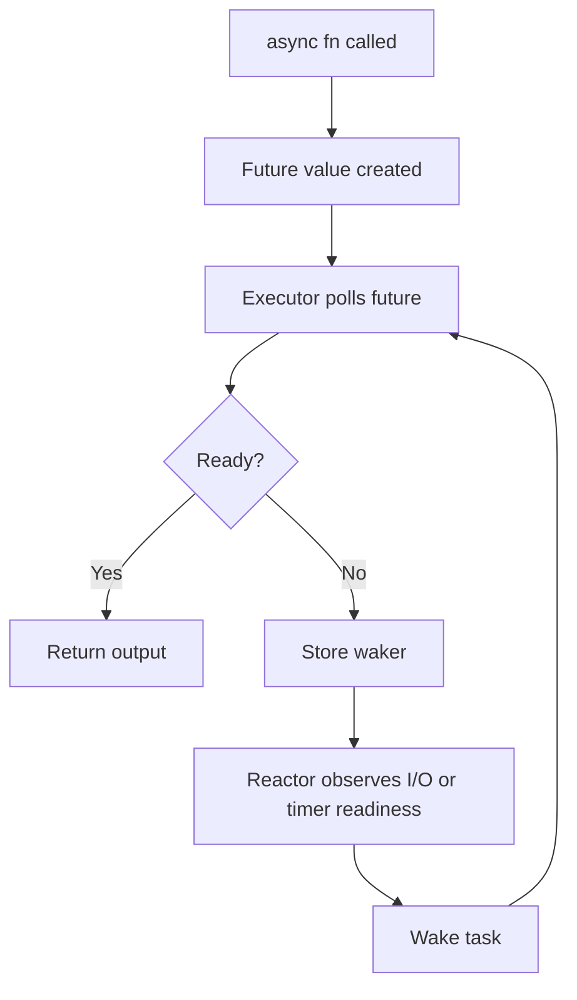
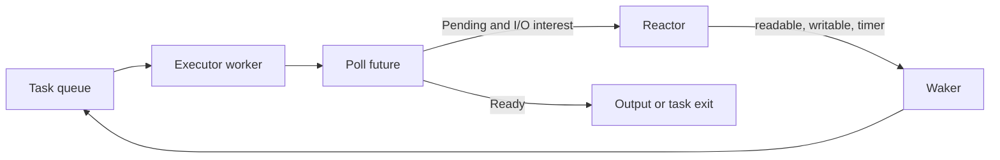

Purpose: explain async Rust as a cooperative state-machine model, then connect futures, wakers, pinning, runtimes, Tokio, streams, cancellation, backpressure, web stacks, and production review practices.

# Async Rust, Futures, Tokio, and Runtimes

Related notes: [07 Concurrency Parallelism and Synchronization](/compendium/rust/concurrency-parallelism-and-synchronization), [02 Ownership Borrowing and Lifetimes](/compendium/rust/ownership-borrowing-and-lifetimes), [03 Types Traits and Generics](/compendium/rust/types-traits-and-generics), [04 Error Handling and API Design](/compendium/rust/error-handling-and-api-design), [13 Systems Programming Networking and IO](/compendium/rust/systems-programming-networking-and-io), [06 Memory Layout Performance and Zero Cost Abstractions](/compendium/rust/memory-layout-performance-and-zero-cost-abstractions), [11 Testing Verification Benchmarking and Tooling](/compendium/rust/testing-verification-benchmarking-and-tooling).

## Async Rust model

Async Rust is concurrency without requiring one OS thread per operation. An async task runs until it cannot make progress, returns `Poll::Pending`, registers a `Waker`, and later gets polled again by an executor.

Async does not make CPU work faster. It improves scalability when many tasks wait on I/O, timers, or other readiness events. CPU-bound parallelism belongs in Rayon, a blocking pool, or dedicated threads. See [07 Concurrency Parallelism and Synchronization](/compendium/rust/concurrency-parallelism-and-synchronization).



## Futures and Poll

The `Future` trait is small. Its power comes from the contract around `poll`.

```rust
use std::future::Future;
use std::pin::Pin;
use std::task::{Context, Poll};

pub trait FutureShape {
    type Output;

    fn poll(self: Pin<&mut Self>, cx: &mut Context<'_>) -> Poll<Self::Output>;
}
```

Actual `std::future::Future` has the same shape. `Poll::Ready(value)` means the future completed and should not be polled again unless its specific type documents fused behavior. `Poll::Pending` means the future cannot complete now and must arrange for the current task's waker to be called when progress might be possible.

Minimal custom future:

```rust
use std::future::Future;
use std::pin::Pin;
use std::task::{Context, Poll};
use std::time::{Duration, Instant};

struct DelayUntil {
    deadline: Instant,
}

impl Future for DelayUntil {
    type Output = ();

    fn poll(self: Pin<&mut Self>, cx: &mut Context<'_>) -> Poll<()> {
        if Instant::now() >= self.deadline {
            Poll::Ready(())
        } else {
            cx.waker().wake_by_ref();
            Poll::Pending
        }
    }
}

fn delay_for(duration: Duration) -> DelayUntil {
    DelayUntil {
        deadline: Instant::now() + duration,
    }
}
```

This future is intentionally inefficient because it wakes immediately and can spin. Real timers register with a reactor or timer wheel, then wake only when the deadline is reached.

## Waker contract

A `Waker` tells the executor that a task should be polled again. Waking is not completion. Waking means "something may have changed."

Rules:

| Rule | Why it matters |
|---|---|
| Store or replace the latest waker before returning `Pending` | The task may move between executors or wake handles |
| Wake after state changes that may make progress possible | Otherwise the task can sleep forever |
| Avoid waking in tight loops without external readiness | Causes busy polling |
| Treat wakeups as edge or hint, not proof | The next poll must re-check state |

## async and await desugaring

An `async fn` returns an anonymous future. Its body does not run when called. It starts running when the future is polled.

```rust
async fn fetch_user(id: u64) -> String {
    format!("user-{id}")
}

fn make_future() -> impl std::future::Future<Output = String> {
    fetch_user(42)
}
```

Conceptually, the compiler rewrites an async function into a state machine. Local variables that live across `.await` points become fields in that state machine.

```rust
async fn two_steps() -> usize {
    let a = read_a().await;
    let b = read_b().await;
    a + b
}

async fn read_a() -> usize {
    1
}

async fn read_b() -> usize {
    2
}
```

Conceptual states:

| State | Stored data | Next action |
|---|---|---|
| Start | none | Poll `read_a` |
| WaitingA | future for `read_a` | If ready, store `a`, poll `read_b` |
| WaitingB | `a`, future for `read_b` | If ready, return `a + b` |
| Done | output consumed | Must not be polled again |

`.await` is a potential suspension point. If the awaited future returns `Poll::Ready` immediately, the task does not need to yield. If it returns `Poll::Pending`, other work can run before the task is polled again. Any lock guard, borrow, or large temporary live across `.await` becomes part of the future's stored state.

## Pin and Unpin

`Pin&lt;P&gt;` prevents moving a value through a pinned pointer. Async needs this because compiler-generated futures may contain self-references: one field can refer to another field across an await point.

`Unpin` means a type is safe to move after being pinned. Most ordinary types are `Unpin`. Many async futures are not guaranteed to be `Unpin`.

```rust
use std::future::Future;
use std::pin::Pin;

fn boxed_future() -> Pin<Box<dyn Future<Output = usize> + Send>> {
    Box::pin(async {
        let value = 41;
        value + 1
    })
}
```

Practical rules:

| Situation | Guidance |
|---|---|
| Writing normal async functions | Let the compiler handle pinning |
| Storing heterogeneous futures | Use `Pin&lt;Box&lt;dyn Future&lt;Output = T&gt; + Send&gt;&gt;` |
| Implementing `Future` manually | Understand pin projection and avoid moving pinned fields |
| Using `tokio::select!` with reused futures | Pin the future before selecting repeatedly |
| Needing self-referential structs | Avoid if possible; use generators, owned buffers, or proven crates |

Manual future implementations are rare in application code. Libraries that implement futures directly usually use `pin-project` or equivalent patterns to safely project pinned fields.

## Executors and reactors

An executor owns task scheduling. It polls futures. A reactor owns readiness notifications for I/O, timers, and OS events. Many runtimes package both.



The executor must not block on ordinary synchronous I/O. Blocking a worker prevents it from polling other tasks.

## Tokio

Tokio is the dominant async runtime for production Rust services. It provides a multithreaded work-stealing executor, current-thread runtime option, I/O driver, timer driver, async TCP and UDP, process support, signal handling, synchronization primitives, task utilities, and channels.

Basic Tokio program:

```rust
#[tokio::main]
async fn main() -> anyhow::Result<()> {
    let body = fetch_body("https://example.com").await?;
    println!("{} bytes", body.len());
    Ok(())
}

async fn fetch_body(url: &str) -> anyhow::Result<String> {
    let text = reqwest::get(url).await?.text().await?;
    Ok(text)
}
```

### Tokio runtime flavors

| Flavor | Use when | Notes |
|---|---|---|
| Multithreaded runtime | Server workloads, many tasks, mixed I/O | Default for `#[tokio::main]` with `rt-multi-thread` |
| Current-thread runtime | Tests, embedded loops, deterministic single-thread behavior | Tasks share one OS thread and must yield |
| Local task set | Need `!Send` futures on one thread | Use `LocalSet` and `spawn_local` |
| Blocking pool | Need to run blocking file, CPU, or legacy code | Use `spawn_blocking`, not ordinary task workers |

### Tasks

`tokio::spawn` schedules an async task. The future must be `Send + 'static` on the multithreaded runtime because it can move between worker threads.

```rust
use tokio::task::JoinHandle;

async fn spawn_workers(ids: Vec<u64>) -> anyhow::Result<Vec<String>> {
    let mut handles: Vec<JoinHandle<anyhow::Result<String>>> = Vec::new();

    for id in ids {
        handles.push(tokio::spawn(async move {
            let user = load_user(id).await?;
            Ok(user)
        }));
    }

    let mut users = Vec::new();
    for handle in handles {
        users.push(handle.await??);
    }

    Ok(users)
}

async fn load_user(id: u64) -> anyhow::Result<String> {
    Ok(format!("user-{id}"))
}
```

Dropping a `JoinHandle` detaches the task. It does not necessarily cancel it. Use `abort`, cancellation tokens, scoped task utilities, or explicit channel shutdown when ownership matters.

## Runtime Alternatives and Compatibility

The [`async-std`](https://github.com/async-rs/async-std) maintainers discontinued the project in 2025 and recommend that users migrate to `smol`. Treat `async-std` as a legacy compatibility surface, not a runtime for new projects. Existing applications should inventory runtime-specific I/O and task APIs, then test shutdown, timers, and compatibility adapters during migration.

| Runtime | Strength | Concern |
|---|---|---|
| Tokio | Largest ecosystem, Hyper, Tonic, Axum, Tower, strong production usage | Feature flags and runtime context must be managed carefully |
| async-std | Legacy compatibility for existing applications | Discontinued; maintainers recommend migration to smol |
| smol | Small runtime composed from focused async crates | More manual assembly and compatibility adapters for Tokio-bound libraries |
| no runtime in library | Maximizes compatibility | Caller must provide runtime-specific integration |

Library guidance: avoid requiring a concrete runtime unless the library depends on runtime-specific I/O, timers, or task spawning. Prefer trait-based I/O or feature-gated adapters.

## Runtime-neutral library boundaries

Async functions are not automatically runtime-specific. Runtime-specific types are.

```rust
use futures::io::{AsyncRead, AsyncReadExt};

pub async fn read_prefix<R>(mut reader: R) -> std::io::Result<Vec<u8>>
where
    R: AsyncRead + Unpin,
{
    let mut buf = vec![0; 16];
    let n = reader.read(&mut buf).await?;
    buf.truncate(n);
    Ok(buf)
}
```

If the rest of the application uses Tokio, prefer Tokio traits at the boundary. If the code is a reusable crate, consider `futures` traits or feature-gated adapters.

## Blocking inside async

Blocking inside async is one of the most common production failures. It starves the executor.

Bad:

```rust
async fn handler() -> std::io::Result<String> {
    let contents = std::fs::read_to_string("large-file.txt")?;
    Ok(contents)
}
```

Better with Tokio async filesystem:

```rust
async fn handler() -> std::io::Result<String> {
    tokio::fs::read_to_string("large-file.txt").await
}
```

Better for unavoidable blocking or CPU-heavy work:

```rust
async fn hash_password(password: String) -> anyhow::Result<String> {
    let hash = tokio::task::spawn_blocking(move || expensive_hash(password)).await??;
    Ok(hash)
}

fn expensive_hash(password: String) -> anyhow::Result<String> {
    Ok(format!("hash:{password}"))
}
```

Use `spawn_blocking` for blocking filesystem calls without async alternatives, compression, expensive crypto, DNS libraries that block, and legacy clients. Use Rayon or a dedicated pool for predictable CPU pipelines.

## Async synchronization

Use async-aware synchronization primitives when a task might wait while on the runtime.

| Need | Tokio primitive | Notes |
|---|---|---|
| Mutual exclusion across await points | `tokio::sync::Mutex` | Guard can be held across `.await`, but keep scope small |
| Read/write async lock | `tokio::sync::RwLock` | Fairness differs from std locks |
| Notification | `tokio::sync::Notify` | One-shot wakeups without payload |
| Broadcast events | `tokio::sync::broadcast` | Slow receivers can lag |
| Watch latest value | `tokio::sync::watch` | Good for config or shutdown state |
| Bounded work queue | `tokio::sync::mpsc` | Backpressure via capacity |
| One-shot result | `tokio::sync::oneshot` | Request/reply or cancellation observation |
| Limit concurrency | `tokio::sync::Semaphore` | Protect downstream capacity |

Do not hold a `std::sync::MutexGuard` across `.await`. The future may move between threads or block an executor worker if the lock acquisition blocks.

```rust
use std::sync::Mutex;

async fn bad(lock: &Mutex<Vec<u8>>) {
    let mut guard = lock.lock().unwrap();
    guard.push(1);
    async_work().await;
}

async fn good(lock: &Mutex<Vec<u8>>) {
    {
        let mut guard = lock.lock().unwrap();
        guard.push(1);
    }

    async_work().await;
}

async fn async_work() {}
```

Use `tokio::sync::Mutex` when waiting for the lock should yield to the runtime. Still avoid holding it across network calls unless the protected invariant truly spans the call.

## Backpressure

Backpressure is the system's ability to make overload visible to producers. Async code without backpressure can allocate unbounded futures, channels, buffers, or connection work.

```rust
use tokio::sync::mpsc;
use tokio::task::JoinSet;

async fn run_pipeline(mut input: mpsc::Receiver<Request>) -> anyhow::Result<()> {
    const MAX_IN_FLIGHT: usize = 64;
    let mut tasks = JoinSet::new();

    while let Some(request) = input.recv().await {
        while tasks.len() >= MAX_IN_FLIGHT {
            tasks.join_next().await.expect("task set is nonempty")??;
        }

        tasks.spawn(async move { handle_request(request).await });
    }

    while let Some(result) = tasks.join_next().await {
        result??;
    }

    Ok(())
}

struct Request;

async fn handle_request(_request: Request) -> anyhow::Result<()> {
    Ok(())
}
```

Backpressure tools:

| Tool | Use |
|---|---|
| Bounded `mpsc` | Limit queued work |
| `Semaphore` | Limit concurrent calls to a database, API, or CPU pool |
| Timeout | Bound wait time |
| Cancellation | Stop work that no longer matters |
| Streaming body limits | Prevent unbounded request memory |
| Admission control | Reject early before expensive work starts |

## Cancellation

Async Rust cancellation usually happens by dropping a future. Dropping can occur at any `.await` point in the caller's control flow. Destructors run for values owned by the future, but async cleanup cannot run in `Drop`.

Cancellation-safe code preserves invariants if stopped at an await point.

```rust
use tokio::sync::mpsc;

async fn forward_one(
    rx: &mut mpsc::Receiver<String>,
    tx: &mpsc::Sender<String>,
) -> anyhow::Result<()> {
    if let Some(item) = rx.recv().await {
        tx.send(item).await?;
    }

    Ok(())
}
```

The code above can receive an item and then be cancelled before sending it, losing the item. A safer protocol may reserve capacity before receiving, or combine receive and processing in one owned worker that defines what happens on shutdown.

```rust
use tokio::sync::mpsc;

async fn forward_with_reserve(
    rx: &mut mpsc::Receiver<String>,
    tx: &mpsc::Sender<String>,
) -> anyhow::Result<()> {
    let permit = tx.reserve().await?;

    if let Some(item) = rx.recv().await {
        permit.send(item);
    }

    Ok(())
}
```

Cancellation design questions:

| Question | Production answer |
|---|---|
| Who is allowed to cancel? | Owner of the task group, request scope, or shutdown controller |
| What happens to partially processed input? | Retry, requeue, commit, or discard with metrics |
| Is cleanup async? | Use explicit shutdown methods, not `Drop` |
| Are child tasks detached? | Track `JoinHandle`s or use structured concurrency |
| Does timeout cancel underlying work? | Verify the callee observes cancellation or abort the task |

## Timeouts

Timeouts bound latency and prevent stuck awaits from consuming concurrency slots forever.

```rust
use std::time::Duration;

async fn load_with_timeout(id: u64) -> anyhow::Result<String> {
    let result = tokio::time::timeout(Duration::from_secs(2), load_user(id)).await;

    match result {
        Ok(user) => user,
        Err(_) => anyhow::bail!("load_user timed out"),
    }
}

async fn load_user(id: u64) -> anyhow::Result<String> {
    Ok(format!("user-{id}"))
}
```

Timeouts should be paired with instrumentation and an understanding of cancellation behavior. If a timeout drops a future but the work is running in a detached task or external service, the underlying work may continue.

## select

`tokio::select!` waits on multiple async operations and runs the branch whose future completes first.

```rust
use tokio::sync::{mpsc, watch};

async fn worker(
    mut jobs: mpsc::Receiver<Job>,
    mut shutdown: watch::Receiver<bool>,
) {
    loop {
        if *shutdown.borrow() {
            break;
        }

        tokio::select! {
            maybe_job = jobs.recv() => {
                match maybe_job {
                    Some(job) => process(job).await,
                    None => break,
                }
            }
            changed = shutdown.changed() => {
                if changed.is_err() || *shutdown.borrow() {
                    break;
                }
            }
        }
    }
}

struct Job;

async fn process(_job: Job) {}
```

Important `select!` rules:

| Rule | Why |
|---|---|
| Losing branches are dropped | They must be cancellation-safe |
| Branch order can be biased if requested | Fairness affects starvation |
| Reused futures may need pinning | A future cannot always be moved after polling |
| Guards can disable branches | Avoid polling operations that are not currently valid |

## Streams and sinks

A stream is an async sequence. It is like `Iterator`, but `poll_next` can return `Pending`.

```rust
use futures::{StreamExt, TryStreamExt};

async fn collect_lines<S>(stream: S) -> anyhow::Result<Vec<String>>
where
    S: futures::TryStream<Ok = String, Error = anyhow::Error>,
{
    let lines = stream.try_collect::<Vec<_>>().await?;
    Ok(lines)
}

async fn print_first_ten<S>(stream: S)
where
    S: futures::Stream<Item = String> + Unpin,
{
    let mut stream = stream.take(10);
    while let Some(item) = stream.next().await {
        println!("{item}");
    }
}
```

A sink is an async destination. It may need to wait for capacity before accepting another item.

```rust
use futures::{Sink, SinkExt};

async fn send_all<S>(mut sink: S, items: Vec<String>) -> anyhow::Result<()>
where
    S: Sink<String, Error = anyhow::Error> + Unpin,
{
    for item in items {
        sink.send(item).await?;
    }

    sink.flush().await?;
    Ok(())
}
```

Prefer streaming for large bodies, logs, database result sets, and network protocols. Collecting everything into memory hides backpressure.

## async traits

Stable Rust supports `async fn` in traits for static-dispatch use cases. A trait method that returns its anonymous async future is not dyn-compatible, so the trait cannot be used through `dyn Trait` unless that method is excluded from the object surface or adapted to a representable future type.

Static dispatch:

```rust
trait UserStore {
    async fn load(&self, id: u64) -> anyhow::Result<String>;
}

struct MemoryStore;

impl UserStore for MemoryStore {
    async fn load(&self, id: u64) -> anyhow::Result<String> {
        Ok(format!("user-{id}"))
    }
}
```

When dynamic dispatch is required, `async_trait` boxes returned futures.

```rust
use async_trait::async_trait;

#[async_trait]
trait DynUserStore: Send + Sync {
    async fn load(&self, id: u64) -> anyhow::Result<String>;
}

struct SqlStore;

#[async_trait]
impl DynUserStore for SqlStore {
    async fn load(&self, id: u64) -> anyhow::Result<String> {
        Ok(format!("sql-user-{id}"))
    }
}
```

`async_trait` tradeoffs:

| Benefit | Cost |
|---|---|
| Ergonomic dyn-compatible async traits | Heap allocation for boxed future |
| Simple mocking and plugin boundaries | Type erasure can hide lifetime and Send issues |
| Stable and widely used | Macro expansion can make errors harder to read |

Prefer generic static dispatch for hot paths. Use `async_trait` at service boundaries where dynamic dispatch, testing, or plugin architecture matters more than per-call allocation.

## Tower ecosystem

Tower models services as asynchronous request/response functions with readiness and middleware.

```rust
use std::task::{Context, Poll};
use tower::Service;

struct Echo;

impl Service<String> for Echo {
    type Response = String;
    type Error = std::convert::Infallible;
    type Future = std::future::Ready<Result<String, Self::Error>>;

    fn poll_ready(&mut self, _cx: &mut Context<'_>) -> Poll<Result<(), Self::Error>> {
        Poll::Ready(Ok(()))
    }

    fn call(&mut self, request: String) -> Self::Future {
        std::future::ready(Ok(request))
    }
}
```

`poll_ready` is a backpressure hook. Middleware can wait until capacity exists before accepting another request. Tower layers compose timeouts, concurrency limits, retries, load shedding, tracing, authentication, and rate limiting.

Production Tower guidance:

| Concern | Tower pattern |
|---|---|
| Limit in-flight requests | `ConcurrencyLimitLayer` |
| Bound latency | `TimeoutLayer` |
| Shed overload | Load-shed layer or explicit readiness failure |
| Retry transient failures | Retry policy with idempotency rules |
| Add request context | Layer that injects extensions |
| Trace calls | `TraceLayer` |

## Hyper and Axum

Hyper is a low-level HTTP implementation built on async I/O. Axum is a web framework built on Hyper and Tower. Axum handlers are async functions that extract request state, path, query, headers, and body, then return response types.

```rust
use axum::{
    extract::{Path, State},
    routing::get,
    Json, Router,
};
use serde::Serialize;
use std::sync::Arc;

#[derive(Clone)]
struct AppState {
    users: Arc<UserService>,
}

struct UserService;

#[derive(Serialize)]
struct UserResponse {
    id: u64,
    name: String,
}

async fn get_user(
    State(state): State<AppState>,
    Path(id): Path<u64>,
) -> Json<UserResponse> {
    let name = state.users.name(id).await;
    Json(UserResponse { id, name })
}

impl UserService {
    async fn name(&self, id: u64) -> String {
        format!("user-{id}")
    }
}

fn app(state: AppState) -> Router {
    Router::new()
        .route("/users/{id}", get(get_user))
        .with_state(state)
}
```

Handler rules:

| Rule | Reason |
|---|---|
| Clone cheap handles into state | Axum clones state handles; use `Arc` for shared services |
| Bound request body size | Prevent memory exhaustion |
| Put timeouts around downstream calls | Request cancellation alone is not enough |
| Use extractors deliberately | Rejections define API behavior |
| Avoid blocking in handlers | Executor starvation |
| Add tracing spans | Async stacks are hard to inspect after the fact |

## Structured concurrency patterns

Structured concurrency means child tasks are owned by a scope, and the parent defines how they are cancelled, awaited, and failed. Rust does not enforce one universal structured-concurrency model, so applications must choose patterns.

### Join set with shutdown

```rust
use tokio::task::JoinSet;

async fn run_group(jobs: Vec<Job>) -> anyhow::Result<()> {
    let mut set = JoinSet::new();

    for job in jobs {
        set.spawn(async move { process(job).await });
    }

    while let Some(result) = set.join_next().await {
        result??;
    }

    Ok(())
}

struct Job;

async fn process(_job: Job) -> anyhow::Result<()> {
    Ok(())
}
```

If one child failure should cancel the group, abort remaining tasks explicitly or use a task-group crate with that policy.

### Cancellation token tree

```rust
use tokio_util::sync::CancellationToken;

async fn serve_until_cancelled(token: CancellationToken) {
    let child = token.child_token();

    let worker = tokio::spawn(async move {
        background_worker(child).await;
    });

    token.cancelled().await;
    worker.await.expect("background worker must not panic");
}

async fn background_worker(token: CancellationToken) {
    loop {
        tokio::select! {
            _ = token.cancelled() => break,
            _ = do_one_tick() => {}
        }
    }
}

async fn do_one_tick() {}
```

Use cancellation tokens for long-lived services where shutdown must be broadcast across task trees. A token communicates cancellation; it does not provide structured ownership by itself. Retain and join each child task, as the example does, or supervise it in a `JoinSet`.

## Future Layout, Pinning, and Boxing

An async block or function compiles to a state machine. Locals that remain live across a suspension point are stored in that future. Its size is influenced by the largest state plus bookkeeping, not simply by the function's return value.

- End large temporary lifetimes before `.await` to reduce future size and resource retention.
- Recursive async calls need indirection because an immediately recursive state machine would have infinite size.
- Box a future when dynamic dispatch, recursion, or type erasure justifies allocation, not as a reflex.
- A future may become self-referential after polling, which is why polling uses `Pin&lt;&mut Self&gt;`.
- `Pin` does not mean a task cannot migrate between executor threads. It means the future's memory location is not moved through the pinned handle.

Measure spawned-task size and count in services where a small per-task increase multiplies into meaningful resident memory.

## Cooperative Scheduling and Fairness

Most Rust executors are cooperative. A task that performs a long CPU loop without awaiting a pending future can monopolize a worker. Break large work into bounded pieces, use an executor yield when appropriate, or move CPU-heavy work to Rayon or a dedicated pool.

Executor fairness and budgeting are implementation contracts, not a reason to leave unbounded loops in async tasks. A future that repeatedly wakes itself can also create a busy loop. Wakers should signal that progress may be possible; they are not an execution queue for arbitrary work.

## Deadlines, Timeouts, and Time Budgets

A timeout bounds the caller's wait, but dropping the timed future may or may not stop external effects. Database queries, remote requests, subprocesses, and spawned tasks can continue unless their integration supports cancellation.

Prefer an absolute deadline that is propagated through nested operations. Reapplying the full relative timeout at every layer can multiply the permitted latency. Reserve time for cleanup and response transmission, and distinguish queue wait from service time in telemetry.

## Async Cleanup and Commit Points

Rust has no general async destructor. `Drop` cannot await a network flush or graceful protocol close. Design explicit lifecycle methods such as `shutdown`, then provide `Drop` only as a best-effort local fallback.

Cancellation safety can be reviewed as a transaction:

1. Identify each `.await` at which the future may be dropped.
2. List values and external resources owned at that point.
3. Define whether partial progress is replayable, committed, or compensated.
4. Move irreversible effects behind an explicit commit point when possible.
5. Retain task handles so shutdown can cancel and join work deterministically.

`tokio::select!` drops losing branch futures unless they are retained elsewhere. Consult each operation's cancellation-safety contract; do not infer it merely from a borrowed API shape.

## Async Trait Boundaries

Native `async fn` in traits is efficient for generic, statically dispatched callers. Such a trait is not dyn-compatible because each implementation produces its own future type. At a plugin or dependency-injection boundary, use a boxed future, an understood adapter such as `async-trait`, or split the interface so dynamic policy selects a statically dispatched async implementation.

`'static` on a spawned future means it owns or otherwise contains no non-static borrows. It does not mean the task lives forever. `Send` means the executor may move the future between worker threads at suspension points.

## Common async footguns

| Footgun | Failure mode | Better practice |
|---|---|---|
| Blocking syscall in async task | Runtime worker starvation | Use async API or `spawn_blocking` |
| Holding `std::sync::MutexGuard` across `.await` | Deadlock, non-Send future, stalled worker | Drop before await or use async mutex with small scope |
| Spawning unbounded tasks | Memory and downstream overload | Semaphore, bounded channel, or worker pool |
| Dropping `JoinHandle` accidentally | Detached task outlives owner | Store handles, use `JoinSet`, or define detach policy |
| Assuming timeout stops external work | Background work continues | Propagate cancellation to callee or abort task |
| `select!` with non-cancellation-safe branch | Lost messages or partial writes | Reserve capacity or make operations transactional |
| Async trait everywhere | Hidden allocation and dyn overhead | Use generics for hot paths |
| One global async mutex for state | Head-of-line blocking | Shard state or move ownership to actor task |
| Busy custom future | CPU spin | Register waker with real readiness source |
| Mixing runtimes | Panics or inert I/O drivers | Keep one runtime boundary or isolate adapters |
| CPU work on executor | Latency spikes for unrelated I/O | Rayon, `spawn_blocking`, or dedicated worker |

## Testing async code

Tokio tests run inside a runtime.

```rust
#[tokio::test]
async fn times_out_slow_operation() {
    let result = tokio::time::timeout(
        std::time::Duration::from_millis(10),
        slow_operation(),
    )
    .await;

    assert!(result.is_err());
}

async fn slow_operation() {
    tokio::time::sleep(std::time::Duration::from_secs(1)).await;
}
```

Use paused time for deterministic timer tests.

Tokio's `pause` and `advance` helpers require the `test-util` feature, which is not included by the `full` feature.

```rust
#[tokio::test(start_paused = true)]
async fn retry_waits_before_second_attempt() {
    let task = tokio::spawn(async {
        tokio::time::sleep(std::time::Duration::from_secs(30)).await;
        42
    });

    tokio::task::yield_now().await; // Let the task register its timer.
    tokio::time::advance(std::time::Duration::from_secs(30)).await;
    assert_eq!(task.await.unwrap(), 42);
}
```

Testing guidance:

| Test type | Use for |
|---|---|
| Unit test with `#[tokio::test]` | Handler logic, small async functions |
| Paused-time test | Timeouts, retries, intervals |
| Integration test with real listener | HTTP behavior, middleware, body limits |
| Loom model | Synchronization protocols under possible interleavings |
| Load test | Backpressure, fairness, task count, memory growth |
| Cancellation test | Drop futures at await boundaries and verify invariants |

## Production guidance

Runtime and task design should be explicit:

| Question | Good answer |
|---|---|
| What owns each task? | A request, service lifecycle, worker group, or shutdown controller |
| Can this operation block? | If yes, isolate with async API, blocking pool, Rayon, or dedicated thread |
| What bounds memory? | Bounded channels, body limits, stream processing, and admission control |
| What bounds latency? | Timeouts at external boundaries and queue wait limits |
| What cancels work? | Dropped future, cancellation token, closed channel, abort handle, or protocol message |
| What is cancellation-safe? | Each await boundary preserves ownership and invariants |
| What instruments overload? | Queue depth, in-flight count, timeout count, spawn count, task latency |
| What is runtime-specific? | Tokio types remain at application edges or behind feature gates |

Operational practices:

| Practice | Reason |
|---|---|
| Add tracing spans around request and background tasks | Async stack traces are not enough |
| Track task counts and queue lengths | Reveals leaks and overload |
| Use bounded channels by default | Makes overload explicit |
| Centralize runtime creation | Avoid nested runtime panics and mixed drivers |
| Put blocking code behind named functions | Easier to audit and move to blocking pool |
| Use graceful shutdown deadlines | Prevents deploys from hanging forever |
| Document cancellation behavior in APIs | Callers need to know if work can be abandoned |
| Treat spawn points as ownership boundaries | Detached work is a production liability |

## Review checklist

- Every spawned task has an owner, shutdown path, and observed failure path.
- No synchronous file, network, DNS, compression, crypto, or database call runs on an async worker thread without isolation.
- No `std::sync::MutexGuard`, `RwLockReadGuard`, or `RwLockWriteGuard` is held across `.await`.
- Async mutex guards are held only across awaits that are part of the protected invariant.
- Channels are bounded unless unbounded growth is explicitly safe and measured.
- Concurrency toward databases, APIs, and CPU pools is limited with semaphores or worker pools.
- Timeouts exist at external service boundaries and their cancellation effects are understood.
- `tokio::select!` losing branches are cancellation-safe.
- Streams are used for large or unbounded data rather than collecting entire bodies.
- `async_trait` is used deliberately at dyn boundaries, not automatically on hot paths.
- Tower readiness and middleware semantics are preserved when adding layers.
- Axum handlers bound body sizes and avoid blocking work.
- Runtime-specific types do not leak into reusable library APIs unless intentional.
- Tests cover timeout, shutdown, cancellation, and backpressure behavior.
- Tracing fields include request IDs, task names, queue wait, downstream latency, and cancellation reason where applicable.

## Primary Sources

- [`std::future::Future`](https://doc.rust-lang.org/std/future/trait.Future.html)
- [`std::task` module documentation](https://doc.rust-lang.org/std/task/)
- [The Async Book](https://rust-lang.github.io/async-book/)
- [Tokio tutorial](https://tokio.rs/tokio/tutorial)
- [Tokio graceful shutdown guide](https://tokio.rs/tokio/topics/shutdown)
- [Tokio `select!` documentation](https://docs.rs/tokio/latest/tokio/macro.select.html)
- [async-std discontinuation notice](https://github.com/async-rs/async-std)
- [Tower `Service` documentation](https://docs.rs/tower/latest/tower/trait.Service.html)
- [Axum documentation](https://docs.rs/axum/latest/axum/)
