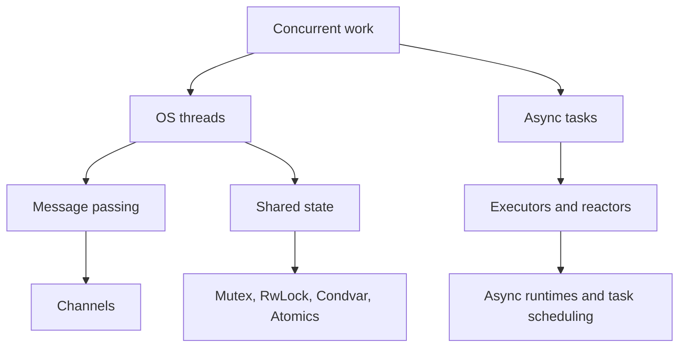
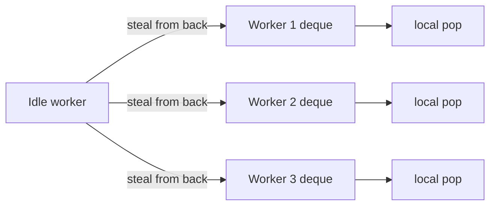

Purpose: build a production-grade mental model for safe concurrent Rust: OS threads, message passing, shared state, atomics, trait bounds, lock behavior, parallel iterators, lock-free ideas, and verification methods.

# Concurrency, Parallelism, and Synchronization

Related notes: [08 Async Rust Futures Tokio and Runtimes](/compendium/rust/async-rust-futures-tokio-and-runtimes), [02 Ownership Borrowing and Lifetimes](/compendium/rust/ownership-borrowing-and-lifetimes), [04 Error Handling and API Design](/compendium/rust/error-handling-and-api-design), [03 Types Traits and Generics](/compendium/rust/types-traits-and-generics), [09 Unsafe Rust and the Rust Memory Model](/compendium/rust/unsafe-rust-and-the-rust-memory-model), [11 Testing Verification Benchmarking and Tooling](/compendium/rust/testing-verification-benchmarking-and-tooling), [06 Memory Layout Performance and Zero Cost Abstractions](/compendium/rust/memory-layout-performance-and-zero-cost-abstractions).

## Concurrency model in Rust

Rust does not make concurrent programs automatically correct. It makes large classes of data races unrepresentable in safe code. The core guarantee is that shared mutable access must be mediated by ownership, borrowing, atomics, or synchronization primitives whose APIs encode the necessary restrictions.

Concurrency means multiple tasks are in progress at once. Parallelism means multiple tasks execute at the same time on different cores. A Rust program can be concurrent without parallelism, such as one OS thread multiplexing futures. It can be parallel without async, such as many OS threads using Rayon.



## Threads

`std::thread::spawn` creates an OS thread. The closure must be `'static` because the new thread can outlive the caller, and it must be `Send` because the closure moves to another thread.

```rust
use std::thread;

fn main() {
    let data = vec![1, 2, 3, 4];

    let handle = thread::spawn(move || {
        data.iter().sum::<i32>()
    });

    let sum = handle.join().expect("worker thread panicked");
    assert_eq!(sum, 10);
}
```

The `move` keyword transfers ownership into the closure. Without it, the spawned thread could borrow stack data that disappears before the thread exits.

### Scoped threads

`std::thread::scope` permits threads to borrow from the caller because the scope guarantees all child threads finish before borrowed values leave scope.

```rust
use std::thread;

fn parallel_sum(values: &[i64]) -> i64 {
    let mid = values.len() / 2;
    let (left, right) = values.split_at(mid);

    thread::scope(|scope| {
        let left_handle = scope.spawn(|| left.iter().sum::<i64>());
        let right_sum = right.iter().sum::<i64>();
        left_handle.join().expect("left worker panicked") + right_sum
    })
}
```

Use scoped threads when the parallel work is short lived and naturally tied to local borrowed data. Use owned data plus `JoinHandle` when the work must outlive the current lexical scope.

## Message passing

Message passing transfers ownership or copies values between producers and consumers. It reduces shared mutable state by making communication explicit.

The standard library provides multi-producer, single-consumer channels through `std::sync::mpsc`.

```rust
use std::sync::mpsc;
use std::thread;

#[derive(Debug)]
enum Job {
    Parse(String),
    Shutdown,
}

fn main() {
    let (tx, rx) = mpsc::channel::<Job>();

    let worker = thread::spawn(move || {
        while let Ok(job) = rx.recv() {
            match job {
                Job::Parse(input) => println!("parsed {} bytes", input.len()),
                Job::Shutdown => break,
            }
        }
    });

    tx.send(Job::Parse("record=42".to_string())).unwrap();
    tx.send(Job::Shutdown).unwrap();

    worker.join().unwrap();
}
```

Dropping all senders closes the channel. Receivers should treat closure as a normal shutdown signal unless the protocol defines it as an error.

### Bounded channels and backpressure

Unbounded channels can hide overload by storing ever-growing queues. Bounded channels force producers to wait or fail when consumers fall behind.

```rust
use std::sync::mpsc;
use std::thread;
use std::time::Duration;

fn main() {
    let (tx, rx) = mpsc::sync_channel::<u64>(128);

    let producer = thread::spawn(move || {
        for id in 0..10_000 {
            tx.send(id).expect("consumer stopped");
        }
    });

    let consumer = thread::spawn(move || {
        while let Ok(id) = rx.recv() {
            process(id);
        }
    });

    producer.join().unwrap();
    consumer.join().unwrap();
}

fn process(_id: u64) {
    thread::sleep(Duration::from_micros(10));
}
```

Bounded queues make latency and memory behavior visible. Choose a capacity based on measured burst size, acceptable latency, and failure policy.

## Channel choices

| Channel | Pattern | Strength | Cost or constraint |
|---|---|---|---|
| `std::sync::mpsc::channel` | MPSC, unbounded | In standard library, simple ownership transfer | Single consumer, unbounded memory risk |
| `std::sync::mpsc::sync_channel` | MPSC, bounded | Built-in backpressure | Single consumer, blocking API |
| `crossbeam_channel` | MPMC, bounded or unbounded | Fast, cloneable receivers, `select!`, blocking thread use | External crate |
| `flume` | MPMC, sync and async friendly | Ergonomic API, async receive support | External crate, less universal than Crossbeam |
| `tokio::sync::mpsc` | Async MPSC | Runtime-aware backpressure | Must be used with async execution rules |

## Crossbeam

Crossbeam provides concurrency utilities that fill gaps in the standard library: multi-producer multi-consumer channels, scoped threads before the standard library had them, epoch-based memory reclamation, and low-level data structures.

```rust
use crossbeam_channel::{bounded, select, tick};
use std::thread;
use std::time::Duration;

enum Event {
    Data(u64),
    Tick,
}

fn main() {
    let (data_tx, data_rx) = bounded::<u64>(64);
    let ticker = tick(Duration::from_millis(100));

    let producer = thread::spawn(move || {
        for id in 0..100 {
            data_tx.send(id).unwrap();
        }
    });

    loop {
        let event = select! {
            recv(data_rx) -> msg => match msg {
                Ok(id) => Event::Data(id),
                Err(_) => break,
            },
            recv(ticker) -> _ => Event::Tick,
        };

        match event {
            Event::Data(id) => println!("data {id}"),
            Event::Tick => println!("heartbeat"),
        }
    }

    producer.join().expect("producer thread panicked");
}
```

Use Crossbeam when thread-based code needs MPMC channels, selection across blocking receivers, or battle-tested low-level primitives.

## Shared state

Shared state uses a pointer type such as `Arc&lt;T&gt;` plus an interior synchronization primitive such as `Mutex&lt;T&gt;`, `RwLock&lt;T&gt;`, atomics, or channels. `Arc&lt;T&gt;` makes ownership shared. It does not make the inner value mutable or thread-safe by itself.

```rust
use std::collections::HashMap;
use std::sync::{Arc, Mutex};
use std::thread;

type Counts = Arc<Mutex<HashMap<String, usize>>>;

fn increment(counts: &Counts, key: &str) {
    let mut guard = counts.lock().expect("counts lock poisoned");
    *guard.entry(key.to_string()).or_insert(0) += 1;
}

fn main() {
    let counts: Counts = Arc::new(Mutex::new(HashMap::new()));

    thread::scope(|scope| {
        for shard in ["api", "worker", "api", "scheduler"] {
            let counts = Arc::clone(&counts);
            scope.spawn(move || increment(&counts, shard));
        }
    });

    let guard = counts.lock().unwrap();
    assert_eq!(guard["api"], 2);
}
```

`Arc::clone(&x)` increments a reference count. Prefer that spelling over `x.clone()` when the important event is sharing ownership rather than duplicating data.

## Mutex

`Mutex&lt;T&gt;` allows one thread at a time to access `T`. In Rust, locking returns a guard. The lock is released when the guard is dropped.

```rust
use std::sync::Mutex;

struct Ledger {
    balance: Mutex<i64>,
}

impl Ledger {
    fn deposit(&self, amount: i64) {
        let mut balance = self.balance.lock().expect("ledger poisoned");
        *balance += amount;
    }

    fn balance(&self) -> i64 {
        *self.balance.lock().expect("ledger poisoned")
    }
}
```

Hold locks for the smallest correct scope. Do validation and expensive computation outside the critical section where possible.

```rust
use std::sync::Mutex;

fn update(cache: &Mutex<Vec<String>>, input: &str) {
    let normalized = input.trim().to_ascii_lowercase();

    {
        let mut guard = cache.lock().unwrap();
        guard.push(normalized);
    }

    send_metric();
}

fn send_metric() {}
```

### Poisoning

The standard library `Mutex` and `RwLock` become poisoned when a thread panics while holding the lock. Poisoning is not memory unsafety. It is a signal that the protected invariant might be broken.

```rust
use std::sync::{Arc, Mutex};

fn recover_count(count: &Arc<Mutex<u64>>) -> u64 {
    match count.lock() {
        Ok(guard) => *guard,
        Err(poisoned) => {
            let guard = poisoned.into_inner();
            *guard
        }
    }
}
```

Recovery is valid only when the protected data can be revalidated or the operation is idempotent. For financial state, use poisoning as a hard fault. For a cache, recovery is often acceptable.

## RwLock

`RwLock&lt;T&gt;` allows many readers or one writer. It helps when reads dominate and read critical sections are long enough to offset lock overhead.

```rust
use std::collections::HashMap;
use std::sync::RwLock;

struct ConfigStore {
    values: RwLock<HashMap<String, String>>,
}

impl ConfigStore {
    fn get(&self, key: &str) -> Option<String> {
        self.values.read().unwrap().get(key).cloned()
    }

    fn set(&self, key: String, value: String) {
        self.values.write().unwrap().insert(key, value);
    }
}
```

`RwLock` can be slower than `Mutex` under write-heavy load. Writer fairness depends on implementation details. Measure before replacing a `Mutex` with `RwLock`.

## Condvar

`Condvar` blocks a thread until another thread signals that a condition might have changed. Always wait in a loop because wakeups can be spurious and because another thread can consume the condition before the current waiter reacquires the lock.

```rust
use std::collections::VecDeque;
use std::sync::{Condvar, Mutex};

struct Queue<T> {
    items: Mutex<VecDeque<T>>,
    ready: Condvar,
}

impl<T> Queue<T> {
    fn push(&self, item: T) {
        let mut items = self.items.lock().unwrap();
        items.push_back(item);
        self.ready.notify_one();
    }

    fn pop(&self) -> T {
        let mut items = self.items.lock().unwrap();
        loop {
            if let Some(item) = items.pop_front() {
                return item;
            }

            items = self.ready.wait(items).unwrap();
        }
    }
}
```

Use channels before custom `Condvar` queues unless the condition protocol is central to the design.

## Send and Sync in depth

`Send` means ownership of a value can move to another thread. `Sync` means shared references to a value can be used from multiple threads. Formally, `T: Sync` means `&T: Send`.

These are unsafe auto traits. The compiler derives them when all fields are safe to send or share. Unsafe code may implement them manually, but doing so asserts a thread-safety proof that the compiler cannot verify.

| Type | `Send` | `Sync` | Reason |
|---|---:|---:|---|
| `i32`, `String`, `Vec&lt;T&gt;` where `T: Send` | Yes | Yes when contents allow | Owned data has no hidden shared mutation |
| `Rc&lt;T&gt;` | No | No | Non-atomic reference count |
| `Arc&lt;T&gt;` | Yes if `T: Send + Sync` | Yes if `T: Send + Sync` | Atomic reference count, inner thread safety still required |
| `Cell&lt;T&gt;`, `RefCell&lt;T&gt;` | Usually Send if `T: Send` | No | Runtime or interior mutation is not synchronized |
| `Mutex&lt;T&gt;` | Yes if `T: Send` | Yes if `T: Send` | Lock serializes access and can move `T` between threads through the guard |
| `RwLock&lt;T&gt;` | Yes if `T: Send` | Yes if `T: Send + Sync` | A moved lock can transfer `T`; concurrent readers also require shared access to be safe |
| `AtomicUsize` | Yes | Yes | Operations are synchronized by the atomic API |

```rust
use std::rc::Rc;
use std::sync::{Arc, Mutex};
use std::thread;

fn works() {
    let shared = Arc::new(Mutex::new(vec![1, 2, 3]));
    let worker_shared = Arc::clone(&shared);

    thread::spawn(move || {
        worker_shared.lock().unwrap().push(4);
    })
    .join()
    .unwrap();
}

fn does_not_compile() {
    let _not_thread_safe = Rc::new(vec![1, 2, 3]);
    // thread::spawn(move || drop(_not_thread_safe));
}
```

Thread-safety API design should expose `Send` and `Sync` requirements at boundaries. If a worker pool accepts jobs that run on worker threads, the job closure usually needs `Send + 'static`.

```rust
pub fn spawn_job<F>(job: F) -> std::thread::JoinHandle<()>
where
    F: FnOnce() + Send + 'static,
{
    std::thread::spawn(job)
}
```

Avoid hiding non-thread-safe values behind wrapper types unless the wrapper enforces a real synchronization policy.

## Arc patterns

`Arc&lt;T&gt;` is best treated as shared ownership of an immutable service, or shared ownership of a synchronization primitive.

```rust
use std::sync::{Arc, Mutex};

#[derive(Default)]
struct Metrics {
    requests: u64,
    errors: u64,
}

#[derive(Clone)]
struct AppState {
    metrics: Arc<Mutex<Metrics>>,
    service_name: Arc<str>,
}

impl AppState {
    fn record_error(&self) {
        let mut metrics = self.metrics.lock().unwrap();
        metrics.requests += 1;
        metrics.errors += 1;
    }
}
```

Useful patterns:

| Pattern | Shape | Use when |
|---|---|---|
| Immutable shared config | `Arc&lt;Config&gt;` | Config is built once and read everywhere |
| Coarse shared mutable state | `Arc&lt;Mutex&lt;State&gt;&gt;` | State is small, updates require whole-state invariants |
| Read-mostly state | `Arc&lt;RwLock&lt;State&gt;&gt;` | Reads dominate and writes are rare |
| Sharded locks | `Arc&lt;Vec&lt;Mutex&lt;Shard&gt;&gt;&gt;` | Contention is high and keys partition naturally |
| Atomic counters | `Arc&lt;AtomicU64&gt;` | Operation is a simple independent counter or flag |
| Channel owner | `Arc&lt;Sender&lt;T&gt;&gt;` or cloned sender | Many producers need to enqueue work |

Do not wrap every field in its own `Arc&lt;Mutex&lt;_&gt;&gt;`. That often destroys invariants by allowing partial updates with unclear lock ordering.

## Atomics

Atomics provide operations that cannot be torn and can participate in inter-thread ordering. They are lower level than locks. They are useful for counters, flags, reference counts, state machines, and high-contention hot paths where the invariant is small.

Memory ordering examples are useful only when the protected invariant is small enough to explain. If the invariant spans a graph, queue, cache, or protocol state, prefer a lock, channel, or proven crate before writing a custom atomic protocol.

```rust
use std::sync::atomic::{AtomicU64, Ordering};

struct Counters {
    requests: AtomicU64,
}

impl Counters {
    fn increment(&self) {
        self.requests.fetch_add(1, Ordering::Relaxed);
    }

    fn snapshot(&self) -> u64 {
        self.requests.load(Ordering::Relaxed)
    }
}
```

`Relaxed` is enough for a metric counter when no other memory must become visible because of the counter update.

### Ordering vocabulary

| Ordering | Guarantee | Typical use |
|---|---|---|
| `Relaxed` | Atomicity only for that variable | Counters, statistics, IDs where ordering with other memory is irrelevant |
| `Acquire` | Later reads and writes in this thread cannot move before the acquire load | Consuming data published by a release store |
| `Release` | Earlier reads and writes in this thread cannot move after the release store | Publishing data before setting a ready flag |
| `AcqRel` | Acquire plus release for read-modify-write operations | Compare-exchange state transitions that both observe and publish |
| `SeqCst` | Acquire and release plus a single global order among SeqCst operations | Simpler reasoning for rare synchronization paths or algorithms requiring total order |

### Release and acquire publication

This example publishes a payload through one atomic variable and a ready flag through another. The release store on `ready` makes earlier writes visible to an acquire load that observes the flag.

```rust
use std::sync::atomic::{AtomicBool, AtomicUsize, Ordering};
use std::thread;

struct Slot {
    payload: AtomicUsize,
    ready: AtomicBool,
}

fn main() {
    let slot = Slot {
        payload: AtomicUsize::new(0),
        ready: AtomicBool::new(false),
    };

    thread::scope(|scope| {
        scope.spawn(|| {
            slot.payload.store(42, Ordering::Relaxed);
            slot.ready.store(true, Ordering::Release);
        });

        scope.spawn(|| {
            while !slot.ready.load(Ordering::Acquire) {
                thread::yield_now();
            }

            assert_eq!(slot.payload.load(Ordering::Relaxed), 42);
        });
    });
}
```

The payload load can be `Relaxed` because the acquire load of `ready` already established visibility for writes sequenced before the release store. This pattern does not generalize to arbitrary non-atomic data in safe Rust because safe shared mutation still needs a synchronization wrapper.

### AcqRel compare-exchange

```rust
use std::sync::atomic::{AtomicUsize, Ordering};

const OPEN: usize = 0;
const CLOSED: usize = 1;

fn close_once(state: &AtomicUsize) -> bool {
    state
        .compare_exchange(OPEN, CLOSED, Ordering::AcqRel, Ordering::Acquire)
        .is_ok()
}
```

Success uses `AcqRel` because the operation observes the old state and publishes the new state. Failure uses `Acquire` when observing the current state is enough to synchronize with a successful closer.

### SeqCst

`SeqCst` is not a magic correctness switch. It gives a stronger global ordering for `SeqCst` operations, but it does not fix missing invariants or non-atomic shared mutation. Use it when the algorithm requires simple total-order reasoning or when the synchronization path is not performance critical.

## Locks versus atomics

| Need | Prefer | Rationale |
|---|---|---|
| Multi-field invariant | `Mutex` | One critical section can update the full invariant |
| Read-mostly map or config | `RwLock` or copy-on-write | Readers can proceed together, but writes still serialize |
| Simple counter | Atomic | Lock is unnecessary overhead |
| Wait for condition | Channel or `Condvar` | Avoid spin loops under normal load |
| Complex queue | Channel or proven crate | Correct lock-free queues are hard |
| Cross-thread shutdown flag | Atomic bool or channel | Flag is simple, channel can carry reason and ordering |

## Deadlocks

Rust prevents data races, not deadlocks. Deadlocks are logical failures caused by lock ordering cycles, waiting while holding resources, or blocking on work that needs the current thread to release a lock.

```rust
use std::sync::Mutex;

struct Pair {
    left: Mutex<u64>,
    right: Mutex<u64>,
}

fn transfer(pair: &Pair) {
    let mut left = pair.left.lock().unwrap();
    let mut right = pair.right.lock().unwrap();
    *left -= 1;
    *right += 1;
}
```

The function above is safe only if every caller locks `left` before `right`. If another path locks `right` before `left`, the program can deadlock.

Deadlock controls:

| Control | How to apply |
|---|---|
| Global lock order | Document and enforce an order for all multi-lock operations |
| Lock leveling | Assign numeric levels and never acquire a lower level while holding a higher level |
| Avoid callbacks under lock | Drop guards before invoking user code, logging sinks, or async senders |
| Use try-lock for diagnostics | Fail fast or emit lock-order telemetry in debug builds |
| Shard state | Reduce the need for nested locks |
| Combine invariants | One lock around tightly coupled data can be safer than many locks |

## Lock contention

Contention is time spent waiting to acquire a lock. It grows with critical section duration, number of threads, wakeup overhead, and cache-line bouncing.

Signs of lock contention:

| Symptom | Likely cause | Response |
|---|---|---|
| Throughput falls as threads increase | Serialized hot lock | Shard, batch, or use local aggregation |
| High CPU with low progress | Spin loop or atomic retry storm | Add backoff, park threads, or use a blocking primitive |
| P99 latency spikes | Long critical section or convoy | Move work outside lock, use bounded queues |
| Writer starvation | Read-heavy `RwLock` | Measure fairness, consider copy-on-write or `parking_lot` |
| Cache miss storm | Shared atomic counter | Per-thread counters plus periodic aggregation |

Use profiling tools before rewriting synchronization. A simple `Mutex` is often faster and safer than a clever lock-free data structure.

## Work stealing

Work stealing schedulers give each worker a local deque. Workers pop local tasks cheaply. When a worker runs out of tasks, it steals from another worker. This improves load balancing for irregular workloads while preserving cache locality for local work.



Work stealing is common in Rayon and async runtimes. It is not free. Very tiny tasks can spend more time scheduling than executing.

## Rayon

Rayon is the standard Rust choice for CPU-bound data parallelism. It converts iterators into parallel iterators and uses a work-stealing thread pool.

```rust
use rayon::prelude::*;

fn normalize(values: &mut [f64]) {
    let max = values
        .par_iter()
        .copied()
        .reduce(|| f64::NEG_INFINITY, f64::max);

    values.par_iter_mut().for_each(|value| {
        *value /= max;
    });
}
```

Rayon is best for CPU-bound work with independent items, associative reductions, recursive divide-and-conquer, and batch transformations.

Avoid Rayon for blocking network I/O or async tasks. It can be combined with async by offloading CPU-heavy chunks from async code, but the boundary must be explicit. See [08 Async Rust Futures Tokio and Runtimes](/compendium/rust/async-rust-futures-tokio-and-runtimes) for runtime blocking rules.

### Rayon tradeoffs

| Workload | Rayon fit | Notes |
|---|---|---|
| Large vector map | Strong | Minimal coordination, good cache behavior |
| Associative reduction | Strong | Use `reduce`, `sum`, `fold`, or custom combinators |
| Recursive search | Strong | `join` and work stealing balance uneven branches |
| Small cheap items | Weak until batched | Scheduling overhead can dominate |
| Shared mutable map updates | Weak without sharding | Lock contention can erase parallel speedup |
| Network I/O | Wrong tool | Use async runtime or blocking thread pool |

## Parallel design patterns

### Local accumulation then merge

```rust
use rayon::prelude::*;
use std::collections::HashMap;

fn word_counts(lines: &[String]) -> HashMap<String, usize> {
    lines
        .par_iter()
        .fold(HashMap::new, |mut local, line| {
            for word in line.split_whitespace() {
                *local.entry(word.to_ascii_lowercase()).or_insert(0) += 1;
            }
            local
        })
        .reduce(HashMap::new, |mut left, right| {
            for (word, count) in right {
                *left.entry(word).or_insert(0) += count;
            }
            left
        })
}
```

This pattern avoids a global `Mutex&lt;HashMap&lt;_, _&gt;&gt;` in the hot path.

### Sharded locking

```rust
use std::collections::HashMap;
use std::hash::{Hash, Hasher};
use std::sync::Mutex;

const SHARDS: usize = 64;

struct ShardedMap {
    shards: Vec<Mutex<HashMap<String, usize>>>,
}

impl ShardedMap {
    fn increment(&self, key: String) {
        let index = shard_index(&key);
        let mut shard = self.shards[index].lock().unwrap();
        *shard.entry(key).or_insert(0) += 1;
    }
}

fn shard_index(key: &str) -> usize {
    let mut hasher = std::collections::hash_map::DefaultHasher::new();
    key.hash(&mut hasher);
    hasher.finish() as usize % SHARDS
}
```

Sharding improves throughput only if keys distribute well and operations usually touch one shard.

## Lock-free programming concepts

Lock-free does not mean wait-free. Lock-free means system-wide progress is guaranteed: at least one thread completes in a finite number of steps. Wait-free means every thread completes in a bounded number of steps. Obstruction-free means progress is guaranteed only when a thread eventually runs alone.

Common lock-free ingredients:

| Concept | Meaning | Rust concern |
|---|---|---|
| CAS | Compare and swap a value if it still equals an expected value | Use `compare_exchange` and handle failure loops |
| ABA problem | A location changes from A to B to A, fooling CAS | Use tags, epochs, hazard pointers, or proven crates |
| Memory reclamation | Knowing when removed nodes can be freed | Epoch-based reclamation or reference counting |
| Backoff | Delay after failed CAS to reduce contention | Prevents retry storms |
| Linearization point | Single instant where an operation takes effect | Must be identified during review |
| Progress guarantee | Lock-free, wait-free, or blocking behavior | State it explicitly |

Do not write lock-free collections casually. Prefer `crossbeam`, `arc-swap`, atomics for simple state, or locks. Unsafe lock-free code requires a memory ordering proof, memory reclamation proof, and stress testing under weak interleavings.

## Loom testing

Loom explores possible thread interleavings for small concurrent programs. It replaces synchronization types with instrumented versions and systematically checks schedules.

```rust
#[cfg(test)]
mod tests {
    use loom::sync::{
        atomic::{AtomicBool, AtomicUsize, Ordering},
        Arc,
    };
    use loom::thread;

    #[test]
    fn release_acquire_publishes_payload() {
        loom::model(|| {
            let payload = Arc::new(AtomicUsize::new(0));
            let ready = Arc::new(AtomicBool::new(false));

            let writer_payload = Arc::clone(&payload);
            let writer_ready = Arc::clone(&ready);
            let writer = thread::spawn(move || {
                writer_payload.store(42, Ordering::Relaxed);
                writer_ready.store(true, Ordering::Release);
            });

            let reader_payload = Arc::clone(&payload);
            let reader_ready = Arc::clone(&ready);
            let reader = thread::spawn(move || {
                if reader_ready.load(Ordering::Acquire) {
                    assert_eq!(reader_payload.load(Ordering::Relaxed), 42);
                }
            });

            writer.join().unwrap();
            reader.join().unwrap();
        });
    }
}
```

Keep Loom models tiny. Model the synchronization protocol, not the whole service. Use it for atomics, custom synchronization, cancellation races, channel handoff assumptions, and lock ordering protocols.

## Atomic Memory Model

An atomic operation prevents tearing and participates in a per-location modification order. Ordering controls which non-atomic effects become visible across threads.

| Ordering | Core guarantee |
|---|---|
| `Relaxed` | Atomicity and modification order for that atomic, without inter-thread synchronization |
| `Release` store | Publishes preceding effects to an acquiring observer that reads from the release sequence |
| `Acquire` load | Makes effects published by the observed release visible afterward |
| `AcqRel` read-modify-write | Acquire and release behavior on the same operation |
| `SeqCst` | Acquire or release guarantees plus participation in a single sequentially consistent order |

Happens-before is the proof relation that makes non-atomic reads observe prior writes without a data race. It is built from program order and synchronization edges. `Relaxed` can implement independent counters, but it cannot publish an ordinary data structure by itself.

For `compare_exchange(current, new, success, failure)`, the failure ordering describes only the load that observed a different value. It may be `Relaxed`, `Acquire`, or `SeqCst`, never `Release` or `AcqRel`, and it must not be stronger than the success ordering. A weak CAS may fail spuriously and belongs in a retry loop; it can be more efficient on some architectures.

Every atomic protocol should document:

1. The protected state and allowed transitions.
2. The linearization point.
3. The release operation that publishes initialization.
4. The acquire operation that observes it.
5. Why unrelated non-atomic accesses cannot race.
6. What prevents ABA and how removed memory remains alive.

## Parking, Condition Variables, and Wakeups

Condition variables wait for a predicate associated with a mutex. Wakeups can be spurious, and another thread can consume the condition before the woken thread reacquires the lock. Always wait in a loop:

```rust
use std::collections::VecDeque;
use std::sync::{Condvar, Mutex};

struct State<T> {
    queue: VecDeque<T>,
    shutdown: bool,
}

fn wait_for_item<T>(state: &Mutex<State<T>>, ready: &Condvar) -> Option<T> {
    let mut state = state.lock().expect("queue mutex poisoned");
    while state.queue.is_empty() && !state.shutdown {
        state = ready.wait(state).expect("queue mutex poisoned");
    }
    state.queue.pop_front()
}
```

The predicate, not the notification, is the source of truth. Update the predicate while holding the mutex, then notify according to the design. `thread::park` and `unpark` use a token-like mechanism rather than a condition predicate; an early `unpark` is remembered, but callers must still handle races in their own state machine.

## False Sharing and Contention Topology

Independent atomics can contend through the cache-coherence protocol when they share a cache line. This false sharing appears as poor scaling without a mutex hotspot. Prefer ownership partitioning and local accumulation before padding. If padding is required, use an architecture-aware abstraction and benchmark memory cost as well as throughput.

Sharding changes semantics as well as performance. A sharded counter makes exact global reads more expensive; a sharded map complicates operations spanning keys. State the consistency contract before selecting the shard key and count.

## Memory Reclamation and ABA

A successful CAS on a pointer does not prove the pointed-to allocation is still valid. Lock-free structures need a reclamation scheme such as epochs, hazard pointers, reference counting, or ownership that delays reuse until no reader can retain the address.

ABA occurs when a location changes from value A to B and back to a bitwise-identical A between a reader's load and CAS. Version tags, non-reuse during an epoch, or a different algorithm can address it. Pointer tagging must preserve alignment and provenance contracts.

Use established concurrent collections unless a custom algorithm has a measurable benefit, a written proof sketch, Loom coverage for bounded executions, stress tests, and Miri or sanitizer coverage for unsafe memory handling.

## Common mistakes

| Mistake | Failure mode | Better approach |
|---|---|---|
| `Arc&lt;T&gt;` without synchronization for mutable state | Does not compile, or pushes unsafe code | Use `Arc&lt;Mutex&lt;T&gt;&gt;`, `Arc&lt;RwLock&lt;T&gt;&gt;`, atomics, or channels |
| Holding a lock while doing I/O | Latency spikes and deadlocks | Copy data out, drop guard, perform I/O |
| Unbounded channel for untrusted input | Memory blowup under overload | Use bounded channel and explicit rejection or backpressure |
| Using `Relaxed` to publish data without a release/acquire edge | Stale or inconsistent observations | Use release/acquire or a lock |
| Using `RwLock` because it sounds faster | Worse performance under writes | Benchmark with realistic read/write ratios |
| Ignoring poisoning with `unwrap` everywhere | Panic cascades | Decide per invariant whether to recover or fail |
| Nested locks without documented order | Deadlock | Lock order policy or combine state |
| Parallelizing tiny tasks | Slowdown from scheduling overhead | Batch work |
| Calling user callbacks under lock | Reentrancy deadlocks | Drop guard first |
| Writing custom lock-free code first | Subtle unsoundness | Prefer proven crates and Loom tests |

## Production guidance

Design the concurrency boundary before picking primitives. The primitive should follow the ownership model.

| Question | Design implication |
|---|---|
| Who owns shutdown? | Use channels or cancellation tokens with clear drop semantics |
| Can producers outrun consumers? | Use bounded queues and overload policy |
| Is the invariant multi-field? | Prefer one lock around the invariant |
| Is the state read-mostly? | Consider `RwLock`, copy-on-write, or `arc-swap` |
| Is the hot path a counter or flag? | Consider atomics with documented ordering |
| Can work be split into independent chunks? | Use Rayon or local accumulation |
| Does code call into user-provided closures? | Avoid holding locks across callbacks |
| Does the code use unsafe concurrency? | Require Loom tests and a written safety invariant |

Operational practices:

| Practice | Reason |
|---|---|
| Name worker threads | Makes logs and crash reports interpretable |
| Instrument queue length | Reveals backpressure and overload |
| Track lock wait time | Distinguishes CPU work from contention |
| Use bounded shutdown time | Prevents hung deploys |
| Keep panic policy explicit | Thread panics otherwise disappear until join |
| Stress under CPU oversubscription | Finds scheduler-sensitive bugs |
| Run Miri for unsafe code where possible | Catches undefined behavior outside interleaving logic |
| Run Loom for small synchronization protocols | Finds rare orderings |

## Review checklist

- The design states whether work is thread-based, async, or data-parallel.
- Every shared mutable invariant has a single clear synchronization owner.
- Every `Arc` is justified as shared ownership, not used to silence ownership design.
- Bounded queues are used where producers can exceed consumer capacity.
- Lock ordering is documented for every path that can hold more than one lock.
- No lock guard is held across blocking I/O, untrusted callbacks, long CPU work, or async `.await`.
- `Mutex` poisoning behavior is handled according to invariant severity.
- `RwLock` use is justified by measured or expected read-heavy behavior.
- Atomics have comments or tests explaining why each ordering is sufficient.
- `Relaxed` is used only when cross-variable visibility is irrelevant or established elsewhere.
- CAS loops include backoff or evidence that contention is low.
- Unsafe `Send` or `Sync` implementations have explicit safety invariants.
- Lock-free algorithms identify their linearization points and reclamation strategy.
- Rayon work is CPU-bound, batched enough to amortize scheduling, and free of global hot locks.
- Loom or stress tests cover custom synchronization and cancellation races.
- Shutdown closes channels, joins threads, and drains or rejects outstanding work deterministically.

## Primary Sources

- [`std::sync::atomic` module documentation](https://doc.rust-lang.org/std/sync/atomic/)
- [`std::sync::atomic::Ordering`](https://doc.rust-lang.org/std/sync/atomic/enum.Ordering.html)
- [`std::sync::Condvar`](https://doc.rust-lang.org/std/sync/struct.Condvar.html)
- [The Rustonomicon: atomics](https://doc.rust-lang.org/nomicon/atomics.html)
- [The Rust Reference: undefined behavior](https://doc.rust-lang.org/reference/behavior-considered-undefined.html)
- [Loom documentation](https://docs.rs/loom/latest/loom/)
- [Rayon documentation](https://docs.rs/rayon/latest/rayon/)
