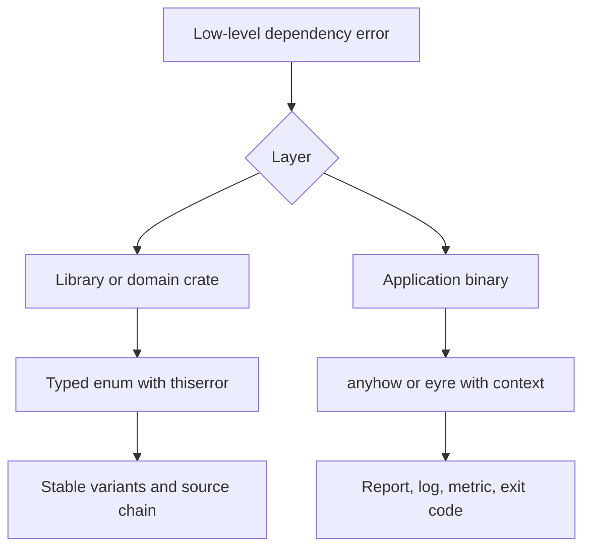
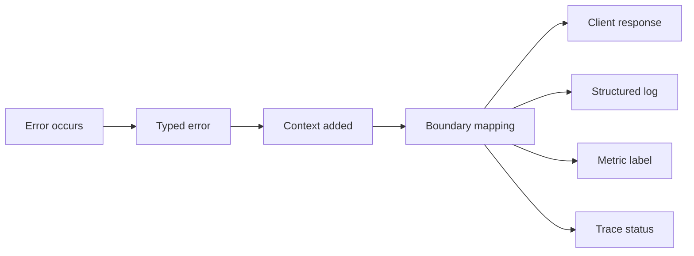

Purpose: design Rust APIs whose success paths, failure modes, conversions, diagnostics, and production contracts are explicit enough for libraries, applications, services, and operators to rely on.

# Error Handling and API Design

Related notes: [03 Types Traits and Generics](/compendium/rust/types-traits-and-generics), [07 APIs Contracts and Integration](/compendium/software-engineering/apis-contracts-and-integration), [08 Reliability Observability and Operations](/compendium/software-engineering/reliability-observability-and-operations), [10 Testing Verification and Quality Bars](/compendium/software-engineering/testing-verification-and-quality-bars), <span className="compendium-external-reference" title="Vault-only reference">Software testing</span>, [Design Patterns/Facade Pattern](/compendium/design-patterns/facade-pattern), [Design Patterns/Adapter Pattern](/compendium/design-patterns/adapter-pattern).

## Core model

Rust treats absence, expected failure, and unrecoverable bugs as different categories.

| Category | Rust tool | Meaning | API signal |
|---|---|---|---|
| Absence | `Option&lt;T&gt;` | A value may not exist, and no explanation is needed | Lookup miss, optional field, end of iteration. |
| Expected failure | `Result&lt;T, E&gt;` | Operation can fail and caller may recover or report | I/O, parsing, validation, remote calls, business rules. |
| Bug or violated invariant | `panic!` | Program state contradicts assumptions | Internal invariant failure, impossible branch, test assertion. |
| Process abort | `std::process::abort` | Continuing is unsafe or meaningless | Fatal corruption, unsafe invariant breach, crash-only service choice. |

An ergonomic Rust API makes the caller's next action clear. `Option` asks "is it present?" `Result` asks "what failure happened?" A panic says "the caller or implementation broke a contract."

## Option as an API design tool

Use `Option&lt;T&gt;` when absence is ordinary and additional detail would not change caller behavior.

```rust
pub struct HeaderMap {
    values: std::collections::HashMap<String, String>,
}

impl HeaderMap {
    pub fn get(&self, name: &str) -> Option<&str> {
        self.values.get(name).map(String::as_str)
    }
}
```

Good `Option` uses:

- Cache miss.
- Map lookup.
- Optional configuration field after defaults are applied.
- Tree child pointer.
- End of stream or iterator.
- Non-authoritative best-effort metadata.

Poor `Option` uses:

- Validation failure where the caller needs a message.
- Permission denial where audit logs need a reason.
- Network failure where retry policy depends on classification.
- Domain rule failure where UI or API clients need a stable code.

Convert `Option` to `Result` at the boundary where absence becomes an error.

```rust
#[derive(Debug, thiserror::Error)]
pub enum AccountError {
    #[error("account {id} was not found")]
    NotFound { id: String },
}

pub fn require_account<'a>(
    accounts: &'a std::collections::HashMap<String, Account>,
    id: &str,
) -> Result<&'a Account, AccountError> {
    accounts
        .get(id)
        .ok_or_else(|| AccountError::NotFound { id: id.to_owned() })
}

pub struct Account;
```

## Result as an API design tool

Use `Result&lt;T, E&gt;` when failure is part of the function's contract.

```rust
#[derive(Debug, thiserror::Error)]
pub enum ConfigError {
    #[error("missing required key {key}")]
    MissingKey { key: &'static str },
    #[error("invalid port {value}")]
    InvalidPort {
        value: String,
        source: std::num::ParseIntError,
    },
}

pub struct Config {
    pub port: u16,
}

pub fn load_config(values: &std::collections::HashMap<String, String>) -> Result<Config, ConfigError> {
    let raw_port = values
        .get("PORT")
        .ok_or(ConfigError::MissingKey { key: "PORT" })?;

    let port = raw_port
        .parse::<u16>()
        .map_err(|source| ConfigError::InvalidPort {
            value: raw_port.clone(),
            source,
        })?;

    Ok(Config { port })
}
```

Design `E` as carefully as `T`. The error type is part of the API.

## The question mark operator

`?` returns early from a function when the value is `Err` or `None`, using `From` conversion for error types.

```rust
#[derive(Debug, thiserror::Error)]
pub enum ImportError {
    #[error("could not read input")]
    Read(#[from] std::io::Error),
    #[error("could not parse input")]
    Parse(#[from] serde_json::Error),
}

pub fn import_users(path: &std::path::Path) -> Result<Vec<User>, ImportError> {
    let contents = std::fs::read_to_string(path)?;
    let users = serde_json::from_str(&contents)?;
    Ok(users)
}

#[derive(serde::Deserialize)]
pub struct User {
    id: String,
}
```

`?` is not just shorthand. It defines propagation semantics. If every lower-level error converts into one top-level variant without context, debugging suffers. Add context at boundaries where local information is useful.

## Error type design

A good error type answers:

- What failed?
- Is the failure stable enough for callers to match on?
- Is it retryable?
- Is there a source error?
- Is there safe diagnostic context?
- Should this be visible to users, logs, metrics, or API clients?

```rust
#[derive(Debug, thiserror::Error)]
pub enum PaymentError {
    #[error("payment method {payment_method_id} was declined")]
    Declined {
        payment_method_id: String,
        retryable: bool,
    },
    #[error("payment provider request failed")]
    Provider {
        #[source]
        source: reqwest::Error,
    },
    #[error("idempotency key {key} is already used for another request")]
    IdempotencyConflict {
        key: String,
    },
}
```

Prefer enum variants when callers need to distinguish failure classes. Prefer opaque errors when callers can only report or log.

## thiserror

`thiserror` is best for library and domain error types. Its `Error` derive implements `std::error::Error`, generates `Display` from `#[error(...)]`, and generates `From` only for variants marked `#[from]`. Derive or implement `Debug` separately, as every `Error` type must also implement `Debug`.

```rust
#[derive(Debug, thiserror::Error)]
pub enum StorageError {
    #[error("object {key} was not found")]
    NotFound { key: String },

    #[error("object {key} failed integrity validation")]
    Integrity { key: String },

    #[error("storage backend failed")]
    Backend {
        #[from]
        source: std::io::Error,
    },
}
```

Use `#[from]` when the variant is exactly a source conversion. Use `#[source]` when the variant contains a source but needs additional fields.

Avoid leaking dependencies accidentally. If a public library error exposes `reqwest::Error`, changing HTTP clients becomes a breaking change. Wrap dependency errors if implementation freedom matters.

## anyhow

`anyhow` is an application error type. It is excellent when the caller will log, display, or crash rather than match on variants.

```rust
use anyhow::{Context, Result};

pub fn run_import(path: &std::path::Path) -> Result<()> {
    let contents = std::fs::read_to_string(path)
        .with_context(|| format!("reading import file {}", path.display()))?;

    let users: Vec<User> = serde_json::from_str(&contents)
        .with_context(|| format!("parsing import file {}", path.display()))?;

    persist(users).context("persisting imported users")?;
    Ok(())
}

fn persist(_users: Vec<User>) -> Result<()> {
    Ok(())
}

#[derive(serde::Deserialize)]
struct User {
    id: String,
}
```

`anyhow` trades typed matching for rapid propagation with context. Use it in binaries, CLIs, jobs, test utilities, and application composition layers. Avoid it as the main public error type of a reusable library.

## eyre

`eyre` has a similar role to `anyhow` but emphasizes customizable error reports. `color-eyre` is common for rich CLI diagnostics.

```rust
use eyre::{Context, Result};

pub fn main_entry() -> Result<()> {
    color_eyre::install()?;
    load_workspace().context("loading workspace")?;
    Ok(())
}

fn load_workspace() -> Result<()> {
    Ok(())
}
```

Use `eyre` when report customization matters. Use `anyhow` when conventional application error propagation is enough. Do not mix them casually in the same application unless there is a clear boundary.

## Library vs application error handling



| Concern | Library | Application |
|---|---|---|
| Primary audience | Other code | Operators, users, logs, jobs. |
| Error type | Specific enum or struct | `anyhow::Error`, `eyre::Report`, or top-level app enum. |
| Caller matching | Expected | Rare outside top-level policy. |
| Context | Structured fields and source chain | Human-readable context stack. |
| Dependency exposure | Avoid unless part of contract | Acceptable internally. |
| Backward compatibility | High concern | Lower, unless CLI or API output is stable. |

Library rule: return typed errors that preserve stable semantics.

Application rule: add context at each operational boundary and decide what to log, retry, show, or count.

## Error contracts

An error contract is the promise consumers can rely on when an operation fails. In production systems, the contract is larger than a Rust enum.

| Contract surface | Example | Stability expectation |
|---|---|---|
| Rust variant | `StorageError::NotFound` | Stable inside crate API once public. |
| HTTP status | `404`, `409`, `429`, `503` | Stable for clients. |
| Machine code | `object_not_found` | Stable for clients and dashboards. |
| Retry classification | `retryable: true` | Stable for SDKs and job runners. |
| Log fields | `tenant_id`, `request_id`, `error.kind` | Stable for operations. |
| Metric label | `error_class=timeout` | Stable enough to avoid cardinality churn. |
| Human message | "object was not found" | Useful but not a parsing contract. |

Do not make clients parse `Display` strings. Provide stable codes.

```rust
pub trait ErrorContract {
    fn code(&self) -> &'static str;
    fn retryable(&self) -> bool;
}

impl ErrorContract for StorageError {
    fn code(&self) -> &'static str {
        match self {
            StorageError::NotFound { .. } => "object_not_found",
            StorageError::Integrity { .. } => "integrity_check_failed",
            StorageError::Backend { .. } => "storage_backend_failed",
        }
    }

    fn retryable(&self) -> bool {
        matches!(self, StorageError::Backend { .. })
    }
}
```

## API ergonomics

API ergonomics is not about hiding reality. It is about putting friction in the right place.

| Goal | Rust pattern | Example |
|---|---|---|
| Accept flexible input | `impl AsRef&lt;Path&gt;`, `impl AsRef&lt;str&gt;` | Read without taking ownership. |
| Accept owned conversion | `impl Into&lt;String&gt;` | Store a caller-provided name. |
| Express validation | `TryFrom` and smart constructors | Parse IDs, ports, percentages. |
| Hide implementation | Return `impl Iterator` or a domain type | Avoid exposing concrete adapters. |
| Preserve recoverability | Typed `Result&lt;T, E&gt;` | Let callers match on variants. |
| Improve app diagnostics | `anyhow::Context` or `eyre::Context` | Add file path, operation, remote name. |
| Keep builders safe | Type-state or runtime validation | Choose by complexity and UX. |

Example ergonomic constructor:

```rust
#[derive(Clone, Debug, Eq, PartialEq)]
pub struct EmailAddress(String);

#[derive(Debug, thiserror::Error)]
pub enum EmailAddressError {
    #[error("email address is empty")]
    Empty,
    #[error("email address must contain one at sign")]
    MissingAtSign,
}

impl TryFrom<String> for EmailAddress {
    type Error = EmailAddressError;

    fn try_from(value: String) -> Result<Self, Self::Error> {
        let trimmed = value.trim();
        if trimmed.is_empty() {
            return Err(EmailAddressError::Empty);
        }
        if !trimmed.contains('@') {
            return Err(EmailAddressError::MissingAtSign);
        }
        Ok(Self(trimmed.to_ascii_lowercase()))
    }
}

impl AsRef<str> for EmailAddress {
    fn as_ref(&self) -> &str {
        &self.0
    }
}
```

## Conversion and error ergonomics

Use `From`, `Into`, `TryFrom`, and `TryInto` to make API boundaries composable.

```rust
#[derive(Debug, thiserror::Error)]
pub enum CreateUserError {
    #[error("invalid email address")]
    Email(#[from] EmailAddressError),
    #[error("display name is empty")]
    EmptyDisplayName,
}

pub struct CreateUser {
    email: EmailAddress,
    display_name: String,
}

impl CreateUser {
    pub fn new<E, N>(email: E, display_name: N) -> Result<Self, CreateUserError>
    where
        E: TryInto<EmailAddress, Error = EmailAddressError>,
        N: Into<String>,
    {
        let display_name = display_name.into();
        if display_name.trim().is_empty() {
            return Err(CreateUserError::EmptyDisplayName);
        }

        Ok(Self {
            email: email.try_into()?,
            display_name,
        })
    }
}
```

This API accepts any input that can become an `EmailAddress`, but it keeps validation typed and explicit.

## Designing for callers

Caller needs should drive the error shape.

| Caller behavior | Needed error shape |
|---|---|
| Show one message and exit | Opaque app error with context. |
| Retry timeouts but not validation | Typed classification or `retryable()` method. |
| Render form errors | Field-level variants or structured validation errors. |
| Map to HTTP responses | Stable codes and status mapping. |
| Aggregate batch results | Per-item error values, not one string. |
| Alert on dependency failures | Error class metric labels with bounded cardinality. |

Batch APIs should avoid losing partial success information.

```rust
pub struct BatchOutcome<T, E> {
    pub succeeded: Vec<T>,
    pub failed: Vec<E>,
}

pub fn import_batch(items: Vec<RawUser>) -> BatchOutcome<User, ImportUserError> {
    let mut succeeded = Vec::new();
    let mut failed = Vec::new();

    for item in items {
        match User::try_from(item) {
            Ok(user) => succeeded.push(user),
            Err(error) => failed.push(error),
        }
    }

    BatchOutcome { succeeded, failed }
}

pub struct RawUser;
pub struct User;
pub struct ImportUserError;

impl TryFrom<RawUser> for User {
    type Error = ImportUserError;

    fn try_from(_value: RawUser) -> Result<Self, Self::Error> {
        Ok(User)
    }
}
```

## Panic policy

Panic is for bugs, not normal control flow. A production crate should have a clear panic policy.

Appropriate panic cases:

- Test assertions.
- Internal invariant that should be impossible if public constructors are correct.
- Indexing fixed internal tables when the index is proven valid.
- Startup fail-fast in a binary when configuration is unrecoverably invalid and no caller can recover.

Inappropriate panic cases:

- User input validation.
- Missing files in a library.
- Network failures.
- Authorization failure.
- Data returned by another service.

Use `expect` with an invariant explanation, not a restatement.

```rust
let primary = replicas
    .first()
    .expect("replica set is constructed with at least one member");
```

## Mapping errors at boundaries

Each architectural boundary should translate errors into the vocabulary of the next layer.

```rust
#[derive(Debug, thiserror::Error)]
pub enum DomainError {
    #[error("project {project_id} does not exist")]
    ProjectNotFound { project_id: String },
    #[error("caller is not allowed to access project {project_id}")]
    Forbidden { project_id: String },
}

pub struct HttpError {
    pub status: u16,
    pub code: &'static str,
    pub message: String,
}

impl From<DomainError> for HttpError {
    fn from(error: DomainError) -> Self {
        match error {
            DomainError::ProjectNotFound { project_id } => Self {
                status: 404,
                code: "project_not_found",
                message: format!("project {project_id} does not exist"),
            },
            DomainError::Forbidden { project_id } => Self {
                status: 403,
                code: "forbidden",
                message: format!("caller is not allowed to access project {project_id}"),
            },
        }
    }
}
```

Keep domain errors independent from HTTP if the domain crate is shared by workers, CLIs, and services. Map to HTTP at the adapter layer.

## Observability and diagnostics

Errors need enough context for humans and machines.



Production diagnostics rules:

- Include request IDs and correlation IDs outside the error type when possible.
- Put stable classification in fields such as `error.code` and `error.kind`.
- Keep metric labels bounded. Do not put user IDs, file paths, or raw messages in labels.
- Keep secrets out of `Display`, `Debug`, source chains, and context strings.
- Preserve source errors with `#[source]`, `#[from]`, or context chains.
- Use logs for detail, metrics for aggregate signals, and traces for request-local causality.

## Async and concurrent APIs

Async errors need cancellation and retry semantics.

```rust
#[derive(Debug, thiserror::Error)]
pub enum FetchError {
    #[error("request timed out")]
    Timeout,
    #[error("remote service returned status {status}")]
    Status { status: u16 },
    #[error("transport failed")]
    Transport {
        #[from]
        source: reqwest::Error,
    },
}

impl FetchError {
    pub fn retryable(&self) -> bool {
        match self {
            FetchError::Timeout => true,
            FetchError::Status { status } => *status == 429 || *status >= 500,
            FetchError::Transport { .. } => true,
        }
    }
}
```

When spawning tasks, errors often need `Send + Sync + 'static`. That requirement belongs at the spawn boundary, not necessarily in lower-level library APIs.

```rust
pub type TaskError = Box<dyn std::error::Error + Send + Sync + 'static>;
```

Do not erase errors too early. Convert to `TaskError`, `anyhow::Error`, or a job-level enum only when the task supervisor no longer needs typed domain variants.

## Public API stability

For public crates, error evolution is compatibility-sensitive.

Strategies:

| Strategy | Pros | Costs |
|---|---|---|
| Public enum | Easy matching, documented variants | Adding variants can break exhaustive matches unless marked non-exhaustive. |
| `#[non_exhaustive]` enum | Allows future variants | Callers need wildcard matches. |
| Opaque struct with methods | Strong compatibility control | Less transparent, more boilerplate. |
| Boxed trait object | Flexible internals | Weak contracts, harder matching. |

Example:

```rust
#[derive(Debug, thiserror::Error)]
#[non_exhaustive]
pub enum ClientError {
    #[error("request timed out")]
    Timeout,
    #[error("authentication failed")]
    Authentication,
    #[error("server returned an unexpected response")]
    Protocol,
}
```

Use `#[non_exhaustive]` for public enums when you expect future failure classes.

## Validation errors

Validation errors often need multiple field errors rather than fail-fast behavior.

```rust
#[derive(Debug, Clone, Eq, PartialEq)]
pub struct FieldError {
    pub field: &'static str,
    pub code: &'static str,
    pub message: String,
}

#[derive(Debug, thiserror::Error)]
#[error("request validation failed")]
pub struct ValidationError {
    pub fields: Vec<FieldError>,
}

impl ValidationError {
    pub fn is_empty(&self) -> bool {
        self.fields.is_empty()
    }
}
```

Use this shape for forms, API request validation, import jobs, and configuration files where returning all actionable issues is better than forcing a fix-one-run-again loop.

## Builder APIs

Builder APIs can validate at each setter, at `build`, or through type states.

| Builder style | Best for | Tradeoff |
|---|---|---|
| Validate in setter | Local constraints such as port range | Setter returns `Result`, chaining is noisier. |
| Validate at `build` | Cross-field constraints | Errors arrive later but can be aggregated. |
| Type-state builder | Small protocol with required order | More types and generic noise. |

```rust
#[derive(Default)]
pub struct ClientBuilder {
    base_url: Option<String>,
    timeout_ms: Option<u64>,
}

#[derive(Debug, thiserror::Error)]
pub enum BuildClientError {
    #[error("base_url is required")]
    MissingBaseUrl,
    #[error("timeout_ms must be greater than zero")]
    InvalidTimeout,
}

impl ClientBuilder {
    pub fn base_url(mut self, value: impl Into<String>) -> Self {
        self.base_url = Some(value.into());
        self
    }

    pub fn timeout_ms(mut self, value: u64) -> Self {
        self.timeout_ms = Some(value);
        self
    }

    pub fn build(self) -> Result<Client, BuildClientError> {
        let base_url = self.base_url.ok_or(BuildClientError::MissingBaseUrl)?;
        let timeout_ms = self.timeout_ms.unwrap_or(30_000);

        if timeout_ms == 0 {
            return Err(BuildClientError::InvalidTimeout);
        }

        Ok(Client {
            base_url,
            timeout_ms,
        })
    }
}

#[derive(Debug)]
pub struct Client {
    base_url: String,
    timeout_ms: u64,
}
```

## Testing error behavior

Error behavior needs tests just like success behavior.

```rust
#[test]
fn missing_base_url_is_reported() {
    let error = ClientBuilder::default()
        .build()
        .expect_err("builder should reject missing base_url");

    assert!(matches!(error, BuildClientError::MissingBaseUrl));
    assert_eq!(error.to_string(), "base_url is required");
}
```

Test:

- Variant classification.
- Source chaining where useful.
- `Display` strings that are user-visible or CLI-visible.
- HTTP status and machine code mapping.
- Retryability decisions.
- Redaction of secrets.
- Batch partial-failure behavior.
- Compatibility expectations for public errors.

## Error Chains, Backtraces, and Context

`std::error::Error::source` forms a causal chain. Preserve it when a lower-level failure explains the current error, but classify the failure at the boundary where caller behavior changes. A useful outer error answers what operation failed; its source answers why.

```rust
#[derive(Debug, thiserror::Error)]
pub enum LoadConfigError {
    #[error("failed to read configuration from {path}")]
    Read {
        path: std::path::PathBuf,
        #[source]
        source: std::io::Error,
    },
}
```

Backtrace capture has cost and policy implications. Application-level reporters may capture a backtrace according to environment configuration. Public library error contracts should not require a specific reporter. Never assume `Display` includes the full chain or a backtrace; choose an explicit report format at the CLI, service, or job boundary.

## Classification, Presentation, and Telemetry

Keep three concerns separate:

1. Classification determines program behavior: retry, reject, compensate, alert, or fail permanently.
2. Presentation produces bounded, redacted text for a user or protocol response.
3. Telemetry records stable codes and structured fields for operators.

One error may have different external presentations without losing its internal category. Do not use human-readable messages as metric labels, database keys, or retry classifiers. Stable codes should be documented and tested independently from prose.

## Panic and Unwind Boundaries

`catch_unwind` catches some unwinding Rust panics; it does not catch aborting panics, process termination, undefined behavior, or every foreign exception. Its primary role is containing an unwind at a boundary that must restore an invariant or translate failure, not implementing ordinary control flow.

- Values crossing the closure boundary must satisfy `UnwindSafe`, or the code must explicitly justify `AssertUnwindSafe`.
- Poisoned standard-library locks report that a panic occurred while exclusive state was accessible. Recovery still requires a domain-specific invariant check.
- A panic must not unwind through an ABI that forbids unwinding. Use a compatible unwind ABI only when both sides define that contract; otherwise catch and translate before the boundary.
- Destructors run during unwinding, but a second panic from a destructor normally aborts the process. Keep `Drop` infallible.

Services commonly isolate work in task or request boundaries, log the incident, and terminate the process when global invariants may be compromised. Libraries should document whether callbacks may panic and what state remains usable afterward.

## Common mistakes

- Returning `Option` when callers need to know why an operation failed.
- Returning `Result&lt;T, String&gt;` from reusable code and losing structure.
- Using `anyhow` in a library's public API.
- Erasing dependency errors before adding useful context.
- Adding context that contains secrets.
- Making clients parse `Display` text instead of returning stable codes.
- Treating all errors as retryable.
- Retrying validation or authorization failures.
- Using panic for expected failure.
- Losing partial success information in batch APIs.
- Exposing third-party error types from a public library without intending to make them part of the compatibility contract.
- Forgetting `#[non_exhaustive]` on public error enums that will evolve.
- Logging the same error at every layer, creating noisy duplicate logs.
- Using high-cardinality error labels in metrics.

## Production guidance

Define error taxonomy before wiring retries and alerts. At minimum, separate validation, authentication, authorization, not found, conflict, rate limit, timeout, dependency failure, and internal bug.

Keep low-level errors precise and high-level errors meaningful. A storage layer can know `TimedOut`; an API layer can know `service_unavailable`; an operator runbook can know the dependency and region.

Use structured fields for machine behavior and `Display` for human explanation. Never make `Display` the only stable contract.

At service boundaries, every failure response should have:

- HTTP or RPC status.
- Stable machine code.
- Human-safe message.
- Correlation or request ID.
- Retry hint when useful.
- Redacted diagnostics in logs.
- Source chain preserved internally.

At library boundaries, every public error should have:

- Stable variants or documented opaque methods.
- Meaningful `Display`.
- `source()` where lower-level causes matter.
- Compatibility plan for new variants.
- Tests for important conversion and mapping behavior.

## Review checklist

- Is absence represented with `Option` only when no explanation is needed?
- Is expected failure represented with `Result&lt;T, E&gt;`?
- Does the error type preserve enough information for caller behavior?
- Are public library errors typed instead of `anyhow::Error`?
- Are application errors enriched with `anyhow::Context` or `eyre::Context` at useful boundaries?
- Does each `#[from]` conversion preserve the right semantic category?
- Are dependency errors hidden when implementation flexibility matters?
- Are `Display` and `Debug` safe for logs and users?
- Are stable API codes separate from human-readable messages?
- Is retryability explicit and tested?
- Are validation errors aggregated when users need multiple fixes at once?
- Are panics limited to bugs or documented invariants?
- Are errors mapped at adapter boundaries instead of leaking HTTP into domain code?
- Are metric labels bounded and low-cardinality?
- Are secrets redacted from messages, contexts, and source errors?
- Are batch APIs preserving per-item success and failure?
- Are public enums marked `#[non_exhaustive]` when future variants are likely?
- Do tests cover failure classification, mapping, display, and redaction?

## Study path

1. Learn `Option` and `Result` as API design signals, not just enums.
2. Design small `thiserror` enums for domain and library code.
3. Use `anyhow` or `eyre` in binaries after typed lower layers have done their job.
4. Define production error contracts with codes, retry hints, logging fields, and response mapping.
5. Review API ergonomics together with [03 Types Traits and Generics](/compendium/rust/types-traits-and-generics) so conversions, newtypes, and error types form one coherent contract.

## Primary Sources

- [`std::error::Error`](https://doc.rust-lang.org/std/error/trait.Error.html)
- [`std::panic::catch_unwind`](https://doc.rust-lang.org/std/panic/fn.catch_unwind.html)
- [`thiserror` documentation](https://docs.rs/thiserror/latest/thiserror/)
- [`anyhow` documentation](https://docs.rs/anyhow/latest/anyhow/)
- [The Rustonomicon: unwinding](https://doc.rust-lang.org/nomicon/unwinding.html)
- [The Rust API Guidelines: errors do not use stringly typed messages](https://rust-lang.github.io/api-guidelines/dependability.html)
