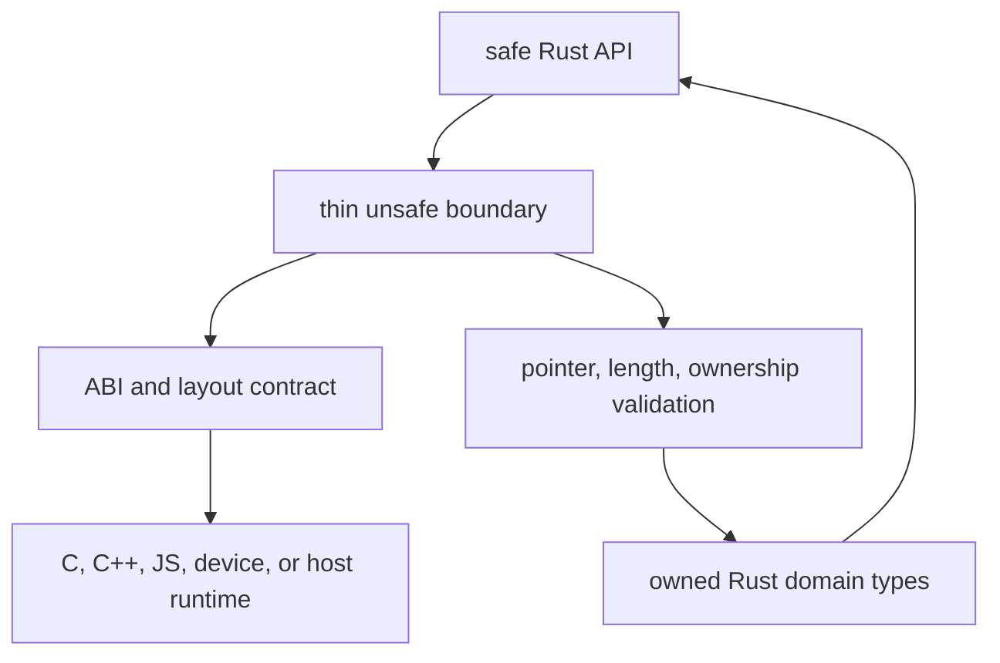
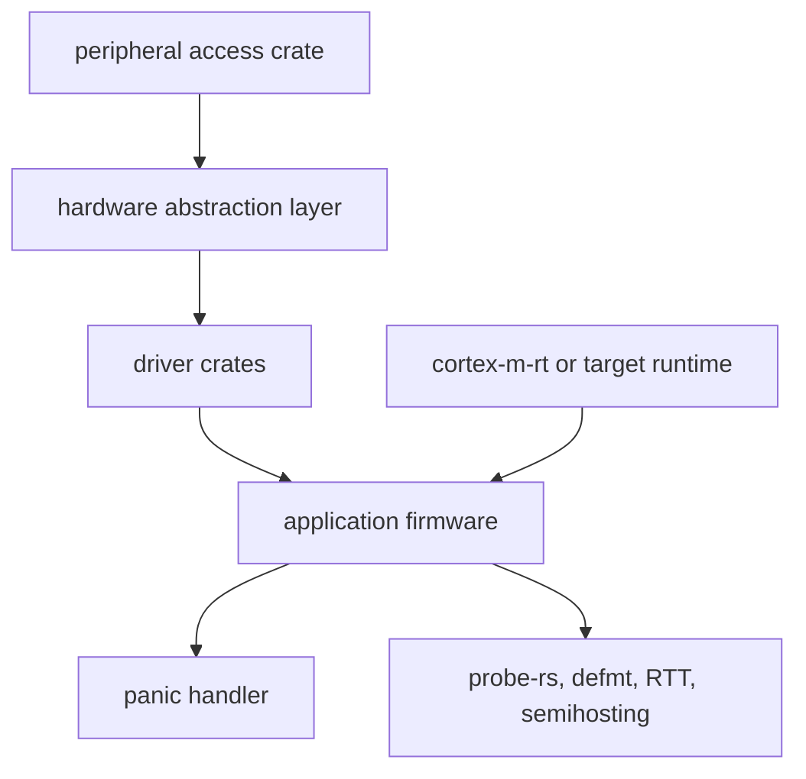

Purpose: explain how Rust crosses language, device, browser, and constrained-runtime boundaries through C FFI, generated bindings, WebAssembly, Embedded Rust, `no_std`, `alloc`, and panic strategy design.

# FFI, Embedded Rust, WebAssembly, and Interoperability

Related notes: [Rust](/compendium/rust/rust), [02 Ownership Borrowing and Lifetimes](/compendium/rust/ownership-borrowing-and-lifetimes), [03 Types Traits and Generics](/compendium/rust/types-traits-and-generics), [04 Error Handling and API Design](/compendium/rust/error-handling-and-api-design), [06 Memory Layout Performance and Zero Cost Abstractions](/compendium/rust/memory-layout-performance-and-zero-cost-abstractions), [09 Unsafe Rust and the Rust Memory Model](/compendium/rust/unsafe-rust-and-the-rust-memory-model), [11 Testing Verification Benchmarking and Tooling](/compendium/rust/testing-verification-benchmarking-and-tooling), <span className="compendium-external-reference" title="Vault-only reference">Software Supply Chain Security</span>.

## Interop model

Interop is where Rust's guarantees become conditional. Inside normal safe Rust, the compiler enforces ownership, lifetimes, aliasing, and thread-safety rules. At a foreign boundary, another compiler, runtime, ABI, allocator, exception model, linker, or device register map participates. You must design an explicit contract.



Boundary rules:

| Rule | Reason |
|---|---|
| Keep unsafe code small and local. | Auditors need a narrow surface. |
| Convert foreign inputs to owned or borrowed Rust types quickly. | Rust invariants should resume as soon as possible. |
| Use explicit allocation and free functions. | Allocator ownership cannot be guessed across languages. |
| Do not unwind across FFI by accident. | Foreign exception and Rust panic models are incompatible unless designed. |
| Document pointer validity, lifetimes, nullability, and thread safety. | The compiler cannot infer foreign caller behavior. |

## FFI with C

Rust calls C with `extern "C"` declarations and C calls Rust through exported `extern "C"` functions. Use C-compatible types from `std::os::raw` or `core::ffi`, and use `#[repr(C)]` on structs passed by value or shared by layout.

```rust
use core::ffi::{c_char, c_int};

unsafe extern "C" {
    fn puts(s: *const c_char) -> c_int;
}

fn print_from_c() {
    let msg = std::ffi::CString::new("hello from Rust").unwrap();
    unsafe {
        // Safety: `msg` is NUL-terminated and remains live for the call;
        // `puts` only reads through the pointer according to its C contract.
        puts(msg.as_ptr());
    }
}
```

Exported Rust API:

```rust
use core::ffi::{c_char, c_int};
use std::ffi::CStr;

#[repr(C)]
pub struct ParseResult {
    code: c_int,
    value: u64,
}

/// Parses a NUL-terminated C string as an unsigned integer.
///
/// # Safety
///
/// `input` must be null or point to a readable NUL-terminated byte sequence
/// that remains valid for the duration of this call.
#[unsafe(no_mangle)]
pub unsafe extern "C" fn parse_u64(input: *const c_char) -> ParseResult {
    if input.is_null() {
        return ParseResult { code: 1, value: 0 };
    }

    let text = unsafe {
        // Safety: guaranteed by the caller contract above.
        CStr::from_ptr(input)
    };
    match text.to_str().ok().and_then(|s| s.parse::<u64>().ok()) {
        Some(value) => ParseResult { code: 0, value },
        None => ParseResult { code: 2, value: 0 },
    }
}
```

Parsing the Rust `&str` is safe. Constructing that view requires trusting the foreign pointer contract, which is why the exported function is unsafe to call. The same contract belongs in the generated header and in Rust's `# Safety` documentation.

## Ownership across C boundaries

Never let C guess how to free Rust allocations. Export paired constructors and destructors.

```rust
use core::ffi::c_char;
use std::ffi::{CStr, CString};

/// Returns a Rust-allocated greeting string.
///
/// # Safety
///
/// `name` must be null or point to a readable NUL-terminated byte sequence
/// that remains valid for the duration of this call.
#[unsafe(no_mangle)]
pub unsafe extern "C" fn greeting_new(name: *const c_char) -> *mut c_char {
    if name.is_null() {
        return std::ptr::null_mut();
    }

    let name = unsafe {
        // Safety: guaranteed by the caller contract above.
        CStr::from_ptr(name)
    }
    .to_string_lossy();
    CString::new(format!("hello, {name}"))
        .map(CString::into_raw)
        .unwrap_or(std::ptr::null_mut())
}

/// Releases a pointer returned by `greeting_new`.
///
/// # Safety
///
/// `ptr` must be null or be an unchanged live pointer returned by
/// `greeting_new`. It must not have been freed previously.
#[unsafe(no_mangle)]
pub unsafe extern "C" fn greeting_free(ptr: *mut c_char) {
    if ptr.is_null() {
        return;
    }
    unsafe {
        // Safety: guaranteed by the caller contract above.
        drop(CString::from_raw(ptr));
    }
}
```

Contract:

- `greeting_new` returns memory allocated by Rust.
- The caller must call `greeting_free` exactly once for non-null results.
- The caller must not pass a pointer to `greeting_free` unless it came from `greeting_new`.
- The caller must not use the pointer after freeing it.

## Layout and ABI

Rust layout is not C layout by default. Add `#[repr(C)]` to shared structs and enums where appropriate.

```rust
#[repr(C)]
#[derive(Debug, Copy, Clone)]
pub struct Vec2 {
    pub x: f32,
    pub y: f32,
}

#[repr(transparent)]
#[derive(Debug, Copy, Clone, PartialEq, Eq)]
pub struct StatusCode(i32);

impl StatusCode {
    pub const OK: Self = Self(0);
    pub const INVALID_INPUT: Self = Self(1);
    pub const INTERNAL_ERROR: Self = Self(2);
}
```

ABI review:

| Type | Guidance |
|---|---|
| `bool` | Avoid across C boundaries unless represented deliberately. |
| `String`, `Vec&lt;T&gt;` | Do not expose directly to C. |
| Slices | Represent as pointer plus length. |
| Trait objects | Do not expose directly. Use opaque handles and function tables. |
| Enums with data | Do not expose as Rust enums. Use tagged structs or explicit result structs. |
| `Option&lt;NonNull&lt;T&gt;&gt;` | Can have niche optimizations, but avoid relying on them across C unless documented. |

## bindgen

`bindgen` generates Rust declarations from C headers. It is useful when consuming a C library with many constants, structs, and functions.

Typical `build.rs`:

```rust
fn main() {
    println!("cargo::rerun-if-changed=wrapper.h");

    let bindings = bindgen::Builder::default()
        .header("wrapper.h")
        .allowlist_function("libfoo_.*")
        .allowlist_type("libfoo_.*")
        .allowlist_var("LIBFOO_.*")
        .generate()
        .expect("failed to generate bindings");

    bindings
        .write_to_file(std::path::PathBuf::from(std::env::var("OUT_DIR").unwrap()).join("bindings.rs"))
        .expect("failed to write bindings");
}
```

Library wrapper:

```rust
mod sys {
    include!(concat!(env!("OUT_DIR"), "/bindings.rs"));
}

pub struct FooHandle {
    raw: *mut sys::libfoo_handle,
}

impl Drop for FooHandle {
    fn drop(&mut self) {
        unsafe {
            // Safety: the wrapper invariant says `raw` is a live uniquely owned
            // libfoo handle, and Drop runs exactly once for this wrapper.
            sys::libfoo_destroy(self.raw);
        }
    }
}
```

`bindgen` guidance:

- Allowlist symbols to avoid importing the world.
- Commit generated bindings only when reproducibility or consumer convenience demands it.
- Pin clang and library versions in CI for stable output.
- Wrap generated `sys` bindings in a safe crate layer.
- Add layout tests when ABI drift would be dangerous.

## cbindgen

`cbindgen` generates C headers from Rust exports. It is useful when Rust provides a C ABI library.

Crate shape:

```toml
[lib]
crate-type = ["cdylib", "staticlib"]
```

Export style:

```rust
#[repr(C)]
pub struct EngineConfig {
    pub max_items: u32,
}

#[repr(C)]
pub struct Engine {
    _private: [u8; 0],
    _not_send_or_sync: core::marker::PhantomData<(*mut u8, core::marker::PhantomPinned)>,
}

#[unsafe(no_mangle)]
pub extern "C" fn engine_new(config: EngineConfig) -> *mut Engine {
    let inner = Box::new(RealEngine::new(config.max_items));
    Box::into_raw(inner) as *mut Engine
}

/// Releases a handle returned by `engine_new`.
///
/// # Safety
///
/// `engine` must be null or an unchanged live pointer returned by
/// `engine_new`, and this function must be called at most once for it.
#[unsafe(no_mangle)]
pub unsafe extern "C" fn engine_free(engine: *mut Engine) {
    if !engine.is_null() {
        unsafe {
            // Safety: the caller contract identifies the allocation created
            // as `Box<RealEngine>` inside `engine_new`.
            drop(Box::from_raw(engine.cast::<RealEngine>()));
        }
    }
}

struct RealEngine {
    max_items: u32,
}

impl RealEngine {
    fn new(max_items: u32) -> Self {
        Self { max_items }
    }
}
```

Use an opaque handle when C callers should not depend on Rust internals. Configure the generated C header to expose only a forward declaration for `Engine`; foreign code must never allocate it by value or inspect the private Rust marker fields. Keep the generated header stable and review it as part of the public API.

## Panic and error strategy for FFI

Panics must not accidentally unwind into C. Use `panic = "abort"` for simple FFI libraries or catch panics at the boundary and translate them to error codes.

```rust
use std::panic::{catch_unwind, AssertUnwindSafe};

#[repr(C)]
pub struct Status {
    code: i32,
}

#[unsafe(no_mangle)]
pub extern "C" fn run_operation() -> Status {
    match catch_unwind(AssertUnwindSafe(|| do_work())) {
        Ok(Ok(())) => Status { code: 0 },
        Ok(Err(_)) => Status { code: 1 },
        Err(_) => Status { code: 2 },
    }
}

fn do_work() -> Result<(), &'static str> {
    Ok(())
}
```

FFI error designs:

| Design | Use when | Cost |
|---|---|---|
| Integer status code | C API must stay simple. | Needs separate message retrieval or docs. |
| Result struct | Return value and status fit together. | More ABI design. |
| Opaque error handle | Rich errors needed by foreign caller. | More ownership management. |
| Callback logger | Foreign host owns logging. | Callback safety and reentrancy concerns. |

## WebAssembly

Rust can target WebAssembly for browser code, plugin systems, edge runtimes, and WASI command modules. WebAssembly is a compilation target and sandbox model, not automatically a faster replacement for JavaScript or native code.

Targets:

| Target | Use |
|---|---|
| `wasm32-unknown-unknown` | Browser or custom host where imports are supplied externally. |
| `wasm32-wasip1` | WASI command-style modules with standardized system interfaces. |
| `wasm32-wasip2` | Component model direction where supported by tooling. |
| `wasm32-unknown-emscripten` | Emscripten compatibility cases. |

WASM constraints:

- No normal OS process model unless the host provides one.
- Threads, atomics, sockets, filesystem, and clocks depend on target and host support.
- Boundary calls between JS and WASM have overhead.
- Data crossing the boundary must be copied or carefully viewed through linear memory.
- Panics and logs need explicit hooks for useful diagnostics.

## wasm-bindgen

`wasm-bindgen` makes browser and JavaScript interop ergonomic. It generates glue for calling Rust from JS and JS from Rust.

```rust
use wasm_bindgen::prelude::*;

#[wasm_bindgen]
pub fn slugify(input: &str) -> String {
    input
        .trim()
        .to_ascii_lowercase()
        .chars()
        .map(|ch| if ch.is_ascii_alphanumeric() { ch } else { '-' })
        .collect::<String>()
        .split('-')
        .filter(|part| !part.is_empty())
        .collect::<Vec<_>>()
        .join("-")
}
```

Calling JS:

```rust
use wasm_bindgen::prelude::*;

#[wasm_bindgen]
unsafe extern "C" {
    #[wasm_bindgen(js_namespace = console)]
    fn log(message: &str);
}

#[wasm_bindgen]
pub fn greet(name: &str) {
    log(&format!("hello, {name}"));
}
```

WASM production guidance:

- Keep boundary functions coarse enough to avoid call overhead dominating.
- Use `serde-wasm-bindgen` for structured JS values when needed.
- Use `wasm-pack` for browser package workflows.
- Use `console_error_panic_hook` in development builds.
- Measure bundle size with `twiggy` or similar tools.
- Avoid assuming native crate dependencies compile for WASM.

## Embedded Rust overview

Embedded Rust targets microcontrollers, firmware, drivers, bootloaders, and constrained devices. The key difference is that the operating system may be absent, memory may be tiny, interrupts may be central, and hardware registers are part of the program interface.

Core layers:



Terms:

| Term | Meaning |
|---|---|
| PAC | Low-level register access generated from chip descriptions. |
| HAL | Safer abstractions over GPIO, I2C, SPI, UART, timers, and clocks. |
| BSP | Board support package combining chip plus board wiring. |
| ISR | Interrupt service routine. Must be short and carefully synchronized. |
| RTIC | Framework for real-time interrupt-driven concurrency. |
| Embassy | Async embedded framework with executors and hardware integrations. |

Small embedded shape:

```rust
#![no_std]
#![no_main]

use panic_halt as _;

#[cortex_m_rt::entry]
fn main() -> ! {
    loop {
        cortex_m::asm::nop();
    }
}
```

This is not enough for a real board, but it shows the change in assumptions: no standard library, no normal `main`, and an explicit panic behavior.

## no_std

`no_std` means the crate does not link Rust's standard library. It can still use `core`, and sometimes `alloc` if a global allocator is available.

```rust
#![no_std]

pub fn checksum(bytes: &[u8]) -> u8 {
    bytes.iter().fold(0_u8, |acc, byte| acc.wrapping_add(*byte))
}
```

`no_std` does not automatically mean embedded. It can also mean kernels, bootloaders, WASM, plugins, and libraries that want broad target compatibility.

Design `no_std` crates with features:

```rust
#![cfg_attr(not(feature = "std"), no_std)]

#[cfg(feature = "alloc")]
extern crate alloc;

#[cfg(feature = "alloc")]
pub fn owned_hex(bytes: &[u8]) -> alloc::string::String {
    use alloc::format;
    bytes.iter().map(|b| format!("{b:02x}")).collect()
}
```

Feature strategy:

| Feature | Meaning |
|---|---|
| default `std` | Ergonomic host behavior for most users. |
| `alloc` | Owned heap types without full standard library. |
| no default features | Required by strict embedded consumers. |
| format-specific features | Avoid pulling serde, defmt, or protocol crates into minimal builds. |

## alloc

`alloc` provides heap-backed types such as `Vec`, `String`, `Box`, `Rc`, `Arc`, and collections when a global allocator exists. In embedded systems, this requires a deliberate allocator choice and memory budget.

Use `alloc` when:

- Message sizes are variable and bounded elsewhere.
- Dynamic dispatch or owned buffers simplify a real interface.
- The target has a reliable allocator and fragmentation is acceptable.

Avoid `alloc` when:

- Hard real-time latency cannot tolerate allocator behavior.
- Memory is extremely small.
- A fixed-capacity container such as `heapless::Vec` is enough.

```rust
#![no_std]

use heapless::Vec;

pub fn first_four(input: &[u8]) -> Vec<u8, 4> {
    let mut out = Vec::new();
    for byte in input.iter().take(4) {
        let _ = out.push(*byte);
    }
    out
}
```

## Panic strategies

Rust panic behavior is a deployment decision.

| Strategy | Use when | Effect |
|---|---|---|
| `panic = "unwind"` | Normal host applications that need destructors during unwinding. | Larger binaries and unwinding tables. |
| `panic = "abort"` | FFI, embedded, small binaries, services that restart on crash. | Immediate abort, no unwinding cleanup. |
| `panic_halt` | Embedded debugging where halting is useful. | Stops on panic. |
| `panic_probe` | Embedded with probe-rs diagnostics. | Reports panic through debug probe. |
| `panic_reset` | Firmware should reboot on panic. | Device resets. |

`Cargo.toml`:

```toml
[profile.release]
panic = "abort"
```

Libraries should not panic for ordinary caller errors. Binaries can choose panic policy for impossible states, but production services should still prefer structured errors at boundaries.

## ABI Versioning and Opaque Handles

Once foreign callers link to an exported symbol, its name, calling convention, parameter layout, ownership, and behavior form a versioned public API. Rust semver tooling does not prove C ABI compatibility.

Stable C API techniques include:

- prefix every symbol with a library namespace;
- expose fixed-width integers or explicitly documented C types;
- use opaque handles rather than shared Rust object layout;
- include a `struct_size` or API version in extensible input structs;
- reserve fields only with a documented initialization rule;
- add new functions instead of changing an existing signature;
- export a version query and define compatibility negotiation;
- generate and diff headers, exported-symbol lists, size, alignment, and offset tests.

An opaque pointer is not self-validating. The foreign caller must still pass a live handle of the correct type and obey thread-affinity and destruction rules. If the threat model includes hostile callers in the same process, raw C ABI cannot provide memory isolation; use a process or WASM boundary.

## Callbacks and Reentrancy

A callback contract must specify its ABI, context-pointer lifetime, allowed threads, reentrancy, panic behavior, and whether it may retain borrowed data.

Common design rules:

- pass a `*mut c_void` context back unchanged instead of relying on global state;
- keep callback registration and deregistration synchronized with in-flight calls;
- never hold a Rust mutex or mutable borrow while invoking unknown foreign code unless reentrancy is forbidden and proved;
- catch panics before returning through a non-unwinding callback ABI;
- copy transient foreign buffers if Rust must retain them after the callback;
- document whether callbacks occur synchronously, from worker threads, or during destruction.

Turning a closure into a C callback generally requires a stable heap allocation plus a trampoline. The destructor must not run until the foreign side can no longer invoke the trampoline.

## C++, Python, and JavaScript Hosts

Use the narrowest mature bridge for the host language:

| Host | Common approach | Boundary concern |
|---|---|---|
| C++ | `cxx`, `autocxx`, or a hand-designed C ABI | Exceptions, templates, ownership, and toolchain ABI |
| Python | PyO3 with maturin | GIL or free-threaded policy, reference ownership, exception mapping |
| Node.js | napi-rs or a WASM package | Event-loop blocking, async completion, buffer lifetime |
| Java/Kotlin | JNI through a C-compatible layer | Local/global references, thread attachment, exception state |

Generated bindings are an unsafe substrate, not the domain API. Keep conversion, ownership, error mapping, and thread rules in a reviewed wrapper crate.

## WebAssembly Components and WIT

Core WebAssembly modules exchange numeric values and linear-memory regions through a host-defined ABI. The Component Model adds typed interfaces described in WIT. WIT records, variants, resources, and `result` types can generate language bindings through the Canonical ABI without exposing Rust layout.

Component design still requires versioned worlds and interfaces, coarse boundary calls, resource ownership, deterministic serialization cost, capability policy, and runtime compatibility tests. WASI preview targets and component tooling evolve independently from the Rust language edition, so pin the target and runtime in CI.

## Embedded Concurrency and Hardware Ownership

Interrupt masking is not a universal mutex. It may affect only one core and may not coordinate DMA or another bus master. Use a target's critical-section implementation, atomics supported by that target, or an RTIC or Embassy ownership model.

- Keep interrupt handlers bounded and defer expensive work through a queue or flag.
- Use volatile reads and writes only for memory-mapped I/O whose accesses must occur. Volatile is not atomic synchronization and does not make concurrent ordinary memory access safe.
- A DMA transfer temporarily gives hardware access to a buffer. Preserve its address, alignment, initialization, lifetime, and exclusive CPU access, and perform platform cache maintenance where required.
- Use compiler and hardware fences according to the device and architecture contract; a compiler fence alone does not flush device caches or order every bus transaction.
- Treat linker scripts, reset handlers, vector tables, bootloaders, and memory maps as versioned source artifacts.
- Calculate worst-case stack use and interrupt nesting; heap absence does not imply memory safety from exhaustion.

## Portability Tiers for `no_std`

State exactly which tier a library supports:

| Tier | Available facilities |
|---|---|
| `core` only | Primitive types, slices, iterators, formatting traits, atomics where target-supported |
| `core + alloc` | `Box`, `Vec`, `String`, `Arc` where allocator and atomics exist |
| `std` | OS integration, threads, files, networking, environment, standard synchronization |

Feature-gate each tier additively and test it on a representative target, not only on the host with `--no-default-features`. Dependencies must disable their default `std` features as needed. A crate can be `no_std` compatible while a particular target still lacks required atomics, allocation, unwinding, or floating-point support.

## Interop testing

| Boundary | Test evidence |
|---|---|
| C ABI | Compile a C smoke test against the generated header and linked library. |
| bindgen | CI regenerates or checks bindings against pinned headers. |
| cbindgen | Header diff is reviewed as public API. |
| WASM | Browser or Node tests exercise exported functions and panic hooks. |
| WASI | Run module under the target runtime with fixture files and env vars. |
| Embedded | Host unit tests, hardware-in-the-loop smoke tests, and probe logs. |
| no_std | `cargo check --no-default-features --target thumbv7em-none-eabihf` or target equivalent. |

## Common mistakes

- Passing Rust `String`, `Vec`, or trait objects directly across C ABI.
- Forgetting that `#[repr(Rust)]` has unstable layout for FFI.
- Letting panics unwind through C.
- Freeing memory with the wrong allocator.
- Trusting `bindgen` output as a safe API.
- Generating headers with `cbindgen` but not reviewing ABI changes.
- Assuming crates compile to WASM because they compile natively.
- Calling many tiny WASM functions in a hot JS loop.
- Using `alloc` in firmware without a fragmentation and failure plan.
- Adding `std` through a default feature and breaking embedded consumers.
- Doing too much work inside interrupt handlers.

## Review checklist

- Unsafe boundary code is small, named, and documented with caller obligations.
- Foreign pointers are checked for null and validated for length, alignment, and lifetime where possible.
- Shared structs have explicit representation and avoid Rust-only types.
- Allocation ownership has paired create and destroy functions.
- FFI errors do not depend on Rust unwinding or Rust-only error types.
- `bindgen` and `cbindgen` outputs are pinned, reviewed, and wrapped.
- WASM target, host assumptions, boundary data model, and bundle-size budget are explicit.
- Embedded code states target, runtime, HAL, panic handler, logging method, and test hardware.
- `no_std`, `alloc`, and default feature behavior are checked in CI.
- Panic strategy is deliberate for libraries, binaries, firmware, and FFI artifacts.

## Primary Sources

- [The Rustonomicon: FFI](https://doc.rust-lang.org/nomicon/ffi.html)
- [The Rust Reference: type layout](https://doc.rust-lang.org/reference/type-layout.html)
- [The Rust Reference: external blocks](https://doc.rust-lang.org/reference/items/external-blocks.html)
- [`wasm-bindgen` guide](https://wasm-bindgen.github.io/wasm-bindgen/)
- [The WebAssembly Component Model: WIT](https://component-model.bytecodealliance.org/design/wit.html)
- [The Embedded Rust Book](https://docs.rust-embedded.org/book/)
- [Embedded Rust concurrency](https://docs.rust-embedded.org/book/concurrency/)
- [The Embedonomicon](https://docs.rust-embedded.org/embedonomicon/)
- [`cxx` documentation](https://cxx.rs/)
