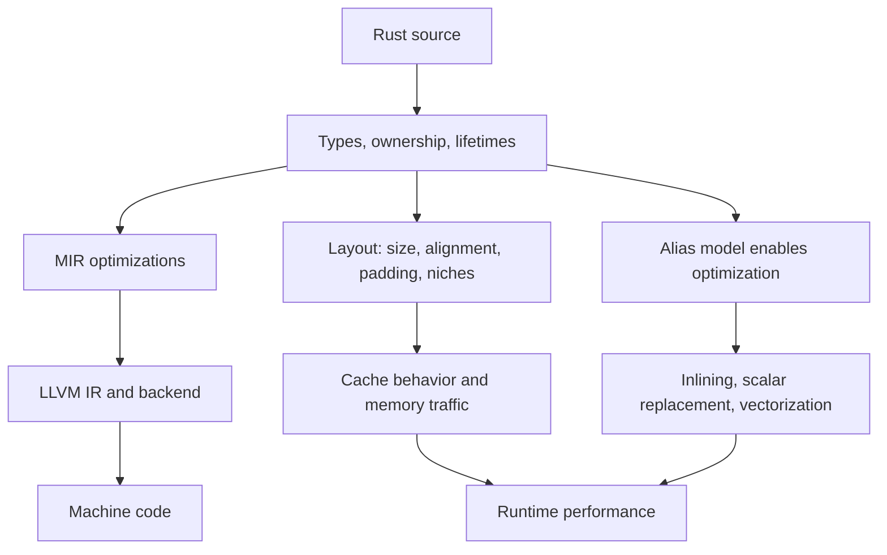
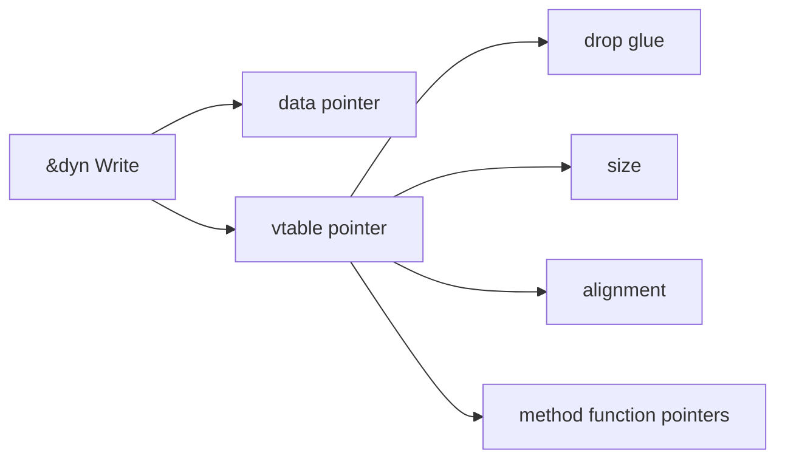
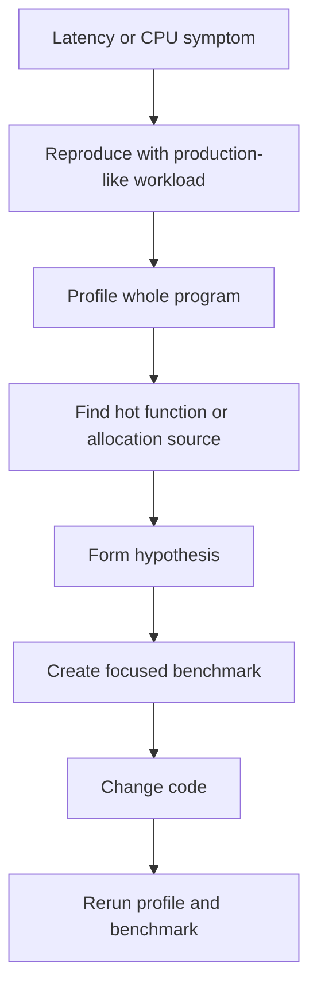

Purpose: build a precise mental model for Rust memory layout, allocation, and performance so abstractions can stay readable without hiding expensive behavior. This note connects ownership, layout, caches, compiler optimizations, profiling, and benchmarking for production Rust systems.

# Memory Layout, Performance, and Zero-Cost Abstractions

Related notes: [02 Ownership Borrowing and Lifetimes](/compendium/rust/ownership-borrowing-and-lifetimes), [04 Error Handling and API Design](/compendium/rust/error-handling-and-api-design), [03 Types Traits and Generics](/compendium/rust/types-traits-and-generics), [07 Concurrency Parallelism and Synchronization](/compendium/rust/concurrency-parallelism-and-synchronization), [01 Rust Language Fundamentals](/compendium/rust/rust-language-fundamentals), [11 Testing Verification Benchmarking and Tooling](/compendium/rust/testing-verification-benchmarking-and-tooling), [04 Error Handling and API Design](/compendium/rust/error-handling-and-api-design), [Rust/09 Unsafe Rust and the Rust Memory Model](/compendium/rust/unsafe-rust-and-the-rust-memory-model), [Data Structures/Data Structures](/compendium/data-structures/data-structures), [Design Patterns/Design patterns](/compendium/design-patterns/design-patterns), <span className="compendium-external-reference" title="Vault-only reference">Littles law and efficient queue strategy</span>.

## Core Claim

Rust performance is mostly a product of explicit data ownership, predictable layout, static dispatch, and the ability to move work out of runtime checks and into compile-time reasoning. The language does not make code fast automatically. It gives the engineer sharper control over allocation, aliasing, lifetimes, representation, and abstraction boundaries.

The phrase "zero cost abstraction" means the abstraction can compile to code comparable to a hand-written lower-level version when used appropriately. It does not mean "always free". Iterator chains, trait objects, async futures, smart pointers, collections, and generic APIs all have concrete layout and control-flow costs that must be understood.

## Mental Model



Rust gives the compiler useful facts:

| Fact | Source in Rust | Performance effect | Risk |
|---|---|---|---|
| A value has a single owner unless borrowed | ownership and move semantics | deterministic destruction, fewer accidental copies | cloning to satisfy the borrow checker can add allocation |
| Shared borrows are read-only at the language level | `&T` | alias analysis can assume no mutation through that reference | interior mutability changes the story |
| Mutable borrows are exclusive | `&mut T` | enables store/load simplification and vectorization | unsafe aliases can cause undefined behavior |
| Types have known sizes unless behind indirection | `Sized`, generics | stack allocation and monomorphization | large stack values can hurt cache or overflow |
| Layout is mostly compiler-chosen by default | `repr(Rust)` | field reordering may reduce padding | cannot expose layout to FFI |
| Drops are deterministic | RAII | no garbage collector pause | drop order and destructor cost matter |

## Stack vs heap

The stack is an automatic storage region for function frames. The heap is a dynamic storage region managed by an allocator. Rust does not decide stack versus heap from "value type" versus "reference type" the way some managed languages do. It depends on how a value is stored.

```rust
fn stack_and_heap() {
    let a: u64 = 42;              // stored in the stack frame
    let pair = (a, 99_u64);       // also in the stack frame
    let boxed = Box::new(pair);   // pair copied or moved into heap allocation
    let vec = vec![1_u64, 2, 3];  // Vec header on stack, buffer on heap

    println!("{boxed:?} {vec:?}");
}
```

Common layouts:

| Expression | Stack contains | Heap contains |
|---|---|---|
| `u64` | the integer | nothing |
| `(u64, u64)` | both integers | nothing |
| `Box&lt;T&gt;` | pointer | one `T` allocation |
| `Vec&lt;T&gt;` | pointer, length, capacity | contiguous buffer of `T` |
| `String` | pointer, length, capacity | UTF-8 bytes |
| `&T` | pointer | borrowed storage elsewhere |
| `&[T]` | pointer and length | borrowed elements elsewhere |
| `&dyn Trait` | data pointer and vtable pointer | value stored elsewhere |

### Stack Strengths

Stack allocation is very cheap because it is usually pointer adjustment in the current thread's stack. It has strong locality because frames are contiguous and recently used. It also has strict lifetime structure: values are destroyed when their scope exits.

### Stack Limits

Large stack values can overflow thread stack limits or push hot data out of cache. Recursive functions must be treated carefully. Moving a large stack value can also be expensive if it becomes a real memory copy after optimization.

```rust
const N: usize = 1024 * 1024;

fn risky_stack() {
    let bytes = [0_u8; N]; // large stack object
    consume(&bytes);
}

fn safer_heap() {
    let bytes = vec![0_u8; N]; // header on stack, backing storage on heap
    consume(&bytes);
}

fn consume(bytes: &[u8]) {
    println!("{}", bytes.len());
}
```

### Heap Strengths

Heap allocation supports dynamic sizes, ownership transfer across scopes, shared ownership, trait objects, recursive types, and stable addresses when required.

### Heap Costs

Heap allocation can involve allocator metadata, locks or thread-local caches, fragmentation, page faults, cache misses, and unpredictable latency. Allocation can dominate small-object workloads.

```rust
fn repeated_allocation(input: &[String]) -> usize {
    input
        .iter()
        .map(|s| s.to_lowercase()) // allocates a new String per item
        .filter(|s| s.starts_with("x"))
        .count()
}

fn allocation_aware(input: &[String]) -> usize {
    input
        .iter()
        .filter(|s| s.as_bytes().first().is_some_and(|b| b.eq_ignore_ascii_case(&b'x')))
        .count()
}
```

## Allocation Behavior

Rust has no hidden tracing garbage collector, but high-level APIs can allocate. Know the difference between a value, a handle, and a backing buffer.

| Operation | Usually allocates? | Notes |
|---|---:|---|
| `Box::new(value)` | yes | one allocation for `value` |
| `Vec::new()` | no | no buffer until capacity is needed |
| `Vec::with_capacity(n)` | yes if `n &gt; 0` | one buffer allocation |
| `vec![x; n]` | yes if `n &gt; 0` | fills a buffer, may clone `x` |
| `String::new()` | no | empty header only |
| `format!(...)` | yes | allocates a `String` |
| `to_string()` on `&str` | yes | allocates a `String` |
| `Iterator::collect::&lt;Vec&lt;_&gt;&gt;()` | usually | may reserve using size hints |
| `Arc::clone(&x)` | no payload allocation | atomic refcount increment |
| `Rc::clone(&x)` | no payload allocation | non-atomic refcount increment |
| `Box&lt;dyn Trait&gt;` | yes for the boxed value | also introduces dynamic dispatch |

### Growth And Reallocation

`Vec` and `String` have length and capacity. Pushing past capacity reallocates and moves elements.

```rust
fn build_lines(input: &[&str]) -> Vec<String> {
    let mut lines = Vec::with_capacity(input.len());

    for item in input {
        let mut line = String::with_capacity(item.len() + 8);
        line.push_str("item: ");
        line.push_str(item);
        lines.push(line);
    }

    lines
}
```

Guidance:

| Pattern | Use when | Avoid when |
|---|---|---|
| `with_capacity` | size is known or cheaply estimated | estimate is wildly high |
| `reserve` | you need at least additional capacity | allocation failure latency matters |
| `reserve_exact` | over-allocation is harmful | repeated growth is expected |
| `shrink_to_fit` | memory release is worth possible reallocation | hot path code |
| arena allocation | many objects share one lifetime | objects need independent destruction |
| object pool | allocation latency dominates | pool complexity exceeds benefit |

## Ownership As Memory Management

Ownership is Rust's primary memory management system. It determines when values are destroyed and who may access them.

```rust
struct Connection {
    fd: i32,
}

impl Drop for Connection {
    fn drop(&mut self) {
        // close(self.fd) in real code
        eprintln!("closing fd {}", self.fd);
    }
}

fn handle(conn: Connection) {
    // this function owns conn
    eprintln!("using fd {}", conn.fd);
} // conn is dropped here
```

The important performance property is not just safety. It is that destruction is deterministic, local, and visible in the type system. You can reason about when buffers, locks, files, sockets, transactions, and temporary allocations are released.

### Moves, Copies, And Clones

Rust moves values by default. A move is a semantic transfer of ownership. After optimization, a move may be a register move, a memory copy, or no instruction at all.

```rust
#[derive(Clone)]
struct Packet {
    bytes: Vec<u8>,
}

fn transfer(packet: Packet) -> Packet {
    packet // ownership moved, buffer not copied
}

fn duplicate(packet: &Packet) -> Packet {
    packet.clone() // Vec buffer is copied
}
```

Common mistake: adding `.clone()` until the borrow checker accepts the code. That may turn a linear ownership transfer into repeated heap allocation.

## RAII

RAII means resource acquisition is initialization. The destructor releases the resource when the value leaves scope.

```rust
use std::sync::{Arc, Mutex};

fn push_metric(metrics: Arc<Mutex<Vec<u64>>>, value: u64) {
    let mut guard = metrics.lock().expect("metrics mutex poisoned");
    guard.push(value);
} // mutex guard is dropped here, unlocking the mutex
```

Production guidance:

| Resource | RAII type | Review concern |
|---|---|---|
| Heap allocation | `Box`, `Vec`, `String` | unnecessary allocation or reallocation |
| File descriptor | `File`, socket types | flush and close semantics |
| Lock | `MutexGuard`, `RwLockReadGuard` | guard held across slow calls or `.await` |
| Transaction | transaction guard | rollback behavior on drop |
| Temporary directory | tempdir guard | cleanup on panic and process abort |

RAII runs on normal scope exit and unwinding panic. It does not run after `std::process::abort`, `mem::forget`, process kill, or many FFI-level failures.

## Alignment And Padding

Every type has a size and alignment.

```rust
use std::mem::{align_of, size_of};

#[repr(C)]
struct Header {
    tag: u8,
    len: u32,
    flags: u16,
}

fn inspect_layout() {
    println!("Header size {}", size_of::<Header>());
    println!("Header align {}", align_of::<Header>());
}
```

Alignment is the address multiple required for efficient and valid access. Padding is unused space inserted so fields start at valid alignments and arrays of the type remain valid.


Field order can change size under `repr(Rust)`, but do not rely on the compiler's chosen field order. If layout is exposed externally, choose an explicit representation and test it.

```rust
use std::mem::size_of;

struct PoorOrder {
    a: u8,
    b: u64,
    c: u8,
}

struct BetterOrder {
    b: u64,
    a: u8,
    c: u8,
}

fn sizes() {
    println!("poor {}", size_of::<PoorOrder>());
    println!("better {}", size_of::<BetterOrder>());
}
```

Tradeoff:

| Goal | Technique | Cost |
|---|---|---|
| Reduce padding | reorder fields by descending alignment | may reduce readability |
| Match C ABI | `#[repr(C)]` | freezes order, can increase size |
| Pack bytes tightly | `#[repr(packed)]` | references to unaligned fields are dangerous |
| Newtype ABI wrapper | `#[repr(transparent)]` | only valid for transparent-compatible wrappers |

## Niche Optimization

A niche is an invalid bit pattern for a type that the compiler can use to encode enum variants without adding a separate tag. This is why `Option&lt;&T&gt;` is usually pointer-sized: a null pointer can represent `None` because references cannot be null.

```rust
use std::mem::size_of;
use std::num::NonZeroUsize;

fn niche_sizes() {
    assert_eq!(size_of::<Option<&u8>>(), size_of::<&u8>());
    assert_eq!(size_of::<Option<NonZeroUsize>>(), size_of::<usize>());
}
```

Useful niche-aware types:

| Type | Invalid value | Useful enum |
|---|---|---|
| `&T` | null | `Option&lt;&T&gt;` |
| `Box&lt;T&gt;` | null | `Option&lt;Box&lt;T&gt;&gt;` |
| `NonNull&lt;T&gt;` | null | `Option&lt;NonNull&lt;T&gt;&gt;` |
| `NonZeroU32` | zero | `Option&lt;NonZeroU32&gt;` |
| `NonZeroUsize` | zero | `Option&lt;NonZeroUsize&gt;` |

Guidance:

| Use niche optimization for | Avoid relying on it when |
|---|---|
| dense internal structs, indexes, handles | ABI or persistence format requires exact bytes |
| optional non-null pointers | unsafe invariants are not well documented |
| reducing enum size in hot arrays | readability loss exceeds memory benefit |

## Fat Pointers

Some pointers carry metadata.

| Pointer | Words | Metadata |
|---|---:|---|
| `&T` | 1 | none |
| `*const T` | 1 | none |
| `&[T]` | 2 | length |
| `&str` | 2 | byte length |
| `&dyn Trait` | 2 | vtable pointer |
| `Box&lt;dyn Trait&gt;` | 2 in the box handle | vtable pointer plus data pointer |

```rust
use std::mem::size_of;

trait Draw {
    fn draw(&self);
}

struct Circle;

impl Draw for Circle {
    fn draw(&self) {}
}

fn pointer_widths(slice: &[u8], text: &str, object: &dyn Draw) {
    println!("slice ref {}", size_of_val(&slice));
    println!("str ref {}", size_of_val(&text));
    println!("trait object ref {}", size_of_val(&object));
}

fn size_of_val<T>(_: &T) -> usize {
    size_of::<T>()
}
```

## Vtables And Dynamic Dispatch

A trait object stores a data pointer and a vtable pointer. The vtable contains function pointers for the concrete implementation, plus metadata such as size, alignment, and drop glue.



```rust
trait Encode {
    fn encode(&self, out: &mut Vec<u8>);
}

fn static_dispatch<T: Encode>(value: &T, out: &mut Vec<u8>) {
    value.encode(out); // monomorphized per T
}

fn dynamic_dispatch(value: &dyn Encode, out: &mut Vec<u8>) {
    value.encode(out); // indirect call through vtable
}
```

Tradeoffs:

| Dispatch | Benefit | Cost | Good fit |
|---|---|---|---|
| Generic static dispatch | inlining, specialization by type, no vtable call | code size from monomorphization | hot paths, small methods |
| Trait object dynamic dispatch | smaller code, heterogeneous collections | indirect call, less inlining | plugin points, large methods, cold paths |
| Enum dispatch | static branch over known variants | enum maintenance and branch | closed set of implementations |

## Zero Cost Abstractions

Zero cost abstractions depend on optimization and representation. In Rust, the main tools are generics, traits, iterators, closures, ownership, RAII, and type states.

```rust
fn sum_loop(values: &[u64]) -> u64 {
    let mut sum = 0;
    for value in values {
        sum += *value;
    }
    sum
}

fn sum_iterator(values: &[u64]) -> u64 {
    values.iter().copied().sum()
}
```

In optimized builds, these often compile to comparable machine code. In debug builds, iterator code can look slower because optimization is limited.

### Iterator Fusion

Iterator adapters are lazy. They often compile into one loop without intermediate allocation.

```rust
fn count_large_even(values: &[u32]) -> usize {
    values
        .iter()
        .copied()
        .filter(|v| v % 2 == 0)
        .filter(|v| *v > 1000)
        .count()
}
```

This does not allocate because no `collect` appears before `count`.

```rust
fn accidental_allocation(values: &[u32]) -> usize {
    values
        .iter()
        .copied()
        .filter(|v| v % 2 == 0)
        .collect::<Vec<_>>() // allocation and copy
        .into_iter()
        .filter(|v| *v > 1000)
        .count()
}
```

### Abstraction Checklist

| Question | Why it matters |
|---|---|
| Does this allocate? | Allocation can dominate runtime and tail latency |
| Is dispatch static or dynamic? | Dynamic dispatch can block inlining |
| Does it copy or clone payload data? | Clones can hide deep allocation |
| Is the hot path generic over large closures? | Monomorphization can increase binary size |
| Does the abstraction preserve locality? | Fragmented object graphs hurt cache performance |
| Does debug performance matter? | Some abstractions depend on release optimization |

## Bounds Checks

Indexing slices and vectors performs bounds checks. The compiler can remove many checks when it can prove indices are valid.

```rust
fn checked_index(values: &[u64], i: usize) -> Option<u64> {
    values.get(i).copied()
}

fn sum_by_index(values: &[u64]) -> u64 {
    let mut sum = 0;
    for i in 0..values.len() {
        sum += values[i]; // usually one provably safe check pattern
    }
    sum
}

fn sum_by_iter(values: &[u64]) -> u64 {
    values.iter().copied().sum() // often easiest for check elimination
}
```

Guidance:

| Pattern | Performance shape |
|---|---|
| `for value in values` | usually best for linear traversal |
| `values.get(i)` | explicit optional access, no panic |
| `values[i]` | panics on out of bounds, check may be removed |
| `unsafe { get_unchecked(i) }` | no check, undefined behavior if wrong |

Do not use `get_unchecked` until profiling proves bounds checks matter and a small safe rewrite cannot remove them. Unsafe unchecked indexing must have a local proof that the index is in bounds.

## Inlining

Inlining removes call overhead and exposes optimization opportunities. It can also increase code size and instruction cache pressure.

```rust
#[inline]
fn clamp_percent(value: u8) -> u8 {
    value.min(100)
}

#[inline(never)]
fn cold_format_error(code: u32) -> String {
    format!("error code {code}")
}
```

Rules of thumb:

| Attribute | Meaning | Use |
|---|---|---|
| no attribute | let the compiler decide | default |
| `#[inline]` | make cross-crate inlining more likely | tiny hot functions in libraries |
| `#[inline(always)]` | force request, not absolute guarantee | rare, measured hot path |
| `#[inline(never)]` | keep out of caller | cold code, profiling clarity |
| `#[cold]` | mark unlikely path | error construction, slow fallback |

Use measurement. Inlining a cold formatting path into a hot loop is a common regression.

## Escape Analysis And Scalar Replacement

Rust does not promise a specific escape analysis optimization, but LLVM can remove allocations or scalar-replace aggregates when it proves the value does not escape and the abstraction is transparent enough.

```rust
#[derive(Clone, Copy)]
struct Point {
    x: f64,
    y: f64,
}

fn distance_squared(a: Point, b: Point) -> f64 {
    let dx = a.x - b.x;
    let dy = a.y - b.y;
    dx * dx + dy * dy
}
```

This style gives the optimizer simple values. Contrast with a pointer-heavy object graph where data escapes through trait objects, shared ownership, or FFI.

```rust
use std::sync::Arc;

trait Metric {
    fn value(&self) -> f64;
}

fn average(metrics: &[Arc<dyn Metric>]) -> f64 {
    let total: f64 = metrics.iter().map(|m| m.value()).sum();
    total / metrics.len() as f64
}
```

The second example may be the right design, but it has indirection, atomics, dynamic dispatch, and poor locality.

## Cache Locality

Modern CPUs are fast when data access is predictable and contiguous. Rust's type system helps express contiguous storage through `Vec&lt;T&gt;`, arrays, slices, and stack structs.

```rust
struct User {
    id: u64,
    score: u32,
    active: bool,
}

fn count_active_high_score(users: &[User]) -> usize {
    users
        .iter()
        .filter(|u| u.active && u.score > 900)
        .count()
}
```

### Array Of Structs Versus Struct Of Arrays

```rust
struct UsersAos {
    users: Vec<User>,
}

struct UsersSoa {
    ids: Vec<u64>,
    scores: Vec<u32>,
    active: Vec<bool>,
}
```

| Layout | Benefit | Cost |
|---|---|---|
| Array of structs | natural modeling, all fields together | wastes bandwidth if only one field is read |
| Struct of arrays | tight scans over one field, SIMD-friendly | more complex invariants, multiple buffers |
| Hybrid hot/cold split | keeps hot fields dense | more code and indexing discipline |

Hot/cold split:

```rust
struct SessionHot {
    last_seen_ms: u64,
    request_count: u32,
    state: u8,
}

struct SessionCold {
    user_agent: String,
    debug_label: Option<String>,
}

struct SessionStore {
    hot: Vec<SessionHot>,
    cold: Vec<SessionCold>,
}
```

This is useful when hot loops touch counters and states but rarely touch strings.

## SIMD Overview

SIMD executes one instruction over multiple lanes. Rust can benefit from auto-vectorization, target-specific intrinsics, portable SIMD on nightly when available, and library implementations.

```rust
fn add_scalar(a: &[f32], b: &[f32], out: &mut [f32]) {
    assert_eq!(a.len(), b.len());
    assert_eq!(a.len(), out.len());

    for ((out, a), b) in out.iter_mut().zip(a).zip(b) {
        *out = *a + *b;
    }
}
```

This loop is vectorization-friendly: contiguous slices, no alias between mutable output and immutable inputs as expressed by safe borrowing, simple arithmetic, and known lengths after assertions.

SIMD guidance:

| Approach | Stability | Use |
|---|---|---|
| Auto-vectorization | stable | first choice for simple loops |
| `std::arch` intrinsics | stable per target | performance-critical target-specific kernels |
| Portable SIMD | may require nightly depending on date and feature state | controlled projects that accept toolchain constraints |
| Crates such as `wide`, `packed_simd` alternatives, domain libraries | varies | when library maintenance is strong |

Always verify generated code or benchmark results. SIMD can lose when data is small, unaligned, branch-heavy, or memory-bandwidth bound.

## Profiling Rust Programs

Profiling answers where time goes. Benchmarking answers whether a change made a workload faster. They are related but not interchangeable.



Recommended workflow:

| Tool | Purpose | Notes |
|---|---|---|
| `cargo build --release` | optimized binary | debug builds mislead performance analysis |
| `perf` on Linux | CPU sampling | needs symbols and permissions |
| `cargo flamegraph` | flamegraph from samples | excellent first-pass visualization |
| `heaptrack`, `dhat`, allocator stats | allocation profiling | platform and allocator dependent |
| `tokio-console` | async task diagnostics | for Tokio applications |
| `criterion` | statistically useful microbenchmarks | compare focused workloads |
| `cargo bloat` | binary size and monomorphization | useful for generic-heavy libraries |
| `cargo asm` or compiler explorer | inspect generated assembly | verify bounds checks, inlining, vectorization |

### Flamegraphs

A flamegraph shows sampled stack traces. Wide frames consume more samples. It does not prove causality by itself, but it quickly highlights where time is spent.

Example commands:

```bash
cargo install flamegraph
cargo flamegraph --bin my-service -- --config local.toml
```

Operational guidance:

| Situation | What to check |
|---|---|
| Wide allocator frames | repeated allocation, formatting, collection growth |
| Wide hashing frames | map key choice, hasher, repeated lookups |
| Wide clone frames | accidental deep clone |
| Wide parsing frames | allocation-heavy parser, validation repeated |
| Wide lock frames | contention, guard scope, blocking in critical section |
| Wide poll frames | async task churn, wake storm, small futures overhead |

## Benchmarking With Criterion

Criterion runs statistical benchmarks and helps avoid noisy single-run conclusions.

Example `benches/parse.rs`:

```rust
use criterion::{black_box, criterion_group, criterion_main, Criterion};

fn parse_ids(input: &str) -> Vec<u64> {
    input
        .split(',')
        .filter_map(|part| part.parse::<u64>().ok())
        .collect()
}

fn bench_parse_ids(c: &mut Criterion) {
    let input = (0..10_000)
        .map(|n| n.to_string())
        .collect::<Vec<_>>()
        .join(",");

    c.bench_function("parse_ids", |b| {
        b.iter(|| parse_ids(black_box(&input)))
    });
}

criterion_group!(benches, bench_parse_ids);
criterion_main!(benches);
```

`Cargo.toml`:

```toml
[dev-dependencies]
criterion = "0.8"

[[bench]]
name = "parse"
harness = false
```

Benchmark review checklist:

| Check | Reason |
|---|---|
| Use `black_box` for inputs and outputs | prevents optimizing away work |
| Benchmark release code | debug numbers are not representative |
| Include realistic input sizes | tiny cases hide allocation and cache effects |
| Separate setup from measured loop | avoids measuring fixture creation |
| Track variance | noisy systems can fake regressions |
| Compare against a baseline | absolute time alone is weak evidence |
| Keep benchmarks in version control | prevents performance archaeology |

## Performance Anti-Patterns

| Anti-pattern | Why it hurts | Better approach |
|---|---|---|
| Cloning to satisfy borrowing | hidden allocation and memory traffic | restructure ownership, borrow narrower, use indices |
| `format!` in a hot loop | allocates and formats repeatedly | write into reusable buffer |
| Collecting mid-iterator | materializes temporary data | keep iterator lazy or preallocate once |
| `Arc&lt;Mutex&lt;T&gt;&gt;` everywhere | atomics, contention, complex ownership | use ownership transfer, channels, sharding |
| Trait objects for tiny hot methods | indirect calls block inlining | generics or enum dispatch |
| Pointer-rich graphs | cache misses and allocator pressure | dense indexes into `Vec` arenas |
| Repeated hash lookups | hashing cost and cache misses | use entry API, store handles, choose map carefully |
| Large enum in dense arrays | every element has max variant size | box cold large variants or split storage |
| Holding locks across slow work | contention and latency spikes | narrow guard scope |
| Async for CPU-bound loops | scheduler overhead, no parallelism by itself | use sync loop or spawn blocking CPU pool |

## Practical Patterns

### Reuse A Buffer

```rust
use std::fmt::Write;

fn render_rows(rows: &[u64]) -> String {
    let mut out = String::with_capacity(rows.len() * 8);

    for row in rows {
        writeln!(&mut out, "row={row}").expect("writing to String cannot fail");
    }

    out
}
```

### Store Handles Instead Of References

```rust
#[derive(Clone, Copy, Debug, Eq, PartialEq, Hash)]
struct NodeId(usize);

struct Node {
    weight: u32,
    edges: Vec<NodeId>,
}

struct Graph {
    nodes: Vec<Node>,
}

impl Graph {
    fn neighbors(&self, id: NodeId) -> &[NodeId] {
        &self.nodes[id.0].edges
    }
}
```

Indexes can avoid self-referential structures, reduce lifetime complexity, and keep storage dense.

### Reduce Lock Scope

```rust
use std::collections::HashMap;
use std::sync::Mutex;

fn get_or_compute(cache: &Mutex<HashMap<String, u64>>, key: &str) -> u64 {
    if let Some(value) = cache.lock().expect("cache poisoned").get(key).copied() {
        return value;
    }

    let value = expensive_compute(key);
    cache
        .lock()
        .expect("cache poisoned")
        .insert(key.to_owned(), value);
    value
}

fn expensive_compute(key: &str) -> u64 {
    key.len() as u64
}
```

This example avoids holding the lock while computing. It may compute duplicate values under races. That can be acceptable when duplicate work is cheaper than broad locking.

## Experimental Method for Performance Work

A performance claim needs a workload, environment, metric, baseline, and uncertainty. Start with a user-visible budget such as p99 latency, throughput at a fixed concurrency, peak resident memory, CPU seconds per job, or energy per unit of work.

Use this sequence:

1. Freeze correctness tests and define the representative input distribution.
2. Record toolchain, target, features, profile, CPU governor, machine model, and relevant kernel settings.
3. Measure the end-to-end baseline before isolating a suspected component.
4. Profile wall time, CPU samples, allocation, locks, I/O, and hardware counters as appropriate.
5. Form one causal hypothesis and change one relevant variable.
6. Repeat enough samples to distinguish the effect from noise.
7. Confirm the whole-system metric and check for regressions in memory, tails, portability, and correctness.

Microbenchmarks should isolate stable work, use `black_box` where compiler elimination is plausible, and avoid timing setup unless setup is the subject. Report distributions or confidence intervals rather than only the fastest observation.

## Cache Locality and False Sharing

Cache behavior often dominates arithmetic cost. Sequential access through compact data usually beats pointer chasing, even when both designs have the same asymptotic complexity.

False sharing occurs when independent values written by different cores occupy the same cache line. The program has no logical lock contention, but cache-coherence traffic serializes progress. Diagnose it with scaling curves and hardware counters, then consider sharding, per-thread accumulation, ownership transfer, or cache padding. A hard-coded alignment is architecture-specific; a reviewed abstraction such as `crossbeam_utils::CachePadded` communicates intent better.

Structure-of-arrays layouts help when a hot loop touches only a subset of fields. Array-of-structures layouts help when each operation consumes most fields of one entity. Measure both with realistic traversal and update patterns.

## NUMA and Thread Placement

On a non-uniform memory access system, a core reaches some memory controllers faster than others. Cross-socket traffic can dominate a well-vectorized algorithm, especially for large shared structures.

NUMA behavior is an operating-system and machine property, not a Rust guarantee. Common Linux policies place physical pages according to first touch, so initialization thread placement can influence later access cost. Validate the actual policy rather than assuming it.

- Partition long-lived data and workers by NUMA node when the workload has a natural shard key.
- Initialize large buffers from the threads or nodes that will process them.
- Avoid one globally mutated allocator-heavy structure when per-node ownership and periodic merge preserve semantics.
- Thread pinning can improve locality but can also reduce scheduler flexibility and worsen imbalance.
- Record CPU topology, affinity, memory policy, page size, and cross-node counters with every NUMA benchmark.
- Measure tail latency and throughput under the deployed socket count; a single-socket development machine cannot validate the design.

NUMA optimization belongs after algorithm, allocation, and contention profiling. It can make portable code platform-specific, so isolate topology policy from the core algorithm.

## Allocation Strategy and Fallibility

Allocation optimization is about frequency, size distribution, contention, and lifetime.

- Use `with_capacity` when a trustworthy upper estimate exists; excessive reserve raises peak memory and cache pressure.
- Reuse owned buffers across iterations when this does not retain pathological high-water capacity forever.
- `reserve` may abort or panic according to allocator behavior; `try_reserve` exposes capacity failure where the application can recover.
- Arena allocation makes bulk teardown cheap but does not remove destructor, retention, or reference-validity concerns.
- Small-vector and string-interning designs trade branches, larger element size, or global coordination for fewer allocations.
- A different global allocator can change contention and fragmentation, but it cannot repair unnecessary ownership churn.

Measure allocations with an allocator profiler or scoped counter rather than inferring them only from source code.

## Aliasing, Bounds Checks, and Vectorization

Rust references carry validity and aliasing promises that optimizers may exploit. An exclusive `&mut T` must not overlap active accesses that violate its contract. Breaking that promise in unsafe code is undefined behavior even if the generated code appears correct in a debug build.

Before using unchecked indexing:

1. Inspect optimized assembly or compiler reports to see whether checks remain.
2. Restructure the loop with iterators, slices, `chunks_exact`, or a single precondition that allows check elimination.
3. Benchmark the safe version.
4. If unsafe code is still material, state the bounds invariant next to the operation and test it with Miri, sanitizers, and adversarial lengths.

Safe iterators often vectorize well because they expose a monotonic traversal without repeated opaque indexing.

## PGO, LTO, and CPU Targeting

Link-time optimization improves cross-crate optimization at the cost of build time and memory. Profile-guided optimization uses recorded workload behavior to guide layout and inlining. Both must be evaluated on the final artifact with production-like inputs.

`-C target-cpu=native` may enable instructions unavailable on deployment machines. Use it for machine-local binaries or homogeneous fleets with an explicit CPU baseline. For portable distribution, select a documented target CPU or use runtime feature detection and multiversioning for narrow kernels.

Post-link optimizers such as BOLT can improve code layout on supported platforms after collecting profiles. They add another artifact transformation, so retain debuginfo mappings, provenance, and reproducible release steps.

## Production Guidance

| Area | Guidance |
|---|---|
| API design | Accept `&str`, `&[T]`, and generic iterators when callers should not allocate |
| Ownership | Prefer ownership transfer over `Arc` unless sharing is required |
| Collections | Preallocate when cardinality is known, but avoid huge speculative reserves |
| Layout | Measure `size_of` for dense structs and enums |
| Dispatch | Use generics in hot paths and trait objects at architectural boundaries |
| Caches | Optimize data layout before micro-optimizing arithmetic |
| Async | Measure task counts, wakeups, and allocation per request |
| Errors | Keep rich errors on cold paths; avoid formatting unless needed |
| Build | Profile with release settings and representative features |
| Safety | Do not replace safe code with unsafe code for speed without a benchmark and proof |

## Review Checklist

- Does this change introduce a new allocation in a hot path?
- Does a `.clone()` copy heap-backed data or just a cheap handle?
- Are buffers reused where repeated formatting or parsing occurs?
- Are `Vec` and `String` capacities chosen intentionally?
- Does the data layout match the traversal pattern?
- Are large structs or enums stored densely in arrays without measuring size?
- Are trait objects used in code that needs inlining?
- Are bounds checks visible in profiles, or is unsafe indexing premature?
- Are locks held across I/O, logging, allocation, or `.await`?
- Are benchmarks realistic, checked into the repo, and run in release mode?
- Was the whole program profiled before micro-optimizing?
- Did a performance change preserve safety invariants covered in [Rust/09 Unsafe Rust and the Rust Memory Model](/compendium/rust/unsafe-rust-and-the-rust-memory-model)?

## Common Mistakes

1. Assuming "Rust is fast" means any Rust code is fast.
2. Treating stack allocation as infinite or always better.
3. Treating heap allocation as always bad, even when it simplifies ownership and reduces copies.
4. Adding `Arc&lt;Mutex&lt;_&gt;&gt;` before deciding who should own the data.
5. Measuring debug builds.
6. Ignoring allocation in `format!`, `to_string`, `collect`, and parser combinators.
7. Trusting microbenchmarks that do not resemble production inputs.
8. Reading a flamegraph as a complete explanation rather than a map of where to investigate.
9. Using unsafe unchecked indexing before proving bounds checks are material.
10. Freezing `repr(C)` layout for internal types without an ABI reason.

## Field Notes

For serious Rust systems, the highest leverage performance work is usually:

1. Remove accidental allocation.
2. Improve data locality.
3. Reduce synchronization scope.
4. Keep hot code monomorphic and inlinable.
5. Use profiling to guide changes.
6. Use Criterion to guard focused improvements.
7. Keep unsafe optimizations rare, documented, and reviewed with the same rigor as security-sensitive code.

## Primary Sources

- [The Rust Performance Book](https://nnethercote.github.io/perf-book/)
- [rustc book: profile-guided optimization](https://doc.rust-lang.org/rustc/profile-guided-optimization.html)
- [rustc book: code generation options](https://doc.rust-lang.org/rustc/codegen-options/index.html)
- [Criterion.rs documentation](https://bheisler.github.io/criterion.rs/book/)
- [Cargo Reference: profiles](https://doc.rust-lang.org/cargo/reference/profiles.html)
- [LLVM BOLT documentation](https://github.com/llvm/llvm-project/blob/main/bolt/README.md)
- [Linux `perf` documentation](https://perfwiki.github.io/main/)
- [Linux NUMA memory policy](https://docs.kernel.org/admin-guide/mm/numa_memory_policy.html)
