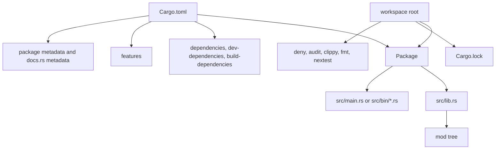
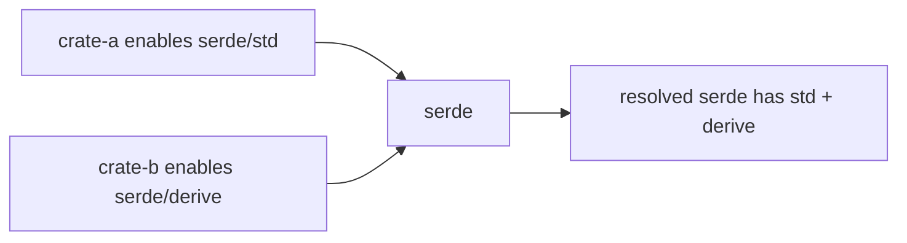

Purpose: Build a production mental model for Rust package structure, module boundaries, Cargo manifests, dependency policy, feature design, workspaces, toolchains, documentation, and cross compilation.

# Modules, Crates, Cargo, and Workspaces

Related notes: [Rust](/compendium/rust/rust), [02 Ownership Borrowing and Lifetimes](/compendium/rust/ownership-borrowing-and-lifetimes), [01 Rust Language Fundamentals](/compendium/rust/rust-language-fundamentals), [04 Error Handling and API Design](/compendium/rust/error-handling-and-api-design), [08 Async Rust Futures Tokio and Runtimes](/compendium/rust/async-rust-futures-tokio-and-runtimes), [11 Testing Verification Benchmarking and Tooling](/compendium/rust/testing-verification-benchmarking-and-tooling), <span className="compendium-external-reference" title="Vault-only reference">Software Supply Chain Security</span>, [Software Engineering/12 Delivery Migrations and Release Engineering](/compendium/software-engineering/delivery-migrations-and-release-engineering).

## Core model

Rust has several layers that are easy to confuse:

| Term | What it means | Common file | Production concern |
|---|---|---|---|
| Package | A Cargo unit described by one `Cargo.toml`. | `Cargo.toml` | Versioning, dependencies, features, publish metadata. |
| Crate | A compilation unit. A package can contain one library crate and multiple binary crates. | `src/lib.rs`, `src/main.rs`, `src/bin/*.rs` | Public API shape, compile time, link behavior. |
| Module | A namespace inside a crate. | `mod.rs`, `foo.rs`, `foo/mod.rs` | Encapsulation, test locality, readability. |
| Workspace | A set of related packages sharing a lockfile and target directory. | root `Cargo.toml` | Dependency convergence, CI scale, shared policy. |
| Target | A build output or build platform. | `--target`, `[target.*]` | Cross compilation, platform conditional dependencies. |

Cargo is not only a build command. It is the source of truth for package metadata, resolver behavior, feature selection, dev tooling, docs.rs output, security policy, and reproducible builds. Treat `Cargo.toml` as production configuration, not scaffolding.



## Cargo.toml anatomy

A serious crate manifest should make policy explicit:

```toml
[package]
name = "payments-core"
version = "0.3.0"
edition = "2024"
rust-version = "1.85"
license = "MIT OR Apache-2.0"
repository = "https://example.invalid/payments"
description = "Core payment state machine and validation rules."
publish = false

[lib]
name = "payments_core"
path = "src/lib.rs"

[dependencies]
serde = { version = "1", features = ["derive"], optional = true }
thiserror = "2"
time = { version = "0.3", default-features = false, features = ["formatting", "parsing"] }

[dev-dependencies]
proptest = "1"
serde_json = "1"

[build-dependencies]
vergen = { version = "10", optional = true }

[features]
default = ["std"]
std = ["time/std"]
json = ["dep:serde"]
build-info = ["dep:vergen"]
```

Important fields:

| Field | Why it matters |
|---|---|
| `edition` | Selects language edition semantics. Keep new crates on the current project standard. |
| `rust-version` | Defines the minimum supported Rust version, often called MSRV. CI should verify it if compatibility matters. |
| `publish` | Prevents accidental `cargo publish` for internal crates. |
| `license` | Required for responsible reuse. Prefer SPDX expressions. |
| `default-features = false` | Prevents inherited dependency behavior from silently adding `std`, TLS stacks, compression, or runtime choices. |
| `optional = true` plus `dep:name` | Makes optional dependencies part of explicit feature surfaces. |

Common mistake: putting runtime configuration in features. Cargo features are compile-time graph switches. Use environment variables, config files, CLI flags, or typed settings for deployment behavior.

## Module structure

Modules define the crate's internal map. The module tree starts at `src/lib.rs` for libraries and `src/main.rs` for binaries.

```rust
// src/lib.rs
pub mod invoice;
mod money;

pub use money::{Currency, Money};
```

```rust
// src/money.rs
#[derive(Debug, Clone, PartialEq, Eq)]
pub struct Money {
    cents: i64,
    currency: Currency,
}

#[derive(Debug, Clone, Copy, PartialEq, Eq)]
pub enum Currency {
    Usd,
    Eur,
}

impl Money {
    pub fn new(cents: i64, currency: Currency) -> Self {
        Self { cents, currency }
    }

    pub fn cents(&self) -> i64 {
        self.cents
    }
}
```

Visibility is a design tool:

| Visibility | Meaning | Use |
|---|---|---|
| private | Visible only to current module and children. | Default for invariants and helpers. |
| `pub(crate)` | Visible inside the crate. | Internal collaboration across modules. |
| `pub(super)` | Visible to parent module. | Tight module families. |
| `pub(in crate::path)` | Visible to a specific ancestor path. | Carefully scoped subsystem internals. |
| `pub` | Public API outside the crate. | Stable contract that requires review. |

Prefer small modules with explicit re-exports over a flat public namespace. A useful pattern is:

```rust
// src/lib.rs
mod parser;
mod token;

pub mod ast;

pub use parser::{ParseError, Parser};
pub use token::Span;
```

This lets consumers depend on stable entry points while internal file organization remains changeable.

## Crate architecture

Split crates when boundaries are real:

| Split reason | Good crate split | Weak crate split |
|---|---|---|
| Reuse | `domain-core` used by API, CLI, and tests. | `utils` as a dumping ground. |
| Compile cost | Large proc macro or integration layer isolated. | Tiny modules split only by topic. |
| Platform | `core` is portable, `agent-linux` owns Linux APIs. | Conditional code scattered everywhere. |
| Semver | Public SDK versioned separately from server implementation. | Internal modules published by accident. |
| Dependency risk | Keep OpenSSL, database, or runtime dependencies out of pure core. | Every crate depends on every shared helper. |

Do not split crates just because a file is long. Split when it improves dependency direction, API ownership, build time, platform support, or release cadence.

## Workspaces

A workspace shares one dependency resolution context and one lockfile. Use resolver version 2 or 3 depending on edition and Cargo support expectations.

```toml
[workspace]
members = [
    "crates/domain",
    "crates/api",
    "crates/cli",
    "xtask",
]
resolver = "3"

[workspace.package]
edition = "2024"
rust-version = "1.85"
license = "MIT OR Apache-2.0"
repository = "https://example.invalid/product"

[workspace.dependencies]
anyhow = "1"
serde = { version = "1", features = ["derive"] }
thiserror = "2"
tokio = { version = "1", default-features = false }
```

Member crates can inherit:

```toml
[package]
name = "product-api"
version = "0.3.0"
edition.workspace = true
rust-version.workspace = true
license.workspace = true
repository.workspace = true

[dependencies]
anyhow.workspace = true
serde.workspace = true
tokio = { workspace = true, features = ["rt-multi-thread", "macros"] }
product-domain = { path = "../domain" }
```

Workspace guidance:

| Practice | Reason |
|---|---|
| Keep the root lockfile committed for applications and internal services. | CI and deployment should resolve the same graph. |
| Use `[workspace.dependencies]` for shared version convergence. | Prevents version drift and duplicated transitive trees. |
| Keep examples and test utilities in members only when CI should build them. | Workspace membership controls validation cost. |
| Avoid cyclic conceptual dependencies even if Cargo prevents crate cycles. | Layering problems show up as feature leaks and test pain. |
| Use `cargo metadata` in automation instead of parsing manifests manually. | Cargo metadata understands inherited fields and resolver output. |

## Dependency management

Dependency choice is an architectural decision. Every dependency imports code, maintainers, licenses, transitive dependencies, build scripts, and sometimes native toolchains.

Checklist before adding a dependency:

- Does the standard library already solve it clearly?
- Is the crate maintained, documented, and tested?
- Does it require unsafe code, build scripts, native libraries, or network access during build?
- Are default features acceptable?
- Is the license acceptable for the product?
- Is the crate needed in production, tests, or build scripts only?
- Can the dependency be hidden behind an internal trait to avoid public API lock-in?

Use exact dependency sections:

| Section | Compiled for | Examples |
|---|---|---|
| `[dependencies]` | Normal crate build. | `serde`, `thiserror`, `tokio`. |
| `[dev-dependencies]` | Tests, examples, benchmarks. | `proptest`, `criterion`, `insta`. |
| `[build-dependencies]` | `build.rs` only. | `cc`, `prost-build`, `tonic-build`. |
| `[target.'cfg(...)'.dependencies]` | Specific target platforms. | `windows`, `nix`, `libc`. |

Target-specific example:

```toml
[target.'cfg(target_os = "linux")'.dependencies]
nix = { version = "0.31", default-features = false, features = ["process", "signal"] }

[target.'cfg(windows)'.dependencies]
windows = { version = "0.62", features = ["Win32_System_Threading"] }
```

Use `cargo tree` to inspect what actually happened:

```bash
cargo tree
cargo tree -e features
cargo tree -i serde
cargo tree --duplicates
```

## Features and feature unification

Cargo features are additive compile-time flags. Once any crate in the graph enables a feature for a package version, that feature is enabled for all uses of that package version in that resolver context. This is feature unification.



Feature unification prevents contradictory builds of the same package version, but it means features cannot be used as exclusive choices.

Bad feature design:

```toml
[features]
postgres = []
mysql = []
```

This suggests exclusivity, but consumers can enable both. Prefer explicit runtime enum selection, separate crates, or compile-time checks if the product truly supports only one backend.

Better additive design:

```toml
[features]
default = ["rustls"]
rustls = ["dep:rustls"]
native-tls = ["dep:native-tls"]
json = ["dep:serde", "dep:serde_json"]
metrics = ["dep:metrics"]

[dependencies]
rustls = { version = "0.23", optional = true }
native-tls = { version = "0.2", optional = true }
serde = { version = "1", features = ["derive"], optional = true }
serde_json = { version = "1", optional = true }
metrics = { version = "0.24", optional = true }
```

Guard mutually exclusive features if necessary:

```rust
#[cfg(all(feature = "rustls", feature = "native-tls"))]
compile_error!("features `rustls` and `native-tls` cannot be enabled together");
```

Feature review checklist:

- Are features additive?
- Are default features minimal and justified?
- Does disabling default features still compile?
- Are optional dependencies hidden behind `dep:name`?
- Is every feature tested in CI, at least for default, no-default, and common combinations?
- Are public APIs gated consistently with docs?
- Does docs.rs build expose the intended feature set?

## Toolchains with rustup

`rustup` manages installed Rust toolchains, components, and compilation targets.

Useful commands:

```bash
rustup show
rustup update stable
rustup toolchain install 1.96.0
rustup component add rustfmt clippy
rustup target add x86_64-unknown-linux-musl
```

Pin toolchains with `rust-toolchain.toml` when repeatability matters:

```toml
[toolchain]
channel = "1.96.0"
components = ["rustfmt", "clippy"]
targets = ["x86_64-unknown-linux-gnu", "x86_64-unknown-linux-musl"]
profile = "minimal"
```

Tradeoffs:

| Strategy | Benefit | Cost |
|---|---|---|
| Floating stable | Easy upgrades and security fixes. | CI can break on newly released lints or compiler changes. |
| Pinned stable version | Reproducible local and CI behavior. | Requires intentional update process. |
| MSRV plus latest stable CI | Supports downstream users while catching future breakage. | More CI time. |
| Nightly | Access to unstable tools or language features. | Higher churn, not suitable as default for conservative libraries. |

## Fast local loops

`cargo check` performs type checking without producing final binaries. It is the main edit loop command.

```bash
cargo check --workspace --all-targets
cargo test --workspace
cargo clippy --workspace --all-targets -- -D warnings
cargo fmt --all -- --check
```

Local command meaning:

| Command | Main value |
|---|---|
| `cargo check` | Fast compile feedback, catches type and borrow errors. |
| `cargo test` | Builds tests and runs unit, integration, and doc tests by default. |
| `cargo clippy` | Lints suspicious code, API mistakes, needless clones, and style issues. |
| `cargo fmt` | Applies rustfmt formatting. |
| `cargo doc` | Builds local rustdoc output. |

Make warnings fail in CI, but be deliberate locally. A team that always ignores warnings has no warning budget.

## rustfmt

`rustfmt` standardizes formatting so review focuses on behavior. Keep `rustfmt.toml` small unless the team has a strong reason.

```toml
edition = "2024"
max_width = 100
newline_style = "Unix"
```

Avoid unstable formatting options unless the project already requires nightly formatting. Formatting should be boring and reproducible.

## rustdoc and docs.rs

Rust documentation is part of the API. Public items should explain invariants, errors, panics, examples, and feature gates.

```rust
/// Money in the smallest currency unit.
///
/// Values are stored as cents for currencies that use two decimal places.
/// This type does not perform currency conversion.
///
/// # Examples
///
/// ```
/// use payments_core::{Currency, Money};
///
/// let price = Money::new(1299, Currency::Usd);
/// assert_eq!(price.cents(), 1299);
/// ```
#[derive(Debug, Clone, PartialEq, Eq)]
pub struct Money {
    cents: i64,
    currency: Currency,
}
```

docs.rs can be configured in manifest metadata:

```toml
[package.metadata.docs.rs]
all-features = true
rustdoc-args = ["--cfg", "docsrs"]
targets = ["x86_64-unknown-linux-gnu"]
```

Feature-gated docs:

```rust
#![cfg_attr(docsrs, feature(doc_cfg))]

#[cfg(feature = "json")]
#[cfg_attr(docsrs, doc(cfg(feature = "json")))]
pub fn to_json<T: serde::Serialize>(value: &T) -> serde_json::Result<String> {
    serde_json::to_string(value)
}
```

Documentation checklist:

- Does every public type describe its invariant?
- Do fallible functions document errors?
- Do panicking functions document panics?
- Do examples compile as doc tests?
- Are feature-gated APIs visible and labeled in docs.rs?
- Does `cargo doc --workspace --no-deps` pass in CI?

## Security and supply chain policy

Cargo gives you the graph. You still need policy tools.

| Tool | What it checks | Typical command |
|---|---|---|
| `cargo-deny` | Licenses, advisories, banned crates, duplicate versions, source policy. | `cargo deny check` |
| `cargo-audit` | RustSec advisories for dependencies. | `cargo audit` |
| `cargo vet` | Human review attestations for dependencies. | `cargo vet` |
| `cargo tree` | Dependency graph and feature graph visibility. | `cargo tree -e features` |

Example `deny.toml` fragments:

```toml
[advisories]
db-path = "~/.cargo/advisory-db"
unmaintained = "workspace"
yanked = "deny"

[licenses]
allow = ["Apache-2.0", "MIT", "BSD-3-Clause"]
confidence-threshold = 0.8

[bans]
multiple-versions = "warn"
wildcards = "deny"
```

Production rule: do not accept a dependency graph that the team cannot explain. The graph is shipped code.

## Cross compilation

Rust separates host from target:

| Term | Meaning |
|---|---|
| Host | Platform running the compiler. |
| Target | Platform the output will run on. |
| Build script target | `build.rs` executes on host but emits instructions for target builds. |

Basic cross compilation:

```bash
rustup target add x86_64-unknown-linux-musl
cargo build --release --target x86_64-unknown-linux-musl
```

Cross compilation becomes harder when dependencies use native libraries, C compilers, pkg-config, OpenSSL, system headers, or target-specific linkers. Prefer pure Rust TLS stacks such as rustls when portability matters, but decide based on product constraints.

Configuration example:

```toml
# .cargo/config.toml
[target.x86_64-unknown-linux-musl]
linker = "x86_64-linux-musl-gcc"

[build]
target-dir = "target"
```

Use dedicated tooling when the native stack is heavy:

| Tool | Use |
|---|---|
| `cross` | Containerized cross builds for common targets. |
| Zig linker | Practical cross linking for some Linux targets. |
| target-specific CI runners | Best for platform tests that must execute. |

Cross compilation checklist:

- Does the crate compile for the target?
- Do tests actually run on the target or only compile?
- Are target-specific dependencies isolated under `[target.'cfg(...)'.dependencies]`?
- Are build scripts deterministic?
- Are native libraries available for the target?
- Does the release artifact include the expected libc and TLS assumptions?

## Resolver Version 3 and MSRV Discipline

Cargo resolver version 3 uses a dependency fallback policy that considers each candidate package's `rust-version`. This reduces accidental selection of a dependency release that is too new for the workspace compiler, but it does not prove the declared minimum supported Rust version, or MSRV.

Use a deliberate matrix:

| Lane | Purpose | Typical command |
|---|---|---|
| Pinned MSRV | Prove the oldest supported compiler builds the promised surface | `cargo +1.85.0 check --workspace --all-targets` |
| Stable | Exercise the normal developer toolchain | `cargo +stable test --workspace --all-targets` |
| Beta or nightly | Detect future compiler and lint changes early | `cargo +beta check --workspace --all-targets` |
| Minimal feature sets | Find accidental feature assumptions | `cargo hack check --feature-powerset --depth 2` |

`rust-version` belongs in package metadata and should match CI reality. Resolver fallback is not a substitute for an MSRV build because build scripts, proc macros, target-specific code, dev dependencies, and enabled features may still require a newer compiler.

For a virtual workspace, declare `resolver = "3"` explicitly. In a non-virtual workspace, an Edition 2024 root package implies resolver 3, but explicit workspace policy is easier to audit.

## Feature Powersets and API Surfaces

Cargo features are additive within a resolved graph. Test more than `--all-features`, because that configuration can hide missing feature gates and can be invalid when a project has deliberately exclusive integration adapters.

Recommended lanes include:

```bash
cargo check --workspace --no-default-features
cargo check --workspace --all-features
cargo hack check --workspace --each-feature
cargo hack test --workspace --feature-powerset --depth 2
```

If two modes are truly incompatible, prefer separate crates or runtime configuration. When separation is impossible, use a clear `compile_error!` guard and test each supported combination explicitly.

Public API exists under every supported feature set. Run rustdoc for important configurations and use `doc(cfg(...))` annotations where platform or feature availability would otherwise surprise readers.

## Workspace Lints and Release Profiles

Centralize policy without hiding crate-specific exceptions:

```toml
[workspace.lints.rust]
unsafe_code = "deny"
missing_docs = "warn"

[workspace.lints.clippy]
unwrap_used = "warn"

[profile.release]
codegen-units = 1
lto = "thin"
debug = "line-tables-only"

[profile.release.package.image-codec]
opt-level = 3
```

Member crates opt in with `[lints] workspace = true`. Profile declarations are read from the workspace root; profile sections in dependency manifests are ignored. Treat `panic = "abort"`, full LTO, symbol stripping, and CPU-specific code generation as artifact policies with benchmark and debugging consequences, not universal upgrades.

## Build Scripts and Generated Artifacts

Build scripts run host code during a build and therefore belong in the supply-chain threat model. Keep them deterministic and narrow.

- Emit `cargo::rerun-if-changed=...` and `cargo::rerun-if-env-changed=...` so rebuild triggers are explicit.
- Write generated files only beneath `OUT_DIR`; do not mutate source files during a normal build.
- Avoid network access. Fetch and verify inputs before the Cargo build.
- Use the `links` key when a crate uniquely owns a native library linkage contract.
- Forward configuration through documented `cargo::rustc-cfg` and `cargo::rustc-env` values, and declare expected cfg names with `cargo::rustc-check-cfg`.
- Test cross compilation because the build script runs for the host while it configures code for the target.

## Locked, Offline, and Vendored Builds

The flags express different guarantees:

| Flag | Guarantee |
|---|---|
| `--locked` | Refuse to change `Cargo.lock` |
| `--offline` | Refuse network access, using only the local cache |
| `--frozen` | Apply both locked and offline behavior |

For controlled or disconnected environments, `cargo vendor` can copy registry and Git sources into a local directory and emit source-replacement configuration. Commit or package the vendor tree only with a maintenance policy for checksums, licenses, and security updates. A cache or vendor directory improves availability; it does not independently establish provenance.

## API Compatibility Gates

Before releasing a library:

1. Build docs for the public feature configurations.
2. Compare the public API against the last release with `cargo-semver-checks`.
3. Review trait behavior, panic contracts, feature semantics, MSRV, and serialized formats manually.
4. Package locally with `cargo package`, inspect the file list, and run the packaged crate's verification.
5. Publish only from a clean, reviewed commit and record the resulting checksum and tag.

Semver tools detect many structural changes, but they cannot prove behavioral compatibility or downstream trait coherence in every case.

## Common mistakes

| Mistake | Consequence | Fix |
|---|---|---|
| Publishing internal crates accidentally. | Private APIs leak or names are reserved. | Set `publish = false`. |
| Relying on default dependency features. | Hidden TLS, runtime, or `std` choices. | Set `default-features = false` deliberately. |
| Using features as mutually exclusive runtime modes. | Feature unification enables incompatible combinations. | Use additive features, separate crates, or compile-time guards. |
| Making every module public. | Internal invariants become API commitments. | Re-export only stable entry points. |
| Ignoring docs.rs. | Public API docs fail or hide important feature surfaces. | Configure docs.rs metadata and run docs in CI. |
| Treating `cargo check` as enough. | Tests, doctests, lints, docs, and release builds can fail later. | Use staged quality gates. |
| Letting workspace dependency versions drift. | Larger binary, patch inconsistency, confusing audit output. | Use `[workspace.dependencies]` and `cargo tree --duplicates`. |

## Production guidance

- Keep domain logic in library crates and thin binaries in `src/main.rs`.
- Use `pub(crate)` as the default collaboration boundary for internal modules.
- Centralize dependency versions at workspace root for larger systems.
- Keep features additive and small.
- Commit `Cargo.lock` for applications, CLIs, and services.
- For libraries, decide intentionally whether to commit `Cargo.lock`; crates.io ignores it for consumers, but repositories may still use it for CI repeatability.
- Run `cargo check --workspace --all-targets` before deeper tests.
- Run `cargo clippy`, `cargo fmt`, `cargo test`, `cargo doc`, `cargo deny`, and `cargo audit` in CI quality gates.
- Pin a toolchain if local and CI drift is expensive.
- Build release artifacts in an environment close to production, especially for native dependencies.

## Review checklist

- Does the crate graph have clear layers?
- Are public re-exports intentional?
- Are dependency sections correct?
- Are default features minimized?
- Are optional features additive and tested?
- Is `Cargo.lock` handled according to application or library policy?
- Does docs.rs metadata match the public API strategy?
- Are cross-target dependencies isolated?
- Do CI commands cover `cargo check`, `cargo test`, `cargo clippy`, `cargo fmt`, rustdoc, cargo-deny, cargo-audit, and target builds?
- Can a new engineer explain the module tree from `src/lib.rs` without reading every file?

## Primary Sources

- [The Cargo Book](https://doc.rust-lang.org/cargo/)
- [Cargo Reference: resolver versions](https://doc.rust-lang.org/cargo/reference/resolver.html)
- [Edition Guide: Cargo resolver 3](https://doc.rust-lang.org/edition-guide/rust-2024/cargo-resolver.html)
- [Cargo Reference: features](https://doc.rust-lang.org/cargo/reference/features.html)
- [Cargo Reference: build scripts](https://doc.rust-lang.org/cargo/reference/build-scripts.html)
- [Cargo Reference: profiles](https://doc.rust-lang.org/cargo/reference/profiles.html)
- [Cargo Reference: source replacement](https://doc.rust-lang.org/cargo/reference/source-replacement.html)
- [`cargo-hack`](https://github.com/taiki-e/cargo-hack)
- [`cargo-semver-checks`](https://github.com/obi1kenobi/cargo-semver-checks)
